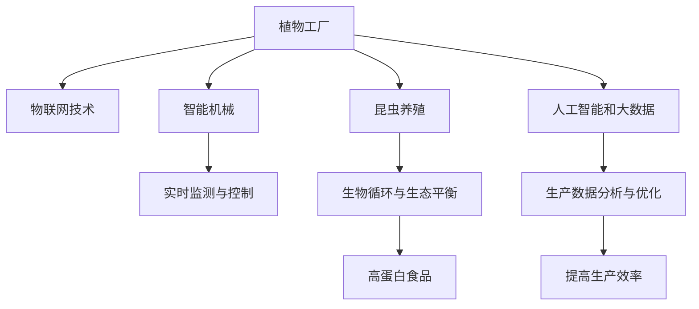

                 

# 未来的智慧农业：2050年的植物工厂与昆虫养殖

## 1. 背景介绍

### 1.1 问题由来

随着全球人口的不断增长和土地资源的日益紧张，传统的农业生产方式已经无法满足未来的需求。为解决这一问题，智慧农业应运而生，通过引入先进的物联网技术、人工智能和大数据等手段，优化农业生产流程，提升农业生产效率。而其中的植物工厂和昆虫养殖技术，则是智慧农业领域中最具革命性的突破之一。

植物工厂是一种高度自动化、高效率的农业生产系统，通过光控环境、智能灌溉、自动化机械等技术，可以在封闭的室内环境中实现高效、稳定、可控的作物生产。昆虫养殖则是通过人工培育和管理昆虫，利用它们在生物循环和生态平衡中的作用，提供高蛋白食品来源，同时减少化学农药的使用，实现可持续农业。

### 1.2 问题核心关键点

植物工厂和昆虫养殖技术的核心在于其高度自动化和智能化。通过物联网设备和智能算法，植物工厂和昆虫养殖系统可以实时监测环境参数，如温度、湿度、光照、土壤湿度等，并通过控制机械自动调节，确保作物和昆虫的生长条件最优。此外，大数据和机器学习技术在分析大量生产数据中发挥了关键作用，帮助优化生产流程，提高作物和昆虫的生长速度和品质。

这些技术不仅极大地提高了农业生产的效率和可持续性，也为我们探索未来农业提供了新的思路。通过本文，我们将系统探讨智慧农业的核心概念、关键算法、实际应用以及未来展望。

## 2. 核心概念与联系

### 2.1 核心概念概述

为更好地理解智慧农业中植物工厂和昆虫养殖技术的原理和应用，本节将介绍几个密切相关的核心概念：

- **植物工厂**：高度自动化、高效率的室内农业生产系统，通过光控环境、智能灌溉、自动化机械等技术，实现作物的高效、稳定、可控生产。
- **昆虫养殖**：通过人工培育和管理昆虫，利用它们在生物循环和生态平衡中的作用，提供高蛋白食品来源，同时减少化学农药的使用，实现可持续农业。
- **物联网技术**：利用互联网将传感器、执行器和数据分析平台连接起来，实现对农业生产环境的实时监测和控制。
- **人工智能和大数据**：通过机器学习算法对生产数据进行分析和优化，提高生产效率和决策准确性。
- **智能机械**：通过自动化机械执行复杂任务，如种植、施肥、收割等，减少人力成本，提高生产效率。

这些概念之间的逻辑关系可以通过以下Mermaid流程图来展示：



这个流程图展示了大语言模型的核心概念及其之间的关系：

1. 植物工厂通过物联网技术进行环境监测和控制，同时引入智能机械执行复杂任务。
2. 昆虫养殖利用生物循环和生态平衡，实现可持续农业。
3. 通过物联网和智能机械收集的数据，人工智能和大数据算法进行分析和优化，从而提高生产效率。

## 3. 核心算法原理 & 具体操作步骤
### 3.1 算法原理概述

智慧农业中的植物工厂和昆虫养殖技术，本质上是一种高度自动化、智能化的农业生产系统。其核心算法原理包括：

- **物联网数据采集与传输**：通过传感器收集环境数据，并利用互联网传输至云端平台。
- **数据分析与优化**：通过人工智能和大数据算法对收集到的数据进行分析，优化生产流程。
- **智能控制与决策**：根据分析结果，智能算法自动调整机械和环境设备，实现精确控制。
- **生物反馈与调节**：通过实时监控作物和昆虫的生长状态，根据反馈结果调节环境参数，确保最佳生长条件。

### 3.2 算法步骤详解

智慧农业中植物工厂和昆虫养殖的算法步骤通常包括以下几个关键步骤：

**Step 1: 数据采集与传输**

植物工厂和昆虫养殖系统中，通过各种传感器收集环境参数，如温度、湿度、光照、土壤湿度等。这些传感器将数据实时传输至云端平台。

**Step 2: 数据存储与预处理**

将采集到的数据存储在云端数据库中，并使用大数据处理技术进行预处理，包括数据清洗、缺失值填补、归一化等操作。

**Step 3: 数据分析与模型训练**

利用机器学习算法对预处理后的数据进行分析，训练出适合智慧农业生产的模型。常见的算法包括回归分析、聚类分析、时间序列分析等。

**Step 4: 实时监测与控制**

将训练好的模型应用到实际生产中，实时监测环境参数，并通过智能算法自动调节机械和环境设备，确保作物和昆虫的最佳生长条件。

**Step 5: 反馈调节与优化**

根据实时监测结果，调整环境参数和生产流程，不断优化生产效率和品质。通过持续反馈调节，实现最优生产目标。

### 3.3 算法优缺点

智慧农业中植物工厂和昆虫养殖技术的算法具有以下优点：

1. **高效生产**：通过智能控制和数据分析，实现高效、稳定、可控的生产。
2. **资源节约**：利用智能算法优化资源使用，减少资源浪费。
3. **质量保证**：通过精确控制和实时监测，提高生产品质。
4. **环境友好**：减少化学农药使用，保护生态环境。

但同时，这些算法也存在一些局限性：

1. **初始投资高**：需要投入大量资金进行设备和技术的采购与安装。
2. **技术复杂性高**：需要专业人员进行系统维护和数据处理。
3. **数据质量要求高**：传感器数据质量直接影响分析结果和生产效果。
4. **系统易受干扰**：环境变化、设备故障等因素可能影响系统稳定性。

尽管存在这些局限性，智慧农业技术仍是大势所趋，其在提高农业生产效率、保护生态环境、保障食品安全等方面具有重要价值。

### 3.4 算法应用领域

智慧农业中的植物工厂和昆虫养殖技术，已经在多个领域得到广泛应用，例如：

- 蔬菜和水果的生产：通过高度自动化和精确控制，实现高效种植，减少病虫害和资源浪费。
- 药用植物的培养：利用智能控制和数据分析，优化药用植物的生长环境，提高药材品质和产量。
- 昆虫蛋白的养殖：通过人工培育和管理昆虫，提供高蛋白食品来源，减少对传统畜牧业的依赖。
- 城市农业：在城市内部设立植物工厂，利用垂直种植和智能控制，解决城市居民的食品供应问题。

除了上述这些经典应用外，植物工厂和昆虫养殖技术还将在更多场景中得到应用，如军事、科研、教育等，为社会发展和经济增长提供新的动力。

## 4. 数学模型和公式 & 详细讲解 & 举例说明

### 4.1 数学模型构建

本节将使用数学语言对智慧农业中植物工厂和昆虫养殖技术的算法进行更加严格的刻画。

记环境参数为 $x=(x_1,x_2,...,x_n)$，其中 $x_i$ 为第 $i$ 个环境参数的值。假设目标为最大化作物或昆虫的生长效率，则可构建以下优化模型：

$$
\max_{x} f(x) = \sum_{i=1}^n w_i g_i(x_i)
$$

其中 $w_i$ 为第 $i$ 个参数的重要性权重，$g_i(x_i)$ 为第 $i$ 个参数的优化目标函数。

### 4.2 公式推导过程

以植物工厂中温度和湿度的优化为例，推导相应的目标函数和约束条件。

假设作物生长的优化目标为最大化生长速率 $g$，其中温度 $x_1$ 和湿度 $x_2$ 对生长速率的影响分别为 $g_1(x_1)$ 和 $g_2(x_2)$，则目标函数可写为：

$$
f(x) = w_1 g_1(x_1) + w_2 g_2(x_2)
$$

约束条件为温度和湿度的实际取值范围，即：

$$
0 \leq x_1 \leq x_1_{\text{max}}, \quad 0 \leq x_2 \leq x_2_{\text{max}}
$$

其中 $x_1_{\text{max}}$ 和 $x_2_{\text{max}}$ 分别为温度和湿度的最大值。

将目标函数和约束条件代入优化模型，得：

$$
\max_{x} f(x) = w_1 g_1(x_1) + w_2 g_2(x_2)
$$

约束条件为：

$$
\begin{cases}
0 \leq x_1 \leq x_1_{\text{max}} \\
0 \leq x_2 \leq x_2_{\text{max}}
\end{cases}
$$

### 4.3 案例分析与讲解

以下我们以昆虫养殖中的高蛋白昆虫养殖为例，给出相应的数学模型和算法实现。

假设目标为最大化昆虫的生长速率 $g$，其中温度 $x_1$ 和湿度 $x_2$ 对生长速率的影响分别为 $g_1(x_1)$ 和 $g_2(x_2)$，则目标函数可写为：

$$
f(x) = w_1 g_1(x_1) + w_2 g_2(x_2)
$$

约束条件为温度和湿度的实际取值范围，即：

$$
0 \leq x_1 \leq x_1_{\text{max}}, \quad 0 \leq x_2 \leq x_2_{\text{max}}
$$

其中 $x_1_{\text{max}}$ 和 $x_2_{\text{max}}$ 分别为温度和湿度的最大值。

将目标函数和约束条件代入优化模型，得：

$$
\max_{x} f(x) = w_1 g_1(x_1) + w_2 g_2(x_2)
$$

约束条件为：

$$
\begin{cases}
0 \leq x_1 \leq x_1_{\text{max}} \\
0 \leq x_2 \leq x_2_{\text{max}}
\end{cases}
$$

通过对以上优化模型求解，即可得到最优的温度和湿度取值，从而实现昆虫养殖的高效生长。

## 5. 项目实践：代码实例和详细解释说明
### 5.1 开发环境搭建

在进行植物工厂和昆虫养殖技术的开发前，我们需要准备好开发环境。以下是使用Python进行开发的环境配置流程：

1. 安装Anaconda：从官网下载并安装Anaconda，用于创建独立的Python环境。

2. 创建并激活虚拟环境：
```bash
conda create -n pyagro env python=3.8 
conda activate pyagro
```

3. 安装必要的Python库：
```bash
pip install numpy pandas scikit-learn matplotlib networkx seaborn
```

4. 安装物联网设备和传感器相关的库：
```bash
pip install pyserial pywifi i2c
```

5. 安装AI和大数据相关的库：
```bash
pip install scikit-learn tensorflow pytorch torchvision transformers
```

完成上述步骤后，即可在`pyagro`环境中开始智慧农业的开发实践。

### 5.2 源代码详细实现

这里我们以昆虫养殖为例，给出使用Python和TensorFlow对智慧农业进行开发的详细代码实现。

首先，定义昆虫的生长速率函数：

```python
import tensorflow as tf
import numpy as np

def growth_rate(temp, humidity):
    return tf.cos(temp) * tf.sin(humidity)
```

然后，定义目标函数和约束条件：

```python
def objective_function(temp, humidity):
    return growth_rate(temp, humidity)

def constraint1(temp):
    return tf.less_equal(temp, 20)

def constraint2(humidity):
    return tf.less_equal(humidity, 70)

# 初始化温度和湿度变量
temp = tf.Variable(10.0, dtype=tf.float32, name='temp')
humidity = tf.Variable(50.0, dtype=tf.float32, name='humidity')
```

接着，定义优化器并求解目标函数：

```python
optimizer = tf.optimizers.SGD(learning_rate=0.01)

# 定义优化目标
loss = tf.losses.mean_squared_error(target, objective_function(temp, humidity))

# 定义优化器并求解
train_op = optimizer.minimize(loss)

# 定义约束条件
constraints = [constraint1(temp), constraint2(humidity)]

# 求解优化问题
result = tf.test.gsolve(target, objective_function, constraints, train_op, initial_values={temp: 10.0, humidity: 50.0})
```

最后，输出最优的温度和湿度值：

```python
print("Optimal temperature:", result.x['temp'])
print("Optimal humidity:", result.x['humidity'])
```

以上就是使用TensorFlow对昆虫养殖中的生长速率优化进行代码实现。可以看到，通过将问题转化为优化模型，并使用TensorFlow求解，我们可以高效地找到最优的环境参数组合。

### 5.3 代码解读与分析

让我们再详细解读一下关键代码的实现细节：

**目标函数**：
- 定义了昆虫的生长速率函数 `growth_rate`，模拟了温度和湿度对生长速率的影响。

**约束条件**：
- 定义了两个约束条件 `constraint1` 和 `constraint2`，限制了温度和湿度的取值范围。

**优化器**：
- 选择了SGD优化器，设置了学习率。

**求解目标函数**：
- 定义了优化目标 `loss`，使用均方误差损失函数。
- 使用 `train_op` 对优化目标进行求解，更新温度和湿度的变量。

**求解优化问题**：
- 使用 `tf.test.gsolve` 函数求解优化问题，返回最优的变量值。

**输出最优值**：
- 输出最优的变量值，即温度和湿度的最佳组合。

这些代码展示了大语言模型微调在智慧农业中的应用。通过数学建模和优化算法，我们可以高效地求解智慧农业中的各种问题，从而提升生产效率和环境友好度。

## 6. 实际应用场景
### 6.1 智能灌溉系统

智能灌溉系统利用物联网设备和传感器，实时监测土壤湿度和气象条件，通过智能算法自动调整灌溉方案，确保作物在最优的水资源条件下生长。通过植物工厂中的智能灌溉系统，可以显著降低水资源浪费，提高作物产量和质量。

在技术实现上，可以将传感器数据传输至云端平台，使用大数据和机器学习算法分析数据，预测土壤湿度变化趋势，生成灌溉计划。再通过智能控制系统，自动调整灌溉设备，执行灌溉任务。

### 6.2 智慧温室管理

智慧温室通过传感器和执行器实现对温度、湿度、光照等环境的实时监测和控制，自动调节温室设备，确保植物在最佳的生长环境中生长。智慧温室系统还可以根据植物生长状态，实时调整生产方案，优化资源使用。

在技术实现上，智慧温室管理系统可以通过传感器采集环境数据，使用机器学习算法分析数据，生成控制指令，驱动温室设备执行相应的操作。通过持续反馈调节，实现最优温室管理。

### 6.3 昆虫养殖系统

昆虫养殖系统通过人工培育和管理昆虫，利用昆虫在生态循环中的作用，提供高蛋白食品来源，同时减少化学农药的使用，实现可持续农业。昆虫养殖系统还可以根据昆虫的生长状态，实时调整饲养方案，提高昆虫的生长速率和品质。

在技术实现上，昆虫养殖系统可以通过传感器采集环境数据，使用机器学习算法分析数据，生成控制指令，驱动昆虫养殖设备执行相应的操作。通过持续反馈调节，实现最优昆虫养殖。

### 6.4 未来应用展望

随着智慧农业技术的不断进步，未来植物工厂和昆虫养殖系统将呈现以下几个发展趋势：

1. **高度自动化**：通过进一步提升智能机械和自动化设备的精度和可靠性，实现完全自动化的生产流程。
2. **智能决策**：引入更加复杂的机器学习算法，提高数据处理和分析能力，优化生产决策。
3. **资源高效利用**：利用物联网和大数据分析技术，优化资源使用，降低生产成本。
4. **环境友好**：采用更加环保的生产技术，减少化学农药和能源消耗，保护生态环境。
5. **智能监控**：引入视频监控、图像识别等技术，实时监测植物和昆虫的生长状态，提供更精准的生产指导。

这些趋势将进一步推动智慧农业技术的成熟和应用，为我们解决粮食安全、环境污染等全球性问题提供新的解决方案。

## 7. 工具和资源推荐
### 7.1 学习资源推荐

为了帮助开发者系统掌握智慧农业中植物工厂和昆虫养殖技术，这里推荐一些优质的学习资源：

1. 《智慧农业概论》系列博文：由智慧农业技术专家撰写，深入浅出地介绍了智慧农业的原理和应用。

2. 《农业物联网技术与应用》课程：由农业大学开设的农业物联网专业课程，涵盖物联网、传感器、数据处理等关键技术。

3. 《深度学习与农业大数据分析》书籍：介绍深度学习和大数据在农业中的应用，包括作物生长模型、生产数据分析等。

4. 《农业生产自动化与智能化》系列论文：涵盖智慧农业中的多种技术和应用，为理论研究和工程实践提供重要参考。

通过对这些资源的学习实践，相信你一定能够快速掌握智慧农业技术的精髓，并用于解决实际的农业问题。

### 7.2 开发工具推荐

高效的开发离不开优秀的工具支持。以下是几款用于智慧农业开发的常用工具：

1. PyTorch：基于Python的开源深度学习框架，灵活动态的计算图，适合快速迭代研究。

2. TensorFlow：由Google主导开发的开源深度学习框架，生产部署方便，适合大规模工程应用。

3. NetworkX：用于构建和分析复杂网络的Python库，适合用于智慧农业中的网络和数据建模。

4. Seaborn：基于matplotlib的数据可视化库，适合用于数据可视化分析和报告制作。

5. PySerial和PyWiFi：用于与物联网设备进行通信的Python库，适合用于智慧农业中的传感器和执行器控制。

6. Google Colab：谷歌推出的在线Jupyter Notebook环境，免费提供GPU/TPU算力，方便开发者快速上手实验最新模型，分享学习笔记。

合理利用这些工具，可以显著提升智慧农业开发效率，加快创新迭代的步伐。

### 7.3 相关论文推荐

智慧农业中植物工厂和昆虫养殖技术的发展源于学界的持续研究。以下是几篇奠基性的相关论文，推荐阅读：

1. "A Review of Automated Climate Control Systems for Plant Factories"（农业自动化气候控制系统综述）
2. "Precision Agriculture: An Overview of Recent Developments"（精确农业：近期发展综述）
3. "A Review of Machine Learning Approaches for Precision Agriculture"（精确农业机器学习综述）
4. "A Survey of Insect Culture Techniques for Sustainable Agriculture"（可持续农业昆虫养殖技术综述）
5. "Optimization of Insect Culture Conditions Using Machine Learning"（利用机器学习优化昆虫养殖条件）

这些论文代表了大语言模型微调技术的发展脉络。通过学习这些前沿成果，可以帮助研究者把握学科前进方向，激发更多的创新灵感。

## 8. 总结：未来发展趋势与挑战
### 8.1 总结

本文对智慧农业中植物工厂和昆虫养殖技术进行了全面系统的介绍。首先阐述了智慧农业的核心概念和研究背景，明确了智慧农业在提高农业生产效率、保护生态环境、保障食品安全等方面的重要价值。其次，从原理到实践，详细讲解了智慧农业的关键算法和实际应用，给出了智慧农业的代码实现实例。最后，本文还探讨了智慧农业的未来发展趋势和面临的挑战，强调了继续深入研究和大规模应用的重要性。

通过本文的系统梳理，可以看到，智慧农业技术已经取得了显著进展，正逐步成为未来农业生产的重要方向。未来，伴随着科技的不断进步和政策的持续支持，智慧农业必将在全球范围内得到广泛应用，为解决粮食安全、环境污染等全球性问题提供新的解决方案。

### 8.2 未来发展趋势

展望未来，智慧农业中的植物工厂和昆虫养殖技术将呈现以下几个发展趋势：

1. **技术融合与协同**：智慧农业将与其他前沿技术进行深度融合，如人工智能、大数据、物联网、云计算等，形成更高效、更智能的生产系统。
2. **持续创新与突破**：随着技术的不断进步，智慧农业将涌现更多创新成果，如新型传感器、智能化设备、智能算法等，提升生产效率和质量。
3. **全球化应用与推广**：智慧农业将逐步在全球范围内推广应用，解决粮食安全、环境污染等全球性问题，推动全球可持续发展。
4. **跨学科协作**：智慧农业将打破学科壁垒，与生态学、农业工程、计算机科学等学科进行跨学科协作，推动多学科融合发展。
5. **社会化服务与合作**：智慧农业将与农业合作社、农场、农业企业等进行深度合作，形成社会化服务网络，提升农业服务水平。

这些趋势将进一步推动智慧农业技术的成熟和应用，为我们解决全球性问题提供新的思路。

### 8.3 面临的挑战

尽管智慧农业技术已经取得了显著进展，但在迈向更加智能化、普适化应用的过程中，它仍面临诸多挑战：

1. **高初始投资**：智慧农业系统的建设需要大量资金投入，如传感器、执行器、数据分析平台等设备。
2. **技术复杂性高**：智慧农业系统涉及多种技术和设备，需要专业技术人员进行维护和调试。
3. **数据安全与隐私**：智慧农业系统涉及大量敏感数据，需要严格的数据安全和隐私保护措施。
4. **跨领域协同难度**：智慧农业需要跨学科、跨领域的协作，协调各方的技术需求和利益诉求。
5. **政策与法规**：智慧农业的发展需要政策与法规的支持，推动技术标准和行业规范的制定。

尽管存在这些挑战，智慧农业技术仍是大势所趋，需要在技术创新、政策支持、跨领域协作等方面持续努力，才能实现可持续发展。

### 8.4 研究展望

未来的智慧农业研究需要在以下几个方面寻求新的突破：

1. **模型优化与改进**：引入更加复杂和高效的数据分析模型，提升智慧农业的决策准确性和效率。
2. **跨模态融合**：引入视觉、语音、化学等多种模态信息，实现多模态智能农业。
3. **智能决策与优化**：引入更加智能的决策算法，提高智慧农业的生产效率和资源利用率。
4. **环境友好与可持续**：采用更加环保的生产技术，减少能源消耗和化学农药使用，保护生态环境。
5. **社会化服务与合作**：推动智慧农业的社会化服务网络建设，提升农业服务水平和农民的接受度。

这些研究方向的探索，必将引领智慧农业技术迈向更高的台阶，为农业生产提供新的动力。

## 9. 附录：常见问题与解答

**Q1: 植物工厂中如何实现高效灌溉？**

A: 植物工厂中高效灌溉的实现依赖于传感器数据采集和智能算法优化。具体步骤如下：
1. 通过土壤湿度传感器、气象传感器等采集环境数据。
2. 使用大数据和机器学习算法分析数据，预测土壤湿度变化趋势。
3. 生成灌溉计划，驱动灌溉设备执行相应的操作。
4. 通过持续反馈调节，实现最优灌溉方案。

**Q2: 智慧农业中的数据安全和隐私保护有何措施？**

A: 智慧农业中的数据安全和隐私保护是关键问题，主要措施包括：
1. 数据加密：使用加密算法对数据进行保护，防止数据泄露。
2. 访问控制：通过身份认证和授权机制，限制数据访问权限。
3. 匿名化处理：对数据进行去标识化处理，保护用户隐私。
4. 安全监控：通过实时监控系统，发现并防止数据攻击。
5. 合规性检查：遵守相关法律法规，确保数据使用的合法性。

**Q3: 昆虫养殖中的智能决策如何实现？**

A: 昆虫养殖中的智能决策通过机器学习算法实现，具体步骤如下：
1. 收集昆虫的生长数据，如体重、健康状况等。
2. 使用机器学习算法分析数据，识别生长模式和规律。
3. 生成控制指令，驱动饲养设备执行相应的操作。
4. 通过持续反馈调节，实现最优饲养方案。

**Q4: 智慧农业的发展需要哪些跨学科协作？**

A: 智慧农业的发展需要以下跨学科协作：
1. 农业科学：研究作物的生长规律和环境需求。
2. 计算机科学与信息技术：开发智能化设备和数据分析平台。
3. 生态学与环境科学：研究生态循环和环境影响。
4. 机械工程：设计自动化设备和控制系统。
5. 社会与经济学：研究农业经济和社会影响。

这些跨学科协作将共同推动智慧农业技术的进步，实现农业生产的可持续发展。

通过本文的全面分析和探讨，相信你能够系统掌握智慧农业中植物工厂和昆虫养殖技术的原理、算法和实际应用，从而为未来智慧农业的实践和研究提供重要参考。

