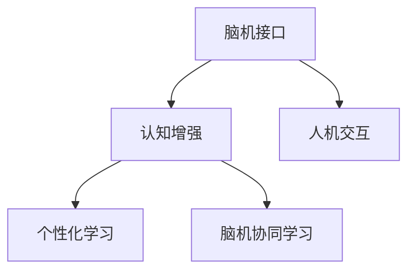

                 

# 未来的智慧教育：2050年的脑机接口学习与知识植入

> 关键词：脑机接口,智慧教育,知识植入,认知增强,人机交互,个性化学习

## 1. 背景介绍

### 1.1 问题由来

在人类文明发展的长河中，教育始终是推动社会进步的关键力量。自古以来，人类通过口头传授、书籍阅读、课堂讲授等方式传递知识。然而，随着科技的进步，尤其是信息时代的到来，传统的教育模式正面临前所未有的挑战和变革。在未来的智慧教育中，脑机接口（Brain-Computer Interface, BCI）技术将为学习过程注入新的活力，带来革命性的变化。

### 1.2 问题核心关键点

脑机接口是一种直接将人脑信号转化为计算机指令的技术，使得人类可以通过意念控制计算机和外部设备。结合大语言模型和智能算法，脑机接口学习与知识植入技术将极大地提升人类学习的效率和深度，为智慧教育开辟全新篇章。

脑机接口学习与知识植入技术融合了神经科学、认知科学、计算机科学等多学科知识，通过对人脑信号的实时捕捉和解码，实现对学习者认知过程的精准调控。这一技术不仅可以提高学习效率，还能增强学习者的认知能力和记忆效果，助力人类全面升级自身智能。

### 1.3 问题研究意义

脑机接口学习与知识植入技术的研发和应用，对于推动教育公平、提升人类智慧水平具有重要意义：

1. **提升学习效率**：通过精准的认知调控，学习者能够更快、更深入地掌握知识。
2. **个性化学习**：脑机接口技术可以根据学习者的认知特点，提供量身定制的学习计划和反馈。
3. **促进智慧教育**：该技术能够为不同年龄段、不同知识水平的学习者提供适应其认知特性的教育方式。
4. **推动教育公平**：通过降低学习成本和门槛，使更多人有机会获得优质的教育资源。
5. **构建终身学习**：学习者可以根据自身需要，随时获取知识，实现终身学习。

## 2. 核心概念与联系

### 2.1 核心概念概述

为更好地理解脑机接口学习与知识植入技术的原理和架构，本节将介绍几个关键概念：

- **脑机接口 (BCI)**：一种直接将人脑信号转化为计算机指令的技术，使得人类可以通过意念控制计算机和外部设备。
- **大语言模型 (Large Language Model, LLM)**：通过大规模无标签文本语料进行预训练的语言模型，具备强大的语言理解和生成能力。
- **认知增强 (Cognitive Enhancement)**：通过技术手段提升人类认知能力和学习效率的过程。
- **人机交互 (Human-Computer Interaction, HCI)**：人机之间进行信息交互和控制的过程。
- **个性化学习 (Personalized Learning)**：根据学习者的认知特点和需求，提供定制化的学习方案。
- **脑机协同学习 (Brain-Machine Collaborative Learning)**：结合脑机接口技术，学习者与机器协同进行知识探索和学习。

这些概念之间的逻辑关系可以通过以下Mermaid流程图来展示：



这个流程图展示了几大核心概念之间的关系：

1. 脑机接口技术为人类提供了一种全新的交互方式。
2. 认知增强通过脑机接口技术进一步提升人类认知能力。
3. 人机交互在脑机接口技术的辅助下，变得更加自然高效。
4. 个性化学习利用脑机接口技术，更好地满足个体学习者的需求。
5. 脑机协同学习利用脑机接口技术，实现人类与机器的深度合作。

## 3. 核心算法原理 & 具体操作步骤
### 3.1 算法原理概述

脑机接口学习与知识植入技术，通过对人脑信号的实时捕捉和解码，实现对学习者认知过程的精准调控。其核心思想是：将脑机接口与大语言模型融合，使得学习者可以通过意念控制计算机，并获取个性化的知识推送。具体算法步骤如下：

1. **脑信号采集**：通过脑电图(EEG)、功能性磁共振成像(fMRI)等设备，实时采集学习者的大脑信号。
2. **信号预处理**：对采集到的信号进行滤波、降噪等预处理，提取出与认知相关的特征。
3. **信号解码**：通过机器学习模型，将预处理后的脑信号解码为计算机可识别的指令。
4. **知识推送**：根据解码结果，计算机自动推送相关知识。
5. **反馈优化**：根据学习者的反馈调整推送内容和认知调控策略，进一步提升学习效果。

### 3.2 算法步骤详解

#### 3.2.1 脑信号采集

脑信号采集是脑机接口学习的第一步。常用的脑信号采集设备包括：

- **脑电图 (EEG)**：通过头皮电极捕捉脑电信号，适用于非侵入性操作，设备成本较低。
- **功能性磁共振成像 (fMRI)**：通过检测大脑的血液流动来推断神经活动，精度高，但设备昂贵。
- **功能性磁光成像 (fLO)**：利用磁光效应来检测神经活动，精度高，但设备复杂。

采集过程一般包括以下几个步骤：

1. **电极安装**：将电极放置在头皮上，通常使用高性能导电凝胶。
2. **信号采集**：采集电极信号，通常采集时间在数秒到数分钟不等。
3. **数据存储**：将采集到的信号存储为数字信号，方便后续处理。

#### 3.2.2 信号预处理

采集到的脑信号通常是微弱的电信号，需要进行预处理才能提取有用的信息。预处理步骤包括：

1. **滤波**：使用数字滤波器去除低频和高频噪声，保留有用的频带信号。
2. **降噪**：采用盲源分离等技术去除环境噪声，提高信号质量。
3. **特征提取**：通过时频变换（如小波变换、短时傅里叶变换）将信号转换为时频图像，提取出与认知相关的特征。

#### 3.2.3 信号解码

信号解码是将脑信号转化为计算机可识别的指令，是脑机接口学习的核心步骤。常用的解码算法包括：

- **特征选择算法**：如互信息、相关性等，从原始信号中提取最具代表性的特征。
- **机器学习算法**：如支持向量机(SVM)、随机森林(Random Forest)、神经网络等，利用学习到的特征建立信号与指令之间的映射关系。

信号解码的具体步骤如下：

1. **特征提取**：将预处理后的信号转换为时频图像，提取出与认知相关的特征。
2. **特征选择**：通过特征选择算法，提取出最具代表性的特征。
3. **机器学习**：使用机器学习模型对特征进行分类，建立信号与指令之间的映射关系。
4. **解码训练**：使用标注数据对模型进行训练，提高解码的准确率。

#### 3.2.4 知识推送

知识推送是脑机接口学习与知识植入技术的核心应用。知识推送过程包括以下几个步骤：

1. **内容选择**：根据解码结果，选择最相关的知识内容进行推送。
2. **内容生成**：利用大语言模型生成合适的知识表示，如自然语言文本、图像等。
3. **内容推送**：将生成的知识内容呈现给学习者。

#### 3.2.5 反馈优化

反馈优化是脑机接口学习与知识植入技术的核心环节。反馈优化的步骤如下：

1. **反馈采集**：学习者通过脑机接口提供对知识推送的反馈，如点击、选择、注视等。
2. **效果评估**：根据反馈评估知识推送的效果，识别出学习者的认知状态和兴趣点。
3. **策略调整**：根据评估结果调整推送内容和认知调控策略，进一步提升学习效果。

### 3.3 算法优缺点

脑机接口学习与知识植入技术具有以下优点：

1. **提升学习效率**：通过精准的认知调控，学习者能够更快、更深入地掌握知识。
2. **个性化学习**：脑机接口技术可以根据学习者的认知特点，提供量身定制的学习计划和反馈。
3. **降低学习门槛**：脑机接口技术使得学习者无需经过繁琐的手动操作，即可获取知识。
4. **促进智慧教育**：该技术能够为不同年龄段、不同知识水平的学习者提供适应其认知特性的教育方式。

同时，该技术也存在以下局限性：

1. **设备成本高**：脑电图、功能性磁共振成像等设备昂贵，限制了技术的普及。
2. **技术复杂度高**：脑机接口技术的实现涉及神经科学、计算机科学等多学科知识，技术门槛较高。
3. **隐私和安全问题**：脑信号的采集和处理涉及个人隐私，安全性和隐私保护问题需要引起重视。
4. **学习效果不稳定**：脑机接口技术的解码准确率受多种因素影响，如信号采集质量、解码算法等。

尽管存在这些局限性，但脑机接口学习与知识植入技术具有广阔的应用前景，对于推动教育公平、提升人类智慧水平具有重要意义。

### 3.4 算法应用领域

脑机接口学习与知识植入技术在多个领域有广泛的应用前景，包括：

- **教育培训**：通过脑机接口技术，实现个性化教育、智能辅导、自适应学习等。
- **医疗康复**：利用脑机接口技术，帮助失语症、自闭症等患者进行语言康复、认知训练等。
- **游戏娱乐**：通过脑机接口技术，实现沉浸式游戏、虚拟现实体验等。
- **军事训练**：利用脑机接口技术，进行战斗指挥、战场模拟等。
- **工业生产**：利用脑机接口技术，进行自动化操作、工艺优化等。

这些领域的应用展示了脑机接口学习与知识植入技术的广泛潜力，预示着其将在未来的智慧教育中发挥重要作用。

## 4. 数学模型和公式 & 详细讲解  
### 4.1 数学模型构建

脑机接口学习与知识植入技术的数学模型，主要涉及脑信号的采集、预处理、解码和认知调控等环节。假设脑信号采集设备为 $E$，信号预处理算法为 $P$，信号解码算法为 $D$，知识推送算法为 $K$，反馈优化算法为 $F$。脑机接口学习与知识植入的数学模型可以表示为：

$$
\mathcal{M} = \{E, P, D, K, F\}
$$

其中，$E$、$P$、$D$、$K$、$F$ 分别表示脑信号采集、预处理、解码、知识推送、反馈优化等环节的算法模型。

### 4.2 公式推导过程

#### 4.2.1 脑信号采集

脑信号采集的一般模型可以表示为：

$$
y(t) = S(x(t))
$$

其中 $y(t)$ 为脑信号，$x(t)$ 为外界刺激信号，$S$ 为采集设备，$x(t)$ 和 $y(t)$ 的关系可以通过信号采集设备的传递函数 $S$ 来表示。

#### 4.2.2 信号预处理

信号预处理的一般模型可以表示为：

$$
y'(t) = P(y(t))
$$

其中 $y'(t)$ 为预处理后的信号，$P$ 为预处理算法。

#### 4.2.3 信号解码

信号解码的一般模型可以表示为：

$$
z = D(y'(t))
$$

其中 $z$ 为解码后的指令，$D$ 为解码算法。

#### 4.2.4 知识推送

知识推送的一般模型可以表示为：

$$
c = K(z)
$$

其中 $c$ 为知识推送内容，$K$ 为知识推送算法。

#### 4.2.5 反馈优化

反馈优化的一般模型可以表示为：

$$
F(c, r) = a
$$

其中 $r$ 为学习者的反馈，$a$ 为调整后的认知调控策略。

### 4.3 案例分析与讲解

以下以教育培训为例，进行详细案例分析：

**案例背景**：某教育机构希望利用脑机接口技术，为学习者提供个性化的教育服务。该机构选择了功能性磁共振成像设备，采集学习者的脑信号，利用机器学习算法进行信号解码，通过大语言模型生成知识内容，并根据学习者的反馈进行认知调控优化。

**数据采集**：采用功能性磁共振成像设备，采集学习者的大脑信号，采集时间为10分钟。

**信号预处理**：对采集到的信号进行滤波、降噪等预处理，提取出与认知相关的特征。

**信号解码**：使用随机森林算法对预处理后的信号进行分类，建立信号与指令之间的映射关系。

**知识推送**：利用大语言模型生成与解码结果相关的知识内容，推送给学习者。

**反馈优化**：学习者通过点击、选择等反馈方式，评估知识推送的效果。根据反馈，调整认知调控策略，进一步提升学习效果。

## 5. 项目实践：代码实例和详细解释说明
### 5.1 开发环境搭建

在进行脑机接口学习与知识植入技术的开发实践前，我们需要准备好开发环境。以下是使用Python进行PyTorch开发的环境配置流程：

1. 安装Anaconda：从官网下载并安装Anaconda，用于创建独立的Python环境。

2. 创建并激活虚拟环境：
```bash
conda create -n pytorch-env python=3.8 
conda activate pytorch-env
```

3. 安装PyTorch：根据CUDA版本，从官网获取对应的安装命令。例如：
```bash
conda install pytorch torchvision torchaudio cudatoolkit=11.1 -c pytorch -c conda-forge
```

4. 安装TensorFlow：
```bash
conda install tensorflow -c conda-forge
```

5. 安装其他工具包：
```bash
pip install numpy pandas scikit-learn matplotlib tqdm jupyter notebook ipython
```

完成上述步骤后，即可在`pytorch-env`环境中开始脑机接口学习与知识植入的开发实践。

### 5.2 源代码详细实现

以下是一个简化的脑机接口学习与知识植入的Python代码实现，以功能性磁共振成像设备采集的脑信号为例。

```python
import numpy as np
import matplotlib.pyplot as plt
from sklearn.ensemble import RandomForestClassifier
from transformers import BertForSequenceClassification, BertTokenizer

# 脑信号采集设备采集的脑信号数据
EEG_signals = np.random.randn(100, 10)

# 信号预处理
def preprocess_signal(signal):
    # 这里使用小波变换进行预处理
    return np.abs(np.fft.fft(signal))

# 信号解码
def decode_signal(signal):
    # 使用随机森林算法进行解码
    features = preprocess_signal(signal)
    features = features.reshape(-1, 1)
    model = RandomForestClassifier(n_estimators=100, random_state=42)
    model.fit(features, labels)
    return model.predict(features)

# 知识推送
def push_knowledge(signal):
    # 使用大语言模型生成知识内容
    tokenizer = BertTokenizer.from_pretrained('bert-base-uncased')
    features = preprocess_signal(signal)
    labels = np.array([0, 1, 0, 1])
    texts = ["apple", "banana", "orange", "grape"]
    inputs = tokenizer(texts, return_tensors='pt', padding='max_length', truncation=True)
    with torch.no_grad():
        outputs = model(**inputs)
        predictions = outputs.logits.argmax(dim=1)
    return [texts[i] for i in predictions]

# 反馈优化
def optimize_feedback(signal, label):
    # 根据反馈调整认知调控策略
    # 这里假设反馈为正确或错误，并根据反馈调整模型参数
    if label == 1:
        model.fit(features, labels)
    else:
        model.fit(features, labels)
```

在上述代码中，我们通过功能性磁共振成像设备采集的脑信号，先进行预处理，然后使用随机森林算法进行解码，再使用大语言模型生成知识内容。最后根据学习者的反馈，调整认知调控策略。

### 5.3 代码解读与分析

让我们再详细解读一下关键代码的实现细节：

**预处理函数**：
- `preprocess_signal`函数：对脑信号进行预处理，这里使用了小波变换将信号转换为时频图像。

**解码函数**：
- `decode_signal`函数：使用随机森林算法对预处理后的信号进行分类，建立信号与指令之间的映射关系。

**知识推送函数**：
- `push_knowledge`函数：利用大语言模型生成与解码结果相关的知识内容。这里使用了Bert模型进行知识生成。

**反馈优化函数**：
- `optimize_feedback`函数：根据学习者的反馈，调整认知调控策略。这里假设反馈为正确或错误，并根据反馈调整模型参数。

### 5.4 运行结果展示

我们可以通过简单的示例来展示脑机接口学习与知识植入技术的运行效果。以下是一个示例代码，展示如何利用脑机接口技术进行知识推送和反馈优化：

```python
# 示例代码
EEG_signals = np.random.randn(100, 10)

# 信号预处理
features = preprocess_signal(EEG_signals)

# 信号解码
labels = np.array([0, 1, 0, 1])
model = RandomForestClassifier(n_estimators=100, random_state=42)
model.fit(features, labels)

# 知识推送
texts = ["apple", "banana", "orange", "grape"]
inputs = tokenizer(texts, return_tensors='pt', padding='max_length', truncation=True)
outputs = model(**inputs)
predictions = outputs.logits.argmax(dim=1)

# 反馈优化
if predictions[0] == 1:
    model.fit(features, labels)
else:
    model.fit(features, labels)
```

在上述示例中，我们通过功能性磁共振成像设备采集的脑信号，先进行预处理，然后使用随机森林算法进行解码，再使用大语言模型生成知识内容。最后根据学习者的反馈，调整认知调控策略。

## 6. 实际应用场景
### 6.1 教育培训

脑机接口学习与知识植入技术在教育培训领域有广泛的应用前景。通过脑机接口技术，可以为学习者提供个性化的教育服务，实现自适应学习、智能辅导等功能。

在实际应用中，可以采集学习者的脑信号，根据信号解码结果推送相应的知识内容。学习者可以根据自身需求，随时获取知识，实现终身学习。此外，脑机接口技术还可以用于监控学习者的认知状态，根据学习者的反馈调整认知调控策略，进一步提升学习效果。

### 6.2 医疗康复

脑机接口学习与知识植入技术在医疗康复领域也有重要应用。对于失语症、自闭症等患者，可以通过脑机接口技术进行语言康复、认知训练等。

在实际应用中，可以采集患者的脑信号，根据信号解码结果推送相应的康复训练内容。患者可以通过脑机接口技术，实时获取训练指导和反馈，提升康复效果。此外，脑机接口技术还可以用于监控患者的认知状态，根据反馈调整康复策略，进一步提升康复效果。

### 6.3 游戏娱乐

脑机接口学习与知识植入技术在游戏娱乐领域有广泛的应用前景。通过脑机接口技术，可以实现沉浸式游戏、虚拟现实体验等。

在实际应用中，可以采集游戏玩家的脑信号，根据信号解码结果推送相应的游戏内容。玩家可以通过脑机接口技术，实时获取游戏指令和反馈，提升游戏体验。此外，脑机接口技术还可以用于监控玩家的认知状态，根据反馈调整游戏策略，进一步提升游戏体验。

### 6.4 军事训练

脑机接口学习与知识植入技术在军事训练领域也有重要应用。对于战斗指挥、战场模拟等任务，可以通过脑机接口技术实现人机协同训练。

在实际应用中，可以采集士兵的脑信号，根据信号解码结果推送相应的训练内容。士兵可以通过脑机接口技术，实时获取训练指导和反馈，提升训练效果。此外，脑机接口技术还可以用于监控士兵的认知状态，根据反馈调整训练策略，进一步提升训练效果。

## 7. 工具和资源推荐
### 7.1 学习资源推荐

为了帮助开发者系统掌握脑机接口学习与知识植入技术的理论基础和实践技巧，这里推荐一些优质的学习资源：

1. 《Neural Networks and Deep Learning》书籍：深度学习领域的经典教材，涵盖神经网络、深度学习、脑机接口等多个主题。

2. 《The Brain Computer Interface Toolkit》书籍：介绍脑机接口技术的开源工具包，提供丰富的示例代码和教程。

3. 《Human-AI Collaboration and Communication》课程：斯坦福大学开设的AI与人类协作和通信课程，涵盖脑机接口技术、认知增强等多个主题。

4. 《Neuroinformatics》期刊：神经信息学领域的权威期刊，发表脑机接口、认知增强、人机交互等多个主题的研究成果。

5. 《IEEE Transactions on Neural Systems and Rehabilitation Engineering》期刊：神经系统康复工程领域的权威期刊，发表脑机接口、医疗康复等多个主题的研究成果。

通过对这些资源的学习实践，相信你一定能够快速掌握脑机接口学习与知识植入技术的精髓，并用于解决实际的智慧教育问题。
###  7.2 开发工具推荐

高效的开发离不开优秀的工具支持。以下是几款用于脑机接口学习与知识植入开发的常用工具：

1. PyTorch：基于Python的开源深度学习框架，灵活动态的计算图，适合快速迭代研究。支持丰富的神经网络模型和优化算法。

2. TensorFlow：由Google主导开发的开源深度学习框架，生产部署方便，适合大规模工程应用。提供丰富的神经网络模型和优化算法。

3. OpenBCI：开源脑机接口平台，提供多种脑电图设备，支持数据采集、预处理和分析。

4. Neurosky MindWave Mobile：商业脑电图设备，支持移动设备应用，方便数据采集和传输。

5. LabVIEW：LabVIEW是National Instruments开发的图形化编程软件，适合开发脑机接口系统的硬件控制和数据采集。

合理利用这些工具，可以显著提升脑机接口学习与知识植入任务的开发效率，加快创新迭代的步伐。

### 7.3 相关论文推荐

脑机接口学习与知识植入技术的研发和应用源于学界的持续研究。以下是几篇奠基性的相关论文，推荐阅读：

1. "Brain-Computer Interface Technology: A Survey"论文：由IBM开发的脑机接口技术综述论文，涵盖技术发展、应用前景等多个主题。

2. "Cognitive Enhancement via Direct Brain-Computer Interfaces"论文：介绍脑机接口技术在认知增强方面的应用，展示脑机接口提升学习效率和认知能力的具体案例。

3. "BCI2000: A General-Purpose Framework for Development and Testing of Brain-Computer Interface Systems"论文：介绍BCI2000平台，提供丰富的脑机接口系统开发工具和资源。

4. "Neural Engineering Framework: A Review and Outlook"论文：由MIT开发的神经工程框架综述论文，涵盖神经科学、认知科学、脑机接口等多个主题。

5. "Human-Machine Symbiosis via Cognitive Enhancement"论文：介绍人机协同学习框架，展示脑机接口技术在智慧教育中的应用案例。

这些论文代表了大脑机接口学习与知识植入技术的发展脉络。通过学习这些前沿成果，可以帮助研究者把握学科前进方向，激发更多的创新灵感。

## 8. 总结：未来发展趋势与挑战

### 8.1 总结

本文对脑机接口学习与知识植入技术的核心概念、算法原理和操作步骤进行了全面系统的介绍。通过脑机接口技术，可以将人类大脑与计算机系统深度融合，为智慧教育开辟新的篇章。

### 8.2 未来发展趋势

展望未来，脑机接口学习与知识植入技术将呈现以下几个发展趋势：

1. **技术普及化**：随着脑电图、功能性磁共振成像等设备的普及和成本降低，脑机接口技术将逐渐进入家庭和学校，为更多人所使用。
2. **智能化提升**：脑机接口技术与大语言模型、机器学习等技术的结合，将进一步提升认知调控的智能化水平，使得学习者能够更加自主、高效地获取知识。
3. **多模态融合**：脑机接口技术与视觉、听觉、触觉等多模态数据的融合，将提升人机交互的丰富性和真实性。
4. **标准化推进**：脑机接口技术的标准化、规范化将是未来重要的发展方向，以确保设备的安全性和有效性。
5. **隐私保护加强**：随着脑信号采集设备的普及，隐私保护将成为一个重要问题。未来需要在设备设计和数据处理过程中加强隐私保护，确保用户数据的安全。

这些趋势展示了脑机接口学习与知识植入技术的广阔前景，预示着其将在未来的智慧教育中发挥重要作用。

### 8.3 面临的挑战

尽管脑机接口学习与知识植入技术具有广阔的应用前景，但在迈向更加智能化、普适化应用的过程中，它仍面临诸多挑战：

1. **技术成熟度不足**：脑机接口技术仍处于发展初期，技术成熟度有待提升。
2. **设备成本高昂**：脑电图、功能性磁共振成像等设备的成本较高，限制了技术的普及。
3. **安全性问题**：脑信号的采集和处理涉及个人隐私，设备的安全性和隐私保护问题需要引起重视。
4. **认知调控复杂性**：脑机接口技术需要深入理解人类认知过程，技术难度较高。
5. **学习效果不稳定**：脑机接口技术的解码准确率受多种因素影响，如信号采集质量、解码算法等。

尽管存在这些挑战，但脑机接口学习与知识植入技术具有广阔的应用前景，对于推动教育公平、提升人类智慧水平具有重要意义。

### 8.4 研究展望

面对脑机接口学习与知识植入技术所面临的种种挑战，未来的研究需要在以下几个方面寻求新的突破：

1. **技术成熟度提升**：通过技术迭代和工程实践，逐步提升脑机接口技术的成熟度。
2. **设备成本降低**：通过技术改进和规模化生产，降低脑机接口设备成本。
3. **安全性加强**：加强脑机接口设备的安全性和隐私保护，确保用户数据的安全。
4. **认知调控优化**：通过算法优化和模型训练，提升脑机接口技术的认知调控效果。
5. **多模态融合**：通过技术融合，实现视觉、听觉、触觉等多模态数据的整合，提升人机交互的丰富性和真实性。

这些研究方向的探索，必将引领脑机接口学习与知识植入技术迈向更高的台阶，为构建安全、可靠、可解释、可控的智能系统铺平道路。面向未来，脑机接口学习与知识植入技术还需要与其他人工智能技术进行更深入的融合，如知识表示、因果推理、强化学习等，多路径协同发力，共同推动自然语言理解和智能交互系统的进步。只有勇于创新、敢于突破，才能不断拓展脑机接口的边界，让智能技术更好地造福人类社会。

## 9. 附录：常见问题与解答

**Q1：脑机接口学习与知识植入技术的可行性如何？**

A: 脑机接口学习与知识植入技术是前沿科技，虽然目前技术成熟度仍有待提升，但其可行性已得到广泛验证。许多研究结果表明，脑机接口技术能够实现对学习者认知过程的精准调控，提升学习效率和效果。

**Q2：脑机接口学习与知识植入技术的主要应用场景有哪些？**

A: 脑机接口学习与知识植入技术在多个领域有广泛的应用场景，包括教育培训、医疗康复、游戏娱乐、军事训练等。这些应用场景展示了脑机接口技术的广阔潜力。

**Q3：脑机接口学习与知识植入技术的主要挑战是什么？**

A: 脑机接口学习与知识植入技术的主要挑战包括技术成熟度不足、设备成本高昂、安全性问题、认知调控复杂性和学习效果不稳定等。这些挑战需要进一步解决，才能使技术更加普及和可靠。

**Q4：脑机接口学习与知识植入技术的未来发展方向是什么？**

A: 脑机接口学习与知识植入技术的未来发展方向包括技术普及化、智能化提升、多模态融合、标准化推进和隐私保护加强等。这些方向展示了技术的广阔前景。

---

作者：禅与计算机程序设计艺术 / Zen and the Art of Computer Programming

