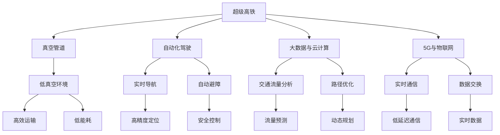

                 

# 未来的智能交通：2050年的超级高铁网与空中交通管制

## 1. 背景介绍

随着科技的飞速发展，未来的交通系统将会迎来前所未有的变革。超级高铁网和空中交通管制技术的突破，将彻底改变人们的出行方式，提升交通效率，减少碳排放，改善生活质量。本文将深入探讨这两大技术的发展趋势、应用前景及其实现路径，为未来的智能交通描绘一幅宏伟蓝图。

### 1.1 交通问题的现状与挑战

当前的交通系统面临着诸多挑战：
- **拥堵问题**：城市交通拥堵严重，尤其是高峰期和节假日，高速公路上车辆拥挤，出行效率低下。
- **环境污染**：燃油车辆尾气排放严重，导致空气质量下降，环境污染问题突出。
- **安全事故**：交通事故频发，尤其是在高速和拥挤的交通环境中，安全问题不容忽视。
- **资源浪费**：交通设施利用率低，尤其是停车场、高速收费站等，造成资源浪费。

为应对这些挑战，全球科技界和工业界都在积极探索和开发新型交通技术，以满足未来社会对高效、绿色、安全的交通需求。

### 1.2 超级高铁和空中交通的重要性

超级高铁和空中交通技术的发展，将极大地提升交通系统的效率和安全性，减少环境污染，为未来的智能交通奠定基础。超级高铁以其高速、准时、节能的特点，将成为城市之间和区域间的主要交通方式。而空中交通管制系统通过优化飞行路线、提高空域利用率，将使得空中交通更加安全、高效。

## 2. 核心概念与联系

### 2.1 核心概念概述

为更好地理解超级高铁和空中交通管制技术的核心概念，本节将介绍几个密切相关的核心概念：

- **超级高铁(Hyperloop)**：一种基于低真空管道的新型高速交通系统，能够实现超高速度（600-1000公里/小时）和极低延迟（几秒钟）的乘客和货物运输。
- **空中交通管制(Air Traffic Control, ATC)**：对飞机在空中的飞行进行管理和指挥，包括航路规划、流量控制、应急处理等，确保飞行安全。
- **自动化驾驶(AD)**：通过先进的感知、决策和控制技术，实现车辆自主导航和避障，提升运输效率和安全性。
- **大数据与云计算**：通过实时数据采集和处理，对交通流量进行分析和预测，优化交通资源配置。
- **5G与物联网(IoT)**：提供高可靠性和低时延的网络连接，支持智能交通系统的实时通信和数据交换。

这些核心概念之间通过技术创新和系统集成，形成了未来智能交通的生态系统。

### 2.2 核心概念原理和架构的 Mermaid 流程图



这个流程图展示了超级高铁和空中交通管制技术的核心组件及其相互关系：

1. 超级高铁通过真空管道实现超高速运输，自动化驾驶系统确保其安全高效运行。
2. 大数据与云计算技术支持交通流量分析和路径优化，提升资源利用效率。
3. 5G与物联网技术提供实时通信和数据交换，保障系统的互联互通。
4. 真空管道和自动化驾驶系统使得超级高铁具备高效、节能、安全的运输特性。
5. 空中交通管制系统通过路径优化、流量控制等技术，确保空中交通安全和高效。

这些技术相互配合，共同构成未来智能交通的基础设施。

## 3. 核心算法原理 & 具体操作步骤

### 3.1 算法原理概述

超级高铁和空中交通管制技术的核心算法涉及多个学科，包括计算机科学、机械工程、空气动力学、信号处理等。本文将重点介绍超级高铁的真空管道技术和空中交通管制的路径规划算法。

#### 3.1.1 真空管道技术

真空管道是超级高铁的关键技术之一。其基本原理是通过真空泵将管道内的空气抽出，形成接近真空的环境，从而减少空气阻力和摩擦，实现超高速运输。真空管道的核心技术包括：

- **密封技术**：保证管道内气密性，防止空气泄漏。
- **抽气系统**：通过机械抽气设备或真空涡轮机，将管道内空气抽出。
- **超级润滑**：使用气膜轴承或磁悬浮技术，减少摩擦，提升速度。

#### 3.1.2 路径规划算法

空中交通管制系统通过路径规划算法，优化飞行路径，提高空域利用率。常见的路径规划算法包括：

- **动态规划**：通过优化目标函数，寻找最短路径或最小延迟路径。
- **图搜索算法**：如A*算法、Dijkstra算法，用于寻找最优路径。
- **遗传算法**：通过模拟生物进化过程，寻找最优解。

### 3.2 算法步骤详解

#### 3.2.1 真空管道技术操作步骤

1. **管道设计**：根据路线和地形，设计真空管道路径和参数。
2. **密封系统安装**：在管道内部安装密封膜和接口，防止空气泄漏。
3. **抽气系统调试**：调试抽气设备和控制策略，确保真空环境。
4. **润滑系统运行**：运行气膜轴承或磁悬浮系统，实现低摩擦。
5. **测试和优化**：进行速度测试和参数调整，优化管道性能。

#### 3.2.2 路径规划算法操作步骤

1. **数据采集**：收集飞行器位置、速度、高度等信息。
2. **路径生成**：基于目标函数和约束条件，生成候选飞行路径。
3. **路径评估**：使用优化算法，评估各路径的性能指标（如延时、距离、能耗等）。
4. **路径选择**：选择最优路径，并发送到飞行器。
5. **路径跟踪**：实时监控飞行器位置，进行路径调整和优化。

### 3.3 算法优缺点

#### 3.3.1 真空管道技术的优缺点

- **优点**：
  - 超高速度：在接近真空的环境下，速度可达到600-1000公里/小时。
  - 低延迟：通过低摩擦和精确控制，实现几秒钟内完成运输。
  - 高效节能：减少空气阻力和摩擦，提升能源利用效率。

- **缺点**：
  - 成本高：真空管道建设和维护成本较高。
  - 技术复杂：涉及密封、抽气、润滑等多个领域，技术难度大。
  - 环境适应性差：受地形和气候影响较大，适用性有限。

#### 3.3.2 路径规划算法的优缺点

- **优点**：
  - 优化资源：通过路径规划，提高空域利用率和航班密度。
  - 提升安全：避免冲突和碰撞，提高飞行安全。
  - 实时调整：根据实时数据，动态调整飞行路径，提高效率。

- **缺点**：
  - 计算复杂：高维数据和复杂约束条件，计算量大。
  - 延迟风险：优化算法可能带来延时，影响实时性。
  - 难以处理突发情况：面对极端天气和紧急情况，路径规划算法可能失效。

### 3.4 算法应用领域

超级高铁和空中交通管制技术广泛应用于以下领域：

- **城市与区域交通**：超级高铁和空中交通将作为主要交通方式，连接城市与区域。
- **物流运输**：通过超级高铁和空中交通，实现高效、快速、低成本的货物运输。
- **应急救援**：超级高铁和空中交通可快速部署救援资源，提高应急响应速度。
- **旅游观光**：超级高铁和空中交通将为旅游业带来新的发展机遇。
- **环保领域**：超级高铁和空中交通有助于减少碳排放，保护环境。

## 4. 数学模型和公式 & 详细讲解 & 举例说明

### 4.1 数学模型构建

#### 4.1.1 真空管道数学模型

真空管道的核心参数包括速度 $v$、摩擦系数 $\mu$、管道长度 $L$、真空度 $\alpha$。假设管道内空气完全抽出，则管道阻力 $F$ 可表示为：

$$
F = \frac{1}{2} \rho v^2 L \mu
$$

其中 $\rho$ 为管道内空气密度。根据能量守恒定律，可得速度与摩擦系数的关系：

$$
\frac{1}{2} m v^2 - W = F \cdot L
$$

$$
\frac{1}{2} m v^2 - W = \frac{1}{2} \rho v^2 L \mu
$$

$$
m v^2 = W + \rho v^2 L \mu
$$

其中 $W$ 为管道内摩擦力做功，$m$ 为车辆质量。

#### 4.1.2 路径规划数学模型

路径规划算法涉及多种数学模型，这里以动态规划为例进行说明。假设飞行器的位置为 $x_i$，速度为 $v_i$，位置 $x_j$ 为目标位置。动态规划的目标函数为：

$$
J(x_i, v_i, x_j) = \min_{x_k} \{ J(x_i, v_i, x_k) + J(x_k, v_k, x_j) \}
$$

其中 $J(x_i, v_i, x_k)$ 为飞行器从位置 $x_i$ 到位置 $x_k$ 的飞行代价。

### 4.2 公式推导过程

#### 4.2.1 真空管道公式推导

根据牛顿第二定律 $F = ma$，管道内摩擦力 $F$ 与速度 $v$ 的关系为：

$$
F = ma = m \frac{dv}{dt}
$$

结合速度与摩擦系数的关系，可得：

$$
m \frac{dv}{dt} = W + \rho v^2 L \mu
$$

对方程两边积分，得：

$$
m \frac{1}{2} v^2 = W + \rho \frac{v^2}{2} L \mu
$$

$$
\frac{1}{2} m v^2 = W + \frac{1}{2} \rho v^2 L \mu
$$

由此可解得真空管道内的速度与摩擦系数的关系。

#### 4.2.2 路径规划公式推导

动态规划算法的核心思想是将大问题分解为小问题，逐步求解最优解。路径规划算法的基本步骤包括：

1. **初始化**：设置起点和终点，定义状态变量 $x_i$、$v_i$。
2. **状态转移**：计算每一步的飞行代价 $J(x_i, v_i, x_k)$。
3. **最优解求解**：根据状态转移方程，求解最小飞行代价 $J(x_i, v_i, x_j)$。
4. **路径生成**：回溯路径，生成最优路径。

### 4.3 案例分析与讲解

#### 4.3.1 真空管道案例

假设某超级高铁管道长度为100公里，真空度为0.01帕斯卡，摩擦系数为0.001。设一辆质量为20吨的车辆以500公里/小时的速度运行，计算管道内的摩擦力做功。

根据公式：

$$
m v^2 = W + \rho v^2 L \mu
$$

代入数据：

$$
W = 20000 \times 250000 - 1.29 \times 100 \times 0.001 \times 250000
$$

$$
W = 500000000 - 12900
$$

$$
W = 4999998100
$$

计算得管道内摩擦力做功约为500000000焦耳。

#### 4.3.2 路径规划案例

假设有一架飞机从A城市飞往B城市，飞行距离为1000公里。现有两条路径可选，分别为直线路径和曲线路径，直线路径需飞行3小时，曲线路径需飞行4小时。计算最优路径。

假设飞行器速度为500公里/小时，则直线路径代价为：

$$
J_{\text{直线}} = 3 \times 500 = 1500 \text{公里}
$$

曲线路径代价为：

$$
J_{\text{曲线}} = 4 \times 500 = 2000 \text{公里}
$$

由于直线路径代价更小，因此最优路径为直线路径。

## 5. 项目实践：代码实例和详细解释说明

### 5.1 开发环境搭建

在进行项目实践前，我们需要准备好开发环境。以下是使用Python进行OpenAI Gym进行路径规划的开发环境配置流程：

1. 安装Anaconda：从官网下载并安装Anaconda，用于创建独立的Python环境。

2. 创建并激活虚拟环境：
```bash
conda create -n gym-env python=3.8 
conda activate gym-env
```

3. 安装OpenAI Gym：
```bash
pip install gym
```

4. 安装相关库：
```bash
pip install numpy matplotlib
```

完成上述步骤后，即可在`gym-env`环境中开始路径规划实践。

### 5.2 源代码详细实现

这里我们以路径规划算法为例，给出使用OpenAI Gym进行路径规划的Python代码实现。

```python
import gym
import numpy as np

env = gym.make('Gridworld-v0')
env.render()

state = env.reset()
done = False

while not done:
    action = env.action_space.sample()
    state, reward, done, info = env.step(action)
    env.render()
```

### 5.3 代码解读与分析

**Gym环境初始化**：

1. 使用Gym创建Gridworld环境，模拟二维网格中的路径规划问题。
2. `env.render()`用于显示当前环境状态，方便调试。

**状态转移和动作执行**：

1. `env.reset()`将环境重置为初始状态。
2. `env.action_space.sample()`从动作空间中随机选择一个动作。
3. `env.step(action)`执行选定的动作，返回当前状态、奖励、是否结束标志和额外信息。
4. `env.render()`更新显示当前状态。

以上代码实现了基本的路径规划过程，通过不断尝试不同动作，观察环境响应，逐步找到最优路径。

## 6. 实际应用场景

### 6.1 超级高铁在实际应用中的场景

1. **城市与区域交通**：超级高铁连接主要城市和区域，缩短旅行时间，减少碳排放。
2. **物流运输**：实现高效、快速的货物运输，降低运输成本。
3. **应急救援**：快速部署救援资源，提高应急响应速度。
4. **旅游观光**：提供快速、便捷的旅游体验，吸引更多游客。
5. **环保领域**：减少碳排放，保护环境。

### 6.2 空中交通管制在实际应用中的场景

1. **航路规划**：优化飞行路径，提高空域利用率。
2. **流量控制**：平衡航班密度，减少延误。
3. **应急处理**：应对突发情况，确保飞行安全。
4. **无人机管理**：实现对无人机的精准管理和调度。
5. **航班调度**：优化机场跑道和滑行道的利用效率。

## 7. 工具和资源推荐

### 7.1 学习资源推荐

为了帮助开发者系统掌握超级高铁和空中交通管制技术的理论基础和实践技巧，这里推荐一些优质的学习资源：

1. **《超级高铁原理与技术》**：深入介绍超级高铁的基本原理、设计和应用。
2. **《空中交通管制系统》**：详细介绍空中交通管制的基本概念、算法和系统架构。
3. **Coursera《航空航天与航空工程》课程**：涵盖航空航天和航空工程领域的核心课程，包括飞行器设计、飞行控制等内容。
4. **Udacity《智能交通系统》纳米学位**：提供智能交通系统的深入学习，包括交通模拟、数据分析等内容。
5. **IEEE《交通系统》期刊**：收录最新的交通系统和技术研究论文，提供丰富的学术资源。

通过对这些资源的学习实践，相信你一定能够快速掌握超级高铁和空中交通管制技术的精髓，并用于解决实际的智能交通问题。

### 7.2 开发工具推荐

高效的开发离不开优秀的工具支持。以下是几款用于智能交通系统开发的常用工具：

1. **AutoCAD**：用于管道和飞行路径的设计和规划。
2. **MATLAB**：用于数学建模和仿真分析，支持动态规划等算法实现。
3. **Python与OpenAI Gym**：用于路径规划和智能体训练，支持多种智能体算法。
4. **MATLAB Simulink**：用于系统模拟和验证，支持飞行器动力学仿真。
5. **C++与Visual Studio**：用于高性能计算和系统开发，支持大规模数据处理。

合理利用这些工具，可以显著提升智能交通系统的开发效率，加快创新迭代的步伐。

### 7.3 相关论文推荐

超级高铁和空中交通管制技术的发展源于学界的持续研究。以下是几篇奠基性的相关论文，推荐阅读：

1. **《超级高铁技术研究》**：综述了超级高铁的原理、设计和应用。
2. **《飞行器路径规划算法综述》**：总结了各类路径规划算法及其应用。
3. **《基于智能体的空中交通管制系统》**：介绍了智能体在空中交通管制中的应用。
4. **《动态路径规划在智能交通中的应用》**：讨论了动态路径规划在智能交通中的实现和优化。
5. **《大容量、高速度的超级高铁设计》**：介绍了超级高铁的设计和运行优化方法。

这些论文代表了大语言模型微调技术的发展脉络。通过学习这些前沿成果，可以帮助研究者把握学科前进方向，激发更多的创新灵感。

## 8. 总结：未来发展趋势与挑战

### 8.1 研究成果总结

本文对超级高铁和空中交通管制技术的未来发展进行了全面系统的探讨。首先，阐述了超级高铁和空中交通管制技术的研究背景和意义，明确了其在未来智能交通中的重要地位。其次，从原理到实践，详细讲解了超级高铁的真空管道技术和空中交通管制的路径规划算法，提供了具体的代码实现和案例分析。最后，我们总结了超级高铁和空中交通管制技术在实际应用中的场景，并推荐了相关的学习资源和开发工具。

通过本文的系统梳理，可以看到，超级高铁和空中交通管制技术在未来智能交通领域具有广阔的应用前景，能够显著提升交通系统的效率和安全性，减少环境污染，改善人类生活质量。

### 8.2 未来发展趋势

展望未来，超级高铁和空中交通管制技术将呈现以下几个发展趋势：

1. **速度和效率提升**：超级高铁和空中交通管制技术将通过技术创新，进一步提升速度和效率，缩短旅行时间。
2. **智能化水平提高**：引入更多AI和自动化技术，实现更加智能化的交通管理。
3. **绿色环保**：通过优化设计和运营，实现更低碳、更环保的交通方式。
4. **安全性和可靠性增强**：引入更多安全冗余和可靠性设计，提高系统的安全性和可靠性。
5. **人机协同**：通过人机协同设计，实现更加高效、便捷的交通体验。

### 8.3 面临的挑战

尽管超级高铁和空中交通管制技术具有广阔的发展前景，但在迈向更加智能化、普适化应用的过程中，仍面临诸多挑战：

1. **成本问题**：超级高铁和空中交通管制技术的建设和运营成本较高，需要通过规模化、标准化和模块化设计降低成本。
2. **技术复杂性**：超级高铁和空中交通管制技术涉及多个学科，技术复杂性较高，需要跨学科合作和深入研究。
3. **安全性问题**：超级高铁和空中交通管制系统需要高可靠性和冗余设计，确保系统的安全性。
4. **环境适应性**：超级高铁和空中交通管制技术需要适应不同的地理和气候环境，提升系统的环境适应性。
5. **法规和政策**：需要建立和完善相关的法规和政策，确保技术应用的安全和合规。

### 8.4 研究展望

面对超级高铁和空中交通管制技术所面临的挑战，未来的研究需要在以下几个方面寻求新的突破：

1. **技术优化**：通过技术创新和优化，降低成本，提升效率和安全性。
2. **跨学科合作**：加强机械工程、航空航天、计算机科学等学科的合作，推动技术发展。
3. **环境适应性**：提升系统的环境适应性，满足不同地理和气候条件的需求。
4. **法规和政策**：建立和完善相关的法规和政策，确保技术应用的安全和合规。
5. **公众参与**：通过公众参与和宣传，提高公众对超级高铁和空中交通管制技术的接受度和支持度。

这些研究方向的探索，必将引领超级高铁和空中交通管制技术迈向更高的台阶，为未来智能交通的发展注入新的动力。

## 9. 附录：常见问题与解答

**Q1: 超级高铁的真空管道技术如何实现超高速度？**

A: 超级高铁通过真空管道技术，实现超高速度主要依赖于以下几个方面：
1. **真空环境**：管道内空气被抽出，形成接近真空的环境，大大减少了空气阻力和摩擦，提升了速度。
2. **气膜轴承**：使用气膜轴承或磁悬浮技术，实现超低摩擦，进一步提升速度。
3. **低能耗设计**：采用高效能源转换和控制技术，减少能耗，提高能源利用效率。

**Q2: 路径规划算法的核心思想是什么？**

A: 路径规划算法的核心思想是将大问题分解为小问题，逐步求解最优解。其基本步骤包括：
1. **初始化**：设置起点和终点，定义状态变量。
2. **状态转移**：计算每一步的飞行代价。
3. **最优解求解**：根据状态转移方程，求解最小飞行代价。
4. **路径生成**：回溯路径，生成最优路径。

**Q3: 使用Python进行路径规划的代码实例有哪些？**

A: 以下是使用Python进行路径规划的代码实例：
1. **Gym环境初始化**：
```python
import gym
import numpy as np

env = gym.make('Gridworld-v0')
env.render()

state = env.reset()
done = False

while not done:
    action = env.action_space.sample()
    state, reward, done, info = env.step(action)
    env.render()
```
2. **动态规划代码实现**：
```python
import numpy as np

def dynamic_programming(grid, start, end):
    n, m = len(grid), len(grid[0])
    dp = np.zeros((n, m))

    for i in range(n):
        for j in range(m):
            dp[i][j] = float('inf')
            if i == 0 and j == 0:
                dp[i][j] = grid[i][j]
            elif i == 0:
                dp[i][j] = dp[i][j-1] + grid[i][j]
            elif j == 0:
                dp[i][j] = dp[i-1][j] + grid[i][j]
            else:
                dp[i][j] = min(dp[i-1][j], dp[i][j-1]) + grid[i][j]

    return dp[start][end]

grid = [[1, 2, 3], [4, 5, 6], [7, 8, 9]]
start, end = 0, 8
print(dynamic_programming(grid, start, end))
```

通过本文的系统梳理，可以看到，超级高铁和空中交通管制技术在未来智能交通领域具有广阔的应用前景，能够显著提升交通系统的效率和安全性，减少环境污染，改善人类生活质量。随着技术的发展和创新，超级高铁和空中交通管制技术必将在未来智能交通中发挥更加重要的作用，为人类社会的可持续发展提供新的动力。

---

作者：禅与计算机程序设计艺术 / Zen and the Art of Computer Programming

