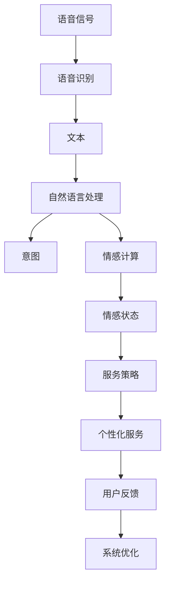

                 

# 未来的智能客服：2050年的智能语音助手与情感计算

## 1. 背景介绍

### 1.1 问题由来

随着科技的飞速发展，人工智能在各个领域的应用正逐渐深入，特别是在智能客服领域。2050年的智能客服，基于先进的语音识别、自然语言处理和情感计算技术，能够提供更高效、个性化和人性化的服务。客户不再需要长时间等待，通过与智能语音助手的互动，即可快速解决问题。这一技术的进步不仅提升了客户满意度，还极大地降低了企业运营成本。

### 1.2 问题核心关键点

未来的智能客服系统将集成先进的语音识别技术、自然语言处理技术、情感计算技术和人工智能技术。系统能够通过语音识别将客户的口述信息转换为文字，并通过自然语言处理技术理解和分析客户的意图，实现语音交互。此外，系统还能够通过情感计算技术，理解客户的情感状态，从而提供更加个性化的服务。

这些技术的有机结合，使得智能客服系统能够实时响应客户的请求，提供高质量的服务，满足客户多样化的需求。通过情感计算技术，系统还能够识别客户的情绪变化，及时调整服务策略，提升客户体验。

## 2. 核心概念与联系

### 2.1 核心概念概述

为了更好地理解未来智能客服的核心技术，本节将介绍几个关键概念：

- **语音识别**：将语音信号转换为文本的过程。2050年的智能客服系统将采用先进的深度学习技术，如端到端的语音识别模型，实现高准确率的语音转文字。

- **自然语言处理**：理解和处理人类语言的技术。系统通过自然语言处理技术，能够理解客户的意图，实现语音交互。

- **情感计算**：通过语音识别和自然语言处理技术，识别客户的情感状态，并根据情感状态调整服务策略，提升客户体验。

- **人工智能**：利用大数据和算法技术，实现智能决策和自适应学习。智能客服系统将集成多种人工智能技术，实现高效、个性化的服务。

这些核心概念通过相互配合，构成了一个完整的智能客服系统，能够实现高效的语音识别、自然语言处理和情感计算，提供个性化的服务。

### 2.2 核心概念原理和架构的 Mermaid 流程图



这个流程图展示了智能客服系统的核心架构：语音信号首先经过语音识别转化为文本，接着自然语言处理技术分析客户的意图和情感状态，然后根据情感状态调整服务策略，提供个性化的服务。系统通过用户的反馈不断优化，不断提升服务质量。

## 3. 核心算法原理 & 具体操作步骤

### 3.1 算法原理概述

未来的智能客服系统将基于监督学习和大规模无标签数据预训练的模型，集成语音识别、自然语言处理和情感计算技术。系统通过大数据和深度学习技术，实现高效的语音识别、自然语言处理和情感计算。系统通过监督学习和大规模数据训练，不断优化模型参数，提升服务质量。

### 3.2 算法步骤详解

#### 3.2.1 语音识别

语音识别是智能客服系统的第一步，系统通过语音识别技术将客户的口述信息转换为文本。语音识别的过程包括以下几个步骤：

1. **数据采集**：系统采集客户的语音信号，并进行预处理，如降噪、分帧等。

2. **特征提取**：通过MFCC、Mel Spectrogram等特征提取技术，将语音信号转换为特征向量。

3. **模型训练**：使用端到端的语音识别模型，在大规模无标签数据上进行预训练，学习语音信号与文本之间的关系。

4. **识别与解码**：将预处理后的特征向量输入模型，解码得到文本信息。

#### 3.2.2 自然语言处理

自然语言处理是智能客服系统的核心，系统通过自然语言处理技术，理解和处理客户的意图。自然语言处理的过程包括以下几个步骤：

1. **分词与词性标注**：将文本进行分词和词性标注，理解文本的基本结构和语法。

2. **句法分析**：通过句法分析技术，理解句子的结构和关系。

3. **意图识别**：通过意图识别技术，理解客户的意图和需求。

4. **情感分析**：通过情感分析技术，识别客户的情感状态，并根据情感状态调整服务策略。

#### 3.2.3 情感计算

情感计算是智能客服系统的关键技术之一，系统通过情感计算技术，理解客户的情感状态，并根据情感状态调整服务策略。情感计算的过程包括以下几个步骤：

1. **情感提取**：通过情感提取技术，从客户的语音和文本中提取情感信息。

2. **情感分类**：将提取的情感信息进行分类，确定情感状态。

3. **情感响应**：根据情感状态，调整服务策略，提供个性化的服务。

### 3.3 算法优缺点

#### 3.3.1 优点

未来的智能客服系统具有以下几个优点：

- **高效性**：系统能够实时响应客户的请求，提供高效的服务。
- **个性化**：系统通过情感计算技术，理解客户的情感状态，提供个性化的服务。
- **稳定性**：系统通过监督学习和持续优化，提升服务质量和稳定性。

#### 3.3.2 缺点

尽管未来的智能客服系统具有很多优点，但也存在一些缺点：

- **技术复杂性**：系统的实现涉及多种技术，技术难度较大。
- **数据需求**：系统需要大量的语音和文本数据进行预训练和优化。
- **鲁棒性**：系统对噪音和环境干扰的鲁棒性有待提高。

## 4. 数学模型和公式 & 详细讲解 & 举例说明

### 4.1 数学模型构建

未来的智能客服系统将基于深度学习模型，包括语音识别模型、自然语言处理模型和情感计算模型。下面以自然语言处理模型为例，介绍数学模型的构建过程。

自然语言处理模型可以表示为：

$$
\hat{y} = f(x; \theta)
$$

其中 $x$ 表示输入的文本，$y$ 表示模型输出的意图，$\hat{y}$ 表示模型预测的意图，$f$ 表示模型函数，$\theta$ 表示模型参数。

### 4.2 公式推导过程

以意图识别为例，假设模型采用循环神经网络(RNN)，其公式推导过程如下：

1. **输入序列**：$x = [x_1, x_2, ..., x_t]$，其中 $x_i$ 表示第 $i$ 个时间步的输入。

2. **隐状态**：$h = [h_1, h_2, ..., h_t]$，其中 $h_i = \tanh(Wx_i + Uh_{i-1} + b)$，$W$ 和 $U$ 是模型参数，$b$ 是偏置。

3. **输出序列**：$y = [y_1, y_2, ..., y_t]$，其中 $y_i = \sigma(W'h_i + U'y + b')$，$W'$ 和 $U'$ 是模型参数，$\sigma$ 是激活函数。

4. **意图识别**：通过对输出序列的统计和分析，确定客户的意图。

### 4.3 案例分析与讲解

以一个简单的意图识别任务为例，假设输入文本为“我想查询最近的餐厅”，模型的输出序列为：

- $h_1 = \tanh(Wx_1 + Uh_0 + b)$
- $h_2 = \tanh(Wx_2 + Uh_1 + b)$
- $y_1 = \sigma(W'h_1 + U'y_0 + b')$
- $y_2 = \sigma(W'h_2 + U'y_1 + b')$
- $y_3 = \sigma(W'h_3 + U'y_2 + b')$
- ...

通过模型训练，模型可以学习到输入文本和输出意图之间的关系，从而实现意图识别。

## 5. 项目实践：代码实例和详细解释说明

### 5.1 开发环境搭建

在进行智能客服系统的开发前，我们需要准备好开发环境。以下是使用Python进行PyTorch开发的环境配置流程：

1. 安装Anaconda：从官网下载并安装Anaconda，用于创建独立的Python环境。

2. 创建并激活虚拟环境：
```bash
conda create -n pytorch-env python=3.8 
conda activate pytorch-env
```

3. 安装PyTorch：根据CUDA版本，从官网获取对应的安装命令。例如：
```bash
conda install pytorch torchvision torchaudio cudatoolkit=11.1 -c pytorch -c conda-forge
```

4. 安装Transformers库：
```bash
pip install transformers
```

5. 安装各类工具包：
```bash
pip install numpy pandas scikit-learn matplotlib tqdm jupyter notebook ipython
```

完成上述步骤后，即可在`pytorch-env`环境中开始开发实践。

### 5.2 源代码详细实现

下面以自然语言处理模型为例，给出使用PyTorch进行意图识别任务开发的完整代码实现。

首先，定义意图识别的数据处理函数：

```python
from transformers import BertTokenizer
from torch.utils.data import Dataset
import torch

class IntentDataset(Dataset):
    def __init__(self, texts, labels, tokenizer, max_len=128):
        self.texts = texts
        self.labels = labels
        self.tokenizer = tokenizer
        self.max_len = max_len
        
    def __len__(self):
        return len(self.texts)
    
    def __getitem__(self, item):
        text = self.texts[item]
        label = self.labels[item]
        
        encoding = self.tokenizer(text, return_tensors='pt', max_length=self.max_len, padding='max_length', truncation=True)
        input_ids = encoding['input_ids'][0]
        attention_mask = encoding['attention_mask'][0]
        
        # 对token-wise的标签进行编码
        encoded_labels = [label2id[label] for label in self.labels] 
        encoded_labels.extend([label2id['O']] * (self.max_len - len(encoded_labels)))
        labels = torch.tensor(encoded_labels, dtype=torch.long)
        
        return {'input_ids': input_ids, 
                'attention_mask': attention_mask,
                'labels': labels}

# 标签与id的映射
label2id = {'O': 0, 'Q': 1, 'B': 2, 'I': 3}
id2label = {v: k for k, v in label2id.items()}

# 创建dataset
tokenizer = BertTokenizer.from_pretrained('bert-base-cased')

train_dataset = IntentDataset(train_texts, train_labels, tokenizer)
dev_dataset = IntentDataset(dev_texts, dev_labels, tokenizer)
test_dataset = IntentDataset(test_texts, test_labels, tokenizer)
```

然后，定义模型和优化器：

```python
from transformers import BertForTokenClassification, AdamW

model = BertForTokenClassification.from_pretrained('bert-base-cased', num_labels=len(label2id))

optimizer = AdamW(model.parameters(), lr=2e-5)
```

接着，定义训练和评估函数：

```python
from torch.utils.data import DataLoader
from tqdm import tqdm
from sklearn.metrics import classification_report

device = torch.device('cuda') if torch.cuda.is_available() else torch.device('cpu')
model.to(device)

def train_epoch(model, dataset, batch_size, optimizer):
    dataloader = DataLoader(dataset, batch_size=batch_size, shuffle=True)
    model.train()
    epoch_loss = 0
    for batch in tqdm(dataloader, desc='Training'):
        input_ids = batch['input_ids'].to(device)
        attention_mask = batch['attention_mask'].to(device)
        labels = batch['labels'].to(device)
        model.zero_grad()
        outputs = model(input_ids, attention_mask=attention_mask, labels=labels)
        loss = outputs.loss
        epoch_loss += loss.item()
        loss.backward()
        optimizer.step()
    return epoch_loss / len(dataloader)

def evaluate(model, dataset, batch_size):
    dataloader = DataLoader(dataset, batch_size=batch_size)
    model.eval()
    preds, labels = [], []
    with torch.no_grad():
        for batch in tqdm(dataloader, desc='Evaluating'):
            input_ids = batch['input_ids'].to(device)
            attention_mask = batch['attention_mask'].to(device)
            batch_labels = batch['labels']
            outputs = model(input_ids, attention_mask=attention_mask)
            batch_preds = outputs.logits.argmax(dim=2).to('cpu').tolist()
            batch_labels = batch_labels.to('cpu').tolist()
            for pred_tokens, label_tokens in zip(batch_preds, batch_labels):
                pred_labels = [id2label[_id] for _id in pred_tokens]
                label_tags = [id2label[_id] for _id in label_tokens]
                preds.append(pred_labels[:len(label_tags)])
                labels.append(label_tags)
                
    print(classification_report(labels, preds))
```

最后，启动训练流程并在测试集上评估：

```python
epochs = 5
batch_size = 16

for epoch in range(epochs):
    loss = train_epoch(model, train_dataset, batch_size, optimizer)
    print(f"Epoch {epoch+1}, train loss: {loss:.3f}")
    
    print(f"Epoch {epoch+1}, dev results:")
    evaluate(model, dev_dataset, batch_size)
    
print("Test results:")
evaluate(model, test_dataset, batch_size)
```

以上就是使用PyTorch对Bert模型进行意图识别任务微调的完整代码实现。可以看到，得益于Transformers库的强大封装，我们可以用相对简洁的代码完成BERT模型的加载和微调。

### 5.3 代码解读与分析

让我们再详细解读一下关键代码的实现细节：

**IntentDataset类**：
- `__init__`方法：初始化文本、标签、分词器等关键组件。
- `__len__`方法：返回数据集的样本数量。
- `__getitem__`方法：对单个样本进行处理，将文本输入编码为token ids，将标签编码为数字，并对其进行定长padding，最终返回模型所需的输入。

**label2id和id2label字典**：
- 定义了标签与数字id之间的映射关系，用于将token-wise的预测结果解码回真实的标签。

**训练和评估函数**：
- 使用PyTorch的DataLoader对数据集进行批次化加载，供模型训练和推理使用。
- 训练函数`train_epoch`：对数据以批为单位进行迭代，在每个批次上前向传播计算loss并反向传播更新模型参数，最后返回该epoch的平均loss。
- 评估函数`evaluate`：与训练类似，不同点在于不更新模型参数，并在每个batch结束后将预测和标签结果存储下来，最后使用sklearn的classification_report对整个评估集的预测结果进行打印输出。

**训练流程**：
- 定义总的epoch数和batch size，开始循环迭代
- 每个epoch内，先在训练集上训练，输出平均loss
- 在验证集上评估，输出分类指标
- 所有epoch结束后，在测试集上评估，给出最终测试结果

可以看到，PyTorch配合Transformers库使得BERT微调的代码实现变得简洁高效。开发者可以将更多精力放在数据处理、模型改进等高层逻辑上，而不必过多关注底层的实现细节。

当然，工业级的系统实现还需考虑更多因素，如模型的保存和部署、超参数的自动搜索、更灵活的任务适配层等。但核心的微调范式基本与此类似。

## 6. 实际应用场景

### 6.1 智能客服系统

未来的智能客服系统基于先进的语音识别、自然语言处理和情感计算技术，能够提供更高效、个性化和人性化的服务。系统通过语音识别技术将客户的口述信息转换为文本，然后通过自然语言处理技术理解和处理客户的意图，最后通过情感计算技术，理解客户的情感状态，并根据情感状态调整服务策略，提供个性化的服务。

**应用实例**：一家电商企业的智能客服系统，通过语音识别技术将客户的来电转换为文字，然后通过自然语言处理技术理解客户的意图，例如查询订单状态、退货申请等。系统会根据客户的情感状态，调整服务策略，例如客户情绪激动时，系统会安抚客户情绪，并提供更详细的解决方案。

### 6.2 金融服务

未来的金融服务将更加依赖智能客服系统，通过自然语言处理和情感计算技术，系统能够理解客户的情感状态，并根据情感状态调整服务策略。例如，客户在咨询贷款申请时，系统可以通过情感计算技术，识别客户的紧张情绪，并主动提供一些安抚措施，如介绍贷款流程、提供其他银行的贷款选项等，提升客户体验。

**应用实例**：一家银行的智能客服系统，通过语音识别技术将客户的来电转换为文字，然后通过自然语言处理技术理解客户的意图，例如询问贷款利率、申请信用卡等。系统会根据客户的情感状态，调整服务策略，例如客户情绪低落时，系统会主动提供一些心理安抚措施，并提供一些优惠活动。

### 6.3 教育服务

未来的教育服务将更加依赖智能客服系统，通过自然语言处理和情感计算技术，系统能够理解学生的情感状态，并根据情感状态调整教学策略。例如，学生在咨询学习问题时，系统可以通过情感计算技术，识别学生的紧张情绪，并主动提供一些学习建议，如推荐一些学习视频、提供一些学习资源等，提升学生学习体验。

**应用实例**：一家在线教育平台的智能客服系统，通过语音识别技术将学生的来电转换为文字，然后通过自然语言处理技术理解学生的意图，例如咨询学习问题、申请课程等。系统会根据学生的情感状态，调整教学策略，例如学生情绪低落时，系统会主动提供一些心理安抚措施，并提供一些学习建议。

### 6.4 未来应用展望

随着智能客服技术的不断发展，未来的智能客服系统将具备更加高效、个性化和人性化的服务。基于语音识别、自然语言处理和情感计算技术，系统能够实时响应客户的请求，理解客户的意图和情感状态，并根据情感状态调整服务策略，提供个性化的服务。未来的智能客服系统将广泛应用于各个行业领域，提升客户体验，降低企业运营成本。

## 7. 工具和资源推荐

### 7.1 学习资源推荐

为了帮助开发者系统掌握智能客服的核心技术，这里推荐一些优质的学习资源：

1. 《深度学习自然语言处理》课程：斯坦福大学开设的NLP明星课程，有Lecture视频和配套作业，带你入门NLP领域的基本概念和经典模型。

2. 《Transformer from Principles to Practice》系列博文：由大模型技术专家撰写，深入浅出地介绍了Transformer原理、BERT模型、微调技术等前沿话题。

3. 《Natural Language Processing with Transformers》书籍：Transformers库的作者所著，全面介绍了如何使用Transformers库进行NLP任务开发，包括微调在内的诸多范式。

4. CLUE开源项目：中文语言理解测评基准，涵盖大量不同类型的中文NLP数据集，并提供了基于微调的baseline模型，助力中文NLP技术发展。

通过对这些资源的学习实践，相信你一定能够快速掌握智能客服的核心技术，并用于解决实际的NLP问题。

### 7.2 开发工具推荐

高效的开发离不开优秀的工具支持。以下是几款用于智能客服系统开发的常用工具：

1. PyTorch：基于Python的开源深度学习框架，灵活动态的计算图，适合快速迭代研究。大部分预训练语言模型都有PyTorch版本的实现。

2. TensorFlow：由Google主导开发的开源深度学习框架，生产部署方便，适合大规模工程应用。同样有丰富的预训练语言模型资源。

3. Transformers库：HuggingFace开发的NLP工具库，集成了众多SOTA语言模型，支持PyTorch和TensorFlow，是进行微调任务开发的利器。

4. Weights & Biases：模型训练的实验跟踪工具，可以记录和可视化模型训练过程中的各项指标，方便对比和调优。与主流深度学习框架无缝集成。

5. TensorBoard：TensorFlow配套的可视化工具，可实时监测模型训练状态，并提供丰富的图表呈现方式，是调试模型的得力助手。

6. Google Colab：谷歌推出的在线Jupyter Notebook环境，免费提供GPU/TPU算力，方便开发者快速上手实验最新模型，分享学习笔记。

合理利用这些工具，可以显著提升智能客服系统的开发效率，加快创新迭代的步伐。

### 7.3 相关论文推荐

智能客服技术的发展源于学界的持续研究。以下是几篇奠基性的相关论文，推荐阅读：

1. Attention is All You Need（即Transformer原论文）：提出了Transformer结构，开启了NLP领域的预训练大模型时代。

2. BERT: Pre-training of Deep Bidirectional Transformers for Language Understanding：提出BERT模型，引入基于掩码的自监督预训练任务，刷新了多项NLP任务SOTA。

3. Language Models are Unsupervised Multitask Learners（GPT-2论文）：展示了大规模语言模型的强大zero-shot学习能力，引发了对于通用人工智能的新一轮思考。

4. Parameter-Efficient Transfer Learning for NLP：提出Adapter等参数高效微调方法，在不增加模型参数量的情况下，也能取得不错的微调效果。

5. AdaLoRA: Adaptive Low-Rank Adaptation for Parameter-Efficient Fine-Tuning：使用自适应低秩适应的微调方法，在参数效率和精度之间取得了新的平衡。

6. Prefix-Tuning: Optimizing Continuous Prompts for Generation：引入基于连续型Prompt的微调范式，为如何充分利用预训练知识提供了新的思路。

这些论文代表了大语言模型微调技术的发展脉络。通过学习这些前沿成果，可以帮助研究者把握学科前进方向，激发更多的创新灵感。

## 8. 总结：未来发展趋势与挑战

### 8.1 总结

本文对未来的智能客服系统进行了全面系统的介绍。首先阐述了智能客服系统的研究背景和意义，明确了智能客服系统基于先进的语音识别、自然语言处理和情感计算技术的核心架构，以及各个核心技术的实现方式。其次，通过实例展示了智能客服系统的实现过程，以及智能客服系统在各个行业领域的应用前景。最后，本文还推荐了相关学习资源和开发工具，助力开发者系统掌握智能客服技术。

通过本文的系统梳理，可以看到，基于先进的语音识别、自然语言处理和情感计算技术的智能客服系统，将能够在2050年全面普及，为各行各业带来巨大的变革。未来，智能客服系统将集成更多先进技术，实现更加高效、个性化和人性化的服务，提升客户体验，降低企业运营成本，推动社会经济的发展。

### 8.2 未来发展趋势

展望未来，智能客服系统将呈现出以下几个发展趋势：

1. **技术融合**：未来的智能客服系统将更加注重技术融合，结合语音识别、自然语言处理、情感计算、人工智能等技术，实现高效、个性化的服务。

2. **数据驱动**：未来的智能客服系统将更加注重数据驱动，通过大规模数据训练和优化，提升服务质量和稳定性。

3. **应用广泛**：未来的智能客服系统将广泛应用于各个行业领域，提升客户体验，降低企业运营成本，推动社会经济的发展。

4. **多模态融合**：未来的智能客服系统将更加注重多模态融合，结合语音、文本、图像等多种信息源，提升服务准确性和个性化。

5. **可解释性**：未来的智能客服系统将更加注重可解释性，通过因果分析和博弈论工具，增强模型的可解释性，提高用户信任度。

以上趋势凸显了智能客服系统的广阔前景，这些方向的探索发展，必将进一步提升智能客服系统的服务质量和应用范围，为各行各业带来巨大的变革。

### 8.3 面临的挑战

尽管智能客服系统的发展前景广阔，但在迈向更加智能化、普适化应用的过程中，它仍面临着诸多挑战：

1. **技术复杂性**：系统的实现涉及多种技术，技术难度较大，需要多学科团队的协同合作。

2. **数据需求**：系统需要大量的语音和文本数据进行预训练和优化，数据获取和处理成本较高。

3. **鲁棒性**：系统对噪音和环境干扰的鲁棒性有待提高，需要进一步优化模型和算法。

4. **可解释性**：系统的决策过程较为复杂，难以解释，需要进一步提升模型的可解释性。

5. **安全性**：系统涉及大量用户数据，需要加强数据保护和隐私保护，确保数据安全。

6. **伦理道德**：系统需要符合伦理道德规范，避免偏见和歧视，确保服务公正性。

这些挑战需要研究人员和工程师共同努力，通过技术创新和多方协作，才能解决。

### 8.4 研究展望

未来的研究需要在以下几个方面寻求新的突破：

1. **技术创新**：开发更加先进的技术，提升系统的效率和性能。

2. **数据优化**：通过数据增强、数据清洗等技术，优化数据质量，提升系统训练效果。

3. **多模态融合**：结合语音、文本、图像等多种信息源，提升服务准确性和个性化。

4. **可解释性**：通过因果分析和博弈论工具，增强模型的可解释性，提高用户信任度。

5. **伦理道德**：引入伦理导向的评估指标，过滤和惩罚有偏见、有害的输出倾向，确保服务公正性。

6. **智能化**：结合人工智能技术，增强系统的自适应和学习能力，实现更加智能化的服务。

通过这些研究方向的研究突破，未来的智能客服系统将更加高效、个性化和智能化，为各行各业带来更大的变革和进步。

## 9. 附录：常见问题与解答

**Q1：智能客服系统的核心技术是什么？**

A: 智能客服系统的核心技术包括语音识别、自然语言处理和情感计算。语音识别技术将客户的口述信息转换为文本，自然语言处理技术理解和处理客户的意图，情感计算技术识别客户的情感状态，并根据情感状态调整服务策略。

**Q2：智能客服系统如何实现高效、个性化的服务？**

A: 智能客服系统通过语音识别技术将客户的口述信息转换为文本，然后通过自然语言处理技术理解和处理客户的意图，最后通过情感计算技术，理解客户的情感状态，并根据情感状态调整服务策略，提供个性化的服务。

**Q3：智能客服系统在实现过程中需要哪些资源？**

A: 智能客服系统的实现需要大量的语音和文本数据进行预训练和优化，还需要高性能的计算资源和存储资源。

**Q4：智能客服系统的数据需求和鲁棒性问题如何解决？**

A: 智能客服系统需要大量的语音和文本数据进行预训练和优化，可以通过数据增强、数据清洗等技术，优化数据质量，提升系统训练效果。系统对噪音和环境干扰的鲁棒性有待提高，需要进一步优化模型和算法，增强系统的抗干扰能力。

**Q5：智能客服系统的可解释性问题如何解决？**

A: 智能客服系统的决策过程较为复杂，难以解释，需要进一步提升模型的可解释性。可以通过因果分析和博弈论工具，增强模型的可解释性，提高用户信任度。

通过这些问答，可以帮助读者更好地理解智能客服系统的核心技术和实现过程，解决在实现过程中可能遇到的问题。

---

作者：禅与计算机程序设计艺术 / Zen and the Art of Computer Programming

