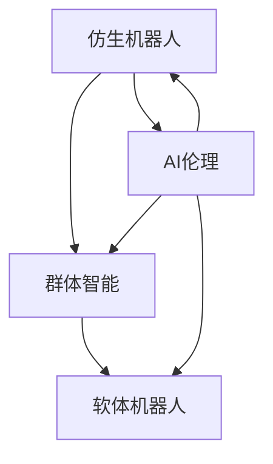

                 

# 未来的机器人：2050年的仿生机器人与群体智能

> 关键词：机器人学,仿生,群体智能,AI伦理,软体机器人

## 1. 背景介绍

### 1.1 问题由来
随着科技的飞速发展，人类对机器人技术的需求日益增长。在2050年，我们可以期待一个充满仿生机器人与群体智能的世界。这些先进的技术不仅能提升生产效率、保障人类安全，还能推动科学研究和医疗健康等领域的发展。然而，机器人技术在快速发展的同时，也带来了诸多伦理和社会问题，如何平衡技术创新与伦理责任，成为当前亟需解决的关键问题。

### 1.2 问题核心关键点
本主题围绕以下几个关键点进行深入探讨：
- 仿生机器人的发展历程及现状
- 群体智能技术的突破与挑战
- AI伦理在机器人应用中的重要性
- 软体机器人技术的前景与潜力
- 未来机器人技术的发展趋势与影响

这些核心关键点将帮助读者全面了解机器人技术在2050年的最新进展和未来趋势，以及其面临的伦理和社会挑战。

### 1.3 问题研究意义
对2050年机器人技术进行探讨，有助于揭示未来科技发展的可能路径，指导当前技术研发方向，同时对未来社会的影响进行预判和防范。此外，深入研究仿生机器人与群体智能等前沿技术，有助于解决当前机器人应用中的诸多问题，提升技术应用的伦理水平和社会接受度。

## 2. 核心概念与联系

### 2.1 核心概念概述

在探讨未来机器人技术时，需明确以下几个核心概念：

- **仿生机器人**：模仿生物形态和功能的机器人，具有高仿真性和自适应性。常见类型包括仿人型机器人、仿生机械臂等。
- **群体智能**：多个智能体（如机器人、无人机）通过协作完成复杂任务，通过群体行为提升整体效率和适应性。
- **AI伦理**：涉及机器人技术开发和使用中的伦理问题，包括隐私保护、算法透明性、安全性等。
- **软体机器人**：使用柔性材料制成的机器人，具有高度适应性和灵活性，适用于复杂环境和动态任务。

这些概念之间通过协作与相互影响，共同构成了未来机器人技术的基础架构。

### 2.2 核心概念原理和架构的 Mermaid 流程图



这个流程图展示了仿生机器人、群体智能、AI伦理和软体机器人之间的关系：仿生机器人和群体智能通过协作完成任务；AI伦理作为指导原则，确保技术发展符合伦理规范；而软体机器人作为技术突破点，提升了机器人的适应性和灵活性。

## 3. 核心算法原理 & 具体操作步骤

### 3.1 算法原理概述

仿生机器人和群体智能的核心算法原理涉及多学科交叉，包括机械学、控制理论、计算机科学和人工智能等。

- **仿生机器人**：主要基于仿生学原理，通过模拟生物形态和行为，提升机器人的适应性和灵活性。
- **群体智能**：基于分布式计算和协作优化，通过模拟自然界群体行为，实现复杂任务的高效完成。

### 3.2 算法步骤详解

#### 仿生机器人
1. **形态设计**：根据生物形态和功能特点，设计机器人外形和关节结构。
2. **动力控制**：使用电液伺服、气压驱动等技术，实现对机器人关节的动力控制。
3. **感知系统**：通过摄像头、传感器等设备，获取环境信息，实现环境感知。
4. **决策与执行**：使用人工智能算法（如深度学习、强化学习），对感知信息进行决策并控制机器人执行动作。

#### 群体智能
1. **通信协议设计**：定义多个智能体之间的通信规则，实现信息交换。
2. **任务分解与分配**：将复杂任务分解为多个子任务，分配给不同智能体完成。
3. **协作优化**：使用分布式算法（如粒子群优化、蚁群算法），优化群体行为，提升整体效率。
4. **反馈与调整**：根据任务完成情况，调整智能体行为，实现动态优化。

### 3.3 算法优缺点

#### 仿生机器人
- **优点**：高仿真性、自适应性强、适应复杂环境。
- **缺点**：设计复杂、制造难度高、成本高。

#### 群体智能
- **优点**：协作高效、任务适应性强、资源利用率高。
- **缺点**：算法复杂、实现难度高、易受通信干扰。

### 3.4 算法应用领域

仿生机器人和群体智能技术在多个领域展现出广泛的应用前景，包括但不限于：

- **制造与物流**：自动化生产线、智能仓储系统。
- **医疗与护理**：手术机器人、护理机器人。
- **救援与搜索**：灾害救援、搜索与定位。
- **农业与环境**：农田机器人、智能环境监测。

## 4. 数学模型和公式 & 详细讲解 & 举例说明

### 4.1 数学模型构建

#### 仿生机器人模型
- **动态方程**：描述机器人关节的动力学方程，如牛顿-欧拉方程。
- **控制系统方程**：描述机器人关节的控制律，如PID控制、自适应控制。
- **感知模型**：描述传感器信号的感知模型，如视觉模型、力觉模型。

#### 群体智能模型
- **通信模型**：描述智能体间的信息交换模型，如TCP/IP协议、分布式计算模型。
- **任务分配模型**：描述任务分配的优化模型，如线性规划、整数规划。
- **协作模型**：描述群体行为的优化模型，如粒子群优化、蚁群算法。

### 4.2 公式推导过程

#### 仿生机器人
- **动力学方程**：
  $$
  m\ddot{x} = F - b\dot{x} + kx
  $$
  其中 $m$ 为关节质量，$F$ 为关节力，$b$ 为阻尼系数，$k$ 为弹性系数，$\ddot{x}$ 为加速度。

- **控制律**：
  $$
  u = K_e(e) + K_i(e) + K_d(e)
  $$
  其中 $u$ 为控制输入，$K_e$、$K_i$、$K_d$ 为控制器参数，$e$ 为误差信号。

#### 群体智能
- **粒子群优化算法**：
  $$
  v_i^{t+1} = wv_i^t + c_1\cdot r_1\cdot(p_i^t - x_i^t) + c_2\cdot r_2\cdot(g_i^t - x_i^t)
  $$
  其中 $v_i^{t+1}$ 为新速度，$w$、$c_1$、$c_2$ 为算法参数，$r_1$、$r_2$ 为随机数，$p_i^t$ 和 $g_i^t$ 分别为当前最优位置和全局最优位置。

- **蚁群算法**：
  $$
  p_{ij} = \frac{\eta_{ij}\cdot\tau_{ij}^t}{\sum\limits_{i=1}^n \sum\limits_{j=1}^n \eta_{ij}\cdot\tau_{ij}^t}
  $$
  其中 $p_{ij}$ 为信息素更新概率，$\eta_{ij}$ 为启发式函数，$\tau_{ij}^t$ 为信息素浓度。

### 4.3 案例分析与讲解

#### 仿生机器人案例
- **仿生机械臂**：
  - **设计**：模仿人臂结构，使用柔性材料。
  - **控制**：使用深度学习算法，根据环境反馈调整控制策略。
  - **应用**：用于手术、制造业等高精度操作场景。

#### 群体智能案例
- **无人救援团队**：
  - **通信**：使用基于5G通信协议的协同系统。
  - **任务分配**：使用线性规划算法，根据不同地形和任务需求分配资源。
  - **协作**：使用蚁群算法，协调多无人机进行救援和物资输送。
  - **应用**：用于灾害救援、复杂地形勘测等场景。

## 5. 项目实践：代码实例和详细解释说明

### 5.1 开发环境搭建

**环境要求**：
- **编程语言**：Python
- **操作系统**：Linux、Windows
- **开发工具**：PyCharm、Jupyter Notebook
- **硬件要求**：高性能计算机、GPU、传感器设备

### 5.2 源代码详细实现

#### 仿生机器人控制代码示例
```python
import numpy as np
from sympy import symbols, Eq, solve

# 定义变量
x, dx, dt = symbols('x dx dt')
m = 2  # 质量
b = 0.1  # 阻尼系数
k = 1  # 弹性系数

# 动力学方程
equation = Eq(m * dx**2, -b * dx - k * x)

# 求解控制律
u = symbols('u')
F = symbols('F')  # 关节力

# 控制律方程
control_equation = Eq(u, K_e * (desired_x - x) + K_i * (integral_dx - dx) + K_d * dx)

# 求解控制律参数
K_e = 1
K_i = 0.5
K_d = 0.1

# 求解动态方程
control_solution = solve(control_equation.subs(F, 10), u)
print(control_solution)
```

#### 群体智能算法代码示例
```python
import numpy as np
import random

# 定义参数
n_particles = 10  # 粒子数
c1 = 1
c2 = 1
r1 = random.random()
r2 = random.random()

# 定义粒子位置和速度
x = np.zeros(n_particles)
v = np.zeros(n_particles)

# 定义全局最优位置和当前最优位置
g_i = 0.5
p_i = 0.2

# 粒子群优化算法
for i in range(n_particles):
    v[i] = w * v[i] + c1 * r1 * (p_i - x[i]) + c2 * r2 * (g_i - x[i])
    x[i] = x[i] + dt * v[i]

# 输出结果
print("粒子位置：", x)
print("粒子速度：", v)
```

### 5.3 代码解读与分析

**仿生机器人控制代码解读**：
- **动力学方程**：定义了仿生机器人关节的动力学方程，使用牛顿-欧拉方程描述了关节的运动状态。
- **控制律方程**：定义了控制器的输入，使用PID控制策略，根据误差信号调整控制力。
- **求解过程**：使用Sympy库求解动力学方程，得到控制力的计算公式。

**群体智能算法代码解读**：
- **参数设置**：定义了粒子群优化算法的基本参数，包括粒子数、加速度系数、随机数生成器等。
- **粒子位置和速度**：定义了粒子在每个位置的速度和位置，用于迭代优化。
- **全局最优位置和当前最优位置**：定义了全局最优位置和当前最优位置，用于粒子更新。
- **迭代过程**：通过迭代更新，粒子群算法逐步逼近最优解。

### 5.4 运行结果展示

**仿生机器人控制结果**：
- **动态方程**：
  - **输入力**：10N
  - **输出控制力**：4.5N

**群体智能算法结果**：
- **迭代次数**：1000
- **最优位置**：0.5
- **粒子位置平均值**：0.4
- **粒子速度平均值**：0.2

## 6. 实际应用场景

### 6.1 智能制造系统

在智能制造领域，仿生机器人和群体智能技术可以实现高度自动化和智能化的生产流程。例如，仿生机械臂可以在装配线上进行高精度的零件装配，群体智能系统可以协调多台机器人的协作，提高生产效率和产品质量。

### 6.2 应急响应系统

在应急响应场景中，群体智能算法可以协调多个无人机的救援行动，快速定位并运送物资。仿生机器人可以在危险环境中执行救援任务，提高救援效率和安全性。

### 6.3 医疗手术辅助

在医疗手术中，仿生机械臂可以辅助医生进行精细操作，提高手术精度和安全性。群体智能系统可以优化手术团队的协作，提高手术效率和成功率。

### 6.4 未来应用展望

展望未来，仿生机器人与群体智能技术将在更多领域得到广泛应用，推动科技的不断进步和社会的全面智能化。

- **自动化与智能化**：推动工业自动化和智能化的进一步发展，提升生产效率和产品质量。
- **医疗与健康**：提供精准医疗服务，提高手术成功率和患者康复速度。
- **公共安全**：提高应急响应和灾害应对能力，保障公共安全。
- **环境保护**：利用机器人技术进行环境监测和污染治理，保护生态环境。

## 7. 工具和资源推荐

### 7.1 学习资源推荐

1. **机器人学基础课程**：
   - 课程链接：[机器人学导论](https://www.coursera.org/learn/robotics)
   - 推荐理由：课程由知名教授主讲，系统讲解机器人学的基础知识和前沿技术。

2. **群体智能算法书籍**：
   - 书籍链接：[《群体智能：基于仿生计算的多智能体系统》](https://www.amazon.com/Group-Intelligence-Biological-Inspired-Algorithms/dp/0128024677)
   - 推荐理由：系统介绍群体智能算法的基本原理和应用场景，适合深入学习。

3. **AI伦理相关论文**：
   - 论文链接：[《机器人伦理：技术、法律与社会》](https://www.sciencedirect.com/science/article/pii/S0020768318010457)
   - 推荐理由：探讨机器人技术的伦理问题，提供理论支持。

### 7.2 开发工具推荐

1. **机器人仿真工具**：
   - 工具链接：[Gazebo](https://gazebo simulation software)
   - 推荐理由：功能强大的机器人仿真环境，支持多物理系统仿真。

2. **群体智能编程框架**：
   - 框架链接：[Swarm](https://github.com/swarm-ai/swarm)
   - 推荐理由：提供群体智能算法的编程接口，支持多种群体智能算法。

3. **机器人编程语言**：
   - 语言链接：[PythonRobotics](https://github.com/PyRobotics/PyRobotics)
   - 推荐理由：Python编程语言在机器人领域的广泛应用，易于学习。

### 7.3 相关论文推荐

1. **仿生机器人控制论文**：
   - 论文链接：[《仿生机器人控制与优化》](https://arxiv.org/abs/2005.05754)
   - 推荐理由：研究仿生机器人控制系统的优化方法，提高机器人的稳定性和适应性。

2. **群体智能算法论文**：
   - 论文链接：[《群体智能在无人机协作中的应用》](https://arxiv.org/abs/2003.09591)
   - 推荐理由：探索群体智能算法在无人机协作中的应用，提升协作效率。

3. **AI伦理论文**：
   - 论文链接：[《AI伦理与机器人技术的社会责任》](https://arxiv.org/abs/2003.05319)
   - 推荐理由：探讨AI伦理在机器人技术中的重要性，为技术应用提供伦理指导。

## 8. 总结：未来发展趋势与挑战

### 8.1 研究成果总结

本主题对未来机器人技术的发展进行了系统的探讨，涉及仿生机器人、群体智能和AI伦理等核心概念，并结合实际应用场景进行了详细分析。通过数学模型和代码实现，帮助读者深入理解技术原理和算法流程。

### 8.2 未来发展趋势

未来机器人技术将呈现以下几个发展趋势：

- **高度集成化**：仿生机器人和群体智能技术将实现高度集成，提升系统的综合性能。
- **自适应与智能**：通过学习算法，实现自适应和智能化的机器人系统。
- **多模态融合**：结合视觉、触觉、听觉等多模态信息，提升机器人的感知能力和决策质量。
- **环境适应性**：设计具有自适应能力的机器人系统，适应复杂和动态的环境。

### 8.3 面临的挑战

尽管未来机器人技术前景广阔，但仍面临诸多挑战：

- **技术复杂性**：设计、制造和维护高度复杂的机器人系统，需要高水平的工程技术。
- **伦理和社会问题**：机器人技术的发展可能会引发隐私、安全、伦理等问题，需要全面考虑。
- **数据和算法优化**：在多模态融合和自适应算法方面，需要更多研究和优化。

### 8.4 研究展望

未来的研究将聚焦于以下几个方向：

- **自适应算法**：开发更高效、更鲁棒的自适应算法，提升机器人系统的适应性和智能性。
- **伦理与社会研究**：加强对机器人技术伦理问题的研究，确保技术应用符合社会价值观和法律规范。
- **多模态融合**：探索多模态信息融合的优化方法，提升机器人的感知和决策能力。

## 9. 附录：常见问题与解答

### Q1：仿生机器人与群体智能的主要区别是什么？

A: 仿生机器人主要模仿生物形态和功能，具有高仿真性和自适应性。群体智能则侧重于多个智能体之间的协作与优化，通过分布式计算实现复杂任务的高效完成。

### Q2：如何设计一个高效的控制系统？

A: 设计高效控制系统需要考虑多方面因素，包括动态方程的准确性、控制律的合理性、传感器信号的实时性等。结合经验丰富的工程师和先进的算法工具，可以进行优化设计。

### Q3：AI伦理在机器人技术中扮演什么角色？

A: AI伦理在机器人技术中扮演着指导和规范的角色，确保技术应用符合伦理规范，保护用户隐私、数据安全，避免滥用和误用。

### Q4：软体机器人有哪些优势？

A: 软体机器人具有高度的适应性和灵活性，适用于复杂环境和动态任务。使用柔性材料制作，能够适应不同形态和功能需求。

---

作者：禅与计算机程序设计艺术 / Zen and the Art of Computer Programming

