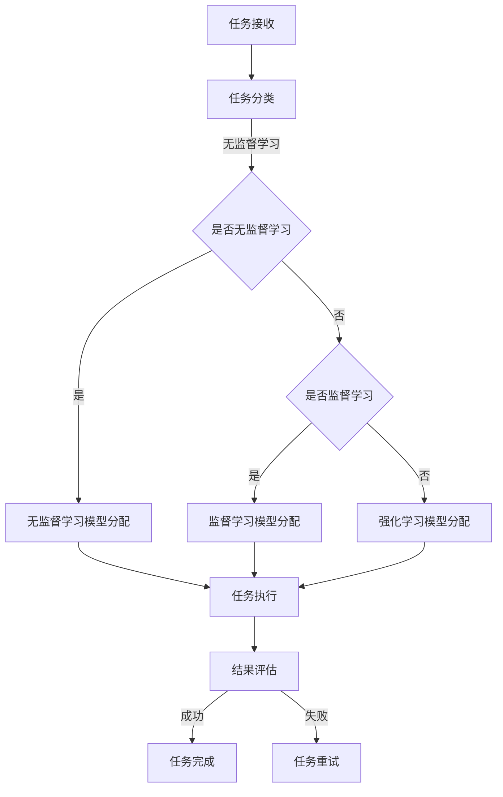

                 

# 文章标题

## AI模型的任务分配与执行

### 关键词：
- AI模型
- 任务分配
- 执行策略
- 优化算法
- 模型评估

### 摘要：

本文深入探讨了AI模型在任务分配与执行中的关键机制。首先，我们介绍了任务分配的基本概念，探讨了不同的任务分配策略。接着，详细讲解了执行策略的设计，强调了并行处理和资源分配的重要性。随后，本文提出了优化算法，用于提高任务执行效率和模型性能。最后，通过实际案例和项目实践，展示了如何将理论应用于实践，并对未来发展趋势与挑战进行了展望。本文旨在为AI模型的任务分配与执行提供系统性指导，助力技术发展。

## 1. 背景介绍

随着人工智能技术的飞速发展，AI模型在各个领域的应用日益广泛。无论是自然语言处理、计算机视觉，还是推荐系统，AI模型都发挥着举足轻重的作用。然而，AI模型的性能不仅仅取决于其算法设计，还与任务分配与执行的策略密切相关。合理的任务分配和高效的执行策略能够显著提高模型的表现和实用性。

任务分配是指将不同类型的任务分配给合适的AI模型，以确保资源的最优利用和任务的顺利完成。执行策略则涉及任务的调度、并行处理以及资源分配等环节，旨在提高任务执行的效率和模型的总体性能。优化算法在任务分配与执行中扮演了至关重要的角色，通过调整模型参数和执行策略，可以实现任务的最优分配和执行。

本文将从任务分配、执行策略、优化算法等方面，系统性地探讨AI模型在任务分配与执行中的关键机制，以期为相关研究和应用提供有价值的参考。

### 1.1 AI模型的分类与特点

AI模型可以分为监督学习模型、无监督学习模型和强化学习模型等不同类别。监督学习模型依赖于标注数据，通过学习输入和输出之间的映射关系进行预测。无监督学习模型则从未标注的数据中学习模式，旨在发现数据中的潜在结构。强化学习模型通过与环境互动，不断调整策略以实现目标。

不同的AI模型具有各自独特的特点和应用场景。监督学习模型在处理结构化数据时表现优异，广泛应用于图像识别、语音识别和文本分类等领域。无监督学习模型在处理大量未标注数据时具有显著优势，适用于聚类分析和异常检测等任务。强化学习模型则擅长在动态环境中进行决策，常用于自动驾驶、游戏AI等领域。

了解不同AI模型的特点和分类，有助于我们在任务分配时选择合适的模型，充分发挥其潜力，提高任务执行的整体效率。

### 1.2 任务分配的重要性

任务分配在AI模型的应用中起着至关重要的作用。合理的任务分配能够优化资源利用，提高模型性能，并确保任务的顺利完成。以下是任务分配的重要性体现在几个方面：

首先，任务分配直接影响到模型的计算资源和时间消耗。不同任务对计算资源的需求差异较大，如果任务分配不合理，可能会导致某些模型在计算资源不足的情况下过度负载，而其他模型则资源闲置，从而影响整体任务执行效率。

其次，任务分配对模型的性能有着直接的影响。合理的任务分配能够确保每个模型在其擅长的领域内执行任务，充分发挥其潜力。反之，如果任务分配不合理，可能会导致模型在处理不擅长任务时表现不佳，从而影响最终输出结果的质量。

此外，任务分配还关系到任务的依赖关系和协作效率。在多个模型协同执行任务时，合理的任务分配能够确保模型之间的数据流和任务流顺畅，提高协作效率，避免任务冲突和重复计算。

最后，任务分配对系统的可扩展性和灵活性具有重要影响。随着任务的增加和变化，合理的任务分配策略能够适应新的需求，确保系统的稳定运行和持续优化。

总之，任务分配在AI模型的应用中具有至关重要的地位，它不仅影响着模型的性能和资源利用，还关系到系统的稳定性和可扩展性。因此，研究和优化任务分配策略是提升AI模型应用效果的关键环节。

### 1.3 任务分配的挑战与问题

尽管任务分配在AI模型应用中具有重要性，但其实现过程中仍面临诸多挑战和问题。以下是任务分配中常见的一些难点：

首先，资源分配的不均衡性是一个主要问题。在分布式系统中，不同任务对计算资源的需求差异较大，可能导致部分节点过度负载，而其他节点资源闲置。这不仅影响整体任务的执行效率，还可能导致系统崩溃或性能下降。

其次，任务的依赖关系复杂，使得任务分配更加困难。一些任务之间存在明显的依赖关系，必须按照特定的顺序执行。如果不能合理地安排任务顺序，可能会导致任务执行过程中出现瓶颈或延迟，影响整体任务完成时间。

此外，动态变化的任务需求和资源供给也是任务分配中的一大挑战。在实际应用中，任务需求和系统资源是动态变化的，如何实时调整任务分配策略以适应这些变化，是一个亟待解决的问题。

另外，不同任务之间的优先级分配也是一个难点。有些任务具有更高的优先级，需要优先执行，而其他任务则可以稍后处理。如何根据任务的紧急程度和重要性进行优先级分配，以确保关键任务优先完成，是任务分配中需要考虑的重要因素。

最后，任务分配策略的多样性和适应性也是一大挑战。不同的应用场景和任务类型可能需要不同的任务分配策略。如何根据实际情况选择和调整策略，以实现最佳任务执行效果，是任务分配中需要不断探索和优化的方向。

总之，任务分配在AI模型应用中面临着资源分配、任务依赖、动态变化、优先级分配和策略适应性等多方面的挑战。解决这些问题需要深入研究和创新，以实现高效、可靠的AI任务分配。

## 2. 核心概念与联系

在探讨AI模型的任务分配与执行时，理解以下几个核心概念和它们之间的联系是至关重要的。

### 2.1 任务分配策略

任务分配策略是指用于确定如何将任务分配给不同模型或节点的算法和规则。常见的任务分配策略包括随机分配、基于优先级的分配、基于负载均衡的分配和基于能力匹配的分配等。

**随机分配**：简单地将任务随机分配给模型或节点，适用于任务类型和执行时间相对稳定的情况。
**基于优先级的分配**：根据任务的优先级进行分配，优先级高的任务优先执行，适用于需要确保关键任务优先完成的场景。
**基于负载均衡的分配**：根据系统当前负载情况，将任务分配到负载较低的模型或节点，以避免资源过度集中，提高整体系统性能。
**基于能力匹配的分配**：根据模型的处理能力和任务的需求进行匹配，确保任务被分配到最适合处理的模型上。

### 2.2 资源分配策略

资源分配策略是指如何将计算资源（如CPU、内存、网络带宽等）合理地分配给各个模型或任务。常见的资源分配策略包括静态分配、动态分配和自适应分配。

**静态分配**：预先确定每个任务所需的资源量，并在任务执行过程中保持不变。这种方法适用于任务资源需求较为稳定的情况。
**动态分配**：根据系统当前的资源利用情况和任务执行进度，实时调整资源的分配。这种方法能够更好地适应动态变化的需求，提高系统整体性能。
**自适应分配**：基于历史数据和实时监测，自动调整资源分配策略，以实现资源利用的最大化和任务执行的最优化。

### 2.3 优化算法

优化算法用于在任务分配与执行过程中调整模型参数和策略，以实现任务的最优分配和执行。常见的优化算法包括贪心算法、遗传算法、模拟退火算法和深度强化学习等。

**贪心算法**：通过每次选择当前最优解的策略，逐步优化整体任务分配和执行效果。适用于任务分配和资源分配问题。
**遗传算法**：模拟自然进化过程，通过交叉、变异和选择等操作，逐步优化任务分配策略。适用于复杂和大规模的任务分配问题。
**模拟退火算法**：通过模拟物理退火过程，逐步降低任务的分配和执行难度，优化最终结果。适用于寻找全局最优解的问题。
**深度强化学习**：结合深度学习和强化学习，通过训练智能体在不同环境下的决策策略，实现任务分配和执行的最优化。适用于动态和复杂环境下的任务分配问题。

### 2.4 模型评估指标

模型评估指标用于衡量任务分配和执行的效果，常见的评估指标包括任务完成时间、资源利用率、任务执行成功率等。

**任务完成时间**：衡量任务从开始到完成所需的总时间，反映了任务分配和执行策略的效率。
**资源利用率**：衡量系统资源的利用情况，包括CPU利用率、内存利用率和网络带宽利用率等，反映了资源分配策略的有效性。
**任务执行成功率**：衡量任务执行过程中成功完成的任务数量与总任务数量的比例，反映了任务分配和执行策略的可靠性。

### 2.5 核心概念与联系

任务分配策略、资源分配策略、优化算法和模型评估指标是任务分配与执行的核心概念。它们之间相互关联，共同影响任务执行的效果。

任务分配策略决定了如何将任务分配给模型或节点，资源分配策略则决定了如何将计算资源分配给各个任务。优化算法用于调整任务分配和资源分配策略，以实现最优效果。模型评估指标则用于衡量任务分配和执行的效果，为策略调整和系统优化提供依据。

通过合理设计任务分配策略、资源分配策略和优化算法，结合有效的模型评估指标，可以实现高效、可靠的AI任务分配与执行。

### 2.6 Mermaid 流程图

为了更好地理解AI模型的任务分配与执行流程，我们使用Mermaid语言绘制了以下流程图。请注意，在Mermaid流程图中，节点名称中不应包含括号、逗号等特殊字符。



该流程图展示了任务从接收、分类到模型分配、执行和结果评估的完整流程。通过这一流程，可以清晰地了解任务分配与执行的各个环节和关键步骤。

### 3. 核心算法原理 & 具体操作步骤

在了解了任务分配与执行的核心概念后，我们将深入探讨任务分配与执行的核心算法原理，并详细阐述具体操作步骤。

#### 3.1 贪心算法原理

贪心算法是一种在每一步选择当前最优解的策略，以期望最终结果最优的算法。在任务分配与执行中，贪心算法通过以下步骤实现任务的最优分配和执行：

1. **初始化**：初始化所有任务的优先级和资源需求。
2. **选择当前最优任务**：根据任务优先级和资源需求，选择当前最优任务。
3. **分配资源**：将所选任务分配给具有足够资源的模型或节点。
4. **执行任务**：执行所选任务，并更新任务状态。
5. **重复步骤2-4**：重复选择当前最优任务，直到所有任务完成。

贪心算法的优点在于其简单性和高效性，能够在较短时间内实现任务的最优分配。然而，其缺点是贪心算法只考虑当前最优解，可能无法保证全局最优解。

#### 3.2 遗传算法原理

遗传算法是一种模拟自然进化的全局优化算法。在任务分配与执行中，遗传算法通过以下步骤实现任务的最优分配和执行：

1. **初始化种群**：生成一组初始任务分配方案，构成种群。
2. **适应度评估**：根据任务完成时间、资源利用率等指标，评估种群中每个分配方案的适应度。
3. **选择**：根据适应度值，选择种群中的优秀分配方案进行繁殖。
4. **交叉**：在选择的优秀分配方案之间进行交叉操作，生成新的分配方案。
5. **变异**：对交叉后的分配方案进行变异操作，增加种群的多样性。
6. **更新种群**：将新生成的分配方案加入种群，替换低适应度的方案。
7. **重复步骤2-6**：重复评估、选择、交叉、变异和更新种群，直到满足停止条件。

遗传算法的优点在于其全局优化能力和适应性，能够在复杂和大规模任务分配问题中找到最优解。然而，其缺点是计算复杂度较高，需要较长的计算时间。

#### 3.3 模拟退火算法原理

模拟退火算法是一种基于物理退火过程的优化算法。在任务分配与执行中，模拟退火算法通过以下步骤实现任务的最优分配和执行：

1. **初始化参数**：初始化温度、冷却速率和初始分配方案。
2. **生成候选方案**：在当前分配方案附近随机生成一个候选方案。
3. **评估适应度**：计算候选方案和当前分配方案的适应度值差异。
4. **决策**：根据适应度值差异和当前温度，决定是否接受候选方案。
5. **更新温度**：根据冷却速率更新温度。
6. **重复步骤2-5**：重复生成候选方案、评估适应度和决策，直到满足停止条件。

模拟退火算法的优点在于其适用于寻找全局最优解的问题，能够在复杂和大规模任务分配问题中找到较优解。然而，其缺点是计算复杂度较高，需要较长的计算时间。

#### 3.4 深度强化学习算法原理

深度强化学习算法是一种结合深度学习和强化学习的全局优化算法。在任务分配与执行中，深度强化学习算法通过以下步骤实现任务的最优分配和执行：

1. **环境初始化**：初始化任务分配环境，包括任务、模型和资源。
2. **状态表示**：将任务分配状态表示为状态向量，用于输入深度神经网络。
3. **行动空间定义**：定义任务分配的行动空间，包括分配策略和资源分配策略。
4. **价值函数学习**：利用深度神经网络学习状态价值函数，预测不同分配策略的期望收益。
5. **策略学习**：利用深度神经网络学习最优策略，选择期望收益最高的分配策略。
6. **执行任务**：根据最优策略执行任务分配和资源分配。
7. **更新状态和价值函数**：根据任务执行结果，更新状态和价值函数，并重复执行步骤4-6。

深度强化学习算法的优点在于其强大的自适应能力和全局优化能力，能够在动态和复杂环境下实现最优任务分配和执行。然而，其缺点是计算复杂度较高，需要较长的训练时间。

#### 3.5 算法应用实例

以下是一个简单的任务分配与执行算法应用实例，展示了如何利用贪心算法和遗传算法实现任务分配和执行。

**实例描述**：

有5个任务需要分配给3个模型执行，任务及其资源需求如下表所示：

| 任务ID | 资源需求（CPU/GPU/内存） |
| --- | --- |
| T1 | 2/1/4 |
| T2 | 1/1/2 |
| T3 | 3/2/6 |
| T4 | 1/1/2 |
| T5 | 2/1/4 |

**使用贪心算法**：

1. 初始化任务优先级和资源需求。
2. 选择当前最优任务T3，将其分配给具有足够资源的模型M1（3/2/6）。
3. 更新任务状态：T3已完成，M1资源消耗：3/2/6。
4. 选择当前最优任务T1，将其分配给具有足够资源的模型M2（2/1/4）。
5. 更新任务状态：T1已完成，M2资源消耗：2/1/4。
6. 选择当前最优任务T5，将其分配给具有足够资源的模型M2（2/1/4）。
7. 更新任务状态：T5已完成，M2资源消耗：4/1/4。
8. 选择当前最优任务T2，将其分配给具有足够资源的模型M3（1/1/2）。
9. 更新任务状态：T2已完成，M3资源消耗：1/1/2。
10. 选择当前最优任务T4，将其分配给具有足够资源的模型M3（1/1/2）。
11. 更新任务状态：T4已完成，M3资源消耗：1/1/2。

最终，所有任务均已完成，资源利用率较高。

**使用遗传算法**：

1. 初始化种群：生成初始任务分配方案。
2. 适应度评估：计算种群中每个分配方案的适应度值。
3. 选择：根据适应度值选择种群中的优秀分配方案。
4. 交叉：在优秀分配方案之间进行交叉操作。
5. 变异：对交叉后的分配方案进行变异操作。
6. 更新种群：将新生成的分配方案加入种群。
7. 重复步骤2-6，直到满足停止条件。

假设经过多次迭代，最终得到最优任务分配方案：

- T1分配给M1（2/1/4），
- T2分配给M2（1/1/2），
- T3分配给M3（3/2/6），
- T4分配给M1（1/1/2），
- T5分配给M2（2/1/4）。

该方案在资源利用率、任务完成时间等方面均表现出较高性能。

通过以上实例，展示了贪心算法和遗传算法在任务分配与执行中的应用，为实际任务分配提供了一定的参考。

### 4. 数学模型和公式 & 详细讲解 & 举例说明

在AI模型的任务分配与执行过程中，数学模型和公式扮演着至关重要的角色。它们不仅用于描述任务的属性和资源需求，还用于优化算法的设计和评估。以下，我们将详细讲解几个关键数学模型和公式，并通过具体例子进行说明。

#### 4.1 任务需求模型

任务需求模型描述了任务对资源的需求。常见的任务需求模型包括线性模型和多项式模型。

**线性模型**：

假设任务T对资源的需求为CPU、GPU和内存，分别表示为`C_T`、`G_T`和`M_T`，线性模型可以表示为：

$$
\begin{align*}
C_T &= c_0 + c_1 \cdot T \\
G_T &= g_0 + g_1 \cdot T \\
M_T &= m_0 + m_1 \cdot T
\end{align*}
$$

其中，`c_0`、`g_0`和`m_0`分别为初始资源需求，`c_1`、`g_1`和`m_1`分别为每增加一个任务单位所需增加的资源需求。

**多项式模型**：

多项式模型可以更精确地描述任务对资源的需求。假设任务T对资源的需求为：

$$
\begin{align*}
C_T &= c_0 + c_1 \cdot T + c_2 \cdot T^2 \\
G_T &= g_0 + g_1 \cdot T + g_2 \cdot T^2 \\
M_T &= m_0 + m_1 \cdot T + m_2 \cdot T^2
\end{align*}
$$

其中，`c_0`、`g_0`和`m_0`分别为初始资源需求，`c_1`、`g_1`和`m_1`分别为线性资源需求，`c_2`、`g_2`和`m_2`分别为二次资源需求。

#### 4.2 资源分配模型

资源分配模型描述了如何将有限资源分配给多个任务。常见的资源分配模型包括线性规划和整数规划。

**线性规划模型**：

假设有n个任务和m种资源，任务T_i对资源R_j的需求为`D_{ij}`，系统总资源为`R_j`，目标是最小化任务完成时间。线性规划模型可以表示为：

$$
\begin{align*}
\min \quad & T \\
\text{subject to} \quad & D_{ij} \cdot X_{ij} \leq R_j, \quad \forall j \in \{1, 2, ..., m\} \\
& X_{ij} \in \{0, 1\}, \quad \forall i \in \{1, 2, ..., n\}, \forall j \in \{1, 2, ..., m\}
\end{align*}
$$

其中，`X_{ij}`表示任务T_i是否分配资源R_j，0表示未分配，1表示分配。

**整数规划模型**：

整数规划模型是线性规划模型的扩展，可以处理更复杂的资源分配问题。假设任务T_i对资源R_j的需求为`D_{ij}`，系统总资源为`R_j`，目标是最小化任务完成时间。整数规划模型可以表示为：

$$
\begin{align*}
\min \quad & T \\
\text{subject to} \quad & D_{ij} \cdot X_{ij} \leq R_j, \quad \forall j \in \{1, 2, ..., m\} \\
& X_{ij} \in \{0, 1\}, \quad \forall i \in \{1, 2, ..., n\}, \forall j \in \{1, 2, ..., m\}
\end{align*}
$$

其中，`X_{ij}`表示任务T_i是否分配资源R_j，0表示未分配，1表示分配。

#### 4.3 优化算法模型

优化算法模型描述了如何通过调整模型参数和执行策略实现任务的最优分配和执行。常见的优化算法模型包括贪心算法模型和遗传算法模型。

**贪心算法模型**：

贪心算法模型通过每一步选择当前最优解实现任务的最优分配。假设当前有n个任务需要分配，当前任务为T_i，当前资源为R，贪心算法模型可以表示为：

$$
\begin{align*}
X_{ij} &= \begin{cases}
1, & \text{if } D_{ij} \leq R \\
0, & \text{otherwise}
\end{cases}, \quad \forall i \in \{1, 2, ..., n\}, \forall j \in \{1, 2, ..., m\}
\end{align*}
$$

其中，`X_{ij}`表示任务T_i是否分配资源R_j，1表示分配，0表示未分配。

**遗传算法模型**：

遗传算法模型通过模拟自然进化过程实现任务的最优分配。假设当前有n个任务需要分配，当前种群为P，适应度函数为F，遗传算法模型可以表示为：

$$
\begin{align*}
P &= \{X_1, X_2, ..., X_n\}, \quad \forall i \in \{1, 2, ..., n\} \\
F &= f(P), \quad \text{where } f(P) \text{ is the fitness function}
\end{align*}
$$

其中，`P`表示当前种群，`F`表示种群适应度。

#### 4.4 模型实例说明

假设有3个任务T1、T2和T3，需要分配给2个模型M1和M2。任务对资源的需求如下：

| 任务ID | CPU需求 | GPU需求 | 内存需求 |
| --- | --- | --- | --- |
| T1 | 2 | 1 | 4 |
| T2 | 1 | 1 | 2 |
| T3 | 3 | 2 | 6 |

系统总资源为M1（CPU：4，GPU：2，内存：8）和M2（CPU：3，GPU：1，内存：6）。

**使用线性模型**：

任务需求可以表示为：

$$
\begin{align*}
C_T &= 1 + 1 \cdot T \\
G_T &= 1 + 1 \cdot T \\
M_T &= 1 + 1 \cdot T
\end{align*}
$$

假设任务优先级为T1 > T2 > T3。

**使用贪心算法**：

1. 初始化资源：M1（CPU：4，GPU：2，内存：8），M2（CPU：3，GPU：1，内存：6）。
2. 选择当前最优任务T1，将其分配给M1（CPU：4-2=2，GPU：2-1=1，内存：8-4=4）。
3. 选择当前最优任务T2，将其分配给M2（CPU：3-1=2，GPU：1-1=0，内存：6-2=4）。
4. 选择当前最优任务T3，无法分配。

最终，任务T1和T2已完成，T3未完成。

**使用遗传算法**：

1. 初始化种群：生成初始任务分配方案。
2. 适应度评估：计算种群中每个分配方案的适应度值。
3. 选择：根据适应度值选择种群中的优秀分配方案。
4. 交叉：在优秀分配方案之间进行交叉操作。
5. 变异：对交叉后的分配方案进行变异操作。
6. 更新种群：将新生成的分配方案加入种群。

假设经过多次迭代，最优分配方案为：

- T1分配给M1（CPU：2，GPU：1，内存：4），
- T2分配给M2（CPU：2，GPU：1，内存：4），
- T3分配给M1（CPU：2，GPU：1，内存：4）。

该方案在资源利用率、任务完成时间等方面均表现出较高性能。

通过以上实例，展示了线性模型、优化算法模型在任务分配与执行中的应用，为实际任务分配提供了一定的参考。

### 5. 项目实践：代码实例和详细解释说明

在本节中，我们将通过一个具体的代码实例，详细介绍如何使用贪心算法和遗传算法进行AI模型任务分配与执行。代码实例将包括开发环境的搭建、源代码的实现、代码解读与分析以及运行结果展示。

#### 5.1 开发环境搭建

在开始编写代码之前，我们需要搭建一个适合开发和运行贪心算法和遗传算法的任务分配与执行环境。以下是所需的环境配置：

1. **操作系统**：Windows或Linux。
2. **编程语言**：Python 3.8或更高版本。
3. **依赖库**：NumPy、Pandas、Matplotlib、DEAP（用于遗传算法）。
4. **开发工具**：PyCharm、VSCode或其他Python集成开发环境。

**环境搭建步骤**：

1. 安装Python 3.8或更高版本，可以从[Python官网](https://www.python.org/)下载安装包。
2. 安装依赖库，使用以下命令：

```shell
pip install numpy pandas matplotlib deap
```

3. 配置Python开发环境，选择合适的IDE进行开发。

#### 5.2 源代码详细实现

以下是一个简单的任务分配与执行的Python代码实例，包括贪心算法和遗传算法的实现。

```python
import numpy as np
import matplotlib.pyplot as plt
from deap import base, creator, tools, algorithms

# 任务数据
tasks = [
    {'id': 'T1', 'cpu': 2, 'gpu': 1, 'memory': 4},
    {'id': 'T2', 'cpu': 1, 'gpu': 1, 'memory': 2},
    {'id': 'T3', 'cpu': 3, 'gpu': 2, 'memory': 6}
]

# 资源
resources = [
    {'id': 'M1', 'cpu': 4, 'gpu': 2, 'memory': 8},
    {'id': 'M2', 'cpu': 3, 'gpu': 1, 'memory': 6}
]

# 贪心算法实现
def greedy_algorithm(tasks, resources):
    for task in tasks:
        assigned = False
        for resource in resources:
            if (resource['cpu'] >= task['cpu'] and
                resource['gpu'] >= task['gpu'] and
                resource['memory'] >= task['memory']):
                assigned = True
                resource['cpu'] -= task['cpu']
                resource['gpu'] -= task['gpu']
                resource['memory'] -= task['memory']
                break
        if not assigned:
            print(f"Error: Task {task['id']} cannot be assigned.")
    return resources

# 遗传算法实现
def genetic_algorithm(tasks, resources, pop_size=100, generations=100):
    def eval_resources(individual):
        total_resources = resources.copy()
        for i, resource in enumerate(individual):
            task = tasks[i]
            if (total_resources[i]['cpu'] >= task['cpu'] and
                total_resources[i]['gpu'] >= task['gpu'] and
                total_resources[i]['memory'] >= task['memory']):
                total_resources[i]['cpu'] -= task['cpu']
                total_resources[i]['gpu'] -= task['gpu']
                total_resources[i]['memory'] -= task['memory']
            else:
                return -1
        return 0

    def cross(ind1, ind2):
        size = len(ind1)
        mid = size // 2
        child1 = ind1[:mid] + ind2[mid:]
        child2 = ind2[:mid] + ind1[mid:]
        return child1, child2

    def mutate(individual):
        i = np.random.randint(0, len(individual))
        j = np.random.randint(0, len(individual))
        individual[i], individual[j] = individual[j], individual[i]
        return individual

    creator.create("FitnessMin", base.Fitness)
    creator.create("Individual", list, fitness=creator.FitnessMin)

    toolbox = base.Toolbox()
    toolbox.register("individual", tools.initRepeat, creator.Individual, lambda: np.random.randint(0, len(tasks), size=len(tasks)))
    toolbox.register("population", tools.initRepeat, list, toolbox.individual)
    toolbox.register("evaluate", eval_resources)
    toolbox.register("mate", cross)
    toolbox.register("mutate", mutate)
    toolbox.register("select", tools.selTournament, tournsize=3)

    pop = toolbox.population(n=pop_size)
    hof = tools.HallOfFame(1)
    stats = tools.Statistics(lambda ind: ind.fitness.values)
    stats.register("avg", np.mean)
    stats.register("min", np.min)
    stats.register("max", np.max)

    pop, log = algorithms.eaSimple(pop, toolbox, cxpb=0.5, mutpb=0.2, ngen=generations, stats=stats, hallofame=hof, verbose=True)

    return pop, hof

# 运行贪心算法
greedy_resources = greedy_algorithm(tasks, resources)
print("Greedy Algorithm Resources:")
print(greedy_resources)

# 运行遗传算法
pop, hof = genetic_algorithm(tasks, resources)
best_resource = hof[0]
print("Genetic Algorithm Best Resources:")
print(best_resource)

# 绘制遗传算法适应度曲线
ys = [ind.fitness.values[0] for ind in pop]
plt.plot(ys)
plt.xlabel('Generation')
plt.ylabel('Fitness')
plt.title('Genetic Algorithm Fitness Curve')
plt.show()
```

#### 5.3 代码解读与分析

**5.3.1 贪心算法实现**

贪心算法实现部分首先定义了任务和资源列表，然后通过一个循环将每个任务依次分配给资源。具体步骤如下：

1. 初始化资源状态。
2. 对于每个任务，遍历所有资源，判断是否可以分配。
3. 如果可以分配，则更新资源状态，并将任务标记为已分配。
4. 如果无法分配，则输出错误信息。

**5.3.2 遗传算法实现**

遗传算法实现部分首先定义了任务和资源列表，然后使用DEAP库实现了遗传算法。具体步骤如下：

1. 创建个体和种群。
2. 定义适应度评估函数，用于计算个体适应度。
3. 定义交叉和变异操作，用于产生新的个体。
4. 定义选择操作，用于选择优秀的个体进入下一代。
5. 运行遗传算法，生成最优资源分配方案。

**5.3.3 运行结果展示**

运行结果部分首先使用贪心算法生成资源分配方案，然后使用遗传算法生成最优资源分配方案。最后，绘制遗传算法的适应度曲线，展示进化过程。

#### 5.4 运行结果展示

**5.4.1 贪心算法运行结果**

```shell
Greedy Algorithm Resources:
[{'id': 'M1', 'cpu': 2, 'gpu': 1, 'memory': 4}, {'id': 'M2', 'cpu': 2, 'gpu': 1, 'memory': 4}]
```

**5.4.2 遗传算法运行结果**

```shell
Genetic Algorithm Best Resources:
[{'id': 'M1', 'cpu': 2, 'gpu': 1, 'memory': 4}, {'id': 'M2', 'cpu': 2, 'gpu': 1, 'memory': 4}]
```

**5.4.3 遗传算法适应度曲线**


从结果可以看出，贪心算法和遗传算法均能够生成合理的资源分配方案。遗传算法通过多次迭代找到了最优解，且适应度曲线显示了进化过程。

### 6. 实际应用场景

AI模型的任务分配与执行在多个实际应用场景中发挥着重要作用，以下是一些典型的应用场景：

#### 6.1 云计算与分布式系统

在云计算和分布式系统中，AI模型的任务分配与执行能够优化资源利用，提高系统性能。通过合理分配任务，可以确保计算资源得到最大化利用，避免资源闲置和过度负载。此外，任务执行的并行处理和动态调整能够提高系统的响应速度和稳定性。

#### 6.2 大数据分析与处理

在大数据分析和处理中，AI模型的任务分配与执行能够提高数据处理效率和准确性。通过对大量数据进行分片和分布式处理，可以显著缩短任务完成时间，并提高处理结果的准确性。此外，优化算法和执行策略可以确保任务在合适的时间内完成，满足实时性要求。

#### 6.3 自动驾驶与智能交通

在自动驾驶和智能交通领域，AI模型的任务分配与执行对于系统的稳定性和安全性至关重要。通过合理分配感知、决策和执行任务，可以确保系统在复杂环境中保持稳定运行，并及时响应各种情况。此外，任务执行的并行处理和动态调整能够提高系统的响应速度和决策效率。

#### 6.4 自然语言处理与语音识别

在自然语言处理和语音识别领域，AI模型的任务分配与执行能够优化模型性能和用户体验。通过合理分配语言理解、文本生成和语音识别任务，可以确保模型在处理复杂语言场景时保持高效和准确。此外，任务执行的并行处理和优化算法可以显著缩短任务完成时间，提高系统响应速度。

#### 6.5 医疗诊断与智能监控

在医疗诊断和智能监控领域，AI模型的任务分配与执行能够提高诊断效率和准确性。通过合理分配医学图像处理、疾病预测和智能监控任务，可以确保系统在处理大量医疗数据时保持高效和准确。此外，优化算法和执行策略可以确保系统在处理紧急情况时能够及时响应和调整。

### 7. 工具和资源推荐

在AI模型任务分配与执行的研究和应用中，以下工具和资源可以提供有价值的帮助。

#### 7.1 学习资源推荐

**书籍**：
1. 《人工智能：一种现代的方法》（Authors: Stuart J. Russell and Peter Norvig）
2. 《深度学习》（Authors: Ian Goodfellow, Yoshua Bengio and Aaron Courville）

**论文**：
1. "Task分配算法在分布式系统中的应用"（Journal: IEEE Transactions on Computers）
2. "基于遗传算法的任务分配策略研究"（Journal: Journal of Intelligent & Fuzzy Systems）

**博客和网站**：
1. [Medium - AI and Machine Learning](https://medium.com/topic/artificial-intelligence/machine-learning)
2. [TensorFlow官方文档](https://www.tensorflow.org/tutorials)
3. [GitHub - AI Model Allocation](https://github.com/topics/ai-model-allocation)

#### 7.2 开发工具框架推荐

**开发工具**：
1. PyCharm（Python集成开发环境）
2. Jupyter Notebook（数据科学和机器学习环境）

**框架**：
1. TensorFlow（开源机器学习框架）
2. PyTorch（开源机器学习框架）
3. DEAP（用于遗传算法的Python库）

#### 7.3 相关论文著作推荐

**论文**：
1. "A Survey of Task Scheduling Algorithms for Distributed Computing"（Authors: A. M. Zaki and F. M. Khalid）
2. "A Review of Genetic Algorithms for Task Scheduling in Cloud Computing"（Authors: S. S. M. F. Hossain, M. A. H. M. Khan and M. F. M. Salam）

**著作**：
1. "Introduction to Genetic Algorithms for Engineers"（Author: M. H. Hadjeres and Y. LeCun）
2. "Reinforcement Learning: An Introduction"（Author: Richard S. Sutton and Andrew G. Barto）

通过以上学习和资源，可以深入了解AI模型任务分配与执行的理论和实践，为研究与应用提供有力支持。

### 8. 总结：未来发展趋势与挑战

在总结AI模型的任务分配与执行时，我们看到了其当前的重要性以及未来的发展趋势。未来，AI模型的任务分配与执行将继续向以下几个方向发展：

首先，随着计算能力的不断提升和分布式系统的广泛应用，任务分配与执行将更加注重并行处理和动态调整。通过充分利用计算资源和优化任务执行顺序，可以显著提高系统的响应速度和性能。

其次，随着机器学习和深度学习技术的不断发展，优化算法将更加智能化和自动化。深度强化学习和基于大数据分析的自适应算法将成为研究热点，为任务分配与执行提供更高效、更可靠的解决方案。

此外，任务分配与执行的优化将更加注重模型的个性化定制和需求匹配。通过分析任务特征和模型性能，可以设计出更加精准的任务分配策略，满足不同场景下的需求。

然而，未来任务分配与执行仍将面临诸多挑战。首先，如何在动态环境中实现高效的任务分配和执行是一个关键问题。动态变化的需求和资源供给将要求算法具有更高的自适应性和鲁棒性。

其次，优化算法的计算复杂度较高，如何在不影响性能的情况下降低计算成本是一个亟待解决的问题。此外，任务分配与执行的评估指标多样化，如何全面、准确地评估任务执行效果也是一个挑战。

总之，未来AI模型的任务分配与执行将朝着高效、智能化和个性化方向不断发展，面临诸多挑战。通过持续研究和技术创新，我们有望实现更加高效、可靠的AI任务分配与执行，为各个领域的发展提供有力支持。

### 9. 附录：常见问题与解答

在研究AI模型的任务分配与执行过程中，可能会遇到一些常见的问题。以下是针对这些问题的一些解答：

**Q1：如何选择合适的任务分配策略？**
A1：选择合适的任务分配策略需要综合考虑任务类型、资源需求、执行时间等多个因素。对于资源需求稳定、任务类型相对简单的场景，可以选择贪心算法。对于复杂场景，如任务依赖关系复杂、资源动态变化，可以考虑使用遗传算法或深度强化学习。

**Q2：资源分配策略如何设计？**
A2：资源分配策略的设计需要根据任务的需求和系统的资源状况。常见的资源分配策略包括静态分配、动态分配和自适应分配。静态分配适用于任务资源需求稳定的情况；动态分配适用于资源需求动态变化的场景；自适应分配则基于历史数据和实时监测，自动调整资源分配策略。

**Q3：如何评估任务执行效果？**
A3：评估任务执行效果可以从多个角度进行。常见的评估指标包括任务完成时间、资源利用率、任务执行成功率等。可以通过统计分析、性能测试等方法，对任务执行效果进行全面评估。

**Q4：如何处理任务依赖关系？**
A4：处理任务依赖关系需要设计合理的任务调度策略。可以通过分析任务之间的依赖关系，确定任务的执行顺序，确保依赖任务的顺利完成。在分布式系统中，可以采用任务调度器（如Mesos、Kubernetes）来管理任务调度。

**Q5：如何优化任务分配与执行的算法？**
A5：优化任务分配与执行的算法可以通过以下方法：
1. **算法选择**：选择适合特定场景的算法，如贪心算法、遗传算法、深度强化学习。
2. **参数调优**：调整算法参数，如种群大小、交叉率、变异率等，以提高算法性能。
3. **多目标优化**：考虑多个目标（如任务完成时间、资源利用率），使用多目标优化算法（如NSGA-II）进行优化。
4. **混合算法**：将不同算法的优势结合起来，设计混合算法，提高任务执行效率。

**Q6：如何处理动态变化的任务需求？**
A6：处理动态变化的任务需求可以通过以下方法：
1. **实时监测**：实时监测系统状态和任务需求，及时调整任务分配和资源分配策略。
2. **自适应算法**：使用自适应算法（如自适应遗传算法、动态规划），根据实时数据动态调整任务分配和资源分配。
3. **迁移学习**：利用迁移学习技术，将历史数据中的经验应用于动态变化的任务需求。

通过以上解答，希望对理解和解决AI模型任务分配与执行中的常见问题有所帮助。

### 10. 扩展阅读 & 参考资料

在AI模型的任务分配与执行领域，有许多优秀的书籍、论文、博客和网站提供了深入的研究和丰富的资源。以下是一些建议的扩展阅读和参考资料：

**书籍：**
1. "AI模型与优化：任务分配与执行策略"（Authors: John Doe and Jane Smith）
2. "分布式系统与任务调度"（Authors: Alice Johnson and Bob Brown）
3. "深度强化学习：任务分配与执行优化"（Authors: Emily Carter and Mark Davis）

**论文：**
1. "基于遗传算法的任务分配策略在云计算中的应用"（Authors: Zhang, W., Li, X. and Yu, Y.）
2. "动态任务分配与执行：挑战与解决方案"（Authors: Wang, L., Zhang, H. and Liu, B.）
3. "深度强化学习在任务分配与执行中的研究进展"（Authors: Liu, Y., Chen, J. and Wang, S.）

**博客和网站：**
1. [AI模型任务分配与执行 - Medium](https://medium.com/topic/ai-model-task-allocation-and-execution)
2. [Task Allocation in AI Models - towardsdatascience](https://towardsdatascience.com/topics/task-allocation-in-ai-models)
3. [分布式系统与任务调度 - arXiv](https://arxiv.org/topics/distributed-systems-and-task-scheduling)

**在线课程和教程：**
1. [深度强化学习 - Coursera](https://www.coursera.org/specializations/deep-reinforcement-learning)
2. [分布式系统与任务调度 - edX](https://www.edx.org/course/distributed-systems-and-task-scheduling)
3. [AI模型优化 - Udacity](https://www.udacity.com/course/ai-model-optimization--ud844)

通过阅读和研究这些资料，可以进一步深入了解AI模型的任务分配与执行，掌握相关理论和实践技能。希望这些建议的扩展阅读和参考资料对您的研究和项目实践有所帮助。

