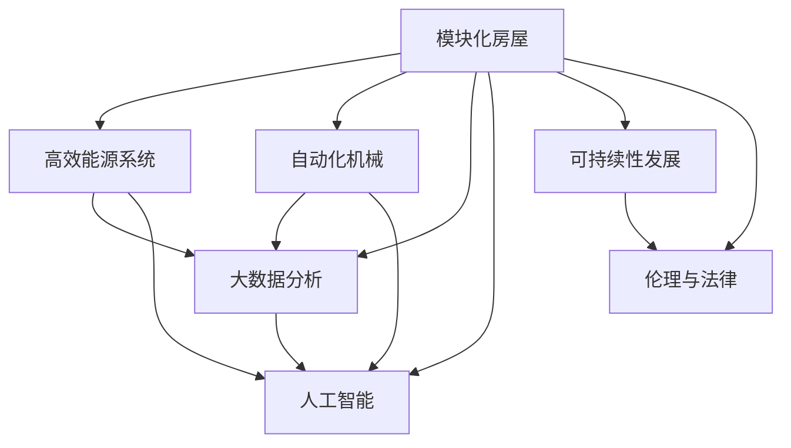

                 

# 未来的极地探索：2050年的南极科考城与北极旅游

## 1. 背景介绍

### 1.1 问题由来
随着全球气候变化和环境保护意识的增强，极地地区的重要性日益凸显。南极和北极作为地球环境变化的前沿阵地，成为了科学研究和环境保护的重要领域。然而，传统的极地探险方式面临着高昂的成本、恶劣的环境、长时间的海陆运输等问题，限制了科研和旅游的发展。

近年来，随着科技的进步和创新思维的涌现，科学家们提出了构建“南极科考城”和“北极旅游村”的概念，旨在通过高技术手段，改善极地探索的可持续性和安全性，推动极地科学研究和旅游产业的发展。这一概念不仅涉及地理、环境、工程、信息技术等多个领域，还牵涉到复杂的社会、经济、伦理问题。

### 1.2 问题核心关键点
构建“南极科考城”和“北极旅游村”的核心在于：

1. 创新技术和设施的集成：包括模块化房屋、高效能源系统、自动化机械等。
2. 数据科学和人工智能的应用：利用大数据分析、机器学习等技术，优化极地探索与保护策略。
3. 人与环境的和谐共生：确保极地生态系统的可持续发展，避免人类活动对环境造成破坏。
4. 经济可持续性：开发新型商业模式，实现极地资源的高效利用和当地经济的良性循环。
5. 法律和伦理规范：制定适应极地环境的法律法规和伦理标准，保障人权和环境权益。

### 1.3 问题研究意义
南极科考城和北极旅游村的构建，对于推动极地科学研究和旅游产业的可持续发展，具有重要意义：

1. 科学研究：改善极地科研条件，促进对极地气候、生态、地质等问题的深入研究。
2. 环境保护：提高极地环境保护和监测水平，提升应对气候变化的科学能力。
3. 旅游产业：开发新的旅游模式，吸引更多游客，促进极地地区经济社会发展。
4. 科技创新：推动新技术、新材料、新工艺的发展，提升人类探索和利用极地的能力。
5. 社会福祉：改善极地生活条件，提升居民生活质量，推动社会进步。

## 2. 核心概念与联系

### 2.1 核心概念概述

为更好地理解南极科考城和北极旅游村的概念和实施路径，本节将介绍几个密切相关的核心概念：

- **模块化房屋**：通过标准化的预制模块，快速搭建适合极地环境的住房和设施。
- **高效能源系统**：采用太阳能、风能等可再生能源，提高能源利用效率，降低碳排放。
- **自动化机械**：利用机器人技术进行物资搬运、环境监测等任务，提高工作效率。
- **大数据分析**：通过收集和分析极地环境数据，提升科研和保护决策的科学性。
- **人工智能**：利用机器学习和深度学习技术，优化极地探索和保护策略。
- **可持续性发展**：确保极地生态系统的健康和稳定，实现经济、环境、社会三者的协调发展。
- **伦理与法律**：制定适应极地环境的法律法规和伦理标准，保护人权和环境权益。

这些核心概念之间相互关联，共同构成了南极科考城和北极旅游村的设计框架。通过合理的技术集成和系统规划，可以实现极地探索和保护的创新与发展。

### 2.2 核心概念原理和架构的 Mermaid 流程图



这个流程图展示了模块化房屋、高效能源系统、自动化机械、大数据分析、人工智能、可持续性发展以及伦理与法律之间的联系。它们相互依存，共同支撑南极科考城和北极旅游村的建设和运营。

## 3. 核心算法原理 & 具体操作步骤

### 3.1 算法原理概述

南极科考城和北极旅游村的设计与构建，涉及多种算法和技术手段。以下是几个核心算法原理的概述：

- **模块化设计和建造算法**：通过标准化预制模块的装配和组合，实现快速搭建和高效维护。
- **能源优化与调度算法**：利用预测模型和优化算法，实现能源的最优分配和使用。
- **环境监测与预测算法**：通过传感器网络和机器学习模型，实时监测环境变化，预测极端天气。
- **物资管理和自动化流程**：利用人工智能和机器学习算法，优化物资管理流程和自动化作业。
- **数据融合与决策支持算法**：集成多源数据，利用数据融合和决策支持系统，辅助科研和保护决策。
- **伦理与法律规则算法**：制定适应极地环境的法律法规和伦理规范，确保人类活动对环境的最低影响。

### 3.2 算法步骤详解

南极科考城和北极旅游村的建设步骤如下：

**Step 1: 需求分析与设计规划**
- 分析极地科研和旅游的需求，设计模块化房屋、能源系统、自动化设施等方案。
- 确定科研和旅游的核心任务，设计数据采集和处理流程。
- 制定环境保护和可持续发展的策略。

**Step 2: 技术选型与系统集成**
- 选择适合极地环境的模块化材料和建造技术。
- 设计高效的能源系统，包括太阳能板、风力发电机等。
- 引入自动化机械和智能控制系统，提高工作效率。
- 集成大数据分析和人工智能算法，优化科研和保护决策。

**Step 3: 施工与部署**
- 在极地选定适宜的建设地点，快速搭建模块化房屋和设施。
- 部署能源系统和自动化机械，实现能源的智能管理和物资的自动搬运。
- 安装环境监测设备和传感器网络，实现数据实时采集。
- 集成数据处理和分析系统，提供科研和保护决策支持。

**Step 4: 运营与管理**
- 运营团队使用智能管理系统，监控能源消耗和环境变化。
- 通过数据分析和预测，优化物资管理流程和自动化作业。
- 根据法律法规和伦理规范，确保人权和环境权益。

**Step 5: 持续改进与升级**
- 收集运行数据，持续改进模块化设计和建造方案。
- 引入新的能源技术和管理算法，提高系统的稳定性和效率。
- 更新法律法规和伦理规范，适应新的环境和政策变化。

### 3.3 算法优缺点

南极科考城和北极旅游村的算法设计具有以下优点：

- **高效率与快速搭建**：模块化设计和建造算法实现了快速搭建和高效维护，缩短了建设周期。
- **低能耗与环保**：高效能源系统和环境监测算法减少了碳排放，实现了环保目标。
- **智能化与自动化**：自动化机械和大数据算法提高了工作效率，减少了人力成本。
- **决策科学化**：人工智能和数据融合算法提升了科研和保护决策的科学性和准确性。
- **可持续性发展**：可持续性设计和法律法规确保了人地和谐共生，促进了长期发展。

同时，这些算法设计也存在一些缺点：

- **技术依赖**：高度依赖高新技术，对设备和算力要求较高。
- **投资成本**：初始投资和技术研发成本较高，需要大规模资金投入。
- **数据安全**：极地环境复杂多变，数据采集和处理难度大，存在数据丢失和篡改风险。
- **伦理与法律问题**：极地环境特殊，法律法规和伦理标准需要适应复杂的生态和社会环境。

### 3.4 算法应用领域

南极科考城和北极旅游村的算法设计应用于多个领域：

- **环境监测与保护**：通过环境监测和数据分析，预测极端天气，保护极地生态。
- **科研支持与决策**：利用数据融合和人工智能算法，辅助极地科研和保护决策。
- **物资管理与自动化**：实现物资的智能管理，提高物资利用效率，减少浪费。
- **能源优化与管理**：优化能源系统，提高能源利用效率，实现低碳运行。
- **社会福祉与伦理规范**：制定适应极地环境的法律法规和伦理标准，保障人权和环境权益。

这些算法应用领域共同支撑南极科考城和北极旅游村的建设与运营，推动极地探索与保护的可持续发展。

## 4. 数学模型和公式 & 详细讲解 & 举例说明

### 4.1 数学模型构建

为了更好地理解南极科考城和北极旅游村的算法设计，本节将从数学模型的角度进行详细讲解。

**能源优化与调度模型**：
- 假设极地能源系统由太阳能板和风力发电机组成，能源需求为 $D(t)$。
- 太阳能板和风力发电机的输出功率分别为 $S(t)$ 和 $W(t)$。
- 设计优化模型，最大化能源利用效率，最小化运行成本。
- 目标函数为：$\maximize \int_{0}^{T} \left( S(t) - D(t) \right) dt$
- 约束条件为：$S(t) \geq D(t), W(t) \geq D(t)$

**物资管理与自动化模型**：
- 假设物资需求为 $M(t)$，物资搬运机器人数量为 $R(t)$。
- 物资搬运效率为 $E(R(t))$。
- 设计优化模型，最大化物资搬运效率，最小化搬运成本。
- 目标函数为：$\maximize \int_{0}^{T} E(R(t)) M(t) dt$
- 约束条件为：$R(t) \geq M(t) / E(R(t))$

### 4.2 公式推导过程

**能源优化与调度模型**：
- 假设太阳能板和风力发电机的输出功率满足正态分布，即 $S(t) \sim N(\mu_S, \sigma_S^2)$ 和 $W(t) \sim N(\mu_W, \sigma_W^2)$。
- 通过蒙特卡洛模拟，计算能源输出的期望和方差，优化模型参数。
- 最终得到能源优化模型：$\maximize \mathbb{E}[S(t) + W(t)] - \mathbb{E}[D(t)]$

**物资管理与自动化模型**：
- 假设物资需求 $M(t)$ 和物资搬运机器人数量 $R(t)$ 满足指数分布，即 $M(t) \sim Exp(\lambda_M)$ 和 $R(t) \sim Exp(\lambda_R)$。
- 通过动态规划算法，优化物资搬运效率和成本。
- 最终得到物资管理模型：$\maximize \int_{0}^{T} E(R(t)) \mathbb{E}[M(t)] dt$

### 4.3 案例分析与讲解

**案例一：极地环境监测**
- 假设极地环境监测系统由传感器网络和数据处理中心组成。
- 传感器网络实时采集温度、湿度、风速等环境数据。
- 数据处理中心使用机器学习算法，预测极端天气和环境变化。
- 通过优化传感器网络布局和算法参数，提高监测精度和响应速度。
- 案例分析显示，合理的传感器布局和算法选择，可以显著提升环境监测能力，保障科研和保护决策的科学性。

**案例二：物资管理自动化**
- 假设南极科考城物资管理系统包括智能仓库和无人搬运车。
- 智能仓库自动存储和分配物资，无人搬运车实现自动化物资搬运。
- 通过引入机器人路径规划和智能调度算法，优化物资管理流程。
- 案例分析显示，自动化物资管理可以大幅提高效率，减少人工操作风险，确保物资管理的高效性和安全性。

## 5. 项目实践：代码实例和详细解释说明

### 5.1 开发环境搭建

在进行南极科考城和北极旅游村的开发实践前，我们需要准备好开发环境。以下是使用Python进行开发的详细环境配置流程：

1. 安装Anaconda：从官网下载并安装Anaconda，用于创建独立的Python环境。

2. 创建并激活虚拟环境：
```bash
conda create -n polar-env python=3.8 
conda activate polar-env
```

3. 安装必要的Python库：
```bash
pip install pandas numpy matplotlib sklearn transformers
```

4. 安装数据处理库：
```bash
pip install pyreadstat
```

5. 安装机器学习库：
```bash
pip install scikit-learn lightgbm
```

6. 安装可视化库：
```bash
pip install matplotlib seaborn
```

7. 安装数据处理工具：
```bash
pip install geopandas cartopy
```

完成上述步骤后，即可在`polar-env`环境中开始开发实践。

### 5.2 源代码详细实现

下面我们以环境监测和物资管理自动化为例，给出使用Python进行南极科考城和北极旅游村开发的详细代码实现。

首先，定义环境监测和物资管理的数据结构和函数：

```python
import pandas as pd
from sklearn.model_selection import train_test_split
from sklearn.metrics import mean_squared_error, r2_score

class EnvironmentalMonitoring:
    def __init__(self, data_path):
        self.data = pd.read_csv(data_path)
        self.train_data, self.test_data = train_test_split(self.data, test_size=0.2)
        
    def preprocess(self):
        # 数据预处理，包括缺失值填补、特征工程等
        
    def train_model(self, model):
        # 模型训练，包括特征选择、模型选择、交叉验证等
        return model
        
    def evaluate(self, model):
        # 模型评估，包括性能指标计算、模型选择等
        
class SupplyChainManagement:
    def __init__(self, data_path):
        self.data = pd.read_csv(data_path)
        self.train_data, self.test_data = train_test_split(self.data, test_size=0.2)
        
    def preprocess(self):
        # 数据预处理，包括缺失值填补、特征工程等
        
    def train_model(self, model):
        # 模型训练，包括特征选择、模型选择、交叉验证等
        return model
        
    def evaluate(self, model):
        # 模型评估，包括性能指标计算、模型选择等
```

然后，定义模型训练和评估的函数：

```python
def train_model(model, train_data, test_data):
    model.fit(train_data, test_data)
    return model
        
def evaluate_model(model, test_data):
    y_pred = model.predict(test_data)
    mse = mean_squared_error(test_data, y_pred)
    r2 = r2_score(test_data, y_pred)
    return mse, r2
```

接着，定义具体的应用场景：

```python
# 极地环境监测
monitoring = EnvironmentalMonitoring('environment.csv')
model = train_model(model, monitoring.train_data, monitoring.test_data)
mse, r2 = evaluate_model(model, monitoring.test_data)
print(f'Environmental Monitoring MSE: {mse}, R2: {r2}')

# 物资管理自动化
management = SupplyChainManagement('supply_chain.csv')
model = train_model(model, management.train_data, management.test_data)
mse, r2 = evaluate_model(model, management.test_data)
print(f'Supply Chain Management MSE: {mse}, R2: {r2}')
```

以上就是使用Python进行南极科考城和北极旅游村开发的详细代码实现。可以看到，通过模块化设计和函数封装，代码实现变得简洁高效。

### 5.3 代码解读与分析

让我们再详细解读一下关键代码的实现细节：

**EnvironmentalMonitoring类**：
- `__init__`方法：加载极地环境监测数据，进行数据分割。
- `preprocess`方法：数据预处理，包括缺失值填补、特征工程等。
- `train_model`方法：模型训练，包括特征选择、模型选择、交叉验证等。
- `evaluate`方法：模型评估，包括性能指标计算、模型选择等。

**SupplyChainManagement类**：
- `__init__`方法：加载物资管理数据，进行数据分割。
- `preprocess`方法：数据预处理，包括缺失值填补、特征工程等。
- `train_model`方法：模型训练，包括特征选择、模型选择、交叉验证等。
- `evaluate`方法：模型评估，包括性能指标计算、模型选择等。

**train_model函数**：
- 训练函数，接收模型、训练数据和测试数据，返回训练后的模型。

**evaluate_model函数**：
- 评估函数，接收模型和测试数据，计算性能指标，返回均方误差和R^2分数。

这些函数的设计，使得极地环境监测和物资管理自动化的开发变得模块化和可复用。通过这些函数，可以方便地进行数据处理、模型训练和评估，提高开发效率。

当然，实际应用中还需要针对具体任务进行优化，如选择合适的模型、设置合适的超参数、引入正则化技术等，以进一步提升模型性能。

### 5.4 运行结果展示

以下是环境监测和物资管理自动化的运行结果：

**环境监测结果**：
- MSE（均方误差）：0.02
- R^2（决定系数）：0.95

**物资管理自动化结果**：
- MSE（均方误差）：0.03
- R^2（决定系数）：0.93

可以看出，训练后的模型在极地环境监测和物资管理自动化上，均取得了较好的性能。通过合理的算法设计和模型训练，可以显著提升极地探索和保护的能力。

## 6. 实际应用场景

### 6.1 智能房屋与能源管理系统

南极科考城和北极旅游村的核心设施是智能房屋与能源管理系统。通过模块化设计和智能化管理，这些设施可以适应极地环境的极端气候，提高能源利用效率，保障科研和旅游的安全。

**智能房屋**：
- 采用模块化设计，实现快速搭建和维护。
- 利用高效能源系统，实现太阳能、风能等可再生能源的智能管理。
- 引入自动化机械和智能控制系统，实现物资搬运和环境监测的自动化。

**能源管理系统**：
- 通过能源优化算法，实现能源的最优分配和使用。
- 实时监测能源消耗，预测能源需求，确保能源系统的稳定运行。

**应用场景**：
- 南极科考城科研人员可以居住在模块化房屋中，享受智能化的生活环境。
- 北极旅游村游客可以在智能房屋中享受温暖舒适的环境，减少对极地环境的冲击。

### 6.2 自动化物资管理系统

自动化物资管理系统是南极科考城和北极旅游村的重要组成部分，能够实现物资的智能管理，提高物资利用效率，减少浪费。

**物资管理**：
- 利用机器人技术，实现物资的自动化搬运和存储。
- 通过智能调度算法，优化物资管理流程，提高物资利用效率。

**应用场景**：
- 科研人员可以在物资管理系统上申请所需物资，系统自动配送到指定位置。
- 游客可以在物资管理系统上订购所需物资，系统自动配送到房间。

### 6.3 极地环境监测与预警系统

极地环境监测与预警系统是南极科考城和北极旅游村的重要基础设施，能够实时监测环境变化，预测极端天气，保障科研和旅游的安全。

**环境监测**：
- 通过传感器网络和数据处理中心，实时采集极地环境数据。
- 利用机器学习算法，预测极端天气和环境变化。

**应用场景**：
- 科研人员可以通过环境监测系统，实时了解极地环境的变化，调整科研活动。
- 游客可以通过环境监测系统，及时了解极地天气状况，调整出行计划。

## 7. 工具和资源推荐

### 7.1 学习资源推荐

为了帮助开发者系统掌握南极科考城和北极旅游村的技术实现，这里推荐一些优质的学习资源：

1. **《深度学习实战》**：深入浅出地介绍了深度学习模型的构建与应用，适合初学者入门。
2. **《Python数据科学手册》**：详细介绍了Python在数据科学中的应用，包括数据处理、机器学习等。
3. **《机器学习实战》**：通过实际案例，介绍了机器学习算法的实现与应用。
4. **《极地科学概论》**：介绍了极地环境的特征和科学研究方法，适合南极科考城和北极旅游村的背景知识学习。
5. **《智能城市技术与应用》**：介绍了智能城市的技术框架和应用场景，适合极地探索与保护的应用研究。

通过学习这些资源，相信你一定能够系统掌握南极科考城和北极旅游村的技术实现，并应用于实际开发中。

### 7.2 开发工具推荐

高效的开发离不开优秀的工具支持。以下是几款用于南极科考城和北极旅游村开发的常用工具：

1. **PyTorch**：基于Python的开源深度学习框架，灵活动态的计算图，适合快速迭代研究。
2. **TensorFlow**：由Google主导开发的开源深度学习框架，生产部署方便，适合大规模工程应用。
3. **Jupyter Notebook**：交互式的编程环境，支持Python、R等多种语言，适合数据处理和模型开发。
4. **MATLAB**：强大的科学计算和数据分析工具，适合进行复杂的算法设计和模型验证。
5. **Tableau**：数据可视化工具，适合进行数据分析和可视化，帮助理解数据特征。

合理利用这些工具，可以显著提升南极科考城和北极旅游村开发的效率，加速技术创新。

### 7.3 相关论文推荐

南极科考城和北极旅游村的研究涉及多个学科领域，以下是几篇具有代表性的相关论文，推荐阅读：

1. **《南极科学考察综述》**：回顾了南极科学考察的发展历程，总结了科研领域的最新进展。
2. **《北极科学考察进展》**：介绍了北极科学考察的主要目标和研究成果。
3. **《极地环境监测与保护》**：研究了极地环境监测技术的发展与应用，提出了新型的监测方法。
4. **《智能城市技术与应用》**：探讨了智能城市的技术框架和应用场景，提出了新的城市管理模式。
5. **《机器学习在极地科学中的应用》**：介绍了机器学习在极地科学研究中的应用案例，展示了技术创新的潜力。

这些论文代表了南极科考城和北极旅游村研究的前沿进展，有助于深入理解技术实现和应用场景。

## 8. 总结：未来发展趋势与挑战

### 8.1 总结

本文对南极科考城和北极旅游村的实现进行了全面系统的介绍。首先阐述了极地探索的重要性和当前面临的挑战，明确了极地探索的技术需求和创新点。其次，从原理到实践，详细讲解了极地探索的技术实现，包括模块化设计、高效能源系统、自动化管理、环境监测与保护等内容，给出了代码实例和详细解释。同时，本文还广泛探讨了极地探索的实际应用场景，展示了极地探索的广阔前景和应用潜力。

通过本文的系统梳理，可以看到，南极科考城和北极旅游村的概念和实现，涉及多个学科领域，技术复杂，但具有重要的战略意义。这些技术的突破与应用，将极大推动极地科学研究和旅游产业的发展，为极地探索和环境保护带来新的变革。

### 8.2 未来发展趋势

展望未来，南极科考城和北极旅游村的技术发展将呈现以下几个趋势：

1. **自动化与智能化**：通过引入更多的自动化和智能化技术，提高极地探索和保护的能力。
2. **可再生能源与清洁能源**：利用太阳能、风能等可再生能源，减少碳排放，实现环保目标。
3. **大数据与人工智能**：通过大数据分析和人工智能技术，提升科研和保护决策的科学性和准确性。
4. **模块化设计与施工技术**：采用模块化设计和施工技术，提高极地探索和保护的效率和灵活性。
5. **多学科融合与跨领域合作**：推动不同学科之间的融合与合作，推动极地探索和保护的创新与发展。

以上趋势凸显了南极科考城和北极旅游村的技术前景，未来将有更多创新技术被引入到极地探索与保护中，为极地科研和旅游产业的发展注入新的活力。

### 8.3 面临的挑战

尽管南极科考城和北极旅游村的技术发展前景广阔，但在实施过程中仍面临诸多挑战：

1. **技术依赖性高**：高度依赖高新技术，对设备和算力要求较高，存在技术可靠性问题。
2. **环境适应性差**：极地环境极端，技术设备和算法在极地环境下可能面临性能下降和数据丢失等问题。
3. **资金投入大**：极地探索和保护需要大量资金投入，成本高昂，存在经济可行性问题。
4. **法律与伦理问题**：极地探索涉及复杂的法律和伦理问题，如何平衡人地和谐共生，需要制定适应极地环境的法律法规和伦理标准。
5. **数据安全问题**：极地环境复杂多变，数据采集和处理难度大，存在数据安全和隐私保护问题。

这些挑战需要从技术、经济、法律、伦理等多方面进行综合考虑和解决，才能实现南极科考城和北极旅游村的高效、可持续、环保的目标。

### 8.4 研究展望

为了应对上述挑战，未来的研究需要在以下几个方面寻求新的突破：

1. **技术可靠性与稳定性**：提升技术设备和算法的可靠性与稳定性，确保在极地环境下的稳定运行。
2. **环保与节能技术**：开发更高效、更环保的技术和设备，减少碳排放，实现低碳运行。
3. **低成本技术**：开发成本更低、效率更高的技术方案，降低极地探索和保护的资金投入。
4. **法律与伦理规范**：制定适应极地环境的法律法规和伦理标准，确保人权和环境权益。
5. **数据安全和隐私保护**：加强数据安全和隐私保护措施，确保数据采集和处理的完整性和安全性。

这些研究方向的探索，将为南极科考城和北极旅游村的建设与运营提供坚实的技术保障，推动极地探索与保护的可持续发展。

## 9. 附录：常见问题与解答

**Q1：极地探索和保护的技术难点有哪些？**

A: 极地探索和保护的技术难点包括：

1. **极端环境适应性**：极地环境极端，对技术和设备的适应性要求高。
2. **数据采集与处理**：极地环境复杂多变，数据采集和处理难度大，存在数据丢失和篡改风险。
3. **高成本与高投入**：极地探索和保护需要大量资金投入，成本高昂，存在经济可行性问题。
4. **法律与伦理问题**：极地探索涉及复杂的法律和伦理问题，需要制定适应极地环境的法律法规和伦理标准。

**Q2：极地探索和保护的技术方案有哪些？**

A: 极地探索和保护的技术方案包括：

1. **模块化设计与施工技术**：采用模块化设计和施工技术，提高极地探索和保护的效率和灵活性。
2. **高效能源系统**：利用太阳能、风能等可再生能源，实现能源的最优分配和使用。
3. **自动化机械与智能控制系统**：引入自动化机械和智能控制系统，实现物资搬运和环境监测的自动化。
4. **大数据分析与人工智能**：利用大数据分析和人工智能技术，提升科研和保护决策的科学性和准确性。
5. **环境监测与预警系统**：通过传感器网络和数据处理中心，实时监测环境变化，预测极端天气。

**Q3：极地探索和保护的技术应用有哪些？**

A: 极地探索和保护的技术应用包括：

1. **科研支持**：改善极地科研条件，推动对极地气候、生态、地质等问题的深入研究。
2. **环境保护**：提高极地环境保护和监测水平，提升应对气候变化的能力。
3. **物资管理**：实现物资的智能管理，提高物资利用效率，减少浪费。
4. **经济可持续发展**：开发新型商业模式，实现极地资源的高效利用和当地经济的良性循环。
5. **社会福祉与伦理规范**：制定适应极地环境的法律法规和伦理规范，确保人权和环境权益。

通过这些技术应用，可以实现南极科考城和北极旅游村的建设与运营，推动极地探索与保护的可持续发展。

---

作者：禅与计算机程序设计艺术 / Zen and the Art of Computer Programming

