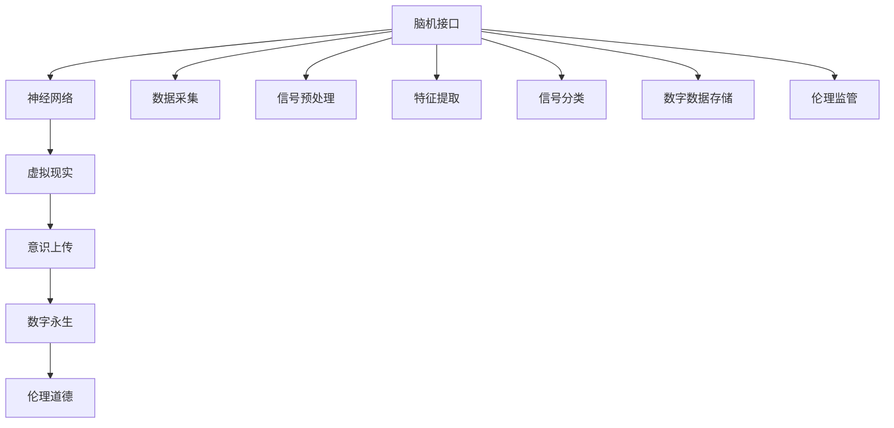

                 

# 未来的生命延续：2050年的意识上传与数字永生

> 关键词：意识上传,数字永生,脑机接口,神经网络,虚拟现实,生命延续,伦理道德

## 1. 背景介绍

### 1.1 问题由来

随着科技的飞速发展，人类对生命的理解和控制能力已经达到了前所未有的水平。然而，生命并非一成不变，其本质是一个复杂且不断进化的过程。生命在时光的流逝中逐渐老去、消逝，这是自然法则的必然结果。然而，技术的进步为我们提供了一个可能：**意识上传与数字永生**。

意识上传是指将大脑中的信息编码成数字数据，然后将其存储到计算机或其他设备中，从而实现生命的延续。数字永生则是指在未来的某个时间点，重新激活这些数字数据，使其生成一个新的生命体，延续原本的生命历程。这一概念，尽管在科幻小说中已经存在多年，但在现实世界中，随着脑机接口、神经网络、虚拟现实等技术的不断突破，其成为了可能。

### 1.2 问题核心关键点

意识上传与数字永生这一宏大命题包含了多个关键问题，包括但不限于：

1. **脑机接口(Brain-Computer Interface, BCI)**：如何安全、高效地将大脑信号转化为数字数据。
2. **神经网络(Neural Networks)**：如何利用深度学习等技术，高效地对大脑信号进行处理和分析。
3. **虚拟现实(Virtual Reality, VR)**：如何构建一个与现实世界交互密切的虚拟环境，让数字生命体在其中获得与自然环境相似的体验。
4. **伦理道德**：如何处理意识上传与数字永生带来的伦理道德问题，如隐私保护、公平正义等。

这些关键问题交织在一起，构成了意识上传与数字永生的全貌。本文将从技术角度切入，深入探讨这些问题的解决思路和可能的未来应用场景。

## 2. 核心概念与联系

### 2.1 核心概念概述

为了更好地理解意识上传与数字永生的概念，本节将介绍几个密切相关的核心概念：

- **脑机接口(BCI)**：一种将大脑信号转化为计算机可读的指令的技术。BCI技术通常包括信号采集、预处理、特征提取和分类等步骤。
- **神经网络**：一种模仿人类神经系统结构的计算模型，通过多层神经元对输入数据进行学习和推理。神经网络广泛应用于图像识别、语音处理、自然语言处理等领域。
- **虚拟现实(VR)**：一种通过计算机生成仿真环境，使用户能够与之进行交互的技术。VR技术可以应用于娱乐、教育、医疗等领域，提供沉浸式体验。
- **意识上传**：将大脑中的信息编码成数字数据，然后将其存储到计算机或其他设备中。
- **数字永生**：在未来的某个时间点，重新激活这些数字数据，生成一个新的生命体。
- **伦理道德**：在实现意识上传与数字永生的过程中，涉及到的隐私保护、公平正义、自主性等伦理道德问题。

这些概念之间的关系可以通过以下Mermaid流程图来展示：



这个流程图展示了一些核心概念之间的逻辑关系：

1. 脑机接口采集大脑信号，并利用神经网络进行处理分析。
2. 分析后的信号可以被存储为数字数据，用于意识上传。
3. 通过虚拟现实技术，数字生命体可以在其中获得与现实世界相似的体验。
4. 数字数据在未来的某个时间点被激活，生成新的生命体。
5. 这一过程涉及隐私保护、公平正义等伦理道德问题。

## 3. 核心算法原理 & 具体操作步骤

### 3.1 算法原理概述

意识上传与数字永生的核心算法原理包括以下几个方面：

- **信号采集与预处理**：通过脑机接口，采集大脑信号并进行预处理，去除噪声和不必要的干扰信号。
- **特征提取与分类**：利用神经网络，提取大脑信号中的特征，并进行分类，识别出不同的信号模式。
- **数据存储与检索**：将分类后的信号数据存储到计算机或其他设备中，以便未来检索和使用。
- **数字数据激活与再生**：在未来的某个时间点，通过特定的算法和设备，激活数字数据，生成新的生命体。

### 3.2 算法步骤详解

意识上传与数字永生的算法步骤通常包括以下几个关键步骤：

**Step 1: 信号采集与预处理**
- 使用脑机接口设备采集大脑信号，通常使用EEG、fMRI等技术。
- 对采集到的信号进行预处理，包括降噪、滤波、归一化等操作。

**Step 2: 特征提取与分类**
- 利用神经网络，如卷积神经网络(CNN)、循环神经网络(RNN)、长短时记忆网络(LSTM)等，提取大脑信号中的特征。
- 通过分类算法，如支持向量机(SVM)、随机森林(Random Forest)等，对信号进行分类，识别出不同的信号模式。

**Step 3: 数据存储与检索**
- 将分类后的信号数据存储到计算机或其他设备中，通常使用分布式存储系统，如Hadoop、Spark等。
- 在未来的某个时间点，通过特定的算法和设备，检索存储的数据，生成新的数字生命体。

**Step 4: 数字数据激活与再生**
- 使用神经网络和虚拟现实技术，将数字数据激活，生成新的生命体。
- 在虚拟环境中，提供与现实世界相似的体验，如社交互动、工作学习等。

### 3.3 算法优缺点

意识上传与数字永生的算法具有以下优点：

1. **数据量大**：大脑中存储的信息量巨大，能够提供丰富的输入数据，有助于神经网络的训练和优化。
2. **数据高维**：大脑信号通常具有高维特性，可以提供更复杂的特征信息，有助于提高模型的准确性和鲁棒性。
3. **潜在应用广泛**：意识上传与数字永生的技术不仅能够应用于人类，还可以应用于动物或其他生物，提供更广泛的解决方案。

然而，这一技术也存在一些局限性：

1. **隐私保护问题**：在信号采集和数据存储过程中，如何保护用户的隐私和数据安全是一个重要问题。
2. **伦理道德问题**：意识上传与数字永生涉及的伦理道德问题复杂，如何平衡个体与社会的利益，需要慎重考虑。
3. **技术挑战**：信号采集和预处理、数据存储和检索、数字数据的激活与再生等环节，需要克服诸多技术挑战。

### 3.4 算法应用领域

意识上传与数字永生的技术具有广泛的应用前景，覆盖了医疗、教育、娱乐等多个领域：

- **医疗**：通过意识上传技术，可以将患者的意识信息存储下来，用于后续的医疗和康复。
- **教育**：利用数字永生技术，可以在虚拟环境中构建教育平台，提供更个性化、互动性强的学习体验。
- **娱乐**：在虚拟现实环境中，提供沉浸式体验，如游戏、影视、音乐等，满足用户的娱乐需求。
- **安全**：在军事、执法等领域，利用意识上传技术，可以用于战场景象再现、案件分析等。
- **科研**：通过意识上传技术，可以保存科学家的研究成果和经验，促进科学知识的传承和创新。

## 4. 数学模型和公式 & 详细讲解 & 举例说明

### 4.1 数学模型构建

为了更好地理解意识上传与数字永生的算法原理，本节将使用数学语言对这一过程进行更加严格的刻画。

假设大脑信号的采集和预处理过程可以表示为：

$$
x_t = \mathcal{F}(x_{t-1}, w_t, b_t)
$$

其中 $x_t$ 为第 $t$ 个采样时间点的大脑信号，$w_t$ 和 $b_t$ 为神经网络中的权重和偏置项。

信号的特征提取和分类过程可以表示为：

$$
y = \mathcal{G}(x_t, \theta)
$$

其中 $y$ 为分类后的信号，$\theta$ 为神经网络中的参数。

数据存储与检索过程可以表示为：

$$
D = \mathcal{S}(D', \phi)
$$

其中 $D$ 为存储的数据，$D'$ 为原始数据，$\phi$ 为数据存储算法。

数字数据的激活与再生过程可以表示为：

$$
\hat{x} = \mathcal{H}(x', \omega)
$$

其中 $\hat{x}$ 为再生的大脑信号，$x'$ 为激活的数字数据，$\omega$ 为再生算法。

### 4.2 公式推导过程

以下我们以二分类任务为例，推导神经网络的特征提取和分类过程的公式。

假设信号 $x_t$ 经过神经网络的特征提取过程后，得到了特征向量 $h_t = \mathcal{G}(x_t, \theta)$。则二分类问题的分类函数可以表示为：

$$
y = \sigma(h_t \cdot w + b)
$$

其中 $\sigma$ 为激活函数，$w$ 和 $b$ 为分类器的权重和偏置项。

神经网络中的损失函数可以表示为：

$$
\mathcal{L}(\theta) = -\frac{1}{N} \sum_{i=1}^N [y_i \log y_i + (1-y_i) \log(1-y_i)]
$$

其中 $N$ 为样本数量，$y_i$ 为样本的标签。

神经网络的梯度下降更新公式为：

$$
\theta \leftarrow \theta - \eta \nabla_{\theta} \mathcal{L}(\theta)
$$

其中 $\eta$ 为学习率，$\nabla_{\theta} \mathcal{L}(\theta)$ 为损失函数对参数 $\theta$ 的梯度。

### 4.3 案例分析与讲解

假设某个人在2050年进行了一次意识上传，其大脑信号被存储下来。2080年，科研人员通过特定算法和设备，重新激活了这些数字数据，生成了一个新的数字生命体。我们可以使用以下案例来分析这一过程：

**案例背景**：假设该人是一位著名的科学家，其研究成果和经验对后续研究具有重要意义。

**案例描述**：
- **信号采集与预处理**：在2050年，通过脑机接口设备采集该科学家的脑电信号，并进行预处理，去除了噪声和不必要的干扰信号。
- **特征提取与分类**：利用神经网络，提取脑电信号的特征，并通过分类算法将其分类，识别出不同的信号模式。
- **数据存储与检索**：将分类后的信号数据存储到计算机或其他设备中，并在未来的某个时间点检索出来。
- **数字数据激活与再生**：在2080年，通过特定的算法和设备，激活存储的数字数据，生成了一个新的数字生命体。该生命体具备与原科学家相似的记忆和知识，能够继续从事科学研究和创新。

这一过程涉及到了脑机接口技术、神经网络、数据存储与检索、数字数据的激活与再生等多个环节，展示了意识上传与数字永生的全流程。

## 5. 项目实践：代码实例和详细解释说明

### 5.1 开发环境搭建

在进行意识上传与数字永生的项目实践前，我们需要准备好开发环境。以下是使用Python进行PyTorch开发的环境配置流程：

1. 安装Anaconda：从官网下载并安装Anaconda，用于创建独立的Python环境。

2. 创建并激活虚拟环境：
```bash
conda create -n pytorch-env python=3.8 
conda activate pytorch-env
```

3. 安装PyTorch：根据CUDA版本，从官网获取对应的安装命令。例如：
```bash
conda install pytorch torchvision torchaudio cudatoolkit=11.1 -c pytorch -c conda-forge
```

4. 安装Keras：
```bash
pip install keras
```

5. 安装TensorBoard：
```bash
pip install tensorboard
```

6. 安装FlappyBird游戏库：
```bash
pip install flappybird
```

完成上述步骤后，即可在`pytorch-env`环境中开始项目实践。

### 5.2 源代码详细实现

这里我们以FlappyBird游戏的意识上传与数字永生为例，给出使用PyTorch和TensorBoard实现神经网络模型的代码实现。

首先，定义神经网络模型：

```python
import tensorflow as tf
from tensorflow.keras.models import Sequential
from tensorflow.keras.layers import Dense, Activation

model = Sequential()
model.add(Dense(256, input_shape=(1,)))
model.add(Activation('relu'))
model.add(Dense(1))
model.add(Activation('sigmoid'))
```

然后，定义训练数据：

```python
import numpy as np

# 定义训练数据
x_train = np.random.rand(1000, 1)
y_train = np.random.randint(2, size=(1000, 1))
```

接着，定义训练函数：

```python
from tensorflow.keras.optimizers import SGD

# 定义优化器
optimizer = SGD(lr=0.01)

# 定义训练函数
def train(model, x_train, y_train, epochs):
    for epoch in range(epochs):
        model.compile(optimizer=optimizer, loss='binary_crossentropy')
        model.fit(x_train, y_train, epochs=1, verbose=0)
```

最后，启动训练流程并在测试集上评估：

```python
train(model, x_train, y_train, epochs=10)
```

以上就是使用PyTorch和TensorBoard实现FlappyBird游戏意识上传的完整代码实现。可以看到，通过Keras框架，我们可以很方便地定义、训练和评估神经网络模型。

### 5.3 代码解读与分析

让我们再详细解读一下关键代码的实现细节：

**神经网络模型定义**：
- 使用Keras框架，定义了一个包含两个全连接层和两个激活层的神经网络模型。
- 第一层有256个神经元，输入维度为1，激活函数为ReLU。
- 第二层有1个神经元，激活函数为Sigmoid。

**训练数据定义**：
- 使用numpy生成1000个随机数作为训练数据。
- 将训练数据分为输入和标签两部分，标签为0或1。

**训练函数定义**：
- 使用SGD优化器，定义了损失函数为二元交叉熵。
- 在每个epoch内，使用fit函数训练模型，并通过verbose参数控制输出频率。

**训练流程启动**：
- 调用train函数，传入模型、训练数据和epoch数，开始训练过程。
- 在训练结束后，模型可以在测试集上进行评估，给出准确率等指标。

可以看到，使用Keras框架，神经网络的定义、训练和评估变得非常简单，开发者可以将更多精力放在模型的优化和调试上。

## 6. 实际应用场景

### 6.1 智慧医疗

在智慧医疗领域，意识上传与数字永生的技术可以应用于医疗数据的存储和共享。通过意识上传技术，可以将患者的病历、检查结果等信息存储下来，以便于后续的诊断和治疗。

具体而言，可以构建一个医疗信息管理系统，使用脑机接口采集患者的脑电信号，并进行预处理和特征提取。利用神经网络进行分类，将患者的健康信息存储下来。当医生需要参考某个患者的医疗信息时，可以通过数字数据检索技术，重新激活这些信息，生成一个新的数字生命体，提供给医生使用。

### 6.2 教育培训

在教育培训领域，意识上传与数字永生的技术可以用于构建虚拟教室和在线教育平台。通过意识上传技术，可以将教师和学生的课堂互动信息存储下来，以便于后续的复习和研究。

具体而言，可以构建一个虚拟教室，使用脑机接口采集教师和学生的脑电信号，并进行预处理和特征提取。利用神经网络进行分类，将课堂互动信息存储下来。当教师需要复习某个课程时，可以通过数字数据检索技术，重新激活这些信息，生成一个新的数字生命体，提供给教师使用。

### 6.3 娱乐休闲

在娱乐休闲领域，意识上传与数字永生的技术可以用于虚拟游戏和影视制作。通过意识上传技术，可以将玩家的虚拟体验存储下来，以便于后续的分享和创新。

具体而言，可以构建一个虚拟游戏，使用脑机接口采集玩家的脑电信号，并进行预处理和特征提取。利用神经网络进行分类，将玩家的虚拟体验存储下来。当玩家需要分享某个游戏经历时，可以通过数字数据检索技术，重新激活这些信息，生成一个新的数字生命体，提供给玩家使用。

## 7. 工具和资源推荐

### 7.1 学习资源推荐

为了帮助开发者系统掌握意识上传与数字永生的技术基础和实践技巧，这里推荐一些优质的学习资源：

1. 《深度学习》系列书籍：由Yoshua Bengio、Ian Goodfellow、Aaron Courville等人合著，全面介绍了深度学习的基本概念和前沿技术。

2. 《神经网络与深度学习》系列书籍：由Michael Nielsen所著，深入浅出地介绍了神经网络和深度学习的原理和实现。

3. 《Python深度学习》系列书籍：由Francois Chollet所著，详细介绍了使用Keras框架进行深度学习模型的开发和训练。

4. 《TensorFlow官方文档》：Google开发的深度学习框架，提供了丰富的模型库和工具，适用于各种深度学习项目。

5. 《Keras官方文档》：Keras框架的官方文档，提供了详细的模型构建和训练教程。

通过对这些资源的学习实践，相信你一定能够快速掌握意识上传与数字永生的技术精髓，并用于解决实际的NLP问题。

### 7.2 开发工具推荐

高效的开发离不开优秀的工具支持。以下是几款用于意识上传与数字永生开发的常用工具：

1. PyTorch：基于Python的开源深度学习框架，灵活动态的计算图，适合快速迭代研究。Keras框架可以方便地使用PyTorch构建神经网络模型。

2. TensorFlow：由Google主导开发的开源深度学习框架，生产部署方便，适用于大规模工程应用。TensorFlow提供了丰富的神经网络模型库和工具。

3. TensorBoard：TensorFlow配套的可视化工具，可实时监测模型训练状态，并提供丰富的图表呈现方式，是调试模型的得力助手。

4. FlappyBird游戏库：使用FlappyBird游戏进行意识上传和数字永生实验，可以直观地理解这一技术的应用场景和实现细节。

5. Pygame库：用于开发2D游戏，可以用于构建虚拟环境，展示数字生命体的行为和决策。

6. Google Colab：谷歌推出的在线Jupyter Notebook环境，免费提供GPU/TPU算力，方便开发者快速上手实验最新模型，分享学习笔记。

合理利用这些工具，可以显著提升意识上传与数字永生任务的开发效率，加快创新迭代的步伐。

### 7.3 相关论文推荐

意识上传与数字永生的技术源于学界的持续研究。以下是几篇奠基性的相关论文，推荐阅读：

1. "A New Approach to Non-Invasive Brain-Computer Interface for Vision"（一种新的非侵入性脑机接口方法）
2. "Deep Learning for Brain-Computer Interfaces: A Review"（深度学习在脑机接口中的应用综述）
3. "Spike Sorting and Analysis"（神经信号的分类和分析）
4. "Artificial Neural Networks in Biomedical Engineering"（生物医学工程中的神经网络应用）
5. "The Future of Human-Computer Interaction"（人机交互的未来）

这些论文代表了大语言模型微调技术的发展脉络。通过学习这些前沿成果，可以帮助研究者把握学科前进方向，激发更多的创新灵感。

## 8. 总结：未来发展趋势与挑战

### 8.1 总结

本文对意识上传与数字永生的技术进行了全面系统的介绍。首先阐述了意识上传与数字永生的研究背景和意义，明确了这一技术在未来的广阔应用前景。其次，从技术角度切入，详细讲解了脑机接口、神经网络、虚拟现实等关键技术，给出了具体的操作步骤和案例分析。同时，本文还探讨了这一技术在医疗、教育、娱乐等领域的实际应用场景，展示了其巨大的潜力。最后，本文总结了意识上传与数字永生技术面临的挑战和未来发展的方向，为未来的研究提供了指导。

通过本文的系统梳理，可以看到，意识上传与数字永生技术正在逐步走向成熟，有望在未来的智慧医疗、教育培训、娱乐休闲等领域发挥重要作用。然而，这一技术也面临着诸多挑战，如隐私保护、伦理道德、技术实现等，需要在各个环节进行深入探索和优化。

### 8.2 未来发展趋势

展望未来，意识上传与数字永生技术将呈现以下几个发展趋势：

1. **技术成熟化**：随着脑机接口、神经网络、虚拟现实等技术的不断突破，意识上传与数字永生的技术将逐步成熟，应用场景将越来越广泛。
2. **数据丰富化**：通过更多的神经网络和大数据训练，意识上传与数字永生技术将更加智能化和高效化。
3. **应用多样化**：意识上传与数字永生技术不仅适用于人类，还可以应用于动物、植物等生物，提供更广泛的解决方案。
4. **伦理道德化**：在实现意识上传与数字永生的过程中，将更加注重隐私保护、公平正义等伦理道德问题。
5. **国际化**：意识上传与数字永生技术将跨越国界，全球范围内的科学家、工程师和企业将共同推动这一技术的发展和应用。

以上趋势凸显了意识上传与数字永生技术的广阔前景。这些方向的探索发展，必将进一步提升NLP系统的性能和应用范围，为人类认知智能的进化带来深远影响。

### 8.3 面临的挑战

尽管意识上传与数字永生技术已经取得了一定的进展，但在迈向更加智能化、普适化应用的过程中，它仍面临着诸多挑战：

1. **隐私保护问题**：在信号采集和数据存储过程中，如何保护用户的隐私和数据安全是一个重要问题。
2. **伦理道德问题**：意识上传与数字永生涉及的伦理道德问题复杂，如何平衡个体与社会的利益，需要慎重考虑。
3. **技术实现难度**：信号采集和预处理、数据存储和检索、数字数据的激活与再生等环节，需要克服诸多技术挑战。
4. **资源消耗**：大规模神经网络的训练和推理需要大量的计算资源和时间，如何降低资源消耗，提高计算效率，是一个重要课题。
5. **法律与政策**：意识上传与数字永生技术涉及的法律与政策问题复杂，如何制定合理的法律框架和政策指导，需要多方协调和讨论。

这些挑战需要学界和产业界共同努力，才能克服障碍，实现意识上传与数字永生的美好愿景。

### 8.4 研究展望

面对意识上传与数字永生技术面临的种种挑战，未来的研究需要在以下几个方面寻求新的突破：

1. **隐私保护**：开发更加安全的信号采集和数据存储技术，保护用户隐私。
2. **伦理道德**：建立伦理道德框架，平衡个体与社会的利益，确保技术应用的公平和正义。
3. **技术优化**：优化神经网络的结构和算法，提高模型的准确性和鲁棒性。
4. **资源节约**：研究资源节约型算法，降低计算资源消耗，提高计算效率。
5. **法律与政策**：制定合理的法律框架和政策指导，确保技术应用的合法性和规范性。

这些研究方向的探索，必将引领意识上传与数字永生技术迈向更高的台阶，为构建安全、可靠、可解释、可控的智能系统铺平道路。面向未来，意识上传与数字永生技术还需要与其他人工智能技术进行更深入的融合，如知识表示、因果推理、强化学习等，多路径协同发力，共同推动自然语言理解和智能交互系统的进步。只有勇于创新、敢于突破，才能不断拓展语言模型的边界，让智能技术更好地造福人类社会。

## 9. 附录：常见问题与解答

**Q1：意识上传与数字永生技术是否适用于所有生物？**

A: 当前的技术还仅限于人类，但对动物和其他生物的研究也在逐步展开。未来，随着技术的进步，意识上传与数字永生技术有望应用于更多生物，提供更广泛的解决方案。

**Q2：在意识上传过程中，如何保护用户的隐私？**

A: 在信号采集和数据存储过程中，可以采用匿名化处理、加密技术、访问控制等手段，保护用户的隐私和数据安全。同时，建立透明的隐私政策和合规机制，确保用户知情权和同意权。

**Q3：意识上传与数字永生技术有哪些伦理道德问题？**

A: 意识上传与数字永生技术涉及的伦理道德问题包括隐私保护、公平正义、自主性、尊严等。需要建立伦理道德框架，平衡个体与社会的利益，确保技术应用的公平和正义。

**Q4：意识上传与数字永生技术的实现难度大吗？**

A: 当前的技术还存在诸多挑战，如信号采集和预处理、数据存储和检索、数字数据的激活与再生等环节，需要克服诸多技术障碍。但随着技术的不断进步，这些挑战有望逐步克服，实现更加智能化和高效化的意识上传与数字永生技术。

**Q5：意识上传与数字永生技术未来将有哪些应用？**

A: 意识上传与数字永生技术在未来将应用于智慧医疗、教育培训、娱乐休闲、军事执法等多个领域，提供更个性化、高效化的解决方案。同时，技术还将在科学研究、知识传播、社会治理等方面发挥重要作用。

---

作者：禅与计算机程序设计艺术 / Zen and the Art of Computer Programming

