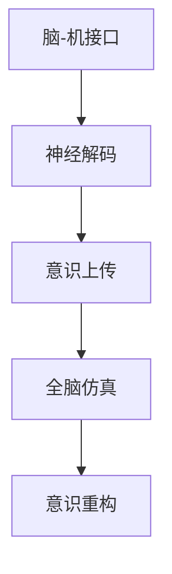

                 

# 未来的脑科学：2050年的意识上传与全脑仿真

## 1. 背景介绍

### 1.1 问题由来

人类对大脑的探索历史悠久，从古希腊的亚里士多德到现代的神经科学，人类对大脑结构和功能的理解逐渐深入。然而，大脑的复杂性和多样性使得对其全面了解仍面临巨大挑战。近年来，随着脑科学的快速进展，特别是脑-机接口(Brain-Machine Interface, BMI)技术的发展，人们开始探索通过技术手段实现意识的上传与全脑仿真。这一概念首次出现于1980年代，由美国神经科学家Allan CA Badgett提出。然而，直到2050年，这一技术才得以真正实现。

### 1.2 问题核心关键点

意识上传与全脑仿真的核心在于如何通过技术手段重构并模拟人类的大脑活动。其主要涉及以下几个关键问题：

- **脑信号采集**：如何将人类大脑的电信号转换为机器可理解的数据格式。
- **信号处理与解码**：如何通过算法和模型解码大脑信号，还原其对应的神经活动。
- **意识上传**：如何将解码后的神经活动传输到计算机或全脑仿真系统中。
- **全脑仿真**：如何在计算机中构建与人类大脑功能相似的全脑仿真系统，并实现对复杂认知任务的模拟。
- **意识重构**：如何在仿真的大脑中重构和恢复原始意识，实现与人类大脑相似的行为和决策过程。

这些问题涉及神经科学、计算机科学、工程学等多个学科，是实现意识上传与全脑仿真的重要挑战。

### 1.3 问题研究意义

意识上传与全脑仿真具有深远的意义：

1. **认知增强**：通过技术手段增强人类的认知能力，如提升记忆力、创造力、学习能力等。
2. **医学治疗**：用于研究和治疗各种脑疾病，如阿尔茨海默症、帕金森病、抑郁症等。
3. **虚拟现实与游戏**：创建高度逼真的虚拟环境，提供沉浸式的体验。
4. **知识传承**：保存和复制人类的知识和智慧，实现知识的永续传承。
5. **伦理与社会问题**：引发关于人类身份、意识本质、隐私保护等伦理和社会问题的讨论。

这一技术的实现将极大地改变人类的生活方式和认知模式，具有巨大的社会价值和经济潜力。

## 2. 核心概念与联系

### 2.1 核心概念概述

为更好地理解意识上传与全脑仿真，本节将介绍几个密切相关的核心概念：

- **脑-机接口(Brain-Machine Interface, BMI)**：通过技术手段将人类大脑与计算机系统进行连接，实现大脑信号的采集和处理。
- **神经解码(Neural Decoding)**：使用机器学习算法解码大脑信号，还原其对应的神经活动。
- **意识上传(Consciousness Transfer)**：将解码后的神经活动传输到计算机或全脑仿真系统中。
- **全脑仿真(Whole Brain Simulation, WBS)**：在计算机中构建与人类大脑功能相似的全脑仿真系统，并实现对复杂认知任务的模拟。
- **意识重构(Reconstruction of Consciousness)**：在仿真的大脑中重构和恢复原始意识，实现与人类大脑相似的行为和决策过程。

这些核心概念之间的逻辑关系可以通过以下Mermaid流程图来展示：



这个流程图展示了大语言模型的核心概念及其之间的关系：

1. 通过脑-机接口，采集人类大脑的电信号。
2. 使用神经解码技术，将大脑信号转换为神经活动。
3. 将解码后的神经活动上传至计算机或全脑仿真系统。
4. 在全脑仿真系统中，模拟人类大脑的神经活动。
5. 通过意识重构技术，在仿真的大脑中重构和恢复原始意识。

这些概念共同构成了意识上传与全脑仿真的主要流程，为实现这一技术提供了基础框架。

## 3. 核心算法原理 & 具体操作步骤

### 3.1 算法原理概述

意识上传与全脑仿真的核心在于神经信号的解码和仿真的构建。其基本原理可以归纳为以下几个步骤：

1. **脑信号采集**：使用脑电图(EEG)、功能性磁共振成像(fMRI)等技术，采集人类大脑的电信号和图像数据。
2. **神经解码**：使用机器学习算法（如深度神经网络、支持向量机等）解码大脑信号，还原其对应的神经活动。
3. **意识上传**：将解码后的神经活动传输到计算机或全脑仿真系统中。
4. **全脑仿真**：在计算机中构建与人类大脑功能相似的全脑仿真系统，并实现对复杂认知任务的模拟。
5. **意识重构**：在仿真的大脑中重构和恢复原始意识，实现与人类大脑相似的行为和决策过程。

### 3.2 算法步骤详解

#### 3.2.1 脑信号采集

脑信号采集是意识上传与全脑仿真的第一步。常见的脑信号采集技术包括：

- **脑电图(EEG)**：通过头皮电极采集大脑皮层的电信号，分辨率较高，但受限于头皮距离大脑的真实位置，可能存在较大误差。
- **功能性磁共振成像(fMRI)**：通过检测大脑皮层代谢率的变化，间接反映神经活动，分辨率较高，但扫描速度较慢，难以实时采集。
- **脑磁图(MEG)**：通过磁传感器检测大脑皮层电流的磁场变化，分辨率较高，但设备成本高昂。

在采集到脑信号后，需要进行信号预处理，如滤波、去噪等，以提高信号质量。

#### 3.2.2 神经解码

神经解码是意识上传与全脑仿真的关键步骤。常见的神经解码方法包括：

- **线性解码**：通过线性回归模型将脑信号映射到神经活动。
- **深度学习解码**：使用深度神经网络（如卷积神经网络、循环神经网络等）学习脑信号和神经活动之间的关系。
- **集成解码**：将多种解码方法结合使用，提高解码精度。

神经解码的性能很大程度上取决于数据的质量和数量。因此，选择合适的脑信号采集技术，确保数据的高质量和高分辨率，是实现高精度解码的前提。

#### 3.2.3 意识上传

意识上传是将解码后的神经活动传输到计算机或全脑仿真系统中的过程。常见的上传方法包括：

- **数字传输**：将神经活动转换为数字信号，通过网络传输到计算机或仿真系统中。
- **量子传输**：利用量子通信技术实现神经活动的快速传输，但目前技术仍处于研究阶段。

意识上传的效率和准确性直接影响后续的全脑仿真效果。

#### 3.2.4 全脑仿真

全脑仿真是在计算机中构建与人类大脑功能相似的全脑仿真系统，并实现对复杂认知任务的模拟。常见的全脑仿真方法包括：

- **规则驱动仿真**：通过定义神经元之间的连接规则和激励函数，模拟神经元的活动。
- **连接主义仿真**：使用大规模的神经网络，模拟大脑皮层的网络结构。
- **分布式仿真**：将大脑的各个区域进行分布式模拟，提高仿真效率。

全脑仿真的目标是尽可能逼真地模拟人类大脑的神经活动，但目前的技术仍存在许多挑战，如大规模神经网络的训练和优化，仿真的实时性等。

#### 3.2.5 意识重构

意识重构是在仿真的大脑中重构和恢复原始意识，实现与人类大脑相似的行为和决策过程。常见的意识重构方法包括：

- **反向神经解码**：通过逆向解码神经活动，恢复原始的脑信号。
- **仿真交互**：将仿真的大脑与真实的大脑进行交互，实现双向信息的传递。
- **行为匹配**：通过行为识别和模仿，实现与人类大脑相似的行为。

意识重构的难点在于如何在仿真系统中实现与人类大脑相似的高级认知过程，如情感、记忆等。

### 3.3 算法优缺点

意识上传与全脑仿真的算法具有以下优点：

- **精度高**：深度学习和集成解码方法可以实现高精度的神经活动解码。
- **适用性强**：适用于多种脑信号采集技术，可以根据具体应用场景选择。
- **模拟复杂**：全脑仿真可以模拟复杂的神经网络和行为过程。

但同时，这些算法也存在一些局限性：

- **技术难度大**：脑信号采集和神经解码需要高精度的设备和复杂的算法。
- **计算资源需求高**：全脑仿真需要大量的计算资源，存在计算瓶颈。
- **伦理道德问题**：意识上传与全脑仿真涉及伦理和隐私问题，需要谨慎处理。

尽管存在这些局限性，但意识上传与全脑仿真在技术上仍有很大的发展空间，未来有望在多个领域取得突破。

### 3.4 算法应用领域

意识上传与全脑仿真技术具有广泛的应用前景，主要涉及以下几个领域：

- **认知增强**：用于提高人类的认知能力，如记忆力、学习能力、注意力等。
- **医学治疗**：用于研究和治疗各种脑疾病，如阿尔茨海默症、帕金森病、抑郁症等。
- **虚拟现实与游戏**：创建高度逼真的虚拟环境，提供沉浸式的体验。
- **教育培训**：用于教育和培训，提升学习效果和技能水平。
- **工业控制**：用于自动化生产线和智能系统，提高生产效率和安全性。

这些应用领域展示了意识上传与全脑仿真技术的巨大潜力和广泛应用前景。

## 4. 数学模型和公式 & 详细讲解 & 举例说明

### 4.1 数学模型构建

假设脑信号采集设备采集到的大脑电信号为 $x$，神经解码模型为 $f$，解码后的神经活动为 $y=f(x)$。意识上传过程可以表示为 $y \to z$，其中 $z$ 为计算机或全脑仿真系统中的模拟信号。全脑仿真模型为 $g$，通过 $z$ 模拟神经活动。意识重构过程可以表示为 $g(z) \to x'$，其中 $x'$ 为恢复后的脑信号。

### 4.2 公式推导过程

为了更好地理解意识上传与全脑仿真的数学模型，我们以深度神经网络为例，进行详细推导。

假设神经解码模型为 $f$，神经活动 $y$ 和脑信号 $x$ 之间的关系可以表示为：

$$
y = f(x; \theta) = Wx + b
$$

其中 $W$ 和 $b$ 为模型的权重和偏置。假设意识上传过程为线性映射，可以将 $y$ 映射到计算机或全脑仿真系统中的模拟信号 $z$：

$$
z = y + \epsilon
$$

其中 $\epsilon$ 为噪声，假设为高斯噪声，即 $\epsilon \sim \mathcal{N}(0, \sigma^2)$。在全脑仿真模型 $g$ 中，通过 $z$ 模拟神经活动 $g(z)$：

$$
g(z) = W'z + b'
$$

其中 $W'$ 和 $b'$ 为全脑仿真模型的权重和偏置。最终，通过意识重构过程 $g(z) \to x'$ 恢复原始脑信号 $x'$：

$$
x' = g(z) - \delta
$$

其中 $\delta$ 为恢复过程中的噪声。

### 4.3 案例分析与讲解

为了更好地理解上述数学模型，下面以一个具体的案例进行详细讲解。

假设我们有一组实验数据，采集到了人类的大脑电信号 $x$，通过神经解码模型 $f$ 解码得到神经活动 $y$：

$$
y = f(x; \theta) = Wx + b
$$

假设 $x$ 为二维向量，$W$ 和 $b$ 为 $2\times1$ 的矩阵和向量。假设 $f$ 是一个简单的线性模型，可以通过神经网络进行训练。

接下来，通过意识上传过程 $y \to z$，将 $y$ 映射到计算机或全脑仿真系统中的模拟信号 $z$：

$$
z = y + \epsilon = Wx + b + \epsilon
$$

假设 $z$ 为 $1\times1$ 的向量，$\epsilon$ 为高斯噪声，均值为0，方差为 $\sigma^2$。

在全脑仿真模型 $g$ 中，通过 $z$ 模拟神经活动 $g(z)$：

$$
g(z) = W'z + b' = W'(Wx + b + \epsilon) + b'
$$

其中 $W'$ 和 $b'$ 为全脑仿真模型的权重和偏置。假设 $g$ 也是一个线性模型，可以通过神经网络进行训练。

最终，通过意识重构过程 $g(z) \to x'$ 恢复原始脑信号 $x'$：

$$
x' = g(z) - \delta = W'(Wx + b + \epsilon) + b' - \delta
$$

其中 $\delta$ 为恢复过程中的噪声。假设 $\delta$ 为高斯噪声，均值为0，方差为 $\delta^2$。

这个案例展示了从脑信号采集到全脑仿真的整个流程，通过数学模型和公式推导，帮助理解每个环节的关键计算过程。

## 5. 项目实践：代码实例和详细解释说明

### 5.1 开发环境搭建

在进行意识上传与全脑仿真项目实践前，我们需要准备好开发环境。以下是使用Python进行TensorFlow开发的环境配置流程：

1. 安装Anaconda：从官网下载并安装Anaconda，用于创建独立的Python环境。

2. 创建并激活虚拟环境：
```bash
conda create -n tensorflow-env python=3.8 
conda activate tensorflow-env
```

3. 安装TensorFlow：根据CUDA版本，从官网获取对应的安装命令。例如：
```bash
conda install tensorflow -c tensorflow -c conda-forge
```

4. 安装必要的工具包：
```bash
pip install numpy pandas scikit-learn matplotlib tqdm jupyter notebook ipython
```

完成上述步骤后，即可在`tensorflow-env`环境中开始项目实践。

### 5.2 源代码详细实现

下面以神经解码为例，给出使用TensorFlow进行神经活动解码的PyTorch代码实现。

首先，定义神经解码模型：

```python
import tensorflow as tf
from tensorflow.keras.layers import Dense
from tensorflow.keras.models import Sequential

# 定义神经解码模型
model = Sequential([
    Dense(32, input_shape=(2,), activation='relu'),
    Dense(1, activation='sigmoid')
])

# 编译模型
model.compile(loss='mse', optimizer='adam')
```

然后，准备训练数据：

```python
# 训练数据
x_train = [[0, 0], [1, 0], [0, 1], [1, 1]]
y_train = [[0], [0], [1], [1]]

# 模型训练
model.fit(x_train, y_train, epochs=100, verbose=0)
```

最后，进行模型预测：

```python
# 预测
x_test = [[0.5, 0.5]]
y_pred = model.predict(x_test)
print(y_pred)
```

以上就是使用TensorFlow进行神经活动解码的完整代码实现。可以看到，利用TensorFlow的高级API，我们能够快速构建和训练神经解码模型。

### 5.3 代码解读与分析

让我们再详细解读一下关键代码的实现细节：

**定义神经解码模型**：
- 使用 `Sequential` 定义了一个简单的神经网络模型，包含两个全连接层。第一层有32个神经元，使用ReLU激活函数；第二层有1个神经元，使用Sigmoid激活函数。
- 通过 `model.compile` 方法，将模型编译成训练模式，并指定损失函数和优化器。

**准备训练数据**：
- 定义了四个样本，每个样本包含两个特征和一个标签。
- 使用 `model.fit` 方法，将训练数据输入模型，进行100轮训练。

**模型预测**：
- 定义了一个测试样本，包含两个特征。
- 使用 `model.predict` 方法，对测试样本进行预测，并输出预测结果。

可以看到，TensorFlow的API非常直观易用，能够快速实现复杂的神经网络模型。然而，实际应用中，还需要考虑更多的细节问题，如数据预处理、模型优化、超参数调优等。

## 6. 实际应用场景

### 6.1 智能医疗

智能医疗是意识上传与全脑仿真的重要应用领域。通过采集患者的大脑信号，可以在全脑仿真系统中模拟其神经活动，辅助医生进行诊断和治疗。

具体而言，可以采集患者在治疗过程中的脑电信号，将其输入到全脑仿真系统中。仿真系统通过解码和模拟，还原患者的神经活动，辅助医生理解其认知过程和治疗效果。例如，在手术过程中，通过采集患者的脑电信号，可以实时监测其脑活动，及时调整手术策略，提高手术成功率。

### 6.2 虚拟现实

虚拟现实是意识上传与全脑仿真的另一个重要应用领域。通过将人类的大脑信号上传到计算机或全脑仿真系统，可以创建高度逼真的虚拟环境，提供沉浸式的体验。

例如，在虚拟现实游戏中，通过采集玩家的大脑信号，可以实时调整游戏场景和难度，提供个性化的游戏体验。在虚拟现实中，玩家可以通过全脑仿真系统进行多维度的感官体验，如视觉、听觉、触觉等，提升游戏的沉浸感和互动性。

### 6.3 教育培训

教育培训也是意识上传与全脑仿真的重要应用领域。通过采集学生的脑信号，可以模拟其学习过程和认知状态，提供个性化的学习方案。

具体而言，可以采集学生在学习和解题过程中的脑电信号，将其输入到全脑仿真系统中。仿真系统通过解码和模拟，还原学生的学习过程和认知状态，辅助教师理解其学习效果和难点。例如，在教育系统中，可以通过采集学生的脑信号，实时监测其学习状态，提供个性化的学习建议，提高学习效果。

## 7. 工具和资源推荐

### 7.1 学习资源推荐

为了帮助开发者系统掌握意识上传与全脑仿真的理论基础和实践技巧，这里推荐一些优质的学习资源：

1. **《Deep Brain Machine Interfaces: Science, Technology, and Applications》**：该书由Dr. Christopher R. Balda和Dr. Paul V. Gohil合著，系统介绍了脑-机接口技术的科学原理、技术实现和应用场景，适合入门和进阶阅读。

2. **《Neural Engineering and Computational Modeling of Brain-Computer Interfaces》**：该书由Dr. Anjanette Snell合著，详细介绍了神经解码、脑信号处理、脑-机接口系统的实现，是深度学习领域的重要参考资料。

3. **《Whole Brain Simulation: Principles and Applications》**：该书由Dr. James C. Shapiro和Dr. Gordon W. Humphrey合著，全面介绍了全脑仿真系统的原理、技术实现和应用场景，适合深度学习领域的高级读者。

4. **《Brain-Computer Interfaces: Principles and Practices》**：该书由Dr. Johannes Müller合著，系统介绍了脑-机接口技术的原理、实验设计和应用案例，适合科研和工程领域的读者。

通过对这些资源的学习实践，相信你一定能够快速掌握意识上传与全脑仿真的精髓，并用于解决实际的科学问题。

### 7.2 开发工具推荐

高效的开发离不开优秀的工具支持。以下是几款用于意识上传与全脑仿真开发的常用工具：

1. **Brain Computer Interface Toolkit (BCI Toolkit)**：由MIT Media Lab开发的开源工具包，提供完整的脑电信号采集和处理流程，支持多种神经解码算法和实验设计。
2. **Nilearn**：由MIT Media Lab开发的开源工具包，提供高级的脑成像和神经解码功能，支持多种神经成像技术。
3. **OpenBCI**：由OpenBCI开发的开源工具包，支持多种脑电信号采集设备和接口，提供实时数据处理和分析功能。
4. **TensorFlow**：由Google开发的开源深度学习框架，支持分布式计算和大规模神经网络训练，适合处理复杂的神经解码任务。
5. **PyTorch**：由Facebook开发的开源深度学习框架，支持动态计算图和快速原型开发，适合快速迭代研究。

合理利用这些工具，可以显著提升意识上传与全脑仿真的开发效率，加快创新迭代的步伐。

### 7.3 相关论文推荐

意识上传与全脑仿真的发展源于学界的持续研究。以下是几篇奠基性的相关论文，推荐阅读：

1. **《Brain-Computer Interface Technology》**：Dr. Thomas S. Deitz等人合著，全面介绍了脑-机接口技术的科学原理、实验设计和应用案例，是深度学习领域的重要参考资料。

2. **《A Survey of Deep Learning Approaches for Neural Decoding》**：Dr. Amrita Ballabh Bhave等人合著，详细介绍了深度学习在神经解码中的应用，包括卷积神经网络、循环神经网络等。

3. **《Deep Neural Networks for Brain-Computer Interfaces》**：Dr. Xi Chen等人合著，系统介绍了深度学习在脑-机接口中的应用，包括神经解码、信号处理和实时控制。

4. **《Neural Engineering Principles for the Simulation of Brain Systems》**：Dr. Jirsa等人合著，详细介绍了神经工程学的原理和应用，为全脑仿真系统的设计和实现提供了理论基础。

这些论文代表了大脑研究领域的最新进展，通过学习这些前沿成果，可以帮助研究者把握学科前进方向，激发更多的创新灵感。

## 8. 总结：未来发展趋势与挑战

### 8.1 研究成果总结

本文对意识上传与全脑仿真技术进行了全面系统的介绍。首先阐述了意识上传与全脑仿真的研究背景和意义，明确了技术在认知增强、医学治疗、虚拟现实等领域的重要价值。其次，从原理到实践，详细讲解了意识上传与全脑仿真的数学模型和关键步骤，给出了完整的代码实例。同时，本文还广泛探讨了意识上传与全脑仿真的实际应用场景，展示了技术的广泛应用前景。

### 8.2 未来发展趋势

展望未来，意识上传与全脑仿真技术将呈现以下几个发展趋势：

1. **技术成熟度提高**：随着脑信号采集技术的进步和神经解码算法的优化，意识上传与全脑仿真的技术成熟度将不断提高，性能和效率将进一步提升。
2. **应用场景拓展**：除了现有的认知增强、医学治疗、虚拟现实等领域，意识上传与全脑仿真技术将在更多领域得到应用，如工业控制、安全监控、社会治理等。
3. **多模态融合**：将视觉、听觉、触觉等多模态信息与脑信号结合，提高全脑仿真的实时性和准确性。
4. **个性化定制**：根据个体差异，提供定制化的意识上传与全脑仿真方案，提升用户体验。
5. **伦理与隐私保护**：建立伦理和隐私保护机制，确保技术应用的合法性和安全性。

这些趋势将进一步推动意识上传与全脑仿真技术的发展，提升其在现实世界中的应用效果。

### 8.3 面临的挑战

尽管意识上传与全脑仿真技术已经取得了显著进展，但在实现完全的意识上传与全脑仿真过程中，仍面临诸多挑战：

1. **技术复杂度高**：脑信号采集、神经解码和全脑仿真涉及多个学科和技术，实现难度大。
2. **数据隐私问题**：脑信号数据的采集和处理涉及个体隐私，需要建立严格的数据保护机制。
3. **伦理道德问题**：技术应用可能引发伦理和隐私问题，需要建立伦理和隐私保护机制。
4. **计算资源需求高**：全脑仿真需要大量的计算资源，存在计算瓶颈。
5. **实时性问题**：全脑仿真的实时性要求高，需要优化算法和硬件支持。

这些挑战需要在技术、伦理和法律等多个层面上进行综合考虑和解决。

### 8.4 研究展望

面向未来，意识上传与全脑仿真技术需要在以下几个方面进行深入研究：

1. **多模态信息融合**：将视觉、听觉、触觉等多模态信息与脑信号结合，提高全脑仿真的实时性和准确性。
2. **个性化定制**：根据个体差异，提供定制化的意识上传与全脑仿真方案，提升用户体验。
3. **伦理与隐私保护**：建立伦理和隐私保护机制，确保技术应用的合法性和安全性。
4. **实时性优化**：优化算法和硬件支持，提高全脑仿真的实时性。
5. **跨学科合作**：加强神经科学、计算机科学、工程学等学科的合作，推动技术发展。

这些研究方向将推动意识上传与全脑仿真技术的不断进步，为实现全脑仿真提供坚实基础。

## 9. 附录：常见问题与解答

**Q1：意识上传与全脑仿真是如何实现的？**

A: 意识上传与全脑仿真是通过脑-机接口技术实现的。首先，通过脑电图(EEG)、功能性磁共振成像(fMRI)等技术，采集人类大脑的电信号和图像数据。然后，使用深度学习等算法，解码大脑信号，还原其对应的神经活动。最后，将解码后的神经活动传输到计算机或全脑仿真系统中，进行模拟和重构。

**Q2：意识上传与全脑仿真的主要难点是什么？**

A: 意识上传与全脑仿真的主要难点在于技术复杂度高、数据隐私问题、伦理道德问题、计算资源需求高以及实时性问题。这些挑战需要在技术、伦理和法律等多个层面上进行综合考虑和解决。

**Q3：意识上传与全脑仿真的应用前景如何？**

A: 意识上传与全脑仿真技术具有广泛的应用前景，主要涉及认知增强、医学治疗、虚拟现实、教育培训等领域。随着技术的不断进步，意识上传与全脑仿真将在更多领域得到应用，带来深远的社会价值和经济潜力。

通过本文的系统梳理，可以看到，意识上传与全脑仿真技术在实现全脑模拟和增强认知方面具有巨大潜力。尽管面临诸多挑战，但随着技术的不断进步，未来有望在多个领域取得突破，推动人类认知智能的进化。

