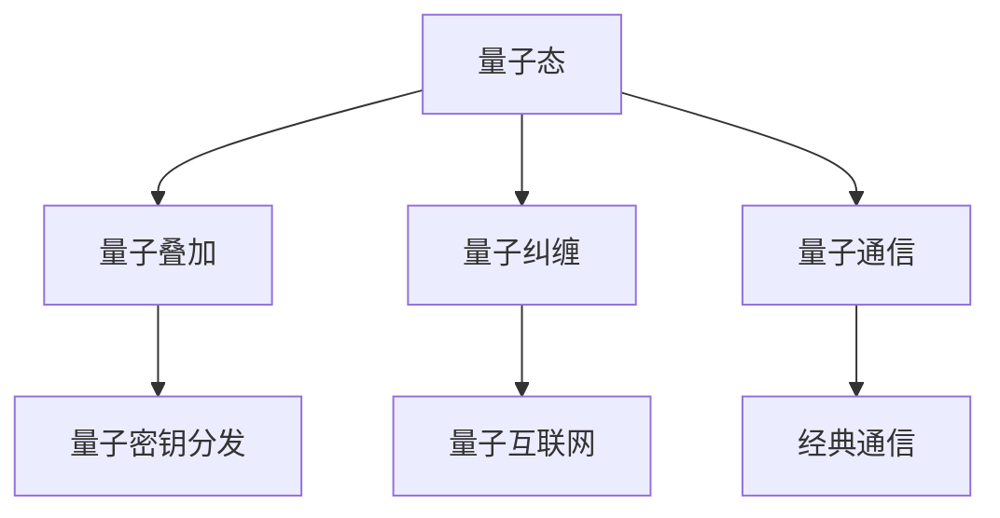

                 

## 1. 背景介绍

### 1.1 问题由来

量子通信是利用量子力学原理进行信息传递的技术，以量子态为载体的通信方式具有无条件的安全性，能抵御任何形式的窃听和攻击。随着量子计算机和量子网络技术的快速发展，量子通信已经从理论走向实用，即将开启全球量子互联网的新时代。

量子密钥分发（Quantum Key Distribution, QKD）是量子通信的核心应用之一，通过量子态的传输和测量，实现双方安全的密钥共享。由于其无条件安全性，QKD已经被广泛应用于政府、金融等对信息安全要求极高的领域。然而，当前QKD的应用规模和范围还受限于量子态的传输距离和传输速率。

### 1.2 问题核心关键点

未来量子通信的挑战主要集中在以下几个方面：
- 长距离量子态传输：当前量子密钥分发的传输距离仍受限于光纤损耗和环境噪声，如何实现更远的传输距离，是当前研究重点之一。
- 高速率量子通信：如何提高量子密钥分发的传输速率，满足实际应用的需求。
- 量子互联网的构建：如何构建一个全球范围的量子互联网，实现全球范围内的量子通信。
- 量子密钥分发与现有通信网络的融合：如何将量子通信与传统通信网络无缝融合，以实现更大规模、更复杂的应用场景。

### 1.3 问题研究意义

量子通信技术的发展对于构建一个安全、可信的通信网络具有重要意义：
- 提升信息安全：量子通信的固有安全性能够有效抵御各种传统加密方法的攻击，保护敏感数据不被窃取。
- 构建可信社会：在金融、政府等领域，量子通信能够构建一个可靠、可信的信息交换环境，推动社会信任体系的建立。
- 推动产业升级：量子通信将为数据安全、信息加密等产业链带来新的机遇和挑战，推动相关产业的转型升级。
- 实现技术突破：量子通信的开发和应用能够带来新的技术突破，推动计算机科学、通信技术等领域的发展。

## 2. 核心概念与联系

### 2.1 核心概念概述

为更好地理解量子通信技术，本节将介绍几个密切相关的核心概念：

- 量子态（Quantum State）：量子系统中粒子的状态，由波函数描述，具有不确定性和叠加性。
- 量子叠加（Quantum Superposition）：同一时刻量子态可以处于多种状态叠加，只有通过测量才会坍缩到其中一种状态。
- 量子纠缠（Quantum Entanglement）：两个或多个量子系统之间存在非局域的关联，即使它们被分隔很远，改变一个量子系统的状态也会即时影响另一个系统。
- 量子密钥分发（QKD）：利用量子态传输原理，实现双方安全的密钥共享。
- 量子互联网（Quantum Internet）：全球范围的量子通信网络，通过量子密钥分发连接全球节点，实现量子通信的规模化应用。

这些核心概念之间的逻辑关系可以通过以下Mermaid流程图来展示：



这个流程图展示的量子通信关键概念及其之间的关系：

1. 量子态是量子通信的基础，利用其叠加性和纠缠性进行信息编码。
2. 量子密钥分发通过量子态传输实现安全密钥共享。
3. 量子互联网连接全球节点，实现量子通信的网络化。
4. 量子通信与经典通信结合，形成混合通信网络。

这些概念共同构成了量子通信的基础框架，使其能够在各种场景下发挥其独特的优势。通过理解这些核心概念，我们可以更好地把握量子通信技术的工作原理和优化方向。

## 3. 核心算法原理 & 具体操作步骤
### 3.1 算法原理概述

量子密钥分发基于量子力学原理，利用量子态传输实现安全密钥的共享。其核心思想是：

1. 量子态传输：发送方将量子态通过量子信道发送给接收方。
2. 量子测量：接收方对接收到的量子态进行测量，得到测量结果。
3. 密钥生成：根据测量结果，双方生成一个共享密钥。
4. 安全验证：通过经典信道交换信息，验证密钥是否被窃听，若无窃听则使用该密钥。

核心算法包括BB84协议和E91协议等，其中BB84协议是量子密钥分发中的经典协议。以下以BB84协议为例，简要介绍其原理和具体操作步骤。

### 3.2 算法步骤详解

#### 3.2.1 准备量子态

发送方从基集合 $\{|\psi_0\rangle, |\psi_1\rangle, |\psi_2\rangle, |\psi_3\rangle\}$ 中随机选择一种基，并在该基下生成量子态 $|\psi_k\rangle$。基集合定义为：

$$
\begin{align}
& |\psi_0\rangle = |0\rangle \\
& |\psi_1\rangle = |+\rangle = \frac{|0\rangle + |1\rangle}{\sqrt{2}} \\
& |\psi_2\rangle = |-\rangle = \frac{|0\rangle - |1\rangle}{\sqrt{2}} \\
& |\psi_3\rangle = i|+\rangle = \frac{i|0\rangle + i|1\rangle}{\sqrt{2}}
\end{align}
$$

其中 $|0\rangle, |1\rangle$ 是经典比特0和1对应的标准正交基，$|\psi_1\rangle, |\psi_2\rangle$ 是经典比特0和1对应的非正交基，$|\psi_3\rangle$ 是经典比特0和1的叠加态。

#### 3.2.2 量子态传输

发送方将生成的量子态 $|\psi_k\rangle$ 通过量子信道发送给接收方。

#### 3.2.3 量子测量

接收方随机选择一种基，对接收到的量子态进行测量，得到测量结果 $|\phi_k\rangle$。若选择基为 $|\psi_k\rangle$ 的共轭态，则测量结果 $|\phi_k\rangle$ 与 $|\psi_k\rangle$ 一致；若选择基为 $|\psi_k\rangle$ 的非正交基，则测量结果为随机数，具有统计规律。

#### 3.2.4 密钥生成

双方公开讨论各自选择的基，将基选择一致的量子态测量结果作为密钥比特，生成共享密钥。

#### 3.2.5 安全验证

双方通过经典信道交换信息，检验是否有窃听。若没有窃听，则使用生成的共享密钥；否则重新进行密钥生成。

### 3.3 算法优缺点

量子密钥分发技术具有以下优点：
- 无条件安全性：量子态的测不准原理保证了量子密钥分发的固有安全性。
- 高效率：量子态传输速度快，能够实时进行密钥分发。
- 灵活性强：能够灵活适应各种通信网络环境。

同时，该技术也存在以下局限性：
- 传输距离受限：当前量子通信主要依赖光纤，传输距离仍受限于光纤损耗和环境噪声。
- 硬件要求高：需要高精度的量子器件，成本较高。
- 计算复杂度高：量子态的传输和测量过程复杂，计算量较大。

尽管存在这些局限性，但就目前而言，量子密钥分发技术仍是最成熟、最实用的量子通信应用之一。未来相关研究的重点在于如何进一步降低传输距离的限制，提高量子密钥分发的传输速率，同时降低硬件成本和计算复杂度。

### 3.4 算法应用领域

量子密钥分发技术已经在政府、金融、军事等领域得到应用，覆盖了从密钥生成、密钥传输到密钥验证的各个环节。

具体应用包括：
- 政府信息安全：通过量子密钥分发，保护政府信息的机密性和完整性。
- 金融数据传输：为银行、保险公司等金融机构提供安全的数据传输服务。
- 军事通信：为军事机构提供高安全性的通信服务。

此外，量子密钥分发技术还被用于量子卫星通信、量子雷达等新型通信方式，展示出了巨大的应用潜力。随着技术的不断发展，量子密钥分发将会在更多领域得到应用，成为信息安全的保障。

## 4. 数学模型和公式 & 详细讲解  
### 4.1 数学模型构建

BB84协议的量子密钥分发过程可以用以下数学模型来描述：

设 $q$ 为发送方选择的基，$x$ 为发送方生成的量子态，$y$ 为接收方选择的基，$z$ 为接收方测量结果。协议步骤如下：

1. 发送方选择基 $q$，生成量子态 $x$。
2. 发送方将量子态 $x$ 通过量子信道传输给接收方。
3. 接收方选择基 $y$，测量接收到的量子态，得到测量结果 $z$。
4. 双方公开讨论基 $y$ 和测量结果 $z$，将选择基一致的量子态测量结果作为密钥比特，生成共享密钥。
5. 双方通过经典信道交换信息，检验是否有窃听，若无窃听则使用生成的共享密钥。

协议的安全性基于以下假设：
- 量子态传输的不可克隆性。
- 测量的不可逆性。

### 4.2 公式推导过程

以下我们以BB84协议为例，推导量子密钥分发协议的安全性和密钥生成过程的数学公式。

设发送方选择基 $q=0$，生成量子态 $|\psi_0\rangle$。发送方将量子态 $|\psi_0\rangle$ 通过量子信道传输给接收方。接收方选择基 $y=0$，测量接收到的量子态，得到测量结果 $z=0$。双方公开讨论基 $y=0$ 和测量结果 $z=0$，选择基一致的量子态测量结果作为密钥比特，生成共享密钥。

根据量子力学原理，基 $q=0$ 和基 $y=0$ 的测量结果 $z=0$ 的概率为 $p=1/2$。因此，选择基 $q=0$ 和基 $y=0$ 生成密钥比特的概率为 $p/4$。

若无窃听，则生成共享密钥的过程如下：
- 发送方选择基 $q=0$，生成量子态 $|\psi_0\rangle$。
- 发送方将量子态 $|\psi_0\rangle$ 通过量子信道传输给接收方。
- 接收方选择基 $y=0$，测量接收到的量子态，得到测量结果 $z=0$。
- 双方公开讨论基 $y=0$ 和测量结果 $z=0$，选择基一致的量子态测量结果作为密钥比特，生成共享密钥。

若存在窃听者，则窃听者能够获得发送方的部分信息，但无法准确获知基 $q$ 和测量结果 $z$。因此，即使窃听者尝试破解密钥，其成功率仍为 $p/4$，无法保证窃听成功。

### 4.3 案例分析与讲解

以量子密钥分发的经典应用——金融数据传输为例，分析量子密钥分发技术的应用场景和优势。

在金融行业，高价值交易数据需要高效、安全的传输和存储。传统的加密方法容易被破解，导致数据泄露。而量子密钥分发技术，能够为金融交易提供高安全性的信息保护。

具体而言，假设某金融机构需要对一笔大额交易进行加密传输，通过量子密钥分发技术进行通信：
- 发送方生成量子态，并将量子态通过量子信道传输给接收方。
- 接收方接收量子态，对量子态进行测量，得到测量结果。
- 双方公开讨论测量结果，选择基一致的量子态测量结果作为密钥比特，生成共享密钥。
- 双方使用生成的共享密钥进行加密传输，确保数据在传输过程中不被窃听。

量子密钥分发技术能够保证交易数据的机密性和完整性，防止数据泄露和篡改，确保金融交易的安全性。

## 5. 项目实践：代码实例和详细解释说明
### 5.1 开发环境搭建

在进行量子密钥分发实践前，我们需要准备好开发环境。以下是使用Python进行Qiskit开发的环境配置流程：

1. 安装Anaconda：从官网下载并安装Anaconda，用于创建独立的Python环境。

2. 创建并激活虚拟环境：
```bash
conda create -n qiskit-env python=3.8 
conda activate qiskit-env
```

3. 安装Qiskit：
```bash
conda install qiskit
```

4. 安装其他必要的Python库：
```bash
pip install numpy scipy matplotlib pandas sympy
```

完成上述步骤后，即可在`qiskit-env`环境中开始量子密钥分发实践。

### 5.2 源代码详细实现

这里我们以BB84协议为例，使用Qiskit实现一个简单的量子密钥分发程序。

```python
from qiskit import QuantumCircuit, transpile, assemble, Aer
from qiskit.visualization import plot_histogram, plot_bloch_multivector
from numpy import pi, sqrt

# 定义量子电路
qc = QuantumCircuit(2)

# 发送方选择基
qubit = 0
base = 0  # 0: |0>, 1: |+>

# 发送方生成量子态
if base == 0:
    qc.h(qubit)
qc.barrier()

# 发送方将量子态通过量子信道传输给接收方
qc.barrier()

# 接收方选择基
base = 1  # 0: |0>, 1: |+>

# 接收方测量接收到的量子态
if base == 0:
    qc.h(qubit)
qc.barrier()
qc.measure(qubit, 0)

# 测量结果
counts = execute(qc, Aer.get_backend('qasm_simulator'), shots=1000).result().get_counts()
print(counts)
```

以上代码实现了BB84协议的一个基本版本，包括量子态的生成、传输和测量。需要注意的是，实际的QKD协议需要进行多次重复实验，以提升统计显著性。

### 5.3 代码解读与分析

让我们再详细解读一下关键代码的实现细节：

** QuantumCircuit类**：
- 定义一个包含两个量子比特的量子电路，使用`h`门进行Hadamard变换，生成叠加态。

**base变量**：
- 用于表示发送方和接收方选择的基，0表示|0>和|+>，1表示|+>和|->。

**测量过程**：
- 发送方和接收方使用不同的基进行测量，测量结果通过`measure`函数输出，并进行经典计算。

**结果输出**：
- 使用`execute`函数执行量子电路，`Aer.get_backend('qasm_simulator')`表示使用Qiskit的模拟量子计算机，`shots=1000`表示重复实验1000次。

通过上述代码，我们可以实现一个简单的量子密钥分发过程。需要注意的是，实际应用中的QKD协议会更加复杂，需要考虑纠错码、检测机制等更多因素。

## 6. 实际应用场景

### 6.1 政府信息安全

在政府信息安全领域，量子密钥分发技术具有重要的应用前景。政府机构需要处理大量敏感信息，包括国家机密、个人隐私等。传统加密方法容易被破解，导致信息泄露。而量子密钥分发技术，能够为政府信息提供高安全性的保护。

具体而言，政府机构可以使用量子密钥分发技术进行数据传输和存储：
- 发送方生成量子态，并将量子态通过量子信道传输给接收方。
- 接收方接收量子态，对量子态进行测量，得到测量结果。
- 双方公开讨论测量结果，选择基一致的量子态测量结果作为密钥比特，生成共享密钥。
- 双方使用生成的共享密钥进行数据加密传输，确保数据在传输过程中不被窃听。

量子密钥分发技术能够保证政府信息的机密性和完整性，防止信息泄露和篡改，确保政府信息的安全性。

### 6.2 金融数据传输

在金融行业，高价值交易数据需要高效、安全的传输和存储。传统的加密方法容易被破解，导致数据泄露。而量子密钥分发技术，能够为金融交易提供高安全性的信息保护。

具体而言，金融机构可以使用量子密钥分发技术进行数据传输：
- 发送方生成量子态，并将量子态通过量子信道传输给接收方。
- 接收方接收量子态，对量子态进行测量，得到测量结果。
- 双方公开讨论测量结果，选择基一致的量子态测量结果作为密钥比特，生成共享密钥。
- 双方使用生成的共享密钥进行数据加密传输，确保数据在传输过程中不被窃听。

量子密钥分发技术能够保证金融数据的机密性和完整性，防止数据泄露和篡改，确保金融交易的安全性。

### 6.3 军事通信

在军事通信领域，信息传输的安全性至关重要。传统加密方法容易被破解，导致信息泄露。而量子密钥分发技术，能够为军事通信提供高安全性的保护。

具体而言，军事机构可以使用量子密钥分发技术进行数据传输：
- 发送方生成量子态，并将量子态通过量子信道传输给接收方。
- 接收方接收量子态，对量子态进行测量，得到测量结果。
- 双方公开讨论测量结果，选择基一致的量子态测量结果作为密钥比特，生成共享密钥。
- 双方使用生成的共享密钥进行数据加密传输，确保数据在传输过程中不被窃听。

量子密钥分发技术能够保证军事信息的机密性和完整性，防止信息泄露和篡改，确保军事通信的安全性。

### 6.4 未来应用展望

未来，随着量子通信技术的不断发展，量子密钥分发将会在更多领域得到应用，为信息安全提供更为可靠的保护。

在智慧城市、医疗、交通等领域，量子通信技术可以用于构建高安全性的物联网系统、远程医疗、自动驾驶等，提升系统的可靠性和安全性。

此外，量子密钥分发技术还可以与其他量子技术相结合，如量子隐形传态、量子计算等，实现更加复杂、先进的信息传输和计算。

## 7. 工具和资源推荐
### 7.1 学习资源推荐

为了帮助开发者系统掌握量子通信技术的基础知识和应用实践，这里推荐一些优质的学习资源：

1. 《量子计算》系列博文：由量子计算领域专家撰写，涵盖量子计算基础、量子通信、量子密码学等前沿话题。

2. 《量子力学基础》课程：麻省理工学院开设的量子力学课程，涵盖量子力学的基本原理和经典实验。

3. 《Quantum Computing for Computer Scientists》书籍：计算机科学家Jozsa和Wootters合著的入门量子计算书籍，详细介绍了量子计算和量子通信的基本概念和应用。

4. IBM QISKit官方文档：IBM QISKit的官方文档，提供了海量量子计算和量子通信的样例代码和教程，是上手实践的必备资料。

5. 量子通信技术白皮书：介绍量子通信技术的现状、未来趋势和发展前景，适合行业从业者了解量子通信的发展动态。

通过对这些资源的学习实践，相信你一定能够快速掌握量子通信技术的基本原理和实践技巧，并用于解决实际问题。

### 7.2 开发工具推荐

高效的开发离不开优秀的工具支持。以下是几款用于量子密钥分发开发的常用工具：

1. Qiskit：IBM开发的量子计算和量子通信工具库，支持Python语言，提供了丰富的量子电路和量子算法库。

2. Cirq：Google开发的量子计算框架，支持Python语言，提供了量子电路和量子门库。

3. Qiskit Aqua：IBM开发的量子计算优化工具，支持量子电路的自动化优化和加速。

4. QInfer：Google开发的量子通信优化工具，支持量子态的测量和信息传输优化。

5. TensorBoard：TensorFlow配套的可视化工具，可实时监测量子电路的运行状态，提供详细的运行日志和性能分析。

6. Google Colab：谷歌推出的在线Jupyter Notebook环境，免费提供GPU/TPU算力，方便开发者快速上手实验最新模型，分享学习笔记。

合理利用这些工具，可以显著提升量子密钥分发任务的开发效率，加快创新迭代的步伐。

### 7.3 相关论文推荐

量子密钥分发技术的发展源于学界的持续研究。以下是几篇奠基性的相关论文，推荐阅读：

1. BB84: Quantum Key Distribution with Optical Fibers：Bennett和Brassard提出BB84协议，奠定了量子密钥分发技术的基础。

2. Quantum Key Distribution with Finite Resources：Inamori、Hasegawa和Kawasaki研究了量子密钥分发在有限资源下的安全性。

3. Device-Independent Quantum Key Distribution with Randomized Bell-State Measurement Bases：Lo、Ma和Qiu提出随机基量子密钥分发协议，进一步提升了量子密钥分发的安全性。

4. The Security of Practical Quantum Key Distribution：Mayers研究了实际量子密钥分发中的安全性，提出了多项安全性证明。

5. Secure Quantum Key Distribution over Arbitrary Noise Channels：Shor和Preskill研究了量子密钥分发在噪声信道中的安全性，提出了多项安全性证明。

这些论文代表了大量子通信和量子密钥分发技术的发展脉络。通过学习这些前沿成果，可以帮助研究者把握学科前进方向，激发更多的创新灵感。

## 8. 总结：未来发展趋势与挑战

### 8.1 总结

本文对量子密钥分发技术进行了全面系统的介绍。首先阐述了量子通信技术的背景和意义，明确了量子密钥分发在构建安全通信系统中的重要作用。其次，从原理到实践，详细讲解了量子密钥分发技术的核心算法和具体操作步骤，给出了量子密钥分发实践的完整代码实例。同时，本文还广泛探讨了量子密钥分发技术在政府、金融、军事等众多领域的应用前景，展示了其在信息安全领域的巨大潜力。此外，本文精选了量子通信技术的各类学习资源，力求为读者提供全方位的技术指引。

通过本文的系统梳理，可以看到，量子密钥分发技术正在成为信息安全领域的重要手段，极大地提升了数据传输和存储的安全性。未来，随着量子通信技术的不断发展，量子密钥分发将会在更多领域得到应用，为构建一个安全、可信的通信网络提供有力支持。

### 8.2 未来发展趋势

展望未来，量子密钥分发技术将呈现以下几个发展趋势：

1. 长距离量子通信：随着量子中继器的研发进展，未来量子密钥分发可以实现更远的传输距离，突破当前光纤传输的限制。
2. 高速率量子通信：随着量子硬件技术的进步，未来量子密钥分发的传输速率将进一步提高，满足实际应用的需求。
3. 量子互联网的构建：随着量子通信网络的扩展和量子卫星通信技术的成熟，未来将构建一个全球范围的量子互联网，实现全球范围内的量子通信。
4. 量子通信与现有通信网络的融合：未来将探索如何将量子通信与传统通信网络无缝融合，以实现更大规模、更复杂的应用场景。

以上趋势凸显了量子密钥分发技术的广阔前景。这些方向的探索发展，必将进一步提升量子通信系统的性能和应用范围，为信息安全提供更为可靠的保护。

### 8.3 面临的挑战

尽管量子密钥分发技术已经取得了瞩目成就，但在迈向更加智能化、普适化应用的过程中，它仍面临着诸多挑战：

1. 硬件成本高昂：当前量子通信设备成本较高，大规模部署面临经济压力。如何降低硬件成本，提高量子通信设备的性价比，将是重要研究课题。
2. 环境噪声干扰：量子通信设备对环境噪声较为敏感，需要优化量子硬件的抗干扰能力。如何在高噪声环境中实现稳定的量子通信，需要进一步技术突破。
3. 量子中继器技术：实现长距离量子通信需要量子中继器技术，但当前量子中继器的技术尚处于研发阶段，如何提升量子中继器的性能和可靠性，需要更多研究和实验。
4. 量子密钥分发协议的优化：当前量子密钥分发协议仍存在一些安全漏洞，如何设计更安全、更高效的量子密钥分发协议，是未来研究的重要方向。
5. 量子密钥分发与现有系统的融合：如何实现量子密钥分发与现有通信系统的无缝融合，是未来大规模部署的重大挑战。

正视量子密钥分发面临的这些挑战，积极应对并寻求突破，将是大量子通信迈向成熟的必由之路。相信随着学界和产业界的共同努力，这些挑战终将一一被克服，量子密钥分发必将在构建安全、可靠的信息通信系统中发挥重要作用。

### 8.4 研究展望

面向未来，量子密钥分发技术的研究需要在以下几个方面寻求新的突破：

1. 探索无中继量子通信：研究如何在不使用量子中继器的情况下实现长距离量子通信，进一步拓展量子密钥分发技术的传输距离。

2. 研究量子密钥分发与纠错码的结合：探索如何将纠错码引入量子密钥分发，提升量子密钥分发在噪声环境下的鲁棒性。

3. 研究量子密钥分发与量子计算的结合：探索如何将量子计算与量子密钥分发相结合，实现更加高效、安全的信息传输和处理。

4. 研究量子密钥分发与传感器技术的结合：探索如何将量子密钥分发与传感器技术相结合，实现更加智能化的信息采集和处理。

5. 研究量子密钥分发与人工智能的结合：探索如何将量子密钥分发与人工智能技术相结合，实现更加自动化、智能化的信息安全防护。

这些研究方向的探索，必将引领量子密钥分发技术迈向更高的台阶，为构建安全、可靠、可解释、可控的智能系统铺平道路。面向未来，量子密钥分发技术还需要与其他人工智能技术进行更深入的融合，如知识表示、因果推理、强化学习等，多路径协同发力，共同推动信息安全技术的发展。只有勇于创新、敢于突破，才能不断拓展量子通信技术的边界，让信息安全技术更好地造福人类社会。

## 9. 附录：常见问题与解答

**Q1：量子密钥分发与传统加密方法的区别是什么？**

A: 量子密钥分发利用量子态的不可克隆性和测量的不可逆性，实现双方安全的密钥共享。传统加密方法如RSA、AES等，通过数学算法保护信息传输的安全性。

**Q2：量子密钥分发是否适用于所有通信场景？**

A: 量子密钥分发主要适用于对信息安全性要求极高的通信场景，如政府、金融、军事等领域。对于低安全性需求的场景，传统加密方法仍然适用。

**Q3：量子密钥分发需要多少个量子比特？**

A: 量子密钥分发的安全性和传输距离与量子比特数密切相关。一般来说，量子比特数越多，传输距离越远，安全性和传输速率越高。但随着量子比特数的增加，硬件成本和计算复杂度也会随之增加。

**Q4：量子密钥分发中的量子态传输过程如何实现？**

A: 量子态的传输主要依赖量子信道，如光纤、量子卫星等。发送方将量子态通过量子信道传输给接收方，接收方对接收到的量子态进行测量，得到测量结果。

**Q5：量子密钥分发中的密钥生成过程如何实现？**

A: 双方公开讨论选择基和测量结果，将基选择一致的量子态测量结果作为密钥比特，生成共享密钥。若存在窃听者，则窃听者无法准确获知基和测量结果，无法破解密钥。

这些问题的解答，有助于更好地理解量子密钥分发的基本原理和应用场景，进一步推动量子通信技术的发展和应用。

