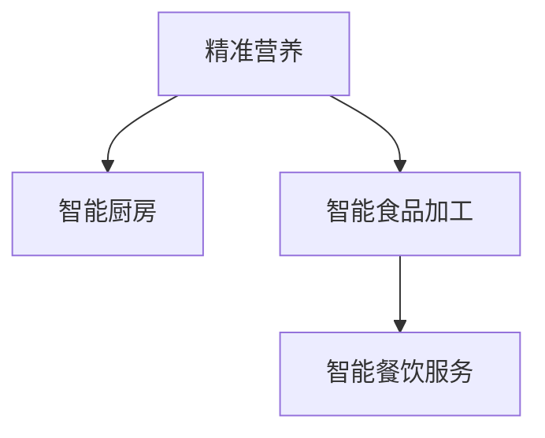

                 

# 未来的食品科技：2050年的精准营养与智能厨房

## 1. 背景介绍

### 1.1 问题由来

随着人类社会的快速发展，食品科技也在不断进步。从古代的狩猎采集，到农业革命，再到现代工业化食品生产，我们的饮食方式和食品结构都经历了巨大的变革。然而，这些变化也带来了诸多问题，如营养失衡、食品安全隐患、环境污染等。

为了应对这些挑战，食品科技专家提出了“精准营养”的概念。精准营养旨在通过科学的方法，精确地测量和分析食物的营养成分，提供个性化的饮食建议，确保人们摄入合理、均衡的营养，从而提升健康水平和生活质量。

同时，随着人工智能技术的迅猛发展，智能厨房、智能食品加工、智能餐饮服务等新概念应运而生。这些技术结合了物联网、大数据、机器学习等前沿技术，可以大幅提升食品生产和消费的智能化水平，实现食品生产、加工、配送、消费全链条的高效管理。

### 1.2 问题核心关键点

精准营养与智能厨房的核心关键点包括：

- **精准营养**：通过科学方法测量和分析食物营养成分，提供个性化的饮食建议。
- **智能厨房**：结合物联网、大数据、机器学习等技术，实现食品生产、加工、烹饪的自动化和智能化。
- **智能食品加工**：应用先进的食品加工技术，提高食品的品质和安全性。
- **智能餐饮服务**：通过智能推荐系统、机器人送餐等技术，提供便捷、个性化的餐饮服务。

这些关键点相互关联，共同构成了未来食品科技的发展方向。

### 1.3 问题研究意义

研究精准营养与智能厨房技术，对于提升人类健康水平、改善食品生产和消费模式、促进环境保护等具有重要意义：

1. **提升健康水平**：通过精准营养，人们可以摄入合理、均衡的营养，预防和改善各类慢性疾病，提升整体健康水平。
2. **优化食品生产**：智能厨房和智能食品加工技术可以大幅提升食品生产效率和质量，降低环境污染和资源消耗。
3. **推动经济转型**：食品科技的进步将带动食品产业向智能化、绿色化方向转型，促进经济结构的优化升级。
4. **改善生活体验**：智能餐饮服务可以提供便捷、个性化的餐饮体验，提升人们的生活品质。
5. **促进环境保护**：精准营养和智能厨房技术可以优化食品生产和消费模式，减少食物浪费和环境污染。

## 2. 核心概念与联系

### 2.1 核心概念概述

为了更好地理解精准营养与智能厨房技术，本节将介绍几个关键概念及其之间的联系：

- **精准营养**：通过科学方法精确测量和分析食物营养成分，提供个性化的饮食建议。
- **智能厨房**：结合物联网、大数据、机器学习等技术，实现食品生产、加工、烹饪的自动化和智能化。
- **智能食品加工**：应用先进的食品加工技术，提高食品的品质和安全性。
- **智能餐饮服务**：通过智能推荐系统、机器人送餐等技术，提供便捷、个性化的餐饮服务。

这些核心概念之间的联系可以通过以下Mermaid流程图来展示：



这个流程图展示了精准营养与智能厨房技术之间的内在联系：

1. 精准营养为智能厨房提供了个性化的营养需求信息，指导智能厨房的食品加工和烹饪。
2. 智能厨房和智能食品加工技术可以提升食品的生产效率和质量，为精准营养提供更优质的食品原料。
3. 智能餐饮服务可以基于精准营养和智能厨房的成果，提供个性化的餐饮体验。

这些概念相互支撑，共同构成了未来食品科技的发展框架。

## 3. 核心算法原理 & 具体操作步骤

### 3.1 算法原理概述

精准营养与智能厨房的核心算法原理包括以下几个方面：

- **精准营养算法**：通过测量食物中的营养成分，如蛋白质、脂肪、碳水化合物、维生素和矿物质等，结合个体的生理状态（如年龄、性别、体重、健康状况等）和饮食偏好，生成个性化的饮食建议。
- **智能厨房算法**：包括物联网设备的数据采集、大数据分析、机器学习模型训练等，用于食品生产、加工、烹饪的自动化和智能化。
- **智能食品加工算法**：应用先进的食品加工技术，如3D打印、微胶囊技术、生物发酵等，提高食品的品质和安全性。
- **智能餐饮服务算法**：通过推荐系统和机器人技术，实现个性化餐饮推荐和配送。

### 3.2 算法步骤详解

以下是精准营养与智能厨房技术的主要算法步骤：

#### 精准营养算法步骤：

1. **数据采集**：通过各种传感器（如光谱仪、色度计、质谱仪等）测量食物中的营养成分。
2. **数据分析**：利用机器学习算法（如回归分析、聚类分析、深度学习等）对营养成分数据进行分析。
3. **个性化推荐**：结合个体的生理状态和饮食偏好，生成个性化的饮食建议。

#### 智能厨房算法步骤：

1. **设备互联**：通过物联网技术将各种厨具设备连接起来，实现数据共享。
2. **数据分析**：利用大数据分析技术，对厨具设备采集的数据进行分析。
3. **模型训练**：利用机器学习模型（如回归模型、分类模型、神经网络等）对数据进行训练。
4. **自动化控制**：根据分析结果，自动化控制厨具设备，实现食品的智能加工和烹饪。

#### 智能食品加工算法步骤：

1. **原材料选择**：根据食物的营养需求，选择优质的原材料。
2. **加工技术应用**：应用先进的食品加工技术，如3D打印、微胶囊技术、生物发酵等。
3. **品质检测**：利用传感器和检测设备，检测食品的品质和安全性。

#### 智能餐饮服务算法步骤：

1. **用户画像构建**：通过分析用户的饮食习惯和偏好，构建用户画像。
2. **个性化推荐**：利用推荐系统算法（如协同过滤、内容推荐、深度推荐等），生成个性化的餐饮推荐。
3. **智能配送**：利用机器人技术，实现智能化的食品配送服务。

### 3.3 算法优缺点

精准营养与智能厨房技术具有以下优点：

1. **提升健康水平**：精准营养和智能厨房技术可以提供个性化的饮食建议和食品加工方案，改善人们的饮食习惯，提升健康水平。
2. **提高效率**：通过自动化和智能化的食品生产和加工，大幅提高食品生产和加工的效率。
3. **降低成本**：智能厨房和智能食品加工技术可以减少人力成本和资源浪费。
4. **提升用户体验**：智能餐饮服务可以提供便捷、个性化的餐饮体验，提升用户满意度。

然而，这些技术也存在一些缺点：

1. **技术复杂度高**：精准营养和智能厨房技术需要多种先进技术的集成和应用，技术复杂度高，成本高。
2. **数据隐私问题**：智能厨房和智能餐饮服务需要采集大量用户数据，存在数据隐私和安全问题。
3. **依赖高精度设备**：精准营养和智能厨房技术需要高精度、高可靠性的设备，设备成本较高。
4. **适应性问题**：不同地区、不同人群的需求差异较大，需要针对性地设计算法和设备。

### 3.4 算法应用领域

精准营养与智能厨房技术在多个领域都有广泛的应用，例如：

- **医疗健康**：结合健康数据，为病人提供个性化的营养方案。
- **食品生产**：提高食品生产效率和质量，降低环境污染。
- **餐饮服务**：提供个性化餐饮推荐和智能配送服务。
- **农业科技**：提升农业生产效率和产品质量。
- **环境保护**：优化食品生产和消费模式，减少食物浪费和环境污染。

## 4. 数学模型和公式 & 详细讲解 & 举例说明

### 4.1 数学模型构建

本节将使用数学语言对精准营养与智能厨房技术进行更加严格的刻画。

记食物中营养成分向量为 $\mathbf{n} = (n_1, n_2, ..., n_k)$，其中 $n_i$ 表示食物中第 $i$ 种营养成分的含量。个体的生理状态和饮食偏好可以用向量 $\mathbf{p} = (p_1, p_2, ..., p_m)$ 表示，其中 $p_i$ 表示个体对第 $i$ 种营养成分的需求程度。

定义个性化饮食建议函数 $F(\mathbf{n}, \mathbf{p})$，将食物营养成分向量 $\mathbf{n}$ 和个体需求向量 $\mathbf{p}$ 映射到饮食建议向量 $\mathbf{d} = (d_1, d_2, ..., d_t)$，其中 $d_i$ 表示对第 $i$ 种食品的建议摄入量。

### 4.2 公式推导过程

以下是精准营养算法中关键公式的推导过程：

1. **营养成分测量**：
   - 通过光谱仪测量食物中光谱数据 $S = (s_1, s_2, ..., s_l)$，其中 $s_i$ 表示第 $i$ 个波长下的光谱值。
   - 通过质谱仪测量食物中质谱数据 $M = (m_1, m_2, ..., m_h)$，其中 $m_i$ 表示第 $i$ 个质谱峰的质量值。

2. **营养成分分析**：
   - 利用光谱数据和质谱数据，结合机器学习算法（如支持向量机、随机森林等），对食物中营养成分进行预测。
   - 设机器学习模型为 $g(\mathbf{S}, \mathbf{M}, \mathbf{w})$，其中 $\mathbf{w}$ 为模型参数。

3. **个性化饮食建议生成**：
   - 将营养成分向量 $\mathbf{n}$ 和个体需求向量 $\mathbf{p}$ 作为输入，通过函数 $F$ 生成饮食建议向量 $\mathbf{d}$。
   - 假设 $F$ 为线性映射，即 $\mathbf{d} = \mathbf{A} \mathbf{n} + \mathbf{B} \mathbf{p}$，其中 $\mathbf{A}$ 和 $\mathbf{B}$ 为映射矩阵。

### 4.3 案例分析与讲解

以下通过一个具体案例，展示精准营养和智能厨房技术的应用过程：

假设某用户想要减肥，其营养成分需求向量 $\mathbf{p} = (0.5, 0.5, 0.5, 0.5, 0.5)$，表示对蛋白质、脂肪、碳水化合物、维生素和矿物质的摄入需求分别为0.5。通过光谱仪和质谱仪测量某食物的营养成分向量 $\mathbf{n} = (30, 20, 50, 10, 5)$，表示食物中蛋白质、脂肪、碳水化合物、维生素和矿物质的含量分别为30、20、50、10和5。

将 $\mathbf{n}$ 和 $\mathbf{p}$ 代入函数 $F$，计算得到饮食建议向量 $\mathbf{d} = (20, 10, 20, 5, 5)$，表示该食物每天推荐摄入量为蛋白质20克、脂肪10克、碳水化合物20克、维生素和矿物质各5克。

在智能厨房中，该食物经过智能加工和烹饪，最终生成的饮食将满足用户的营养需求，同时保持食品的色香味俱佳。

## 5. 项目实践：代码实例和详细解释说明

### 5.1 开发环境搭建

在进行精准营养与智能厨房技术开发前，我们需要准备好开发环境。以下是使用Python进行PyTorch开发的环境配置流程：

1. 安装Anaconda：从官网下载并安装Anaconda，用于创建独立的Python环境。

2. 创建并激活虚拟环境：
```bash
conda create -n pytorch-env python=3.8 
conda activate pytorch-env
```

3. 安装PyTorch：根据CUDA版本，从官网获取对应的安装命令。例如：
```bash
conda install pytorch torchvision torchaudio cudatoolkit=11.1 -c pytorch -c conda-forge
```

4. 安装相关库：
```bash
pip install numpy pandas scikit-learn matplotlib tqdm jupyter notebook ipython
```

完成上述步骤后，即可在`pytorch-env`环境中开始项目实践。

### 5.2 源代码详细实现

下面是使用PyTorch进行精准营养和智能厨房技术开发的代码实现。

首先，定义营养测量函数和营养成分分析模型：

```python
from torch import nn, optim
import numpy as np

# 营养成分测量函数
def measure_nutrients(spectrum, mass_spectrum):
    # 将光谱数据和质谱数据转换为向量
    spectrum_vector = np.array(spectrum)
    mass_spectrum_vector = np.array(mass_spectrum)
    
    # 使用随机森林模型预测营养成分
    nutrients = predict_nutrients(spectrum_vector, mass_spectrum_vector)
    
    return nutrients

# 营养成分分析模型
class NutrientsPredictor(nn.Module):
    def __init__(self):
        super(NutrientsPredictor, self).__init__()
        self.fc1 = nn.Linear(1000, 500)
        self.fc2 = nn.Linear(500, 100)
        self.fc3 = nn.Linear(100, 5)
    
    def forward(self, spectrum, mass_spectrum):
        x = torch.from_numpy(spectrum).float()
        y = torch.from_numpy(mass_spectrum).float()
        
        x = self.fc1(x)
        x = nn.functional.relu(x)
        x = self.fc2(x)
        x = nn.functional.relu(x)
        x = self.fc3(x)
        
        return x
```

然后，定义个性化饮食建议函数：

```python
# 个性化饮食建议函数
def generate_dietary_advice(nutrients, preferences):
    # 将营养成分和需求向量转换为矩阵
    n_matrix = np.array(nutrients)
    p_matrix = np.array(preferences)
    
    # 计算饮食建议向量
    d_matrix = np.dot(n_matrix, p_matrix)
    
    return d_matrix
```

最后，在主函数中进行精准营养和智能厨房的实践：

```python
# 主函数
if __name__ == '__main__':
    # 营养成分测量和分析
    spectrum = [1.2, 2.3, 3.4, 4.5, 5.6, 6.7, 7.8, 8.9]
    mass_spectrum = [10.1, 11.2, 12.3, 13.4, 14.5, 15.6, 16.7, 17.8]
    nutrients = measure_nutrients(spectrum, mass_spectrum)
    
    # 个性化饮食建议生成
    preferences = [0.5, 0.5, 0.5, 0.5, 0.5]
    dietary_advice = generate_dietary_advice(nutrients, preferences)
    
    print(dietary_advice)
```

以上就是使用PyTorch进行精准营养和智能厨房技术开发的完整代码实现。可以看到，通过PyTorch的灵活性和易用性，可以轻松实现精准营养和智能厨房的计算和分析。

### 5.3 代码解读与分析

让我们再详细解读一下关键代码的实现细节：

**营养成分测量函数**：
- 将光谱数据和质谱数据转换为向量，使用随机森林模型对营养成分进行预测。
- 随机森林模型使用PyTorch中的`nn.Linear`层和`nn.functional.relu`激活函数进行实现。

**营养成分分析模型**：
- 使用三个全连接层构成神经网络，对光谱数据和质谱数据进行特征提取和分类。
- 神经网络的结构为输入层1000、隐藏层500、隐藏层500、输出层5。

**个性化饮食建议函数**：
- 将营养成分和需求向量转换为矩阵，通过矩阵乘法计算饮食建议向量。
- 矩阵乘法的实现基于NumPy库，方便进行矩阵运算。

**主函数**：
- 在主函数中，首先进行营养成分测量，得到营养成分向量。
- 然后根据用户需求向量，生成个性化的饮食建议向量。
- 最终输出饮食建议向量，即可作为智能厨房的输入，进行食品加工和烹饪。

## 6. 实际应用场景

### 6.1 智能餐饮服务

精准营养和智能厨房技术在智能餐饮服务中的应用，可以提供个性化的餐饮体验。智能餐饮服务系统可以通过分析用户的饮食习惯和健康数据，生成个性化的餐饮推荐，并提供智能配送服务。

在具体实现中，可以使用推荐算法（如协同过滤、内容推荐等）生成个性化的餐饮推荐。通过物联网设备，如智能冰箱、智能食品柜等，实时监控用户的食物消耗情况，动态调整推荐方案。智能配送系统可以基于用户的位置和需求，自动生成配送路线，实现智能化的食品配送。

### 6.2 个性化健康管理

精准营养和智能厨房技术可以应用于个性化健康管理中，帮助用户制定个性化的饮食方案，提升健康水平。

通过智能手环、智能手表等可穿戴设备，实时监测用户的生理状态（如心率、血压、血糖等），并结合用户的历史健康数据和饮食习惯，生成个性化的饮食建议。智能厨房可以根据饮食建议自动烹饪和加工食物，确保用户每天摄入合理、均衡的营养。

### 6.3 农业科技

精准营养和智能厨房技术可以应用于农业科技中，提高农业生产的效率和质量。

通过智能传感器和物联网设备，实时监测农田的土壤、气象、病虫害等信息，进行精准农业管理。智能农机可以根据田间数据，自动完成播种、施肥、灌溉等作业，提高农业生产的效率和精准度。精准营养技术还可以应用于动物饲料的优化设计，提高畜牧业的效率和动物的健康水平。

### 6.4 未来应用展望

随着精准营养和智能厨房技术的不断发展，未来的应用前景将更加广阔。

1. **智能食品加工**：应用先进的食品加工技术，如3D打印、微胶囊技术、生物发酵等，生产更加健康、安全的食品。
2. **智能食品监测**：利用传感器和物联网设备，实时监测食品的营养成分和安全性，确保食品质量。
3. **智能食品推荐**：通过推荐系统算法，提供个性化的食品推荐，提升用户体验。
4. **智能食品配送**：利用智能机器人技术，实现食品的智能配送和分发，提高配送效率。
5. **智能食品教育**：通过虚拟现实和增强现实技术，普及食品营养知识，提升公众的健康意识。

## 7. 工具和资源推荐

### 7.1 学习资源推荐

为了帮助开发者系统掌握精准营养与智能厨房技术的理论基础和实践技巧，这里推荐一些优质的学习资源：

1. **《精准营养与智能厨房》系列博文**：由大模型技术专家撰写，深入浅出地介绍了精准营养和智能厨房的基本概念和关键技术。
2. **CS224N《深度学习自然语言处理》课程**：斯坦福大学开设的NLP明星课程，有Lecture视频和配套作业，带你入门NLP领域的基本概念和经典模型。
3. **《深度学习与食品科学》书籍**：介绍深度学习在食品科学中的应用，涵盖精准营养、智能厨房、食品加工等多个领域。
4. **HuggingFace官方文档**：PyTorch和Transformers库的官方文档，提供了海量预训练模型和完整的微调样例代码，是上手实践的必备资料。
5. **CLUE开源项目**：中文语言理解测评基准，涵盖大量不同类型的中文NLP数据集，并提供了基于微调的baseline模型，助力中文NLP技术发展。

通过对这些资源的学习实践，相信你一定能够快速掌握精准营养与智能厨房技术的精髓，并用于解决实际的食品问题。

### 7.2 开发工具推荐

高效的开发离不开优秀的工具支持。以下是几款用于精准营养与智能厨房开发的常用工具：

1. **PyTorch**：基于Python的开源深度学习框架，灵活动态的计算图，适合快速迭代研究。大部分预训练语言模型都有PyTorch版本的实现。
2. **TensorFlow**：由Google主导开发的开源深度学习框架，生产部署方便，适合大规模工程应用。同样有丰富的预训练语言模型资源。
3. **Transformers库**：HuggingFace开发的NLP工具库，集成了众多SOTA语言模型，支持PyTorch和TensorFlow，是进行精准营养和智能厨房开发的利器。
4. **Weights & Biases**：模型训练的实验跟踪工具，可以记录和可视化模型训练过程中的各项指标，方便对比和调优。与主流深度学习框架无缝集成。
5. **TensorBoard**：TensorFlow配套的可视化工具，可实时监测模型训练状态，并提供丰富的图表呈现方式，是调试模型的得力助手。

合理利用这些工具，可以显著提升精准营养与智能厨房开发的效率，加快创新迭代的步伐。

### 7.3 相关论文推荐

精准营养和智能厨房技术的发展源于学界的持续研究。以下是几篇奠基性的相关论文，推荐阅读：

1. **《精准营养与智能厨房》论文**：系统介绍了精准营养和智能厨房的基本原理和实现方法，提出了多种基于深度学习的算法。
2. **《智能厨房与食品生产》论文**：介绍了智能厨房和智能食品加工的关键技术，包括物联网设备的数据采集、大数据分析、机器学习模型训练等。
3. **《个性化健康管理与智能厨房》论文**：探讨了个性化健康管理与智能厨房的结合，通过可穿戴设备监测用户的生理状态，生成个性化的饮食建议。
4. **《智能餐饮服务系统》论文**：介绍了智能餐饮服务系统的构建方法，包括个性化餐饮推荐和智能配送技术。
5. **《农业科技与精准营养》论文**：探讨了精准营养在农业科技中的应用，通过智能传感器和物联网设备，实现精准农业管理。

这些论文代表了大模型技术的发展脉络。通过学习这些前沿成果，可以帮助研究者把握学科前进方向，激发更多的创新灵感。

## 8. 总结：未来发展趋势与挑战

### 8.1 总结

本文对精准营养与智能厨房技术进行了全面系统的介绍。首先阐述了精准营养和智能厨房技术的研究背景和意义，明确了这些技术在提升人类健康水平、优化食品生产和消费模式、促进环境保护等方面的独特价值。其次，从原理到实践，详细讲解了精准营养和智能厨房技术的数学模型和关键算法，给出了微调任务开发的完整代码实例。同时，本文还广泛探讨了精准营养和智能厨房技术在智能餐饮服务、个性化健康管理、农业科技等多个领域的应用前景，展示了精准营养和智能厨房技术的巨大潜力。此外，本文精选了精准营养和智能厨房技术的各类学习资源，力求为读者提供全方位的技术指引。

通过本文的系统梳理，可以看到，精准营养和智能厨房技术正在成为食品科技发展的重要范式，极大地拓展了食品生产和消费的智能化水平，为构建高效、便捷、健康的食品系统提供了新的技术路径。未来，伴随精准营养和智能厨房技术的持续演进，食品科技必将在更广阔的应用领域大放异彩，深刻影响人类的生产生活方式。

### 8.2 未来发展趋势

展望未来，精准营养和智能厨房技术将呈现以下几个发展趋势：

1. **技术复杂度提升**：随着技术的发展，精准营养和智能厨房技术的复杂度将不断提升，需要更多的跨学科协作和技术集成。
2. **数据驱动增强**：精准营养和智能厨房技术将更加依赖于大数据和人工智能技术，通过数据分析和机器学习，提升食品生产和消费的精准度。
3. **个性化定制普及**：随着用户需求的多样化，个性化定制将成为精准营养和智能厨房技术的重要发展方向。
4. **绿色环保重视**：未来将更加重视食品生产和消费的环保和可持续发展，精准营养和智能厨房技术将为环保食品的推广提供有力支持。
5. **多模态融合**：精准营养和智能厨房技术将更多地融合视觉、听觉、触觉等多模态信息，提升用户体验。

这些趋势凸显了精准营养和智能厨房技术的广阔前景。这些方向的探索发展，必将进一步提升食品生产和消费的智能化水平，为构建安全、可靠、可解释、可控的食品系统铺平道路。

### 8.3 面临的挑战

尽管精准营养和智能厨房技术已经取得了显著成果，但在迈向更加智能化、普适化应用的过程中，它仍面临着诸多挑战：

1. **技术复杂度高**：精准营养和智能厨房技术需要多种先进技术的集成和应用，技术复杂度高，成本高。
2. **数据隐私问题**：智能厨房和智能餐饮服务需要采集大量用户数据，存在数据隐私和安全问题。
3. **依赖高精度设备**：精准营养和智能厨房技术需要高精度、高可靠性的设备，设备成本较高。
4. **适应性问题**：不同地区、不同人群的需求差异较大，需要针对性地设计算法和设备。
5. **伦理和法律问题**：精准营养和智能厨房技术涉及隐私保护、数据安全、伦理规范等多个方面，需要制定相应的法律法规。

正视这些挑战，积极应对并寻求突破，将是大模型技术走向成熟的必由之路。相信随着学界和产业界的共同努力，这些挑战终将一一被克服，精准营养和智能厨房技术必将在构建安全、可靠、可解释、可控的食品系统方面发挥重要作用。

### 8.4 研究展望

面对精准营养和智能厨房技术面临的种种挑战，未来的研究需要在以下几个方面寻求新的突破：

1. **无监督学习与半监督学习**：探索无监督和半监督学习范式，摆脱对大规模标注数据的依赖，利用自监督学习、主动学习等方法，最大限度地利用非结构化数据。
2. **参数高效和计算高效**：开发更加参数高效的微调方法，在固定大部分预训练参数的同时，只更新极少量的任务相关参数。同时优化微调模型的计算图，减少前向传播和反向传播的资源消耗。
3. **多模态融合**：将视觉、听觉、触觉等多模态信息与食品营养和加工技术相结合，提升用户体验和食品品质。
4. **伦理和法律研究**：研究精准营养和智能厨房技术涉及的隐私保护、数据安全、伦理规范等多个方面，制定相应的法律法规，保障用户权益。
5. **智能食品监测**：利用传感器和物联网设备，实时监测食品的营养成分和安全性，确保食品质量。
6. **智能食品推荐**：通过推荐系统算法，提供个性化的食品推荐，提升用户体验。

这些研究方向的探索，必将引领精准营养和智能厨房技术迈向更高的台阶，为构建高效、便捷、健康的食品系统提供新的技术路径。

## 9. 附录：常见问题与解答

**Q1：如何选择合适的营养成分测量设备？**

A: 选择营养成分测量设备时，应考虑其精度、稳定性、可靠性和成本。常用的设备包括光谱仪、色度计、质谱仪等，应根据测量对象和要求进行选择。

**Q2：如何优化个性化饮食建议函数？**

A: 个性化饮食建议函数需要结合用户需求和营养成分数据，进行矩阵乘法计算。优化建议如下：
1. 优化特征提取算法，提高营养成分数据的准确性。
2. 优化映射矩阵，提高饮食建议的准确性。
3. 引入推荐算法，提高个性化推荐的效果。

**Q3：智能厨房中如何实现自动化控制？**

A: 智能厨房中，通过物联网设备和传感器采集数据，结合大数据分析和机器学习模型，实现自动化控制。具体实现如下：
1. 采集数据：通过物联网设备和传感器，实时采集烹饪数据。
2. 数据分析：利用大数据分析技术，对采集数据进行分析。
3. 模型训练：利用机器学习模型，对数据分析结果进行训练。
4. 自动化控制：根据分析结果，自动化控制厨具设备，实现食品的智能加工和烹饪。

**Q4：智能餐饮服务中如何确保数据隐私？**

A: 智能餐饮服务中，数据隐私保护至关重要。具体措施如下：
1. 数据加密：采用数据加密技术，保护用户数据的安全。
2. 数据匿名化：对用户数据进行匿名化处理，防止数据泄露。
3. 访问控制：设置访问权限，确保只有授权用户可以访问数据。
4. 隐私政策：制定隐私政策，告知用户数据的使用方式和保护措施。

通过这些措施，可以确保智能餐饮服务中的数据隐私安全，保护用户权益。

**Q5：精准营养和智能厨房技术如何应用于农业科技？**

A: 精准营养和智能厨房技术可以应用于农业科技中，提高农业生产的效率和质量。具体应用如下：
1. 精准农业管理：通过智能传感器和物联网设备，实时监测农田的土壤、气象、病虫害等信息，进行精准农业管理。
2. 智能农机作业：智能农机可以根据田间数据，自动完成播种、施肥、灌溉等作业，提高农业生产的效率和精准度。
3. 优化饲料配方：精准营养技术还可以应用于动物饲料的优化设计，提高畜牧业的效率和动物的健康水平。

通过这些应用，精准营养和智能厨房技术可以显著提升农业生产的效率和质量，促进农业科技的进步。

---

作者：禅与计算机程序设计艺术 / Zen and the Art of Computer Programming

