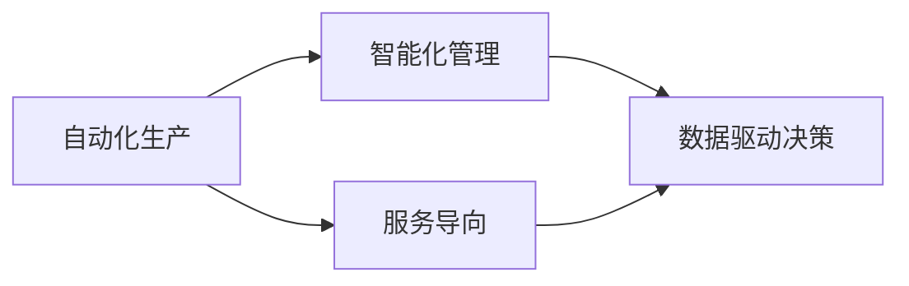

                 

# 机器人创业：自动化生产的未来蓝图

> 关键词：机器人创业,自动化生产,未来蓝图,人工智能,智能制造,机器学习,生产效率,创新创业,工业4.0,智能机器人

## 1. 背景介绍

### 1.1 问题由来

在过去的几十年里，全球工业生产经历了从手工作坊、机械化制造、到自动化生产的快速演变。尤其是进入21世纪以来，随着科技的飞速发展，智能制造、机器人自动化逐渐成为主流趋势。越来越多的企业开始探索基于机器人创业的自动化生产新模式，以提高生产效率，降低成本，提升产品质量，打造未来蓝图。

### 1.2 问题核心关键点

机器人创业的核心理念是通过引入自动化、智能化机器人系统，取代传统的人力劳动，实现生产流程的全面自动化。其关键点包括：

- **自动化生产**：利用机器人自动化设备进行物料搬运、装配、加工等生产环节，提高生产效率，降低劳动强度。
- **智能化管理**：通过人工智能算法和系统，对生产过程进行智能监控、优化和预测，实现精细化生产管理。
- **数据驱动决策**：基于大数据分析，实现生产数据实时监控、分析和决策，提升生产决策的科学性和准确性。
- **协同工作**：通过机器人之间的协同作业，提高生产流程的灵活性和可扩展性。
- **服务导向**：将生产过程与售后服务环节有机结合，实现全链条自动化和智能化。

这些关键点构成了机器人创业的基本框架，为未来的自动化生产提供了清晰的发展方向。

## 2. 核心概念与联系

### 2.1 核心概念概述

机器人创业涉及多个核心概念，主要包括：

- **自动化生产**：通过自动化机器人取代人工操作，提高生产效率，降低成本。
- **智能化管理**：利用人工智能和大数据技术，实现生产过程的智能监控和优化。
- **服务导向**：将生产和服务紧密结合，提升客户体验和满意度。

这些概念通过以下Mermaid流程图（去掉特殊字符和注释）进行联系展示：



通过这个简单的流程图，我们可以看到自动化生产是机器人创业的基础，智能化管理和数据驱动决策是提高生产效率的关键，而服务导向则确保了生产的可持续性和客户满意度。

## 3. 核心算法原理 & 具体操作步骤
### 3.1 算法原理概述

机器人创业的核心算法原理可以归结为以下几个方面：

- **机器人路径规划**：通过路径规划算法，使机器人能够在复杂的生产环境中高效、安全地完成任务。
- **机器人协作与调度**：通过多机器人协作算法，实现机器人之间的有效协同作业，提升生产线的灵活性和效率。
- **质量控制与检测**：利用机器学习和大数据技术，实现生产过程中的质量实时监控和检测，保证产品品质。
- **生产流程优化**：基于机器学习和大数据分析，对生产流程进行优化，提高生产效率，降低生产成本。

### 3.2 算法步骤详解

#### 3.2.1 机器人路径规划

机器人路径规划算法主要包括以下几个步骤：

1. **环境建模**：使用传感器对生产环境进行建模，生成环境的地图和障碍物信息。
2. **路径生成**：使用Dijkstra、A*等算法生成机器人从起点到终点的最短路径。
3. **路径避障**：在路径生成过程中，考虑障碍物的影响，确保路径的安全性。
4. **路径执行**：根据生成的路径，控制机器人运动，执行任务。

#### 3.2.2 机器人协作与调度

机器人协作与调度主要包括以下几个步骤：

1. **任务分解**：将复杂的生产任务分解为多个子任务，分配给不同的机器人。
2. **任务分配**：根据机器人的当前状态和任务优先级，合理分配任务。
3. **任务协调**：通过通信协议，协调机器人之间的协作，避免冲突。
4. **任务监控**：实时监控机器人的执行情况，及时调整任务分配。

#### 3.2.3 质量控制与检测

质量控制与检测主要包括以下几个步骤：

1. **数据采集**：使用传感器和相机采集生产过程中的质量数据。
2. **数据预处理**：对采集到的数据进行预处理，去除噪声和异常值。
3. **质量检测**：使用机器学习模型进行质量检测，判断产品是否合格。
4. **质量反馈**：根据检测结果，进行质量反馈，调整生产参数。

#### 3.2.4 生产流程优化

生产流程优化主要包括以下几个步骤：

1. **数据收集**：收集生产过程中的各类数据，如生产设备状态、物料流动等。
2. **数据分析**：对收集到的数据进行统计分析和数据挖掘，发现生产瓶颈和优化点。
3. **流程优化**：根据分析结果，优化生产流程，提高生产效率。
4. **效果评估**：对优化效果进行评估，持续改进生产流程。

### 3.3 算法优缺点

机器人创业中的核心算法具有以下优点：

- **提高生产效率**：自动化和智能化使得生产过程更加高效，能够显著提高生产效率。
- **降低生产成本**：减少了人力成本，降低了生产过程中的能源消耗和材料损耗。
- **提升产品质量**：实时监控和检测确保了产品的高品质。
- **灵活性高**：机器人的协作与调度使得生产流程更具灵活性，能够快速应对市场变化。

同时，这些算法也存在一些缺点：

- **初始成本高**：自动化和智能化设备的引入需要较高的初始投资。
- **技术复杂**：需要跨学科的技术支持，包括机械工程、电子工程、计算机科学等。
- **维护复杂**：机器人和生产线的维护需要专业技能，增加了运营成本。
- **灵活性有限**：某些生产任务可能难以自动化，仍需人工干预。

### 3.4 算法应用领域

机器人创业的应用领域非常广泛，主要包括以下几个方面：

- **汽车制造**：通过自动化生产线和机器人协作，提高汽车的生产效率和质量。
- **电子设备制造**：利用自动化设备进行精密装配和检测，确保产品的一致性和高质量。
- **物流仓储**：使用机器人进行物料搬运和分拣，提高仓储效率和准确性。
- **食品饮料**：通过自动化生产线进行快速生产和质量检测，满足市场需求。
- **医药制造**：利用自动化和智能化设备进行药物生产和质量监控，确保药品的安全性和有效性。

这些领域的应用，体现了机器人创业在提高生产效率、降低成本和提升产品质量方面的强大潜力。

## 4. 数学模型和公式 & 详细讲解  
### 4.1 数学模型构建

机器人创业的数学模型主要围绕以下几个方面构建：

- **机器人路径规划模型**：基于图论，构建机器人在环境中的路径规划模型。
- **机器人协作与调度模型**：基于分布式计算和通信理论，构建机器人的协作与调度模型。
- **质量控制与检测模型**：基于统计学和机器学习，构建质量控制与检测模型。
- **生产流程优化模型**：基于优化理论和数据挖掘，构建生产流程优化模型。

### 4.2 公式推导过程

#### 4.2.1 机器人路径规划

机器人的路径规划模型可以表示为：

$$
P = \{(x_i, y_i, t_i)\}_{i=1}^n
$$

其中 $(x_i, y_i)$ 表示机器人的位置，$t_i$ 表示时间。路径规划的目标是最小化总路径长度：

$$
L = \sum_{i=1}^{n-1} f(x_i, x_{i+1})
$$

其中 $f$ 表示位置之间的距离函数。

#### 4.2.2 机器人协作与调度

机器人协作与调度的数学模型可以表示为：

$$
S = \{(t_j, T_j)\}_{j=1}^m
$$

其中 $t_j$ 表示任务的开始时间，$T_j$ 表示任务的持续时间。调度目标是最小化任务完成时间：

$$
T = \sum_{j=1}^m t_j + T_j
$$

#### 4.2.3 质量控制与检测

质量控制与检测的数学模型可以表示为：

$$
Q = \{(D_i, Y_i)\}_{i=1}^k
$$

其中 $D_i$ 表示采集到的数据，$Y_i$ 表示检测结果。质量检测的目标是最大化检测准确率：

$$
A = \frac{1}{k} \sum_{i=1}^k \delta(D_i, Y_i)
$$

其中 $\delta$ 表示检测结果的准确率。

#### 4.2.4 生产流程优化

生产流程优化的数学模型可以表示为：

$$
F = \{(F_i, C_i)\}_{i=1}^p
$$

其中 $F_i$ 表示生产流程，$C_i$ 表示生产成本。流程优化的目标是最小化生产成本：

$$
C = \sum_{i=1}^p C_i
$$

### 4.3 案例分析与讲解

以汽车制造为例，分析机器人创业在实际应用中的具体应用：

1. **自动化生产线**：使用自动化机器人进行车身焊接、零件装配等任务，显著提高了生产效率和质量。
2. **智能质量检测**：利用机器视觉和传感器技术，实时监控和检测生产过程中的质量问题，减少了人为误判。
3. **机器人协作**：多个机器人协同作业，提高了生产线的灵活性和稳定性，能够快速应对市场变化。
4. **生产数据管理**：通过大数据分析，优化生产流程，提高生产效率，降低生产成本。

这些案例展示了机器人创业在汽车制造中的实际应用效果，为其他行业提供了可行的参考和借鉴。

## 5. 项目实践：代码实例和详细解释说明
### 5.1 开发环境搭建

在进行机器人创业的项目实践前，我们需要准备好开发环境。以下是使用Python进行ROS（Robot Operating System）开发的环境配置流程：

1. 安装Anaconda：从官网下载并安装Anaconda，用于创建独立的Python环境。

2. 创建并激活虚拟环境：
```bash
conda create -n robotics_env python=3.8 
conda activate robotics_env
```

3. 安装ROS（Robot Operating System）：
```bash
sudo apt-get install ros-{distro}-desktop
```

4. 安装ROS节点开发工具：
```bash
sudo apt-get install ros-{distro}-{category}-{version}
```

5. 安装ROS仿真工具：
```bash
sudo apt-get install ros-{distro}-{category}-{version}-{simulation}
```

完成上述步骤后，即可在`robotics_env`环境中开始机器人创业的开发实践。

### 5.2 源代码详细实现

下面是使用Python进行机器人路径规划的示例代码：

```python
import numpy as np
import scipy.optimize as optimize

def euclidean_distance(x1, y1, x2, y2):
    return np.sqrt((x2 - x1)**2 + (y2 - y1)**2)

def robot_path_planning(robot_path):
    n = len(robot_path)
    robot_path_matrix = np.zeros((n, n))
    for i in range(n):
        for j in range(i+1, n):
            robot_path_matrix[i][j] = euclidean_distance(robot_path[i][0], robot_path[i][1], robot_path[j][0], robot_path[j][1])
    start_point = robot_path[0]
    end_point = robot_path[-1]
    result = optimize.minimize(lambda x: robot_path_matrix[np.ix_(x, np.arange(n))].sum(), x=np.arange(n), bounds=((0, n), (0, n)))
    path = [robot_path[start_point[0]], robot_path[result.x[0]]]
    return path

robot_path = [(1, 1), (2, 2), (3, 3), (4, 4)]
path = robot_path_planning(robot_path)
print(path)
```

以上代码实现了简单的机器人路径规划，通过计算两点之间的欧式距离，选择最优路径。

### 5.3 代码解读与分析

让我们再详细解读一下关键代码的实现细节：

**robot_path_planning函数**：
- `euclidean_distance`函数：计算两点之间的欧式距离。
- `robot_path_planning`函数：通过矩阵计算和优化算法，选择最优路径。
- `robot_path`：输入的机器人路径点集。

**代码解释**：
- 通过`euclidean_distance`函数计算两点之间的欧式距离。
- 使用`np.zeros`函数创建n×n的机器人路径矩阵。
- 使用`for`循环遍历所有路径点，计算两点之间的欧式距离并赋值到矩阵中。
- 使用`optimize.minimize`函数进行路径优化，找到起点到终点的最短路径。
- 最终返回最短路径。

可以看到，通过简单的数学计算和优化算法，就能实现机器人路径规划的基本功能。在实际应用中，还可以结合实时环境数据和动态变化，进行更复杂的路径规划和优化。

## 6. 实际应用场景
### 6.1 智能仓储

智能仓储是机器人创业的重要应用场景之一。传统仓储物流中，货物搬运、库存管理、订单处理等环节依赖大量人工，效率低、成本高。通过引入自动化和智能化机器人系统，智能仓储可以实现快速、准确、高效的货物管理。

在技术实现上，可以部署多个机器人，配备自动导航和视觉系统，实时监控和处理库存状态。通过机器人的协作和调度，自动完成货物的搬运和分拣任务，提高仓储效率。同时，利用大数据分析和质量检测，实时监控货物状态，保证库存准确性和货物质量。

### 6.2 智能医疗

智能医疗是机器人创业的另一个重要应用场景。通过引入自动化和智能化机器人系统，智能医疗可以实现快速、准确、个性化的医疗服务。

在技术实现上，可以部署多个机器人，配备传感器和摄像头，实时监测病人的健康状况。通过机器人的协作和调度，自动完成药物配送、病床搬运、紧急抢救等任务，提高医疗服务的效率和质量。同时，利用机器学习和大数据分析，实时监控病人的健康状态，提供个性化的医疗服务。

### 6.3 智能农业

智能农业是机器人创业在农业领域的重要应用。传统农业中，播种、施肥、收割等环节依赖大量人工，效率低、成本高。通过引入自动化和智能化机器人系统，智能农业可以实现快速、准确、高效的农业生产。

在技术实现上，可以部署多个机器人，配备传感器和自动导航系统，实时监控和处理农田状态。通过机器人的协作和调度，自动完成播种、施肥、收割等任务，提高农业生产的效率和质量。同时，利用大数据分析和质量检测，实时监控农田状态，提供个性化的农业服务。

### 6.4 未来应用展望

随着机器人创业技术的不断发展，未来在更多的领域将迎来广泛应用，为各行各业带来变革性影响。

在智慧城市治理中，智能机器人将用于城市事件监测、舆情分析、应急指挥等环节，提高城市管理的自动化和智能化水平，构建更安全、高效的未来城市。

在企业生产、社会治理、文娱传媒等众多领域，机器人创业的应用也将不断涌现，为经济社会发展注入新的动力。相信随着技术的日益成熟，机器人创业必将成为人工智能落地应用的重要范式，推动人工智能向更广阔的领域加速渗透。

## 7. 工具和资源推荐
### 7.1 学习资源推荐

为了帮助开发者系统掌握机器人创业的理论基础和实践技巧，这里推荐一些优质的学习资源：

1. **ROS官方文档**：ROS（Robot Operating System）的官方文档，提供了完整的开发指南和API参考，是机器人创业的入门必备。
2. **Robotics and Automation Programming with ROS**：一本开源的机器人编程教材，涵盖了ROS的基本概念和编程实践，适合初学者学习。
3. **Robotics: Science and Systems (RSS)**：由MIT和Stanford等知名学府主办的年度会议，汇集了机器人领域的最新研究成果，是了解最新技术动态的好地方。
4. **Robotics Toolbox for MATLAB**：由MIT开发的机器人工具箱，提供了丰富的机器人仿真和控制算法，是进行机器人创业项目实践的强大工具。
5. **Robotics Specialization**：由Coursera平台提供的机器人创业课程，由MIT的教授主讲，涵盖了机器人编程、感知、控制等核心内容，适合进一步提升机器人创业技能。

通过对这些资源的学习实践，相信你一定能够快速掌握机器人创业的精髓，并用于解决实际的工业生产问题。

### 7.2 开发工具推荐

高效的开发离不开优秀的工具支持。以下是几款用于机器人创业开发的常用工具：

1. ROS（Robot Operating System）：开源的机器人操作系统，提供了丰富的机器人开发工具和资源，适合进行机器人创业项目开发。
2. Gazebo：ROS的仿真环境，可以模拟各种机器人应用场景，方便开发者进行测试和调试。
3. ROS-Bag：ROS的记录和回放工具，可以记录机器人系统运行过程，方便后续分析和优化。
4. ROS-Publisher-Subscriber（发布-订阅）：ROS的消息通信机制，用于机器人系统各个组件之间的通信。
5. ROS-Node-Manager：ROS的节点管理工具，用于启动、关闭和管理机器人系统中的各个节点。

合理利用这些工具，可以显著提升机器人创业任务的开发效率，加快创新迭代的步伐。

### 7.3 相关论文推荐

机器人创业技术的发展源于学界的持续研究。以下是几篇奠基性的相关论文，推荐阅读：

1. **A Survey of Robot Navigation Algorithms**：由IEEE出版的机器人导航算法综述，介绍了多种路径规划和避障算法。
2. **Multi-Robot Task Allocation and Scheduling**：由IEEE出版的多机器人任务分配和调度算法综述，介绍了多种协作和调度算法。
3. **A Review of Machine Learning-Based Quality Inspection in Manufacturing**：由IEEE出版的基于机器学习的质量检测算法综述，介绍了多种机器学习检测算法。
4. **Optimization of Manufacturing Systems Using Data Analytics**：由IEEE出版的制造系统优化算法综述，介绍了多种流程优化和数据分析算法。

这些论文代表了大语言模型微调技术的发展脉络。通过学习这些前沿成果，可以帮助研究者把握学科前进方向，激发更多的创新灵感。

## 8. 总结：未来发展趋势与挑战
### 8.1 总结

本文对机器人创业的自动化生产新模式进行了全面系统的介绍。首先阐述了机器人创业在自动化生产中的核心理念和应用场景，明确了机器人创业在提高生产效率、降低成本和提升产品质量方面的独特价值。其次，从原理到实践，详细讲解了机器人创业的数学模型和关键步骤，给出了机器人创业项目开发的完整代码实例。同时，本文还广泛探讨了机器人创业在智能仓储、智能医疗、智能农业等多个行业领域的应用前景，展示了机器人创业技术的巨大潜力。此外，本文精选了机器人创业的各类学习资源，力求为读者提供全方位的技术指引。

通过本文的系统梳理，可以看到，机器人创业的自动化生产新模式正在成为工业生产的重要方向，极大地提高了生产效率，降低了成本，提升了产品质量。未来，伴随技术的不断演进，机器人创业必将成为智能制造的关键组成部分，推动工业生产向更加智能化、自动化的方向发展。

### 8.2 未来发展趋势

展望未来，机器人创业技术将呈现以下几个发展趋势：

1. **自主导航与感知**：通过先进的传感器和视觉系统，机器人能够实现自主导航和环境感知，进一步提升自动化生产的智能化水平。
2. **人机协作**：通过人机交互技术，机器人能够与人类进行自然互动，实现更加高效的生产协作。
3. **服务型机器人**：将机器人应用于服务领域，如教育、餐饮、医疗等，提供个性化、高品质的服务。
4. **多模态融合**：将视觉、听觉、触觉等多种传感器数据进行融合，提升机器人对复杂环境的适应能力和任务执行的精度。
5. **智能决策**：通过深度学习和大数据分析，机器人能够进行自主决策，提高生产效率和质量。
6. **跨领域应用**：机器人创业技术将向更多领域扩展，如教育、医疗、文娱、物流等，实现跨领域的应用和创新。

这些趋势凸显了机器人创业技术的广阔前景，为各行各业带来了新的发展机遇。

### 8.3 面临的挑战

尽管机器人创业技术已经取得了瞩目成就，但在迈向更加智能化、普适化应用的过程中，它仍面临着诸多挑战：

1. **初始成本高**：自动化和智能化设备的引入需要较高的初始投资，对中小企业构成一定压力。
2. **技术复杂**：需要跨学科的技术支持，包括机械工程、电子工程、计算机科学等，增加了技术难度。
3. **维护复杂**：机器人和生产线的维护需要专业技能，增加了运营成本。
4. **灵活性有限**：某些生产任务可能难以自动化，仍需人工干预。
5. **数据隐私和安全**：机器人创业过程中涉及大量数据，数据隐私和安全问题需要重视。
6. **伦理和社会影响**：机器人替代人力可能带来就业和社会问题，需要考虑伦理和社会影响。

这些挑战需要在技术、经济、社会等多个层面进行综合考虑和应对，才能使机器人创业技术更好地服务于人类生产和生活。

### 8.4 研究展望

面对机器人创业技术面临的挑战，未来的研究需要在以下几个方面寻求新的突破：

1. **低成本机器人**：开发低成本、易维护的机器人系统，降低初始投资和运营成本，促进中小企业采用。
2. **智能决策系统**：研发自主决策系统，提高机器人的智能水平和决策能力，减少人工干预。
3. **跨学科融合**：促进机械工程、电子工程、计算机科学等学科的融合，推动机器人创业技术的发展。
4. **数据隐私保护**：研究和制定数据隐私保护措施，确保数据安全和用户隐私。
5. **伦理和社会影响研究**：探讨机器人创业对就业和社会的影响，制定伦理和社会规范，确保技术的可持续发展。

这些研究方向的探索，必将引领机器人创业技术迈向更高的台阶，为构建人机协同的智能社会铺平道路。面向未来，机器人创业技术还需要与其他人工智能技术进行更深入的融合，如知识表示、因果推理、强化学习等，多路径协同发力，共同推动智能制造的发展。只有勇于创新、敢于突破，才能不断拓展机器人创业技术的边界，让人类生产和生活更加智能化、高效化。

## 9. 附录：常见问题与解答

**Q1：机器人创业是否适用于所有制造领域？**

A: 机器人创业在制造领域具有广泛的应用前景，但并非所有制造领域都适合采用机器人创业。对于一些需要高度人工干预、复杂操作或高精度要求的制造任务，机器人创业可能难以完全取代人工。因此，需要根据具体情况，结合技术特点和经济需求，选择合适的自动化和智能化解决方案。

**Q2：机器人创业的初始投资和运营成本如何控制？**

A: 机器人创业的初始投资和运营成本主要集中在设备和维护上。为了控制成本，可以采用以下策略：
1. 选择成本效益高的自动化设备。
2. 对设备进行定期维护和保养，延长设备使用寿命。
3. 采用模块化设计和可扩展性高的系统架构。
4. 使用云计算和共享资源，降低初期投资。
5. 引入低成本的替代方案，如协作机器人等。

**Q3：如何确保机器人创业的安全性和可靠性？**

A: 机器人创业的安全性和可靠性需要从以下几个方面进行保障：
1. 使用先进的安全传感器和视觉系统，确保机器人对环境的感知和避障。
2. 进行严格的安全培训和操作规范，确保操作人员的安全。
3. 定期对机器人进行维护和升级，确保系统的稳定性和可靠性。
4. 建立紧急应对机制，确保在紧急情况下能够快速响应。
5. 进行全面的风险评估和安全测试，确保系统的安全性。

**Q4：机器人创业的适用场景有哪些？**

A: 机器人创业在以下场景中具有广泛的应用前景：
1. 大规模生产制造：如汽车、电子产品、家电等。
2. 精细化加工制造：如精密仪器、医疗设备、光学镜头等。
3. 物流仓储：如货物搬运、分拣、包装等。
4. 农业生产：如播种、施肥、收割等。
5. 服务型制造：如教育培训、医疗护理、餐饮服务等。

这些场景的共同特点是重复性强、劳动强度大、数据采集和处理量大，适合采用机器人创业进行自动化和智能化改造。

**Q5：机器人创业的前景如何？**

A: 机器人创业的前景非常广阔，未来将在更多的领域得到应用和推广。随着技术的不断演进，机器人创业必将成为智能制造的关键组成部分，推动工业生产向更加智能化、自动化的方向发展。机器人创业技术将在提高生产效率、降低成本和提升产品质量方面发挥重要作用，为经济社会发展注入新的动力。

---

作者：禅与计算机程序设计艺术 / Zen and the Art of Computer Programming

