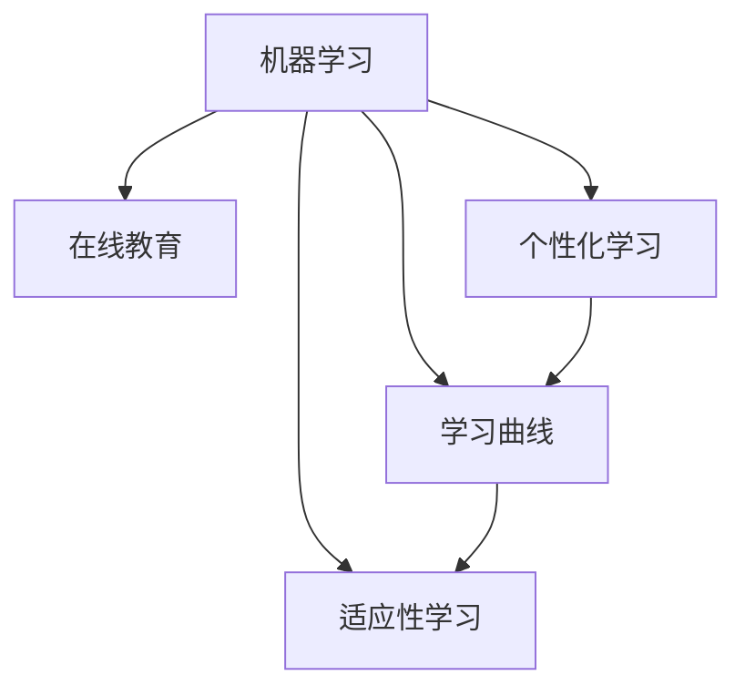

                 

## 1. 背景介绍

### 1.1 问题由来
随着信息技术的迅猛发展，在线教育逐渐成为教育行业的重要组成部分。在线教育的普及不仅为学生提供了更多元的学习方式，也推动了教育技术的不断革新。然而，尽管在线教育已经取得了显著的进展，但传统的“一刀切”的教学模式仍未能充分考虑每个学生的个体差异，无法满足学生的个性化学习需求。

个性化教育旨在根据学生的学习风格、知识基础和兴趣点，提供量身定制的学习内容和路径，帮助学生更有效地掌握知识。机器学习技术的兴起为个性化教育提供了新的技术手段，使得根据学生的数据进行个性化推荐和内容定制成为可能。

### 1.2 问题核心关键点
个性化教育的核心关键点在于如何通过数据驱动的方法，精准刻画每个学生的学习曲线，并据此调整教学策略，实现动态适配。目前，机器学习在个性化教育中主要有以下几种应用：

- 学生学习数据收集与预处理：通过日志、作业、测验等数据，收集学生在学习过程中的各项行为数据。
- 学习曲线建模：利用机器学习算法，建立学生学习行为的预测模型，识别出每个学生在不同科目、不同难度下的学习节奏和薄弱环节。
- 个性化推荐：根据学习曲线，推荐学生感兴趣的课程和难度适中的习题，以促进学习效果。
- 适应性学习：通过动态调整课程内容和难度，实现对学生的实时适绀，提供个性化学习体验。

## 2. 核心概念与联系

### 2.1 核心概念概述

为更好地理解机器学习在个性化教育中的应用，本节将介绍几个密切相关的核心概念：

- 机器学习（Machine Learning, ML）：通过数据驱动的方式，训练模型从数据中学习规律，并应用于实际问题解决的领域。
- 在线教育（Online Education）：借助互联网技术，提供各类课程的学习方式，打破了时间和空间的限制，拓宽了教育的边界。
- 个性化学习（Personalized Learning）：根据学生的学习风格、知识基础和兴趣点，提供量身定制的学习内容和路径，帮助学生更有效地掌握知识。
- 学习曲线（Learning Curve）：描述学生在不同科目、不同难度下的学习进度和表现，用于识别出学生的学习节奏和薄弱环节。
- 适应性学习（Adaptive Learning）：通过动态调整教学内容和难度，实现对学生的实时适绀，提供个性化的学习体验。

这些核心概念之间的逻辑关系可以通过以下Mermaid流程图来展示：



这个流程图展示了几组概念之间的联系：

1. 机器学习是实现个性化学习和适应性学习的技术基础。
2. 在线教育为个性化学习提供了条件，使学习曲线和适应性学习成为可能。
3. 个性化学习利用学习曲线进行个性化推荐和动态调整。
4. 适应性学习通过动态调整课程内容和难度，提供更精准的个性化体验。

## 3. 核心算法原理 & 具体操作步骤
### 3.1 算法原理概述

机器学习在个性化教育中的应用，主要依赖于学生学习数据的收集与分析。通过构建学生学习曲线模型，个性化推荐和适应性学习的实现变得可能。

形式化地，假设学生 $i$ 在科目 $j$ 上的学习数据为 $x_i \in \mathbb{R}^n$，其中 $n$ 为特征维度。学习曲线模型 $M_{\theta}$ 通过训练数据集 $D=\{(x_i, y_i)\}_{i=1}^N$，其中 $y_i$ 为学生 $i$ 在科目 $j$ 上的学习进展。

学习曲线模型的训练目标是最小化预测误差，即：

$$
\theta^* = \mathop{\arg\min}_{\theta} \sum_{i=1}^N \mathcal{L}(M_{\theta}(x_i),y_i)
$$

其中 $\mathcal{L}$ 为损失函数，用于衡量预测值与真实值之间的差异。

通过训练得到的学习曲线模型 $M_{\theta^*}$，可以预测学生未来的学习进展，并据此调整课程内容和难度，实现适应性学习。

### 3.2 算法步骤详解

机器学习在个性化教育中的应用一般包括以下几个关键步骤：

**Step 1: 学生学习数据收集与预处理**
- 收集学生在学习过程中产生的各种数据，如作业提交时间、答题时间、测验分数等。
- 对数据进行预处理，包括数据清洗、特征选择、归一化等。

**Step 2: 学习曲线建模**
- 选择合适的机器学习算法，如线性回归、决策树、神经网络等，建立学生学习曲线的预测模型。
- 使用训练数据对模型进行训练，并使用验证数据集进行调参和模型选择。

**Step 3: 个性化推荐**
- 根据学生学习曲线模型，预测每个学生在不同科目、不同难度下的学习进展。
- 利用预测结果，推荐学生感兴趣的课程和难度适中的习题。

**Step 4: 适应性学习**
- 根据学生的学习进展，动态调整课程内容和难度，实现对学生的实时适绀。
- 定期评估学生学习效果，调整个性化推荐和适应性学习的策略。

### 3.3 算法优缺点

机器学习在个性化教育中的应用具有以下优点：
1. 个性化推荐：能够根据学生的学习行为数据，提供量身定制的学习内容，满足个性化需求。
2. 动态调整：能够实时根据学生的学习进展，动态调整课程内容和难度，提升学习效果。
3. 客观评估：通过数据驱动的方式，客观评估学生的学习表现，提供精准的反馈。
4. 可扩展性：机器学习模型可应用于多种教育场景，具有广泛的应用前景。

同时，该方法也存在一定的局限性：
1. 数据依赖：个性化推荐和适应性学习的效果很大程度上取决于数据的准确性和丰富度。
2. 模型偏见：机器学习模型可能会受到训练数据的偏见影响，导致推荐结果的不公。
3. 学生隐私：收集和使用学生学习数据可能涉及隐私保护问题，需要严格的合规措施。
4. 公平性：机器学习模型可能会加剧教育资源的不平等分配，需进行公平性评估和改进。
5. 实效性：个性化推荐和适应性学习的实现需要实时数据处理和算法优化，技术实现难度较大。

尽管存在这些局限性，但就目前而言，机器学习技术在个性化教育中的应用前景广阔，已展现出显著的实际效果。

### 3.4 算法应用领域

机器学习在个性化教育中的应用已经广泛应用于多个领域，例如：

- 在线课程推荐：根据学生的学习行为数据，推荐学生感兴趣的课程内容。
- 自适应学习系统：动态调整课程内容和难度，实现个性化学习。
- 学习进度追踪：实时监控学生学习进展，提供反馈和调整建议。
- 智能辅导系统：利用机器学习算法，进行问题解答和学习指导。
- 作业和测验自动评分：通过自然语言处理和机器学习，自动批改学生的作业和测验。

除了这些经典应用外，机器学习还被创新性地应用到更多领域，如可控学习难度调整、知识图谱构建、情感分析等，为个性化教育提供了新的解决方案。随着机器学习技术的不断进步，相信个性化教育将迈向更高的水平，为学生提供更优质的学习体验。

## 4. 数学模型和公式 & 详细讲解 & 举例说明
### 4.1 数学模型构建

本节将使用数学语言对机器学习在个性化教育中的应用进行更加严格的刻画。

假设学生 $i$ 在科目 $j$ 上的学习数据为 $x_i \in \mathbb{R}^n$，学习曲线模型 $M_{\theta}$ 的预测函数为 $f(x_i, \theta)$，其中 $\theta$ 为模型参数。模型的损失函数为 $\mathcal{L}(y_i, f(x_i, \theta))$，用于衡量预测值与真实值之间的差异。

模型的训练目标是最小化损失函数：

$$
\theta^* = \mathop{\arg\min}_{\theta} \sum_{i=1}^N \mathcal{L}(y_i, f(x_i, \theta))
$$

其中，$\mathcal{L}$ 为损失函数，如均方误差、交叉熵等。

### 4.2 公式推导过程

以下我们以线性回归模型为例，推导学习曲线建模的公式。

假设学生 $i$ 在科目 $j$ 上的学习进展 $y_i$ 可以表示为：

$$
y_i = \theta_0 + \theta_1 x_{i1} + \cdots + \theta_n x_{in}
$$

其中，$\theta_0, \theta_1, \cdots, \theta_n$ 为模型的参数。根据最小二乘法，模型的参数求解公式为：

$$
\theta = (X^TX)^{-1}X^Ty
$$

其中，$X$ 为特征矩阵，$y$ 为标签向量。

在实际应用中，学习曲线模型的训练通常采用随机梯度下降等优化算法，不断更新模型参数 $\theta$，最小化预测误差。

### 4.3 案例分析与讲解

假设某在线教育平台收集了学生 $i$ 在科目 $j$ 上的学习数据 $x_i = [x_{i1}, x_{i2}, \cdots, x_{in}]$，其中 $x_{ij}$ 表示学生在科目 $j$ 上的答题时间、作业提交时间等特征。利用线性回归模型建立学生学习曲线的预测模型 $M_{\theta}$，其中 $\theta = [\theta_0, \theta_1, \cdots, \theta_n]$。

通过训练数据集 $D=\{(x_i, y_i)\}_{i=1}^N$，利用随机梯度下降算法训练模型，得到最优参数 $\theta^*$。此时，模型 $M_{\theta^*}$ 可以用于预测学生未来的学习进展，例如预测学生 $i$ 在下一个时间段内完成某个习题的概率。

通过实时监控学生学习进展，平台可以动态调整课程内容和难度，提供个性化学习体验。例如，对于表现不佳的学生，可以提供更多针对性的练习题和辅导资料，而对于表现优异的学生，可以推荐更高难度的习题和挑战性任务。

## 5. 项目实践：代码实例和详细解释说明
### 5.1 开发环境搭建

在进行机器学习实践前，我们需要准备好开发环境。以下是使用Python进行PyTorch开发的环境配置流程：

1. 安装Anaconda：从官网下载并安装Anaconda，用于创建独立的Python环境。

2. 创建并激活虚拟环境：
```bash
conda create -n pytorch-env python=3.8 
conda activate pytorch-env
```

3. 安装PyTorch：根据CUDA版本，从官网获取对应的安装命令。例如：
```bash
conda install pytorch torchvision torchaudio cudatoolkit=11.1 -c pytorch -c conda-forge
```

4. 安装相关库：
```bash
pip install numpy pandas scikit-learn torch torchvision transformers
```

完成上述步骤后，即可在`pytorch-env`环境中开始机器学习实践。

### 5.2 源代码详细实现

下面我们以线性回归模型为例，给出使用PyTorch对学生学习曲线进行预测的代码实现。

首先，定义模型和数据：

```python
import torch
import torch.nn as nn
from torch.utils.data import DataLoader
from sklearn.model_selection import train_test_split

class LinearRegression(nn.Module):
    def __init__(self, n_features):
        super(LinearRegression, self).__init__()
        self.linear = nn.Linear(n_features, 1)
    
    def forward(self, x):
        return self.linear(x)

# 加载数据
data = pd.read_csv('student_data.csv')
X = data.iloc[:, :-1].values
y = data.iloc[:, -1].values

# 划分训练集和测试集
X_train, X_test, y_train, y_test = train_test_split(X, y, test_size=0.2, random_state=42)

# 定义数据集
class StudentDataset(Dataset):
    def __init__(self, X, y):
        self.X = X
        self.y = y
    
    def __len__(self):
        return len(self.X)
    
    def __getitem__(self, idx):
        x = self.X[idx]
        y = self.y[idx]
        return torch.tensor(x, dtype=torch.float), torch.tensor(y, dtype=torch.float)
```

然后，定义训练和评估函数：

```python
def train_epoch(model, optimizer, loss_fn, data_loader, n_epochs=100):
    model.train()
    for epoch in range(n_epochs):
        for X, y in data_loader:
            optimizer.zero_grad()
            y_pred = model(X)
            loss = loss_fn(y_pred, y)
            loss.backward()
            optimizer.step()
    
    return model

def evaluate(model, data_loader):
    model.eval()
    total_loss = 0
    for X, y in data_loader:
        y_pred = model(X)
        loss = loss_fn(y_pred, y)
        total_loss += loss.item()
    
    return total_loss / len(data_loader)

# 训练模型
model = LinearRegression(n_features=n_features)
optimizer = torch.optim.SGD(model.parameters(), lr=0.01)
loss_fn = nn.MSELoss()

# 定义数据集
train_data = StudentDataset(X_train, y_train)
test_data = StudentDataset(X_test, y_test)

# 训练模型
train_epoch(model, optimizer, loss_fn, DataLoader(train_data, batch_size=32))
```

最后，使用训练好的模型进行预测：

```python
def predict(model, X):
    with torch.no_grad():
        y_pred = model(X)
        return y_pred.cpu().numpy()

# 预测新学生i的学习进展
X_new = [[x1, x2, ..., xn]]
y_pred = predict(model, torch.tensor(X_new, dtype=torch.float))

print(y_pred)
```

以上就是使用PyTorch对学生学习曲线进行预测的完整代码实现。可以看到，借助PyTorch库，我们可以用相对简洁的代码完成学习曲线模型的训练和预测。

### 5.3 代码解读与分析

让我们再详细解读一下关键代码的实现细节：

**LinearRegression类**：
- `__init__`方法：初始化线性回归模型，定义线性层。
- `forward`方法：前向传播，计算模型输出。

**train_epoch函数**：
- 定义训练函数，使用随机梯度下降算法更新模型参数。
- 每个epoch内，遍历训练数据集，对每个样本进行前向传播、计算损失和反向传播，更新模型参数。

**evaluate函数**：
- 定义评估函数，计算模型在测试集上的平均损失。
- 遍历测试数据集，对每个样本进行前向传播和损失计算，返回平均损失值。

**train模型**：
- 创建线性回归模型和优化器。
- 使用`train_epoch`函数训练模型，返回训练好的模型。

**预测函数**：
- 定义预测函数，使用训练好的模型对新样本进行预测。
- 将新样本输入模型，输出预测结果。

通过上述代码，我们可以看到，使用PyTorch进行学习曲线模型的训练和预测，可以大大简化开发过程。PyTorch库提供了强大的自动微分和模型封装能力，使我们能够快速实现复杂的机器学习模型，并进行高效迭代优化。

当然，工业级的系统实现还需考虑更多因素，如模型的保存和部署、超参数的自动搜索、数据增强等。但核心的学习曲线建模思想基本与此类似。

## 6. 实际应用场景
### 6.1 智能辅导系统

基于学习曲线建模的智能辅导系统，可以广泛应用于在线教育平台，为学生提供个性化的学习指导。传统辅导系统往往采用统一的教学计划和进度，难以满足每个学生的个性化需求。

智能辅导系统通过收集学生的学习数据，建立个性化的学习曲线模型，动态调整课程内容和难度，实现对学生的实时适绀。系统不仅可以提供个性化的习题推荐，还能根据学生的学习进展，进行针对性的辅导和反馈，帮助学生更好地掌握知识。

### 6.2 在线课程推荐

在线课程推荐系统可以根据学生的学习行为数据，推荐学生感兴趣的课程内容。传统的课程推荐系统往往只关注学生的历史学习记录，而忽略了学生的当前学习状态和偏好。

基于学习曲线建模的课程推荐系统，通过分析学生的学习进展和表现，可以更准确地推荐符合学生兴趣和能力的课程。系统不仅可以推荐与历史课程相关的课程，还能推荐学生未曾接触的新领域课程，促进学生的多元化学习。

### 6.3 作业和测验自动评分

作业和测验自动评分系统是机器学习在个性化教育中的重要应用之一。传统的评分方式往往需要大量人工参与，耗时耗力，且评分标准和结果难以统一。

基于学习曲线建模的自动评分系统，可以利用自然语言处理和机器学习，对学生的作业和测验进行自动批改。系统不仅能够判断答案的正确性，还能通过分析学生的答题过程，给出更精准的评分和反馈。例如，对于主观题，系统可以根据学生的答题思路和逻辑，进行更细致的评分，帮助学生更好地理解和掌握知识。

### 6.4 未来应用展望

随着机器学习技术的不断进步，基于学习曲线建模的个性化教育应用将面临更多机遇和挑战。

在教育场景中，未来的智能辅导系统将更加智能化和个性化，能够更准确地捕捉学生的学习需求和状态，提供更符合其能力和兴趣的学习内容。系统将不仅限于课程推荐和习题推荐，还能提供更全面的学习规划和个性化学习路径，帮助学生更有效地掌握知识。

在在线教育平台中，未来的课程推荐系统将更加精准和动态，能够根据学生的学习进展和偏好，实时调整推荐策略，提供最符合学生需求的学习资源。系统将不仅限于静态课程推荐，还能提供实时的学习资源动态更新和个性化推荐，提升学生学习体验。

在作业和测验评分领域，未来的自动评分系统将更加智能和公正，能够更全面地评估学生的学习效果，提供更精准的反馈和建议。系统将不仅限于答案正确性的判断，还能通过分析学生的答题过程，提供更深入的个性化指导和建议。

总之，机器学习在个性化教育中的应用前景广阔，未来将会有更多创新应用场景涌现，推动教育技术的不断进步。

## 7. 工具和资源推荐
### 7.1 学习资源推荐

为了帮助开发者系统掌握机器学习在个性化教育中的应用，这里推荐一些优质的学习资源：

1. 《深度学习》课程：由斯坦福大学Andrew Ng教授主讲，全面介绍了深度学习的基本概念和算法，包括回归、分类、序列模型等。
2. 《Python数据科学手册》：一本深度介绍Python数据科学库的书，包括Numpy、Pandas、Scikit-learn等，是学习机器学习的必备工具。
3. 《机器学习实战》：由Peter Harrington编写的实战教程，通过实例讲解了机器学习算法在实际问题中的应用，适合初学者和进阶学习者。
4. Kaggle平台：全球最大的数据科学竞赛平台，汇集了大量数据集和代码示例，可以提供丰富的学习资源和项目实践机会。
5. Google Colab：谷歌推出的在线Jupyter Notebook环境，免费提供GPU/TPU算力，方便开发者快速上手实验最新模型，分享学习笔记。

通过对这些资源的学习实践，相信你一定能够快速掌握机器学习在个性化教育中的精髓，并用于解决实际的教育问题。
###  7.2 开发工具推荐

高效的开发离不开优秀的工具支持。以下是几款用于机器学习实践的常用工具：

1. PyTorch：基于Python的开源深度学习框架，灵活动态的计算图，适合快速迭代研究。
2. TensorFlow：由Google主导开发的开源深度学习框架，生产部署方便，适合大规模工程应用。
3. Scikit-learn：基于Python的机器学习库，提供各类经典算法和工具，适合快速原型开发。
4. Weights & Biases：模型训练的实验跟踪工具，可以记录和可视化模型训练过程中的各项指标，方便对比和调优。
5. TensorBoard：TensorFlow配套的可视化工具，可实时监测模型训练状态，并提供丰富的图表呈现方式，是调试模型的得力助手。

合理利用这些工具，可以显著提升机器学习实践的开发效率，加快创新迭代的步伐。

### 7.3 相关论文推荐

机器学习在个性化教育中的应用源于学界的持续研究。以下是几篇奠基性的相关论文，推荐阅读：

1. Kearns et al., 2017. 《The Elements of Statistical Learning》：经典的统计学习教材，介绍了机器学习的基本理论和算法。
2. Goodfellow et al., 2016. 《Deep Learning》：深度学习领域的权威教材，介绍了深度学习的基本概念和算法。
3. Bengio et al., 2003. 《A Tutorial on Apprentissage Associatif et Apprentissage Représentant》：自然语言处理领域的经典论文，介绍了统计语言模型和深度学习在NLP中的应用。
4. Hinton et al., 2006. 《A Fast Learning Algorithm for Deep Belief Nets》：深度信念网络（DBN）的开创性论文，介绍了DBN的基本结构和算法。
5. Chen et al., 2018. 《Adaptive Computation Time for Recurrent Neural Networks》：动态时间规整（DTRNN）的开创性论文，介绍了DTRNN在序列建模中的应用。

这些论文代表了大语言模型微调技术的发展脉络。通过学习这些前沿成果，可以帮助研究者把握学科前进方向，激发更多的创新灵感。

## 8. 总结：未来发展趋势与挑战
### 8.1 总结

本文对机器学习在个性化教育中的应用进行了全面系统的介绍。首先阐述了个性化教育的背景和意义，明确了机器学习在个性化教育中的重要地位。其次，从原理到实践，详细讲解了机器学习在个性化教育中的核心算法，包括学习曲线建模、个性化推荐和适应性学习等。最后，本文还介绍了机器学习在实际应用中的各种场景，展示了其在在线教育、智能辅导系统、作业自动评分等领域的应用前景。

通过本文的系统梳理，可以看到，机器学习技术在个性化教育中的应用前景广阔，已展现出显著的实际效果。未来，随着机器学习技术的不断进步，个性化教育将迈向更高的水平，为学生提供更优质的学习体验。

### 8.2 未来发展趋势

展望未来，机器学习在个性化教育中的应用将呈现以下几个发展趋势：

1. 数据驱动：随着大数据技术的发展，个性化教育将更加依赖于数据的收集和分析，数据驱动成为个性化学习的基础。
2. 算法优化：未来将涌现更多高效的学习曲线建模和个性化推荐算法，提升模型训练和推理效率。
3. 多模态融合：除了文本数据，未来将更多地利用图像、视频、音频等多模态数据，实现更全面的个性化学习。
4. 实时动态：个性化教育将更加注重实时动态调整，能够根据学生的学习进展和反馈，及时调整教学策略。
5. 智能辅导：基于自然语言处理和机器学习，智能辅导系统将提供更智能、更个性化的学习指导。
6. 自动化评估：未来的作业和测验自动评分系统将更加智能和公正，能够提供更精准的评分和反馈。

以上趋势凸显了机器学习在个性化教育中的广阔前景。这些方向的探索发展，必将进一步提升个性化教育的效果，为学生提供更优质的学习体验。

### 8.3 面临的挑战

尽管机器学习在个性化教育中的应用前景广阔，但在迈向更加智能化、普适化应用的过程中，它仍面临诸多挑战：

1. 数据质量：个性化教育的效果很大程度上取决于数据的准确性和丰富度，如何收集和处理高质量的教育数据，仍然是一个重要挑战。
2. 算法公平：机器学习模型可能会受到训练数据的偏见影响，导致推荐结果的不公，如何确保算法的公平性，需要进一步研究。
3. 学生隐私：收集和使用学生学习数据可能涉及隐私保护问题，如何保护学生的隐私权利，需要严格的合规措施。
4. 实效性：个性化教育需要实时数据处理和算法优化，技术实现难度较大，如何提高系统的实时性和效率，是当前的一大挑战。
5. 可解释性：机器学习模型往往具有"黑盒"特性，难以解释其内部工作机制和决策逻辑，如何提高算法的可解释性，将是未来的一个重要研究方向。

尽管存在这些挑战，但随着学界和产业界的共同努力，这些挑战终将一一被克服，机器学习在个性化教育中的应用将不断深化和完善。

### 8.4 研究展望

面对机器学习在个性化教育中所面临的挑战，未来的研究需要在以下几个方面寻求新的突破：

1. 数据治理：如何建立标准化、高质量的教育数据集，确保数据的准确性和可解释性，是未来研究的重要方向。
2. 算法公平：如何在机器学习算法中引入公平性约束，确保推荐结果的不公，是未来研究的重点。
3. 隐私保护：如何在收集和使用学生学习数据时，确保学生的隐私权利，是未来研究的重要课题。
4. 实效性优化：如何提高个性化教育系统的实时性和效率，实现更好的用户体验，是未来研究的重要方向。
5. 可解释性增强：如何提高机器学习算法的可解释性，使其具备更高的透明性和可信度，是未来研究的重要目标。

这些研究方向的探索，必将引领机器学习在个性化教育中迈向更高的台阶，为构建安全、可靠、可解释、可控的智能系统铺平道路。面向未来，机器学习技术还需要与其他人工智能技术进行更深入的融合，如知识表示、因果推理、强化学习等，多路径协同发力，共同推动个性化教育的进步。

## 9. 附录：常见问题与解答

**Q1：机器学习在个性化教育中是否适用于所有学生？**

A: 机器学习在个性化教育中的应用具有广泛适用性，适用于大多数学生。但需要注意的是，对于年龄较小或认知能力较弱的学生，如何收集和处理他们的学习数据，仍是一个挑战。

**Q2：如何平衡个性化推荐和集体教学？**

A: 个性化推荐和集体教学并不矛盾，可以相互补充。个性化推荐可以提供量身定制的学习内容，满足每个学生的个性化需求，而集体教学可以提供结构化的知识体系和教学标准，确保学生的整体学习效果。

**Q3：机器学习在个性化教育中是否会加剧学生之间的差距？**

A: 机器学习模型可能会加剧教育资源的不平等分配，但通过合理的算法设计和公平性约束，可以最大程度减少这种差距。例如，可以考虑在算法中引入公平性评估指标，确保每个学生的学习机会和效果。

**Q4：如何保护学生的学习数据隐私？**

A: 保护学生学习数据隐私是个性化教育中的重要问题。可以通过数据匿名化、访问控制、加密等技术手段，确保学生数据的安全性和隐私性。同时，需要制定严格的数据使用规范和隐私保护政策，确保学生的权利和利益。

**Q5：如何评估机器学习算法的公平性？**

A: 评估机器学习算法的公平性是确保个性化教育公正性的重要步骤。可以采用统计分析、实验对比等方法，评估算法在不同群体中的表现，确保推荐结果的公平性。同时，可以引入公平性指标，如准确率、召回率、F1值等，进行公平性评估。

通过这些常见问题的解答，可以看到，机器学习在个性化教育中的应用前景广阔，但需要不断优化算法设计和隐私保护措施，才能实现更公平、更有效的个性化教育。

---

作者：禅与计算机程序设计艺术 / Zen and the Art of Computer Programming

