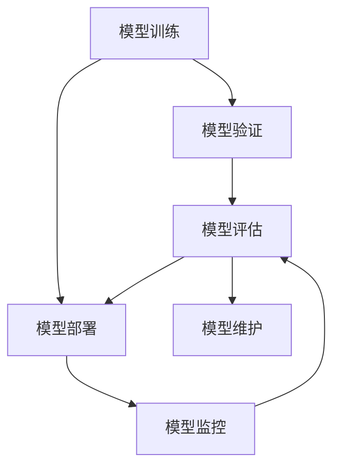

                 

# 机器学习模型部署：从开发到生产环境

## 1. 背景介绍

在人工智能(AI)和大数据技术飞速发展的今天，机器学习模型已经广泛应用于各类领域，如自然语言处理(NLP)、计算机视觉(CV)、推荐系统等。然而，在实际应用中，从模型开发到生产环境的部署，需要经过一系列复杂的流程，如数据预处理、模型训练、验证测试、生产部署等。本文将系统性地介绍机器学习模型部署的关键技术和最佳实践，帮助开发者从模型开发到生产环境的全流程管理。

## 2. 核心概念与联系

### 2.1 核心概念概述

在进行机器学习模型部署前，首先需要理解一些关键概念和它们之间的联系。

- **机器学习模型**：使用数据和算法训练出来的预测模型，如线性回归、决策树、神经网络等。
- **模型训练**：使用训练数据集对模型进行参数优化，使其能够对新数据进行准确预测。
- **模型验证**：在验证数据集上评估模型的性能，检查其泛化能力。
- **模型部署**：将训练好的模型嵌入到生产环境中的服务器或设备上，使其能够接收输入数据并产生输出。
- **模型监控**：在生产环境中实时监控模型性能，如准确率、响应时间、内存使用等。
- **模型维护**：根据反馈数据和性能评估，对模型进行必要的调优和更新。

这些概念之间的逻辑关系可以通过以下Mermaid流程图来展示：



这个流程图展示了机器学习模型从训练到部署的整个流程，并强调了模型性能评估和维护的重要性。

## 3. 核心算法原理 & 具体操作步骤
### 3.1 算法原理概述

机器学习模型的部署过程，本质上是对模型进行序列化、打包和部署，使其能够在生产环境中被正确加载和运行。以下是具体的算法原理和操作步骤：

#### 3.1.1 模型序列化和打包

模型序列化是将模型参数以特定格式存储的过程。常见的序列化格式包括：

- **pickle**：Python内置的序列化工具，广泛用于保存模型和数据。
- **joblib**：用于并行化机器学习任务的库，支持高效的序列化和反序列化。
- **Keras HDF5格式**：用于存储Keras模型的权重和配置信息。
- **ONNX**：用于跨平台和跨语言的高效模型交换格式，支持深度学习框架之间的模型迁移。

#### 3.1.2 模型部署环境准备

部署环境通常需要满足以下条件：

- **Python版本**：确保部署环境中的Python版本与模型训练环境一致。
- **依赖库**：安装模型训练所需的所有依赖库和依赖包。
- **硬件资源**：根据模型的计算需求，准备足够的内存、CPU和GPU资源。
- **操作系统**：确保部署环境的操作系统与模型训练环境一致。

#### 3.1.3 模型加载与推理

模型加载是将模型序列化和反序列化的过程，通常包括：

- **pickle库**：使用pickle库从磁盘加载模型。
- **joblib库**：使用joblib库从HDF5文件或ONNX文件加载模型。
- **TensorFlow Serving**：使用TensorFlow Serving服务器从内存加载TensorFlow模型。
- **PyTorch Serving**：使用PyTorch Serving服务器从内存加载PyTorch模型。

模型推理是将新数据输入模型进行预测的过程，通常包括：

- **前向传播**：对输入数据进行预处理，包括数据归一化、标准化等。
- **模型调用**：将预处理后的数据输入模型，获取模型预测结果。
- **后处理**：对模型输出进行后处理，如阈值处理、归一化等。

### 3.2 算法步骤详解

#### 3.2.1 数据预处理

数据预处理是机器学习项目的重要环节，包括以下步骤：

- **数据清洗**：处理缺失值、异常值等数据问题。
- **特征工程**：构造和选择对模型有帮助的特征。
- **数据标准化**：将数据转换为标准正态分布，便于模型训练。

#### 3.2.2 模型训练与验证

模型训练是机器学习模型的核心步骤，包括以下步骤：

- **选择模型**：选择合适的机器学习模型，如线性回归、决策树、神经网络等。
- **数据分割**：将数据集划分为训练集、验证集和测试集。
- **模型训练**：使用训练集对模型进行参数优化。
- **模型验证**：在验证集上评估模型的性能，如准确率、召回率、F1分数等。
- **模型选择**：根据验证集评估结果选择最优模型。

#### 3.2.3 模型部署与监控

模型部署是将模型嵌入到生产环境的过程，包括以下步骤：

- **模型序列化**：将训练好的模型序列化为特定的格式。
- **模型打包**：将序列化后的模型和必要的依赖库打包成可部署的包。
- **模型部署**：将打包好的模型部署到生产环境中的服务器或设备上。

模型监控是确保模型在生产环境中稳定运行的关键，包括以下步骤：

- **性能监控**：实时监控模型性能，如准确率、响应时间、内存使用等。
- **异常检测**：检测模型预测结果的异常，如数据偏移、模型退化等。
- **日志记录**：记录模型运行的日志，便于故障分析和问题排查。

### 3.3 算法优缺点

模型部署过程的主要优点包括：

- **性能提升**：将模型部署到生产环境中的高性能服务器上，提升模型的运行效率。
- **可扩展性**：部署到多个服务器或设备上，提高系统的可扩展性和可用性。
- **稳定性保证**：通过模型监控和异常检测，确保模型在生产环境中的稳定运行。

然而，模型部署过程也存在一些缺点：

- **部署复杂**：模型部署需要考虑多方面因素，如数据迁移、环境配置等，增加了部署难度。
- **性能优化**：需要在部署前后进行性能优化，如模型压缩、数据格式转换等。
- **资源占用**：模型部署需要占用一定的硬件资源，如内存、CPU和GPU等。

### 3.4 算法应用领域

机器学习模型部署技术广泛应用在各个领域，如：

- **自然语言处理(NLP)**：部署语言模型到服务器上，用于自然语言理解、生成和翻译等任务。
- **计算机视觉(CV)**：部署图像识别和分类模型到服务器上，用于图像识别、物体检测和图像分割等任务。
- **推荐系统**：部署推荐模型到服务器上，用于个性化推荐和用户行为分析等任务。
- **金融风控**：部署风险预测模型到服务器上，用于信用评分、欺诈检测和投资策略等任务。
- **医疗诊断**：部署医疗诊断模型到服务器上，用于医学影像分析、疾病诊断和健康监测等任务。

这些应用场景展示了机器学习模型部署技术的广泛适用性，为各个行业的数字化转型提供了有力支持。

## 4. 数学模型和公式 & 详细讲解  
### 4.1 数学模型构建

机器学习模型部署的数学模型主要关注模型的序列化和反序列化。以下是一些常见的数学模型和公式：

#### 4.1.1 pickle序列化模型

pickle序列化模型的基本公式为：

$$
S(\theta) = \text{pickle}\{\theta\}
$$

其中，$S$表示序列化函数，$\theta$为模型的参数。

#### 4.1.2 joblib加载模型

joblib加载模型的基本公式为：

$$
L(S, S', \text{model\_path}) = \text{joblib}\{\text{load}(S', S, \text{model\_path})\}
$$

其中，$L$表示加载函数，$S'$为加载函数参数，$S$为加载函数，$\text{model\_path}$为模型路径。

#### 4.1.3 ONNX模型转换

ONNX模型转换的基本公式为：

$$
C(\theta) = \text{onnx}\{\theta\}
$$

其中，$C$表示转换函数，$\theta$为模型的参数。

### 4.2 公式推导过程

#### 4.2.1 pickle序列化模型

pickle序列化模型的推导过程如下：

- 将模型参数$\theta$转换为Python对象。
- 将Python对象转换为pickle字节流。
- 将pickle字节流写入文件，完成序列化。

#### 4.2.2 joblib加载模型

joblib加载模型的推导过程如下：

- 读取模型文件中的pickle字节流。
- 将pickle字节流转换为Python对象。
- 使用joblib库的load函数加载Python对象，得到模型$\theta$。

#### 4.2.3 ONNX模型转换

ONNX模型转换的推导过程如下：

- 将模型参数$\theta$转换为ONNX格式。
- 将ONNX格式转换为模型文件，完成序列化。

### 4.3 案例分析与讲解

#### 4.3.1 pickle序列化模型

```python
import pickle

# 训练好的模型
model = ...

# 将模型序列化为pickle文件
with open('model.pkl', 'wb') as f:
    pickle.dump(model, f)

# 从pickle文件中加载模型
with open('model.pkl', 'rb') as f:
    loaded_model = pickle.load(f)
```

#### 4.3.2 joblib加载模型

```python
from joblib import load

# 加载HDF5文件中的模型
model = load('model.h5')

# 加载ONNX文件中的模型
model = load('model.onnx')
```

#### 4.3.3 ONNX模型转换

```python
import onnx

# 将Keras模型转换为ONNX模型
keras_model = ...
onnx_model = onnx.keras_to_onnx(keras_model, 'model.pb', input_shape=(1, 784))

# 加载ONNX模型
model = onnx.load('model.pb')
```

## 5. 项目实践：代码实例和详细解释说明
### 5.1 开发环境搭建

#### 5.1.1 环境准备

在开始模型部署前，首先需要准备好开发环境。以下是一些常见的开发环境配置步骤：

1. **安装Python**：在机器上安装Python 3.7及以上版本。

2. **安装依赖库**：使用pip安装必要的依赖库，如numpy、scikit-learn、TensorFlow等。

3. **安装TensorFlow**：使用pip安装TensorFlow版本1.15及以上版本，或使用TensorFlow Serving服务器。

4. **安装PyTorch**：使用pip安装PyTorch版本1.5及以上版本，或使用PyTorch Serving服务器。

5. **安装ONNX**：使用pip安装ONNX版本1.8及以上版本。

6. **安装joblib**：使用pip安装joblib版本0.13及以上版本。

#### 5.1.2 搭建测试环境

在搭建测试环境时，可以使用以下步骤：

1. **安装虚拟机软件**：如VirtualBox、VMware等，安装虚拟机。

2. **安装操作系统**：在虚拟机中安装Ubuntu等操作系统。

3. **安装Python**：在虚拟机中安装Python 3.7及以上版本。

4. **安装依赖库**：使用pip安装必要的依赖库，如numpy、scikit-learn、TensorFlow等。

5. **安装TensorFlow**：使用pip安装TensorFlow版本1.15及以上版本，或使用TensorFlow Serving服务器。

6. **安装PyTorch**：使用pip安装PyTorch版本1.5及以上版本，或使用PyTorch Serving服务器。

7. **安装ONNX**：使用pip安装ONNX版本1.8及以上版本。

8. **安装joblib**：使用pip安装joblib版本0.13及以上版本。

#### 5.1.3 配置环境变量

在配置环境变量时，可以按照以下步骤进行：

1. **设置Python路径**：在.bashrc文件中添加Python路径，使Python可执行。

2. **设置依赖库路径**：在.bashrc文件中添加依赖库路径，使pip可执行。

3. **设置TensorFlow路径**：在.bashrc文件中添加TensorFlow路径，使TensorFlow可执行。

4. **设置PyTorch路径**：在.bashrc文件中添加PyTorch路径，使PyTorch可执行。

5. **设置ONNX路径**：在.bashrc文件中添加ONNX路径，使ONNX可执行。

6. **设置joblib路径**：在.bashrc文件中添加joblib路径，使joblib可执行。

### 5.2 源代码详细实现

#### 5.2.1 数据预处理

```python
import pandas as pd
from sklearn.preprocessing import StandardScaler

# 读取数据集
data = pd.read_csv('data.csv')

# 数据清洗
data = data.dropna()

# 特征工程
X = data[['feature1', 'feature2', 'feature3']]
y = data['label']

# 数据标准化
scaler = StandardScaler()
X = scaler.fit_transform(X)

# 将数据划分为训练集和测试集
X_train, X_test, y_train, y_test = train_test_split(X, y, test_size=0.2, random_state=42)
```

#### 5.2.2 模型训练与验证

```python
from sklearn.linear_model import LogisticRegression

# 训练模型
model = LogisticRegression()
model.fit(X_train, y_train)

# 验证模型
y_pred = model.predict(X_test)
accuracy = accuracy_score(y_test, y_pred)
print('Accuracy: {:.2f}%'.format(accuracy * 100))
```

#### 5.2.3 模型部署与监控

```python
import joblib
import psutil

# 加载模型
model = joblib.load('model.pkl')

# 部署模型
def deploy_model(data):
    # 模型加载和推理
    y_pred = model.predict(data)

    # 性能监控
    cpu_percent = psutil.cpu_percent(interval=1)
    mem_percent = psutil.virtual_memory().percent
    print('CPU usage: {:.2f}%'.format(cpu_percent))
    print('Memory usage: {:.2f}%'.format(mem_percent))
    return y_pred

# 测试模型
data = ...
y_pred = deploy_model(data)
```

### 5.3 代码解读与分析

#### 5.3.1 数据预处理

数据预处理是机器学习项目的重要环节，包括以下步骤：

- **数据清洗**：处理缺失值、异常值等数据问题。
- **特征工程**：构造和选择对模型有帮助的特征。
- **数据标准化**：将数据转换为标准正态分布，便于模型训练。

#### 5.3.2 模型训练与验证

模型训练是机器学习模型的核心步骤，包括以下步骤：

- **选择模型**：选择合适的机器学习模型，如线性回归、决策树、神经网络等。
- **数据分割**：将数据集划分为训练集、验证集和测试集。
- **模型训练**：使用训练集对模型进行参数优化。
- **模型验证**：在验证集上评估模型的性能，如准确率、召回率、F1分数等。
- **模型选择**：根据验证集评估结果选择最优模型。

#### 5.3.3 模型部署与监控

模型部署是将模型嵌入到生产环境的过程，包括以下步骤：

- **模型序列化**：将训练好的模型序列化为特定的格式。
- **模型打包**：将序列化后的模型和必要的依赖库打包成可部署的包。
- **模型部署**：将打包好的模型部署到生产环境中的服务器或设备上。

模型监控是确保模型在生产环境中稳定运行的关键，包括以下步骤：

- **性能监控**：实时监控模型性能，如准确率、响应时间、内存使用等。
- **异常检测**：检测模型预测结果的异常，如数据偏移、模型退化等。
- **日志记录**：记录模型运行的日志，便于故障分析和问题排查。

## 6. 实际应用场景
### 6.1 智能客服系统

智能客服系统是机器学习模型部署的重要应用场景之一。智能客服系统能够快速响应客户咨询，提高客户满意度。在部署智能客服系统时，可以使用以下步骤：

1. **数据收集**：收集客户的历史咨询记录，标注问题和最佳答复。

2. **数据预处理**：对问题进行分词、去除停用词等预处理。

3. **模型训练**：使用预处理后的数据集对模型进行训练，优化模型预测结果。

4. **模型部署**：将训练好的模型部署到生产环境中的服务器上，使系统能够实时响应客户咨询。

5. **性能监控**：实时监控系统的响应时间和准确率，确保系统稳定运行。

### 6.2 金融风控系统

金融风控系统是机器学习模型部署的另一个重要应用场景。金融风控系统能够预测客户的信用风险，预防欺诈行为。在部署金融风控系统时，可以使用以下步骤：

1. **数据收集**：收集客户的个人信息、交易记录等数据。

2. **数据预处理**：对数据进行特征工程和数据清洗，去除无用特征。

3. **模型训练**：使用预处理后的数据集对模型进行训练，优化模型预测结果。

4. **模型部署**：将训练好的模型部署到生产环境中的服务器上，使系统能够实时预测客户信用风险。

5. **性能监控**：实时监控系统的准确率和响应时间，确保系统稳定运行。

### 6.3 医疗诊断系统

医疗诊断系统是机器学习模型部署的重要应用场景之一。医疗诊断系统能够辅助医生进行疾病诊断，提高诊断效率和准确率。在部署医疗诊断系统时，可以使用以下步骤：

1. **数据收集**：收集患者的医学影像、病历等数据。

2. **数据预处理**：对数据进行特征工程和数据清洗，去除无用特征。

3. **模型训练**：使用预处理后的数据集对模型进行训练，优化模型预测结果。

4. **模型部署**：将训练好的模型部署到生产环境中的服务器上，使系统能够实时辅助医生进行疾病诊断。

5. **性能监控**：实时监控系统的准确率和响应时间，确保系统稳定运行。

## 7. 工具和资源推荐
### 7.1 学习资源推荐

为了帮助开发者系统掌握机器学习模型部署的理论基础和实践技巧，这里推荐一些优质的学习资源：

1. **《Python机器学习实战》**：由Sebastian Raschka等作者编写，全面介绍了机器学习模型部署的各个环节，包括数据预处理、模型训练、模型部署和模型监控等。

2. **TensorFlow官方文档**：TensorFlow官方文档提供了详细的部署指南和示例代码，帮助开发者快速上手。

3. **TensorFlow Serving文档**：TensorFlow Serving官方文档提供了详细的部署和配置指南，帮助开发者快速部署模型。

4. **PyTorch官方文档**：PyTorch官方文档提供了详细的部署指南和示例代码，帮助开发者快速上手。

5. **PyTorch Serving文档**：PyTorch Serving官方文档提供了详细的部署和配置指南，帮助开发者快速部署模型。

### 7.2 开发工具推荐

高效的开发离不开优秀的工具支持。以下是几款用于机器学习模型部署开发的常用工具：

1. **TensorFlow Serving**：Google开发的机器学习模型服务框架，支持多种机器学习模型，易于部署和扩展。

2. **PyTorch Serving**：Facebook开发的机器学习模型服务框架，支持多种机器学习模型，易于部署和扩展。

3. **Joblib**：用于并行化机器学习任务的库，支持高效的序列化和反序列化。

4. **ONNX**：用于跨平台和跨语言的高效模型交换格式，支持深度学习框架之间的模型迁移。

5. **Pickle**：Python内置的序列化工具，广泛用于保存模型和数据。

6. **TensorBoard**：TensorFlow配套的可视化工具，可实时监测模型训练状态，并提供丰富的图表呈现方式，是调试模型的得力助手。

### 7.3 相关论文推荐

机器学习模型部署的研究已经取得了丰硕成果，以下是几篇奠基性的相关论文，推荐阅读：

1. **TensorFlow Serving: Towards Serving Machine Learning Models at Scale**：介绍TensorFlow Serving框架的设计和实现。

2. **PyTorch Serving: A Flexible and Extensible Serving Framework for PyTorch**：介绍PyTorch Serving框架的设计和实现。

3. **ONNX: An Open, Portable, Language-Agnostic Intermediate Representation for Machine Learning Models**：介绍ONNX格式的定义和用途。

4. **Joblib: Making your Python code more parallel**：介绍Joblib库的设计和实现。

5. **Scikit-learn: Machine learning in Python**：介绍Scikit-learn库的设计和实现。

这些论文代表了大模型部署技术的发展脉络。通过学习这些前沿成果，可以帮助研究者把握学科前进方向，激发更多的创新灵感。

## 8. 总结：未来发展趋势与挑战

### 8.1 研究成果总结

本文系统性地介绍了机器学习模型部署的关键技术和最佳实践，涵盖数据预处理、模型训练、模型部署和模型监控等各个环节。通过本文的学习，读者可以掌握从模型开发到生产环境的全流程管理，确保模型在实际应用中的稳定性和可靠性。

### 8.2 未来发展趋势

展望未来，机器学习模型部署技术将呈现以下几个发展趋势：

1. **自动化部署**：自动化部署技术将进一步发展，减少人工干预，提高部署效率。

2. **多平台支持**：机器学习模型部署将支持更多的平台和设备，如移动设备、嵌入式设备等。

3. **模型压缩**：模型压缩技术将进一步发展，减少模型资源占用，提高模型部署效率。

4. **实时监控**：实时监控技术将进一步发展，提供更全面的性能监控和异常检测。

5. **边缘计算**：边缘计算将进一步发展，将模型部署到靠近数据源的设备上，减少数据传输和延迟。

### 8.3 面临的挑战

尽管机器学习模型部署技术已经取得了显著进展，但在实际应用中，仍然面临诸多挑战：

1. **数据迁移成本**：数据迁移成本较高，尤其是在大规模数据集的情况下。

2. **环境兼容性**：模型在不同环境中的兼容性问题，如操作系统、硬件设备等。

3. **性能优化**：模型在生产环境中的性能优化问题，如模型压缩、数据格式转换等。

4. **模型更新**：模型在生产环境中的更新问题，如模型版本管理、回滚机制等。

5. **安全性**：模型在生产环境中的安全性问题，如数据加密、访问控制等。

### 8.4 研究展望

面向未来，机器学习模型部署技术需要在以下几个方面寻求新的突破：

1. **自动化部署**：自动化部署技术将进一步发展，减少人工干预，提高部署效率。

2. **多平台支持**：机器学习模型部署将支持更多的平台和设备，如移动设备、嵌入式设备等。

3. **模型压缩**：模型压缩技术将进一步发展，减少模型资源占用，提高模型部署效率。

4. **实时监控**：实时监控技术将进一步发展，提供更全面的性能监控和异常检测。

5. **边缘计算**：边缘计算将进一步发展，将模型部署到靠近数据源的设备上，减少数据传输和延迟。

6. **安全性**：机器学习模型部署需要在安全性方面进行更深入的研究，确保数据和模型的安全。

这些研究方向将推动机器学习模型部署技术的不断演进，为机器学习应用提供更可靠、更高效、更安全的支持。

## 9. 附录：常见问题与解答

**Q1: 机器学习模型部署有哪些常见问题？**

A: 机器学习模型部署过程中常见的有以下问题：

1. **数据迁移成本高**：数据迁移成本较高，尤其是在大规模数据集的情况下。

2. **环境兼容性问题**：模型在不同环境中的兼容性问题，如操作系统、硬件设备等。

3. **性能优化问题**：模型在生产环境中的性能优化问题，如模型压缩、数据格式转换等。

4. **模型更新问题**：模型在生产环境中的更新问题，如模型版本管理、回滚机制等。

5. **安全性问题**：模型在生产环境中的安全性问题，如数据加密、访问控制等。

**Q2: 如何提高机器学习模型的部署效率？**

A: 提高机器学习模型部署效率的方法包括：

1. **自动化部署**：自动化部署技术将进一步发展，减少人工干预，提高部署效率。

2. **多平台支持**：机器学习模型部署将支持更多的平台和设备，如移动设备、嵌入式设备等。

3. **模型压缩**：模型压缩技术将进一步发展，减少模型资源占用，提高模型部署效率。

4. **实时监控**：实时监控技术将进一步发展，提供更全面的性能监控和异常检测。

5. **边缘计算**：边缘计算将进一步发展，将模型部署到靠近数据源的设备上，减少数据传输和延迟。

**Q3: 机器学习模型部署需要考虑哪些因素？**

A: 机器学习模型部署需要考虑以下因素：

1. **数据预处理**：数据预处理是机器学习模型部署的重要环节，包括数据清洗、特征工程和数据标准化等。

2. **模型训练与验证**：模型训练是机器学习模型的核心步骤，需要选择合适的模型和数据分割，进行模型训练和验证。

3. **模型部署与监控**：模型部署是将模型嵌入到生产环境的过程，需要考虑模型序列化、模型打包和模型部署等问题，同时需要进行性能监控和异常检测。

4. **模型更新与维护**：模型在生产环境中的更新和维护需要考虑模型版本管理、回滚机制等。

**Q4: 机器学习模型部署有哪些优势？**

A: 机器学习模型部署的优势包括：

1. **性能提升**：将模型部署到生产环境中的高性能服务器上，提升模型的运行效率。

2. **可扩展性**：部署到多个服务器或设备上，提高系统的可扩展性和可用性。

3. **稳定性保证**：通过模型监控和异常检测，确保模型在生产环境中的稳定运行。

**Q5: 机器学习模型部署有哪些劣势？**

A: 机器学习模型部署的劣势包括：

1. **部署复杂**：模型部署需要考虑多方面因素，如数据迁移、环境配置等，增加了部署难度。

2. **性能优化**：需要在部署前后进行性能优化，如模型压缩、数据格式转换等。

3. **资源占用**：模型部署需要占用一定的硬件资源，如内存、CPU和GPU等。

综上所述，机器学习模型部署是一项复杂的任务，需要考虑数据预处理、模型训练、模型部署和模型监控等多个环节。通过掌握这些关键技术和最佳实践，开发者可以确保模型在实际应用中的稳定性和可靠性，推动机器学习应用的发展。

---

作者：禅与计算机程序设计艺术 / Zen and the Art of Computer Programming

