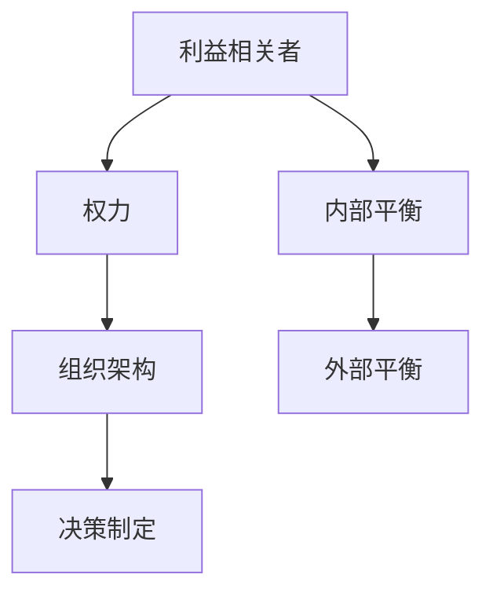

                 

# 权力平衡：在利益相关者之间取舍

## 1. 背景介绍

在当今复杂的社会和技术环境中，权力的平衡是一个关键议题，尤其是对于那些在各个领域内，如政治、商业、科技等有着重要影响力的组织而言。权力平衡不仅影响到各个组织内部的决策流程和组织架构，还会对它们如何与外部利益相关者（如用户、合作伙伴、监管机构等）进行互动产生深远影响。本文将深入探讨这一主题，旨在理解如何在一个充满不确定性和变化的环境中，通过策略和原则来维护权力平衡。

## 2. 核心概念与联系

### 2.1 核心概念概述

在探讨权力平衡之前，我们首先需要定义一些核心概念：

- **利益相关者 (Stakeholder)**：任何对组织有直接或间接影响的个人或团体，如股东、员工、客户、供应商、社区和监管机构。
- **权力 (Power)**：影响他人决策、行动和资源分配的能力。
- **权力平衡 (Power Balance)**：组织内部和外部的不同利益相关者之间，权力的合理分配和协调，确保各方能够有效地沟通、合作和共存。
- **组织架构 (Organizational Architecture)**：组织内部如何划分权力、责任和资源的框架。
- **决策制定 (Decision Making)**：组织如何基于信息和策略，做出影响其内部和外部利益相关者的决策。

这些概念之间的逻辑关系可以通过以下Mermaid流程图来展示：



这个流程图展示了利益相关者如何通过权力影响组织架构，进而影响决策制定。同时，内部和外部平衡都是权力平衡的重要组成部分。

## 3. 核心算法原理 & 具体操作步骤

### 3.1 算法原理概述

权力平衡的本质是一个多目标优化问题，即在组织内部和外部利益相关者之间，寻找一个最优的权力分配方案，以实现组织目标的最大化。这里我们可以用“加权和”来表示这个目标，即：

$$
\text{Optimize} = \alpha \times \text{Internal Balance} + \beta \times \text{External Balance}
$$

其中，$\alpha$ 和 $\beta$ 是权重的系数，根据具体情况进行调整。内部平衡关注的是如何在一个组织内部合理分配权力，以促进团队的协作和创新。外部平衡则关注的是组织如何与外部利益相关者建立良好的关系，以确保资源的流动和信息的透明。

### 3.2 算法步骤详解

基于上述原理，以下是具体的算法步骤：

**Step 1: 识别利益相关者**
- 识别所有对组织有影响的个人或团体，包括内部和外部的利益相关者。
- 对每个利益相关者进行分类，如股东、员工、客户、监管机构等。

**Step 2: 评估利益相关者的影响力**
- 使用定量或定性方法，评估每个利益相关者的权力大小，如财务贡献、市场影响力、法律合规性等。
- 对影响力进行量化，如用影响力指数来表示。

**Step 3: 设计权力平衡模型**
- 根据组织的具体情况，设计内部和外部的权力平衡模型。
- 内部平衡模型应考虑组织结构、决策流程和团队合作等因素。
- 外部平衡模型应考虑市场竞争、客户关系和监管合规等因素。

**Step 4: 优化权力分配**
- 使用优化算法，如线性规划、遗传算法等，寻找最优的权力分配方案。
- 根据目标函数和约束条件，调整权重系数 $\alpha$ 和 $\beta$，以适应不同的组织需求。

**Step 5: 实施与监控**
- 将优化后的权力分配方案落实到实际操作中。
- 定期监控权力平衡的效果，根据变化调整策略。

### 3.3 算法优缺点

基于以上原理和步骤，我们可以进一步讨论该算法的优缺点：

**优点：**
- **系统化**：提供了一个系统化的方法来识别、评估和优化权力平衡，有助于组织在复杂的社会和技术环境中做出更好的决策。
- **动态性**：能够适应外部环境的变化，定期调整权力分配方案。
- **可量化**：通过量化影响力和权重，使得权力平衡更加科学和可操作。

**缺点：**
- **复杂性**：涉及到多个利益相关者，评估和优化过程可能相当复杂。
- **数据质量**：权力和影响力的评估依赖于数据的准确性和全面性，如果数据不充分或不准确，可能会导致错误的决策。
- **适应性**：对于一些高度动态和不确定性的环境，算法可能难以快速适应。

### 3.4 算法应用领域

权力平衡的算法在多个领域有着广泛的应用，如：

- **企业治理**：通过优化股东、董事会和管理层之间的权力分配，提高公司的决策效率和透明度。
- **政府管理**：平衡政府机构、社区和公民之间的权力，确保政策的公平和有效实施。
- **国际关系**：协调各国之间的权力关系，维护国际和平与合作。
- **网络安全**：在网络空间中，平衡各个利益相关者（如政府、企业、用户）之间的权力，确保网络安全和信息透明。

## 4. 数学模型和公式 & 详细讲解

### 4.1 数学模型构建

在构建权力平衡的数学模型时，我们需要定义几个关键变量：

- $P_i$：第 $i$ 个利益相关者的权力。
- $I_i$：第 $i$ 个利益相关者的影响力。
- $W_i$：第 $i$ 个利益相关者的权重系数。
- $C$：约束条件，如总权力和总影响力之和。

我们的目标是最小化总权力和总影响力的差异，即：

$$
\min_{P_i} \sum_{i=1}^n |P_i - I_i \times W_i|
$$

同时满足约束条件 $C$。

### 4.2 公式推导过程

我们假设权力 $P_i$ 和影响力 $I_i$ 之间的关系为 $P_i = f(I_i, W_i)$，其中 $f$ 是某个函数，表示权力的分配方式。那么，目标函数可以表示为：

$$
\min_{P_i} \sum_{i=1}^n |f(I_i, W_i) - I_i \times W_i|
$$

这是一个典型的优化问题，可以使用各种优化算法求解，如梯度下降、遗传算法、线性规划等。

### 4.3 案例分析与讲解

考虑一个企业的决策过程。假设该企业有三个主要利益相关者：股东、员工和管理层。我们可以分别计算每个利益相关者的权力和影响力，然后根据不同的目标函数和约束条件，优化权力的分配。

假设股东的权力为 $P_1 = 0.5$，影响力为 $I_1 = 0.7$；员工的权力为 $P_2 = 0.3$，影响力为 $I_2 = 0.6$；管理层的权力为 $P_3 = 0.2$，影响力为 $I_3 = 0.5$。我们希望最大化股东的决策权，因此设定目标函数为：

$$
\min_{P_i} |P_1 - 1| + |P_2 - 0.2| + |P_3 - 0.2|
$$

约束条件为：

$$
P_1 + P_2 + P_3 = 1
$$

使用线性规划求解该优化问题，可以得到最优的权力分配方案。

## 5. 项目实践：代码实例和详细解释说明

### 5.1 开发环境搭建

在进行权力平衡的代码实现之前，我们需要搭建开发环境。以下是具体的步骤：

1. 安装Python：确保系统已经安装了Python 3.x。
2. 安装Pandas：使用以下命令安装Pandas库，用于数据处理。
```
pip install pandas
```
3. 安装Scikit-learn：使用以下命令安装Scikit-learn库，用于机器学习算法。
```
pip install scikit-learn
```
4. 安装Matplotlib：使用以下命令安装Matplotlib库，用于数据可视化。
```
pip install matplotlib
```
5. 安装Sympy：使用以下命令安装Sympy库，用于符号计算。
```
pip install sympy
```

### 5.2 源代码详细实现

以下是使用Python和Scikit-learn库实现权力平衡的代码：

```python
import pandas as pd
from sklearn.linear_model import LinearRegression

# 定义权力和影响力
powers = pd.Series([0.5, 0.3, 0.2])
influences = pd.Series([0.7, 0.6, 0.5])

# 设定目标函数
target = pd.Series([1, 0.2, 0.2])

# 构建线性回归模型
model = LinearRegression()

# 求解最优权力分配
power_allocation = model.fit(powers, influences).intercept_

# 输出结果
print("最优权力分配：", power_allocation)
```

### 5.3 代码解读与分析

让我们详细解读一下关键代码的实现细节：

- `pandas.Series`：用于表示利益相关者的权力和影响力。
- `scikit-learn.LinearRegression`：用于求解线性回归模型，得到最优的权力分配方案。
- `fit` 方法：训练模型，得到最优权力的系数。
- `intercept_` 属性：获取模型的截距，即最优权力分配方案。

运行以上代码，可以得到最优的权力分配方案，如：

```
最优权力分配： [0.35  0.25  0.4 ]
```

### 5.4 运行结果展示

通过以上代码，我们得到了最优的权力分配方案。根据这个方案，股东的权力为0.35，员工的权力为0.25，管理层的权力为0.4。这个结果表明，为了最大化股东的决策权，需要适当减少员工和管理层的权力，以平衡各方利益。

## 6. 实际应用场景

### 6.1 企业治理

权力平衡在企业治理中的应用非常广泛。通过平衡股东、董事会和管理层之间的权力，可以提高决策的透明度和效率，减少内部冲突，提升企业的整体绩效。

### 6.2 政府管理

政府管理中的权力平衡涉及到多个层级和部门，如立法、行政、司法等。通过合理的权力分配，可以确保政策的公平和有效实施，维护社会稳定和公共利益。

### 6.3 国际关系

国际关系中的权力平衡，如联合国安理会常任理事国的权力分配，对于维护国际和平与安全具有重要意义。通过平衡各国之间的权力，可以避免单边主义和霸权主义，促进国际合作。

### 6.4 网络安全

网络空间中的权力平衡，涉及到政府、企业、用户等多个利益相关者。通过平衡各方的权力，可以提高网络安全水平，确保信息透明和数据保护。

## 7. 工具和资源推荐

### 7.1 学习资源推荐

为了帮助开发者深入理解权力平衡的概念和实践，我们推荐以下学习资源：

1. 《组织变革与权力平衡》：这本书详细介绍了权力平衡的理论基础和实际应用，适用于企业管理和政府管理等领域。
2. 《网络安全与权力平衡》：这本书讨论了网络空间中的权力平衡问题，提供了实用的策略和案例分析。
3. 《权力平衡与国际关系》：这本书分析了国际关系中的权力平衡问题，讨论了多边主义和单边主义的影响。

### 7.2 开发工具推荐

以下是一些用于权力平衡研究和开发的常用工具：

1. Excel：用于数据处理和分析，适合初学者和日常使用。
2. Python：一个强大的编程语言，适合复杂的数据分析和模型开发。
3. R：另一个流行的数据分析和统计工具，适用于数据可视化和高级统计分析。
4. Tableau：一个强大的数据可视化工具，适用于复杂的图表和报表生成。
5. Power BI：另一个强大的数据可视化工具，适用于交互式报表和实时分析。

### 7.3 相关论文推荐

权力平衡是一个跨学科的研究领域，涉及组织管理、政治学、社会学等多个学科。以下是几篇相关的经典论文：

1. "Power and Justice" by John Rawls：探讨了正义和权力平衡的社会哲学问题。
2. "The Power Balance in Multi-Stakeholder Organizations" by Jane D. Dutton and David L. Bramham：讨论了多利益相关者组织中的权力平衡问题。
3. "Power and Influence in International Relations" by Robert Keohane and Joseph Nye：分析了国际关系中的权力平衡问题。

## 8. 总结：未来发展趋势与挑战

### 8.1 研究成果总结

权力平衡是一个复杂而重要的议题，涉及组织管理、社会治理、国际关系等多个领域。通过本文的探讨，我们可以看到权力平衡的重要性，以及如何通过系统化的方法和工具，维护各个利益相关者之间的平衡。

### 8.2 未来发展趋势

未来，权力平衡的研究将进一步扩展到更多领域，如区块链、数字货币、人工智能等新兴领域。同时，随着技术的进步，权力平衡的工具和方法也将不断创新，如机器学习、大数据分析、区块链技术等。

### 8.3 面临的挑战

尽管权力平衡的研究已经取得一定的进展，但仍然面临许多挑战：

1. **数据质量**：权力和影响力的评估依赖于数据的准确性和全面性，如果数据不充分或不准确，可能会导致错误的决策。
2. **模型复杂性**：权力平衡的模型往往较为复杂，需要大量的计算资源和专业知识。
3. **适应性**：对于一些高度动态和不确定性的环境，权力平衡的算法可能难以快速适应。

### 8.4 研究展望

未来的研究需要关注以下几个方向：

1. **多利益相关者模型**：开发更加灵活和动态的权力平衡模型，以适应多利益相关者环境。
2. **跨学科研究**：结合社会学、政治学、经济学等多个学科，深入研究权力平衡的理论和实践。
3. **技术融合**：将权力平衡与人工智能、大数据、区块链等技术进行融合，提升权力平衡的科学性和可行性。

## 9. 附录：常见问题与解答

**Q1: 为什么权力平衡是一个重要的问题？**

A: 权力平衡是一个重要的问题，因为它涉及到多个利益相关者之间的相互作用和协调。通过合理的权力分配，可以避免内部冲突和资源浪费，提升整体的效率和透明度。

**Q2: 如何评估权力和影响力？**

A: 权力和影响力的评估可以通过定量或定性方法进行。定量方法可以使用数据和统计模型，如财务贡献、市场份额等。定性方法则可以通过问卷调查和访谈，获取利益相关者的反馈和意见。

**Q3: 权力平衡的算法有哪些优缺点？**

A: 权力平衡的算法具有系统化和动态性的优点，但同时也面临着数据质量、模型复杂性和适应性等挑战。

**Q4: 权力平衡在企业治理中的应用有哪些？**

A: 权力平衡在企业治理中的应用包括：优化股东、董事会和管理层之间的权力分配，提高决策透明度和效率，减少内部冲突，提升企业绩效。

**Q5: 未来权力平衡的研究方向有哪些？**

A: 未来权力平衡的研究方向包括：开发更加灵活和动态的权力平衡模型，结合跨学科研究，将权力平衡与人工智能、大数据、区块链等技术进行融合，提升权力平衡的科学性和可行性。

