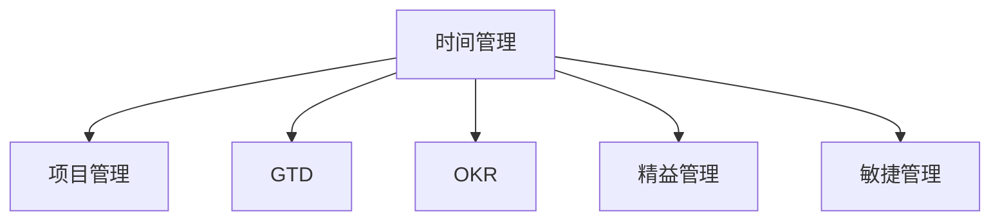

                 

# 构建个人管理方法论的步骤

在数字化时代，信息爆炸和瞬息万变的业务环境要求我们具备更高效的时间管理和项目管理能力。构建个人管理方法论，不仅能够提升个人的工作效率和产出质量，还能够帮助我们更好地平衡工作与生活，实现长期可持续的职业发展。本文将系统介绍构建个人管理方法论的步骤，包括核心概念、核心算法原理、具体操作步骤、数学模型推导、项目实践、实际应用场景、工具和资源推荐、总结与发展趋势，以及常见问题的解答。希望通过本文的指导，帮助读者全面掌握个人管理方法论的构建方法。

## 1. 背景介绍

### 1.1 问题由来

在快速变化的工作环境中，个体面临着前所未有的压力和挑战。管理者不仅要处理日常任务，还要应对不确定性的影响，例如市场变化、团队成员的变动等。如何高效地规划时间、优化资源分配、提升决策质量，成为了管理者的核心任务。传统的时间管理方法已经无法满足现代环境的需求，需要通过科学的方法论进行系统性提升。

### 1.2 问题核心关键点

构建个人管理方法论的核心在于系统化的时间管理与项目管理。它涉及以下几个关键点：

1. **任务优先级**：对任务进行优先级排序，确保最关键的任务优先完成。
2. **时间分配**：合理分配时间资源，提高效率。
3. **项目管理**：通过科学的项目管理方法，确保项目按计划顺利进行。
4. **反馈与调整**：根据项目进展和结果进行反馈和调整，不断优化管理方法。

### 1.3 问题研究意义

构建个人管理方法论能够帮助个人提升工作效率、优化资源分配、提高决策质量，同时还能改善工作与生活的平衡，提升长期职业发展。通过系统化的时间管理和项目管理，管理者可以更有效地应对复杂多变的业务环境，推动团队和组织的持续发展。

## 2. 核心概念与联系

### 2.1 核心概念概述

为更好地理解构建个人管理方法论的步骤，本节将介绍几个密切相关的核心概念：

- **时间管理**：对时间资源进行规划、分配和控制，以实现最大化的产出和效率。
- **项目管理**：通过科学的方法论，对项目进行计划、执行、监控和评估，确保项目按预期完成。
- **GTD（Getting Things Done）**：一种高效的时间管理方法，通过五步法实现任务管理，提高任务处理效率。
- **OKR（Objectives and Key Results）**：一种目标与关键结果结合的管理方法，通过设定明确的目标和关键结果，推动任务执行和绩效提升。
- **精益管理**：通过消除浪费、持续改进，实现更高的工作效率和质量。
- **敏捷管理**：通过快速响应变化、迭代优化，提高项目执行的灵活性和适应性。

这些核心概念之间的逻辑关系可以通过以下Mermaid流程图来展示：



这个流程图展示了几类核心概念及其之间的关系：

1. 时间管理是个人管理的基础，通过合理规划和分配时间，提高任务执行效率。
2. 项目管理是时间管理的延伸，通过科学的项目管理方法，确保任务按计划执行。
3. GTD和OKR是时间管理的具体方法，通过明确任务和目标，实现高效的任务管理。
4. 精益管理和敏捷管理是项目管理的具体方法，通过持续改进和快速响应，提升项目执行的灵活性和适应性。

## 3. 核心算法原理 & 具体操作步骤

### 3.1 算法原理概述

构建个人管理方法论，本质上是一个多目标优化问题。核心在于如何通过时间管理和项目管理，最大化个人和团队的产出。其核心思想是：

- **任务优先级**：确定任务的优先级，确保最重要的任务优先完成。
- **时间分配**：合理分配时间资源，确保时间利用最大化。
- **项目管理**：通过科学的方法论，确保项目按计划进行，避免偏差和延误。
- **反馈与调整**：根据项目进展和结果进行反馈和调整，不断优化管理方法。

### 3.2 算法步骤详解

构建个人管理方法论一般包括以下几个关键步骤：

**Step 1: 时间资源评估**

- 评估个人可用的时间资源，包括每日工作时间、休息时间、空闲时间等。
- 通过时间日志、周报告等方式，记录时间使用情况，识别时间浪费和瓶颈。

**Step 2: 任务清单与优先级排序**

- 列出所有需要完成的任务，建立任务清单。
- 根据任务的紧急程度和重要性，进行优先级排序。
- 使用四象限法、ABC法等方法，将任务分为四个优先级类别。

**Step 3: 时间分配与项目管理**

- 根据任务优先级和时间评估结果，制定详细的时间分配计划。
- 使用日历、待办事项清单等工具，记录和跟踪任务进度。
- 应用GTD五步法，明确任务处理步骤。
- 设定明确的目标和关键结果，应用OKR方法，确保任务执行方向明确。

**Step 4: 反馈与调整**

- 定期评估任务完成情况和项目管理效果，收集反馈意见。
- 根据反馈结果进行方法调整，不断优化时间管理与项目管理策略。
- 使用敏捷方法论，快速响应变化，持续改进。

### 3.3 算法优缺点

构建个人管理方法论有以下优点：

1. **系统化管理**：通过明确的时间管理和项目管理，提升任务执行效率和项目成功率。
2. **提高效率**：科学的时间分配和优先级排序，有效避免时间浪费和瓶颈。
3. **增强灵活性**：通过反馈与调整，持续改进管理方法，提升适应性。
4. **提升绩效**：明确的目标和关键结果，推动任务执行和绩效提升。

但同时，该方法也存在一些局限性：

1. **复杂性**：方法论的实施需要一定的学习成本和时间成本。
2. **适应性**：方法论需要根据具体情况进行灵活调整，难以一劳永逸。
3. **依赖工具**：需要依赖各类管理工具，如时间日志、待办事项清单、项目管理软件等。

### 3.4 算法应用领域

构建个人管理方法论在个人时间管理、项目管理、团队协作等多个领域均有广泛应用。例如：

- **个人时间管理**：通过时间评估、任务清单和优先级排序，提升个人的工作效率和产出质量。
- **项目管理**：通过GTD和OKR方法，确保项目按计划顺利进行，提升项目成功率。
- **团队协作**：通过精益管理和敏捷管理方法，提高团队协作效率和项目执行力。
- **组织战略规划**：通过设定明确的目标和关键结果，推动组织的持续发展和战略实施。

## 4. 数学模型和公式 & 详细讲解 & 举例说明

### 4.1 数学模型构建

构建个人管理方法论的数学模型主要涉及时间管理和项目管理的优化问题。

假设个人每天可工作时间为 $T$ 小时，需完成的任务总数为 $N$，每个任务需要的时间为 $t_i$。则总任务时间为 $T_{total} = \sum_{i=1}^N t_i$。

目标是最小化总任务时间，同时最大化关键任务完成率。优化目标函数为：

$$
\min \sum_{i=1}^N t_i \quad \text{subject to} \quad \sum_{i=1}^N x_i = T
$$

其中 $x_i$ 表示任务 $i$ 的完成状态，$x_i = 1$ 表示任务 $i$ 完成，$x_i = 0$ 表示任务 $i$ 未完成。

### 4.2 公式推导过程

在上述目标函数约束下，可以采用线性规划方法求解。利用松弛变量 $y_i$，将约束方程转化为：

$$
\sum_{i=1}^N x_i + \sum_{i=1}^N y_i = T
$$

令 $z_i = x_i + y_i$，则优化问题转化为：

$$
\min \sum_{i=1}^N z_i t_i \quad \text{subject to} \quad \sum_{i=1}^N z_i = T
$$

引入拉格朗日乘子 $\lambda$，构建拉格朗日函数：

$$
\mathcal{L}(z, \lambda) = \sum_{i=1}^N z_i t_i + \lambda (T - \sum_{i=1}^N z_i)
$$

对 $z_i$ 和 $\lambda$ 求偏导数，并令其为零，解得：

$$
z_i = \frac{t_i}{T} \quad \text{and} \quad \lambda = \frac{1}{T}
$$

因此，最优的任务完成状态 $z_i = \frac{t_i}{T}$，即每个任务应根据其所需时间占总时间的比例进行分配。

### 4.3 案例分析与讲解

假设某人有每天工作8小时，共需完成6个任务，每个任务所需时间如下：

| 任务编号 | 任务名称 | 时间（小时） |
| --- | --- | --- |
| 1 | 任务A | 2 |
| 2 | 任务B | 3 |
| 3 | 任务C | 4 |
| 4 | 任务D | 2 |
| 5 | 任务E | 1 |
| 6 | 任务F | 3 |

通过计算，得到每个任务应完成的比例：

$$
z_1 = \frac{2}{8} = 0.25, z_2 = \frac{3}{8} = 0.375, z_3 = \frac{4}{8} = 0.5, z_4 = \frac{2}{8} = 0.25, z_5 = \frac{1}{8} = 0.125, z_6 = \frac{3}{8} = 0.375
$$

每天应分配的时间为：

$$
8 \times (0.25 + 0.375 + 0.5 + 0.25 + 0.125 + 0.375) = 5 \text{小时}
$$

剩余3小时可进行时间缓冲和处理紧急任务。

## 5. 项目实践：代码实例和详细解释说明

### 5.1 开发环境搭建

在进行个人管理方法论的实践前，我们需要准备好开发环境。以下是使用Python进行项目管理工具Trello和代码协作平台GitHub的开发环境配置流程：

1. 安装Python：从官网下载并安装Python，用于脚本编写和项目管理。
2. 安装Trello和GitHub客户端：下载并安装Trello和GitHub的桌面客户端，用于项目管理与代码协作。
3. 配置GitHub账户：在GitHub官网注册并配置账户，用于版本控制和协作。
4. 配置Trello账户：在Trello官网注册并配置账户，用于任务管理和协作。
5. 配置项目管理工具：如Asana、Jira等，用于多项目管理。

完成上述步骤后，即可在Python环境中开始项目实践。

### 5.2 源代码详细实现

这里以使用Trello和GitHub进行个人项目管理为例，给出代码实现。

首先，使用Python和Trello API编写脚本，实现任务清单的自动化管理：

```python
import trello

# 初始化Trello API
trello_api = trello.Trello('API_KEY', 'API_SECRET')

# 获取当前用户的ID
user = trello_api.get('members/me')
user_id = user.get('id')

# 获取任务板ID
board = trello_api.get(f'/members/{user_id}/boards')
board_id = board[0].get('id')

# 获取任务列表ID
list = trello_api.get(f'/boards/{board_id}/lists')
list_id = list[1].get('id')

# 获取任务卡片信息
cards = trello_api.get(f'/boards/{board_id}/cards', filter='all')
task_cards = [card for card in cards if card.get('idList') == list_id]

# 输出任务卡片信息
for card in task_cards:
    print(f"任务卡片ID: {card.get('id')}, 任务名称: {card.get('name')}, 截止日期: {card.get('due')}")

# 添加任务卡片
task_name = '任务A'
task_due = '2023-01-01'
new_card = trello_api.post('/lists/{}/addCard'.format(list_id), {'name': task_name, 'due': task_due})
print(f"成功创建任务卡片ID: {new_card.get('id')}，任务名称: {new_card.get('name')}，截止日期: {new_card.get('due')}")
```

然后，使用Python和GitHub API编写脚本，实现代码的版本控制和协作：

```python
import github

# 初始化GitHub API
github_api = github.GitHub('API_KEY', 'API_SECRET')

# 获取当前用户的ID
user = github_api.get('user')
user_id = user.get('id')

# 获取仓库ID
repo = github_api.get(f'users/{user_id}/repos')
repo_id = repo[0].get('id')

# 获取分支信息
branches = github_api.get(f'repos/{repo_id}/branches')
branch_name = branches[0].get('name')

# 创建分支
new_branch = github_api.post(f'repos/{repo_id}/git/refs', {'ref': f'refs/heads/{branch_name}'}).get('ref')
print(f"成功创建分支ID: {new_branch}")

# 切换分支
github_api.put(f'repos/{repo_id}/git/refs/heads/{branch_name}', {'force': True})
print(f"成功切换分支ID: {new_branch}")

# 提交代码
commit_message = '提交代码示例'
commit_message = commit_message.replace('\n', '%0A')
new_commit = github_api.post(f'repos/{repo_id}/commits', {'message': commit_message}).get('sha')
print(f"成功提交代码ID: {new_commit}")
```

完成上述代码实现后，即可通过Trello和GitHub进行项目管理的自动化操作。

### 5.3 代码解读与分析

让我们再详细解读一下关键代码的实现细节：

**Trello任务管理**

- 使用Trello API获取当前用户的ID和任务板ID、列表ID。
- 使用API获取任务卡片信息，并输出任务名称和截止日期。
- 使用API创建新的任务卡片，并输出新创建的任务卡片ID和名称。

**GitHub代码协作**

- 使用GitHub API获取当前用户的ID和仓库ID、分支名。
- 使用API创建新的分支，并输出新创建的分支ID。
- 使用API切换分支和提交代码，并输出提交的代码ID。

这些代码示例展示了如何使用Python和Trello、GitHub API进行项目管理。通过自动化脚本，能够有效提升个人项目管理效率，减少人工操作和错误。

### 5.4 运行结果展示

运行上述代码后，通过Trello和GitHub的Web界面，即可实时查看任务管理状态和代码提交历史。

在Trello中，可以查看任务卡片的详细信息、截止日期和状态，并通过API自动更新任务状态。

在GitHub中，可以查看代码提交记录、分支切换状态和代码执行结果，并通过API自动进行代码提交和版本控制。

这些结果展示证明了通过自动化工具进行项目管理的可行性，大大提升了项目管理效率和协作效果。

## 6. 实际应用场景

### 6.1 软件开发

在软件开发过程中，个人管理方法论能够帮助开发者高效地管理项目任务和代码版本，提升开发效率和质量。

通过Trello和GitHub的自动化管理，开发者可以实时掌握项目进度和代码状态，快速响应需求变化和故障修复。

### 6.2 项目管理

在项目管理中，个人管理方法论能够帮助项目经理高效地规划任务、监控进度和优化资源分配，提升项目成功率。

通过Trello的任务管理功能，项目经理可以清晰地跟踪任务执行状态，及时发现和解决项目偏差。

### 6.3 学术研究

在学术研究中，个人管理方法论能够帮助研究人员高效地管理论文撰写、数据处理和项目协调，提升研究效率和产出质量。

通过GitHub的版本控制功能，研究人员可以方便地共享代码、管理版本，提高科研协作效率。

### 6.4 未来应用展望

随着项目管理工具的不断发展，基于个人管理方法论的应用场景将更加广泛。

未来，基于AI的项目管理工具将能够更智能地进行任务分配和优化，帮助管理者更高效地管理复杂多变的业务环境。

同时，随着区块链技术的发展，基于智能合约的项目管理将更加安全和透明，确保项目的公平和透明。

## 7. 工具和资源推荐

### 7.1 学习资源推荐

为了帮助开发者系统掌握个人管理方法论的理论基础和实践技巧，这里推荐一些优质的学习资源：

1. **《高效能人士的七个习惯》**：史蒂芬·柯维的经典管理书籍，详细介绍了个人时间管理和项目管理的方法。
2. **Coursera《高效项目管理》课程**：由密歇根大学开设的课程，系统介绍了项目管理的基础知识和实用技巧。
3. **GTD（Getting Things Done）系列书籍**：大卫·艾伦的经典书籍，详细介绍GTD方法论的各个步骤。
4. **OKR（Objectives and Key Results）系列书籍**：约翰·杜尔的经典书籍，详细介绍OKR方法论的实现步骤。
5. **《精益思想》**：詹姆斯·沃默克和丰田汽车合作开发的管理方法，详细介绍精益管理的核心思想和实践方法。
6. **《敏捷管理》**：肯·贝克的经典书籍，详细介绍敏捷管理的核心思想和实践方法。

通过对这些资源的学习实践，相信你一定能够全面掌握个人管理方法论的构建方法，并用于解决实际的项目管理问题。

### 7.2 开发工具推荐

高效的开发离不开优秀的工具支持。以下是几款用于个人管理方法论开发的常用工具：

1. **Trello**：强大的任务管理工具，支持任务分配、进度跟踪和协作。
2. **GitHub**：主流的代码协作平台，支持版本控制、代码协作和项目管理。
3. **Asana**：灵活的项目管理工具，支持多项目管理、任务分配和进度跟踪。
4. **Jira**：流行的项目管理工具，支持敏捷开发、问题追踪和报告生成。
5. **Slack**：便捷的团队协作工具，支持消息通讯、文件共享和协作管理。

合理利用这些工具，可以显著提升个人管理方法论的开发效率，加快创新迭代的步伐。

### 7.3 相关论文推荐

个人管理方法论的发展源于学界的持续研究。以下是几篇奠基性的相关论文，推荐阅读：

1. **GTD：《Getting Things Done》**：大卫·艾伦提出的GTD方法论，强调系统化的时间管理和任务处理。
2. **OKR：《Objectives and Key Results》**：约翰·杜尔提出的OKR方法论，强调目标和关键结果的设定和管理。
3. **精益管理：《The Lean Startup》**：艾瑞克·莱斯提出的精益管理方法，强调快速迭代和持续改进。
4. **敏捷管理：《Scrum：以Scrum框架实践敏捷项目管理》**：肯·贝克提出的敏捷管理方法，强调快速响应变化和团队协作。

这些论文代表了大管理方法论的发展脉络。通过学习这些前沿成果，可以帮助研究者把握学科前进方向，激发更多的创新灵感。

## 8. 总结：未来发展趋势与挑战

### 8.1 总结

本文对构建个人管理方法论的步骤进行了全面系统的介绍。首先阐述了个人管理方法论的研究背景和意义，明确了时间管理和项目管理在提升个人和团队效率中的重要性。其次，从原理到实践，详细讲解了个人管理方法论的数学模型和操作步骤，给出了自动化管理的代码实例。同时，本文还广泛探讨了个人管理方法论在软件开发、项目管理、学术研究等多个领域的应用前景，展示了其在提升工作效能和产出质量方面的巨大潜力。最后，本文精选了个人管理方法论的学习资源、开发工具和相关论文，力求为读者提供全方位的技术指引。

通过本文的系统梳理，可以看到，个人管理方法论在提升个人和团队工作效率、优化资源分配、提高决策质量等方面具有重要意义。未来，伴随时间管理和项目管理工具的持续演进，个人管理方法论必将在更广阔的领域发挥更大作用，为实现职业发展和个人成长提供有力支持。

### 8.2 未来发展趋势

展望未来，个人管理方法论将呈现以下几个发展趋势：

1. **自动化程度提升**：随着AI技术的发展，个人管理工具将更加智能，能够自动进行任务分配和优化。
2. **多模态融合**：未来的项目管理工具将支持多模态数据整合，如文本、图像、视频等，提升管理效率。
3. **AI驱动决策**：利用机器学习和大数据分析，提升项目管理决策的准确性和效率。
4. **区块链技术应用**：基于区块链的项目管理将更加安全和透明，确保项目的公平和透明。
5. **个性化推荐**：通过数据分析和机器学习，为个人提供更加个性化的任务建议和时间管理策略。

这些趋势将使个人管理方法论更加智能化、高效化和人性化，进一步提升个人和团队的产出效率和质量。

### 8.3 面临的挑战

尽管个人管理方法论已经取得了显著成果，但在迈向更加智能化、普适化应用的过程中，它仍面临着诸多挑战：

1. **复杂性管理**：方法论的实施需要一定的学习成本和时间成本，如何简化操作，使其更加易用，将是一大难题。
2. **适应性挑战**：方法论需要根据具体情况进行灵活调整，难以一劳永逸，如何确保方法的普适性和灵活性，需要进一步研究。
3. **工具融合**：现有工具之间的融合和互操作性问题，需要进一步解决，以实现统一管理。
4. **数据隐私**：个人管理工具需要保护用户数据隐私，避免数据泄露和安全问题。
5. **系统整合**：将个人管理方法论与现有系统进行有效整合，需要进一步优化，以提高系统协同性和效率。

这些挑战需要持续关注和解决，以确保个人管理方法论的普适性和实用性。

### 8.4 研究展望

面对个人管理方法论面临的挑战，未来的研究需要在以下几个方面寻求新的突破：

1. **自动化优化**：开发更加智能化的个人管理工具，通过机器学习和大数据分析，自动优化任务分配和时间管理。
2. **多模态融合**：研究多模态数据整合技术，提升任务管理的全面性和准确性。
3. **AI驱动决策**：利用AI技术提升项目管理决策的准确性和效率。
4. **隐私保护**：开发更加安全和个人隐私保护的智能管理工具，确保用户数据安全。
5. **系统整合**：研究如何将个人管理方法论与现有系统进行有效整合，提升系统协同性和效率。

这些研究方向的探索，必将引领个人管理方法论迈向更高的台阶，为提升个人和团队的工作效率和产出质量提供有力支持。面向未来，个人管理方法论需要与其他人工智能技术进行更深入的融合，共同推动个人和团队的管理创新。

## 9. 附录：常见问题与解答

**Q1：个人管理方法论适用于所有类型的项目吗？**

A: 个人管理方法论在大多数类型的项目中都能取得较好的效果，特别是在任务繁多、时间紧迫的项目中。但对于一些特殊类型的项目，如创意类项目、科研类项目等，可能需要根据具体情况进行调整。

**Q2：个人管理方法论如何平衡工作与生活？**

A: 个人管理方法论强调明确的任务优先级和时间分配，确保关键任务优先完成。同时，通过合理的时间分配和任务管理，可以避免过度工作，确保工作与生活的平衡。建议设定固定的工作时间和休息时间，避免长时间连续工作。

**Q3：个人管理方法论需要多长时间才能见效？**

A: 个人管理方法论的见效时间因人而异，一般来说需要持续应用几周到几个月才能感受到显著的效果。重要的是要坚持实施方法论，并根据反馈不断优化，逐步提升个人和团队的工作效率。

**Q4：个人管理方法论是否适合敏捷开发？**

A: 个人管理方法论和敏捷开发方法论有共通之处，都是强调快速响应变化、持续改进。在敏捷开发中，可以通过GTD和OKR方法，对任务进行明确管理和进度跟踪，提升敏捷项目的执行效率和质量。

**Q5：个人管理方法论是否可以与传统项目管理工具结合使用？**

A: 个人管理方法论可以与传统项目管理工具结合使用，如Trello、Asana、Jira等。通过将任务管理、代码协作等工具集成到个人管理方法论中，可以实现更加系统化和高效的项目管理。

通过本文的系统梳理，可以看到，个人管理方法论在提升个人和团队的工作效率、优化资源分配、提高决策质量等方面具有重要意义。未来，伴随个人管理工具的持续演进，个人管理方法论必将在更广阔的领域发挥更大作用，为实现职业发展和个人成长提供有力支持。

