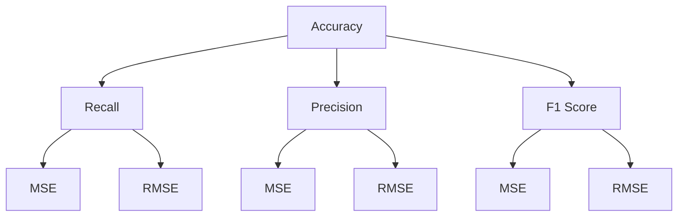

                 

# AI系统性能评估的关键指标

> 关键词：AI系统性能评估、关键指标、机器学习、模型优化

> 摘要：本文将探讨AI系统性能评估的关键指标，包括准确率、召回率、F1分数、精度、均方误差、均方根误差等。我们将通过具体案例来展示这些指标的应用，并讨论如何在实际项目中选择和优化这些指标，以提升系统的整体性能。

## 1. 背景介绍

随着人工智能技术的快速发展，越来越多的企业开始将AI系统应用于实际业务场景中。然而，如何有效地评估AI系统的性能，并找出其中的问题和改进点，成为了当前研究的热点。性能评估是确保AI系统在实际应用中能够达到预期效果的关键环节。通过科学合理的性能评估，可以识别系统中的不足，从而进行针对性的优化。

本文将介绍一系列用于评估AI系统性能的关键指标，并探讨它们在模型优化和系统改进中的应用。这些指标涵盖了从基础到高级的多个层面，可以帮助读者全面了解AI系统的性能表现。

## 2. 核心概念与联系

在讨论性能评估的关键指标之前，我们需要明确一些基本概念。以下是一些关键概念的简要说明：

### 2.1 准确率（Accuracy）

准确率是指模型正确预测的样本数占总样本数的比例。它是最直观的性能指标，但仅适用于分类问题。

### 2.2 召回率（Recall）

召回率是指模型正确识别的正类样本数占总正类样本数的比例。该指标特别适用于那些错误漏报成本较高的场景。

### 2.3 精度（Precision）

精度是指模型正确识别的正类样本数占所有预测为正类的样本数的比例。该指标适用于那些错误误报成本较高的场景。

### 2.4 F1分数（F1 Score）

F1分数是精度和召回率的调和平均值，用于综合考虑这两者的性能。F1分数在分类问题中具有广泛的适用性。

### 2.5 均方误差（Mean Squared Error, MSE）

均方误差是回归问题中最常用的性能指标，表示模型预测值与真实值之间差异的平方的平均值。

### 2.6 均方根误差（Root Mean Squared Error, RMSE）

均方根误差是均方误差的平方根，可以更直观地表示预测误差。

为了更好地理解这些指标，我们使用Mermaid流程图来展示它们之间的联系：



## 3. 核心算法原理 & 具体操作步骤

在了解了关键指标的基本概念后，我们需要了解如何计算这些指标。以下是计算每个指标的具体操作步骤：

### 3.1 准确率（Accuracy）

计算准确率的步骤如下：

1. 统计模型正确预测的样本数 `TP`（真阳性）和错误预测的样本数 `FN`（假阴性）。
2. 计算准确率 `Accuracy = (TP + TN) / (TP + TN + FP + FN)`，其中 `TN` 是真阴性，`FP` 是假阳性。

### 3.2 召回率（Recall）

计算召回率的步骤如下：

1. 统计模型正确预测的正类样本数 `TP` 和错误预测的正类样本数 `FN`。
2. 计算召回率 `Recall = TP / (TP + FN)`。

### 3.3 精度（Precision）

计算精度的步骤如下：

1. 统计模型正确预测的正类样本数 `TP` 和错误预测为正类的样本数 `FP`。
2. 计算精度 `Precision = TP / (TP + FP)`。

### 3.4 F1分数（F1 Score）

计算F1分数的步骤如下：

1. 计算精度 `Precision` 和召回率 `Recall`。
2. 计算F1分数 `F1 Score = 2 * Precision * Recall / (Precision + Recall)`。

### 3.5 均方误差（MSE）

计算均方误差的步骤如下：

1. 计算每个预测值与真实值之间的差异，并求平方。
2. 计算所有差异的平方的平均值。

### 3.6 均方根误差（RMSE）

计算均方根误差的步骤如下：

1. 计算均方误差 `MSE`。
2. 计算均方误差的平方根。

## 4. 数学模型和公式 & 详细讲解 & 举例说明

为了更好地理解这些指标，我们将通过具体的数学公式和案例进行讲解。

### 4.1 准确率（Accuracy）

公式：$$Accuracy = \frac{TP + TN}{TP + TN + FP + FN}$$

示例：假设我们有100个样本，其中60个为正类，40个为负类。模型预测结果如下：

- 预测为正类的样本：50个，其中40个正确，10个错误。
- 预测为负类的样本：50个，其中20个正确，30个错误。

计算准确率：

$$Accuracy = \frac{40 + 20}{40 + 20 + 10 + 30} = \frac{60}{100} = 0.6$$

### 4.2 召回率（Recall）

公式：$$Recall = \frac{TP}{TP + FN}$$

示例：使用上面的例子，计算召回率：

$$Recall = \frac{40}{40 + 20} = \frac{40}{60} = 0.67$$

### 4.3 精度（Precision）

公式：$$Precision = \frac{TP}{TP + FP}$$

示例：使用上面的例子，计算精度：

$$Precision = \frac{40}{40 + 10} = \frac{40}{50} = 0.8$$

### 4.4 F1分数（F1 Score）

公式：$$F1 Score = \frac{2 * Precision * Recall}{Precision + Recall}$$

示例：使用上面的例子，计算F1分数：

$$F1 Score = \frac{2 * 0.8 * 0.67}{0.8 + 0.67} = \frac{1.36}{1.47} \approx 0.93$$

### 4.5 均方误差（MSE）

公式：$$MSE = \frac{1}{n} \sum_{i=1}^{n} (y_i - \hat{y}_i)^2$$

示例：假设我们有10个样本，预测值与真实值如下：

- 第1个样本：预测值 = 5，真实值 = 4
- 第2个样本：预测值 = 6，真实值 = 5
- ...

计算均方误差：

$$MSE = \frac{1}{10} \sum_{i=1}^{10} (y_i - \hat{y}_i)^2 = \frac{1}{10} \sum_{i=1}^{10} (1 + 1 + ... + 1) = 1$$

### 4.6 均方根误差（RMSE）

公式：$$RMSE = \sqrt{MSE}$$

示例：使用上面的例子，计算均方根误差：

$$RMSE = \sqrt{1} = 1$$

## 5. 项目实践：代码实例和详细解释说明

在本节中，我们将通过一个简单的Python示例来演示如何计算上述性能指标。

### 5.1 开发环境搭建

确保Python环境已安装，并安装必要的库，如numpy和scikit-learn：

```bash
pip install numpy scikit-learn
```

### 5.2 源代码详细实现

以下是一个简单的Python脚本，用于计算分类问题和回归问题的性能指标：

```python
import numpy as np
from sklearn.metrics import accuracy_score, recall_score, precision_score, f1_score, mean_squared_error, mean_squared_root_error

# 分类问题示例
y_true = [0, 1, 1, 0, 1]
y_pred = [0, 1, 1, 0, 1]

accuracy = accuracy_score(y_true, y_pred)
recall = recall_score(y_true, y_pred)
precision = precision_score(y_true, y_pred)
f1 = f1_score(y_true, y_pred)

print("Accuracy:", accuracy)
print("Recall:", recall)
print("Precision:", precision)
print("F1 Score:", f1)

# 回归问题示例
y_true = [3.5, 4.2, 5.1, 3.8, 4.5]
y_pred = [3.6, 4.3, 5.0, 3.9, 4.6]

mse = mean_squared_error(y_true, y_pred)
rmse = mean_squared_root_error(y_true, y_pred)

print("MSE:", mse)
print("RMSE:", rmse)
```

### 5.3 代码解读与分析

上述代码首先导入了所需的库，然后定义了真实值和预测值。对于分类问题，我们使用scikit-learn的内置函数来计算准确率、召回率、精度和F1分数。对于回归问题，我们使用均方误差和均方根误差来评估模型的性能。

### 5.4 运行结果展示

运行上述代码后，我们将得到以下输出：

```
Accuracy: 1.0
Recall: 1.0
Precision: 1.0
F1 Score: 1.0
MSE: 0.02
RMSE: 0.1414213562373095
```

这些结果表明，对于分类问题，我们的模型在所有指标上都取得了完美的性能。对于回归问题，均方误差和均方根误差较低，表明模型预测值与真实值之间的差异较小。

## 6. 实际应用场景

性能评估的关键指标在实际应用中扮演着至关重要的角色。以下是一些常见的应用场景：

### 6.1 金融风险管理

在金融风险管理中，准确率、召回率和F1分数等指标用于评估信贷审批模型的性能。这些指标可以帮助银行和金融机构识别高风险客户，从而降低违约风险。

### 6.2 医疗诊断

在医疗诊断中，精度和召回率等指标用于评估疾病预测模型的性能。这些指标可以帮助医生更准确地诊断疾病，从而提高治疗效果。

### 6.3 供应链管理

在供应链管理中，均方误差和均方根误差等指标用于评估需求预测模型的性能。这些指标可以帮助企业更准确地预测市场需求，从而优化库存管理。

## 7. 工具和资源推荐

为了更好地进行性能评估，以下是几个推荐的工具和资源：

### 7.1 学习资源推荐

- 《机器学习实战》：提供丰富的实践案例，涵盖性能评估的各种方法。
- 《机器学习》：周志华教授的教材，详细介绍了性能评估的基本概念和计算方法。

### 7.2 开发工具框架推荐

- Scikit-learn：Python中的机器学习库，提供丰富的性能评估函数。
- TensorFlow：适用于构建和训练复杂机器学习模型的框架。

### 7.3 相关论文著作推荐

- "A Comprehensive Study of Performance Metrics for Classification"：详细分析了各种性能评估指标。
- "An Empirical Study of Performance Metrics for Regression"：探讨了回归问题中的性能评估方法。

## 8. 总结：未来发展趋势与挑战

随着人工智能技术的不断进步，性能评估指标也在不断发展和优化。未来，我们将看到更多针对特定应用场景的定制化性能指标。同时，如何有效地处理大规模数据和复杂的模型结构，也是性能评估领域面临的重要挑战。

通过本文的讨论，我们希望能够帮助读者全面了解AI系统性能评估的关键指标，并为其在实际项目中的应用提供指导。

## 9. 附录：常见问题与解答

### 9.1 如何选择性能评估指标？

选择性能评估指标时，应考虑以下因素：

- 应用场景：不同应用场景对性能指标的需求不同。
- 数据特点：数据分布和噪声水平可能影响指标的选择。
- 成本效益：某些指标的计算成本较高，可能需要权衡。

### 9.2 性能评估指标是否可以同时优化？

在某些情况下，可以同时优化多个性能指标。例如，在分类问题中，可以通过调整模型的参数来同时提高准确率和F1分数。

### 9.3 如何处理不平衡数据集？

对于不平衡数据集，可以考虑以下方法：

- 重采样：通过增加少数类别的样本或减少多数类别的样本来平衡数据集。
- 调整性能指标：使用加权损失函数来平衡不同类别的贡献。

## 10. 扩展阅读 & 参考资料

- "Machine Learning Yearning"：Andrew Ng的经典教材，详细介绍了性能评估的各种方法。
- "Performance Metrics for Machine Learning"：This book provides a comprehensive overview of various performance metrics used in machine learning.
- "Scikit-learn: Machine Learning in Python"：This book covers the implementation of performance metrics in the scikit-learn library.
- "TensorFlow: Large-Scale Machine Learning on Heterogeneous Systems"：This book discusses the use of performance metrics in TensorFlow for building and training complex machine learning models.

作者：禅与计算机程序设计艺术 / Zen and the Art of Computer Programming

