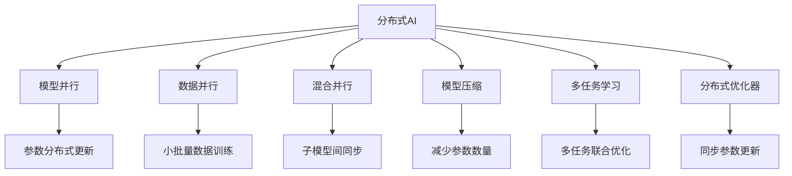

                 

# 模型并行vs数据并行：分布式AI训练策略

> 关键词：分布式AI,模型并行,数据并行,混合并行,模型压缩,多任务学习,分布式优化器

## 1. 背景介绍

### 1.1 问题由来

在深度学习模型日益复杂化的今天，单一GPU或TPU已难以满足大规模深度学习模型的训练需求。为了提升模型训练速度，加速模型迭代周期，分布式训练技术成为当下AI领域研究的热点。

分布式训练的主要策略有模型并行、数据并行和混合并行等。其中，模型并行通过将模型分解成多个子模型并行训练，显著降低了单节点计算需求，但带来通信开销和模型难度提升的挑战。数据并行通过数据平分并行训练多个小批量，减轻了单节点内存压力，但面临着数据传输瓶颈和参数复杂度增加的问题。

为应对上述挑战，本文将深入探讨模型并行与数据并行的工作原理和应用场景，并结合最新的分布式AI实践，介绍混合并行和多任务学习的策略，探讨未来分布式AI训练的发展趋势。

## 2. 核心概念与联系

### 2.1 核心概念概述

1. **分布式AI**：在多台计算机或集群上，通过网络通信协作完成深度学习模型的分布式训练。
2. **模型并行**：将大型深度学习模型分解成多个子模型，并行分布在多个计算节点上同时训练。
3. **数据并行**：将大规模数据集分成多个小批量，并行在多个计算节点上分别训练，然后将结果合并。
4. **混合并行**：结合模型并行和数据并行，提升数据并行性能的同时，降低模型并行复杂度。
5. **模型压缩**：通过剪枝、量化、蒸馏等方法，减少模型参数数量和计算需求。
6. **多任务学习**：在一个训练过程中同时学习多个相关任务，提升模型泛化能力和资源利用效率。
7. **分布式优化器**：通过优化器在多个节点间同步更新参数，提升模型收敛速度和稳定性。

这些概念之间的关系可以通过以下Mermaid流程图进行展示：



### 2.2 核心概念原理和架构

#### 模型并行
- **原理**：将大模型分割为多个子模型，每个子模型在独立节点上训练。需要考虑模型间通信、参数同步等问题。
- **架构**：每个子模型拥有部分模型参数和计算资源，通过通信网络（如RDMA）实现模型间参数更新。

#### 数据并行
- **原理**：将数据集分割为多个小批量，并在多个节点上并行训练。每个节点负责一部分数据的计算，减少内存消耗和通信开销。
- **架构**：每个节点拥有部分数据和计算资源，通过网络通信将结果汇总。

#### 混合并行
- **原理**：结合模型并行和数据并行，提升数据并行性能的同时，降低模型并行复杂度。
- **架构**：在数据并行的基础上，进一步将模型分割为多个子模型，分别在多个节点上进行分布式训练。

#### 模型压缩
- **原理**：通过剪枝、量化、蒸馏等方法，减少模型参数数量和计算需求。
- **架构**：在模型分割的基础上，进一步对子模型进行参数压缩，减少通信和计算开销。

#### 多任务学习
- **原理**：在一个训练过程中同时学习多个相关任务，提升模型泛化能力和资源利用效率。
- **架构**：在模型并行的基础上，增加多个子任务，共享部分计算资源和参数更新。

#### 分布式优化器
- **原理**：通过优化器在多个节点间同步更新参数，提升模型收敛速度和稳定性。
- **架构**：在数据并行的基础上，进一步使用分布式优化器（如GossipOpt）同步更新多个节点上的参数。

## 3. 核心算法原理 & 具体操作步骤

### 3.1 算法原理概述

分布式训练的算法原理主要涉及以下几个方面：

- **模型并行**：将模型参数分布在不同节点上，分别训练并更新。
- **数据并行**：将数据集分割成多个小批量，并在不同节点上并行训练，最后汇总结果。
- **混合并行**：结合模型并行和数据并行，提升数据并行性能的同时，降低模型并行复杂度。
- **模型压缩**：通过剪枝、量化等方法减少模型参数，提升训练效率。
- **多任务学习**：在同一个训练过程中同时优化多个相关任务，提升模型泛化能力。
- **分布式优化器**：同步更新多个节点上的模型参数，加速收敛。

### 3.2 算法步骤详解

**模型并行算法步骤**：

1. 将大模型分割成多个子模型，每个子模型包含部分模型参数。
2. 在每个节点上训练对应的子模型，通过通信网络进行参数更新。
3. 定期将各节点上的参数进行合并，得到完整的模型参数。

**数据并行算法步骤**：

1. 将数据集分割成多个小批量，每个小批量在多个节点上并行训练。
2. 各节点计算完本小批量的梯度后，通过通信网络汇总梯度。
3. 汇总后的梯度反向传播到所有节点，更新模型参数。

**混合并行算法步骤**：

1. 在数据并行的基础上，进一步将模型分割成多个子模型。
2. 每个节点训练部分子模型，通过通信网络更新参数。
3. 将各节点的参数进行合并，更新全局模型参数。

**模型压缩算法步骤**：

1. 对模型进行剪枝、量化等压缩操作，减少模型参数数量。
2. 在压缩后的模型上执行分布式训练，提升训练效率。

**多任务学习算法步骤**：

1. 定义多个相关任务，将数据集分割成多个子集。
2. 在每个子集上训练多个子模型，共享部分计算资源和参数更新。
3. 定期将各子模型的参数进行合并，得到全局模型参数。

**分布式优化器算法步骤**：

1. 在每个节点上分别计算梯度。
2. 使用分布式优化器（如GossipOpt）同步更新各节点上的参数。
3. 周期性检查模型性能，调整学习率等超参数。

### 3.3 算法优缺点

**模型并行**的优点：

- 显著降低单节点计算需求，适应大模型训练。
- 模型并行对数据分布要求较低。

**模型并行**的缺点：

- 模型分解和参数同步复杂度较高。
- 通信开销和同步时间增加。

**数据并行**的优点：

- 减轻单节点内存压力，提升并行性能。
- 实现简单，适用于小批量数据。

**数据并行**的缺点：

- 数据传输瓶颈限制性能提升。
- 参数复杂度增加，内存消耗较大。

**混合并行**的优点：

- 结合模型并行和数据并行，性能提升显著。
- 降低模型并行复杂度，减少通信开销。

**混合并行**的缺点：

- 参数同步和通信网络复杂度增加。
- 系统设计和管理难度提高。

**模型压缩**的优点：

- 减少模型参数和计算需求，提升训练效率。
- 压缩后的模型易于分布式训练。

**模型压缩**的缺点：

- 压缩操作可能影响模型性能。
- 压缩算法需要不断优化和调整。

**多任务学习**的优点：

- 提升模型泛化能力和资源利用效率。
- 在多个相关任务上协同优化。

**多任务学习**的缺点：

- 多任务学习目标一致性要求高。
- 模型设计和管理复杂度增加。

**分布式优化器**的优点：

- 同步更新参数，提升模型收敛速度。
- 优化器可灵活选择和配置。

**分布式优化器**的缺点：

- 同步更新增加通信开销。
- 同步算法需要精心设计和调试。

### 3.4 算法应用领域

**模型并行**和**数据并行**在以下领域均有广泛应用：

- **大规模深度学习模型**：如BERT、GPT等大模型，需要进行分布式训练。
- **计算机视觉**：在训练大规模图像分类、目标检测等模型时，需要进行分布式训练。
- **自然语言处理**：在训练大规模语言模型和机器翻译模型时，需要进行分布式训练。

**混合并行**主要用于以下场景：

- **分布式深度学习平台**：如Apache Spark MLlib、TensorFlow等，提供混合并行支持。
- **大规模科学计算**：如天气预测、金融建模等，需要进行大规模模型训练。

**模型压缩**主要应用于以下场景：

- **资源受限设备**：如嵌入式设备、移动设备等，需要压缩模型进行高效训练。
- **边缘计算**：在资源有限的边缘节点上进行模型压缩和分布式训练。

**多任务学习**主要应用于以下场景：

- **多标签分类**：在同一个训练过程中学习多个相关标签。
- **多模态学习**：结合图像、文本等多种模态数据进行联合训练。

**分布式优化器**主要应用于以下场景：

- **大规模分布式训练**：如Google的TPU集群，需要分布式优化器同步参数。
- **超大规模数据集**：如大规模图像、语音数据集，需要分布式优化器提升训练速度。

## 4. 数学模型和公式 & 详细讲解 & 举例说明

### 4.1 数学模型构建

#### 模型并行

- **参数分布**：将模型参数 $W$ 分布在 $n$ 个节点上，每个节点上训练的部分参数为 $\theta_i$，其中 $i \in [1, n]$。
- **通信协议**：每个节点计算完梯度 $\nabla_{\theta_i}L$ 后，通过通信网络将梯度发送给其他节点，并接收其他节点的梯度。
- **参数更新**：将各节点的梯度进行合并，更新全局参数 $W$。

#### 数据并行

- **小批量划分**：将数据集 $D$ 分割成 $n$ 个小批量 $D_i$，每个小批量在对应的节点上进行训练。
- **梯度汇总**：每个节点计算完本小批量的梯度 $\nabla_L$ 后，通过通信网络汇总所有小批量的梯度。
- **参数更新**：使用梯度 $\nabla_L$ 更新全局参数 $W$。

#### 混合并行

- **子模型划分**：将大模型分割成 $n$ 个子模型，每个子模型包含部分参数。
- **节点分配**：每个节点分配部分子模型进行训练，计算梯度。
- **参数更新**：将各节点的梯度进行合并，更新全局参数 $W$。

### 4.2 公式推导过程

#### 模型并行

- **参数更新公式**：$W \leftarrow W - \eta \sum_{i=1}^n \nabla_{\theta_i}L$
- **通信协议**：$\nabla_{\theta_i}L \rightarrow \nabla_{\theta_j}, j \neq i$
- **梯度汇总**：$\nabla_L = \sum_{i=1}^n \nabla_{\theta_i}L$

#### 数据并行

- **梯度更新公式**：$W \leftarrow W - \eta \nabla_L$
- **小批量训练**：$\nabla_L = \frac{1}{N} \sum_{i=1}^N \nabla_{D_i}L$
- **通信协议**：$\nabla_{D_i}L \rightarrow \nabla_L$

#### 混合并行

- **子模型更新公式**：$\theta_i \leftarrow \theta_i - \eta \nabla_{\theta_i}L$
- **通信协议**：$\nabla_{\theta_i}L \rightarrow \nabla_{\theta_j}, j \neq i$
- **梯度汇总**：$\nabla_L = \sum_{i=1}^n \nabla_{\theta_i}L$

### 4.3 案例分析与讲解

以TensorFlow的分布式训练为例，分析混合并行的实现细节：

1. **分布式变量**：在TensorFlow中，将模型参数定义为分布式变量，分布在多个节点上。
2. **分布式优化器**：使用分布式优化器（如GossipOpt），同步更新各节点上的模型参数。
3. **参数聚合**：在每个迭代周期中，使用分布式聚合函数（如RingReduce）将各节点的梯度汇总，更新全局模型参数。

## 5. 项目实践：代码实例和详细解释说明

### 5.1 开发环境搭建

#### 环境要求

- Python 3.7+
- TensorFlow 2.5+
- TensorBoard 2.8+

**环境搭建**

1. 安装Anaconda，创建虚拟环境并激活。
2. 安装TensorFlow：
```bash
pip install tensorflow
```
3. 配置环境变量，确保TensorBoard可以正常启动。
4. 安装分布式训练相关库：
```bash
pip install tensorflow-distribute
```

### 5.2 源代码详细实现

#### 代码示例

以下是一个简单的混合并行训练代码示例，使用TensorFlow进行分布式训练。

```python
import tensorflow as tf
import tensorflow.distribute as tfd
import numpy as np

# 定义模型参数
W = tf.Variable(np.random.randn(10, 10))

# 定义分布式策略
strategy = tfd.MirroredStrategy(devices=['/gpu:0', '/gpu:1'])

with strategy.scope():
    # 定义优化器
    optimizer = tf.keras.optimizers.Adam()

    # 定义损失函数
    def loss_fn(y_true, y_pred):
        return tf.reduce_mean(tf.square(y_true - y_pred))

    # 定义模型
    @tf.function
    def train_step(inputs):
        with tf.GradientTape() as tape:
            y_pred = model(inputs)
            loss = loss_fn(y_true, y_pred)
        grads = tape.gradient(loss, model.trainable_variables)
        optimizer.apply_gradients(zip(grads, model.trainable_variables))

    # 训练过程
    for epoch in range(num_epochs):
        for batch in dataset:
            inputs, labels = batch
            train_step(inputs)

# 定义模型并行算法
def train_model_parallel():
    # 定义模型参数
    W = tf.Variable(np.random.randn(10, 10))

    # 定义分布式策略
    strategy = tfd.MirroredStrategy(devices=['/gpu:0', '/gpu:1'])

    with strategy.scope():
        # 定义优化器
        optimizer = tf.keras.optimizers.Adam()

        # 定义模型
        model = tf.keras.Sequential([
            tf.keras.layers.Dense(10, input_shape=(10,)),
        ])

        # 定义损失函数
        def loss_fn(y_true, y_pred):
            return tf.reduce_mean(tf.square(y_true - y_pred))

        # 定义模型并行算法
        @tf.function
        def train_step(inputs):
            with tf.GradientTape() as tape:
                y_pred = model(inputs)
                loss = loss_fn(y_true, y_pred)
            grads = tape.gradient(loss, model.trainable_variables)
            optimizer.apply_gradients(zip(grads, model.trainable_variables))

        # 训练过程
        for epoch in range(num_epochs):
            for batch in dataset:
                inputs, labels = batch
                train_step(inputs)

# 定义数据并行算法
def train_model_parallel():
    # 定义模型参数
    W = tf.Variable(np.random.randn(10, 10))

    # 定义分布式策略
    strategy = tfd.MirroredStrategy(devices=['/gpu:0', '/gpu:1'])

    with strategy.scope():
        # 定义优化器
        optimizer = tf.keras.optimizers.Adam()

        # 定义模型
        model = tf.keras.Sequential([
            tf.keras.layers.Dense(10, input_shape=(10,)),
        ])

        # 定义损失函数
        def loss_fn(y_true, y_pred):
            return tf.reduce_mean(tf.square(y_true - y_pred))

        # 定义数据并行算法
        @tf.function
        def train_step(inputs):
            with tf.GradientTape() as tape:
                y_pred = model(inputs)
                loss = loss_fn(y_true, y_pred)
            grads = tape.gradient(loss, model.trainable_variables)
            optimizer.apply_gradients(zip(grads, model.trainable_variables))

        # 训练过程
        for epoch in range(num_epochs):
            for batch in dataset:
                inputs, labels = batch
                train_step(inputs)

# 训练过程
train_model_parallel()
```

### 5.3 代码解读与分析

- **分布式变量**：使用`tfd.MirroredStrategy`定义分布式变量，确保模型参数在多个节点上同步更新。
- **分布式优化器**：使用`tf.keras.optimizers.Adam()`定义优化器，并在分布式策略的作用下同步更新参数。
- **模型并行算法**：将模型分割为多个子模型，在每个节点上训练并更新参数。
- **数据并行算法**：将数据集分割为多个小批量，在每个节点上并行训练并汇总梯度。

## 6. 实际应用场景

### 6.1 大规模深度学习模型

**应用场景**：训练大规模深度学习模型，如BERT、GPT等，需要处理海量数据和复杂模型。

**技术方案**：

1. 使用混合并行和模型并行技术，将大模型分割为多个子模型，分别在多个节点上进行分布式训练。
2. 使用多任务学习技术，同时学习多个相关任务，提升模型泛化能力。
3. 使用分布式优化器，同步更新各节点上的模型参数，加速收敛。

### 6.2 计算机视觉

**应用场景**：训练大规模图像分类、目标检测等模型，需要处理高维数据和高维模型。

**技术方案**：

1. 使用数据并行技术，将大规模数据集分割为多个小批量，在多个节点上并行训练。
2. 使用模型压缩技术，减少模型参数和计算需求，提升训练效率。
3. 使用分布式优化器，同步更新各节点上的模型参数，加速收敛。

### 6.3 自然语言处理

**应用场景**：训练大规模语言模型和机器翻译模型，需要处理大规模语料和高维模型。

**技术方案**：

1. 使用混合并行技术，将大模型分割为多个子模型，分别在多个节点上进行分布式训练。
2. 使用模型压缩技术，减少模型参数和计算需求，提升训练效率。
3. 使用分布式优化器，同步更新各节点上的模型参数，加速收敛。

## 7. 工具和资源推荐

### 7.1 学习资源推荐

- 《分布式深度学习》课程：斯坦福大学开设的课程，介绍了深度学习在分布式系统上的应用。
- 《TensorFlow分布式编程指南》：官方文档，详细介绍TensorFlow在分布式环境下的编程技巧。
- 《深度学习分布式训练》书籍：系统介绍了深度学习在分布式系统上的优化技术。

### 7.2 开发工具推荐

- TensorFlow：高性能分布式深度学习框架，支持多GPU/TPU训练。
- PyTorch：灵活的深度学习框架，支持分布式训练。
- JAX：基于NumPy的深度学习框架，支持自动微分和分布式训练。

### 7.3 相关论文推荐

- 《分布式深度学习：方法、算法和实践》：综述了当前分布式深度学习的方法和技术。
- 《Scalable Training of Deep Neural Networks》：介绍了深度学习在分布式系统上的训练方法和挑战。
- 《Distributed Deep Learning with TensorFlow》：介绍了TensorFlow在分布式环境下的优化方法和实践。

## 8. 总结：未来发展趋势与挑战

### 8.1 总结

本文深入探讨了分布式AI训练中的模型并行和数据并行策略，介绍了混合并行和多任务学习的应用，并结合实际代码实例和理论推导，系统介绍了分布式AI训练的核心算法原理。

通过本文的系统梳理，可以看到，分布式AI训练技术在提升深度学习模型性能和效率方面具有重要意义，是AI领域研究的热点方向。随着算力资源的不断提升和算法技术的不断进步，分布式AI训练将迎来更广泛的应用和更高的普及度。

### 8.2 未来发展趋势

- **混合并行技术**：结合模型并行和数据并行，提升数据并行性能，降低模型并行复杂度。
- **分布式优化器**：引入更多分布式优化器算法，提升模型收敛速度和稳定性。
- **多任务学习**：在分布式训练中同时学习多个相关任务，提升模型泛化能力。
- **模型压缩**：结合剪枝、量化等方法，减少模型参数和计算需求。
- **混合数据类型**：支持图像、文本、语音等多种数据类型的混合并行训练。

### 8.3 面临的挑战

- **通信开销**：分布式训练中的通信开销是提升性能的主要瓶颈。
- **模型同步**：不同节点的模型参数同步策略复杂度较高。
- **硬件资源限制**：硬件资源限制是分布式训练的主要挑战。
- **超参数调整**：分布式训练中超参数的调整难度较大。

### 8.4 研究展望

- **模型同步优化**：优化模型同步算法，降低通信开销。
- **分布式算法改进**：改进分布式优化器和同步算法，提升训练速度。
- **硬件资源优化**：优化硬件资源分配和管理，提升训练效率。
- **超参数调优**：引入自动化超参数调优算法，降低调参难度。

## 9. 附录：常见问题与解答

**Q1：模型并行和数据并行有什么区别？**

A: 模型并行是将大模型分割成多个子模型，每个子模型在独立节点上训练，通过通信网络进行参数同步。数据并行是将大规模数据集分割成多个小批量，在多个节点上并行训练，然后将结果汇总。

**Q2：混合并行如何进行？**

A: 在数据并行的基础上，进一步将模型分割为多个子模型，分别在多个节点上进行分布式训练，并使用分布式优化器同步更新参数。

**Q3：模型压缩的目的是什么？**

A: 通过剪枝、量化等方法减少模型参数数量和计算需求，提升训练效率。

**Q4：分布式优化器如何同步更新参数？**

A: 使用分布式优化器（如GossipOpt）同步更新各节点上的模型参数，提升模型收敛速度和稳定性。

**Q5：分布式训练的优势是什么？**

A: 提升深度学习模型的训练速度和效率，加速模型迭代周期，适用于大规模深度学习模型和大数据集。

通过本文的系统梳理，相信你对分布式AI训练中模型并行和数据并行的工作原理、应用场景和实践技巧有了更深刻的理解。随着深度学习技术的不断进步，分布式AI训练技术将迎来更广泛的应用和更高的普及度，为人工智能领域带来新的突破和挑战。

