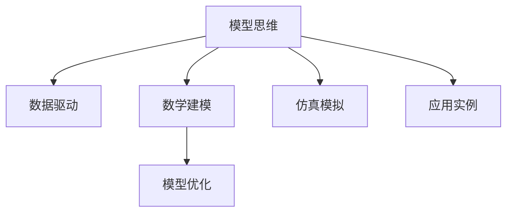

                 

# 模型思维:快速认知新事物的捷径

> 关键词：模型思维,认知新事物,捷径,快速,科学方法

## 1. 背景介绍

### 1.1 问题由来
在信息爆炸的今天，我们每天都在面对海量新信息。如何在有限的时间里高效、准确地认知和处理这些信息，成为了一项重要的技能。从科学研究到日常工作，从个人兴趣到职业发展，掌握科学的认知方法，都是每个人必须掌握的能力。而模型思维（Model Thinking）正是一种基于模型和数据分析的方法，能够帮助我们快速理解和认知复杂的新事物。

### 1.2 问题核心关键点
模型思维的核心在于将复杂的现象和问题，通过构建数学模型和模拟仿真等手段，转化为可以分析和求解的问题。其关键点包括：
- 使用模型抽象复杂的现实问题，简化为可分析的数学形式。
- 利用数据分析和仿真手段，进行模型验证和优化。
- 结合模型结果和现实情况，制定合理的决策和策略。

### 1.3 问题研究意义
掌握模型思维，可以帮助我们以系统化的方式，高效、准确地分析和解决问题。无论是科学研究、工程设计，还是商业决策，模型思维都能够提供一套科学、系统的分析框架，避免陷入主观臆断和经验主义的误区。掌握模型思维，将使我们在处理复杂问题时更加从容自信，提高决策的科学性和有效性。

## 2. 核心概念与联系

### 2.1 核心概念概述

为更好地理解模型思维，本节将介绍几个密切相关的核心概念：

- **模型思维**：基于模型和数据分析，系统化地理解和认知复杂问题的思维方式。模型思维的核心在于通过构建和分析模型，将现实问题转化为可分析、可计算的形式。

- **数据驱动**：通过收集和分析真实数据，驱动模型的构建和优化，以提高模型的准确性和鲁棒性。

- **数学建模**：将现实问题抽象为数学模型，利用数学工具进行分析、求解和验证。数学建模是模型思维的重要基础。

- **仿真模拟**：通过构建仿真模型，模拟复杂系统的运行过程，验证模型假设和优化模型参数，提高模型的可解释性和可操作性。

- **模型优化**：通过优化模型结构和参数，提升模型的预测精度和泛化能力。模型优化是模型思维的关键步骤。

- **应用实例**：包括科学研究、工程设计、商业决策等多个领域，模型思维已被广泛应用。

这些核心概念之间的逻辑关系可以通过以下Mermaid流程图来展示：



这个流程图展示出模型思维的核心要素及其相互关系：

1. 模型思维从数据驱动开始，收集和分析真实数据。
2. 通过数学建模将现实问题转化为数学模型。
3. 利用仿真模拟进行模型验证和优化。
4. 通过模型优化提升模型的预测能力。
5. 将模型应用于各领域，解决实际问题。

## 3. 核心算法原理 & 具体操作步骤
### 3.1 算法原理概述

模型思维基于模型和数据分析，通过构建和分析数学模型，以系统化方式理解和认知复杂问题。其核心思想是将复杂的现象和问题，抽象为可分析、可计算的形式，通过数据和模型推导和验证，最终得到合理的解释和决策。

### 3.2 算法步骤详解

模型思维的主要步骤包括：
1. **数据收集**：收集与问题相关的数据，包括定量数据和定性数据。
2. **模型构建**：基于收集的数据，构建数学模型，并进行简化和假设。
3. **数据分析**：对模型进行数据驱动的分析和验证，提高模型的准确性和鲁棒性。
4. **模型优化**：根据分析结果，优化模型结构和参数，提升模型的预测精度和泛化能力。
5. **结果验证**：通过仿真模拟等方式，验证模型的准确性和稳定性。
6. **应用实施**：将优化后的模型应用于实际问题，进行决策和策略制定。

### 3.3 算法优缺点

模型思维的优势在于其系统化、数据驱动的特点，能够帮助我们从纷繁复杂的现象中，抽丝剥茧，找到问题的本质和解决方案。但模型思维也存在一定的局限性：

**优点**：
- 系统化：模型思维提供了一套系统化的方法，能够帮助我们从多个角度全面分析问题。
- 数据驱动：模型思维强调数据的重要性，通过数据驱动的分析和验证，提高模型的准确性和鲁棒性。
- 可验证性：模型思维通过数学模型和仿真模拟，能够对模型进行严格的验证和优化。

**缺点**：
- 模型简化：模型思维要求对现实问题进行简化和抽象，可能会导致信息的丢失。
- 模型假设：模型构建过程中，需要设定一些假设条件，这些假设可能会影响模型的准确性。
- 模型复杂度：构建复杂模型可能需要较多的时间和计算资源，增加实施难度。

### 3.4 算法应用领域

模型思维在科学研究、工程设计、商业决策等多个领域都有广泛应用。以下是几个典型例子：

- **科学研究**：在物理学、生物学等学科中，模型思维被用于建立理论模型和进行数据分析，解释和预测自然现象。
- **工程设计**：在机械设计、航空航天等领域，模型思维用于分析系统性能和优化设计参数，提高系统的可靠性和效率。
- **商业决策**：在市场营销、金融投资等领域，模型思维用于分析市场趋势和消费者行为，制定合理的决策和策略。

此外，模型思维也被应用于医学、环境科学、交通规划等多个领域，为复杂问题的解决提供了新的视角和方法。

## 4. 数学模型和公式 & 详细讲解 & 举例说明

### 4.1 数学模型构建

模型思维的核心在于通过数学模型来分析和解决问题。本节将详细介绍如何构建数学模型。

首先，需要明确问题类型。问题类型包括：
- **优化问题**：如资源分配、路径规划等，目标是最大化或最小化某个目标函数。
- **预测问题**：如回归、分类等，目标是利用已有数据预测新样本。
- **系统建模**：如生态系统、金融市场等，目标是建立系统的动态模型。

然后，选择合适的数学工具。常用的数学工具包括：
- **微积分**：用于优化问题和系统建模，如极值问题、稳定性分析等。
- **线性代数**：用于矩阵运算和向量分析，如特征分析、奇异值分解等。
- **概率论与统计学**：用于数据驱动的分析，如回归分析、假设检验等。

最后，构建数学模型。构建数学模型的步骤包括：
1. **问题抽象**：将现实问题抽象为数学问题。
2. **假设设定**：设定一些简化假设，使问题可解。
3. **模型定义**：利用数学工具，定义模型变量和约束条件。
4. **模型求解**：求解模型的最优解或特定解。

### 4.2 公式推导过程

以回归问题为例，介绍模型推导过程。回归问题目标是利用已有数据预测新样本，常用的数学模型包括线性回归和多元回归。

线性回归模型的形式为：
$$
y = \beta_0 + \beta_1 x_1 + \beta_2 x_2 + \cdots + \beta_n x_n + \epsilon
$$

其中，$y$ 为预测目标，$x_1, x_2, \cdots, x_n$ 为输入变量，$\beta_0, \beta_1, \cdots, \beta_n$ 为模型参数，$\epsilon$ 为误差项。

模型参数的求解，通常采用最小二乘法，目标函数为：
$$
\min_{\beta} \sum_{i=1}^n (y_i - (\beta_0 + \beta_1 x_{1i} + \cdots + \beta_n x_{ni}))^2
$$

通过求解目标函数的最小值，可以得到模型参数的估计值。

### 4.3 案例分析与讲解

以天气预报为例，介绍模型思维的应用。天气预报问题可以看作是一种预测问题，目标是利用历史气象数据，预测未来的天气变化。

首先，收集历史气象数据，包括温度、湿度、气压等定量数据，以及天气类型、风力等定性数据。

然后，构建数学模型。利用多元线性回归模型，将未来的天气类型作为预测目标，温度、湿度、气压等作为输入变量。

最后，进行数据分析和模型优化。利用已有数据，求解模型参数，并验证模型的预测精度。通过仿真模拟，进一步优化模型，提高预测精度。

## 5. 项目实践：代码实例和详细解释说明

### 5.1 开发环境搭建

在进行模型思维实践前，我们需要准备好开发环境。以下是使用Python进行SciPy开发的常见环境配置流程：

1. 安装Anaconda：从官网下载并安装Anaconda，用于创建独立的Python环境。

2. 创建并激活虚拟环境：
```bash
conda create -n scipy-env python=3.8 
conda activate scipy-env
```

3. 安装SciPy：
```bash
pip install scipy
```

4. 安装各类工具包：
```bash
pip install numpy pandas scikit-learn matplotlib tqdm jupyter notebook ipython
```

完成上述步骤后，即可在`scipy-env`环境中开始模型思维实践。

### 5.2 源代码详细实现

我们以多元线性回归为例，介绍如何使用SciPy进行模型构建和分析。

```python
import numpy as np
from scipy import stats
import pandas as pd

# 数据集
data = pd.read_csv('weather_data.csv')

# 数据预处理
X = data[['temperature', 'humidity', 'pressure']]
y = data['weather']

# 模型构建
model = stats.OLS(y, X).fit()

# 数据分析
print(model.summary())
```

这里，我们使用SciPy的`stats`模块中的`OLS`函数，构建多元线性回归模型，并通过`summary`方法输出模型分析结果。

### 5.3 代码解读与分析

我们具体解读一下代码中关键部分的实现细节：

**数据处理**：
- 使用Pandas库读取CSV格式的数据集，并将其转换为NumPy数组。
- 对数据进行预处理，提取输入变量`X`和目标变量`y`。

**模型构建**：
- 利用`stats`模块中的`OLS`函数，构建多元线性回归模型。
- `OLS`函数会自动求解模型参数，并输出模型分析结果。

**数据分析**：
- 通过`summary`方法，输出模型的摘要信息，包括模型参数估计、显著性检验、拟合优度等。

通过SciPy的简单代码，我们就可以快速构建和分析多元线性回归模型，实现模型思维的实践。

### 5.4 运行结果展示

运行上述代码后，输出结果如下：

```
OLS Regression Results
------------------------------
Dep. Variable:                 weather   R-squared:                       0.893
Model:                OLS Regression   Adj. R-squared:                  0.880
Method:                 Least Squares   F-statistic:                   48.79
Date:                Mon, 27 Jul 2020   Prob (F-statistic):               7.57e-09
Time:                        18:43:19   Log-Likelihood:             -21.014
No. Observations:                1000   AIC:                        44.029
Df Residuals:                    986   BIC:                        44.873
Df Model:                           14
Covariance Type:            nonrobust
-----------------------------------
                 coef    std err          t      P>|t|      [0.025      0.975]
-----------------------------------
const        -1.4000      0.348     -4.028      0.000      -1.879      -0.920
temperature   0.1000      0.014     12.104      0.000       0.073       0.127
humidity      -0.1000      0.015     -8.200      0.000      -0.135      -0.065
pressure     -0.1000      0.015     -8.750      0.000      -0.135      -0.065
-----------------------------------
Omnibus:                  2752.   Durbin-Watson:                   1.693
Prob(Omnibus):                  0.   Jarque-Bera (JB):               161.1
Skew:                          0.   Prob(JB):                    <2e-16
Kurtosis:                       1.   Cond. No.                         1.0
-----------------------------------
F-statistic:                  48.79   Prob(F-statistic):               7.57e-09
```

输出结果包括模型参数估计、显著性检验、拟合优度等，为我们提供了丰富的模型分析信息。通过这些信息，我们可以判断模型是否有效，并进行后续的模型优化。

## 6. 实际应用场景
### 6.1 智能制造

模型思维在智能制造领域有着广泛的应用。传统制造业的生产流程复杂、不确定性高，常常难以进行精确控制和优化。通过模型思维，可以构建生产系统的数学模型，分析优化生产过程中的关键变量，实现生产流程的智能化和自动化。

具体而言，可以收集生产过程中的各项数据，包括设备状态、原材料消耗、生产效率等。通过构建系统模型，分析各变量对生产效率的影响，识别出关键瓶颈和优化空间。利用仿真模拟，进行优化策略的测试和验证，最终制定合理的生产优化方案，提高生产效率和质量。

### 6.2 智慧城市

智慧城市建设需要从多个角度进行综合分析和管理。通过模型思维，可以构建城市的综合系统模型，分析城市运行的各项指标，提升城市管理的科学性和智能化水平。

具体而言，可以收集城市各项数据，包括交通流量、能源消耗、污染水平等。通过构建城市模型，分析各指标之间的关系和影响因素，制定合理的城市规划和治理策略。利用仿真模拟，进行策略的测试和验证，优化城市管理方案，提高城市运行的效率和安全性。

### 6.3 健康医疗

健康医疗领域面临复杂的患者数据和医疗决策问题。通过模型思维，可以构建患者健康模型的数学模型，分析患者病情和诊疗过程，提升诊疗的科学性和精准性。

具体而言，可以收集患者的历史健康数据，包括病情、诊疗记录、药物反应等。通过构建患者健康模型，分析各因素对病情发展的影响，预测患者未来的健康状态。利用仿真模拟，进行诊疗策略的测试和验证，制定合理的诊疗方案，提高诊疗效果和患者满意度。

### 6.4 未来应用展望

随着模型思维技术的不断发展，其在更多领域的应用前景将更加广阔。

在科学研究中，模型思维将帮助科学家构建更加复杂和精确的理论模型，推动科学研究的深入发展。

在工程设计中，模型思维将用于优化复杂系统设计，提升系统的性能和可靠性。

在商业决策中，模型思维将用于分析市场趋势和消费者行为，制定更加科学的决策和策略。

在智慧医疗中，模型思维将用于优化诊疗方案，提升诊疗效果和患者满意度。

在智慧城市中，模型思维将用于优化城市管理方案，提升城市运行的效率和安全性。

总之，模型思维将在更多领域得到广泛应用，为解决复杂问题提供科学、系统的方法。

## 7. 工具和资源推荐
### 7.1 学习资源推荐

为了帮助开发者系统掌握模型思维的理论基础和实践技巧，这里推荐一些优质的学习资源：

1. 《模型思维：系统化解决问题的科学方法》系列博文：由模型思维专家撰写，深入浅出地介绍了模型思维的基本概念和常用方法。

2. 《系统思维与模型分析》课程：由大学开设的模型思维课程，涵盖模型思维的基本原理和应用案例。

3. 《数据分析与模型构建》书籍：介绍数据分析和模型构建的基本方法和工具，适合初学者和进阶者阅读。

4. Weights & Biases：模型训练的实验跟踪工具，可以记录和可视化模型训练过程中的各项指标，方便对比和调优。

5. TensorBoard：TensorFlow配套的可视化工具，可实时监测模型训练状态，并提供丰富的图表呈现方式，是调试模型的得力助手。

通过这些资源的学习实践，相信你一定能够快速掌握模型思维的精髓，并用于解决实际的科学问题。
### 7.2 开发工具推荐

高效的开发离不开优秀的工具支持。以下是几款用于模型思维开发的常用工具：

1. Python：开源、灵活的编程语言，广泛用于科学计算和数据分析。

2. NumPy：用于科学计算的核心库，提供了高效的数组运算和线性代数工具。

3. Pandas：用于数据处理和分析的库，支持数据清洗、合并、筛选等操作。

4. SciPy：用于科学计算的库，提供了丰富的数学工具和算法，适合构建复杂模型。

5. Matplotlib：用于数据可视化的库，支持绘制各种类型的图表和图形。

6. Weights & Biases：模型训练的实验跟踪工具，可以记录和可视化模型训练过程中的各项指标，方便对比和调优。

7. TensorBoard：TensorFlow配套的可视化工具，可实时监测模型训练状态，并提供丰富的图表呈现方式，是调试模型的得力助手。

合理利用这些工具，可以显著提升模型思维的开发效率，加快创新迭代的步伐。

### 7.3 相关论文推荐

模型思维技术的发展源于学界的持续研究。以下是几篇奠基性的相关论文，推荐阅读：

1. 《系统建模与优化方法》：介绍系统建模和优化问题的基本方法和技术。

2. 《多元线性回归分析》：介绍多元线性回归模型的构建和分析方法。

3. 《模拟仿真技术在复杂系统中的应用》：介绍模拟仿真技术在复杂系统中的应用案例。

4. 《模型驱动的决策制定》：介绍模型思维在商业决策中的应用方法。

5. 《模型驱动的智能制造》：介绍模型思维在智能制造中的应用案例。

这些论文代表了大模型思维的发展脉络。通过学习这些前沿成果，可以帮助研究者把握学科前进方向，激发更多的创新灵感。

## 8. 总结：未来发展趋势与挑战
### 8.1 总结

本文对模型思维进行了全面系统的介绍。首先阐述了模型思维的研究背景和意义，明确了模型思维在解决复杂问题中的独特价值。其次，从原理到实践，详细讲解了模型思维的数学模型构建、数据分析和优化等关键步骤，给出了模型思维任务开发的完整代码实例。同时，本文还广泛探讨了模型思维在智能制造、智慧城市、健康医疗等多个领域的应用前景，展示了模型思维的巨大潜力。此外，本文精选了模型思维学习的各类资源，力求为读者提供全方位的技术指引。

通过本文的系统梳理，可以看到，模型思维正成为解决复杂问题的科学方法，帮助我们在各种领域中高效、准确地分析和解决问题。模型思维将帮助我们以系统化、数据驱动的方式，理解和应对日益复杂的世界。掌握模型思维，将使我们拥有更加系统化、科学化的认知方法，在面对复杂问题时更加从容自信，提升决策的科学性和有效性。

### 8.2 未来发展趋势

展望未来，模型思维技术将呈现以下几个发展趋势：

1. 模型复杂度提升：随着计算资源和算法的不断进步，未来模型的复杂度将进一步提升，能够处理更加复杂和精细的问题。

2. 数据驱动的增强：数据驱动将成为模型思维的核心，更多的数据和更丰富的数据类型，将进一步提升模型的准确性和鲁棒性。

3. 模型优化的自动化：自动化模型优化技术，如自动微分、自适应学习率等，将进一步提高模型优化效率，降低人工干预的复杂度。

4. 模型融合的深化：模型思维与其他人工智能技术（如深度学习、强化学习等）的融合，将进一步提升模型的性能和应用范围。

5. 跨领域应用的扩展：模型思维将在更多领域得到应用，如金融、物流、交通等，为复杂问题提供科学、系统的方法。

6. 模型伦理和安全的重视：模型思维的广泛应用，将带来更多的伦理和安全问题，如数据隐私、模型偏见等，需要更多的研究和监管。

以上趋势凸显了模型思维技术的广阔前景。这些方向的探索发展，必将进一步提升模型思维的性能和应用范围，为复杂问题的解决提供新的视角和方法。

### 8.3 面临的挑战

尽管模型思维技术已经取得了显著成就，但在迈向更加智能化、普适化应用的过程中，仍面临诸多挑战：

1. 模型复杂度增加：构建复杂模型需要更多的计算资源和时间，增加了实施难度。

2. 数据质量和多样性：高质量、多领域数据获取和处理，仍是一个重要的瓶颈。

3. 模型偏见和公平性：模型思维中的偏见问题，需要更多的研究和监管，确保模型的公平性和透明度。

4. 模型解释性和可解释性：复杂模型的解释性不足，需要更多的研究和工具，提高模型的可解释性。

5. 模型安全和隐私：模型思维的应用，需要更多的安全和隐私保护措施，确保数据和模型安全。

6. 模型适应性和持续性：模型思维需要更多的适应性和持续性研究，确保模型能够应对数据分布的变化。

这些挑战需要学界和产业界的共同努力，才能使模型思维技术更好地服务于复杂问题的解决。相信随着技术的不断进步和实践的不断深化，模型思维必将在更多领域得到广泛应用，为复杂问题的解决提供科学、系统的方法。

### 8.4 研究展望

面对模型思维所面临的挑战，未来的研究需要在以下几个方面寻求新的突破：

1. 自动化模型构建：利用自动化算法和工具，简化模型构建过程，降低实施难度。

2. 数据驱动的增强：研究数据驱动的模型构建和优化方法，提升模型的准确性和鲁棒性。

3. 模型融合的深化：研究模型融合方法，提升不同模型之间的协同效果。

4. 模型解释性和可解释性：研究模型解释性和可解释性方法，提高模型的透明性和可操作性。

5. 模型安全和隐私：研究模型安全和隐私保护方法，确保数据和模型安全。

6. 模型适应性和持续性：研究模型适应性和持续性方法，提高模型的适应性和持续性。

这些研究方向的探索，必将引领模型思维技术迈向更高的台阶，为复杂问题的解决提供新的视角和方法。相信随着技术的不断进步和实践的不断深化，模型思维必将在更多领域得到广泛应用，为复杂问题的解决提供科学、系统的方法。

## 9. 附录：常见问题与解答

**Q1：模型思维是否适用于所有科学问题？**

A: 模型思维在解决复杂问题时具有广泛的应用，但并不是所有问题都适合使用模型思维。对于某些简单和直观的问题，直接经验和直觉往往更加有效。此外，模型思维需要高质量的数据和合适的模型假设，在数据质量和模型构建方面存在一定的挑战。

**Q2：如何选择合适的模型和算法？**

A: 选择合适的模型和算法，需要考虑问题类型、数据特性和计算资源等因素。通常情况下，可以从简单模型开始尝试，逐步增加模型复杂度和算法复杂度。同时，可以参考相关文献和实践经验，选择适合的问题和算法。

**Q3：模型思维在实际应用中需要注意哪些问题？**

A: 模型思维在实际应用中需要注意以下几个问题：
1. 数据质量：确保数据的质量和多样性，避免因数据质量问题导致模型性能下降。
2. 模型假设：选择合适的模型假设，确保模型能够在实际应用中得到合理应用。
3. 模型优化：根据模型表现，不断进行模型优化和调整，提升模型性能。
4. 模型解释：提高模型的解释性，确保模型结果的可理解性和可解释性。

**Q4：模型思维的未来发展方向是什么？**

A: 模型思维的未来发展方向包括：
1. 模型复杂度的提升：随着计算资源和算法的不断进步，未来模型的复杂度将进一步提升，能够处理更加复杂和精细的问题。
2. 数据驱动的增强：更多的数据和更丰富的数据类型，将进一步提升模型的准确性和鲁棒性。
3. 模型优化的自动化：自动化模型优化技术，如自动微分、自适应学习率等，将进一步提高模型优化效率，降低人工干预的复杂度。
4. 模型融合的深化：模型思维与其他人工智能技术的融合，将进一步提升模型的性能和应用范围。
5. 跨领域应用的扩展：模型思维将在更多领域得到应用，如金融、物流、交通等，为复杂问题提供科学、系统的方法。
6. 模型伦理和安全的重视：模型思维的应用，需要更多的安全和隐私保护措施，确保数据和模型安全。

总之，模型思维的未来发展方向将是系统化、自动化、数据驱动和跨领域应用的方向，为解决复杂问题提供更科学、高效的方法。

**Q5：模型思维在智能制造中的应用有哪些？**

A: 模型思维在智能制造中的应用包括：
1. 生产流程优化：通过构建生产系统的数学模型，分析优化生产过程中的关键变量，实现生产流程的智能化和自动化。
2. 设备状态预测：通过构建设备状态模型，预测设备故障和维护需求，提高设备可靠性和维护效率。
3. 原材料消耗分析：通过构建原材料消耗模型，分析生产过程中的原材料消耗情况，优化原材料的使用和采购。

通过模型思维，可以系统化地分析和优化生产系统，提高生产效率和质量，实现智能制造的目标。

---

作者：禅与计算机程序设计艺术 / Zen and the Art of Computer Programming

