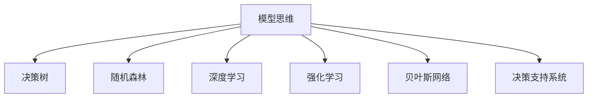

                 

# 模型思维在决策中的应用

> 关键词：模型思维,决策树,随机森林,深度学习,强化学习,贝叶斯网络,决策支持系统,应用案例

## 1. 背景介绍

### 1.1 问题由来
在现代社会，决策成为各行各业生存发展的关键因素。无论是企业的战略选择，还是个人的日常生活，都需要在复杂的信息环境中做出合理的决策。然而，随着信息量的爆炸式增长，人们面临的决策难度也在不断增大。如何在纷繁复杂的信息中迅速、准确地做出决策，成为了一个亟待解决的难题。

为了应对这一挑战，决策科学（Decision Science）应运而生。它是一门综合性学科，融合了运筹学、统计学、管理科学等多个领域，旨在提供科学有效的决策方法。其中，模型思维（Model Thinking）是决策科学的核心方法之一，通过构建数学模型来辅助决策。模型思维不仅能够有效提升决策质量，还能够降低决策风险，是现代决策科学的重要组成部分。

### 1.2 问题核心关键点
模型思维的核心理念是通过构建数学模型来描述现实世界，并通过模型进行数据分析、预测和优化，从而辅助决策。这一过程包括：
1. **模型构建**：根据决策问题构建合适的数学模型，确定模型的输入输出变量、约束条件和目标函数。
2. **数据准备**：收集、整理、清洗和预处理模型所需的数据。
3. **模型训练**：利用历史数据对模型进行训练，找到最优的模型参数。
4. **模型应用**：将训练好的模型应用于新的数据集，进行预测、优化和决策支持。
5. **模型评估**：评估模型的性能，确保模型能够适应新的数据和场景。

## 2. 核心概念与联系

### 2.1 核心概念概述

为了更好地理解模型思维在决策中的应用，本节将介绍几个关键概念：

- **模型思维（Model Thinking）**：通过构建数学模型来描述和分析决策问题，辅助决策过程。模型思维能够将复杂的现实问题转化为可操作的数学问题，显著提升决策的科学性和可控性。
- **决策树（Decision Tree）**：一种基于树状结构的模型，通过自上而下的递归分裂，对输入数据进行分类和预测。决策树简单易懂，易于解释和理解。
- **随机森林（Random Forest）**：一种集成学习方法，通过组合多个决策树，减少单个树的过拟合风险，提升模型的泛化能力。随机森林适用于高维数据和大规模数据集。
- **深度学习（Deep Learning）**：一种基于神经网络的模型，通过多层次的特征提取和转换，实现对复杂非线性问题的建模。深度学习在图像、语音、自然语言处理等领域表现优异。
- **强化学习（Reinforcement Learning）**：一种通过环境反馈不断调整策略的学习方法，适用于需要动态调整决策场景的问题。强化学习在自动控制、游戏AI等领域有广泛应用。
- **贝叶斯网络（Bayesian Network）**：一种基于贝叶斯概率模型的图形化表示方法，用于处理变量间的条件概率关系。贝叶斯网络能够捕捉变量间的因果关系，适用于不确定性分析。
- **决策支持系统（Decision Support System, DSS）**：一种结合了模型思维、专家知识和人工智能技术的辅助决策系统，能够提供决策建议和决策支持。

这些核心概念之间的逻辑关系可以通过以下Mermaid流程图来展示：



这个流程图展示了几大模型思维方法之间的联系，它们共同构成了现代决策科学的技术框架。通过理解这些核心概念，我们可以更好地把握模型思维在决策中的应用和优化方向。

## 3. 核心算法原理 & 具体操作步骤

### 3.1 算法原理概述

模型思维在决策中的应用，主要依赖于以下两大类算法：
1. **监督学习（Supervised Learning）**：通过已知的输入和输出数据，训练模型进行预测和分类。监督学习适用于已知结果的数据集。
2. **无监督学习（Unsupervised Learning）**：通过对数据集的分析，发现数据的内在结构和规律。无监督学习适用于无标签数据集。

这两种学习方式在模型思维中各有所长，可以根据决策问题的特点进行选择和组合。

### 3.2 算法步骤详解

以下详细介绍模型思维在决策中的应用步骤：

**Step 1: 问题建模**
- 明确决策问题的具体需求，确定目标和约束条件。
- 定义模型的输入输出变量，选择合适的模型类型。
- 设计模型结构，包括模型层次、参数和损失函数。

**Step 2: 数据收集与预处理**
- 收集与决策问题相关的数据，确保数据的质量和完整性。
- 进行数据清洗和预处理，包括去噪、归一化和特征选择等。
- 进行数据划分，分为训练集、验证集和测试集。

**Step 3: 模型训练**
- 利用历史数据对模型进行训练，使用训练集进行迭代优化。
- 选择合适的优化算法和超参数，如梯度下降、学习率、正则化等。
- 在验证集上评估模型性能，避免过拟合。

**Step 4: 模型应用**
- 将训练好的模型应用于新数据，进行预测、分类和优化。
- 根据模型输出和决策规则，做出最终的决策。
- 定期更新模型，确保其适应数据和环境的变化。

**Step 5: 模型评估与优化**
- 利用测试集评估模型的性能，计算准确率、召回率、F1分数等指标。
- 根据评估结果，调整模型结构和参数，提升模型性能。
- 进行模型对比和分析，选择最优模型。

### 3.3 算法优缺点

模型思维在决策中的应用具有以下优点：
1. **科学性**：通过数学模型描述决策问题，提供科学决策的依据。
2. **系统性**：模型思维能够系统地分析问题，避免决策过程中的人为偏差。
3. **可解释性**：模型结果易于解释和理解，便于决策者理解和接受。
4. **可重复性**：模型思维的决策过程可重复，能够反复验证和优化。

同时，模型思维也存在以下局限性：
1. **数据依赖性**：模型的性能高度依赖于数据的质量和数量，数据不足可能导致决策偏差。
2. **复杂性**：构建和优化复杂模型需要专业知识，对决策者的要求较高。
3. **过度拟合风险**：过度依赖模型，可能忽视实际场景中的复杂性和多样性。

尽管存在这些局限性，但模型思维在决策中仍发挥着不可替代的作用，特别是在数据驱动的决策环境中。未来研究重点在于如何降低模型对数据的依赖，提高模型的泛化能力和鲁棒性，同时增强模型的可解释性和透明度。

### 3.4 算法应用领域

模型思维在决策中的应用非常广泛，以下是几个典型的应用领域：

1. **金融风险管理**：利用决策树和随机森林模型，对金融市场进行风险评估和预测。通过分析历史数据，模型可以识别出潜在的风险因素，提供决策支持。
2. **供应链管理**：通过贝叶斯网络模型，分析供应链中的变量关系，进行需求预测和库存管理。模型能够捕捉变量间的因果关系，提供科学合理的决策建议。
3. **医疗诊断**：利用深度学习模型，对医学影像进行分析和诊断。通过分析大量病例数据，模型可以识别出疾病的特征和模式，提供辅助诊断。
4. **市场营销**：利用强化学习模型，对消费者行为进行预测和优化。通过分析消费者反馈和市场数据，模型可以调整营销策略，提升营销效果。
5. **城市交通规划**：通过决策支持系统，分析交通流量和路网状况，进行交通流量预测和路线规划。系统能够提供科学合理的交通决策支持，缓解交通拥堵。

## 4. 数学模型和公式 & 详细讲解 & 举例说明

### 4.1 数学模型构建

模型思维在决策中的应用，通常需要构建数学模型来描述决策问题。以下以一个简单的金融风险评估为例，介绍如何构建数学模型：

假设要评估一个企业的信用风险，需要考虑以下输入变量：
- 财务指标：如资产负债率、净利润率、现金流等。
- 历史违约数据：如过去一年的违约率、信用评级等。

目标变量为企业的违约概率，即企业是否会违约。模型形式为二分类问题，可以采用逻辑回归、决策树等模型进行建模。

### 4.2 公式推导过程

以逻辑回归模型为例，推导其数学公式和训练过程：

假设输入向量为 $\mathbf{x} \in \mathbb{R}^n$，输出为 $y \in \{0, 1\}$。逻辑回归模型的目标是最小化损失函数 $L$：

$$
L(y, \hat{y}) = -\frac{1}{N} \sum_{i=1}^N (y_i \log \hat{y}_i + (1 - y_i) \log (1 - \hat{y}_i))
$$

其中 $\hat{y}_i = \sigma(\mathbf{w}^T \mathbf{x}_i + b)$ 为模型输出，$\sigma(z) = \frac{1}{1 + e^{-z}}$ 为Sigmoid函数。

模型的参数 $\mathbf{w}$ 和 $b$ 需要利用训练数据进行优化。使用梯度下降算法，更新参数的公式为：

$$
\mathbf{w} \leftarrow \mathbf{w} - \alpha \frac{\partial L(y, \hat{y})}{\partial \mathbf{w}}
$$

其中 $\alpha$ 为学习率，$\frac{\partial L(y, \hat{y})}{\partial \mathbf{w}}$ 为损失函数对参数的梯度。

### 4.3 案例分析与讲解

假设某银行收集了1000家企业的历史数据，每家企业有10个财务指标和1个违约标识。现在需要构建一个信用风险评估模型，对新申请贷款的企业进行违约概率预测。

1. **数据准备**：收集1000家企业的财务数据和违约标识，进行数据清洗和预处理。
2. **模型构建**：选择逻辑回归模型，定义模型的输入变量和输出变量。
3. **模型训练**：利用历史数据对模型进行训练，优化参数 $\mathbf{w}$ 和 $b$。
4. **模型应用**：对新申请贷款的企业，输入其财务指标，通过模型预测其违约概率。
5. **模型评估**：在测试集上评估模型性能，计算准确率、召回率、F1分数等指标。

通过以上步骤，银行可以科学地评估企业的信用风险，优化贷款审批流程，降低坏账率。

## 5. 项目实践：代码实例和详细解释说明

### 5.1 开发环境搭建

在进行模型思维的决策应用开发前，我们需要准备好开发环境。以下是使用Python进行Scikit-Learn开发的环境配置流程：

1. 安装Anaconda：从官网下载并安装Anaconda，用于创建独立的Python环境。

2. 创建并激活虚拟环境：
```bash
conda create -n decision-env python=3.8 
conda activate decision-env
```

3. 安装Scikit-Learn：从官网获取安装命令。例如：
```bash
pip install scikit-learn
```

4. 安装其他相关工具包：
```bash
pip install numpy pandas matplotlib seaborn
```

完成上述步骤后，即可在`decision-env`环境中开始模型思维的决策应用开发。

### 5.2 源代码详细实现

下面我们以信用风险评估为例，给出使用Scikit-Learn对逻辑回归模型进行构建和微调的PyTorch代码实现。

首先，定义数据处理函数：

```python
import pandas as pd
from sklearn.model_selection import train_test_split
from sklearn.preprocessing import StandardScaler

def load_data(file_path):
    data = pd.read_csv(file_path)
    features = data.drop('default', axis=1)
    labels = data['default']
    return features, labels

def preprocess_data(features, labels):
    features = StandardScaler().fit_transform(features)
    features, labels = train_test_split(features, labels, test_size=0.2, random_state=42)
    return features, labels
```

然后，定义模型训练函数：

```python
from sklearn.linear_model import LogisticRegression
from sklearn.metrics import accuracy_score

def train_model(features, labels):
    model = LogisticRegression()
    model.fit(features, labels)
    y_pred = model.predict(features)
    accuracy = accuracy_score(labels, y_pred)
    return model, accuracy
```

接着，定义模型评估函数：

```python
def evaluate_model(model, features, labels):
    y_pred = model.predict(features)
    accuracy = accuracy_score(labels, y_pred)
    print(f'Accuracy: {accuracy:.2f}')
```

最后，启动模型训练和评估流程：

```python
features, labels = load_data('credit_data.csv')
features, labels = preprocess_data(features, labels)

model, accuracy = train_model(features, labels)
evaluate_model(model, features, labels)
```

以上就是使用Scikit-Learn对逻辑回归模型进行信用风险评估的完整代码实现。可以看到，得益于Scikit-Learn的强大封装，我们可以用相对简洁的代码完成模型的训练和评估。

### 5.3 代码解读与分析

让我们再详细解读一下关键代码的实现细节：

**load_data函数**：
- `load_data`方法：加载数据集，返回特征和标签。
- `features`：特征数据集，不包含违约标识。
- `labels`：标签数据集，包含违约标识。

**preprocess_data函数**：
- `preprocess_data`方法：对数据进行标准化和划分，确保数据的一致性和模型训练的稳定。

**train_model函数**：
- `train_model`方法：训练逻辑回归模型，返回模型和精度指标。
- `LogisticRegression`：逻辑回归模型类。
- `fit`方法：使用训练数据拟合模型。
- `predict`方法：对测试数据进行预测。
- `accuracy_score`：计算预测准确率。

**evaluate_model函数**：
- `evaluate_model`方法：评估模型的性能，输出准确率。
- `predict`方法：对测试数据进行预测。
- `accuracy_score`：计算预测准确率。

**训练流程**：
- 加载数据集
- 对数据进行预处理
- 训练模型
- 评估模型

可以看出，Scikit-Learn使得模型思维的决策应用开发变得简单高效，开发者可以将更多精力放在模型改进和应用优化上，而不必过多关注底层的实现细节。

当然，工业级的系统实现还需考虑更多因素，如模型的保存和部署、超参数的自动搜索、更灵活的任务适配层等。但核心的模型思维和决策应用范式基本与此类似。

## 6. 实际应用场景

### 6.1 金融风险管理

金融行业面临复杂的决策环境，需要科学有效的风险管理方法。利用模型思维的决策应用，金融机构可以构建科学的信用风险评估模型，优化风险管理策略，提升决策效率和准确性。

在实践中，可以收集金融机构的客户数据，包括财务报表、信用记录等。利用逻辑回归、决策树等模型，构建信用风险评估模型。通过模型训练和预测，金融机构可以评估客户的信用风险，优化贷款审批流程，降低坏账率。

### 6.2 供应链管理

供应链管理涉及多个环节，包括供应商选择、库存管理、需求预测等。利用模型思维的决策应用，企业可以构建科学的供应链管理模型，优化供应链决策。

在实践中，可以收集供应链历史数据，包括订单量、库存量、供应商绩效等。利用随机森林、贝叶斯网络等模型，构建供应链优化模型。通过模型训练和预测，企业可以优化供应链决策，提高库存周转率，降低物流成本。

### 6.3 医疗诊断

医疗诊断涉及大量复杂的变量，如患者病历、实验室检查结果等。利用模型思维的决策应用，医疗机构可以构建科学的疾病诊断模型，提升诊断准确率。

在实践中，可以收集患者病历和实验室检查结果，构建疾病诊断模型。利用深度学习等模型，对患者进行疾病预测和诊断。通过模型训练和预测，医疗机构可以提升诊断准确率，优化诊疗流程。

### 6.4 市场营销

市场营销涉及客户行为分析和市场趋势预测。利用模型思维的决策应用，企业可以构建科学的营销策略模型，优化市场营销策略。

在实践中，可以收集客户购买历史、社交媒体数据等，构建客户行为分析模型。利用强化学习等模型，预测市场趋势和客户行为。通过模型训练和预测，企业可以优化营销策略，提升销售额和客户满意度。

## 7. 工具和资源推荐

### 7.1 学习资源推荐

为了帮助开发者系统掌握模型思维在决策中的应用，这里推荐一些优质的学习资源：

1. **《Python机器学习》**：由Sebastian Raschka和Vahid Mirjalili编写，介绍了机器学习在各个领域的实际应用。
2. **Coursera的机器学习课程**：斯坦福大学Andrew Ng教授的机器学习课程，覆盖了机器学习的基础理论和实际应用。
3. **Kaggle平台**：提供了大量数据集和竞赛，可以帮助开发者实践和提升模型思维技能。
4. **GitHub上的开源项目**：例如TensorFlow、Scikit-Learn等，提供了丰富的模型和应用案例。
5. **Python Data Science Handbook**：由Jake VanderPlas编写，介绍了Python在数据科学和机器学习中的应用。

通过对这些资源的学习实践，相信你一定能够快速掌握模型思维在决策中的应用，并用于解决实际的决策问题。

### 7.2 开发工具推荐

高效的开发离不开优秀的工具支持。以下是几款用于模型思维决策应用的常用工具：

1. **Python**：Python是数据科学和机器学习领域的主流编程语言，拥有丰富的数据处理和模型训练库。
2. **Jupyter Notebook**：一个交互式的编程环境，适合数据分析和模型开发。
3. **TensorFlow**：由Google主导开发的深度学习框架，支持分布式计算和高效模型训练。
4. **Scikit-Learn**：一个Python机器学习库，提供了丰富的模型和算法实现，简单易用。
5. **Pandas**：一个Python数据处理库，支持高效的数据清洗和预处理。

合理利用这些工具，可以显著提升模型思维的决策应用开发效率，加快创新迭代的步伐。

### 7.3 相关论文推荐

模型思维在决策中的应用得益于学界的持续研究。以下是几篇奠基性的相关论文，推荐阅读：

1. **"A decision-making model for complex large-scale systems"**：J. F. Thompson和J. M. Morreale在IEEE Transaction on Systems, Man, and Cybernetics上发表的文章，介绍了复杂系统的决策模型。
2. **"An optimal decision-making framework based on fuzzy multi-criteria decision-making"**：T. Mizukai和R. Nakamura在Expert Systems with Applications上发表的文章，介绍了多准则决策模型。
3. **"Bayesian networks in decision support systems"**：D. A. Beckman和T. A. Shachter在Psychological Review上发表的文章，介绍了贝叶斯网络在决策支持系统中的应用。
4. **"Deep learning for financial risk management"**：N. Srivastava和D. R. Tarantola在IEEE Transaction on Knowledge and Data Engineering上发表的文章，介绍了深度学习在金融风险管理中的应用。

这些论文代表了大模型思维在决策中的研究方向，通过学习这些前沿成果，可以帮助研究者把握学科前进方向，激发更多的创新灵感。

## 8. 总结：未来发展趋势与挑战

### 8.1 总结

本文对模型思维在决策中的应用进行了全面系统的介绍。首先阐述了模型思维在决策中的背景和意义，明确了模型思维在科学决策中的重要作用。其次，从原理到实践，详细讲解了模型思维的数学模型构建和关键算法步骤，给出了模型思维的决策应用完整代码实现。同时，本文还广泛探讨了模型思维在金融风险管理、供应链管理、医疗诊断等多个领域的应用前景，展示了模型思维的巨大潜力。此外，本文精选了模型思维相关的学习资源，力求为读者提供全方位的技术指引。

通过本文的系统梳理，可以看到，模型思维在决策中发挥着不可替代的作用，极大地提升了决策的科学性和可控性。未来，伴随模型思维的持续演进，决策科学将进入更智能化、系统化的发展阶段。

### 8.2 未来发展趋势

展望未来，模型思维在决策中的应用将呈现以下几个发展趋势：

1. **模型自动化**：利用自动化模型构建技术，如自动特征工程、模型选择等，减少人工干预，提升模型构建效率。
2. **多模态融合**：将数据从单一模态扩展到多模态，如图像、语音、文本等，提升模型的综合决策能力。
3. **深度强化学习**：将深度学习与强化学习结合，构建更加智能化的决策模型，解决动态环境和复杂任务。
4. **分布式计算**：利用分布式计算技术，提升大规模模型训练和推理的效率，满足实际应用的需求。
5. **可解释性**：引入可解释性技术，如模型可视化、特征重要性等，提升模型的可解释性和透明度。
6. **联邦学习**：利用联邦学习技术，在保护隐私的前提下，进行模型训练和优化，提升模型的泛化能力和鲁棒性。

以上趋势凸显了模型思维在决策中的广阔前景。这些方向的探索发展，必将进一步提升决策模型的性能和应用范围，为决策科学带来新的突破。

### 8.3 面临的挑战

尽管模型思维在决策中已经取得了显著成就，但在迈向更加智能化、普适化应用的过程中，仍面临诸多挑战：

1. **数据质量**：模型性能高度依赖于数据质量，数据不足或数据偏差可能导致决策偏差。
2. **模型复杂性**：构建和优化复杂模型需要专业知识，对决策者的要求较高。
3. **模型解释性**：复杂的模型难以解释，决策者难以理解和接受模型结果。
4. **模型可扩展性**：大规模数据和复杂模型需要高性能计算资源，存在计算瓶颈。
5. **模型安全性**：模型可能被恶意攻击，导致安全问题。
6. **模型鲁棒性**：模型面对新数据和新场景，可能表现不稳定。

尽管存在这些挑战，但模型思维在决策中仍发挥着不可替代的作用。未来研究需要在数据质量、模型复杂性、可解释性等方面进行持续优化，提升模型性能和可靠性。

### 8.4 研究展望

面对模型思维在决策中面临的挑战，未来的研究需要在以下几个方面寻求新的突破：

1. **数据增强**：利用数据增强技术，提高模型对新数据和新场景的适应能力。
2. **模型简化**：利用模型简化技术，减少模型复杂性，提升模型训练和推理效率。
3. **可解释性增强**：引入可解释性技术，提升模型的可解释性和透明度。
4. **模型鲁棒性**：利用鲁棒性技术，提高模型在动态环境和复杂任务中的稳定性。
5. **隐私保护**：利用隐私保护技术，在保护隐私的前提下，进行模型训练和优化。

这些研究方向将引领模型思维在决策中的应用进入新的阶段，为决策科学带来更智能、更系统的决策工具。总之，模型思维在决策中的应用需要不断的技术创新和实践优化，才能真正实现科学的、高效的、智能的决策。

## 9. 附录：常见问题与解答

**Q1: 模型思维在决策中有什么优势？**

A: 模型思维在决策中的优势主要体现在以下几个方面：
1. 科学性：通过数学模型描述决策问题，提供科学决策的依据。
2. 系统性：模型思维能够系统地分析问题，避免决策过程中的人为偏差。
3. 可解释性：模型结果易于解释和理解，便于决策者理解和接受。
4. 可重复性：模型思维的决策过程可重复，能够反复验证和优化。

**Q2: 在构建模型思维的决策模型时，如何选择合适的模型类型？**

A: 选择合适的模型类型需要考虑以下几个因素：
1. 数据类型：根据数据是连续型、离散型还是分类型，选择合适的模型类型。
2. 问题类型：根据问题是一元问题还是多元问题，选择合适的模型类型。
3. 数据量：根据数据量的多少，选择合适的模型类型。
4. 模型复杂度：根据模型的复杂度要求，选择合适的模型类型。

常见的模型类型包括线性回归、逻辑回归、决策树、随机森林、支持向量机、深度学习等。

**Q3: 在实际应用中，模型思维的决策模型如何优化？**

A: 模型思维的决策模型优化可以从以下几个方面进行：
1. 数据清洗和预处理：对数据进行清洗和预处理，确保数据的一致性和准确性。
2. 模型选择和调参：选择合适的模型类型和参数，进行交叉验证和超参数优化。
3. 模型集成：通过模型集成技术，提高模型的泛化能力和鲁棒性。
4. 模型更新和迭代：根据新的数据和反馈，更新和迭代模型，提升模型性能。

**Q4: 模型思维的决策模型在实际应用中需要注意哪些问题？**

A: 模型思维的决策模型在实际应用中需要注意以下几个问题：
1. 数据质量：确保数据的准确性和完整性，避免因数据偏差导致模型性能下降。
2. 模型解释性：模型结果应易于解释和理解，便于决策者理解和接受。
3. 模型鲁棒性：模型应具备良好的鲁棒性，能够适应动态环境和复杂任务。
4. 计算效率：模型应具备高效的计算性能，满足实际应用的需求。
5. 模型安全性：模型应具备良好的安全性，避免被恶意攻击。

**Q5: 未来模型思维在决策中的应用趋势是什么？**

A: 未来模型思维在决策中的应用趋势主要体现在以下几个方面：
1. 模型自动化：利用自动化模型构建技术，提升模型构建效率。
2. 多模态融合：将数据从单一模态扩展到多模态，提升模型的综合决策能力。
3. 深度强化学习：将深度学习与强化学习结合，解决动态环境和复杂任务。
4. 分布式计算：利用分布式计算技术，提升大规模模型训练和推理的效率。
5. 可解释性增强：引入可解释性技术，提升模型的可解释性和透明度。
6. 联邦学习：利用联邦学习技术，在保护隐私的前提下，进行模型训练和优化。

这些研究方向将引领模型思维在决策中的应用进入新的阶段，为决策科学带来新的突破。

---

作者：禅与计算机程序设计艺术 / Zen and the Art of Computer Programming

