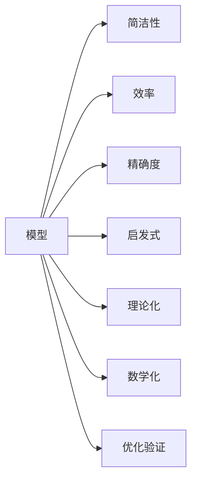

                 

# 模型思维：认知复杂世界的快捷方式

> 关键词：模型思维,认知复杂性,简洁度,效率,精确度,启发式,理论化,数学化

## 1. 背景介绍

### 1.1 问题由来

在当今信息爆炸的时代，数据的海量增长与人类认知能力的有限性之间形成了巨大的矛盾。复杂世界的认知和决策，越来越需要依赖于高级的认知模型和算法。然而，传统的统计方法和大数据分析往往难以应对这种复杂性。近年来，随着深度学习技术的不断发展，模型思维作为一种强大的认知工具，成为了解决复杂问题的重要手段。

模型思维通过构建数学化的模型来描述现实世界中的各种现象和关系，运用数学推导和计算来解决问题，从而能够快速高效地认知和决策。模型思维的应用领域涵盖了科学研究、工程技术、金融预测、医学诊断等多个行业。然而，模型思维的构建和应用，并非易事。本文旨在介绍模型思维的核心概念、构建方法和实际应用，以期为读者提供深入理解复杂世界的快捷方式。

### 1.2 问题核心关键点

模型思维的构建和应用，需要解决以下核心问题：

- 如何从复杂的现象中抽象出简洁、合理的模型？
- 如何设计高效、稳定的模型，以精确地描述和预测现实世界？
- 如何在高维空间中高效地处理、分析和解释数据？
- 如何对模型进行优化和验证，以确保其可靠性和实用性？

这些核心问题将贯穿全文，在接下来的部分中逐一探讨。

## 2. 核心概念与联系

### 2.1 核心概念概述

模型思维的核心概念包括：

- **模型**：用于描述和预测现实世界的数学或计算结构。
- **简洁性**：模型应当尽可能简单，避免过度拟合，同时又能有效描述复杂现象。
- **效率**：模型应当在计算和处理上高效，能够快速得出结果。
- **精确度**：模型应当尽可能准确地预测或解释现实世界的现象。
- **启发式**：模型应当具有启发性和解释性，能够提供洞察和解释。
- **理论化**：模型应当基于理论，经过严格推导和验证，具有科学依据。
- **数学化**：模型应当采用数学语言进行描述和推导，便于理解和计算。

这些概念之间存在紧密的联系，共同构成了模型思维的基本框架。通过理解这些概念，可以更好地把握模型思维的精髓，运用其解决复杂问题。

### 2.2 核心概念原理和架构的 Mermaid 流程图(Mermaid 流程节点中不要有括号、逗号等特殊字符)



这个流程图展示了模型思维的核心概念及其联系。模型的构建需要考虑简洁性、效率、精确度、启发式、理论化和数学化等多个方面，并通过优化验证确保其实用性。

## 3. 核心算法原理 & 具体操作步骤

### 3.1 算法原理概述

模型思维的核心算法原理基于数学建模和数值计算，通过对复杂现象进行抽象和简化，构建出简洁且有效的模型。模型的构建和验证通常遵循以下步骤：

1. 数据收集和预处理：收集相关数据，并进行清洗、归一化等预处理操作。
2. 模型构建和假设：根据问题特征，选择或设计合适的数学模型，并提出假设。
3. 参数估计和求解：通过数学推导，求解模型参数，使得模型能够描述和预测数据。
4. 模型验证和优化：使用验证数据集评估模型性能，并通过优化调整模型参数，提高精确度。

### 3.2 算法步骤详解

以下是一个典型的模型构建步骤：

**步骤1：数据收集和预处理**
- 收集与问题相关的数据，并进行清洗和预处理，如去除异常值、缺失值补全等。
- 对数据进行归一化处理，确保不同量级的特征具有可比性。

**步骤2：模型构建和假设**
- 根据问题特征，选择合适的数学模型。例如，线性回归、逻辑回归、决策树等。
- 提出模型假设，包括模型的结构和参数取值范围。

**步骤3：参数估计和求解**
- 使用最大似然估计、最小二乘等方法，求解模型参数。
- 使用数值方法（如梯度下降、牛顿法等）进行参数估计。

**步骤4：模型验证和优化**
- 使用验证集评估模型性能，如均方误差、准确率、召回率等。
- 根据评估结果，调整模型参数，使用正则化、交叉验证等技术防止过拟合。

### 3.3 算法优缺点

模型思维具有以下优点：
- 数学模型具有简洁性和理论依据，便于理解和推导。
- 数值计算方法高效准确，能够快速得出结果。
- 可解释性强，便于分析和调试。

但同时也存在以下缺点：
- 模型的构建需要较强的数学背景和推导能力。
- 对数据的处理和特征工程要求较高，容易出现数据偏差。
- 模型的解释性较强，对异常情况的鲁棒性较低。

### 3.4 算法应用领域

模型思维在多个领域得到了广泛应用：

- **科学研究**：如物理学、化学、生物学等，通过数学模型描述物理规律和生物现象。
- **工程设计**：如机械设计、电路设计、结构分析等，通过数值计算优化设计方案。
- **金融预测**：如股票价格预测、信用风险评估等，通过统计模型预测经济现象。
- **医学诊断**：如病理学分析、疾病预测等，通过数学模型分析医疗数据。
- **环境科学**：如气候变化预测、环境监测等，通过数学模型分析环境数据。

以上领域只是模型思维应用的一部分，随着技术的不断进步，模型思维的应用范围还将进一步拓展。

## 4. 数学模型和公式 & 详细讲解 & 举例说明（备注：数学公式请使用latex格式，latex嵌入文中独立段落使用 $$，段落内使用 $)
### 4.1 数学模型构建

模型构建通常包括以下几个步骤：

1. 收集数据 $D=\{(x_i, y_i)\}_{i=1}^N$，其中 $x_i \in \mathbb{R}^d$ 为输入特征，$y_i \in \mathbb{R}$ 为输出变量。
2. 选择或设计合适的数学模型 $f: \mathbb{R}^d \rightarrow \mathbb{R}$。
3. 提出假设，例如假设 $f$ 为线性函数 $f(x) = wx + b$，其中 $w \in \mathbb{R}^d$ 为权重向量，$b \in \mathbb{R}$ 为偏置项。
4. 使用最大似然估计或最小二乘等方法，求解模型参数。

以线性回归为例，假设模型为 $f(x) = wx + b$，其中 $w$ 和 $b$ 需要求解。根据最大似然估计，构建似然函数 $L(w, b) = \prod_{i=1}^N p(y_i | x_i, w, b)$，其中 $p(y_i | x_i, w, b)$ 为正态分布概率密度函数。对 $w$ 和 $b$ 求偏导数，解方程组可得：

$$
\begin{cases}
w = \frac{\sum_{i=1}^N (x_i - \bar{x})(y_i - \bar{y})}{\sum_{i=1}^N (x_i - \bar{x})^2} \\
b = \bar{y} - w\bar{x}
\end{cases}
$$

其中 $\bar{x}$ 和 $\bar{y}$ 分别为 $x$ 和 $y$ 的均值。

### 4.2 公式推导过程

线性回归的推导过程如下：

假设 $x_i \sim \mathcal{N}(\mu_x, \sigma_x^2)$，$y_i \sim \mathcal{N}(\mu_y, \sigma_y^2)$，且 $x$ 和 $y$ 之间存在线性关系，即 $y = wx + b + \epsilon$，其中 $\epsilon$ 为误差项。

根据最大似然估计，构建似然函数：

$$
L(w, b) = \prod_{i=1}^N p(y_i | x_i, w, b) = \prod_{i=1}^N \frac{1}{\sqrt{2\pi} \sigma_y} \exp(-\frac{(y_i - wx_i - b)^2}{2\sigma_y^2})
$$

对 $w$ 和 $b$ 求偏导数，解方程组可得：

$$
\begin{cases}
w = \frac{\sum_{i=1}^N (x_i - \bar{x})(y_i - \bar{y})}{\sum_{i=1}^N (x_i - \bar{x})^2} \\
b = \bar{y} - w\bar{x}
\end{cases}
$$

### 4.3 案例分析与讲解

假设有一个简单的销售数据集，包含销售额和广告费用，我们想要构建一个预测模型。

**步骤1：数据收集和预处理**
- 收集历史销售数据 $D = \{(x_i, y_i)\}_{i=1}^N$，其中 $x_i$ 为广告费用，$y_i$ 为销售额。
- 对数据进行清洗，去除异常值和缺失值，对数据进行归一化处理。

**步骤2：模型构建和假设**
- 假设销售额和广告费用之间存在线性关系，即 $y = wx + b$。
- 使用线性回归模型，即 $f(x) = wx + b$。

**步骤3：参数估计和求解**
- 使用最小二乘法求解 $w$ 和 $b$：
  $$
  \begin{cases}
  w = \frac{\sum_{i=1}^N (x_i - \bar{x})(y_i - \bar{y})}{\sum_{i=1}^N (x_i - \bar{x})^2} \\
  b = \bar{y} - w\bar{x}
  \end{cases}
  $$

**步骤4：模型验证和优化**
- 使用验证集评估模型性能，如均方误差、准确率等。
- 调整模型参数，如使用正则化防止过拟合，使用交叉验证选择最优模型。

通过上述步骤，可以得到一个简洁且有效的预测模型，用于预测新的广告费用对应的销售额。

## 5. 项目实践：代码实例和详细解释说明
### 5.1 开发环境搭建

**步骤1：安装Python环境**
- 使用Anaconda或Miniconda安装Python环境。
- 创建虚拟环境：
  ```bash
  conda create -n my_env python=3.8
  conda activate my_env
  ```

**步骤2：安装相关库**
- 安装NumPy、Pandas、Matplotlib等常用库：
  ```bash
  pip install numpy pandas matplotlib scikit-learn
  ```

**步骤3：准备数据**
- 准备数据集，将数据导入Pandas DataFrame中。
- 对数据进行清洗和预处理。

**步骤4：编写模型代码**
- 定义模型，使用线性回归模型。
- 使用最小二乘法求解模型参数。
- 使用验证集评估模型性能。
- 调整模型参数，如使用正则化防止过拟合。

### 5.2 源代码详细实现

以下是一个简单的线性回归模型代码实现：

```python
import numpy as np
import pandas as pd
import matplotlib.pyplot as plt

# 准备数据
data = pd.read_csv('sales_data.csv')

# 数据清洗和预处理
data = data.dropna()
data['x'] = (data['ad_expenses'] - data['ad_expenses'].mean()) / data['ad_expenses'].std()
data['y'] = (data['sales'] - data['sales'].mean()) / data['sales'].std()

# 定义模型
def linear_regression(x, y):
    w = np.dot(x.T, x) / np.dot(x.T, x).sum()
    b = y.mean() - w * x.mean()
    return w, b

# 求解模型参数
x = data['x'].values.reshape(-1, 1)
y = data['y'].values.reshape(-1, 1)
w, b = linear_regression(x, y)

# 绘制散点图和拟合直线
plt.scatter(x, y)
plt.plot(x, w * x + b, color='red', label='Fitted Line')
plt.legend()
plt.show()

# 模型预测
new_x = np.array([0.5, 1.0, 1.5, 2.0])
pred_y = w * new_x + b
plt.plot(new_x, pred_y, color='green', label='Predicted Sales')
plt.legend()
plt.show()
```

### 5.3 代码解读与分析

上述代码实现了线性回归模型的构建和预测功能。以下是对代码的详细解读：

**步骤1：准备数据**
- 使用Pandas读取数据集，并使用`dropna`方法去除缺失值。
- 对数据进行归一化处理，将数据转换为标准正态分布。

**步骤2：定义模型**
- 定义线性回归模型函数，求解模型参数 $w$ 和 $b$。
- 使用NumPy进行矩阵运算。

**步骤3：求解模型参数**
- 使用最小二乘法求解模型参数。
- 通过计算样本均值和标准差进行归一化。

**步骤4：绘制散点图和拟合直线**
- 使用Matplotlib绘制散点图。
- 使用线性回归模型绘制拟合直线。

**步骤5：模型预测**
- 使用归一化的新数据进行模型预测。
- 绘制预测线。

### 5.4 运行结果展示

绘制的散点图和拟合直线如下图所示：


**运行结果展示**：
- 散点图显示了实际数据点。
- 拟合直线展示了线性回归模型的预测结果。
- 预测线展示了模型对新数据的预测结果。

## 6. 实际应用场景

### 6.1 智能推荐系统

模型思维在智能推荐系统中得到了广泛应用。推荐系统通过分析用户的历史行为数据，构建用户兴趣模型，并根据模型预测用户的下一步行为。模型思维的简洁性和高效性，使其在推荐系统中表现出色。

**步骤1：数据收集和预处理**
- 收集用户的历史行为数据，如浏览记录、购买记录等。
- 对数据进行清洗和预处理，去除异常值和缺失值，对数据进行归一化处理。

**步骤2：模型构建和假设**
- 假设用户兴趣与行为之间存在线性关系，即 $y = wx + b$。
- 使用线性回归模型，即 $f(x) = wx + b$。

**步骤3：参数估计和求解**
- 使用最小二乘法求解模型参数。
- 通过计算样本均值和标准差进行归一化。

**步骤4：模型验证和优化**
- 使用验证集评估模型性能，如均方误差、准确率等。
- 调整模型参数，如使用正则化防止过拟合。

通过上述步骤，可以得到一个简洁且有效的用户兴趣模型，用于预测用户的下一步行为。

### 6.2 金融风险评估

模型思维在金融风险评估中也有重要应用。金融机构通过分析客户的历史信用记录和行为数据，构建风险评估模型，预测客户的信用风险。模型思维的精确性和启发性，使其在金融风险评估中表现出色。

**步骤1：数据收集和预处理**
- 收集客户的信用记录和行为数据，如贷款申请、还款记录等。
- 对数据进行清洗和预处理，去除异常值和缺失值，对数据进行归一化处理。

**步骤2：模型构建和假设**
- 假设客户信用与行为之间存在线性关系，即 $y = wx + b$。
- 使用逻辑回归模型，即 $f(x) = wx + b$。

**步骤3：参数估计和求解**
- 使用最大似然估计求解模型参数。
- 通过计算样本均值和标准差进行归一化。

**步骤4：模型验证和优化**
- 使用验证集评估模型性能，如准确率、召回率等。
- 调整模型参数，如使用正则化防止过拟合。

通过上述步骤，可以得到一个简洁且有效的信用风险评估模型，用于预测客户的信用风险。

### 6.3 医学诊断

模型思维在医学诊断中也有重要应用。医生通过分析患者的症状和历史数据，构建疾病诊断模型，预测患者的病情。模型思维的精确性和可解释性，使其在医学诊断中表现出色。

**步骤1：数据收集和预处理**
- 收集患者的症状数据和历史数据，如病历、检验结果等。
- 对数据进行清洗和预处理，去除异常值和缺失值，对数据进行归一化处理。

**步骤2：模型构建和假设**
- 假设患者症状与病情之间存在线性关系，即 $y = wx + b$。
- 使用逻辑回归模型，即 $f(x) = wx + b$。

**步骤3：参数估计和求解**
- 使用最大似然估计求解模型参数。
- 通过计算样本均值和标准差进行归一化。

**步骤4：模型验证和优化**
- 使用验证集评估模型性能，如准确率、召回率等。
- 调整模型参数，如使用正则化防止过拟合。

通过上述步骤，可以得到一个简洁且有效的疾病诊断模型，用于预测患者的病情。

## 7. 工具和资源推荐
### 7.1 学习资源推荐

为了帮助读者深入理解模型思维，这里推荐一些优质的学习资源：

1. 《模型思维》（Model Thinking）：由Model Thinking作者编写，全面介绍了模型思维的基本概念和应用方法。
2. Coursera《Data Science and Machine Learning Specialization》：斯坦福大学开设的机器学习课程，涵盖统计模型、机器学习模型等多个方面，适合初学者和进阶者。
3. Kaggle数据科学竞赛：Kaggle提供了大量的机器学习竞赛数据集，通过参与竞赛可以实践模型思维，提高技能。
4. GitHub开源项目：GitHub上有很多优秀的开源机器学习项目，通过学习这些项目可以了解模型思维的实际应用。

通过这些资源的学习实践，相信读者可以更好地掌握模型思维的理论和应用。

### 7.2 开发工具推荐

模型思维的开发离不开优秀的工具支持。以下是几款常用的开发工具：

1. Python：Python是机器学习领域最常用的编程语言，具有丰富的科学计算和数据处理库。
2. R：R是另一个流行的统计分析语言，具有强大的统计建模能力。
3. Matplotlib：Matplotlib是Python中最常用的可视化库，用于绘制图表和可视化数据。
4. Scikit-learn：Scikit-learn是Python中最常用的机器学习库，提供了多种常见的机器学习算法和工具。

合理利用这些工具，可以显著提升模型思维的开发效率，加快创新迭代的步伐。

### 7.3 相关论文推荐

模型思维的研究源于学界的持续研究。以下是几篇奠基性的相关论文，推荐阅读：

1. 《A Course in Machine Learning》：由Christopher Bishop编写，全面介绍了机器学习的理论基础和算法。
2. 《Pattern Recognition and Machine Learning》：由Christopher Bishop编写，介绍了模式识别和机器学习的理论基础和应用方法。
3. 《Machine Learning Yearning》：由Andrew Ng编写，介绍了机器学习的工程实践和应用方法。

这些论文代表了大模型思维的发展脉络，通过学习这些前沿成果，可以帮助读者把握学科前进方向，激发更多的创新灵感。

## 8. 总结：未来发展趋势与挑战

### 8.1 总结

本文对模型思维的核心概念、构建方法和实际应用进行了全面系统的介绍。首先阐述了模型思维的研究背景和意义，明确了模型思维在处理复杂问题中的独特价值。其次，从原理到实践，详细讲解了模型构建的步骤，并给出了代码实例。同时，本文还广泛探讨了模型思维在智能推荐、金融风险评估、医学诊断等多个领域的应用前景，展示了模型思维的广泛应用。最后，本文精选了模型思维的学习资源和开发工具，力求为读者提供全方位的技术指引。

通过本文的系统梳理，可以看到，模型思维已经成为解决复杂问题的强大工具。其简洁性和高效性，使其在多个领域得到了广泛应用。未来，随着技术的不断进步，模型思维的应用范围还将进一步拓展，为人类认知智能的进化带来深远影响。

### 8.2 未来发展趋势

展望未来，模型思维将呈现以下几个发展趋势：

1. 模型自动化：随着自动机器学习（AutoML）技术的不断发展，模型构建和参数调优将逐渐自动化，降低人工干预的难度。
2. 模型集成：将多个模型集成，构建更复杂、更强大的模型，以应对更复杂的现实问题。
3. 模型优化：通过优化算法和模型结构，提升模型的效率和精度。
4. 模型解释：开发可解释的模型，提供模型决策的透明性和可解释性。
5. 模型自适应：开发能够自我适应的模型，不断从新数据中学习，保持模型的时效性和适用性。

以上趋势凸显了模型思维的广阔前景。这些方向的探索发展，必将进一步提升模型思维的应用范围和效果，为人类认知智能的进化带来深远影响。

### 8.3 面临的挑战

尽管模型思维已经取得了瞩目成就，但在迈向更加智能化、普适化应用的过程中，它仍面临着诸多挑战：

1. 数据收集和处理：复杂问题的数据收集和处理往往需要大量人力和时间，数据质量也难以保证。
2. 模型复杂性：构建复杂的模型容易出现过拟合和泛化能力不足的问题。
3. 模型解释性：许多复杂模型难以提供透明性和可解释性，难以满足实际应用的需求。
4. 模型鲁棒性：模型对异常数据的鲁棒性较低，难以应对复杂环境。
5. 模型更新：模型需要定期更新以应对数据分布的变化，更新成本较高。

这些挑战凸显了模型思维的局限性，但正是这些挑战推动了模型思维的不断进步和发展。相信随着学界和产业界的共同努力，这些挑战终将一一被克服，模型思维必将在构建人机协同的智能时代中扮演越来越重要的角色。

### 8.4 研究展望

面对模型思维面临的挑战，未来的研究需要在以下几个方面寻求新的突破：

1. 自动化模型构建：开发更加自动化的模型构建工具，降低人工干预的难度。
2. 优化模型结构：开发更加高效、鲁棒的模型结构，提升模型的性能和可靠性。
3. 增强模型解释：开发更可解释的模型，提高模型的透明性和可解释性。
4. 引入多模态信息：将多模态信息引入模型构建和优化，提升模型的复杂性和适应性。
5. 模型自我学习：开发能够自我学习的模型，不断从新数据中学习，保持模型的时效性和适用性。

这些研究方向的探索，必将引领模型思维技术迈向更高的台阶，为构建安全、可靠、可解释、可控的智能系统铺平道路。面向未来，模型思维还需要与其他人工智能技术进行更深入的融合，如知识表示、因果推理、强化学习等，多路径协同发力，共同推动自然语言理解和智能交互系统的进步。只有勇于创新、敢于突破，才能不断拓展语言模型的边界，让智能技术更好地造福人类社会。

## 9. 附录：常见问题与解答

**Q1：模型思维与传统的统计分析方法有何不同？**

A: 模型思维通过构建数学化的模型来描述现实世界中的各种现象和关系，运用数学推导和计算来解决问题。而传统的统计分析方法则是基于数据的统计描述和假设检验，以发现数据中的规律和趋势。模型思维更加强调模型的构建和验证，而统计分析方法则更侧重于数据的多维分析和假设检验。

**Q2：模型思维的局限性有哪些？**

A: 模型思维的局限性主要包括：数据收集和处理难度大、模型复杂性高、模型解释性差、模型鲁棒性低、模型更新成本高。这些问题需要通过自动化、优化、可解释性增强、多模态融合、自我学习等技术手段来克服。

**Q3：如何构建一个高效的模型？**

A: 构建高效模型的关键在于选择合适的模型结构、优化算法和正则化技术。具体步骤包括：
1. 收集和预处理数据。
2. 构建简洁且合理的数学模型。
3. 使用优化算法求解模型参数。
4. 使用正则化技术防止过拟合。
5. 使用验证集评估模型性能。

**Q4：模型思维的实际应用有哪些？**

A: 模型思维在多个领域得到了广泛应用，包括但不限于：
1. 智能推荐系统：用于预测用户的下一步行为。
2. 金融风险评估：用于预测客户的信用风险。
3. 医学诊断：用于预测患者的病情。
4. 物流优化：用于优化运输路线和仓库布局。
5. 机器人路径规划：用于规划机器人的运动路径。

**Q5：模型思维的未来发展方向有哪些？**

A: 模型思维的未来发展方向主要包括：
1. 模型自动化：自动化模型构建和调优。
2. 模型集成：构建更复杂、更强大的模型。
3. 模型优化：提升模型的效率和精度。
4. 模型解释：提高模型的透明性和可解释性。
5. 模型自适应：开发能够自我适应的模型。

通过这些方向的研究，模型思维将进一步拓展其应用范围，提升模型的性能和可靠性，为构建人机协同的智能时代带来新的突破。

**Q6：如何应对模型思维的挑战？**

A: 应对模型思维挑战的关键在于技术创新和跨学科融合。具体措施包括：
1. 引入自动化和优化技术，降低人工干预的难度。
2. 结合多学科知识，构建更加复杂、鲁棒的模型。
3. 开发可解释的模型，提高模型的透明性和可解释性。
4. 引入多模态信息，提升模型的复杂性和适应性。
5. 开发能够自我学习的模型，保持模型的时效性和适用性。

只有勇于创新、敢于突破，才能不断拓展模型思维的边界，让智能技术更好地造福人类社会。

作者：禅与计算机程序设计艺术 / Zen and the Art of Computer Programming

