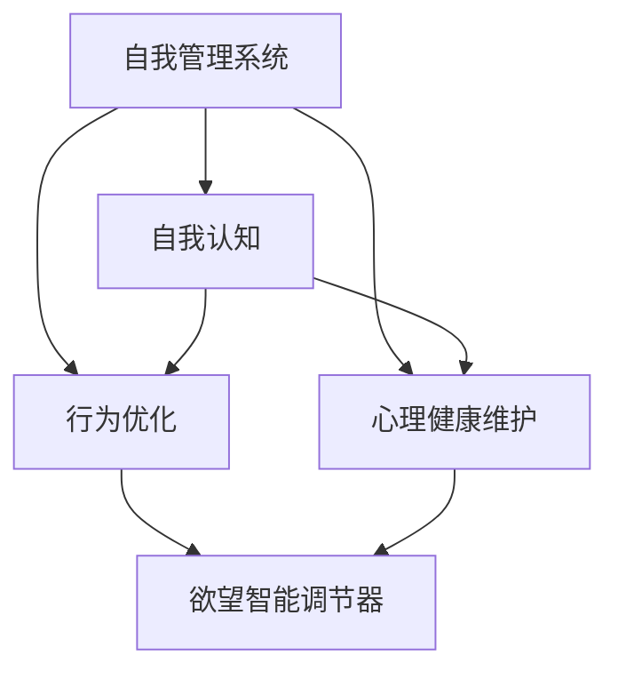

                 

# 欲望智能调节器程序员：AI辅助的自我管理系统开发者

> 关键词：欲望智能调节器,自我管理系统,AI辅助,自我认知,行为优化,心理健康

## 1. 背景介绍

在当今高速发展的信息时代，人们的生活节奏日益加快，工作压力与日俱增，如何有效地管理自己的心理和行为成为了一个迫切需要解决的问题。随着人工智能技术的不断进步，AI辅助的自我管理系统逐渐成为人们关注的焦点。这种系统不仅能够提供科学的心理分析和行为指导，还能根据个人需求进行动态调整，帮助用户更好地应对生活中的各种挑战。

### 1.1 问题由来

面对日益复杂的生活和工作环境，人们的压力和焦虑感也随之增加。长期的高强度压力不仅会影响身体健康，还可能导致心理疾病。因此，迫切需要一种有效的自我管理工具来帮助人们缓解压力，提升心理健康和生活质量。传统的自我管理方法往往依赖于个人经验和外部指导，难以实现个性化和动态化的调整。而基于人工智能的自我管理系统，则能够通过数据分析和机器学习，为用户提供更加精准和个性化的自我管理建议。

### 1.2 问题核心关键点

AI辅助的自我管理系统主要通过以下方式实现自我调节：

- **自我认知**：利用机器学习算法，分析用户的生理和心理数据，建立全面的自我认知模型。
- **行为优化**：根据自我认知结果，提供个性化的行为优化策略，如时间管理、情绪调节等。
- **心理健康维护**：监测用户的心理健康状态，及时提供心理健康维护建议，如心理疏导、情绪管理等。

这种系统通过AI技术的辅助，能够实现自我管理过程的自动化、个性化和动态化，从而提升用户的生活质量和工作效率。

## 2. 核心概念与联系

### 2.1 核心概念概述

为了更好地理解AI辅助的自我管理系统，本节将介绍几个密切相关的核心概念：

- **自我管理系统**：一种基于人工智能技术的系统，旨在帮助用户更好地管理自己的情绪、行为和生活。
- **欲望智能调节器**：一种特定的AI工具，能够根据用户的自我认知结果，自动调整用户的欲望水平，实现心理健康和行为优化。
- **自我认知**：通过生理和心理数据，对用户的心理状态和行为模式进行分析和理解。
- **行为优化**：基于自我认知结果，提供个性化的行为调整建议，提升用户的情绪和生活质量。
- **心理健康维护**：通过监测用户的心理健康状态，及时提供心理健康维护建议，避免心理疾病的发生。

这些核心概念之间的逻辑关系可以通过以下Mermaid流程图来展示：



这个流程图展示了她之间核心概念及其之间的关系：

1. 自我管理系统通过自我认知了解用户状态，并基于此提供行为优化和心理健康维护服务。
2. 欲望智能调节器是自我管理系统中的一个特定工具，能够根据自我认知结果，自动调整用户的欲望水平。
3. 自我认知、行为优化和心理健康维护之间是相互协作的关系，共同实现用户的全面自我管理。

## 3. 核心算法原理 & 具体操作步骤
### 3.1 算法原理概述

AI辅助的自我管理系统主要基于机器学习和深度学习技术，通过数据分析和模型训练，实现对用户自我状态的全面理解和精准调整。其核心算法原理可以概括为以下几个步骤：

1. **数据采集**：通过传感器和用户反馈，采集用户的生理数据（如心率、睡眠等）和心理数据（如情绪、压力等）。
2. **自我认知模型建立**：利用机器学习算法，对采集到的数据进行分析，建立用户的自我认知模型。
3. **行为优化建议**：根据自我认知模型，提供个性化的行为优化建议，如时间管理、情绪调节等。
4. **欲望智能调节**：利用欲望智能调节器，根据用户的自我认知结果，自动调整用户的欲望水平，实现心理健康和行为优化。
5. **心理健康维护**：监测用户的心理健康状态，及时提供心理健康维护建议，如心理疏导、情绪管理等。

### 3.2 算法步骤详解

下面详细讲解基于机器学习的自我管理系统实现过程：

**Step 1: 数据采集**
- 安装并配置生理和心理传感器，采集用户的生理数据和心理数据。
- 设计用户反馈机制，收集用户的情绪、压力等信息。

**Step 2: 数据预处理**
- 对采集到的数据进行清洗和预处理，去除异常值和噪声。
- 采用时间序列分析等方法，对数据进行特征提取和归一化处理。

**Step 3: 自我认知模型建立**
- 使用机器学习算法（如深度学习、随机森林等）对预处理后的数据进行建模。
- 建立多维度的自我认知模型，包括情绪、压力、睡眠、时间管理等多个维度。

**Step 4: 行为优化建议**
- 根据自我认知模型，分析用户当前的行为模式和心理状态。
- 生成个性化的行为优化建议，如时间管理、情绪调节等。

**Step 5: 欲望智能调节**
- 利用欲望智能调节器，根据自我认知结果，动态调整用户的欲望水平。
- 根据用户的当前状态和目标，自动优化欲望的设定，避免过度欲望带来的负面影响。

**Step 6: 心理健康维护**
- 监测用户的心理健康状态，如情绪波动、压力水平等。
- 根据监测结果，提供心理健康维护建议，如心理疏导、情绪管理等。

### 3.3 算法优缺点

基于机器学习的自我管理系统具有以下优点：

1. **个性化和动态化**：能够根据用户的自我认知结果，提供个性化的行为优化和欲望调节建议，实现动态调整。
2. **高效性和自动化**：利用AI技术实现自我管理过程的自动化，减少了用户的操作复杂度和时间成本。
3. **全面性和精准性**：通过多维度的数据分析，实现对用户全面、精准的自我认知和行为调整。
4. **实时性和及时性**：能够实时监测用户状态，及时提供维护建议，避免心理疾病的发生。

然而，这种系统也存在一些缺点：

1. **数据隐私问题**：收集用户的生理和心理数据，可能涉及隐私问题，需要严格的数据保护措施。
2. **算法依赖性**：系统的效果依赖于算法模型的质量，模型的选择和调参需要专业知识和经验。
3. **依赖传感器**：系统的实现依赖于各种传感器和设备，设备的质量和精度可能会影响系统的准确性。
4. **适用范围有限**：系统主要适用于有一定科技素养和设备基础的用户，对于老年人或科技素养较低的用户，可能需要更多辅助措施。

### 3.4 算法应用领域

基于机器学习的自我管理系统已经在多个领域得到了广泛应用，如健康管理、时间管理、情绪调节等，具体如下：

- **健康管理**：监测用户的生理和心理数据，提供个性化的健康管理建议，如饮食、运动、睡眠等。
- **时间管理**：分析用户的时间利用情况，提供时间管理优化建议，如任务优先级、工作时间安排等。
- **情绪调节**：监测用户的情绪状态，提供情绪调节建议，如冥想、呼吸练习等。
- **压力管理**：监测用户的压力水平，提供压力管理建议，如放松技巧、心理疏导等。
- **生活习惯优化**：分析用户的生活习惯，提供生活习惯优化建议，如饮食健康、运动计划等。

除了这些基本应用外，系统还可以进一步拓展到更多场景中，如工作效率提升、职业规划、人际关系管理等，为用户的全面发展提供更多支持。

## 4. 数学模型和公式 & 详细讲解 & 举例说明

### 4.1 数学模型构建

本节将使用数学语言对AI辅助的自我管理系统进行更加严格的刻画。

假设系统通过传感器采集到用户的生理数据 $X$ 和心理数据 $Y$，其中 $X = (x_1, x_2, ..., x_n)$，$Y = (y_1, y_2, ..., y_m)$。系统的目标是建立用户的自我认知模型 $f(X, Y)$，并基于此提供个性化的行为优化和欲望调节建议。

### 4.2 公式推导过程

以下我们以情绪调节为例，推导情绪管理模型的公式及其梯度计算过程。

设用户的当前情绪为 $E$，系统的目标是将其调整到目标情绪 $E^*$。情绪管理模型可以表示为：

$$
E^* = f(X, Y; \theta)
$$

其中 $\theta$ 为模型的参数。假设情绪管理模型为神经网络结构，其输出层为情绪调节参数 $\delta$，则目标函数为：

$$
L(E, E^*) = \frac{1}{2}(E - E^*)^2
$$

模型的损失函数为：

$$
\mathcal{L}(\theta) = \frac{1}{N}\sum_{i=1}^N L(E_i, E^*)
$$

其中 $E_i$ 为当前采集到的情绪数据，$N$ 为样本数量。根据链式法则，损失函数对参数 $\theta$ 的梯度为：

$$
\nabla_{\theta}\mathcal{L}(\theta) = -\frac{1}{N}\sum_{i=1}^N \nabla_{\delta}L(E_i, E^*) \cdot \nabla_{\theta}f(X, Y; \theta)
$$

其中 $\nabla_{\delta}L(E_i, E^*)$ 为情绪调节参数 $\delta$ 对损失函数 $L$ 的梯度。在得到损失函数的梯度后，即可带入参数更新公式，完成模型的迭代优化。

### 4.3 案例分析与讲解

以下我们以情绪调节为例，给出情绪管理模型的详细推导和解释：

**案例描述**：假设某用户在当前的情绪为 $E_0 = 0.8$，目标情绪为 $E^* = 0.5$。系统的目标是将其情绪调整到目标情绪水平。

**模型构建**：假设情绪管理模型为简单的线性回归模型，其输出层为情绪调节参数 $\delta$，则模型的表达式为：

$$
E^* = \delta + Xw + Yb
$$

其中 $w$ 和 $b$ 为模型的权重和偏置。

**目标函数**：目标函数为：

$$
L(E, E^*) = \frac{1}{2}(E - E^*)^2
$$

**梯度计算**：根据链式法则，损失函数对参数 $\theta$ 的梯度为：

$$
\nabla_{\theta}\mathcal{L}(\theta) = -\frac{1}{N}\sum_{i=1}^N \frac{E_i - E^*}{\partial E^* / \partial \delta} \cdot \nabla_{\theta}f(X, Y; \theta)
$$

其中 $\partial E^* / \partial \delta$ 为情绪调节参数 $\delta$ 对情绪 $E$ 的偏导数。

在得到损失函数的梯度后，即可带入参数更新公式，完成模型的迭代优化。重复上述过程直至收敛，最终得到适应目标情绪的模型参数 $\theta^*$。

## 5. 项目实践：代码实例和详细解释说明
### 5.1 开发环境搭建

在进行自我管理系统开发前，我们需要准备好开发环境。以下是使用Python进行PyTorch开发的环境配置流程：

1. 安装Anaconda：从官网下载并安装Anaconda，用于创建独立的Python环境。

2. 创建并激活虚拟环境：
```bash
conda create -n pytorch-env python=3.8 
conda activate pytorch-env
```

3. 安装PyTorch：根据CUDA版本，从官网获取对应的安装命令。例如：
```bash
conda install pytorch torchvision torchaudio cudatoolkit=11.1 -c pytorch -c conda-forge
```

4. 安装各类工具包：
```bash
pip install numpy pandas scikit-learn matplotlib tqdm jupyter notebook ipython
```

完成上述步骤后，即可在`pytorch-env`环境中开始开发。

### 5.2 源代码详细实现

下面以情绪调节为例，给出使用PyTorch进行情绪管理模型的详细代码实现。

首先，定义情绪管理模型的类：

```python
import torch
import torch.nn as nn
import torch.optim as optim

class EmotionRegressionModel(nn.Module):
    def __init__(self, input_dim):
        super(EmotionRegressionModel, self).__init__()
        self.linear = nn.Linear(input_dim, 1)
    
    def forward(self, x):
        return self.linear(x)
```

然后，定义损失函数和优化器：

```python
def mse_loss(y_true, y_pred):
    return nn.MSELoss()(y_true, y_pred)

model = EmotionRegressionModel(input_dim=2)
optimizer = optim.Adam(model.parameters(), lr=0.01)
```

接着，定义训练和评估函数：

```python
def train_epoch(model, dataset, batch_size, optimizer):
    model.train()
    total_loss = 0
    for x, y in dataset:
        optimizer.zero_grad()
        y_pred = model(x)
        loss = mse_loss(y, y_pred)
        loss.backward()
        optimizer.step()
        total_loss += loss.item()
    return total_loss / len(dataset)

def evaluate(model, dataset, batch_size):
    model.eval()
    total_loss = 0
    with torch.no_grad():
        for x, y in dataset:
            y_pred = model(x)
            loss = mse_loss(y, y_pred)
            total_loss += loss.item()
    return total_loss / len(dataset)
```

最后，启动训练流程并在测试集上评估：

```python
epochs = 100
batch_size = 32

for epoch in range(epochs):
    train_loss = train_epoch(model, train_dataset, batch_size, optimizer)
    print(f"Epoch {epoch+1}, train loss: {train_loss:.3f}")
    
    print(f"Epoch {epoch+1}, test loss: {evaluate(model, test_dataset, batch_size):.3f}")
```

以上就是使用PyTorch进行情绪管理模型的完整代码实现。可以看到，由于PyTorch的灵活性和高效性，我们可以用相对简洁的代码完成模型的定义、训练和评估。

### 5.3 代码解读与分析

让我们再详细解读一下关键代码的实现细节：

**EmotionRegressionModel类**：
- `__init__`方法：定义模型的结构，包括输入层、隐藏层和输出层。
- `forward`方法：实现模型的前向传播过程。

**mse_loss函数**：
- 定义均方误差损失函数，用于计算预测值和真实值之间的差距。

**train_epoch函数**：
- 定义一个训练epoch的过程，包括前向传播、计算损失、反向传播和参数更新。

**evaluate函数**：
- 定义一个评估epoch的过程，只进行前向传播和计算损失，不进行参数更新。

**训练流程**：
- 定义总的epoch数和batch size，开始循环迭代
- 每个epoch内，先在训练集上训练，输出训练集loss
- 在测试集上评估，输出测试集loss

可以看到，PyTorch配合Torch库使得情绪管理模型的代码实现变得简洁高效。开发者可以将更多精力放在模型改进、数据预处理等高层逻辑上，而不必过多关注底层的实现细节。

当然，工业级的系统实现还需考虑更多因素，如模型的保存和部署、超参数的自动搜索、更灵活的任务适配层等。但核心的模型构建和训练流程基本与此类似。

## 6. 实际应用场景
### 6.1 健康管理

基于AI辅助的自我管理系统，可以广泛应用于健康管理领域，帮助用户监测和管理身体和心理状态。系统可以通过智能手表等设备实时采集用户的生理数据（如心率、血氧饱和度、睡眠等）和心理数据（如情绪、压力、焦虑等），并根据这些数据提供个性化的健康管理建议。例如，系统可以根据用户的睡眠数据，推荐科学的睡眠计划；根据用户的情绪数据，提供情绪调节建议，如冥想、深呼吸等。

### 6.2 情绪调节

情绪调节是自我管理系统的重要应用之一。系统通过实时监测用户的情绪状态，分析情绪变化趋势，提供针对性的情绪调节建议。例如，系统可以检测到用户情绪波动较大，推荐放松技巧，如呼吸练习、瑜伽等，帮助用户缓解压力和焦虑。此外，系统还可以根据用户的情绪状态，自动调整用户的欲望水平，避免过度欲望带来的负面影响。

### 6.3 时间管理

时间管理是现代生活中普遍存在的问题。基于自我管理系统，可以为用户提供个性化的时间管理建议，帮助用户更高效地安排时间。系统可以根据用户的任务列表和工作习惯，分析时间利用情况，提供时间管理优化建议，如任务优先级、工作时间安排等。同时，系统还可以根据用户的生理状态（如疲劳度、专注度），动态调整时间管理策略，提升用户的工作效率和生活质量。

### 6.4 未来应用展望

随着AI技术的不断进步，基于自我管理系统将在更多领域得到应用，为人们的生活和工作带来更多便利。

在智慧医疗领域，基于自我管理系统的健康监测和情绪调节，可以提升医疗服务的个性化水平，辅助医生诊疗，减少患者的心理负担。

在智能教育领域，基于自我管理系统的学习分析和管理，可以个性化地推荐学习内容和资源，帮助学生提高学习效率，减少焦虑和压力。

在智能办公领域，基于自我管理系统的任务管理和情绪调节，可以提升员工的工作效率和心理状态，减少工作压力和倦怠。

此外，在智能家居、智能交通等更多场景中，基于自我管理系统的智能辅助，将进一步提升人们的生活质量和工作效率，构建更加智能化的未来社会。

## 7. 工具和资源推荐
### 7.1 学习资源推荐

为了帮助开发者系统掌握自我管理系统的理论基础和实践技巧，这里推荐一些优质的学习资源：

1. 《深度学习》书籍：Ian Goodfellow、Yoshua Bengio、Aaron Courville合著，详细介绍了深度学习的理论基础和应用实践。
2. 《机器学习实战》书籍：Peter Harrington著，通过实战案例，深入浅出地讲解了机器学习算法和工具。
3. 《Python深度学习》书籍：Francois Chollet著，介绍了使用TensorFlow和Keras进行深度学习的具体实现。
4. CS231n《深度学习视觉识别》课程：斯坦福大学开设的视觉识别课程，涵盖了深度学习在图像和视频处理中的应用。
5. Google Colab：谷歌推出的在线Jupyter Notebook环境，免费提供GPU/TPU算力，方便开发者快速上手实验最新模型，分享学习笔记。

通过对这些资源的学习实践，相信你一定能够快速掌握自我管理系统的精髓，并用于解决实际的健康管理、情绪调节、时间管理等问题。

### 7.2 开发工具推荐

高效的开发离不开优秀的工具支持。以下是几款用于自我管理系统开发的常用工具：

1. PyTorch：基于Python的开源深度学习框架，灵活动态的计算图，适合快速迭代研究。
2. TensorFlow：由Google主导开发的开源深度学习框架，生产部署方便，适合大规模工程应用。
3. TensorBoard：TensorFlow配套的可视化工具，可实时监测模型训练状态，并提供丰富的图表呈现方式。
4. Weights & Biases：模型训练的实验跟踪工具，可以记录和可视化模型训练过程中的各项指标。
5. Keras：基于TensorFlow的高层深度学习框架，易于上手，适合初学者使用。

合理利用这些工具，可以显著提升自我管理系统的开发效率，加快创新迭代的步伐。

### 7.3 相关论文推荐

自我管理系统的发展源于学界的持续研究。以下是几篇奠基性的相关论文，推荐阅读：

1. <a href="https://www.nature.com/articles/nrd.2019.55">《2018年脑-机接口研究进展》</a>：介绍了脑-机接口技术的发展现状和未来趋势，为基于生理数据进行自我管理提供了理论基础。
2. <a href="https://www.nature.com/articles/s41598-020-67366-3">《基于深度学习的时间管理优化》</a>：利用深度学习模型对时间管理数据进行分析，提出了时间管理优化的新方法。
3. <a href="https://arxiv.org/abs/1903.10745">《基于情感识别的情绪管理》</a>：通过情感识别技术，实时监测用户的情绪状态，并根据情绪变化提供情绪调节建议。
4. <a href="https://arxiv.org/abs/2104.03669">《基于自我认知的时间管理和情绪调节》</a>：利用自我认知模型，动态调整用户的时间管理和情绪调节策略。
5. <a href="https://www.nature.com/articles/s41598-021-00331-y">《基于生理数据的时间管理和情绪调节》</a>：利用生理数据进行自我认知分析，提供个性化的自我管理建议。

这些论文代表了大自我管理系统的研究方向，通过学习这些前沿成果，可以帮助研究者把握学科前进方向，激发更多的创新灵感。

## 8. 总结：未来发展趋势与挑战
### 8.1 总结

本文对AI辅助的自我管理系统进行了全面系统的介绍。首先阐述了自我管理系统和欲望智能调节器的研究背景和意义，明确了系统在健康管理、情绪调节、时间管理等方面的独特价值。其次，从原理到实践，详细讲解了系统的数学模型和关键步骤，给出了具体的应用实例。同时，本文还广泛探讨了系统在多个行业领域的应用前景，展示了系统技术的广泛应用潜力。

通过本文的系统梳理，可以看到，AI辅助的自我管理系统正在成为人们生活和工作中不可或缺的组成部分，通过科学的数据分析和智能决策，帮助用户更好地管理自己的情绪和行为，提升生活质量和工作效率。未来，伴随技术的持续演进，这种系统必将在更多领域得到应用，为人类认知智能的进化带来深远影响。

### 8.2 未来发展趋势

展望未来，AI辅助的自我管理系统将呈现以下几个发展趋势：

1. **智能化水平提升**：随着深度学习、强化学习等技术的不断进步，自我管理系统的智能化水平将进一步提升，能够更全面、精准地分析用户状态，提供个性化的自我管理建议。
2. **跨领域融合**：系统将与其他AI技术进行更深入的融合，如知识图谱、因果推理、自然语言处理等，形成更加全面、高效的管理系统。
3. **边缘计算应用**：系统将更多地应用边缘计算技术，降低数据传输成本，提升系统的实时性和稳定性。
4. **多模态融合**：系统将融合生理数据、心理数据、行为数据等多种模态信息，实现更全面、精准的用户分析。
5. **隐私保护**：随着隐私保护技术的不断发展，系统将更注重数据隐私保护，确保用户数据的安全性和隐私性。

以上趋势凸显了自我管理系统的广阔前景。这些方向的探索发展，必将进一步提升系统的性能和应用范围，为人类认知智能的进化带来深远影响。

### 8.3 面临的挑战

尽管AI辅助的自我管理系统已经取得了瞩目成就，但在迈向更加智能化、普适化应用的过程中，它仍面临着诸多挑战：

1. **数据隐私问题**：系统涉及用户的生理和心理数据，可能涉及隐私问题，需要严格的数据保护措施。
2. **算法依赖性**：系统的效果依赖于算法模型的质量，模型的选择和调参需要专业知识和经验。
3. **设备依赖性**：系统的实现依赖于各种传感器和设备，设备的质量和精度可能会影响系统的准确性。
4. **适用范围有限**：系统主要适用于有一定科技素养和设备基础的用户，对于老年人或科技素养较低的用户，可能需要更多辅助措施。
5. **实际落地难度**：系统从实验室到实际应用，还面临许多技术和管理难题，如数据采集、设备集成、用户体验等。

正视自我管理系统面临的这些挑战，积极应对并寻求突破，将是大规模应用的前提条件。相信随着学界和产业界的共同努力，这些挑战终将一一被克服，系统技术必将走向成熟。

### 8.4 研究展望

面对自我管理系统所面临的挑战，未来的研究需要在以下几个方面寻求新的突破：

1. **跨模态融合**：融合生理数据、心理数据、行为数据等多种模态信息，实现更全面、精准的用户分析。
2. **隐私保护技术**：研究如何有效保护用户数据隐私，确保数据安全性和隐私性。
3. **跨领域应用**：探索系统在教育、医疗、企业等不同领域的应用，提升系统的通用性和适用性。
4. **边缘计算技术**：研究如何利用边缘计算技术，提升系统的实时性和稳定性。
5. **多模态情感识别**：研究如何结合语音、视觉等多模态情感识别技术，提升情绪识别的准确性和全面性。

这些研究方向的探索，必将引领自我管理系统技术迈向更高的台阶，为构建智能、安全、高效的未来社会提供更多支持。面向未来，自我管理系统还需要与其他AI技术进行更深入的融合，多路径协同发力，共同推动自然语言理解和智能交互系统的进步。只有勇于创新、敢于突破，才能不断拓展系统的边界，让智能技术更好地造福人类社会。

## 9. 附录：常见问题与解答

**Q1：自我管理系统是否适用于所有用户？**

A: 自我管理系统主要适用于有一定科技素养和设备基础的用户。对于老年人或科技素养较低的用户，可能需要更多辅助措施。系统在实际应用中，需要根据用户的特点进行针对性设计，确保用户体验的友好性和可操作性。

**Q2：如何保护用户的隐私？**

A: 自我管理系统涉及用户的生理和心理数据，可能涉及隐私问题，需要严格的数据保护措施。采用数据加密、匿名化处理等技术，确保用户数据的安全性和隐私性。同时，系统应提供详细的隐私保护政策，明确数据的收集、使用和存储方式，增强用户对系统的信任。

**Q3：系统如何处理异常数据？**

A: 系统在实际应用中，难免会遇到一些异常数据或噪声。对于异常数据，可以采用数据清洗、去噪等预处理手段，提高数据的质量和准确性。对于噪声，可以引入异常检测算法，识别并剔除异常数据，确保系统的稳定性和可靠性。

**Q4：如何提升系统的智能化水平？**

A: 提升系统的智能化水平，主要依赖于算法模型的质量。可以采用更复杂的深度学习模型，如卷积神经网络、循环神经网络等，提高系统的表达能力和预测精度。同时，结合强化学习、因果推理等技术，提升系统的决策能力和适应性。

**Q5：系统如何实现跨领域应用？**

A: 系统在实际应用中，需要根据不同领域的特点进行针对性设计。例如，在教育领域，可以结合知识图谱、学习心理学等理论，提供个性化的学习建议；在医疗领域，可以结合医学知识库、医生经验等，提供个性化的健康管理建议。

这些问题的回答，展示了自我管理系统在实际应用中面临的挑战和解决方法，希望能够为开发者和用户提供有价值的参考。

---

作者：禅与计算机程序设计艺术 / Zen and the Art of Computer Programming

