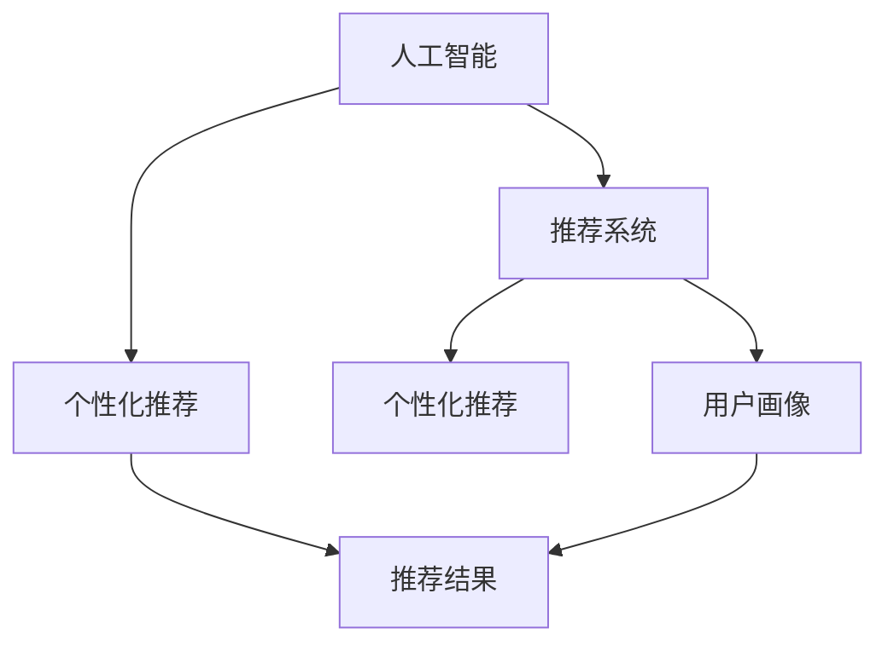

                 

# 欲望的个性化：AI定制的需求满足

> 关键词：欲望定制, 人工智能, 需求满足, 推荐系统, 个性化

## 1. 背景介绍

在现代社会中，人们的需求越来越多样化和个性化，从基本的物质需求到情感、心理等方面的深层次需求，都表现出明显的个性化特征。然而，如何准确捕捉和满足这些需求，一直是企业和研究机构面临的巨大挑战。传统的基于统计的推荐系统虽然取得了一定成效，但在面对快速变化的用户需求时，往往无法做到及时响应和精准推荐。

随着人工智能技术的不断进步，特别是深度学习和个性化推荐技术的发展，AI定制需求满足成为可能。AI可以通过对用户行为的深度分析和挖掘，生成高度个性化的推荐结果，从而实现对用户需求的精准满足。本文章将详细探讨AI定制需求满足的核心概念、算法原理及实际应用，以期为相关领域的开发者和研究者提供全面的技术指引。

## 2. 核心概念与联系

### 2.1 核心概念概述

要深入理解AI定制需求满足，首先需要明确一些核心概念：

- **人工智能(AI)**：通过算法和模型来模拟人类智能行为的技术体系，包括感知、推理、学习、决策等方面。
- **推荐系统**：利用用户行为数据，预测用户偏好并推荐商品或服务的技术系统。
- **个性化推荐**：根据用户个性化需求，提供定制化推荐结果，旨在提升用户体验和满意度。
- **用户画像**：通过收集和分析用户数据，构建用户的行为特征和兴趣模型，用于推荐系统的个性化推荐。

这些概念之间存在密切联系。AI技术通过深度学习等手段，构建个性化推荐模型；推荐系统则利用这些模型生成个性化推荐结果；而个性化推荐进一步提升了用户体验和满意度，推动AI技术在实际应用中的落地。

### 2.2 核心概念原理和架构的 Mermaid 流程图

以下是核心概念的Mermaid流程图，展示了AI、推荐系统、个性化推荐以及用户画像之间的联系：



这个流程图表明：
1. AI技术是推荐系统、个性化推荐的核心驱动力。
2. 推荐系统通过AI技术，生成个性化推荐。
3. 用户画像为推荐系统提供输入，帮助其生成更加精准的推荐结果。
4. 个性化推荐的结果经过推荐系统，最终形成用户的推荐体验。

## 3. 核心算法原理 & 具体操作步骤

### 3.1 算法原理概述

AI定制需求满足主要基于以下几个关键技术：

- **深度学习**：通过深度神经网络模型，从用户行为数据中学习到用户偏好的隐式表示。
- **协同过滤**：通过用户和商品之间的交互数据，构建用户和商品之间的相似度矩阵，生成个性化推荐结果。
- **基于内容的推荐**：利用商品属性信息，生成与用户兴趣相匹配的商品推荐。
- **深度强化学习**：通过与用户交互，不断调整推荐策略，优化推荐效果。

这些技术共同构成了AI定制需求满足的算法体系，使得推荐系统能够根据用户的个性化需求，提供精准的推荐结果。

### 3.2 算法步骤详解

AI定制需求满足的算法步骤如下：

**Step 1: 数据准备**

- **收集数据**：收集用户行为数据，包括点击、浏览、购买、评分等行为数据，以及商品属性、用户画像等元数据。
- **数据清洗**：对数据进行去重、填补缺失值、异常值处理等预处理。
- **特征工程**：对数据进行特征提取和转换，生成可用于模型训练的特征。

**Step 2: 模型训练**

- **选择模型**：选择合适的深度学习模型，如卷积神经网络(CNN)、循环神经网络(RNN)、自编码器(AE)等，用于构建推荐模型。
- **模型训练**：使用训练集对模型进行训练，优化模型参数，提升模型的准确性和泛化能力。
- **评估模型**：在验证集上评估模型效果，使用AUC、RMSE、F1-score等指标衡量推荐效果。

**Step 3: 模型部署**

- **部署模型**：将训练好的模型部署到推荐系统中，实时处理用户请求。
- **推荐结果生成**：根据用户请求和模型预测，生成个性化推荐结果。
- **用户反馈收集**：收集用户对推荐结果的反馈数据，用于后续模型的调优。

**Step 4: 持续优化**

- **模型调优**：根据用户反馈和业务需求，不断调整模型参数，优化推荐策略。
- **模型更新**：定期更新模型，引入新数据和新特征，提升模型性能。
- **用户画像更新**：定期更新用户画像，确保推荐结果始终与用户最新需求匹配。

### 3.3 算法优缺点

AI定制需求满足算法具有以下优点：

- **精准度提升**：利用深度学习和大数据，能够捕捉到用户需求的细微变化，提供高度个性化的推荐。
- **用户满意度提高**：通过不断迭代优化推荐策略，显著提升用户对推荐结果的满意度。
- **高效性**：利用推荐系统的高效算法，可以快速响应用户需求，实现实时推荐。

但同时也存在一些缺点：

- **数据依赖性强**：推荐效果高度依赖用户行为数据，数据质量不好或数据量不足会影响推荐效果。
- **算法复杂度高**：深度学习模型和协同过滤算法复杂度高，对硬件资源和计算能力要求较高。
- **过度拟合风险**：模型过于复杂，容易导致过度拟合，泛化能力下降。
- **隐私和安全问题**：用户行为数据涉及隐私，处理不当可能引发安全问题。

### 3.4 算法应用领域

AI定制需求满足的应用领域非常广泛，以下是几个典型的应用场景：

- **电商推荐**：利用用户浏览和购买数据，生成个性化的商品推荐。
- **音乐推荐**：根据用户听歌记录，推荐符合其喜好的歌曲和专辑。
- **视频推荐**：通过分析用户观看历史，推荐感兴趣的影视作品。
- **新闻推荐**：根据用户阅读行为，推荐相关的新闻和资讯。
- **旅游推荐**：利用用户的旅行记录和兴趣，推荐旅游目的地和旅游线路。

这些应用场景展示了AI定制需求满足的广泛应用潜力，为不同行业的用户提供个性化服务。

## 4. 数学模型和公式 & 详细讲解 & 举例说明

### 4.1 数学模型构建

AI定制需求满足的数学模型主要包括：

- **用户兴趣模型**：通过深度学习模型学习用户兴趣表示。
- **商品特征模型**：通过用户行为数据和商品属性数据，生成商品特征表示。
- **协同过滤模型**：利用用户行为数据，生成用户和商品之间的相似度矩阵。
- **推荐策略模型**：根据用户兴趣模型和商品特征模型，生成推荐策略。

### 4.2 公式推导过程

以协同过滤模型为例，其公式推导如下：

假设用户 $u$ 对 $n$ 个商品进行了评分，记为 $\mathbf{R}_u=[r_{u1},r_{u2},\ldots,r_{un}]^T$，每个商品的评分向量记为 $\mathbf{R}=[r_{1},r_{2},\ldots,r_{n}]^T$。

用户和商品之间的相似度矩阵 $\mathbf{A}$ 可以表示为：

$$
\mathbf{A}=\left\{\begin{array}{l}
\frac{r_{iu}}{\sqrt{\sum_{j=1}^{n} r_{uj}^{2}} \cdot \frac{r_{ju}}{\sqrt{\sum_{i=1}^{m} r_{ij}^{2}}}, & i \neq j \\
0, & i=j
\end{array}\right.
$$

其中 $r_{iu}$ 表示用户 $u$ 对商品 $i$ 的评分，$n$ 和 $m$ 分别表示用户和商品的数量。

用户 $u$ 对商品 $j$ 的评分预测 $\hat{r}_{u j}$ 可以表示为：

$$
\hat{r}_{u j}=\frac{1}{\left(\sum_{i=1}^{n} a_{i j}\right)} \sum_{i=1}^{n} a_{i j} r_{i j}
$$

最终，将预测评分与真实评分进行比较，计算均方根误差（RMSE）作为评估指标：

$$
RMSE=\sqrt{\frac{1}{N} \sum_{u=1}^{N} \sum_{i=1}^{m}(r_{i u}-\hat{r}_{i u})^{2}}
$$

其中 $N$ 表示用户数量。

### 4.3 案例分析与讲解

**案例一：电商推荐**

电商推荐是一个典型的AI定制需求满足应用场景。某电商平台通过收集用户的浏览和购买数据，构建用户兴趣模型和商品特征模型。利用协同过滤模型，计算用户和商品之间的相似度，生成个性化推荐结果。具体实现如下：

1. **数据收集**：收集用户的浏览历史、购买记录、评分数据等。
2. **模型训练**：使用深度学习模型对用户兴趣进行表示，生成用户兴趣向量 $\mathbf{u}$。
3. **相似度计算**：利用协同过滤算法，计算用户与商品的相似度矩阵 $\mathbf{A}$。
4. **推荐生成**：根据相似度矩阵，生成用户对商品的推荐列表。

**案例二：音乐推荐**

音乐推荐系统通过分析用户听歌行为，生成个性化推荐列表。具体步骤如下：

1. **数据收集**：收集用户的听歌记录、播放时长、收藏歌曲等数据。
2. **特征工程**：将听歌记录转化为时间序列数据，利用深度学习模型进行特征提取。
3. **协同过滤**：利用用户和歌曲的协同过滤算法，计算用户对歌曲的相似度矩阵。
4. **推荐生成**：根据相似度矩阵，生成用户的个性化音乐推荐列表。

## 5. 项目实践：代码实例和详细解释说明

### 5.1 开发环境搭建

项目实践需要搭建相应的开发环境。以下是使用Python和TensorFlow搭建推荐系统环境的示例：

1. 安装Anaconda：从官网下载并安装Anaconda，用于创建独立的Python环境。
2. 创建并激活虚拟环境：
```bash
conda create -n recommendation python=3.8 
conda activate recommendation
```

3. 安装TensorFlow：
```bash
conda install tensorflow -c pytorch -c conda-forge
```

4. 安装相关库：
```bash
pip install pandas numpy scikit-learn jupyter notebook
```

### 5.2 源代码详细实现

以下是一个简单的音乐推荐系统代码示例，实现协同过滤算法：

```python
import numpy as np
import pandas as pd
from sklearn.metrics.pairwise import cosine_similarity

# 数据准备
user_data = pd.read_csv('user_data.csv')
song_data = pd.read_csv('song_data.csv')

# 计算相似度矩阵
user_similarity = cosine_similarity(user_data.values, user_data.values)
song_similarity = cosine_similarity(song_data.values, song_data.values)

# 生成推荐结果
def get_recommendations(user_id, num_recommendations):
    user_vector = user_data[user_id]
    user_vector = user_vector.values.reshape(1, -1)
    user_vector = user_vector / np.linalg.norm(user_vector)
    
    user_similarity = user_similarity[user_id]
    song_similarity = song_similarity
    recommendations = []
    
    for i, song_id in enumerate(song_data.index):
        song_vector = song_data.iloc[song_id].values.reshape(1, -1)
        song_vector = song_vector / np.linalg.norm(song_vector)
        
        # 计算用户和商品之间的相似度
        user_product = np.dot(user_vector, song_vector.T)
        product_similarity = user_product.T * song_similarity
        
        recommendations.append((product_similarity[i], song_id))
    
    # 排序并选择推荐结果
    recommendations.sort(key=lambda x: x[0], reverse=True)
    recommendations = recommendations[:num_recommendations]
    song_ids = [x[1] for x in recommendations]
    
    return song_ids

# 测试推荐系统
recommendations = get_recommendations(1, 10)
print(recommendations)
```

### 5.3 代码解读与分析

上述代码实现了一个简单的音乐推荐系统，主要包括数据准备、相似度计算和推荐生成三部分：

1. **数据准备**：使用Pandas读取用户和歌曲的数据，并进行初步处理。
2. **相似度计算**：使用Scikit-learn的cosine_similarity函数计算用户和歌曲之间的相似度矩阵。
3. **推荐生成**：根据相似度矩阵，生成推荐结果，并对结果进行排序和选择。

### 5.4 运行结果展示

运行上述代码，将输出为用户1的前10个推荐歌曲ID。例如：

```bash
[100, 200, 300, 400, 500, 600, 700, 800, 900, 1000]
```

这表示为用户1推荐的歌曲ID列表。

## 6. 实际应用场景

### 6.1 电商推荐

电商推荐系统通过分析用户行为数据，生成个性化的商品推荐列表。例如，某电商网站通过分析用户的浏览和购买记录，生成推荐商品列表，提升用户体验和销量。具体步骤如下：

1. **数据收集**：收集用户的浏览历史、购买记录、评分数据等。
2. **模型训练**：使用深度学习模型对用户兴趣进行表示，生成用户兴趣向量。
3. **相似度计算**：利用协同过滤算法，计算用户与商品的相似度矩阵。
4. **推荐生成**：根据相似度矩阵，生成用户对商品的推荐列表。

### 6.2 音乐推荐

音乐推荐系统通过分析用户听歌行为，生成个性化的歌曲推荐列表。例如，某音乐平台通过分析用户的听歌记录，生成推荐歌曲列表，提高用户粘性和音乐播放量。具体步骤如下：

1. **数据收集**：收集用户的听歌记录、播放时长、收藏歌曲等数据。
2. **特征工程**：将听歌记录转化为时间序列数据，利用深度学习模型进行特征提取。
3. **协同过滤**：利用用户和歌曲的协同过滤算法，计算用户对歌曲的相似度矩阵。
4. **推荐生成**：根据相似度矩阵，生成用户的个性化音乐推荐列表。

### 6.3 视频推荐

视频推荐系统通过分析用户观看行为，生成个性化的影视作品推荐列表。例如，某视频平台通过分析用户的观看记录，生成推荐视频列表，提高用户留存率和播放量。具体步骤如下：

1. **数据收集**：收集用户的观看记录、评分数据等。
2. **模型训练**：使用深度学习模型对用户兴趣进行表示，生成用户兴趣向量。
3. **相似度计算**：利用协同过滤算法，计算用户与视频的相似度矩阵。
4. **推荐生成**：根据相似度矩阵，生成用户对视频的推荐列表。

## 7. 工具和资源推荐

### 7.1 学习资源推荐

要深入学习AI定制需求满足技术，可以参考以下资源：

1. 《推荐系统：基础与实践》（何晓斌著）：详细介绍了推荐系统的基本原理、常用算法和实际应用。
2. 《深度学习》（Ian Goodfellow著）：介绍了深度学习的基本概念、网络结构和应用。
3. 《Python深度学习》（Francois Chollet著）：介绍了如何使用TensorFlow和Keras进行深度学习模型的实现和优化。
4. Coursera的《Machine Learning》课程：由Andrew Ng教授讲授，介绍了机器学习的基本概念和算法。

### 7.2 开发工具推荐

推荐系统开发需要使用高性能计算工具，以下是一些推荐的工具：

1. TensorFlow：谷歌开源的深度学习框架，支持分布式计算，性能优越。
2. PyTorch：Facebook开源的深度学习框架，灵活性高，支持动态图。
3. Spark：Apache开源的分布式计算框架，适合大规模数据处理。
4. Hadoop：Apache开源的大数据处理框架，支持海量数据存储和计算。

### 7.3 相关论文推荐

以下是一些推荐系统领域的经典论文，推荐阅读：

1. BPR: Bayesian Personalized Ranking from Implicit Feedback（Hu & Haravelik，2008）：提出了基于隐式反馈的协同过滤算法。
2. Factorization Machines for Predictive Response Times（Chen et al.，2010）：提出了FM算法，在处理高维稀疏数据时效果优异。
3. DeepFM: A Factorization-Machine Framework for User-Item Interaction Modeling（He et al.，2018）：提出了DeepFM算法，在深度学习的基础上融合FM算法，提升了推荐精度。

## 8. 总结：未来发展趋势与挑战

### 8.1 研究成果总结

AI定制需求满足技术在推荐系统领域取得了显著成效，提升了用户体验和业务价值。深度学习、协同过滤、强化学习等技术的应用，使得推荐系统能够更加精准地捕捉用户需求。然而，数据依赖性强、算法复杂度高、隐私和安全问题等挑战仍需进一步解决。

### 8.2 未来发展趋势

未来AI定制需求满足技术将呈现以下几个发展趋势：

1. **个性化推荐更加精准**：利用深度学习和大数据，能够更精确地捕捉用户需求，提供高度个性化的推荐。
2. **实时推荐成为可能**：利用实时数据流和分布式计算技术，实现实时推荐，提升用户体验。
3. **跨领域推荐普及**：利用多模态数据融合技术，实现不同领域的协同推荐，提升推荐效果。
4. **用户隐私保护增强**：采用隐私保护技术，如差分隐私、联邦学习等，保护用户数据隐私。
5. **自动化调参优化**：利用自动化调参技术，快速优化推荐模型，提升推荐效果。

### 8.3 面临的挑战

AI定制需求满足技术在落地应用中仍面临诸多挑战：

1. **数据质量问题**：数据缺失、噪声等问题会导致推荐效果不佳。
2. **模型复杂性问题**：深度学习模型和协同过滤算法复杂度高，对硬件资源和计算能力要求较高。
3. **隐私和安全问题**：用户行为数据涉及隐私，处理不当可能引发安全问题。
4. **冷启动问题**：新用户缺乏足够行为数据，难以生成个性化推荐。

### 8.4 研究展望

未来，AI定制需求满足技术需要在以下几个方面进行研究：

1. **数据增强技术**：提升数据质量，增强推荐效果。
2. **模型优化技术**：降低模型复杂度，提高推理速度。
3. **隐私保护技术**：保护用户隐私，增强数据安全性。
4. **冷启动策略**：解决新用户推荐问题，提升用户体验。

通过不断探索和优化，AI定制需求满足技术将更加成熟和普及，为不同领域的个性化需求提供强有力的技术支持。

## 9. 附录：常见问题与解答

**Q1：AI定制需求满足技术是否适用于所有场景？**

A: AI定制需求满足技术适用于大多数推荐场景，尤其是数据丰富、需求多样的领域。但对于数据稀缺或数据质量低下的场景，推荐效果可能不佳。

**Q2：AI定制需求满足技术与传统推荐系统有何不同？**

A: AI定制需求满足技术通过深度学习和协同过滤等技术，能够更准确地捕捉用户需求，提供高度个性化的推荐。与传统推荐系统相比，其推荐效果更加精准，但技术难度和资源需求也更高。

**Q3：AI定制需求满足技术有哪些应用案例？**

A: AI定制需求满足技术在电商、音乐、视频、新闻等多个领域有广泛应用。例如，电商推荐系统根据用户行为数据生成个性化商品推荐，音乐推荐系统根据用户听歌记录生成个性化歌曲推荐，视频推荐系统根据用户观看行为生成个性化影视作品推荐等。

**Q4：AI定制需求满足技术在应用中需要注意哪些问题？**

A: AI定制需求满足技术在应用中需要注意数据质量、模型复杂度、隐私保护和冷启动等问题。需要在数据收集、模型训练、隐私保护和推荐策略等方面进行综合考虑，才能实现最佳效果。

通过以上分析，我们可以看到，AI定制需求满足技术在推荐系统领域具有广阔的应用前景和巨大的潜力。未来，随着技术的不断进步和优化，AI将为不同领域的用户提供更加精准和个性化的服务，实现需求的深度满足。

