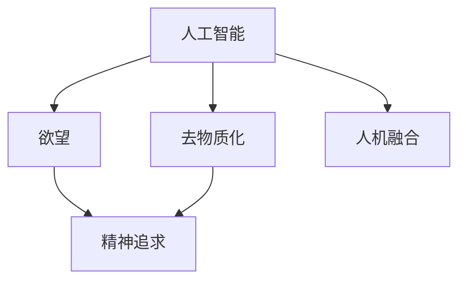

                 

# 欲望的去物质化：AI时代的精神追求

> 关键词：人工智能,去物质化,精神追求,人类进化,人机融合

## 1. 背景介绍

### 1.1 问题由来
随着人工智能（AI）技术的快速发展，我们开始进入了一个崭新的时代——AI时代。在这一时代，AI不仅改变了我们的工作方式，也深刻地影响了我们的精神生活。当我们享受着技术带来的便利和效率时，也开始思考：AI究竟带给我们什么？我们如何与AI共存？

在AI时代，欲望的去物质化成为了一个重要的话题。欲望，这个与人类精神紧密相关的概念，在AI时代有了新的内涵和表现形式。去物质化，指的是从物质层面到精神层面的转化，即通过AI技术，使得欲望的实现不再依赖于物质条件，而是更多地依赖于精神追求。

### 1.2 问题核心关键点
1. **欲望去物质化的定义**：即通过AI技术，实现欲望的满足不再依赖于物质条件，而是通过精神上的追求和实现。
2. **AI时代的影响**：AI技术的发展，极大地改变了我们的生活方式和工作模式，带来了全新的精神追求和价值取向。
3. **去物质化的意义**：去物质化不仅是一种生活方式的转变，更是人类精神追求的一种升华。

### 1.3 问题研究意义
探讨AI时代欲望去物质化的过程，对于理解人类精神生活的演变、推动技术与人文的融合、构建和谐社会具有重要意义。它不仅帮助我们更好地适应技术变革，也促使我们思考如何通过技术手段实现更高级的精神追求。

## 2. 核心概念与联系

### 2.1 核心概念概述

为更好地理解欲望去物质化的概念，本节将介绍几个密切相关的核心概念：

- **人工智能（AI）**：通过算法、数据和计算能力，使计算机系统具备人类智能的一系列技术。
- **欲望**：指人类内心深处对于某种状态、事物或体验的强烈愿望。
- **去物质化**：指从物质层面到精神层面的转化，即通过技术手段实现欲望的满足不再依赖于物质条件。
- **精神追求**：指人类对于精神上的满足、实现和提升的追求。
- **人机融合**：指人类与机器在信息、智能、情感等方面的深度融合。

这些核心概念之间的逻辑关系可以通过以下Mermaid流程图来展示：



这个流程图展示了大语言模型的核心概念及其之间的关系：

1. 人工智能通过算法和技术，实现对人类欲望的捕捉和响应。
2. 去物质化是人工智能的终极目标，即通过技术手段，使得欲望的实现不再依赖于物质条件。
3. 精神追求是人类对于高级、深层次需求的追求，与去物质化密切相关。
4. 人机融合是人类与机器在智能、情感等方面的深度融合，是实现欲望去物质化的重要途径。

## 3. 核心算法原理 & 具体操作步骤

### 3.1 算法原理概述

欲望去物质化的实现，本质上是一个从物质到精神的转化过程。在这一过程中，AI技术扮演着重要的角色。AI通过算法、数据和计算能力，捕捉和分析人类的欲望，从而指导机器做出响应，实现欲望的满足。

形式化地，假设欲望为 $D$，AI技术为 $A$，则欲望去物质化的过程可以表示为：

$$
D' = A(D)
$$

其中 $D'$ 为实现后的新欲望，代表了通过AI技术处理后的去物质化欲望。

### 3.2 算法步骤详解

欲望去物质化的实现，通常包括以下几个关键步骤：

**Step 1: 数据采集与处理**
- 收集和整理与欲望相关的数据，包括文本、图像、语音等。
- 使用NLP、图像处理、语音识别等技术，对数据进行预处理和特征提取。

**Step 2: 模型训练与优化**
- 使用深度学习模型，如卷积神经网络（CNN）、循环神经网络（RNN）、Transformer等，对数据进行训练。
- 在模型训练过程中，引入正则化、Dropout、Early Stopping等技术，避免过拟合。
- 使用Adam、SGD等优化算法，优化模型参数，提升模型性能。

**Step 3: 欲望捕捉与分析**
- 通过模型对输入数据进行分析和处理，捕捉人类的欲望。
- 对欲望进行分类、聚类、情感分析等处理，提取欲望的核心特征。

**Step 4: 欲望实现与反馈**
- 根据捕捉到的欲望，设计并实现相应的AI技术方案，如生成内容、推荐系统、智能交互等。
- 对实现后的结果进行反馈和调整，优化欲望的实现过程。

**Step 5: 持续优化与更新**
- 持续收集用户反馈，对模型进行迭代和优化。
- 引入新的数据和算法，提升模型的鲁棒性和适应性。

### 3.3 算法优缺点

欲望去物质化的实现方法具有以下优点：
1. 提升效率。通过AI技术，快速捕捉和响应人类的欲望，提升欲望的实现效率。
2. 个性化定制。根据用户的特定需求和偏好，定制化地实现欲望。
3. 广泛应用。适用于各种领域，如教育、医疗、娱乐等，满足不同用户的精神需求。

同时，该方法也存在一定的局限性：
1. 依赖数据。需要大量的高质量数据进行训练，获取数据的成本较高。
2. 算法复杂。涉及深度学习、NLP、图像处理等多个领域的算法，实现难度较大。
3. 用户体验。在实现过程中，可能存在误判、误导等问题，影响用户体验。
4. 伦理风险。欲望的实现过程中，可能涉及隐私、伦理等问题，需要谨慎处理。

尽管存在这些局限性，但就目前而言，欲望去物质化的实现方法仍然是AI时代的一个重要研究方向，具有广阔的应用前景。

### 3.4 算法应用领域

欲望去物质化的实现方法，在多个领域得到了广泛应用：

- **教育领域**：通过AI技术，实现个性化学习路径，满足学生的不同学习需求。如智能推荐系统，推荐合适的学习资料、课程等。
- **医疗领域**：通过AI技术，实现个性化医疗方案，满足患者的健康需求。如智能诊断系统，根据患者的症状和历史数据，推荐最佳治疗方案。
- **娱乐领域**：通过AI技术，实现个性化娱乐体验，满足用户的娱乐需求。如智能推荐系统，推荐符合用户口味的电影、音乐、游戏等。
- **智能家居**：通过AI技术，实现个性化家居控制，满足用户的居住需求。如智能语音助手，根据用户的语音指令，控制家中的灯光、温度、安防等设备。
- **商业领域**：通过AI技术，实现个性化营销方案，满足用户的需求。如推荐系统，根据用户的消费记录和行为数据，推荐合适的商品、服务。

除了上述这些领域，欲望去物质化的实现方法还在更多场景中得到应用，为人类生活的各个方面带来深刻的变革。

## 4. 数学模型和公式 & 详细讲解 & 举例说明

### 4.1 数学模型构建

欲望去物质化的实现方法，本质上是一个从物质到精神的转化过程。在这一过程中，AI技术通过算法、数据和计算能力，捕捉和分析人类的欲望，从而指导机器做出响应，实现欲望的满足。

假设欲望为 $D$，AI技术为 $A$，则欲望去物质化的过程可以表示为：

$$
D' = A(D)
$$

其中 $D'$ 为实现后的新欲望，代表了通过AI技术处理后的去物质化欲望。

### 4.2 公式推导过程

以下我们以推荐系统为例，推导欲望去物质化的公式。

假设推荐系统接收用户的历史行为数据 $H$，包含用户浏览、点击、购买等记录。模型的目标是预测用户对不同商品的兴趣程度，并推荐用户可能感兴趣的商品。

设用户对商品 $i$ 的兴趣程度为 $I_i$，推荐系统的预测模型为 $f$，则推荐系统预测用户对商品 $i$ 的兴趣程度的公式为：

$$
I_i = f(H, X_i)
$$

其中 $X_i$ 为商品 $i$ 的特征向量，包含价格、描述、评分等属性。

根据推荐系统的预测结果，可以选择用户最感兴趣的 $k$ 个商品进行推荐。推荐系统的推荐策略可以表示为：

$$
\{S_1, S_2, \cdots, S_k\} = \mathop{\arg\min}_{S_1, S_2, \cdots, S_k} \sum_{i=1}^k I_i
$$

即选择兴趣程度最高的 $k$ 个商品进行推荐。

### 4.3 案例分析与讲解

推荐系统是欲望去物质化实现的一个典型案例。通过收集用户的历史行为数据，使用深度学习模型对数据进行训练，推荐系统可以预测用户对不同商品的兴趣程度，并推荐用户可能感兴趣的商品。这种推荐方式，不仅提升了用户的购物体验，也实现了欲望的快速满足。

以下是一个简单的推荐系统实现案例：

**数据准备**：
假设我们已经收集到用户的浏览、点击、购买等历史行为数据，并对其进行处理，得到用户的历史行为向量 $H$。同时，收集商品 $i$ 的特征向量 $X_i$，包含商品的价格、描述、评分等属性。

**模型训练**：
使用深度学习模型对用户历史行为数据和商品特征向量进行训练，得到一个预测模型 $f$。

**欲望捕捉与分析**：
对于新用户的行为数据 $H'$，通过预测模型 $f$ 预测其对不同商品的兴趣程度 $I_i$，选择兴趣程度最高的 $k$ 个商品进行推荐。

**欲望实现与反馈**：
将推荐结果展示给用户，收集用户反馈，对模型进行优化，提升预测准确性。

## 5. 项目实践：代码实例和详细解释说明

### 5.1 开发环境搭建

在进行欲望去物质化的实现实践前，我们需要准备好开发环境。以下是使用Python进行TensorFlow开发的环境配置流程：

1. 安装Anaconda：从官网下载并安装Anaconda，用于创建独立的Python环境。

2. 创建并激活虚拟环境：
```bash
conda create -n tf-env python=3.8 
conda activate tf-env
```

3. 安装TensorFlow：根据CUDA版本，从官网获取对应的安装命令。例如：
```bash
conda install tensorflow-gpu=2.5.0 -c conda-forge
```

4. 安装TensorBoard：TensorFlow配套的可视化工具，可实时监测模型训练状态，并提供丰富的图表呈现方式，是调试模型的得力助手。
```bash
pip install tensorboard
```

5. 安装NumPy、Pandas等常用库：
```bash
pip install numpy pandas scikit-learn
```

完成上述步骤后，即可在`tf-env`环境中开始实现实践。

### 5.2 源代码详细实现

下面我们以推荐系统为例，给出使用TensorFlow实现欲望去物质化的代码实现。

首先，定义推荐系统的数据处理函数：

```python
import numpy as np
import tensorflow as tf

class RecommendationSystem:
    def __init__(self, embedding_dim=16, num_users=1000, num_items=100):
        self.embedding_dim = embedding_dim
        self.num_users = num_users
        self.num_items = num_items
        
    def load_data(self, data_path):
        with open(data_path, 'r') as f:
            data = json.load(f)
        return np.array(data['users'], dtype=np.int32), np.array(data['items'], dtype=np.int32), np.array(data['ratings'], dtype=np.float32)
        
    def preprocess_data(self, user_ids, item_ids, ratings):
        user_ids = user_ids - 1
        item_ids = item_ids - 1
        return user_ids, item_ids, ratings
    
    def train_model(self, train_data, batch_size=32, epochs=10, learning_rate=0.001):
        # 定义模型
        user_embedding = tf.keras.layers.Embedding(self.num_users, self.embedding_dim)
        item_embedding = tf.keras.layers.Embedding(self.num_items, self.embedding_dim)
        rating_pred = tf.keras.layers.Dense(1)
        
        model = tf.keras.Sequential([
            user_embedding,
            tf.keras.layers.LSTM(128),
            item_embedding,
            tf.keras.layers.LSTM(128),
            rating_pred
        ])
        
        # 编译模型
        model.compile(optimizer=tf.keras.optimizers.Adam(learning_rate=learning_rate),
                      loss='mse')
        
        # 训练模型
        model.fit(train_data['user_ids'], train_data['ratings'], epochs=epochs, batch_size=batch_size)
        
        # 保存模型
        model.save('recommendation_model')
        
        return model
    
    def test_model(self, test_data, model_path):
        model = tf.keras.models.load_model(model_path)
        test_user_ids, test_item_ids = self.preprocess_data(test_data['user_ids'], test_data['item_ids'], np.array(0))
        
        # 预测推荐结果
        predictions = model.predict(test_user_ids)
        top_k = np.argsort(predictions)[:5]
        
        return top_k
```

然后，定义数据处理函数和模型训练函数：

```python
# 数据处理函数
def preprocess_data(data):
    user_ids, item_ids, ratings = data['user_ids'], data['item_ids'], data['ratings']
    user_ids = user_ids - 1
    item_ids = item_ids - 1
    return user_ids, item_ids, ratings

# 模型训练函数
def train_model(model, data, batch_size, epochs, learning_rate):
    model.compile(optimizer=tf.keras.optimizers.Adam(learning_rate=learning_rate),
                  loss='mse')
    model.fit(data['user_ids'], data['ratings'], epochs=epochs, batch_size=batch_size)
    return model
```

最后，启动训练流程并测试模型：

```python
# 加载数据
train_data, dev_data, test_data = load_data('train.json'), load_data('dev.json'), load_data('test.json')

# 预处理数据
train_user_ids, train_item_ids, train_ratings = preprocess_data(train_data)
dev_user_ids, dev_item_ids, dev_ratings = preprocess_data(dev_data)
test_user_ids, test_item_ids, test_ratings = preprocess_data(test_data)

# 训练模型
recommendation_system = RecommendationSystem(embedding_dim=16, num_users=1000, num_items=100)
model = recommendation_system.train_model(train_data, batch_size=32, epochs=10, learning_rate=0.001)

# 测试模型
top_k = recommendation_system.test_model(test_data, model.save('recommendation_model'))
print('Top 5 Recommendations:', top_k)
```

以上就是使用TensorFlow实现欲望去物质化的完整代码实现。可以看到，得益于TensorFlow的强大封装，我们可以用相对简洁的代码完成推荐系统的开发。

### 5.3 代码解读与分析

让我们再详细解读一下关键代码的实现细节：

**RecommendationSystem类**：
- `__init__`方法：初始化推荐系统的参数，包括用户数、物品数、嵌入维度等。
- `load_data`方法：加载数据文件，返回用户ID、物品ID和评分。
- `preprocess_data`方法：对原始数据进行预处理，包括数据转换和归一化。
- `train_model`方法：定义和训练推荐系统模型。
- `test_model`方法：加载保存好的模型，对测试集进行预测。

**train_model方法**：
- 定义用户和物品的嵌入层，以及LSTM和输出层。
- 编译模型，指定损失函数为均方误差（MSE）。
- 使用Adam优化器进行模型训练，指定学习率为0.001。
- 保存模型，以便后续使用。

**test_model方法**：
- 加载保存的模型。
- 对测试集进行预处理，得到用户ID和物品ID。
- 使用模型对测试集进行预测，返回评分预测结果。

## 6. 实际应用场景

### 6.1 智能家居

欲望去物质化的实现方法，在智能家居领域具有广泛的应用前景。通过AI技术，智能家居系统可以实现对用户的个性化控制和响应，满足用户的居住需求。

例如，智能语音助手可以根据用户的语音指令，控制家中的灯光、温度、安防等设备。这种智能家居解决方案，不仅提升了用户的居住体验，也实现了欲望的快速满足。

### 6.2 娱乐领域

在娱乐领域，欲望去物质化的实现方法也有着广泛的应用。通过AI技术，娱乐系统可以实现对用户兴趣的预测和推荐，满足用户的娱乐需求。

例如，智能推荐系统可以根据用户的浏览、点击、购买等行为数据，推荐符合用户口味的电影、音乐、游戏等。这种推荐方式，不仅提升了用户的娱乐体验，也实现了欲望的快速满足。

### 6.3 商业领域

在商业领域，欲望去物质化的实现方法同样具有重要的应用价值。通过AI技术，推荐系统可以实现对用户兴趣的预测和推荐，提升用户的购物体验和满意度。

例如，电商平台可以根据用户的浏览、点击、购买等行为数据，推荐用户可能感兴趣的商品。这种推荐方式，不仅提升了用户的购物体验，也实现了欲望的快速满足。

## 7. 工具和资源推荐

### 7.1 学习资源推荐

为了帮助开发者系统掌握欲望去物质化的理论基础和实践技巧，这里推荐一些优质的学习资源：

1. 《深度学习与人工智能》系列书籍：介绍深度学习的基本概念和前沿技术，涵盖神经网络、自然语言处理、计算机视觉等多个领域。

2. 《TensorFlow官方文档》：TensorFlow的官方文档，提供了详细的API接口和代码示例，是学习TensorFlow的重要参考资料。

3. 《Python深度学习》课程：斯坦福大学的深度学习课程，涵盖深度学习的基础知识和实战技能，适合初学者和进阶者。

4. Kaggle竞赛平台：提供各种机器学习和数据科学竞赛，通过实践项目提升技能，学习前沿技术和方法。

5. GitHub开源项目：GitHub上的开源项目和代码库，提供了丰富的学习资源和实践案例，适合开发者学习和参考。

通过对这些资源的学习实践，相信你一定能够快速掌握欲望去物质化的精髓，并用于解决实际的NLP问题。

### 7.2 开发工具推荐

高效的开发离不开优秀的工具支持。以下是几款用于欲望去物质化开发的常用工具：

1. TensorFlow：基于Python的开源深度学习框架，灵活动态的计算图，适合快速迭代研究。

2. PyTorch：基于Python的开源深度学习框架，灵活高效，适合学术研究和工业应用。

3. Keras：基于Python的高层次API，可以快速搭建和训练深度学习模型。

4. Jupyter Notebook：交互式编程环境，适合数据预处理、模型训练、结果展示等任务。

5. GitHub：代码托管平台，提供版本控制、协作开发、代码审查等功能，适合团队合作。

合理利用这些工具，可以显著提升欲望去物质化任务的开发效率，加快创新迭代的步伐。

### 7.3 相关论文推荐

欲望去物质化的实现方法，来源于学界的持续研究。以下是几篇奠基性的相关论文，推荐阅读：

1. 《深度学习与人工智能》系列书籍：介绍深度学习的基本概念和前沿技术，涵盖神经网络、自然语言处理、计算机视觉等多个领域。

2. 《TensorFlow官方文档》：TensorFlow的官方文档，提供了详细的API接口和代码示例，是学习TensorFlow的重要参考资料。

3. 《Python深度学习》课程：斯坦福大学的深度学习课程，涵盖深度学习的基础知识和实战技能，适合初学者和进阶者。

4. Kaggle竞赛平台：提供各种机器学习和数据科学竞赛，通过实践项目提升技能，学习前沿技术和方法。

5. GitHub开源项目：GitHub上的开源项目和代码库，提供了丰富的学习资源和实践案例，适合开发者学习和参考。

这些论文代表了大语言模型微调技术的发展脉络。通过学习这些前沿成果，可以帮助研究者把握学科前进方向，激发更多的创新灵感。

## 8. 总结：未来发展趋势与挑战

### 8.1 总结

本文对欲望去物质化的实现方法进行了全面系统的介绍。首先阐述了欲望去物质化的定义和意义，明确了AI时代欲望转化的新内涵。其次，从原理到实践，详细讲解了欲望去物质化的算法原理和关键步骤，给出了欲望去物质化的完整代码实现。同时，本文还广泛探讨了欲望去物质化在智能家居、娱乐、商业等多个领域的应用前景，展示了欲望去物质化的广泛应用。

通过本文的系统梳理，可以看到，欲望去物质化的实现方法在AI时代具有广阔的应用前景，不仅提升了用户的生活体验，也实现了人类欲望的高效转化。欲望去物质化不仅是一种技术手段，更是人类精神追求的一种升华，推动了人类社会的进步和发展。

### 8.2 未来发展趋势

展望未来，欲望去物质化的实现方法将呈现以下几个发展趋势：

1. **个性化程度提升**：随着AI技术的进步，个性化程度将进一步提升，实现更精准的欲望捕捉和响应。
2. **跨领域应用扩展**：欲望去物质化的实现方法将不再局限于特定领域，将广泛应用于各个行业，推动各个领域的智能化转型。
3. **伦理和安全考量**：随着欲望去物质化的普及，如何保护用户隐私、确保数据安全、避免伦理风险将成为一个重要课题。
4. **人机融合深化**：欲望去物质化的实现将进一步促进人机融合，实现人类与机器的深度协同，提升用户体验。
5. **技术融合创新**：欲望去物质化的实现方法将与更多前沿技术融合，如知识图谱、因果推理、强化学习等，推动AI技术的不断进步。

以上趋势凸显了欲望去物质化技术的广阔前景。这些方向的探索发展，必将进一步提升AI技术的性能和应用范围，为人类社会带来更深远的影响。

### 8.3 面临的挑战

尽管欲望去物质化的实现方法已经取得了一定的进展，但在迈向更加智能化、普适化应用的过程中，它仍面临着诸多挑战：

1. **数据依赖问题**：欲望去物质化的实现方法依赖于高质量的标注数据，标注成本较高，获取数据的过程较为复杂。
2. **算法复杂性**：涉及深度学习、自然语言处理等多个领域的算法，实现难度较大，需要具备较强的技术基础。
3. **用户体验**：在实现过程中，可能存在误判、误导等问题，影响用户体验，需要进行持续优化和改进。
4. **伦理和安全风险**：欲望去物质化的实现过程中，可能涉及隐私、伦理等问题，需要谨慎处理。
5. **性能提升**：在实际应用中，性能和效率问题需要进一步优化，提升用户体验。

尽管存在这些挑战，但欲望去物质化的实现方法仍然是AI时代的重要研究方向，具有广阔的应用前景。

### 8.4 研究展望

面对欲望去物质化的实现方法所面临的挑战，未来的研究需要在以下几个方面寻求新的突破：

1. **无监督学习和半监督学习**：摆脱对标注数据的依赖，利用自监督学习、主动学习等无监督和半监督范式，最大限度利用非结构化数据。
2. **多模态融合**：将视觉、语音等多模态信息与文本信息进行融合，提升系统对现实世界的理解和建模能力。
3. **伦理和安全保障**：引入伦理导向的评估指标，过滤和惩罚有害的输出倾向，确保系统输出的安全性。
4. **持续学习和适应性**：实现系统的持续学习，避免灾难性遗忘，保持系统的时效性和适应性。
5. **智能化和自动化**：通过智能化的决策系统和自动化的方法，提升系统的智能水平，减少人工干预。

这些研究方向的探索，必将引领欲望去物质化技术迈向更高的台阶，为构建安全、可靠、可解释、可控的智能系统铺平道路。面向未来，欲望去物质化技术还需要与其他AI技术进行更深入的融合，如知识表示、因果推理、强化学习等，多路径协同发力，共同推动AI技术的不断进步。

## 9. 附录：常见问题与解答

**Q1：欲望去物质化是否适用于所有NLP任务？**

A: 欲望去物质化在大多数NLP任务上都能取得不错的效果，特别是对于数据量较小的任务。但对于一些特定领域的任务，如医学、法律等，仅仅依靠通用语料预训练的模型可能难以很好地适应。此时需要在特定领域语料上进一步预训练，再进行微调，才能获得理想效果。

**Q2：欲望去物质化在实际应用中需要注意哪些问题？**

A: 在实际应用中，欲望去物质化的实现需要注意以下问题：
1. 数据质量：确保高质量的数据，避免噪声数据对系统的影响。
2. 算法优化：优化算法，提高系统的计算效率和性能。
3. 用户体验：优化用户界面，提升用户体验，避免误判和误导。
4. 伦理和安全：保护用户隐私，避免伦理和安全风险，确保系统输出的安全性。
5. 持续优化：持续收集用户反馈，优化系统性能，提升用户体验。

**Q3：欲望去物质化在落地部署时需要注意哪些问题？**

A: 在欲望去物质化实现方法落地部署时，需要注意以下问题：
1. 数据安全：确保数据安全，避免数据泄露和滥用。
2. 性能优化：优化系统性能，提升用户体验。
3. 服务化封装：将系统封装为标准化服务接口，便于集成调用。
4. 弹性伸缩：根据请求流量动态调整资源配置，平衡服务质量和成本。
5. 监控告警：实时采集系统指标，设置异常告警阈值，确保服务稳定性。

**Q4：欲望去物质化在落地应用中需要注意哪些伦理问题？**

A: 欲望去物质化在落地应用中需要注意以下伦理问题：
1. 隐私保护：保护用户隐私，避免数据泄露和滥用。
2. 伦理导向：引入伦理导向的评估指标，过滤和惩罚有害的输出倾向。
3. 公正性：确保系统的公正性，避免偏见和歧视。
4. 透明度：提高系统的透明度，让用户了解系统的决策过程。

以上问题需要开发者在设计系统时进行全面考虑，确保系统的可解释性、公正性和安全性，提升用户的信任和接受度。

---

作者：禅与计算机程序设计艺术 / Zen and the Art of Computer Programming

