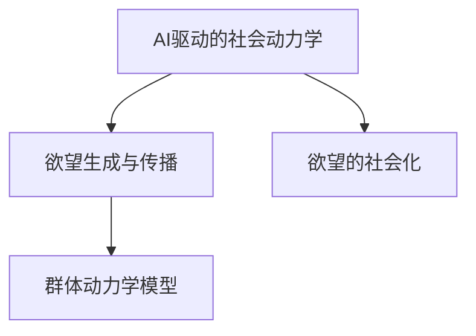

                 

## 1. 背景介绍

### 1.1 问题由来
随着人工智能（AI）技术的快速进步，AI驱动的社会动力学研究逐渐成为一个热点领域。本文聚焦于“欲望的社会化”这一核心议题，探讨了AI如何在群体层面上影响和塑造人类欲望，以及这种动态关系对人类社会行为和决策的深远影响。

### 1.2 问题核心关键点
欲望的社会化涉及AI与人类群体之间的复杂互动，主要包括以下几个关键点：
1. **欲望生成与传播机制**：AI如何生成和传播欲望，并影响群体的欲望结构。
2. **群体动力学模型**：如何将AI驱动的社会动力学建模，理解其对群体行为的影响。
3. **伦理与监管挑战**：欲望社会化过程中涉及的伦理问题和监管挑战，如隐私保护、偏见消除等。
4. **技术应用实例**：具体应用案例，展示AI如何影响群体行为。

### 1.3 问题研究意义
研究AI驱动的群体动力学，对理解人类欲望的形成、传播及其对社会行为的影响具有重要意义。这不仅有助于构建更加人性化、智能化的社会系统，还能指导相关技术的合理应用，避免潜在风险。

## 2. 核心概念与联系

### 2.1 核心概念概述

为了更好地理解欲望的社会化，本文将介绍几个关键概念：

1. **AI驱动的社会动力学**：指利用AI技术来研究、模拟和预测群体中个体和群体之间的动态交互。
2. **欲望生成与传播**：指AI如何通过推荐系统、社交媒体等途径生成和传播特定欲望，从而影响群体行为。
3. **群体动力学模型**：用于描述群体中个体之间的交互和动态关系，以预测群体行为和趋势的数学模型。
4. **欲望的社会化**：指AI如何通过推荐算法、社交网络等工具，将个体的欲望转化为群体偏好和行为。

这些概念之间的逻辑关系可以通过以下Mermaid流程图来展示：



这个流程图展示了大语言模型的核心概念及其之间的关系：

1. AI驱动的社会动力学是研究欲望生成的背景和工具。
2. 欲望生成与传播是AI如何影响群体行为的具体过程。
3. 群体动力学模型是对群体行为进行建模和预测的数学框架。
4. 欲望的社会化是将AI生成的欲望转化为群体行为的最终结果。

这些概念共同构成了欲望社会化的研究框架，帮助我们理解AI如何在群体层面上发挥作用。

## 3. 核心算法原理 & 具体操作步骤

### 3.1 算法原理概述

AI驱动的群体动力学研究通常基于以下算法原理：

1. **强化学习**：通过奖励机制来训练AI模型，使其在特定环境下最大化奖励，模拟人类的决策过程。
2. **推荐系统**：利用协同过滤、内容推荐等算法，生成个性化的欲望推荐，驱动群体行为。
3. **社交网络分析**：通过分析社交网络的结构和特性，预测群体行为和趋势。
4. **情感分析**：利用自然语言处理技术，分析群体情感动态，理解欲望的社会化过程。

### 3.2 算法步骤详解

AI驱动的群体动力学研究的一般步骤包括：

1. **数据采集与预处理**：收集群体行为数据，包括社交媒体互动、在线购物行为、金融交易等，并进行清洗和预处理。
2. **特征工程**：提取有意义的特征，如用户历史行为、兴趣爱好、社交网络关系等。
3. **模型训练**：选择适当的算法（如强化学习、推荐系统、社交网络分析）进行模型训练。
4. **预测与评估**：利用训练好的模型进行群体行为的预测，评估模型的性能和准确度。
5. **迭代优化**：根据预测结果和实际数据反馈，迭代优化模型参数和算法，提高预测精度。

### 3.3 算法优缺点

AI驱动的群体动力学研究具有以下优点：

1. **数据驱动**：通过大规模数据训练模型，能够更好地理解群体行为和趋势。
2. **高精度预测**：采用先进算法，可以提供高精度的群体行为预测。
3. **实时性**：能够实时监测群体动态，及时响应和调整。

同时，该方法也存在以下局限性：

1. **数据隐私**：大规模数据采集和处理可能涉及用户隐私，引发伦理和法律问题。
2. **模型复杂性**：复杂的模型可能需要大量的计算资源和时间来训练和优化。
3. **偏见问题**：模型可能会受到数据偏见的影响，导致不公正的决策。
4. **解释性不足**：AI模型的决策过程往往缺乏解释性，难以理解其内在逻辑。

### 3.4 算法应用领域

AI驱动的群体动力学研究在多个领域有广泛应用：

1. **市场营销**：通过推荐系统，了解消费者欲望，优化营销策略，提高转化率。
2. **金融服务**：利用社交网络分析，预测市场波动，防范金融风险。
3. **健康医疗**：通过情感分析，监测公共卫生事件，及时响应和处理。
4. **社会治理**：通过群体行为预测，优化公共政策，提升社会管理效率。
5. **企业决策**：利用群体动力学模型，辅助企业制定战略，提高决策质量。

## 4. 数学模型和公式 & 详细讲解 & 举例说明

### 4.1 数学模型构建

群体动力学模型的构建通常包括以下几个部分：

1. **群体成员描述**：定义群体中个体的特征，如年龄、性别、职业、兴趣等。
2. **交互规则**：描述个体之间如何通过社交网络、推荐系统等工具进行交互和影响。
3. **欲望传播模型**：定义欲望如何在群体中传播和扩散。
4. **目标函数**：定义群体行为的目标，如最大利润、最小风险等。

### 4.2 公式推导过程

以一个简单的推荐系统为例，推导欲望生成与传播的数学模型：

假设群体中有$N$个用户，每个用户有$M$个欲望（如购买某个商品）。推荐系统通过协同过滤算法，为用户推荐最可能满足其欲望的商品。假设用户$u$对商品$i$的欲望强度为$w_{ui}$，推荐系统为用户$u$推荐商品$i$的概率为$p_{ui}$。

推荐系统的目标函数为：

$$
\min_{\{p_{ui}\}} \sum_{u=1}^N \sum_{i=1}^M w_{ui} \log p_{ui}
$$

其中，$p_{ui} = \frac{\exp\left(a_{ui}^T \theta\right)}{\sum_{j=1}^M \exp\left(a_{ui}^T \theta\right)}$，$a_{ui}$为特征向量，$\theta$为模型参数。

### 4.3 案例分析与讲解

考虑一个社交网络中欲望的传播模型。假设网络中每个节点代表一个用户，每条边代表两人之间的互动。欲望在用户之间传播的速率由边权重决定，边权重越高，欲望传播越快。

设节点$i$的欲望强度为$x_i$，节点$i$到邻居节点$j$的边权重为$w_{ij}$。欲望传播的微分方程为：

$$
\frac{dx_i}{dt} = \sum_{j=1}^N w_{ij}(x_j - x_i)
$$

其中，$x_i$表示节点$i$的欲望强度，$w_{ij}$表示节点$i$和节点$j$之间的边权重。

通过数值求解微分方程，可以模拟欲望在社交网络中的传播过程，预测群体行为的变化趋势。

## 5. 项目实践：代码实例和详细解释说明

### 5.1 开发环境搭建

在进行群体动力学研究前，我们需要准备好开发环境。以下是使用Python进行PyTorch开发的环境配置流程：

1. 安装Anaconda：从官网下载并安装Anaconda，用于创建独立的Python环境。

2. 创建并激活虚拟环境：
```bash
conda create -n pytorch-env python=3.8 
conda activate pytorch-env
```

3. 安装PyTorch：根据CUDA版本，从官网获取对应的安装命令。例如：
```bash
conda install pytorch torchvision torchaudio cudatoolkit=11.1 -c pytorch -c conda-forge
```

4. 安装Transformers库：
```bash
pip install transformers
```

5. 安装各类工具包：
```bash
pip install numpy pandas scikit-learn matplotlib tqdm jupyter notebook ipython
```

完成上述步骤后，即可在`pytorch-env`环境中开始研究流程。

### 5.2 源代码详细实现

这里我们以社交网络中的欲望传播模型为例，给出使用PyTorch实现的代码。

```python
import torch
import torch.nn as nn
import torch.optim as optim

# 定义欲望传播模型
class DesirePropagationModel(nn.Module):
    def __init__(self, num_nodes, num_features, learning_rate=0.01):
        super(DesirePropagationModel, self).__init__()
        self.num_nodes = num_nodes
        self.num_features = num_features
        self.linear = nn.Linear(num_features, 1)
        self.optimizer = optim.Adam(self.parameters(), lr=learning_rate)
        
    def forward(self, x, adjacency_matrix):
        x = self.linear(x)
        x = x * torch.sparse_tensor(adjacency_matrix)
        return x
    
    def predict(self, x, adjacency_matrix):
        x = self(x, adjacency_matrix)
        return x
    
    def loss(self, y_true, y_pred):
        return nn.L1Loss()(y_true, y_pred)
    
    def train(self, x_train, y_train, adjacency_matrix_train, x_val, y_val, adjacency_matrix_val, epochs=100):
        self.train()
        for epoch in range(epochs):
            self.optimizer.zero_grad()
            y_pred = self.predict(x_train, adjacency_matrix_train)
            loss = self.loss(y_train, y_pred)
            loss.backward()
            self.optimizer.step()
            print(f"Epoch {epoch+1}, loss: {loss.item()}")
        
        self.eval()
        with torch.no_grad():
            y_pred = self.predict(x_val, adjacency_matrix_val)
            loss = self.loss(y_val, y_pred)
            print(f"Validation loss: {loss.item()}")
```

通过上述代码，可以构建和训练社交网络中的欲望传播模型，预测欲望在群体中的传播趋势。

### 5.3 代码解读与分析

让我们再详细解读一下关键代码的实现细节：

**DesirePropagationModel类**：
- `__init__`方法：初始化模型的超参数和神经网络结构。
- `forward`方法：前向传播计算，计算欲望传播的结果。
- `predict`方法：根据训练好的模型，对新数据进行预测。
- `loss`方法：定义损失函数，计算预测误差。
- `train`方法：训练模型，更新模型参数。

**train函数**：
- 对训练数据进行迭代训练，优化模型参数。
- 在每个epoch结束时输出训练误差。
- 在验证集上评估模型性能，输出验证误差。

这个代码展示了使用PyTorch进行社交网络欲望传播模型训练的基本流程。开发者可以根据具体需求，进一步优化模型结构和训练策略，以提高模型的预测精度和稳定性。

## 6. 实际应用场景

### 6.1 社交媒体情感分析

社交媒体是欲望传播的重要渠道。通过分析社交媒体上的情感动态，可以理解群体中欲望的变化趋势，预测潜在的社会事件和市场变化。

例如，通过情感分析算法，可以实时监测社交媒体上的情感倾向，识别出消费者对某个产品的态度变化，及时调整营销策略。这种情感分析技术在品牌管理、危机公关、市场监测等领域有广泛应用。

### 6.2 在线购物推荐

在线购物平台利用推荐系统，为用户提供个性化的欲望推荐，驱动用户购买行为。通过分析用户的历史行为和偏好，推荐系统能够预测用户的未来欲望，优化购物体验，提升转化率。

例如，亚马逊利用推荐算法，为用户推荐可能感兴趣的书籍、电影等商品，使用户在平台上的停留时间更长，购买行为更多。这种推荐技术在零售、电商、金融等领域有广泛应用。

### 6.3 金融市场预测

金融市场是群体动态的重要场所。通过分析金融市场数据，可以预测市场的波动趋势，识别出潜在的投资机会和风险。

例如，利用社交网络分析技术，分析投资者在社交媒体上的情感动态，预测市场波动，优化投资策略。这种技术在金融投资、风险管理、市场监管等领域有广泛应用。

### 6.4 未来应用展望

随着AI技术的不断进步，欲望社会化研究将拓展到更多领域，为社会治理、市场预测、消费者行为分析等领域带来新的突破。

在智慧城市治理中，利用欲望社会化技术，可以优化公共服务资源配置，提升城市管理效率。例如，通过分析居民对公共设施的需求，优化公园、医院、交通等设施的布局，提升居民满意度。

在公共卫生领域，利用欲望社会化技术，可以预测疾病传播趋势，及时响应和防控疫情。例如，通过分析社交媒体上的健康相关信息，预测疾病传播范围，优化公共卫生资源分配。

在环境保护领域，利用欲望社会化技术，可以监测公众对环保问题的态度变化，推动环保政策的制定和执行。例如，通过分析社交媒体上的环保话题，识别出公众关注的环保问题，优化环保宣传和教育策略。

## 7. 工具和资源推荐

### 7.1 学习资源推荐

为了帮助开发者系统掌握欲望社会化的理论基础和实践技巧，这里推荐一些优质的学习资源：

1. **《社会动力学建模与分析》**：介绍群体动力学建模的基础知识和应用方法，适合初学者和进阶者。
2. **《群体动力学与复杂网络》**：讲解群体动力学和复杂网络的理论基础，适合深入研究。
3. **《强化学习与AI驱动的社会动力学》**：探讨强化学习在群体动力学中的应用，适合研究人员和工程师。
4. **Coursera《社会网络分析》**：斯坦福大学开设的课程，系统介绍社会网络分析的基本方法和应用。
5. **Kaggle数据集**：提供丰富的社交媒体和市场数据集，适合进行数据分析和机器学习实践。

通过对这些资源的学习实践，相信你一定能够快速掌握欲望社会化的精髓，并用于解决实际的群体行为问题。

### 7.2 开发工具推荐

高效的开发离不开优秀的工具支持。以下是几款用于欲望社会化研究的常用工具：

1. **PyTorch**：基于Python的开源深度学习框架，灵活动态的计算图，适合快速迭代研究。大部分群体动力学模型都有PyTorch版本的实现。
2. **TensorFlow**：由Google主导开发的开源深度学习框架，生产部署方便，适合大规模工程应用。同样有丰富的群体动力学模型资源。
3. **Gephi**：社交网络分析工具，可视化复杂网络结构，适合进行群体行为分析。
4. **Nilearn**：神经网络分析工具，支持复杂的群体动力学模型，适合进行脑网络分析。
5. **HivePlot**：交互式数据可视化工具，支持群体动力学模型的可视化分析，适合进行数据探索和理解。

合理利用这些工具，可以显著提升欲望社会化研究的开发效率，加快创新迭代的步伐。

### 7.3 相关论文推荐

欲望社会化研究源于学界的持续研究。以下是几篇奠基性的相关论文，推荐阅读：

1. **《群体动力学：基础与应用》**：介绍群体动力学的基础知识和应用方法。
2. **《社交网络分析方法》**：探讨社交网络分析的理论和应用，适合研究社会群体行为。
3. **《AI驱动的社会动力学研究综述》**：总结AI在群体动力学研究中的应用，适合研究人员和工程师。
4. **《欲望传播与群体行为建模》**：分析欲望在群体中的传播机制，适合研究欲望社会化问题。
5. **《情感分析与社交媒体动态》**：探讨情感分析在社交媒体中的应用，适合研究群体情感动态。

这些论文代表了大语言模型微调技术的发展脉络。通过学习这些前沿成果，可以帮助研究者把握学科前进方向，激发更多的创新灵感。

## 8. 总结：未来发展趋势与挑战

### 8.1 总结

本文对欲望的社会化这一核心议题进行了全面系统的介绍。首先阐述了欲望的社会化的背景和意义，明确了欲望社会化的研究目标和重要性。其次，从原理到实践，详细讲解了欲望社会化的数学模型和操作步骤，给出了欲望社会化任务开发的完整代码实例。同时，本文还探讨了欲望社会化在多个领域的应用前景，展示了欲望社会化范式的强大潜力。最后，本文精选了欲望社会化的各类学习资源，力求为读者提供全方位的技术指引。

通过本文的系统梳理，可以看到，欲望的社会化研究正在成为群体动力学研究的重要方向，极大地拓展了群体行为分析的视野。受益于大规模数据和先进算法的支持，欲望社会化研究将为社会治理、市场预测、消费者行为分析等领域带来新的突破。未来，伴随群体动力学模型的不断演进，欲望社会化技术必将引领群体行为分析的发展，为人类社会带来深刻的变革。

### 8.2 未来发展趋势

展望未来，欲望社会化研究将呈现以下几个发展趋势：

1. **数据规模扩大**：随着数据的不断积累，欲望社会化研究将基于更大规模的数据集进行建模和分析。
2. **算法复杂化**：随着算法的发展，欲望社会化模型将更加复杂和精确，能够捕捉更多群体行为特征。
3. **跨领域融合**：欲望社会化研究将与其他领域（如金融、健康、环境等）进行更深入的融合，形成跨领域的应用。
4. **实时性增强**：随着技术的进步，欲望社会化研究将实现实时监测和预测，及时响应群体动态变化。
5. **伦理监管强化**：欲望社会化研究将更加关注伦理和监管问题，确保数据的隐私和安全。

以上趋势凸显了欲望社会化研究的广阔前景。这些方向的探索发展，必将进一步提升欲望社会化技术的准确性和稳定性，为社会治理和公共决策提供更科学、可靠的依据。

### 8.3 面临的挑战

尽管欲望社会化研究已经取得了瞩目成就，但在迈向更加智能化、普适化应用的过程中，它仍面临诸多挑战：

1. **数据隐私**：大规模数据采集和处理可能涉及用户隐私，引发伦理和法律问题。如何保护数据隐私，同时确保数据的可用性，是一大难题。
2. **模型复杂性**：复杂的模型可能需要大量的计算资源和时间来训练和优化。如何在保证预测精度的同时，降低计算复杂度，是需要解决的关键问题。
3. **偏见问题**：模型可能会受到数据偏见的影响，导致不公正的决策。如何消除数据偏见，确保模型的公平性，是亟待解决的问题。
4. **解释性不足**：AI模型的决策过程往往缺乏解释性，难以理解其内在逻辑。如何提高模型的可解释性，增强信任度，是重要的研究方向。
5. **安全防护**：欲望社会化研究涉及敏感数据和行为分析，如何保护数据和模型的安全，防止滥用和攻击，是重要的挑战。

正视欲望社会化面临的这些挑战，积极应对并寻求突破，将是大语言模型微调走向成熟的必由之路。相信随着学界和产业界的共同努力，这些挑战终将一一被克服，欲望社会化技术必将引领群体行为分析的发展，为人类社会带来深刻的变革。

### 8.4 研究展望

面对欲望社会化研究所面临的种种挑战，未来的研究需要在以下几个方面寻求新的突破：

1. **探索新的数据源**：除了社交媒体和市场数据，探索更多新的数据源，如传感器数据、地理位置数据等，以丰富欲望社会化研究的视角。
2. **发展新的算法**：开发更高效的算法，减少计算资源和时间消耗，同时提高模型的准确性和稳定性。
3. **引入伦理监管**：在模型训练和应用过程中，引入伦理和监管机制，确保数据的隐私和安全，避免偏见和不公正。
4. **提高模型可解释性**：通过可视化、解释性模型等技术，提高欲望社会化模型的可解释性，增强用户信任和接受度。
5. **拓展应用场景**：在更多领域进行应用实践，如公共卫生、环境保护、社会治理等，推动欲望社会化技术的发展和应用。

这些研究方向将引领欲望社会化研究走向更深层次，为社会治理、市场预测、消费者行为分析等领域带来新的突破。面向未来，欲望社会化研究还需要与其他人工智能技术进行更深入的融合，如知识表示、因果推理、强化学习等，多路径协同发力，共同推动自然语言理解和智能交互系统的进步。只有勇于创新、敢于突破，才能不断拓展语言模型的边界，让智能技术更好地造福人类社会。

## 9. 附录：常见问题与解答

**Q1：欲望的社会化研究是否适用于所有群体？**

A: 欲望的社会化研究主要适用于具有足够数据支持的群体，如社交媒体上的用户群体、在线购物平台的用户群体等。对于小型群体或无结构化数据的群体，可能难以进行有效的研究。

**Q2：如何选择合适的欲望模型？**

A: 选择合适的欲望模型需要考虑多个因素，包括群体的特性、研究目的、数据质量等。一般来说，可以从简单的线性回归模型开始，逐步引入更复杂的模型，如神经网络、强化学习等，以适应不同的研究需求。

**Q3：欲望的社会化研究是否涉及隐私问题？**

A: 是的，欲望的社会化研究涉及大量的个人数据，可能会涉及隐私问题。在进行研究时，需要遵循相关的隐私保护法规和伦理准则，保护参与者的隐私和数据安全。

**Q4：欲望的社会化研究是否需要大量的计算资源？**

A: 是的，欲望的社会化研究需要大量的计算资源和时间来训练和优化模型。对于大规模数据集和高复杂度的模型，可能需要高性能的计算资源和算法优化。

**Q5：如何提高欲望社会化研究的可解释性？**

A: 提高欲望社会化研究的可解释性可以从多个方面入手，包括引入可视化工具、使用解释性模型、增加数据透明度等。例如，通过可视化群体行为的变化趋势，可以帮助研究者更好地理解模型的工作机制。

总之，欲望的社会化研究是一个跨学科的研究方向，涉及社会学、心理学、计算机科学等多个领域。只有通过不断的技术创新和应用实践，才能真正发挥其社会价值，为人类社会带来深刻的变革。

---

作者：禅与计算机程序设计艺术 / Zen and the Art of Computer Programming

