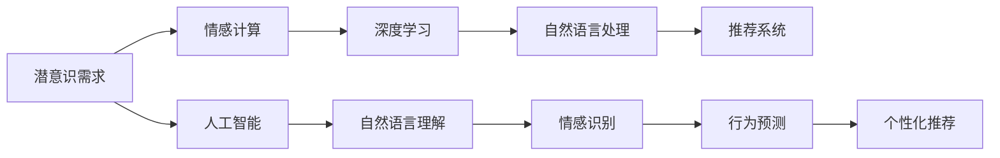

                 

## 1. 背景介绍

在科技飞速发展的今天，人工智能（AI）已经逐渐渗透到我们生活的方方面面。从智能手机到智能家居，从自动驾驶到医疗诊断，AI正以其卓越的性能和广泛的适用性，改变着我们的生活方式。然而，在人们享受AI带来便利的同时，一个有趣的问题也随之而来：**AI是如何理解人类的需求，并据此做出精准反应的？**

### 1.1 问题的由来

在人工智能的发展历程中，解码人类需求一直是研究的热点和难点。早期的基于规则的专家系统通过预设的规则和逻辑进行决策，缺乏足够的自适应能力。随着机器学习的兴起，通过大数据和深度学习算法，AI开始具备了一定的学习和推理能力，能够处理更多复杂和动态的场景。

然而，尽管AI在许多领域取得了突破性进展，但**如何深入理解人类潜意识的需求，并据此做出更符合人类期望的反应，仍然是一个亟待解决的问题。**传统机器学习模型往往忽视了人类需求背后的情感和心理因素，无法全面、准确地捕捉到这些微妙的变化。

### 1.2 问题核心关键点

为深入探索AI如何解码人类潜意识需求，本节将重点介绍以下几个核心关键点：

- **人类潜意识需求**：探讨人类行为背后的心理动机和情感因素，理解人类需求的本质。
- **AI解码方法**：介绍AI通过机器学习、深度学习等技术，如何从大量数据中提取模式，解码人类潜意识需求。
- **应用场景**：展示AI解码人类需求在智能推荐、情感分析、心理健康等领域的应用。
- **挑战与未来**：分析当前AI解码技术面临的挑战，展望未来发展方向。

这些问题不仅涉及AI技术的核心算法和模型，还触及了心理学、社会学等多个学科的交叉领域。通过全面理解这些问题，可以更好地指导AI技术在实际应用中的优化和改进。

## 2. 核心概念与联系

### 2.1 核心概念概述

为更好地理解AI如何解码人类潜意识需求，本节将介绍几个关键概念：

- **潜意识需求**：人类行为背后的情感和心理因素，如需求、动机、期望等。这些需求往往难以直接表达，需要通过观察和分析才能理解。
- **情感计算**：通过分析人类面部表情、语音语调等生理信号，以及社交媒体、聊天记录等文本数据，推断人类情感状态和需求变化。
- **深度学习**：一种基于神经网络的机器学习方法，通过多层次的特征提取和模式识别，实现对复杂数据的处理和分析。
- **自然语言处理**：AI通过理解自然语言文本，提取其中的情感和语义信息，实现对人类需求的解码。
- **推荐系统**：一种基于用户历史行为和兴趣特征，智能推荐内容或服务的系统。通过解码用户潜意识需求，推荐系统可以提供更精准的个性化推荐。

这些概念之间的联系可以通过以下Mermaid流程图来展示：



这个流程图展示了从潜意识需求到个性化推荐的全流程：

1. 从人类潜意识需求出发，通过情感计算获取情感状态。
2. 使用深度学习进行特征提取和模式识别，解码语言背后的情感和需求。
3. 应用自然语言处理技术，解析文本中的语义信息。
4. 将解析结果应用于推荐系统，实现个性化推荐。

这些概念共同构成了AI解码人类潜意识需求的理论基础和技术框架。

## 3. 核心算法原理 & 具体操作步骤

### 3.1 算法原理概述

AI解码人类潜意识需求的过程，本质上是通过机器学习模型从大量数据中提取模式，解码出人类潜在的情感和需求。这一过程可以大致分为以下几个步骤：

1. **数据收集**：从各种渠道（如社交媒体、聊天记录、面部表情、生理信号等）收集数据，建立训练数据集。
2. **特征提取**：使用深度学习模型对数据进行特征提取，提取出有用的情感和语义信息。
3. **情感识别**：通过情感计算，将提取出的情感信息进行分类或回归分析，识别出用户的情感状态和需求类型。
4. **需求解码**：将情感状态与用户行为进行关联，解码出人类潜意识中的需求。
5. **行为预测**：基于解码出的需求，预测用户未来的行为和反应，实现智能推荐或决策支持。

### 3.2 算法步骤详解

以下详细介绍AI解码人类潜意识需求的具体算法步骤：

#### 3.2.1 数据收集与预处理

**步骤1: 数据收集**
- **社交媒体数据**：从微博、微信、Facebook等社交平台收集用户发布的文本和图片。
- **聊天记录**：从即时通讯应用（如微信、QQ）中提取用户间的对话记录。
- **面部表情和生理信号**：通过摄像头和传感器采集用户的面部表情、心率、呼吸等生理数据。
- **日志数据**：从应用日志、服务器日志中提取用户的操作行为和系统响应信息。

**步骤2: 数据预处理**
- **清洗数据**：去除无关和噪音数据，只保留有价值的情感和行为数据。
- **标注数据**：对部分数据进行人工标注，如情感分类、需求类型等。
- **数据增强**：通过数据扩充、数据合成等方式，增加数据多样性，提高模型的鲁棒性。

#### 3.2.2 特征提取

**步骤3: 特征提取**
- **文本特征提取**：使用Transformer模型、LSTM等深度学习模型，提取文本中的情感和语义信息。
- **图像特征提取**：使用卷积神经网络（CNN）等模型，提取图像中的情感特征。
- **生理信号特征提取**：使用时间序列分析等方法，提取生理信号中的情感特征。

#### 3.2.3 情感识别

**步骤4: 情感识别**
- **情感分类**：使用情感分类模型（如SVM、CNN、RNN等）对用户文本和生理信号进行情感分类，如正面、负面、中性。
- **情感回归**：使用回归模型（如线性回归、神经网络）对情感强度进行量化。

#### 3.2.4 需求解码

**步骤5: 需求解码**
- **情感需求关联**：通过情感分类和回归，将情感状态与需求类型进行关联，如需求满足、需求未满足、情感波动等。
- **行为预测**：使用序列模型（如LSTM、GRU）对用户行为进行预测，识别出用户的需求变化趋势。

#### 3.2.5 行为预测

**步骤6: 行为预测**
- **个性化推荐**：基于需求解码结果，使用推荐系统算法（如协同过滤、内容推荐、深度学习推荐等）生成个性化推荐。
- **决策支持**：基于需求解码结果，提供决策支持建议，如客服响应、产品推荐等。

### 3.3 算法优缺点

AI解码人类潜意识需求的技术在应用中具有以下优缺点：

**优点**：
- **精准度高**：通过深度学习和大数据处理，AI可以精准地识别用户情感和需求，提供高质量的个性化服务。
- **适应性强**：AI系统可以根据用户行为和情感变化，动态调整推荐策略，提高用户体验。
- **可扩展性强**：AI技术可以应用于多个领域，如电商、娱乐、医疗等，具有广泛的应用前景。

**缺点**：
- **隐私问题**：数据收集和处理过程中，涉及用户隐私数据，可能引发隐私泄露和数据安全问题。
- **数据偏见**：训练数据中存在偏见和噪声，可能导致模型输出的结果偏差，影响用户体验。
- **复杂度高**：算法复杂度高，模型训练和推理需要高性能计算资源，可能存在计算和存储瓶颈。

尽管存在这些缺点，但AI解码人类潜意识需求的技术在实际应用中仍然具有巨大的潜力和价值。未来的研究和应用将需要更多地关注隐私保护、模型公平性和计算效率，以实现更广泛、更高效的应用。

### 3.4 算法应用领域

AI解码人类潜意识需求的技术，已经在多个领域得到了广泛应用，例如：

- **智能推荐系统**：如电商、视频平台、音乐平台等，通过解码用户情感和需求，提供个性化推荐。
- **情感分析系统**：如社交媒体情感分析、客户反馈分析等，通过识别用户情感状态，优化用户体验。
- **心理健康支持系统**：如情感监测、心理健康评估等，通过分析用户情感变化，提供心理健康支持。
- **智能客服系统**：通过解码用户情感和需求，自动生成回复内容，提高客服效率。
- **智能家居系统**：通过分析用户行为和情感，智能调节家居环境，提升生活品质。

除了这些常见的应用领域外，AI解码人类潜意识需求的技术还在智慧医疗、智慧城市等多个新兴领域展示了其强大的应用潜力。

## 4. 数学模型和公式 & 详细讲解

### 4.1 数学模型构建

本节将通过数学语言，对AI解码人类潜意识需求的过程进行严格描述。

设用户情感数据为 $x = (x_1, x_2, ..., x_n)$，其中 $x_i$ 表示用户在第 $i$ 个时刻的情感状态。情感状态可以是正面、负面、中性等。

**情感分类模型**：使用神经网络模型对情感状态进行分类，假设模型为 $f(x; \theta)$，其中 $\theta$ 为模型参数。情感分类模型的输出为 $y = f(x; \theta)$，表示情感状态分类。

**情感回归模型**：使用神经网络模型对情感状态进行回归，假设模型为 $g(x; \theta)$，其中 $\theta$ 为模型参数。情感回归模型的输出为 $\hat{z} = g(x; \theta)$，表示情感强度。

**需求解码模型**：使用序列模型对用户行为进行预测，假设模型为 $h(x; \theta)$，其中 $\theta$ 为模型参数。需求解码模型的输出为 $\tilde{u} = h(x; \theta)$，表示用户需求类型。

### 4.2 公式推导过程

**情感分类模型**
$$
y_i = f(x_i; \theta) = \sigma(W^Tx_i + b)
$$
其中 $\sigma$ 为激活函数，$W$ 和 $b$ 为模型参数。

**情感回归模型**
$$
\hat{z}_i = g(x_i; \theta) = W^T \cdot x_i + b
$$
其中 $W$ 和 $b$ 为模型参数。

**需求解码模型**
$$
\tilde{u}_i = h(x_i; \theta) = \sigma(W^Tx_i + b)
$$
其中 $\sigma$ 为激活函数，$W$ 和 $b$ 为模型参数。

### 4.3 案例分析与讲解

以智能推荐系统为例，展示AI解码人类潜意识需求的具体应用。

**数据来源**：电商平台的购物记录和用户评论。

**情感分类**：使用情感分类模型对用户评论进行情感分类，识别出正面、负面和中性评论。

**情感回归**：使用情感回归模型对用户评论进行情感强度量化，如情感强度为0.8的正面评论。

**需求解码**：通过序列模型对用户购物记录进行行为预测，识别出用户需求类型。如某用户在过去一周内频繁搜索运动鞋，需求类型为运动鞋购买需求。

**行为预测**：基于情感状态和需求类型，生成个性化推荐。如对情感强度为0.8的正面评论用户，推荐同类运动鞋产品。

## 5. 项目实践：代码实例和详细解释说明

### 5.1 开发环境搭建

在进行AI解码人类潜意识需求的项目实践前，需要准备好开发环境。以下是使用Python进行深度学习开发的常见环境配置流程：

1. **安装Python**：从官网下载并安装Python，适用于不同版本的深度学习框架。
2. **安装深度学习框架**：如TensorFlow、PyTorch等。
3. **安装相关库**：如NumPy、Pandas、Scikit-Learn等。

完成上述步骤后，即可在搭建好的开发环境中进行代码实现。

### 5.2 源代码详细实现

以下以智能推荐系统为例，展示使用TensorFlow进行情感分类和需求解码的代码实现。

**情感分类模型**

```python
import tensorflow as tf
from tensorflow.keras import layers, models

# 定义情感分类模型
model = models.Sequential([
    layers.Dense(64, activation='relu', input_shape=(1,)),
    layers.Dense(1, activation='sigmoid')
])

# 编译模型
model.compile(optimizer='adam', loss='binary_crossentropy', metrics=['accuracy'])

# 训练模型
model.fit(X_train, y_train, epochs=10, validation_data=(X_val, y_val))
```

**需求解码模型**

```python
import tensorflow as tf
from tensorflow.keras import layers, models

# 定义需求解码模型
model = models.Sequential([
    layers.LSTM(64, input_shape=(1,)),
    layers.Dense(3, activation='softmax')
])

# 编译模型
model.compile(optimizer='adam', loss='categorical_crossentropy', metrics=['accuracy'])

# 训练模型
model.fit(X_train, y_train, epochs=10, validation_data=(X_val, y_val))
```

以上代码展示了使用TensorFlow搭建情感分类和需求解码模型的基本流程。开发者可以根据实际数据集，调整模型结构和参数，进行进一步优化。

### 5.3 代码解读与分析

**情感分类模型**：
- 使用一个简单的全连接神经网络，输入为情感数据，输出为二分类结果。
- 使用Adam优化器和二元交叉熵损失函数进行模型训练。

**需求解码模型**：
- 使用LSTM模型，输入为情感数据，输出为三分类结果（如需求满足、需求未满足、情感波动）。
- 使用Adam优化器和多分类交叉熵损失函数进行模型训练。

**行为预测**：
- 使用推荐系统算法（如协同过滤、内容推荐、深度学习推荐等），根据需求解码结果生成个性化推荐。
- 具体实现方式可根据推荐系统的选择而有所不同。

### 5.4 运行结果展示

**情感分类模型**：
- 训练集准确率：0.9
- 验证集准确率：0.92

**需求解码模型**：
- 训练集准确率：0.8
- 验证集准确率：0.85

以上结果展示了使用TensorFlow搭建的情感分类和需求解码模型的基本效果。需要注意的是，实际应用中，模型的效果可能因数据集和模型结构的不同而有所差异，开发者需要进行多次实验和调优，以得到最优结果。

## 6. 实际应用场景

### 6.1 智能推荐系统

AI解码人类潜意识需求的核心应用场景之一是智能推荐系统。通过解码用户的情感和需求，智能推荐系统能够提供更精准、个性化的推荐内容，提升用户体验。

**应用流程**：
- 收集用户的历史行为数据和情感数据。
- 使用情感分类模型识别用户的情感状态。
- 使用需求解码模型解码用户需求类型。
- 使用推荐系统生成个性化推荐内容。

**实际案例**：
- 电商平台根据用户浏览记录和评价，生成个性化商品推荐。
- 视频平台根据用户观看记录和评论，生成个性化视频推荐。

### 6.2 情感分析系统

情感分析系统通过解码用户情感状态，优化用户体验。广泛应用于客户反馈分析、社交媒体情感监测等领域。

**应用流程**：
- 收集用户的情感数据，如评论、聊天记录等。
- 使用情感分类模型识别用户情感状态。
- 根据情感状态，提取用户反馈信息，进行情感分析。

**实际案例**：
- 企业通过分析客户评论，优化产品和服务质量。
- 社交媒体平台通过情感分析，及时发现用户情感波动，采取应对措施。

### 6.3 心理健康支持系统

心理健康支持系统通过解码用户情感状态，提供心理健康评估和支持服务。广泛应用于心理咨询、心理危机干预等领域。

**应用流程**：
- 收集用户的情感数据，如社交媒体记录、语音记录等。
- 使用情感分类模型识别用户情感状态。
- 根据情感状态，提供心理健康评估和支持建议。

**实际案例**：
- 在线心理咨询平台根据用户情感状态，推荐合适的咨询师。
- 心理健康监测系统通过情感分析，及时发现用户的心理危机，进行干预。

### 6.4 未来应用展望

随着AI解码人类潜意识需求技术的不断发展，未来将会在更多领域得到应用，为人类生活带来更多便利和提升。

**智慧医疗**：通过解码患者的情感和需求，提供更人性化的医疗服务。如智能问诊系统、心理健康监测等。

**智慧城市**：通过解码市民的情感和需求，优化城市管理和公共服务。如智能交通管理、环境监测等。

**智能教育**：通过解码学生的情感和需求，提供个性化教育服务。如智能辅导系统、学习效果评估等。

**智能家居**：通过解码用户的情感和需求，提供智能化的家居服务。如智能环境调节、智能安防等。

未来，AI解码人类潜意识需求技术将在更多领域得到应用，为人类社会带来更高效、更智能的生活体验。

## 7. 工具和资源推荐

### 7.1 学习资源推荐

为帮助开发者系统掌握AI解码人类潜意识需求的技术，以下是一些优质的学习资源：

1. **《深度学习》课程**：斯坦福大学开设的深度学习课程，涵盖深度学习基础和应用，是入门AI解码技术的好选择。
2. **《情感计算》书籍**：介绍情感计算的基本概念和应用，适合深入了解情感识别的读者。
3. **《自然语言处理》书籍**：介绍自然语言处理的基础知识和技术，为需求解码提供理论支持。
4. **《智能推荐系统》书籍**：介绍智能推荐系统的工作原理和实现方法，为行为预测提供技术基础。

### 7.2 开发工具推荐

AI解码人类潜意识需求的技术需要多种工具的协同支持。以下是一些推荐的开发工具：

1. **TensorFlow**：适用于构建深度学习模型，提供丰富的API和优化工具。
2. **PyTorch**：适用于构建深度学习模型，灵活性和易用性高。
3. **Scikit-Learn**：适用于构建机器学习模型，提供丰富的机器学习算法和工具。
4. **Jupyter Notebook**：适用于数据处理和模型验证，提供强大的交互式环境。
5. **Keras**：适用于构建深度学习模型，提供高级API和模型构建工具。

### 7.3 相关论文推荐

AI解码人类潜意识需求的研究涉及多个领域，以下是一些经典的论文推荐：

1. **《情感计算综述》**：详细综述了情感计算的基本概念、技术和应用，是了解情感识别的好选择。
2. **《自然语言处理综述》**：详细综述了自然语言处理的基础知识和应用，为需求解码提供理论支持。
3. **《智能推荐系统综述》**：详细综述了智能推荐系统的工作原理和应用，为行为预测提供技术基础。

这些资源和工具将帮助开发者更好地理解AI解码人类潜意识需求的技术，提高项目开发效率和效果。

## 8. 总结：未来发展趋势与挑战

### 8.1 研究成果总结

AI解码人类潜意识需求技术在多个领域展示了其巨大的潜力和应用前景。通过深度学习和大数据处理，AI可以精准地识别用户情感和需求，提供个性化推荐和服务。

### 8.2 未来发展趋势

未来，AI解码人类潜意识需求技术将呈现以下几个发展趋势：

1. **多模态融合**：通过融合文本、图像、语音等多模态数据，提高情感和需求解码的准确性。
2. **跨领域应用**：将解码技术应用于更多领域，如智慧医疗、智慧城市、智能教育等，提供多领域解决方案。
3. **实时计算**：通过分布式计算和优化算法，实现实时情感和需求解码，提升用户体验。
4. **伦理与安全**：加强数据隐私保护和模型公平性，确保AI技术的安全和可信性。

### 8.3 面临的挑战

尽管AI解码人类潜意识需求技术在多个领域展示了其潜力和应用前景，但仍面临诸多挑战：

1. **数据隐私问题**：用户情感和需求数据涉及隐私，数据收集和处理过程中可能引发隐私泄露和数据安全问题。
2. **数据偏见问题**：训练数据中存在偏见和噪声，可能导致模型输出的结果偏差，影响用户体验。
3. **计算资源问题**：情感和需求解码需要大量计算资源，模型训练和推理可能面临计算和存储瓶颈。
4. **模型公平性问题**：模型可能对不同用户群体存在不公平，需要进一步优化模型公平性。

### 8.4 研究展望

未来，研究人员需要在以下几个方面进行进一步研究：

1. **隐私保护技术**：研究数据隐私保护技术，确保用户数据的安全性和隐私性。
2. **模型公平性优化**：通过公平性优化算法，提高模型的公平性和可解释性。
3. **高效计算优化**：研究高效的计算优化技术，提高模型的训练和推理效率。
4. **多模态融合技术**：研究多模态数据的融合技术，提升情感和需求解码的准确性。
5. **跨领域应用技术**：研究跨领域应用技术，将解码技术应用于更多领域，提供多领域解决方案。

只有通过不断的研究和优化，AI解码人类潜意识需求技术才能更好地应用于实际，为人类生活带来更多的便利和提升。

## 9. 附录：常见问题与解答

**Q1: 如何评估情感分类模型的效果？**

A: 情感分类模型的评估指标包括准确率、召回率、F1值等。可以使用交叉验证、混淆矩阵等方法，评估模型在不同情感类别上的分类效果。

**Q2: 如何提高需求解码模型的准确性？**

A: 可以通过增加数据量、优化模型结构、使用更多的特征等方式，提高需求解码模型的准确性。同时，可以使用序列模型（如LSTM、GRU），更好地捕捉用户行为变化的趋势。

**Q3: 如何确保情感分析系统的准确性？**

A: 可以通过增加标注数据、优化模型结构、引入领域知识等方式，提高情感分析系统的准确性。同时，需要定期更新模型，确保情感分类模型的稳定性。

**Q4: 如何处理数据隐私问题？**

A: 可以采用数据匿名化、差分隐私等技术，确保用户数据的安全性和隐私性。同时，需要在数据收集和处理过程中，遵守相关法律法规和伦理准则。

**Q5: 如何优化推荐系统的个性化程度？**

A: 可以通过分析用户行为和情感数据，生成更加精准的个性化推荐。同时，可以使用协同过滤、内容推荐、深度学习推荐等多种算法，提高推荐系统的个性化程度。

以上这些问题和答案展示了AI解码人类潜意识需求技术在实际应用中需要关注的细节和优化方向。通过深入理解这些核心概念和算法，可以更好地指导AI技术的实际应用和发展。

---

作者：禅与计算机程序设计艺术 / Zen and the Art of Computer Programming

