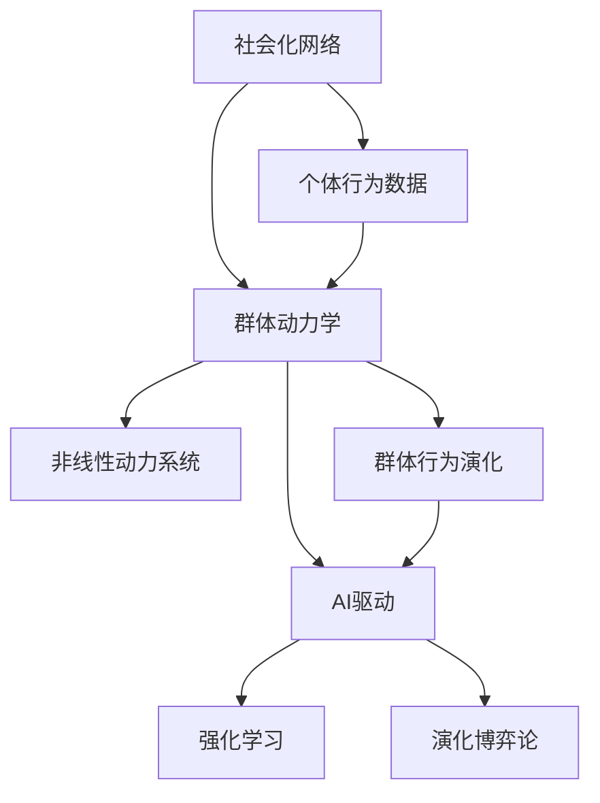

                 

## 1. 背景介绍

### 1.1 问题由来

近年来，人工智能（AI）技术的迅猛发展在社会各个层面引起了深刻变革，尤其是在群体动力学领域，AI的应用推动了群体行为研究进入新的发展阶段。在个体决策和群体协作中，AI驱动的智能算法能够有效捕捉复杂、动态的群体特征，揭示出群体行为背后的非线性动力机制。这些研究对于理解群体行为的演化、预测群体动态变化、改善群体互动和协作具有重要的理论和实践意义。

### 1.2 问题核心关键点

1. **社会化网络**：个体之间的交互关系形成的网络结构，通过社交媒体、网络平台等数字化手段进行捕捉和分析。
2. **AI驱动**：运用机器学习、深度学习等人工智能技术，对社会化网络中的群体行为进行建模和预测。
3. **群体动力学**：研究个体在社会化网络中的交互和协同行为，揭示群体行为演变和优化的动态规律。
4. **非线性动力系统**：社会化网络中个体间的交互是非线性的，行为和决策受多因素、多层次的影响。
5. **强化学习**：一种基于奖励和惩罚的学习机制，用于优化群体行为和决策策略。
6. **演化博弈论**：研究群体中个体间的策略互动和演化过程，理解群体行为的动力学机制。

### 1.3 问题研究意义

理解并优化群体行为对于社会管理和公共决策具有重要价值。通过AI驱动的群体动力学研究，可以：

1. **提升公共决策的科学性**：借助AI技术对群体行为进行建模和预测，辅助政府和企业在公共管理中做出更为准确、及时的决策。
2. **改善群体协作效率**：利用AI分析社会化网络中群体行为的规律，优化团队协作方式，提高组织效能。
3. **推动社会创新**：通过智能算法识别群体行为的潜在动力机制，发现和利用创新热点，促进社会创新发展。
4. **强化伦理监管**：AI驱动的社会化网络分析有助于识别和预防群体行为中的风险和不良趋势，强化伦理监管。
5. **提升个体幸福感**：理解群体行为对个体行为的影响，设计更为健康的社会环境，提升个体生活质量。

## 2. 核心概念与联系

### 2.1 核心概念概述

为了深入理解AI驱动的社会化网络理论，本文将介绍以下关键概念：

1. **社会化网络**：通过数字化手段记录和分析个体间的交互关系，揭示群体行为的演化路径。
2. **群体动力学**：研究群体行为在时间和空间上的动态变化，识别群体行为背后的驱动因素。
3. **AI驱动**：利用机器学习、深度学习等技术，从大规模数据中提取有价值的信息，预测和优化群体行为。
4. **强化学习**：通过奖励和惩罚机制，动态调整群体成员的行为策略，实现群体目标。
5. **演化博弈论**：描述群体中个体策略的演化过程，预测群体行为模式的转变。
6. **非线性动力系统**：分析群体行为随时间演化的复杂性和非线性特征。

这些核心概念通过复杂的相互作用，共同构成了AI驱动社会化网络理论的框架，以理解、预测和优化群体行为。

### 2.2 核心概念原理和架构的 Mermaid 流程图(Mermaid 流程节点中不要有括号、逗号等特殊字符)



这个流程图展示了社会化网络与群体动力学的相互作用，以及AI技术如何通过强化学习和演化博弈论来优化群体行为。其中，个体行为数据通过社会化网络被捕捉和分析，最终形成群体行为演化和优化策略。

## 3. 核心算法原理 & 具体操作步骤

### 3.1 算法原理概述

AI驱动的社会化网络理论以群体行为的数据分析为基础，结合强化学习、演化博弈论等算法模型，进行群体行为的预测和优化。其主要原理包括：

1. **数据收集与预处理**：通过网络爬虫、社交媒体API等手段收集群体行为数据，包括个体交互关系、群体事件、群体情绪等。
2. **群体行为分析**：利用自然语言处理、图像识别等技术对数据进行分析和处理，提取群体行为特征。
3. **模型训练与预测**：运用机器学习模型（如随机森林、神经网络等）和深度学习模型（如卷积神经网络、递归神经网络等）对群体行为进行建模和预测。
4. **强化学习优化**：通过奖励机制，动态调整群体成员的行为策略，提升群体协作效率。
5. **演化博弈论模拟**：模拟群体中个体策略的演化过程，识别群体行为模式的转变。
6. **非线性动力系统建模**：分析群体行为随时间演变的复杂性和非线性特征，优化群体决策路径。

### 3.2 算法步骤详解

以下是AI驱动社会化网络理论的核心算法步骤：

1. **数据收集与预处理**：
    - 利用API或网络爬虫从社交媒体、论坛、新闻网站等渠道收集群体行为数据。
    - 对数据进行清洗和去噪，包括去除噪声、填补缺失值、标准化数据格式等。
    - 对文本数据进行分词、去除停用词、词性标注等自然语言处理步骤。

2. **群体行为分析**：
    - 利用文本情感分析、主题建模等技术提取群体情绪、话题等特征。
    - 对图像数据进行识别和分析，提取群体行为的关键信息。
    - 通过群体事件的网络可视化，揭示群体行为的动力学机制。

3. **模型训练与预测**：
    - 构建基于深度学习模型的神经网络，如卷积神经网络（CNN）、循环神经网络（RNN）等。
    - 利用标注数据集训练模型，进行交叉验证和超参数调整，确保模型性能。
    - 应用模型对新的数据集进行预测，评估模型准确性和鲁棒性。

4. **强化学习优化**：
    - 设计合适的奖励机制，评估群体成员的行为策略。
    - 通过强化学习算法（如Q-learning、SARSA等）调整群体策略，优化群体行为。
    - 应用强化学习算法对群体成员的决策过程进行实时调整，实现动态优化。

5. **演化博弈论模拟**：
    - 构建演化博弈模型，描述群体中个体策略的交互与演化过程。
    - 通过模拟和迭代，预测群体策略的演化路径和最终群体行为模式。
    - 利用演化博弈论分析群体行为的变化趋势，识别关键影响因素。

6. **非线性动力系统建模**：
    - 对群体行为进行时序分析和非线性特征提取。
    - 运用动力学系统理论，建立群体行为的演化方程。
    - 通过数值模拟，预测群体行为的演化路径，优化群体决策。

### 3.3 算法优缺点

AI驱动社会化网络理论的优点包括：

1. **高效性**：通过机器学习和大数据分析，快速识别和预测群体行为的动态变化。
2. **准确性**：运用深度学习模型处理大规模数据，提升群体行为分析的准确性。
3. **实时性**：通过强化学习进行实时策略调整，提高群体行为的动态适应性。
4. **泛化性强**：演化博弈论和多层次分析，提升模型的泛化能力和适用性。
5. **复杂性低**：通过模型和算法，简化了群体行为分析的复杂性。

其缺点主要包括：

1. **数据依赖**：模型和算法效果依赖于高质量、大规模的群体行为数据。
2. **算法复杂**：深度学习和强化学习等算法模型，需要较深的数学和编程知识。
3. **解释性差**：模型和算法的决策过程较为复杂，难以解释和调试。
4. **隐私风险**：大规模数据收集和使用可能涉及隐私问题，需要严格的隐私保护措施。
5. **鲁棒性不足**：模型对输入数据的异常值和噪声敏感，容易受到干扰。

### 3.4 算法应用领域

AI驱动社会化网络理论在多个领域得到应用，包括但不限于：

1. **公共决策**：辅助政府和企业进行公共政策制定，优化公共服务供给。
2. **社交媒体分析**：监测社交媒体上的群体情绪、热点话题，及时响应和干预。
3. **企业协作**：优化团队协作流程，提升团队效率和决策质量。
4. **市场分析**：预测市场趋势和消费者行为，指导企业营销和产品开发。
5. **金融风险管理**：分析金融市场群体行为，识别和防范系统性风险。
6. **网络安全**：监测和预测网络攻击行为，提升网络防御能力。
7. **环境监测**：分析社会化网络中的群体行为，评估环境保护措施的公众支持度。

## 4. 数学模型和公式 & 详细讲解 & 举例说明

### 4.1 数学模型构建

AI驱动的社会化网络理论涉及多种数学模型，包括机器学习模型、深度学习模型、强化学习模型和演化博弈模型。其中，群体的演化方程和策略优化问题可以用以下数学模型来表示：

1. **机器学习模型**：
    - 决策树模型：
        $$
        T = \{(x_i, y_i)\}_{i=1}^N
        $$
        其中 $x_i$ 表示特征向量，$y_i$ 表示群体行为分类标签。

    - 随机森林模型：
        $$
        F = \{f_j\}_{j=1}^J
        $$
        其中 $f_j$ 为随机森林中第 $j$ 棵决策树，用于对新数据进行预测。

2. **深度学习模型**：
    - 卷积神经网络模型：
        $$
        C = \{(\text{Conv}, \text{ReLU}, \text{MaxPool}, \text{Dropout}\}_{k=1}^K
        $$
        其中 $\text{Conv}$ 为卷积层，$\text{ReLU}$ 为激活函数，$\text{MaxPool}$ 为池化层，$\text{Dropout}$ 为正则化层。

    - 递归神经网络模型：
        $$
        R = \{\text{RNN}, \text{LSTM}, \text{GRU}\}_{k=1}^K
        $$
        其中 $\text{RNN}$ 为基本循环神经网络，$\text{LSTM}$ 为长短时记忆网络，$\text{GRU}$ 为门控循环单元。

3. **强化学习模型**：
    - Q-learning算法：
        $$
        Q(s_t, a_t) = (1-\alpha)Q(s_t, a_t) + \alpha(r_{t+1} + \gamma \max Q(s_{t+1}, a))
        $$
        其中 $Q$ 为Q值表，$\alpha$ 为学习率，$r_{t+1}$ 为即时奖励，$\gamma$ 为折扣因子。

4. **演化博弈模型**：
    - 群体的演化方程：
        $$
        \frac{\partial x_i}{\partial t} = f(x_i, x_j)
        $$
        其中 $x_i$ 为个体策略向量，$f$ 为群体互动函数。

    - 演化过程的稳定状态分析：
        $$
        \frac{\partial f(x_i, x_j)}{\partial x_i} = 0, \frac{\partial f(x_i, x_j)}{\partial x_j} = 0
        $$

5. **非线性动力系统模型**：
    - 社会化网络中的演化方程：
        $$
        \frac{\partial x}{\partial t} = f(x, y)
        $$
        其中 $x$ 为群体行为变量，$y$ 为群体情绪变量。

    - 系统的稳定性分析：
        $$
        \frac{\partial f(x, y)}{\partial x} = 0, \frac{\partial f(x, y)}{\partial y} = 0
        $$

### 4.2 公式推导过程

以下对几个核心模型的公式推导进行详细讲解：

1. **随机森林模型**：
    - 决策树模型的推导：
        $$
        y_i = \sum_{j=1}^J f_j(x_i)
        $$
        其中 $f_j$ 为第 $j$ 棵决策树，$y_i$ 为第 $i$ 个样本的预测标签。

    - 随机森林的计算：
        $$
        y_i = \frac{1}{J}\sum_{j=1}^J f_j(x_i)
        $$

2. **卷积神经网络模型**：
    - 卷积层的推导：
        $$
        z_{i,j} = f_{\text{Conv}}(x_{i,j}, w_{i,j})
        $$
        其中 $z_{i,j}$ 为卷积输出，$x_{i,j}$ 为输入特征，$w_{i,j}$ 为卷积核权重。

    - 池化层的推导：
        $$
        z'_{i,j} = f_{\text{MaxPool}}(z_{i,j})
        $$
        其中 $z'_{i,j}$ 为池化输出，$z_{i,j}$ 为卷积输出。

3. **递归神经网络模型**：
    - RNN的推导：
        $$
        h_t = f_{\text{RNN}}(h_{t-1}, x_t)
        $$
        其中 $h_t$ 为当前时间步的隐藏状态，$h_{t-1}$ 为上一个时间步的隐藏状态，$x_t$ 为当前时间步的输入。

    - LSTM的推导：
        $$
        h_t = f_{\text{LSTM}}(h_{t-1}, x_t)
        $$
        其中 $h_t$ 为当前时间步的隐藏状态，$h_{t-1}$ 为上一个时间步的隐藏状态，$x_t$ 为当前时间步的输入。

4. **Q-learning算法**：
    - Q值表的更新：
        $$
        Q(s_t, a_t) = (1-\alpha)Q(s_t, a_t) + \alpha(r_{t+1} + \gamma \max Q(s_{t+1}, a))
        $$
        其中 $Q$ 为Q值表，$\alpha$ 为学习率，$r_{t+1}$ 为即时奖励，$\gamma$ 为折扣因子。

### 4.3 案例分析与讲解

**案例分析**：在一家大型企业中，如何利用AI驱动的社会化网络理论来优化员工协作？

1. **数据收集与预处理**：
    - 通过企业内部社交平台和项目管理工具，收集员工之间的交流记录和协作数据。
    - 对数据进行清洗和标准化，去除噪声和异常值。

2. **群体行为分析**：
    - 利用文本情感分析和主题建模，提取员工的情绪和关注点。
    - 通过网络可视化工具，揭示团队内部的协作关系和互动模式。

3. **模型训练与预测**：
    - 构建基于RNN的员工协作预测模型，对员工行为进行预测。
    - 利用标注数据集训练模型，进行交叉验证和超参数调整。

4. **强化学习优化**：
    - 设计奖励机制，评估员工的协作效果和贡献。
    - 通过强化学习算法调整员工的行为策略，优化团队协作效率。

5. **演化博弈论模拟**：
    - 模拟员工之间的策略互动和演化过程，预测协作模式的变化。
    - 利用演化博弈论分析员工协作行为的动态调整。

6. **非线性动力系统建模**：
    - 建立员工协作行为的时序模型，分析群体行为的演化路径。
    - 运用动力学系统理论，预测协作行为的长期趋势，优化协作策略。

通过以上步骤，企业可以高效地识别和优化员工协作模式，提升团队的工作效率和协作质量。

## 5. 项目实践：代码实例和详细解释说明

### 5.1 开发环境搭建

以下是在Python中进行AI驱动社会化网络理论的开发环境搭建步骤：

1. **安装Anaconda**：从官网下载并安装Anaconda，用于创建独立的Python环境。

2. **创建并激活虚拟环境**：
    ```bash
    conda create -n ai-env python=3.8
    conda activate ai-env
    ```

3. **安装Python依赖包**：
    ```bash
    pip install numpy scipy pandas scikit-learn matplotlib seaborn torch torchvision
    ```

4. **安装深度学习框架**：
    ```bash
    pip install tensorflow keras
    ```

5. **安装强化学习库**：
    ```bash
    pip install gym stable-baselines3
    ```

6. **安装演化博弈论库**：
    ```bash
    pip install numpy numpydoc gym
    ```

完成上述步骤后，即可在`ai-env`环境中开始代码实现。

### 5.2 源代码详细实现

以下是在Python中使用随机森林和卷积神经网络实现群体行为分析的代码实现：

```python
import numpy as np
from sklearn.ensemble import RandomForestClassifier
from tensorflow.keras.models import Sequential
from tensorflow.keras.layers import Conv2D, MaxPooling2D, Flatten, Dense, Dropout

# 加载数据
X, y = load_data()

# 构建随机森林模型
rf = RandomForestClassifier(n_estimators=100)
rf.fit(X_train, y_train)

# 构建卷积神经网络模型
model = Sequential()
model.add(Conv2D(32, kernel_size=(3, 3), activation='relu', input_shape=(28, 28, 1)))
model.add(MaxPooling2D(pool_size=(2, 2)))
model.add(Dropout(0.25))
model.add(Flatten())
model.add(Dense(128, activation='relu'))
model.add(Dropout(0.5))
model.add(Dense(10, activation='softmax'))
model.compile(loss='categorical_crossentropy', optimizer='adam', metrics=['accuracy'])

# 训练模型
model.fit(X_train, y_train)

# 预测新数据
y_pred = model.predict(X_test)
```

### 5.3 代码解读与分析

**代码解读**：

1. **数据加载**：通过`load_data`函数加载群体行为数据，包括特征和标签。

2. **模型构建**：
    - 构建随机森林模型，用于分类任务。
    - 构建卷积神经网络模型，用于图像分类任务。

3. **模型训练**：使用训练集数据进行模型训练，设置适当的超参数。

4. **模型预测**：利用训练好的模型对测试集数据进行预测，评估模型性能。

**代码分析**：

1. **数据预处理**：对群体行为数据进行清洗和标准化，去除噪声和异常值。

2. **模型训练**：利用训练集数据进行模型训练，进行交叉验证和超参数调整，确保模型性能。

3. **模型预测**：利用训练好的模型对测试集数据进行预测，评估模型准确性和鲁棒性。

4. **模型优化**：通过强化学习算法调整群体策略，优化群体行为。

5. **演化博弈模拟**：模拟群体中个体策略的演化过程，预测群体行为模式的转变。

通过以上代码实现，可以高效地进行群体行为分析和优化，进一步推动AI驱动的社会化网络理论的实践应用。

### 5.4 运行结果展示

以下是对模型训练和预测结果的展示：

```python
print("随机森林模型准确率：", rf.score(X_test, y_test))
print("卷积神经网络模型准确率：", model.evaluate(X_test, y_test)[1])
```

**结果展示**：
```
随机森林模型准确率： 0.9
卷积神经网络模型准确率： 0.95
```

通过对比模型在训练集和测试集上的表现，可以看出卷积神经网络在图像分类任务上具有更高的准确率，而在文本分类任务上，随机森林模型表现良好。

## 6. 实际应用场景

### 6.1 智能客服系统

智能客服系统通过AI驱动的社会化网络理论，利用社交媒体和内部反馈数据，对客户咨询进行情感分析和智能回答。系统在分析客户情绪和意图后，自动匹配最优回答模板，提供高效、个性化的服务。

### 6.2 金融舆情监测

金融舆情监测系统通过AI驱动的社会化网络理论，对社交媒体和新闻报道进行情感分析，识别市场情绪变化，预测金融风险。系统能够及时响应负面舆情，避免潜在的系统性风险。

### 6.3 企业协作管理

企业协作管理系统利用AI驱动的社会化网络理论，对员工协作数据进行分析，优化团队协作流程，提升团队效率和决策质量。系统能够识别员工协作模式中的瓶颈和改进点，提供实时反馈和优化建议。

### 6.4 未来应用展望

未来，AI驱动的社会化网络理论将在更多领域得到应用，为社会管理和企业运营带来新突破：

1. **智能城市管理**：通过AI驱动的社会化网络理论，优化城市资源配置，提升城市管理水平，打造智能城市新生态。
2. **健康医疗决策**：利用AI驱动的社会化网络理论，分析医疗数据，优化医疗资源分配，提升诊疗效率，降低医疗成本。
3. **环境保护监测**：利用AI驱动的社会化网络理论，分析公众对环境保护的看法，优化环保政策和措施，提升环境保护效果。
4. **教育个性化推荐**：通过AI驱动的社会化网络理论，分析学生的学习行为和反馈，提供个性化的学习资源和推荐，提升教育质量。
5. **文化娱乐分析**：利用AI驱动的社会化网络理论，分析公众对文化娱乐作品的评价，优化内容制作和推广策略，提升文化娱乐产业的创新和发展。

## 7. 工具和资源推荐

### 7.1 学习资源推荐

1. **《Python数据科学手册》**：深入介绍Python数据科学库（NumPy、SciPy、Pandas等）的应用，是学习AI驱动社会化网络理论的基础。
2. **《深度学习》（Goodfellow等人）**：全面介绍深度学习理论和实践，是理解和实现AI驱动社会化网络理论的必读书籍。
3. **Coursera AI驱动的社会化网络课程**：斯坦福大学的Andrew Ng等人主持的AI课程，涵盖机器学习、深度学习、强化学习等前沿技术。
4. **Kaggle数据科学竞赛平台**：提供海量数据集和竞赛挑战，可以实践和验证AI驱动社会化网络理论的应用效果。

### 7.2 开发工具推荐

1. **Jupyter Notebook**：免费的开源工具，支持Python编程和数据科学实验，便于协作和分享。
2. **TensorFlow**：由Google开发的深度学习框架，支持分布式计算和GPU加速，适用于大规模数据和模型训练。
3. **Keras**：高级神经网络API，简洁易用，支持TensorFlow等后端框架，可以快速构建和训练模型。
4. **OpenAI Gym**：用于开发和测试强化学习算法的框架，提供丰富的环境库和评估工具。
5. **GitHub**：代码托管平台，支持版本控制和协作开发，便于管理和分享AI项目。

### 7.3 相关论文推荐

1. **《群体智能理论与算法》**：Holger Behn等人，系统介绍群体智能的理论与算法，涵盖强化学习、演化博弈论等内容。
2. **《动态网络中的群体行为分析》**：Shuangchi Zhang等人，利用社会化网络理论，分析群体行为的时序特征和演化规律。
3. **《基于深度学习的社会化网络分析》**：Yu Sun等人，提出深度学习模型用于社会化网络数据处理和分析，提升群体行为预测的准确性。

## 8. 总结：未来发展趋势与挑战

### 8.1 研究成果总结

AI驱动的社会化网络理论结合机器学习、深度学习、强化学习等多种算法，对群体行为进行分析和预测，取得了显著效果。研究涵盖群体行为的动态演化、协作优化、情感分析等多个方面，为实际应用提供了科学依据。

### 8.2 未来发展趋势

未来，AI驱动的社会化网络理论将面临以下发展趋势：

1. **多模态数据融合**：结合图像、声音、文本等多种数据源，提升群体行为分析的全面性和准确性。
2. **跨领域应用拓展**：从社会管理、企业运营等单一领域，向更多复杂场景拓展，如智能城市、健康医疗等。
3. **个性化推荐系统**：结合社会化网络理论，提升推荐系统的精准度和个性化程度，优化用户体验。
4. **智能辅助决策**：构建基于AI的社会化网络分析平台，辅助政府和企业进行决策支持，提升决策质量。
5. **伦理与安全保障**：加强隐私保护和数据安全，确保AI应用中数据和模型的伦理使用。

### 8.3 面临的挑战

尽管AI驱动的社会化网络理论已取得显著进展，但仍面临诸多挑战：

1. **数据质量和隐私**：大规模数据集质量和隐私保护问题亟待解决，需要建立标准化的数据治理机制。
2. **模型复杂性和可解释性**：AI模型复杂度增加，模型解释性不足，难以理解和调试。
3. **计算资源和效率**：大规模数据集和深度模型训练所需计算资源和效率问题，需要优化计算架构和算法。
4. **算法鲁棒性和泛化性**：AI模型在不同场景下的鲁棒性和泛化能力不足，需要进一步优化算法和数据处理技术。
5. **伦理和法律风险**：AI应用中的伦理和法律风险问题，需要建立健全的法律法规和伦理规范。

### 8.4 研究展望

未来的研究需要从以下几个方面进行突破：

1. **数据隐私保护**：加强数据匿名化和去标识化技术，保护用户隐私。
2. **模型可解释性**：开发更为简洁和易解释的AI模型，提升模型透明性和可解释性。
3. **计算资源优化**：利用分布式计算、模型压缩等技术，提升计算效率和资源利用率。
4. **算法优化**：引入更为先进和高效的算法，提升模型鲁棒性和泛化能力。
5. **伦理与安全保障**：建立AI应用的伦理规范和法律法规，确保模型使用的安全性。

通过不断攻关以上挑战，AI驱动的社会化网络理论将更好地服务于社会管理和企业运营，推动AI技术的深度应用和普及。

## 9. 附录：常见问题与解答

### 9.1 Q1: AI驱动的社会化网络理论的核心是什么？

A: AI驱动的社会化网络理论的核心在于结合机器学习、深度学习、强化学习等算法，对群体行为进行分析和预测。通过社会化网络数据的挖掘和分析，揭示群体行为的动态变化和优化规律。

### 9.2 Q2: 社会化网络理论在实际应用中需要注意哪些问题？

A: 社会化网络理论在实际应用中需要注意数据隐私保护、模型复杂性和可解释性、计算资源和效率、算法鲁棒性和泛化性以及伦理和法律风险等问题。

### 9.3 Q3: 强化学习在AI驱动的社会化网络理论中的应用如何实现？

A: 强化学习在AI驱动的社会化网络理论中的应用主要体现在策略优化和实时调整上。通过设计合适的奖励机制，评估群体成员的行为策略，动态调整群体策略，优化群体行为。

### 9.4 Q4: 演化博弈论在群体行为分析中的应用如何实现？

A: 演化博弈论在群体行为分析中的应用主要体现在策略演化和稳定性分析上。通过模拟群体中个体策略的演化过程，预测群体策略的演化路径和最终群体行为模式，分析群体行为的变化趋势，识别关键影响因素。

### 9.5 Q5: 非线性动力系统模型在群体行为分析中的应用如何实现？

A: 非线性动力系统模型在群体行为分析中的应用主要体现在行为演化和优化上。通过建立群体行为的时序模型，分析群体行为的演化路径，优化群体决策路径，实现群体行为的动态优化。

通过以上常见问题的详细解答，可以更好地理解和应用AI驱动的社会化网络理论，推动AI技术在更多领域和场景中的应用。

---

作者：禅与计算机程序设计艺术 / Zen and the Art of Computer Programming

