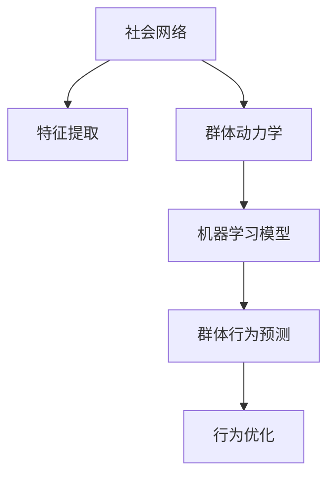

                 

# 欲望社会网络分析师：AI驱动的群体动力学研究员

## 1. 背景介绍

### 1.1 问题由来

当前，社会网络分析(Social Network Analysis, SNA)已成为理解和预测群体行为的重要工具。然而，传统的社会网络分析方法存在诸多局限性，如需要大量手动标注数据、计算复杂度高、难以处理动态网络等。随着人工智能(AI)和机器学习(ML)技术的发展，利用AI对社会网络进行自动化分析成为可能，其中群体动力学研究是一个重要的研究方向。

### 1.2 问题核心关键点

群体动力学研究旨在揭示和预测群体行为模式，进而优化群体决策、提高群体效率。AI驱动的群体动力学研究，利用机器学习模型分析社会网络数据，揭示群体行为规律，预测群体动态变化。

## 2. 核心概念与联系

### 2.1 核心概念概述

为更好地理解AI驱动的群体动力学研究，本节将介绍几个关键概念：

- 社会网络(Social Network)：由个体或组织之间的互动关系构成的网络结构，常见指标包括度、中心性、社区结构等。
- 群体动力学(Population Dynamics)：研究群体中个体行为变化、群体演化规律的理论，广泛应用于生物学、社会学、经济学等领域。
- AI驱动(SAID: Socially Aided Individual Dynamics)：利用AI技术，特别是机器学习模型，对社会网络数据进行自动化分析，揭示群体行为规律，预测群体动态变化。
- 特征提取(Feature Extraction)：从原始网络数据中提取出有意义的特征，用于机器学习模型的训练。
- 机器学习模型：如随机森林(Random Forest)、深度学习模型等，用于预测群体行为、发现规律等。

这些核心概念之间的逻辑关系可以通过以下Mermaid流程图来展示：



这个流程图展示了大语言模型的核心概念及其之间的关系：

1. 社会网络通过特征提取形成有意义的输入数据。
2. 特征输入到群体动力学模型，揭示群体行为规律。
3. 群体动力学模型基于机器学习模型，预测群体动态变化。
4. 群体行为预测用于优化群体决策，提高群体效率。

这些概念共同构成了AI驱动的群体动力学研究框架，使其能够从数据中提取有价值的规律，应用于社会管理和优化。

## 3. 核心算法原理 & 具体操作步骤
### 3.1 算法原理概述

AI驱动的群体动力学研究主要涉及以下几个步骤：

1. 数据预处理：对社会网络数据进行清洗、去噪、归一化等处理，提取关键特征。
2. 群体动力学建模：基于提取的特征，利用机器学习模型或深度学习模型进行群体行为预测。
3. 模型优化：通过超参数调优、模型融合等手段提升预测精度和泛化能力。
4. 结果应用：将模型预测结果应用于群体决策优化，提升群体效率。

### 3.2 算法步骤详解

以下是AI驱动的群体动力学研究的详细步骤：

**Step 1: 数据预处理**

1. 数据收集：通过网络爬虫、问卷调查等方式收集社会网络数据。
2. 数据清洗：去除噪音、缺失值、异常值等，确保数据质量。
3. 数据归一化：将不同维度的数据统一到同一量级，便于机器学习模型处理。
4. 特征提取：使用PCA、ICA、LDA等降维方法，提取关键特征，形成有意义的输入数据。

**Step 2: 群体动力学建模**

1. 模型选择：根据数据特点和问题需求，选择适合的机器学习模型，如随机森林、深度学习等。
2. 模型训练：将预处理后的数据输入模型进行训练，学习群体行为规律。
3. 模型评估：在测试集上评估模型性能，使用交叉验证等方法验证模型泛化能力。
4. 超参数调优：通过网格搜索、贝叶斯优化等手段，寻找最优超参数组合，提升模型效果。

**Step 3: 模型优化**

1. 模型融合：将多个模型的预测结果进行加权平均或投票等操作，提升预测精度。
2. 集成学习：利用Bagging、Boosting等集成学习技术，增强模型鲁棒性。
3. 模型解释：使用LIME、SHAP等工具解释模型预测结果，增强模型透明度。
4. 超参数调优：进一步优化模型超参数，提升模型效果。

**Step 4: 结果应用**

1. 群体决策优化：根据模型预测结果，优化群体决策，提升群体效率。
2. 行为预测应用：应用于市场预测、舆情分析、危机预警等场景。
3. 实时数据处理：实现实时数据分析，及时调整群体行为策略。

### 3.3 算法优缺点

AI驱动的群体动力学研究具有以下优点：

1. 自动化分析：通过特征提取、机器学习模型等技术，实现对社会网络数据的自动化分析。
2. 高效建模：利用机器学习模型和大数据技术，高效构建群体动力学模型，提升预测精度。
3. 广泛应用：应用于群体决策优化、市场预测、舆情分析等多个领域，具有广泛的适用性。
4. 实时处理：结合实时数据处理技术，实现对群体动态变化的实时监控和预测。

同时，该方法也存在一定的局限性：

1. 数据质量依赖：模型效果高度依赖于数据质量，数据噪声和缺失值可能影响模型性能。
2. 模型复杂度：深度学习模型等复杂模型计算量较大，需要高性能硬件支持。
3. 可解释性不足：许多AI模型难以解释其预测逻辑，缺乏透明性。
4. 鲁棒性不足：模型对数据分布的微小变化可能非常敏感，泛化能力有限。
5. 数据隐私：涉及大量个人数据，数据隐私和安全问题需特别注意。

尽管存在这些局限性，但就目前而言，AI驱动的群体动力学研究已成为社会网络分析的重要手段。未来相关研究的重点在于如何进一步降低数据依赖，提高模型可解释性和鲁棒性，同时兼顾数据隐私和伦理问题。

### 3.4 算法应用领域

AI驱动的群体动力学研究在众多领域中都有广泛应用，例如：

1. 舆情分析：对社交媒体数据进行情感分析，预测舆情变化趋势。
2. 危机预警：对网络数据进行实时监控，预警可能的群体事件。
3. 市场预测：基于社交网络数据，预测市场趋势和投资机会。
4. 医疗健康：分析患者社交网络数据，预测疾病传播趋势。
5. 社会治理：利用社会网络数据，优化社会管理决策。

除了这些典型应用外，AI驱动的群体动力学研究还被创新性地应用到更多场景中，如反恐预警、情报分析、舆情管理等，为社会治理和社会安全提供了新的技术手段。

## 4. 数学模型和公式 & 详细讲解 & 举例说明

### 4.1 数学模型构建

本节将使用数学语言对AI驱动的群体动力学研究进行更加严格的刻画。

记社会网络数据为 $D=\{(x_i,y_i)\}_{i=1}^N$，其中 $x_i$ 为个体特征向量，$y_i$ 为行为标签。假设选择的机器学习模型为 $M$，目标是最小化预测误差：

$$
\min_{\theta} \frac{1}{N}\sum_{i=1}^N \ell(M(x_i),y_i)
$$

其中 $\ell$ 为损失函数，$\theta$ 为模型参数。

### 4.2 公式推导过程

以随机森林模型为例，推导其预测误差公式。

假设随机森林模型由 $k$ 棵决策树组成，每棵树的预测结果为 $h(x_i)$，最终预测结果为 $M(x_i)=\frac{1}{k}\sum_{j=1}^k h_j(x_i)$。则预测误差为：

$$
\ell(M(x_i),y_i) = L(h_1(x_i),y_i) + L(h_2(x_i),y_i) + \cdots + L(h_k(x_i),y_i)
$$

其中 $L$ 为损失函数，如均方误差或交叉熵。

通过上述推导，可以看到，随机森林模型的预测误差是每棵树预测误差的加权平均。利用集成学习技术，可以进一步提升模型性能。

### 4.3 案例分析与讲解

以舆情分析为例，利用AI驱动的群体动力学研究进行情感分析：

1. 数据预处理：通过网络爬虫收集社交媒体数据，去除噪音和无用信息，提取情感特征。
2. 群体动力学建模：使用随机森林模型对情感特征进行训练，学习舆情变化规律。
3. 模型优化：通过超参数调优和模型融合，提升预测精度和泛化能力。
4. 结果应用：基于预测结果，制定舆情预警策略，优化社会管理决策。

## 5. 项目实践：代码实例和详细解释说明
### 5.1 开发环境搭建

在进行AI驱动的群体动力学研究开发前，我们需要准备好开发环境。以下是使用Python进行Scikit-learn开发的简单配置流程：

1. 安装Anaconda：从官网下载并安装Anaconda，用于创建独立的Python环境。

2. 创建并激活虚拟环境：
```bash
conda create -n sklearn-env python=3.8 
conda activate sklearn-env
```

3. 安装Scikit-learn：
```bash
conda install scikit-learn
```

4. 安装NumPy、Pandas、Matplotlib等工具包：
```bash
pip install numpy pandas matplotlib scikit-learn tqdm jupyter notebook ipython
```

完成上述步骤后，即可在`sklearn-env`环境中开始实践。

### 5.2 源代码详细实现

这里我们以舆情分析为例，给出使用Scikit-learn进行随机森林模型训练的代码实现。

首先，定义数据预处理函数：

```python
from sklearn.feature_extraction.text import TfidfVectorizer
from sklearn.model_selection import train_test_split

def preprocess_data(data):
    texts = data['text']
    labels = data['label']
    vectorizer = TfidfVectorizer(max_features=5000)
    X = vectorizer.fit_transform(texts)
    return X, labels
```

然后，定义模型训练和评估函数：

```python
from sklearn.ensemble import RandomForestClassifier
from sklearn.metrics import classification_report

def train_model(X, y, train_size=0.8):
    X_train, X_test, y_train, y_test = train_test_split(X, y, train_size=train_size)
    model = RandomForestClassifier(n_estimators=100, max_depth=3)
    model.fit(X_train, y_train)
    y_pred = model.predict(X_test)
    print(classification_report(y_test, y_pred))
```

最后，启动训练流程：

```python
X, y = preprocess_data(data)
train_model(X, y)
```

以上就是使用Scikit-learn进行舆情分析的完整代码实现。可以看到，利用Scikit-learn，开发者可以非常方便地构建和训练随机森林模型，进行舆情分析。

### 5.3 代码解读与分析

让我们再详细解读一下关键代码的实现细节：

**preprocess_data函数**：
- `texts`和`labels`分别代表社交媒体文本和情感标签。
- 使用TfidfVectorizer对文本进行特征提取，提取5000个最相关的特征。
- 返回特征矩阵`X`和标签向量`y`。

**train_model函数**：
- `train_size`代表训练集与测试集的划分比例。
- 使用train_test_split对数据集进行划分，得到训练集和测试集。
- 创建随机森林模型`RandomForestClassifier`，设定100棵树和最大深度3。
- 在训练集上训练模型，并使用测试集进行评估。
- 使用classification_report打印分类指标。

**训练流程**：
- 通过preprocess_data函数对数据进行预处理，提取特征。
- 调用train_model函数，在训练集上训练随机森林模型。
- 在测试集上评估模型性能，打印分类报告。

可以看到，利用Scikit-learn，开发AI驱动的群体动力学研究代码非常简单高效，可以快速迭代实验。

当然，工业级的系统实现还需考虑更多因素，如数据预处理、特征选择、模型优化、数据可视化等。但核心的算法流程基本与此类似。

## 6. 实际应用场景
### 6.1 舆情分析

AI驱动的群体动力学研究在舆情分析中具有重要应用。通过分析社交媒体数据，利用随机森林模型等技术，可以自动预测舆情变化趋势，及时预警可能的群体事件。

在技术实现上，可以收集社交媒体上的文本数据，提取情感特征，使用随机森林模型进行训练，得到舆情变化规律。在实际应用中，可以利用模型预测未来舆情变化，制定相应的舆情应对策略。

### 6.2 危机预警

在金融、公共安全等领域，及时预警可能的群体危机事件至关重要。AI驱动的群体动力学研究可以实时监控社会网络数据，通过预测模型自动预警潜在的危机事件，帮助决策者及时采取应对措施。

在实现上，可以收集网络舆情数据，提取关键特征，使用深度学习模型进行训练。通过实时数据流输入模型，预测群体行为变化，自动生成预警信息。

### 6.3 市场预测

在金融市场分析中，预测市场趋势和投资机会是重要的决策依据。AI驱动的群体动力学研究可以基于社交媒体数据，分析市场情绪，预测市场变化趋势。

在实现上，可以收集财经新闻、社交媒体评论等数据，提取市场特征，使用机器学习模型进行训练。通过预测模型自动生成市场预测报告，帮助投资者制定投资策略。

### 6.4 未来应用展望

随着AI驱动的群体动力学研究的不断发展，其在更多领域的应用前景也将不断扩大：

1. 智能推荐系统：分析用户行为数据，利用群体动力学模型推荐个性化内容，提升用户体验。
2. 群体行为优化：应用于社会治理、企业组织管理等领域，优化群体决策和行为，提升效率。
3. 金融风险管理：利用群体动力学模型分析金融市场行为，预测风险事件，提供风险预警服务。
4. 公共健康预测：分析社交媒体数据，预测疾病传播趋势，提供公共健康预警服务。
5. 事件监控与分析：应用于大型活动、赛事等场景，实时监控人群行为，提供预警和应急管理支持。

AI驱动的群体动力学研究具有广泛的应用前景，随着技术的不断进步，必将在更多领域发挥重要作用。

## 7. 工具和资源推荐
### 7.1 学习资源推荐

为了帮助开发者系统掌握AI驱动的群体动力学研究的理论基础和实践技巧，这里推荐一些优质的学习资源：

1. 《Python机器学习》系列书籍：介绍机器学习基础和Scikit-learn使用，是学习AI驱动群体动力学研究的入门必读。
2. CS229《机器学习》课程：斯坦福大学开设的机器学习经典课程，详细讲解机器学习算法和应用，有助于深入理解群体动力学模型。
3. Scikit-learn官方文档：提供Scikit-learn的详细文档和样例代码，是开发实践的重要参考。
4. HuggingFace官方文档：提供丰富的预训练模型和模型优化技巧，适用于开发实际应用系统。
5. Kaggle：机器学习竞赛平台，提供大量数据集和样例代码，有助于学习实战经验。

通过对这些资源的学习实践，相信你一定能够快速掌握AI驱动的群体动力学研究的核心技术和实际应用方法。

### 7.2 开发工具推荐

高效的开发离不开优秀的工具支持。以下是几款用于AI驱动的群体动力学研究的常用工具：

1. Python：基于C语言的解释型语言，生态丰富，适用于数据处理和模型训练。
2. Scikit-learn：开源机器学习库，提供多种算法和模型，易于上手。
3. TensorFlow：由Google开发的深度学习框架，适用于复杂模型和大规模数据训练。
4. Jupyter Notebook：交互式编程环境，支持代码和结果的可视化，适合快速迭代实验。
5. Weights & Biases：实验跟踪工具，实时监测模型训练过程，方便调试和优化。
6. TensorBoard：TensorFlow配套的可视化工具，提供模型训练状态的图表，帮助理解模型行为。

合理利用这些工具，可以显著提升AI驱动的群体动力学研究的开发效率，加快创新迭代的步伐。

### 7.3 相关论文推荐

AI驱动的群体动力学研究的发展源于学界的持续研究。以下是几篇奠基性的相关论文，推荐阅读：

1. "Stochastic Blockmodels of Latent Social Networks"：提出社交网络中的社区结构模型，对群体行为进行预测和分析。
2. "Influence Maximization in Social Networks"：研究社交网络中的信息传播和影响力扩散，提出基于群体动力学的信息传播模型。
3. "A Unified Model for Multi-level Social Network Analysis"：提出多级社会网络分析模型，从个体、群体、社会三个层面分析群体行为。
4. "Social Network Analysis and Mining: Concepts, Methods, and Tools"：介绍社会网络分析的基本概念和常用方法，是学习群体动力学研究的必读教材。
5. "Deep Learning for Social Good"：探讨深度学习在社会网络分析中的应用，涵盖舆情分析、危机预警等多个领域。

这些论文代表了大语言模型微调技术的发展脉络。通过学习这些前沿成果，可以帮助研究者把握学科前进方向，激发更多的创新灵感。

## 8. 总结：未来发展趋势与挑战
### 8.1 总结

本文对AI驱动的群体动力学研究进行了全面系统的介绍。首先阐述了群体动力学研究的重要性及其在AI领域的潜在应用。其次，从原理到实践，详细讲解了机器学习模型在群体动力学分析中的应用，给出了实际应用的代码实现。同时，本文还广泛探讨了AI驱动的群体动力学研究在舆情分析、危机预警、市场预测等多个领域的应用前景，展示了该技术的巨大潜力。此外，本文精选了相关学习资源和工具，力求为读者提供全方位的技术指引。

通过本文的系统梳理，可以看到，AI驱动的群体动力学研究通过机器学习模型，能够高效揭示群体行为规律，预测群体动态变化，具有广阔的应用前景。未来，随着技术不断进步，该研究将进一步拓展社会网络分析的应用范围，为社会治理和社会安全提供新的技术手段。

### 8.2 未来发展趋势

展望未来，AI驱动的群体动力学研究将呈现以下几个发展趋势：

1. 数据质量提升：利用更多高质量的社交媒体数据，提升模型性能。
2. 模型复杂度增加：引入深度学习等复杂模型，提升预测精度和鲁棒性。
3. 实时处理能力增强：结合实时数据处理技术，实现对群体动态变化的实时监控和预测。
4. 多模态融合：结合社交网络、新闻、评论等多种数据源，提升模型准确性和泛化能力。
5. 可解释性增强：利用可解释性模型，提升模型透明度和可信度。
6. 跨领域应用拓展：应用于更多行业和领域，如医疗健康、公共安全、金融风险等。

以上趋势凸显了AI驱动的群体动力学研究的前景广阔，该研究将为社会治理和社会安全提供更高效、更精准的技术支持。

### 8.3 面临的挑战

尽管AI驱动的群体动力学研究取得了显著进展，但在迈向更加智能化、普适化应用的过程中，仍面临诸多挑战：

1. 数据获取难度：高质量、大规模的社会网络数据获取难度大，需要投入大量时间和精力。
2. 数据隐私问题：涉及大量个人数据，数据隐私和安全问题需特别注意。
3. 模型复杂度：复杂模型计算量较大，对硬件资源要求高，难以在低端设备上部署。
4. 可解释性不足：许多AI模型难以解释其预测逻辑，缺乏透明性。
5. 鲁棒性不足：模型对数据分布的微小变化可能非常敏感，泛化能力有限。

尽管存在这些挑战，但通过积极应对和不断优化，相信AI驱动的群体动力学研究将不断成熟，进一步拓展其应用范围。

### 8.4 研究展望

面对AI驱动的群体动力学研究所面临的挑战，未来的研究需要在以下几个方面寻求新的突破：

1. 探索无监督和半监督学习：摆脱对大规模标注数据的依赖，利用自监督学习、主动学习等技术，最大限度利用非结构化数据，实现更加灵活高效的群体动力学分析。
2. 研究参数高效和计算高效的模型：开发更加参数高效的模型，在固定大部分预训练参数的同时，只更新极少量的任务相关参数。同时优化模型的计算图，减少前向传播和反向传播的资源消耗，实现更加轻量级、实时性的部署。
3. 引入更多先验知识：将符号化的先验知识，如知识图谱、逻辑规则等，与神经网络模型进行巧妙融合，引导群体动力学分析过程学习更准确、合理的语言模型。同时加强不同模态数据的整合，实现视觉、语音等多模态信息与文本信息的协同建模。
4. 纳入伦理道德约束：在模型训练目标中引入伦理导向的评估指标，过滤和惩罚有偏见、有害的输出倾向。同时加强人工干预和审核，建立模型行为的监管机制，确保输出符合人类价值观和伦理道德。
5. 模型与外部系统的集成：将群体动力学分析模型与其他系统集成，如决策支持系统、事件管理系统等，形成完整的社会治理解决方案。

这些研究方向的探索，必将引领AI驱动的群体动力学研究走向更高的台阶，为构建安全、可靠、可解释、可控的智能系统铺平道路。面向未来，该研究还需要与其他AI技术进行更深入的融合，如因果推理、强化学习等，多路径协同发力，共同推动自然语言理解和智能交互系统的进步。只有勇于创新、敢于突破，才能不断拓展语言模型的边界，让智能技术更好地造福人类社会。

## 9. 附录：常见问题与解答

**Q1：AI驱动的群体动力学研究是否适用于所有社会网络数据？**

A: AI驱动的群体动力学研究在大多数社会网络数据上都能取得不错的效果，特别是对于数据量较大的场景。但对于一些特定领域的社会网络数据，如医疗、法律等，可能需要针对领域特点进行特殊处理，才能获得理想的结果。

**Q2：在AI驱动的群体动力学研究中，如何选择适合的机器学习模型？**

A: 机器学习模型的选择应根据数据特点和问题需求进行。例如，对于情感分析等分类任务，可以使用随机森林、支持向量机等简单模型；对于复杂的关系挖掘任务，可以使用深度学习模型如LSTM、GRU等。同时，也可以结合集成学习等技术，提高模型的鲁棒性和泛化能力。

**Q3：在AI驱动的群体动力学研究中，如何处理数据隐私问题？**

A: 数据隐私问题是AI驱动的群体动力学研究中需要特别关注的问题。可以采用数据匿名化、去标识化等手段，对原始数据进行处理，保护个人隐私。同时，利用联邦学习等技术，在保护数据隐私的前提下，实现模型训练和预测。

**Q4：在AI驱动的群体动力学研究中，如何提升模型的可解释性？**

A: 提升模型的可解释性是AI驱动的群体动力学研究中的重要任务。可以采用模型可视化、LIME、SHAP等工具，对模型预测结果进行解释，增强模型的透明性和可信度。同时，也可以引入符号化规则和知识库，辅助模型决策。

**Q5：在AI驱动的群体动力学研究中，如何处理数据噪声和异常值？**

A: 数据噪声和异常值对群体动力学分析模型的影响较大，需要进行处理。可以使用过滤、平滑、离群点检测等手段，对数据进行清洗和预处理，确保数据质量。同时，也可以引入鲁棒性强的模型，增强模型的抗干扰能力。

这些问题的解答，将有助于开发者更好地理解和应用AI驱动的群体动力学研究，在实际应用中取得更好的效果。

---

作者：禅与计算机程序设计艺术 / Zen and the Art of Computer Programming

