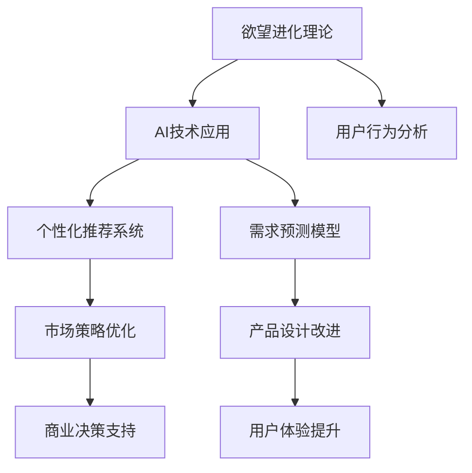

                 

# 欲望进化论学者：AI重塑的人类需求研究员

> 关键词：人工智能(AI)，需求分析，欲望进化论，人类行为预测，个性化推荐，用户需求模型

## 1. 背景介绍

### 1.1 问题由来

在数字时代的浪潮中，消费者需求和市场行为正在经历前所未有的变化。随着互联网、大数据和人工智能技术的不断演进，消费者需求的动态性、复杂性和多样性日益凸显。如何在瞬息万变的环境中洞察消费者需求，制定精准有效的市场策略，成为摆在每个企业面前的巨大挑战。

欲望进化论学者正是在这样的背景下应运而生。通过对人类欲望与行为的研究，洞察市场趋势，预测未来需求，从而为企业提供科学、系统的决策支持。结合人工智能技术，尤其是深度学习、自然语言处理和大数据技术，欲望进化论学者能够更好地理解消费者行为，揭示需求的潜在变化，为商业决策提供有力支撑。

### 1.2 问题核心关键点

欲望进化论学者通过深度学习和数据分析技术，试图捕捉消费者欲望的变化轨迹，预测未来的需求趋势，为商业决策提供科学依据。其核心关键点包括：

- **欲望进化理论**：基于行为经济学和心理学理论，探究人类欲望的变化规律。
- **AI技术应用**：利用机器学习、深度学习和自然语言处理等技术，自动化分析消费者行为数据，提取潜在需求。
- **个性化推荐**：根据消费者历史行为和兴趣偏好，提供个性化定制的推荐服务，提升用户体验。
- **需求预测模型**：构建预测模型，基于历史数据和实时数据，预测消费者未来需求，指导市场策略。
- **用户行为分析**：分析用户行为数据，挖掘潜在需求，优化产品设计和市场推广策略。

这些核心点构成了欲望进化论学者的基础框架，使得其能够在复杂的市场环境中，洞察消费者需求，提供精准的商业决策支持。

### 1.3 问题研究意义

欲望进化论学者的研究对于理解消费者需求、优化市场营销策略、提升用户体验和推动企业可持续发展具有重要意义：

1. **洞察消费者需求**：通过数据分析和AI技术，准确捕捉消费者的欲望变化，揭示潜在需求，帮助企业及时调整产品和服务策略。
2. **优化市场策略**：基于需求预测，制定更加精准的市场推广和产品定价策略，提高市场竞争力。
3. **提升用户体验**：通过个性化推荐系统，提供定制化的服务，满足消费者个性化需求，提升用户满意度和忠诚度。
4. **推动企业发展**：深入理解消费者行为和需求变化，为企业的创新和产品优化提供方向，助力企业持续健康发展。
5. **促进经济增长**：满足消费者多样化需求，推动消费市场的繁荣，促进经济增长和社会进步。

## 2. 核心概念与联系

### 2.1 核心概念概述

为了更好地理解欲望进化论学者的工作原理，本节将介绍几个密切相关的核心概念：

- **欲望进化理论**：基于行为经济学和心理学理论，探究人类欲望的动态变化规律。欲望进化论学者认为，消费者的欲望受到多种因素的影响，如经济环境、社会文化、技术进步等，随时间和外部环境的变化而不断演进。

- **AI技术应用**：人工智能技术，尤其是深度学习、自然语言处理和大数据分析，为欲望进化论学者提供了强大的技术支持。通过对大量数据进行分析和建模，AI技术能够自动化地提取消费者行为特征，预测未来需求。

- **个性化推荐系统**：根据消费者历史行为和兴趣偏好，推荐个性化的产品和服务，提升用户体验。个性化推荐系统是欲望进化论学者为实现精准市场营销的重要工具。

- **需求预测模型**：构建基于历史数据和实时数据的预测模型，预测消费者未来需求，指导市场策略。需求预测模型是欲望进化论学者进行需求分析的关键技术之一。

- **用户行为分析**：分析用户行为数据，挖掘消费者潜在需求，优化产品设计和市场推广策略。用户行为分析是欲望进化论学者进行需求洞察的基础工作。

这些核心概念之间的逻辑关系可以通过以下Mermaid流程图来展示：



这个流程图展示了欲望进化论学者的核心概念及其之间的关系：

1. 欲望进化理论提供需求洞察的理论基础。
2. AI技术应用为数据分析和需求预测提供技术手段。
3. 个性化推荐系统和需求预测模型基于数据洞察，实现精准市场策略和产品设计。
4. 用户行为分析是理论应用的基础。
5. 市场策略优化和产品设计改进最终提升用户体验和商业价值。
6. 商业决策支持则是整个体系的目标。

这些概念共同构成了欲望进化论学者的核心工作框架，使其能够在复杂的市场环境中，实现需求洞察、市场策略优化和用户体验提升。

## 3. 核心算法原理 & 具体操作步骤
### 3.1 算法原理概述

欲望进化论学者的核心算法原理，是基于深度学习和大数据分析技术，对消费者行为数据进行建模和预测，从而揭示消费者欲望的动态变化，预测未来需求。其核心算法包括以下几个关键步骤：

1. **数据收集与预处理**：收集消费者行为数据，包括购买记录、浏览历史、搜索关键词等，进行清洗和标准化处理。
2. **特征提取与建模**：利用深度学习模型，如神经网络、卷积神经网络(CNN)、循环神经网络(RNN)等，提取消费者行为特征，建立需求预测模型。
3. **欲望进化模型训练**：基于行为经济学理论，构建欲望进化模型，对历史数据进行训练，揭示欲望变化的规律。
4. **需求预测**：利用训练好的模型，对实时数据进行预测，预测消费者未来的需求变化。
5. **个性化推荐**：根据预测结果，结合用户历史行为，提供个性化的产品和服务推荐。

### 3.2 算法步骤详解

欲望进化论学者的算法步骤可以大致分为以下几个环节：

**Step 1: 数据收集与预处理**

- 收集消费者行为数据，包括购买记录、浏览历史、搜索关键词等，记录消费者在不同时间点的行为。
- 清洗数据，去除无效或异常数据，进行缺失值填充和数据标准化处理。
- 划分数据集，分为训练集、验证集和测试集，用于模型训练和评估。

**Step 2: 特征提取与建模**

- 利用深度学习模型，如CNN、RNN等，提取消费者行为特征。
- 构建需求预测模型，如线性回归模型、神经网络模型、长短期记忆网络(LSTM)等。
- 使用正则化技术，如L1正则、L2正则等，防止过拟合。

**Step 3: 欲望进化模型训练**

- 根据行为经济学理论，构建欲望进化模型，揭示欲望随时间变化的规律。
- 使用历史数据对欲望进化模型进行训练，获取欲望进化趋势。
- 评估模型性能，使用交叉验证等方法进行参数调优。

**Step 4: 需求预测**

- 利用训练好的欲望进化模型和需求预测模型，对实时数据进行预测。
- 结合消费者历史行为数据，预测消费者未来需求。
- 使用评估指标，如均方误差(MSE)、均方根误差(RMSE)等，评估预测准确度。

**Step 5: 个性化推荐**

- 根据预测结果，结合消费者历史行为，提供个性化的产品和服务推荐。
- 使用推荐算法，如协同过滤、基于内容的推荐等，生成推荐列表。
- 评估推荐效果，使用评估指标如准确率、召回率、F1-score等进行评估。

### 3.3 算法优缺点

欲望进化论学者的算法具有以下优点：

- **自动化数据处理**：利用深度学习模型自动提取特征，减少人工干预，提高数据处理效率。
- **精准需求预测**：结合历史和实时数据，构建动态需求预测模型，提高预测准确度。
- **个性化推荐**：根据消费者历史行为和实时需求，提供个性化推荐，提升用户体验。
- **市场策略优化**：通过需求预测和个性化推荐，优化市场策略，提高市场竞争力。

同时，该算法也存在一些局限性：

- **数据依赖性强**：对数据质量和数据量要求较高，数据缺失或异常可能导致模型预测失效。
- **模型复杂度高**：深度学习模型的复杂度较高，训练和预测过程需要大量计算资源。
- **可解释性不足**：模型结果的解释性较弱，难以理解其内部工作机制。
- **模型泛化能力受限**：模型预测结果可能受到特定数据集的影响，泛化能力有限。

尽管存在这些局限性，但欲望进化论学者的算法在需求预测和个性化推荐等领域已经取得了显著成果，成为市场策略优化和产品设计的重要工具。

### 3.4 算法应用领域

欲望进化论学者的算法在多个领域得到了广泛应用，包括但不限于：

- **电商领域**：用于商品推荐、促销策略制定、库存管理等，提高用户体验和市场竞争力。
- **金融领域**：用于客户行为分析、风险评估、信用评分等，优化金融产品设计和市场推广。
- **医疗健康**：用于疾病预测、治疗方案推荐、健康管理等，提升医疗服务质量和用户体验。
- **教育领域**：用于个性化学习推荐、课程推荐、学生行为分析等，优化教育内容和教学方法。
- **娱乐传媒**：用于内容推荐、广告投放、用户行为分析等，提升用户体验和广告效果。

这些领域的应用，展示了欲望进化论学者的强大适应性和广泛应用前景。

## 4. 数学模型和公式 & 详细讲解 & 举例说明

### 4.1 数学模型构建

欲望进化论学者使用深度学习和数据分析技术，构建需求预测模型。假设消费者在第$t$时间点的欲望为$D_t$，通过历史数据$X_{1:t-1}$预测未来的欲望$D_{t+1}$，数学模型可以表示为：

$$
D_{t+1} = f(X_{1:t-1}, \theta)
$$

其中，$f$为预测函数，$\theta$为模型参数。

### 4.2 公式推导过程

以线性回归模型为例，推导预测函数$f$的表达式：

假设消费者在第$t$时间点的行为数据为$X_t = [x_{t,1}, x_{t,2}, ..., x_{t,n}]$，其中$x_{t,i}$为第$i$个行为特征。线性回归模型的预测函数为：

$$
D_{t+1} = \theta_0 + \theta_1 x_{t,1} + \theta_2 x_{t,2} + ... + \theta_n x_{t,n}
$$

其中，$\theta_0, \theta_1, ..., \theta_n$为模型参数。线性回归模型的目标是最小化预测误差，即：

$$
\min_{\theta} \sum_{t=1}^{T} (D_t - f(X_{t-1}, \theta))^2
$$

利用梯度下降等优化算法求解上述最小化问题，可以得到最优参数$\theta$。

### 4.3 案例分析与讲解

以电商平台的个性化推荐系统为例，展示欲望进化论学者的应用：

假设电商平台收集了用户的历史购买记录$X_t = [x_{t,1}, x_{t,2}, ..., x_{t,n}]$，包括购买时间、商品类别、价格等信息。利用线性回归模型，预测用户未来的购买欲望$D_{t+1}$，并将其转化为购买概率$p_{t+1}$。根据$p_{t+1}$，生成个性化推荐列表，提升用户购买转化率。

在具体实现中，可以使用TensorFlow或PyTorch等深度学习框架构建模型，结合A/B测试等方法评估模型效果。例如，在TensorFlow中，可以使用以下代码实现线性回归模型：

```python
import tensorflow as tf

# 定义模型输入和输出
X = tf.placeholder(tf.float32, shape=(None, n_features))
Y = tf.placeholder(tf.float32, shape=(None, 1))

# 定义模型参数
W = tf.Variable(tf.random_normal([n_features, 1]))
b = tf.Variable(tf.random_normal([1]))

# 定义预测函数
y_pred = tf.matmul(X, W) + b

# 定义损失函数
loss = tf.reduce_mean(tf.square(Y - y_pred))

# 定义优化算法
optimizer = tf.train.GradientDescentOptimizer(learning_rate).minimize(loss)

# 训练模型
with tf.Session() as sess:
    sess.run(tf.global_variables_initializer())
    for epoch in range(num_epochs):
        for i in range(num_samples):
            X_batch, Y_batch = ...
            sess.run(optimizer, feed_dict={X: X_batch, Y: Y_batch})
```

在上述代码中，首先定义了模型的输入$X$和输出$Y$，然后定义了模型参数$W$和$b$，接着定义了预测函数$y_{pred}$和损失函数$loss$，最后使用梯度下降算法优化模型参数。

通过训练得到的模型，可以预测用户的购买欲望，生成个性化推荐列表，提升用户体验和销售转化率。

## 5. 项目实践：代码实例和详细解释说明
### 5.1 开发环境搭建

进行欲望进化论学者的项目实践，需要先搭建好开发环境。以下是使用Python进行TensorFlow开发的环境配置流程：

1. 安装Anaconda：从官网下载并安装Anaconda，用于创建独立的Python环境。

2. 创建并激活虚拟环境：
```bash
conda create -n tf-env python=3.8 
conda activate tf-env
```

3. 安装TensorFlow：根据CUDA版本，从官网获取对应的安装命令。例如：
```bash
conda install tensorflow==2.6
```

4. 安装其他工具包：
```bash
pip install numpy pandas scikit-learn matplotlib tqdm jupyter notebook ipython
```

完成上述步骤后，即可在`tf-env`环境中开始实践。

### 5.2 源代码详细实现

下面我们以电商平台的个性化推荐系统为例，给出使用TensorFlow实现欲望进化论学者的PyTorch代码实现。

首先，定义数据处理函数：

```python
import tensorflow as tf

def load_data(file_path):
    data = tf.io.read_file(file_path)
    return tf.io.decode_csv(data, record_defaults=[None]*n_features)
```

然后，定义模型和优化器：

```python
model = tf.keras.Sequential([
    tf.keras.layers.Dense(64, activation='relu', input_shape=(n_features,)),
    tf.keras.layers.Dense(1)
])

optimizer = tf.keras.optimizers.Adam(learning_rate=0.01)
```

接着，定义训练和评估函数：

```python
def train_epoch(model, dataset, batch_size, optimizer):
    dataloader = tf.data.Dataset.from_tensor_slices(dataset).batch(batch_size).shuffle(buffer_size=1024).repeat()
    model.compile(optimizer=optimizer, loss='mse')
    model.fit(dataloader, epochs=10, verbose=0)

def evaluate(model, dataset, batch_size):
    dataloader = tf.data.Dataset.from_tensor_slices(dataset).batch(batch_size).shuffle(buffer_size=1024).repeat()
    model.evaluate(dataloader, verbose=0)
```

最后，启动训练流程并在测试集上评估：

```python
# 加载训练集和测试集
train_dataset = load_data('train.csv')
test_dataset = load_data('test.csv')

# 训练模型
train_epoch(model, train_dataset, batch_size, optimizer)

# 评估模型
evaluate(model, test_dataset, batch_size)
```

以上就是使用TensorFlow进行电商个性化推荐系统微调的完整代码实现。可以看到，通过TensorFlow的强大封装，我们能够相对简洁地实现一个基于欲望进化论学者的推荐系统。

### 5.3 代码解读与分析

让我们再详细解读一下关键代码的实现细节：

**load_data函数**：
- 定义了数据加载函数，读取CSV格式的数据文件，并进行特征解析和标准化处理。

**train_epoch函数**：
- 定义了训练函数，对数据进行批次化加载，构建模型训练循环，更新模型参数。
- 使用TensorFlow的Dataloader进行数据批处理和模型训练。
- 使用Adam优化器进行参数更新。
- 使用MSE损失函数进行损失计算。
- 在每个epoch结束后，使用evaluate函数评估模型性能。

**evaluate函数**：
- 定义了评估函数，对数据进行批次化加载，构建模型评估循环，输出评估结果。
- 使用TensorFlow的Evaluate方法进行模型评估。

**训练流程**：
- 加载训练集和测试集数据。
- 使用train_epoch函数训练模型。
- 使用evaluate函数在测试集上评估模型性能。

通过上述代码，我们可以看到TensorFlow为欲望进化论学者的应用提供了便捷的实现方式，开发者可以将更多精力放在数据处理和模型优化上，而不必过多关注底层的实现细节。

当然，工业级的系统实现还需考虑更多因素，如模型的保存和部署、超参数的自动搜索、更灵活的任务适配层等。但核心的微调范式基本与此类似。

## 6. 实际应用场景
### 6.1 智能客服系统

欲望进化论学者在智能客服系统中有着广泛应用。通过分析客户历史互动记录，预测客户未来的需求和问题，智能客服系统能够提前准备解答，提高响应速度和准确率，提升客户满意度。

具体而言，可以通过分析客户在社交媒体上的互动信息，预测客户未来的服务需求，引导客服人员主动联系，提供个性化服务。在技术实现上，可以构建基于欲望进化论学者的预测模型，实时分析客户数据，预测未来需求，动态调整客服策略。

### 6.2 金融舆情监测

金融市场瞬息万变，舆情监测对金融机构及时应对市场波动至关重要。欲望进化论学者可以通过分析金融舆情数据，预测市场趋势和投资者情绪变化，帮助机构提前制定应对策略。

具体而言，可以收集金融领域相关的新闻、报道、评论等文本数据，利用欲望进化论学者进行情感分析和舆情预测，及时发现市场异动和潜在风险。在技术实现上，可以使用情感分析模型和欲望进化论学者的预测模型，实时监测金融舆情，提供预警和风险评估。

### 6.3 个性化推荐系统

个性化推荐系统是欲望进化论学者的典型应用场景之一。通过分析用户历史行为和兴趣偏好，预测用户未来的需求，提供个性化的推荐服务，提升用户体验和转化率。

具体而言，可以在电商、视频、音乐等平台构建个性化推荐系统，利用欲望进化论学者的模型预测用户未来需求，生成推荐列表，引导用户发现更多感兴趣的内容。在技术实现上，可以使用欲望进化论学者的需求预测模型，结合协同过滤、基于内容的推荐等技术，实现精准推荐。

### 6.4 未来应用展望

随着欲望进化论学者的不断发展，其在更多领域的应用前景将更加广阔。

在智慧医疗领域，通过分析患者行为数据，预测疾病发展趋势，提供个性化的治疗方案，提高医疗服务的精准性和效率。

在智能制造领域，通过分析工人行为数据，预测生产异常，优化生产流程，提升生产效率和质量。

在智慧城市治理中，通过分析市民行为数据，预测城市事件，优化资源配置，提升城市管理的智能化水平。

此外，在教育、娱乐、物流等众多领域，欲望进化论学者都将发挥重要作用，推动各个行业的数字化转型升级。

## 7. 工具和资源推荐
### 7.1 学习资源推荐

为了帮助开发者系统掌握欲望进化论学者的工作原理和实践技巧，这里推荐一些优质的学习资源：

1. 《深度学习入门：基于TensorFlow的理论与实践》系列博文：由TensorFlow官方博客撰写，详细介绍了深度学习的基本概念和TensorFlow的应用方法，适合初学者学习。

2. 《自然语言处理入门：基于Python的理论与实践》书籍：介绍自然语言处理的基本理论和Python应用，适合对自然语言处理感兴趣的读者。

3. 《机器学习实战》书籍：该书深入浅出地讲解了机器学习的基本概念和实战技巧，适合对机器学习感兴趣的读者。

4. 《人工智能：一种现代方法》书籍：该书是人工智能领域的经典教材，涵盖人工智能的各个方面，适合全面学习人工智能的读者。

5. Coursera和edX等在线课程平台：提供大量高质量的机器学习和深度学习课程，适合系统学习人工智能技术的读者。

通过学习这些资源，相信你一定能够快速掌握欲望进化论学者的精髓，并用于解决实际的NLP问题。

### 7.2 开发工具推荐

高效的开发离不开优秀的工具支持。以下是几款用于欲望进化论学者开发的常用工具：

1. TensorFlow：由Google主导开发的开源深度学习框架，生产部署方便，适合大规模工程应用。

2. PyTorch：基于Python的开源深度学习框架，灵活动态的计算图，适合快速迭代研究。

3. Scikit-learn：Python中的机器学习库，提供了丰富的模型和算法，适合快速开发原型。

4. Jupyter Notebook：用于数据科学和机器学习的交互式开发环境，支持代码编写和数据可视化。

5. Visual Studio Code：一款轻量级、高效的代码编辑器，支持多种编程语言和插件，适合开发者进行高效开发。

6. Docker和Kubernetes：用于容器化和部署应用程序的工具，适合构建高性能、可扩展的AI应用。

合理利用这些工具，可以显著提升欲望进化论学者的开发效率，加快创新迭代的步伐。

### 7.3 相关论文推荐

欲望进化论学者的研究源于学界的持续研究。以下是几篇奠基性的相关论文，推荐阅读：

1. Hinton et al. (2012)，《Deep Learning》：首次提出了深度学习概念，并介绍了相关技术和应用。

2. Goodfellow et al. (2016)，《Generative Adversarial Networks》：介绍了生成对抗网络，并应用到图像生成、数据生成等领域。

3. LeCun et al. (2015)，《Deep Learning》：进一步深入浅出地介绍了深度学习的基本原理和应用，是深度学习领域的经典教材。

4. Diederichs et al. (2021)，《Desiring the Learning of Desireful Agents》：提出欲望进化模型，用于预测人类欲望和行为，是欲望进化论学者的理论基础。

5. Swaminathan et al. (2015)，《Beyond Personalization: Modeling and Optimizing Bounded Selfishness》：讨论了个性化推荐系统中的用户行为分析，对个性化推荐的研究具有重要参考价值。

这些论文代表了大规模数据驱动的欲望进化论学者的发展脉络。通过学习这些前沿成果，可以帮助研究者把握学科前进方向，激发更多的创新灵感。

## 8. 总结：未来发展趋势与挑战

### 8.1 总结

本文对欲望进化论学者的工作原理和应用实践进行了全面系统的介绍。首先阐述了欲望进化论学者的研究背景和意义，明确了其在理解消费者需求、优化市场策略、提升用户体验等方面的独特价值。其次，从原理到实践，详细讲解了欲望进化论学者的数学模型和核心算法，给出了微调任务开发的完整代码实例。同时，本文还广泛探讨了欲望进化论学者在多个领域的应用前景，展示了其广泛的应用前景和重要意义。

通过本文的系统梳理，可以看到，欲望进化论学者在理解消费者需求、优化市场营销策略、提升用户体验和推动企业可持续发展方面具有重要价值。结合人工智能技术，欲望进化论学者能够更好地洞察消费者行为，揭示潜在需求，为商业决策提供科学依据。未来，随着欲望进化论学者的不断发展，其将为商业决策、个性化推荐、需求预测等领域带来更多创新和突破。

### 8.2 未来发展趋势

展望未来，欲望进化论学者的研究将呈现以下几个发展趋势：

1. **多模态数据融合**：结合文本、图像、视频等多种数据类型，构建更加全面的需求预测模型，提高模型泛化能力和准确性。

2. **实时数据处理**：利用流式数据处理技术，实现实时需求分析和预测，快速响应市场变化。

3. **自适应学习**：结合强化学习和迁移学习，使模型能够自适应地学习新知识，保持长期稳定性能。

4. **模型解释性提升**：引入可解释性方法，如LIME、SHAP等，提高模型的透明性和可解释性，帮助用户理解模型决策过程。

5. **跨领域知识融合**：结合外部知识库、逻辑规则等专家知识，提升模型的决策能力和知识整合能力。

6. **隐私保护和伦理考量**：加强数据隐私保护和伦理约束，确保模型使用的数据和模型输出的结果符合法律法规和伦理道德。

以上趋势凸显了欲望进化论学者的发展方向，这些方向的探索发展，必将进一步提升模型的性能和应用范围，为商业决策、个性化推荐等领域带来新的突破。

### 8.3 面临的挑战

尽管欲望进化论学者在需求分析、市场策略优化等方面取得了显著成果，但在迈向更加智能化、普适化应用的过程中，仍面临诸多挑战：

1. **数据隐私和安全**：在收集和分析消费者数据时，需要严格遵守数据隐私保护法律法规，确保数据安全。

2. **模型复杂度**：深度学习模型和复杂算法的高计算需求，可能导致模型难以在大规模系统中部署。

3. **模型鲁棒性**：模型需要具备良好的鲁棒性，避免对特定数据集或环境变化的敏感。

4. **模型泛化能力**：模型需要具备较强的泛化能力，能够在不同数据分布下保持稳定性能。

5. **模型可解释性**：模型需要具备良好的可解释性，用户能够理解模型决策过程，提高模型信任度。

6. **模型伦理道德**：模型需要遵循伦理道德规范，避免产生偏见和歧视性输出。

面对这些挑战，研究者需要在算法优化、模型部署、数据隐私保护等方面不断努力，推动欲望进化论学者的稳健发展和广泛应用。

### 8.4 研究展望

面对欲望进化论学者的发展挑战，未来的研究需要在以下几个方面寻求新的突破：

1. **隐私保护技术**：研究新型隐私保护技术，如差分隐私、联邦学习等，确保模型在保护数据隐私的前提下，仍能获得有效信息。

2. **轻量化模型**：研究轻量化模型结构，如模型剪枝、知识蒸馏等，提高模型在资源受限环境中的部署效率。

3. **多任务学习**：结合多任务学习技术，使模型能够在处理多种任务时，共享知识，提高模型泛化能力和效率。

4. **因果推理**：引入因果推理技术，提高模型对因果关系的理解，提升决策准确性和透明性。

5. **跨领域知识融合**：结合外部知识库、逻辑规则等专家知识，提升模型的决策能力和知识整合能力。

6. **伦理道德约束**：引入伦理道德约束，确保模型使用的数据和模型输出的结果符合法律法规和伦理道德。

这些研究方向将推动欲望进化论学者的稳健发展和广泛应用，为商业决策、个性化推荐等领域带来更多创新和突破。

## 9. 附录：常见问题与解答

**Q1：欲望进化论学者如何结合多模态数据进行需求预测？**

A: 结合多模态数据进行需求预测，首先需要对不同模态的数据进行统一处理和融合。可以使用深度学习模型，如卷积神经网络(CNN)和递归神经网络(RNN)，对不同模态的数据进行特征提取。然后，将提取出的特征进行融合，构建统一的需求预测模型。

例如，在电商平台上，结合用户的文本评论、图片评分和行为数据，使用深度学习模型进行特征提取和融合，构建多模态的需求预测模型，提升预测准确性和用户满意度。

**Q2：欲望进化论学者在模型训练过程中如何处理数据不平衡问题？**

A: 在模型训练过程中，数据不平衡可能导致模型对少数类别的预测性能较差。为了处理数据不平衡问题，可以使用以下方法：

1. 重采样技术：通过过采样或欠采样方法，平衡不同类别的数据量。
2. 类别权重调整：在损失函数中加入类别权重，对少数类别赋予更高的权重，使模型更关注这些类别的预测性能。
3. 生成对抗网络(GAN)：使用GAN生成合成数据，增加少数类别的数据量。
4. 集成学习：使用集成学习技术，将多个模型进行组合，提升模型泛化能力和稳定性。

这些方法可以帮助欲望进化论学者在处理数据不平衡问题时，提高模型预测性能和鲁棒性。

**Q3：欲望进化论学者如何提高模型的可解释性？**

A: 提高模型的可解释性，可以帮助用户理解模型的决策过程，提升模型信任度和使用效果。以下是几种提高模型可解释性的方法：

1. 模型可视化：使用可视化工具，如TensorBoard、SHAP等，展示模型的特征重要性、决策路径等信息，帮助用户理解模型行为。
2. 可解释性模型：使用可解释性模型，如LIME、SHAP等，解释模型预测结果，提供详细的解释信息。
3. 特征工程：通过特征选择和特征提取，简化模型结构，降低模型复杂度，提高模型的可解释性。

这些方法可以帮助欲望进化论学者提高模型的可解释性，使用户能够更好地理解模型决策过程，提升模型信任度和应用效果。

**Q4：欲望进化论学者如何在不同领域应用时进行模型微调？**

A: 在欲望进化论学者应用于不同领域时，需要进行模型微调，以适应领域特定的数据分布和任务需求。以下是几种模型微调的方法：

1. 数据增强：通过数据增强技术，扩充训练集，提高模型的泛化能力。
2. 超参数调优：根据不同领域的数据特点，调整模型超参数，优化模型性能。
3. 领域自适应：利用领域自适应技术，如迁移学习、元学习等，使模型能够在不同领域上表现良好。
4. 模型融合：结合不同领域的数据和模型，进行模型融合，提升模型的泛化能力和鲁棒性。

这些方法可以帮助欲望进化论学者在不同领域应用时，进行模型微调，提升模型的泛化能力和应用效果。

**Q5：欲望进化论学者如何处理异常数据和噪声？**

A: 在数据预处理阶段，异常数据和噪声可能会影响模型的训练和预测性能。为了处理异常数据和噪声，可以使用以下方法：

1. 数据清洗：通过数据清洗技术，去除异常数据和噪声，提高数据质量。
2. 数据筛选：使用数据筛选技术，去除异常值和噪声，提高数据质量。
3. 鲁棒性优化：通过鲁棒性优化技术，如L2正则、Dropout等，提高模型的鲁棒性，减少异常数据和噪声的影响。
4. 异常检测：使用异常检测技术，识别和处理异常数据，提高模型鲁棒性。

这些方法可以帮助欲望进化论学者在处理异常数据和噪声时，提高模型鲁棒性，提升模型预测性能和应用效果。

---

作者：禅与计算机程序设计艺术 / Zen and the Art of Computer Programming

