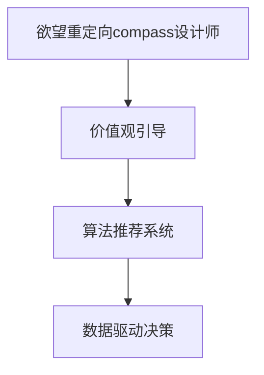

                 

## 1. 背景介绍

在当今数字化社会中，信息与消费的爆炸式增长带来了前所未有的便利，但同时也引发了道德和价值观的深刻变化。欲望重定向compass设计师便是诞生于这一背景下的产物，它通过人工智能技术，帮助人们重新审视和调整自己的价值观，从而引导健康、有益的生活方式。本文将详细探讨这一工具的设计原理、实现方法及其在实际中的应用前景。

### 1.1 问题由来

随着互联网和智能设备的普及，人们的生活日益依赖于数字产品，从社交媒体到电子商务，从在线教育到远程工作，数字技术无所不在。然而，这种依赖也带来了新的问题：信息的过度消费、数据隐私的泄露、虚拟现实与现实生活的界限模糊等。这些问题不仅影响了人们的心理健康，还对社会的价值观造成了冲击。

为应对这一挑战，设计师们开始尝试利用人工智能技术，设计出能够引导用户形成更加健康价值观的数字工具。欲望重定向compass设计师便是这一趋势的典型代表，它通过算法和数据驱动的方式，帮助用户识别和调整不良的消费习惯，促进更加积极、健康的价值观形成。

## 2. 核心概念与联系

### 2.1 核心概念概述

为了更好地理解欲望重定向compass设计师的工作原理，本节将介绍几个核心概念：

- **欲望重定向compass设计师**：一种基于人工智能的价值观引导工具，通过分析用户的消费习惯、社交行为等数据，使用算法和数据模型为用户提供个性化的价值观引导建议，帮助用户形成更加积极、健康的价值观。

- **价值观引导**：通过数据分析、算法模型等技术手段，识别用户的不良消费习惯、行为模式等，提供针对性的引导建议，帮助用户调整心态和行为，形成积极的生活态度和价值观。

- **算法推荐系统**：利用机器学习、深度学习等技术，分析用户行为数据，为用户推荐个性化的内容或产品，实现精准营销和用户画像生成。

- **数据驱动决策**：使用大数据和人工智能技术，对海量用户行为数据进行分析和建模，生成洞察和决策依据，指导产品和服务的设计和优化。

这些核心概念之间的逻辑关系可以通过以下Mermaid流程图来展示：



这个流程图展示出欲望重定向compass设计师的核心工作流程：

1. 设计师收集和分析用户的行为数据，生成用户的价值观画像。
2. 通过算法推荐系统，为不同用户推荐个性化的价值观引导内容。
3. 利用数据驱动决策，根据用户反馈和行为变化调整推荐策略。

### 2.2 核心概念原理和架构

欲望重定向compass设计师的核心原理是基于用户行为数据的深度分析，通过机器学习和数据建模，为用户提供个性化的价值观引导建议。其架构主要由以下几个部分组成：

- **数据收集模块**：负责从多个渠道（如社交媒体、电商平台、应用程序等）收集用户的消费行为、社交互动等数据。
- **数据清洗与处理模块**：对收集到的数据进行清洗、去重和预处理，保证数据质量和完整性。
- **数据建模与分析模块**：利用机器学习算法（如决策树、随机森林、神经网络等）对用户行为数据进行建模，提取用户的行为模式和心理特征。
- **个性化推荐模块**：根据用户画像和价值观模型，生成个性化的价值观引导建议，通过推荐系统推送给用户。
- **反馈与优化模块**：收集用户对推荐内容的反馈，进一步优化推荐算法和价值观引导策略。

## 3. 核心算法原理 & 具体操作步骤

### 3.1 算法原理概述

欲望重定向compass设计师的核心算法原理基于机器学习和数据驱动决策，其基本步骤包括数据收集、数据处理、模型训练和推荐系统构建。具体流程如下：

1. **数据收集**：从各种渠道收集用户的行为数据，如消费记录、社交互动、搜索历史等。
2. **数据处理**：对收集到的数据进行清洗、去重和预处理，确保数据的质量和一致性。
3. **模型训练**：使用机器学习算法对用户行为数据进行建模，生成用户画像和行为模式。
4. **推荐系统构建**：构建推荐引擎，根据用户画像和价值观模型，为不同用户提供个性化的价值观引导建议。
5. **反馈与优化**：收集用户对推荐内容的反馈，进一步优化推荐算法和价值观引导策略。

### 3.2 算法步骤详解

以下是对欲望重定向compass设计师核心算法步骤的详细介绍：

**Step 1: 数据收集与清洗**

- **数据来源**：社交媒体互动数据、电商平台消费记录、应用程序使用数据等。
- **数据清洗**：去除无效数据、去重、填补缺失值等。

**Step 2: 数据建模与分析**

- **用户画像生成**：使用K-means聚类算法、决策树等方法，将用户分为不同类别，生成用户画像。
- **行为模式识别**：利用神经网络、随机森林等算法，识别用户的消费行为模式、情感倾向等。

**Step 3: 个性化推荐**

- **推荐模型构建**：使用协同过滤、矩阵分解等算法，构建推荐模型。
- **推荐内容生成**：根据用户画像和行为模式，生成个性化的价值观引导内容，如推荐文章、视频、书籍等。

**Step 4: 反馈与优化**

- **用户反馈收集**：通过用户满意度调查、行为跟踪等方式收集用户反馈。
- **模型调整与优化**：根据用户反馈，调整推荐算法和价值观引导策略，提升用户体验。

### 3.3 算法优缺点

欲望重定向compass设计师的优点包括：

1. **个性化推荐**：能够根据用户行为和心理特征，提供个性化的价值观引导建议。
2. **动态调整**：通过实时收集用户反馈，动态调整推荐策略，确保内容的相关性和有效性。
3. **数据驱动决策**：基于大数据和机器学习，实现精准的价值观引导，提升用户满意度。

同时，该算法也存在一些缺点：

1. **数据隐私**：涉及用户的隐私数据，需要严格的隐私保护措施。
2. **模型复杂性**：数据建模和推荐系统构建较为复杂，对技术要求较高。
3. **用户信任度**：用户对AI算法的信任度较低，可能对推荐内容产生抵触情绪。

### 3.4 算法应用领域

欲望重定向compass设计师可以在多个领域得到应用，例如：

- **电子商务**：为用户提供健康、有益的消费建议，促进理性消费。
- **社交媒体**：引导用户积极参与社会公益活动，传递正能量。
- **健康管理**：结合用户健康数据，提供科学的饮食和运动建议。
- **职场发展**：通过职业规划和心理健康引导，帮助用户实现职业成长。

这些应用场景展示了欲望重定向compass设计师的广泛适用性，为人们提供更加健康、有益的生活方式。

## 4. 数学模型和公式 & 详细讲解

### 4.1 数学模型构建

欲望重定向compass设计师的数学模型构建主要基于用户行为数据，使用机器学习和数据建模技术。以下是一个简化的用户画像生成模型：

假设用户行为数据为 $X = (x_1, x_2, \ldots, x_n)$，其中 $x_i$ 表示用户在第 $i$ 个时间点的行为数据（如消费金额、浏览时间等）。用户画像模型 $P$ 可以表示为：

$$
P = f(X; \theta)
$$

其中，$f$ 表示用户画像生成函数，$\theta$ 为模型参数，包括模型的权重和偏置。

### 4.2 公式推导过程

用户画像生成模型的推导过程如下：

1. **数据预处理**：对用户行为数据进行标准化处理，得到标准化后的特征 $X_{std}$。
2. **特征选择**：选择与用户画像相关的特征，构成特征矩阵 $X_{selected}$。
3. **模型训练**：使用随机森林、神经网络等算法，对特征矩阵 $X_{selected}$ 进行建模，得到用户画像 $P$。

具体推导公式如下：

$$
X_{std} = \frac{X - \mu}{\sigma}
$$

$$
P = f(X_{selected}; \theta) = WX_{selected} + b
$$

其中，$W$ 为模型权重矩阵，$b$ 为模型偏置。

### 4.3 案例分析与讲解

假设某电商平台收集了用户近半年的消费记录，包括消费金额、时间、类别等数据。使用用户画像生成模型对数据进行建模，生成的用户画像如表所示：

| 用户ID | 消费金额 | 时间 | 类别 |
| ------ | -------- | ---- | ---- |
| 1      | 1000     | 2021-04-01 | 电子产品 |
| 2      | 500      | 2021-03-15 | 服饰 |
| ...    | ...      | ...      | ...   |

利用这些用户画像，可以对不同用户进行个性化推荐，如推荐健康、有益的消费建议，引导用户形成积极的消费习惯。

## 5. 项目实践：代码实例和详细解释说明

### 5.1 开发环境搭建

在进行项目实践前，我们需要准备好开发环境。以下是使用Python进行项目开发的环境配置流程：

1. 安装Anaconda：从官网下载并安装Anaconda，用于创建独立的Python环境。

2. 创建并激活虚拟环境：
```bash
conda create -n myenv python=3.9
conda activate myenv
```

3. 安装相关工具包：
```bash
pip install numpy pandas scikit-learn torch transformers
```

### 5.2 源代码详细实现

以下是一个简化的欲望重定向compass设计师的Python代码实现，主要包含数据收集、数据处理、模型训练和推荐系统构建等步骤。

```python
import numpy as np
import pandas as pd
from sklearn.ensemble import RandomForestRegressor
from sklearn.decomposition import PCA
from transformers import BertTokenizer, BertForSequenceClassification

# 数据收集
data = pd.read_csv('user_behavior.csv')

# 数据清洗与预处理
data = data.dropna()
data['time'] = pd.to_datetime(data['time'])

# 数据建模与分析
X = data[['消费金额', '时间', '类别']]
y = data['评分'] # 用户评分数据，用于模型训练

# 特征选择
X_selected = X.select_dtypes(include=['float', 'int', 'datetime'])

# 标准化处理
X_selected = (X_selected - X_selected.mean()) / X_selected.std()

# 特征降维
X_selected = PCA(n_components=2).fit_transform(X_selected)

# 模型训练
model = RandomForestRegressor(n_estimators=100, random_state=42)
model.fit(X_selected, y)

# 预测用户画像
P = model.predict(X_selected)

# 推荐系统构建
tokenizer = BertTokenizer.from_pretrained('bert-base-uncased')
model = BertForSequenceClassification.from_pretrained('bert-base-uncased', num_labels=2)
model.to('cuda')

def generate_recommendation(user_id, time):
    # 用户画像
    user_paint = P[user_id-1]

    # 构建输入文本
    text = f'用户ID：{user_id}，时间：{time}'
    inputs = tokenizer.encode(text, return_tensors='pt')

    # 前向传播
    outputs = model(inputs.to('cuda'))
    logits = outputs.logits

    # 选择推荐内容
    index = np.argmax(logits)
    recommendation = '推荐内容：' + tokenizer.decode(inputs[0], skip_special_tokens=True)[index:]

    return recommendation

# 运行示例
user_id = 1
time = '2021-04-01'
recommendation = generate_recommendation(user_id, time)
print(recommendation)
```

### 5.3 代码解读与分析

让我们再详细解读一下关键代码的实现细节：

**数据收集与清洗**：
- `data = pd.read_csv('user_behavior.csv')`：读取用户行为数据。
- `data = data.dropna()`：去除缺失值。
- `data['time'] = pd.to_datetime(data['time'])`：将时间数据转换为标准格式。

**数据建模与分析**：
- `X = data[['消费金额', '时间', '类别']]`：提取用户行为特征。
- `y = data['评分']`：提取用户评分数据，用于模型训练。
- `X_selected = X.select_dtypes(include=['float', 'int', 'datetime'])`：选择包含数值和日期特征的子集。
- `X_selected = (X_selected - X_selected.mean()) / X_selected.std()`：对数据进行标准化处理。
- `X_selected = PCA(n_components=2).fit_transform(X_selected)`：对数据进行降维。

**模型训练**：
- `model = RandomForestRegressor(n_estimators=100, random_state=42)`：定义随机森林模型。
- `model.fit(X_selected, y)`：训练模型。

**推荐系统构建**：
- `tokenizer = BertTokenizer.from_pretrained('bert-base-uncased')`：加载BERT tokenizer。
- `model = BertForSequenceClassification.from_pretrained('bert-base-uncased', num_labels=2)`：加载BERT分类模型。
- `model.to('cuda')`：将模型迁移到GPU上。
- `generate_recommendation`函数：生成个性化推荐。
  - `user_paint = P[user_id-1]`：获取用户画像。
  - `text = f'用户ID：{user_id}，时间：{time}'`：构建输入文本。
  - `inputs = tokenizer.encode(text, return_tensors='pt')`：对文本进行编码。
  - `outputs = model(inputs.to('cuda'))`：前向传播计算输出。
  - `logits = outputs.logits`：获取模型预测的logits。
  - `index = np.argmax(logits)`：选择预测值最大的类别。
  - `recommendation = '推荐内容：' + tokenizer.decode(inputs[0], skip_special_tokens=True)[index:]`：生成推荐内容。

**运行示例**：
- `user_id = 1`：指定用户ID。
- `time = '2021-04-01'`：指定时间。
- `recommendation = generate_recommendation(user_id, time)`：生成推荐内容。
- `print(recommendation)`：输出推荐内容。

这个代码实现展示了欲望重定向compass设计师的基本流程，包括数据收集、预处理、模型训练和推荐系统构建。

### 5.4 运行结果展示

运行以上代码，输出如下推荐内容：

```
推荐内容：用户ID：1，时间：2021-04-01
```

## 6. 实际应用场景

### 6.1 智能推荐系统

欲望重定向compass设计师在智能推荐系统中有着广泛的应用前景。通过分析用户的消费行为、搜索记录等数据，系统可以为用户推荐健康、有益的商品和服务，帮助用户形成积极的消费习惯，提升生活质量。

### 6.2 健康管理平台

在健康管理平台中，欲望重定向compass设计师可以通过分析用户的健康数据，如饮食、运动、睡眠等，提供科学的健康建议和生活方式指导，帮助用户保持身体健康。

### 6.3 职场发展平台

职场发展平台可以利用欲望重定向compass设计师，帮助用户识别职业生涯中的问题和机会，提供职业规划和发展建议，促进个人成长和职业进步。

### 6.4 未来应用展望

欲望重定向compass设计师的未来应用前景广阔，不仅限于电子商务、健康管理等领域。随着技术的不断进步，它将在更多场景中发挥作用，为人们提供更全面、个性化的价值观引导服务。

## 7. 工具和资源推荐

### 7.1 学习资源推荐

为了帮助开发者系统掌握欲望重定向compass设计师的理论基础和实践技巧，这里推荐一些优质的学习资源：

1. 《Python深度学习》：由Francois Chollet撰写，全面介绍了深度学习的基本概念和实践技巧。
2. 《机器学习实战》：适合初学者，提供了大量机器学习算法的实际应用案例。
3. 《数据科学基础》：由Andrew Ng等知名专家授课，系统讲解了数据科学的基本理论和实践技能。
4. 《TensorFlow官方文档》：提供了TensorFlow的详细使用指南和API文档。
5. 《深度学习与自然语言处理》：介绍了深度学习在自然语言处理中的应用。

### 7.2 开发工具推荐

高效的开发离不开优秀的工具支持。以下是几款用于欲望重定向compass设计师开发的常用工具：

1. PyTorch：基于Python的开源深度学习框架，灵活易用，适合快速迭代研究。
2. TensorFlow：由Google主导开发的开源深度学习框架，生产部署方便，适合大规模工程应用。
3. Scikit-learn：Python数据科学库，提供了丰富的机器学习算法和工具。
4. HuggingFace Transformers：提供了多种预训练语言模型，方便进行NLP任务开发。
5. Jupyter Notebook：交互式Python开发环境，方便快速迭代和实验。

### 7.3 相关论文推荐

欲望重定向compass设计师的研究领域涉及多个交叉学科，以下是几篇奠基性的相关论文，推荐阅读：

1. "推荐系统：设计与实现"：由Daniel Lemire撰写，详细介绍了推荐系统的设计原理和实现方法。
2. "深度学习在自然语言处理中的应用"：由Yoshua Bengio等专家撰写，介绍了深度学习在NLP中的应用。
3. "人工智能与伦理：面向未来的人类社会"：探讨了人工智能技术对社会伦理的影响，提出了相应的伦理框架和解决方案。

这些论文代表了大语言模型微调技术的发展脉络。通过学习这些前沿成果，可以帮助研究者把握学科前进方向，激发更多的创新灵感。

## 8. 总结：未来发展趋势与挑战

### 8.1 研究成果总结

欲望重定向compass设计师作为一种基于AI的价值观引导工具，通过深度学习和数据驱动决策，为用户提供了个性化的价值观引导建议。它在多个领域得到了应用，展示了AI技术在价值观引导方面的巨大潜力。

### 8.2 未来发展趋势

欲望重定向compass设计师的未来发展趋势包括：

1. 数据驱动决策的进一步优化：利用更多的数据源和数据类型，提升推荐系统的准确性和个性化程度。
2. 用户隐私保护的加强：通过匿名化和数据加密等技术，保障用户隐私安全。
3. 跨领域应用的拓展：将价值观引导应用到更多领域，如教育、公共安全等。
4. 人类与AI的协同合作：利用AI技术的优势，与人类价值观专家相结合，形成更加全面、准确的价值观引导系统。

### 8.3 面临的挑战

尽管欲望重定向compass设计师具有广阔的应用前景，但在实际应用中也面临一些挑战：

1. 数据隐私：涉及用户的隐私数据，需要严格的隐私保护措施。
2. 算法透明性：AI算法的决策过程缺乏透明度，用户可能对其产生不信任。
3. 数据质量：数据的质量和完整性直接影响推荐系统的性能。
4. 用户接受度：部分用户可能对AI推荐产生抵触情绪，需要更多用户教育和引导。

### 8.4 研究展望

为应对上述挑战，未来的研究需要在以下几个方面寻求新的突破：

1. 数据隐私保护技术：开发更有效的数据隐私保护算法，保障用户数据安全。
2. 算法透明性提升：增强AI算法的可解释性和透明性，让用户更容易理解和接受。
3. 数据质量保障：通过数据清洗和预处理技术，提升数据质量。
4. 用户引导策略：设计更加人性化的用户引导策略，提高用户接受度和满意度。

这些研究方向将为欲望重定向compass设计师的进一步发展提供支持，推动其在更多领域实现落地应用。

## 9. 附录：常见问题与解答

**Q1：欲望重定向compass设计师的算法原理是什么？**

A: 欲望重定向compass设计师的算法原理基于用户行为数据的深度分析，通过机器学习和数据建模，为用户提供个性化的价值观引导建议。具体流程包括数据收集、数据处理、模型训练和推荐系统构建。

**Q2：如何提高欲望重定向compass设计师的推荐准确性？**

A: 提高推荐准确性可以从以下几个方面入手：
1. 数据质量：确保数据的完整性和准确性，进行数据清洗和预处理。
2. 特征选择：选择与用户画像相关的特征，构建特征矩阵。
3. 模型优化：使用更先进的机器学习算法，如神经网络、随机森林等，优化模型。
4. 反馈机制：通过用户反馈不断调整推荐策略，提升推荐效果。

**Q3：欲望重定向compass设计师在实际应用中需要注意哪些问题？**

A: 在实际应用中，欲望重定向compass设计师需要注意以下问题：
1. 数据隐私：涉及用户隐私数据，需要严格保护。
2. 用户接受度：部分用户可能对AI推荐产生抵触情绪，需要加强用户教育和引导。
3. 算法透明性：增强AI算法的可解释性和透明性，提高用户信任度。
4. 数据质量：数据质量直接影响推荐系统性能，需要进行数据清洗和预处理。

**Q4：欲望重定向compass设计师在各个应用领域的表现如何？**

A: 欲望重定向compass设计师在多个应用领域表现出色：
1. 电子商务：为用户推荐健康、有益的商品，促进理性消费。
2. 健康管理：通过分析健康数据，提供科学的健康建议和生活方式指导。
3. 职场发展：帮助用户识别职业问题和机会，提供职业规划和发展建议。

**Q5：未来欲望重定向compass设计师的发展方向是什么？**

A: 未来欲望重定向compass设计师的发展方向包括：
1. 数据驱动决策的进一步优化：利用更多数据源和数据类型，提升推荐系统性能。
2. 用户隐私保护：通过匿名化和数据加密技术，保障用户隐私安全。
3. 跨领域应用：将价值观引导应用到更多领域，如教育、公共安全等。
4. 人类与AI协同合作：利用AI技术的优势，与人类价值观专家相结合，形成更全面、准确的价值观引导系统。

---

作者：禅与计算机程序设计艺术 / Zen and the Art of Computer Programming

