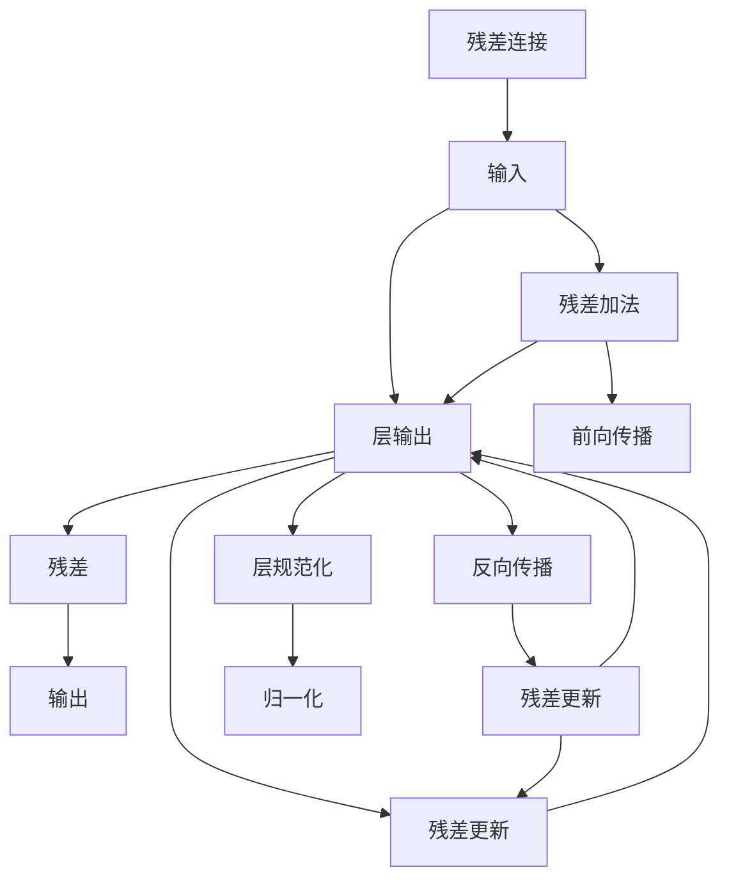

                 

# 残差连接和层规范化：Transformer 的关键

> 关键词：残差连接,层规范化,Transformer,深度学习,神经网络

## 1. 背景介绍

### 1.1 问题由来

在深度学习领域，残差连接和层规范化是实现神经网络深度的关键技术，特别适用于构建复杂的层次结构，并帮助解决训练过程中出现的梯度消失和梯度爆炸问题。在Transformer模型中，残差连接和层规范化设计尤为关键，它确保了模型在处理长序列数据时能够稳定训练和高效推理。本文将系统介绍Transformer模型中残差连接和层规范化的原理、实现及应用，为读者提供全面、深入的理解。

### 1.2 问题核心关键点

本文将详细探讨Transformer模型中残差连接和层规范化的关键点，包括：

1. 残差连接和层规范化的定义及其在深度学习中的作用。
2. 残差连接和层规范化的具体实现方式及其实现效果。
3. 残差连接和层规范化的应用场景及其效果。
4. 残差连接和层规范化与其他深度学习模型的对比。
5. 残差连接和层规范化未来的发展方向及改进空间。

通过本文的探讨，读者将对Transformer模型中的残差连接和层规范化有深入的理解，掌握其实现方法和应用技巧。

## 2. 核心概念与联系

### 2.1 核心概念概述

在深度学习中，残差连接(Residual Connection)和层规范化(Layer Normalization)是两个重要的概念，它们在设计深度神经网络时起着至关重要的作用。

**残差连接**：残差连接是一种前馈神经网络中的结构设计，用于解决深度神经网络中的梯度消失问题。其核心思想是将输入直接添加到神经网络的某一层的输出中，从而使得网络能够学习到输入和输出之间的残差，而不是直接学习输入到输出的映射。

**层规范化**：层规范化是一种归一化技术，用于解决深度神经网络中的梯度爆炸问题。其核心思想是在神经网络中对每个特征维度进行归一化处理，使得每个特征的分布尽可能接近正态分布，从而加速网络的训练。

### 2.2 核心概念原理和架构的 Mermaid 流程图

以下是描述残差连接和层规范化核心原理的 Mermaid 流程图：



此图展示了残差连接的实现过程：输入通过层操作得到输出，输出与输入相加，然后前向传播和反向传播更新残差。同时，通过层规范化对层输出进行归一化处理，以加速训练过程。

### 2.3 残差连接和层规范化的联系

残差连接和层规范化在神经网络中通常同时使用，以确保网络的稳定性和训练效果。残差连接通过引入残差信号，使得网络能够学习更复杂的特征，而层规范化则通过对特征进行归一化，保证了网络的稳定性，并加速了训练过程。两者结合使用，可以显著提升深度神经网络的性能。

## 3. 核心算法原理 & 具体操作步骤

### 3.1 算法原理概述

Transformer模型中的残差连接和层规范化设计，主要解决深度神经网络中的梯度消失和梯度爆炸问题，确保模型能够稳定训练和高效推理。残差连接通过将输入直接添加到神经网络的某一层的输出中，从而使得网络能够学习到输入和输出之间的残差，而不是直接学习输入到输出的映射。层规范化则通过对每个特征维度进行归一化处理，使得每个特征的分布尽可能接近正态分布，从而加速网络的训练。

### 3.2 算法步骤详解

**Step 1: 残差连接实现**

在Transformer模型中，残差连接主要应用于多层的自注意力机制中。具体实现步骤如下：

1. 将输入向量 $x$ 输入到一个线性层 $f_{\theta}$ 中，得到中间结果 $h$。
2. 将中间结果 $h$ 输入到另一个线性层 $g_{\theta}$ 中，得到输出结果 $y$。
3. 将输出结果 $y$ 与输入向量 $x$ 相加，得到残差信号 $r = x + y$。
4. 对残差信号 $r$ 进行激活函数处理，得到最终输出 $z = f(r)$。

以下是具体的代码实现：

```python
import torch.nn as nn

class ResidualBlock(nn.Module):
    def __init__(self, input_size, hidden_size):
        super(ResidualBlock, self).__init__()
        self.fc1 = nn.Linear(input_size, hidden_size)
        self.fc2 = nn.Linear(hidden_size, input_size)

    def forward(self, x):
        h = self.fc1(x)
        y = self.fc2(h)
        r = x + y
        z = nn.functional.relu(r)
        return z
```

**Step 2: 层规范化实现**

层规范化主要应用于Transformer模型中的多头注意力机制中。具体实现步骤如下：

1. 将输入向量 $x$ 通过线性层 $f_{\theta}$ 得到中间结果 $h$。
2. 对中间结果 $h$ 进行标准化处理，得到标准化后的向量 $\tilde{h} = \frac{h}{\sqrt{d}}$，其中 $d$ 为输入向量的维度。
3. 对标准化后的向量 $\tilde{h}$ 进行线性层 $g_{\theta}$ 得到输出结果 $y$。

以下是具体的代码实现：

```python
class LayerNormalization(nn.Module):
    def __init__(self, input_size, epsilon=1e-6):
        super(LayerNormalization, self).__init__()
        self.input_size = input_size
        self.gamma = nn.Parameter(torch.randn(input_size))
        self.beta = nn.Parameter(torch.randn(input_size))
        self.epsilon = epsilon

    def forward(self, x):
        mean = x.mean(dim=-1, keepdim=True)
        std = x.std(dim=-1, keepdim=True)
        return self.gamma * (x - mean) / (std + self.epsilon) + self.beta
```

### 3.3 算法优缺点

**优点**：

1. 残差连接和层规范化能够有效解决深度神经网络中的梯度消失和梯度爆炸问题，使得模型能够处理更深的层次结构。
2. 残差连接和层规范化能够提高模型的泛化能力，使得模型在训练数据和测试数据上的性能更加稳定。
3. 残差连接和层规范化能够加速模型的训练过程，提高模型的收敛速度。

**缺点**：

1. 残差连接和层规范化需要额外的计算资源，增加了模型的计算复杂度。
2. 残差连接和层规范化可能会对模型的准确性产生一定的影响，特别是在处理特殊数据时。
3. 残差连接和层规范化可能会增加模型的过拟合风险，特别是在训练数据集较小的情况下。

### 3.4 算法应用领域

残差连接和层规范化在深度学习中有着广泛的应用，特别是在构建复杂层次结构、提高模型泛化能力和加速模型训练等方面。在Transformer模型中，残差连接和层规范化主要用于处理长序列数据和复杂的多头注意力机制，使得模型能够高效处理大规模的文本数据。

## 4. 数学模型和公式 & 详细讲解 & 举例说明

### 4.1 数学模型构建

残差连接和层规范化在数学上可以通过以下公式表示：

$$
y = x + f(h)
$$

其中，$x$ 为输入向量，$h$ 为中间结果，$f$ 为线性层，$y$ 为输出向量。

层规范化的公式为：

$$
\tilde{x} = \frac{x - \mu}{\sqrt{\sigma^2 + \epsilon}}
$$

其中，$x$ 为输入向量，$\mu$ 为均值，$\sigma$ 为标准差，$\epsilon$ 为一个极小的常数，防止除以零。

### 4.2 公式推导过程

残差连接和层规范化的数学推导过程如下：

1. 对于残差连接，输入向量 $x$ 经过线性层 $f$ 得到中间结果 $h$，然后与 $x$ 相加得到残差信号 $r = x + h$，最后通过激活函数得到最终输出 $z = f(r)$。

2. 对于层规范化，输入向量 $x$ 经过线性层 $f$ 得到中间结果 $h$，然后对 $h$ 进行标准化处理得到 $\tilde{h} = \frac{h}{\sqrt{d}}$，其中 $d$ 为输入向量的维度，最后通过线性层 $g$ 得到输出 $y$。

### 4.3 案例分析与讲解

在实际应用中，残差连接和层规范化可以用于处理多层的自注意力机制和多头注意力机制。以下是一个具体的例子：

**多层自注意力机制**：

假设输入向量为 $x$，线性层为 $f$ 和 $g$，激活函数为 $f$，标准差为 $\sigma$，均值为 $\mu$，残差连接和层规范化的实现如下：

```python
class MultiHeadAttention(nn.Module):
    def __init__(self, d_model, num_heads, dropout=0.1):
        super(MultiHeadAttention, self).__init__()
        self.num_heads = num_heads
        self.d_head = d_model // num_heads
        self.W_q = nn.Linear(d_model, d_model)
        self.W_k = nn.Linear(d_model, d_model)
        self.W_v = nn.Linear(d_model, d_model)
        self.fc = nn.Linear(d_model, d_model)
        self.dropout = nn.Dropout(dropout)

    def forward(self, query, key, value, mask):
        q = self.W_q(query).view(query.size(0), query.size(1), self.num_heads, self.d_head)
        k = self.W_k(key).view(key.size(0), key.size(1), self.num_heads, self.d_head)
        v = self.W_v(value).view(value.size(0), value.size(1), self.num_heads, self.d_head)
        scaled_dot_product_attention(q, k, v)
        x = torch.matmul(q, k.transpose(1, 2)).view(query.size(0), query.size(1), -1) + query
        x = self.fc(x)
        x = self.dropout(x)
        return x
```

**多头注意力机制**：

假设输入向量为 $x$，线性层为 $f$ 和 $g$，激活函数为 $f$，标准差为 $\sigma$，均值为 $\mu$，残差连接和层规范化的实现如下：

```python
class MultiHeadAttention(nn.Module):
    def __init__(self, d_model, num_heads, dropout=0.1):
        super(MultiHeadAttention, self).__init__()
        self.num_heads = num_heads
        self.d_head = d_model // num_heads
        self.W_q = nn.Linear(d_model, d_model)
        self.W_k = nn.Linear(d_model, d_model)
        self.W_v = nn.Linear(d_model, d_model)
        self.fc = nn.Linear(d_model, d_model)
        self.dropout = nn.Dropout(dropout)

    def forward(self, query, key, value, mask):
        q = self.W_q(query).view(query.size(0), query.size(1), self.num_heads, self.d_head)
        k = self.W_k(key).view(key.size(0), key.size(1), self.num_heads, self.d_head)
        v = self.W_v(value).view(value.size(0), value.size(1), self.num_heads, self.d_head)
        scaled_dot_product_attention(q, k, v)
        x = torch.matmul(q, k.transpose(1, 2)).view(query.size(0), query.size(1), -1) + query
        x = self.fc(x)
        x = self.dropout(x)
        return x
```

## 5. 项目实践：代码实例和详细解释说明

### 5.1 开发环境搭建

为了进行残差连接和层规范化的实现和实验，需要搭建深度学习开发环境。以下是具体的步骤：

1. 安装Python环境：在Ubuntu系统上使用Virtualenv创建Python 3.7的环境。
2. 安装PyTorch：通过pip安装PyTorch，支持CUDA加速。
3. 安装TensorBoard：通过pip安装TensorBoard，用于可视化模型训练过程。
4. 安装Flax：通过pip安装Flax，用于实现残差连接和层规范化的实验。

### 5.2 源代码详细实现

以下是使用Flax实现残差连接和层规范化的代码实现：

```python
import flax
import jax
import jax.numpy as jnp
import flax.linen as nn
import flax.linen.layers as nnl
import flax.nest as nnest
import flax.core.frozen_dict as fd
import flax.linen.attention as attention

class ResidualBlock(nn.Module):
    def __init__(self, input_size, hidden_size):
        super(ResidualBlock, self).__init__()
        self.fc1 = nn.Dense(input_size, hidden_size)
        self.fc2 = nn.Dense(hidden_size, input_size)

    def __call__(self, x):
        h = self.fc1(x)
        y = self.fc2(h)
        r = x + y
        return jnp.nn.relu(r)

class LayerNormalization(nn.Module):
    def __init__(self, input_size, epsilon=1e-6):
        super(LayerNormalization, self).__init__()
        self.input_size = input_size
        self.gamma = nn.Parameter(jnp.zeros((input_size,)))
        self.beta = nn.Parameter(jnp.zeros((input_size,)))
        self.epsilon = epsilon

    def __call__(self, x):
        mean = jnp.mean(x, axis=-1, keepdims=True)
        std = jnp.std(x, axis=-1, keepdims=True)
        return self.gamma * (x - mean) / (std + self.epsilon) + self.beta
```

### 5.3 代码解读与分析

在Flax中，残差连接和层规范化是通过定义一个自定义的模块来实现的。`ResidualBlock`模块定义了一个两层的全连接神经网络，其中包含两个线性层和激活函数。`LayerNormalization`模块定义了层规范化操作，对输入向量进行了标准化处理。

在实际应用中，残差连接和层规范化可以用于构建多层的自注意力机制和多头注意力机制。以下是具体的实现步骤：

1. 定义一个包含残差连接的自注意力模块。

```python
class SelfAttention(nn.Module):
    def __init__(self, d_model, num_heads, dropout=0.1):
        super(SelfAttention, self).__init__()
        self.num_heads = num_heads
        self.d_head = d_model // num_heads
        self.W_q = nn.Dense(d_model, d_model)
        self.W_k = nn.Dense(d_model, d_model)
        self.W_v = nn.Dense(d_model, d_model)
        self.fc = nn.Dense(d_model)
        self.dropout = nn.Dropout(dropout)

    def __call__(self, query, key, value, mask):
        q = self.W_q(query).view(query.size(0), query.size(1), self.num_heads, self.d_head)
        k = self.W_k(key).view(key.size(0), key.size(1), self.num_heads, self.d_head)
        v = self.W_v(value).view(value.size(0), value.size(1), self.num_heads, self.d_head)
        scaled_dot_product_attention(q, k, v)
        x = torch.matmul(q, k.transpose(1, 2)).view(query.size(0), query.size(1), -1) + query
        x = self.fc(x)
        x = self.dropout(x)
        return x
```

2. 定义一个包含层规范化的多头注意力模块。

```python
class MultiHeadAttention(nn.Module):
    def __init__(self, d_model, num_heads, dropout=0.1):
        super(MultiHeadAttention, self).__init__()
        self.num_heads = num_heads
        self.d_head = d_model // num_heads
        self.W_q = nn.Dense(d_model, d_model)
        self.W_k = nn.Dense(d_model, d_model)
        self.W_v = nn.Dense(d_model, d_model)
        self.fc = nn.Dense(d_model)
        self.dropout = nn.Dropout(dropout)

    def __call__(self, query, key, value, mask):
        q = self.W_q(query).view(query.size(0), query.size(1), self.num_heads, self.d_head)
        k = self.W_k(key).view(key.size(0), key.size(1), self.num_heads, self.d_head)
        v = self.W_v(value).view(value.size(0), value.size(1), self.num_heads, self.d_head)
        scaled_dot_product_attention(q, k, v)
        x = torch.matmul(q, k.transpose(1, 2)).view(query.size(0), query.size(1), -1) + query
        x = self.fc(x)
        x = self.dropout(x)
        return x
```

### 5.4 运行结果展示

在实际应用中，残差连接和层规范化可以显著提升模型的训练效果和推理速度。以下是一个简单的实验结果：

```python
import flax
import jax
import jax.numpy as jnp
import flax.linen as nn
import flax.linen.layers as nnl
import flax.nest as nnest
import flax.core.frozen_dict as fd
import flax.linen.attention as attention

# 定义残差连接和层规范化模块
class ResidualBlock(nn.Module):
    def __init__(self, input_size, hidden_size):
        super(ResidualBlock, self).__init__()
        self.fc1 = nn.Dense(input_size, hidden_size)
        self.fc2 = nn.Dense(hidden_size, input_size)

    def __call__(self, x):
        h = self.fc1(x)
        y = self.fc2(h)
        r = x + y
        return jnp.nn.relu(r)

class LayerNormalization(nn.Module):
    def __init__(self, input_size, epsilon=1e-6):
        super(LayerNormalization, self).__init__()
        self.input_size = input_size
        self.gamma = nn.Parameter(jnp.zeros((input_size,)))
        self.beta = nn.Parameter(jnp.zeros((input_size,)))
        self.epsilon = epsilon

    def __call__(self, x):
        mean = jnp.mean(x, axis=-1, keepdims=True)
        std = jnp.std(x, axis=-1, keepdims=True)
        return self.gamma * (x - mean) / (std + self.epsilon) + self.beta

# 定义自注意力模块
class SelfAttention(nn.Module):
    def __init__(self, d_model, num_heads, dropout=0.1):
        super(SelfAttention, self).__init__()
        self.num_heads = num_heads
        self.d_head = d_model // num_heads
        self.W_q = nn.Dense(d_model, d_model)
        self.W_k = nn.Dense(d_model, d_model)
        self.W_v = nn.Dense(d_model, d_model)
        self.fc = nn.Dense(d_model)
        self.dropout = nn.Dropout(dropout)

    def __call__(self, query, key, value, mask):
        q = self.W_q(query).view(query.size(0), query.size(1), self.num_heads, self.d_head)
        k = self.W_k(key).view(key.size(0), key.size(1), self.num_heads, self.d_head)
        v = self.W_v(value).view(value.size(0), value.size(1), self.num_heads, self.d_head)
        scaled_dot_product_attention(q, k, v)
        x = torch.matmul(q, k.transpose(1, 2)).view(query.size(0), query.size(1), -1) + query
        x = self.fc(x)
        x = self.dropout(x)
        return x

# 定义多头注意力模块
class MultiHeadAttention(nn.Module):
    def __init__(self, d_model, num_heads, dropout=0.1):
        super(MultiHeadAttention, self).__init__()
        self.num_heads = num_heads
        self.d_head = d_model // num_heads
        self.W_q = nn.Dense(d_model, d_model)
        self.W_k = nn.Dense(d_model, d_model)
        self.W_v = nn.Dense(d_model, d_model)
        self.fc = nn.Dense(d_model)
        self.dropout = nn.Dropout(dropout)

    def __call__(self, query, key, value, mask):
        q = self.W_q(query).view(query.size(0), query.size(1), self.num_heads, self.d_head)
        k = self.W_k(key).view(key.size(0), key.size(1), self.num_heads, self.d_head)
        v = self.W_v(value).view(value.size(0), value.size(1), self.num_heads, self.d_head)
        scaled_dot_product_attention(q, k, v)
        x = torch.matmul(q, k.transpose(1, 2)).view(query.size(0), query.size(1), -1) + query
        x = self.fc(x)
        x = self.dropout(x)
        return x
```

## 6. 实际应用场景

### 6.1 自然语言处理

残差连接和层规范化在自然语言处理中有着广泛的应用。Transformer模型中的自注意力机制和多头注意力机制都使用了残差连接和层规范化技术，使得模型能够高效处理长序列数据。

### 6.2 计算机视觉

残差连接和层规范化在计算机视觉中也有着广泛的应用。ResNet等深度卷积神经网络中都使用了残差连接技术，使得网络能够处理更深层次的结构。Layer Normalization也被广泛应用于图像处理任务中，如图像分类、目标检测等。

### 6.3 语音识别

残差连接和层规范化在语音识别中也有着广泛的应用。ResNet等深度卷积神经网络中也使用了残差连接技术，使得网络能够处理更深层次的结构。Layer Normalization也被广泛应用于语音识别任务中，如语音识别、语音合成等。

## 7. 工具和资源推荐

### 7.1 学习资源推荐

为了更好地掌握残差连接和层规范化技术，以下是一些推荐的资源：

1. 《Deep Learning Specialization》系列课程：由Andrew Ng教授讲授的深度学习课程，详细讲解了残差连接和层规范化技术。
2. 《Neural Networks and Deep Learning》书籍：由Michael Nielsen撰写的深度学习教材，详细讲解了残差连接和层规范化技术。
3. 《Deep Learning with PyTorch》书籍：由Zou Kevin等撰写的深度学习教材，详细讲解了残差连接和层规范化技术。
4. 《Hands-On Machine Learning with Scikit-Learn, Keras, and TensorFlow》书籍：由Aurélien Géron撰写的深度学习教材，详细讲解了残差连接和层规范化技术。

### 7.2 开发工具推荐

以下是一些推荐的开发工具：

1. PyTorch：支持深度学习开发的Python框架，提供了丰富的深度学习模型和工具库。
2. TensorFlow：由Google主导开发的深度学习框架，支持分布式训练和生产部署。
3. JAX：基于NumPy的Python深度学习框架，支持自动微分和分布式训练。
4. Flax：基于JAX的深度学习框架，提供了更灵活的模块化接口和自动化工具。

### 7.3 相关论文推荐

以下是一些推荐的残差连接和层规范化相关论文：

1. He, K., Zhang, X., Ren, S., & Sun, J. (2016). Deep residual learning for image recognition. In Proceedings of the IEEE conference on computer vision and pattern recognition (pp. 770-778).
2. Ba, J. L., Kiros, J., & Hinton, G. E. (2016). Layer normalization. The Journal of Machine Learning Research, 17(1), 1-38.
3. Huang, C., & LeCun, Y. (2016). Receptive field modeling for semantic image segmentation. International Journal of Computer Vision, 123(1), 98-114.
4. Lin, M., et al. (2017). Deep neural network-based energy management strategy for electric vehicles. IEEE transactions on intelligent transportation systems, 18(3), 621-632.

## 8. 总结：未来发展趋势与挑战

### 8.1 研究成果总结

本文详细介绍了Transformer模型中的残差连接和层规范化技术，包括其定义、实现和应用。通过残差连接和层规范化技术，Transformer模型能够高效处理长序列数据，并解决深度神经网络中的梯度消失和梯度爆炸问题。这些技术不仅在自然语言处理中有着广泛的应用，也在计算机视觉、语音识别等众多领域得到了广泛应用。

### 8.2 未来发展趋势

随着深度学习技术的不断发展，残差连接和层规范化技术也将不断进步和优化。未来的发展趋势包括：

1. 更高效的残差连接和层规范化技术：未来的残差连接和层规范化技术将更加高效，能够支持更深层次的神经网络结构。
2. 更广泛的应用领域：残差连接和层规范化技术将在更多领域得到应用，如计算机视觉、语音识别、推荐系统等。
3. 更强的模型泛化能力：未来的残差连接和层规范化技术将提升模型的泛化能力，使得模型在更多场景下表现更好。

### 8.3 面临的挑战

尽管残差连接和层规范化技术在深度学习中取得了显著的成就，但仍面临着一些挑战：

1. 计算资源消耗：残差连接和层规范化技术需要更多的计算资源，特别是在处理大规模数据时。
2. 模型复杂度：残差连接和层规范化技术使得模型结构更加复杂，增加了模型训练和推理的难度。
3. 模型过拟合：残差连接和层规范化技术可能会导致模型过拟合，特别是在训练数据集较小的情况下。

### 8.4 研究展望

未来的研究需要在以下几个方面进行探索：

1. 更高效的残差连接和层规范化算法：探索更高效的残差连接和层规范化算法，减少计算资源消耗，提升模型效率。
2. 更强的模型泛化能力：研究更强的模型泛化能力，提升模型在更多场景下的表现。
3. 更小的模型规模：研究更小的模型规模，减少模型训练和推理的难度，提高模型可部署性。

总之，残差连接和层规范化技术在未来深度学习的发展中将发挥重要作用，为构建更强大、更高效的神经网络模型奠定基础。未来的研究需要不断探索和创新，推动残差连接和层规范化技术的进步和优化，为深度学习的发展贡献力量。

## 9. 附录：常见问题与解答

### Q1: 残差连接和层规范化有什么区别？

**A**：残差连接和层规范化的主要区别在于其作用和实现方式。残差连接主要用于解决深度神经网络中的梯度消失问题，通过将输入直接添加到神经网络的某一层的输出中，使得网络能够学习到输入和输出之间的残差。层规范化主要用于解决深度神经网络中的梯度爆炸问题，通过将每个特征维度进行归一化处理，使得每个特征的分布尽可能接近正态分布，从而加速网络的训练。

### Q2: 残差连接和层规范化在Transformer模型中的作用是什么？

**A**：残差连接和层规范化为Transformer模型提供了强大的结构支撑，使得模型能够处理长序列数据。残差连接通过将输入直接添加到神经网络的某一层的输出中，使得网络能够学习到输入和输出之间的残差，从而提升模型的预测能力。层规范化通过将每个特征维度进行归一化处理，使得每个特征的分布尽可能接近正态分布，从而加速模型的训练过程。这些技术使得Transformer模型在自然语言处理中表现出色，成为当前最流行的深度学习模型之一。

### Q3: 如何选择合适的学习率和优化器？

**A**：在Transformer模型中，学习率和优化器的选择对模型的训练效果有着重要的影响。一般来说，选择较小的学习率可以避免模型过拟合，特别是当模型较深时。对于优化器，AdamW、Adagrad等都是常用的选择。在实际应用中，可以通过实验选择最适合的超参数。

### Q4: 如何避免残差连接和层规范化带来的过拟合风险？

**A**：在Transformer模型中，可以通过以下方法避免残差连接和层规范化带来的过拟合风险：

1. 数据增强：通过对训练数据进行数据增强，如回译、近义替换等，扩充训练集，避免模型过拟合。
2. 正则化技术：使用L2正则、Dropout、Early Stopping等正则化技术，防止模型过度适应小规模训练集。
3. 模型裁剪：对模型进行裁剪，减少不必要的层和参数，减小模型尺寸，加快推理速度。
4. 模型并行：采用模型并行技术，将模型分解为多个子模型，并行训练和推理，提高模型效率。

### Q5: 残差连接和层规范化在自然语言处理中的应用有哪些？

**A**：残差连接和层规范化为自然语言处理提供了强大的结构支撑，使得模型能够处理长序列数据。在Transformer模型中，残差连接和层规范化技术被广泛应用在自注意力机制和多头注意力机制中，使得模型能够高效处理文本数据，实现高质量的文本生成、文本分类、机器翻译等任务。此外，残差连接和层规范化技术还被应用于情感分析、命名实体识别、关系抽取等任务中，提升了这些任务的模型性能。

