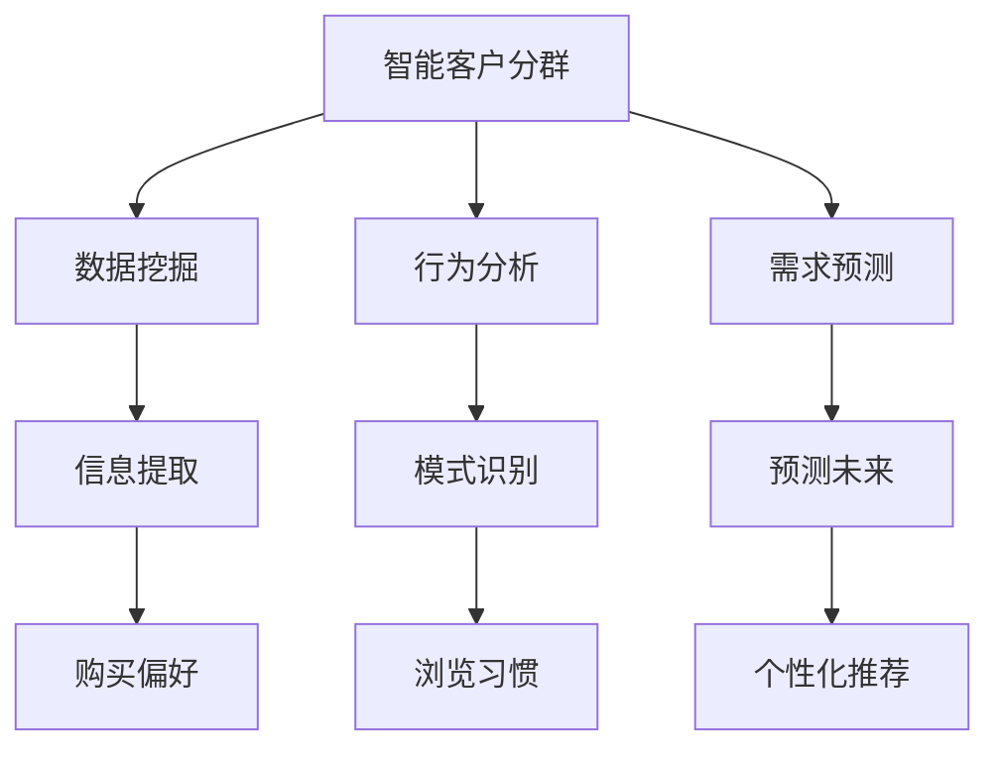
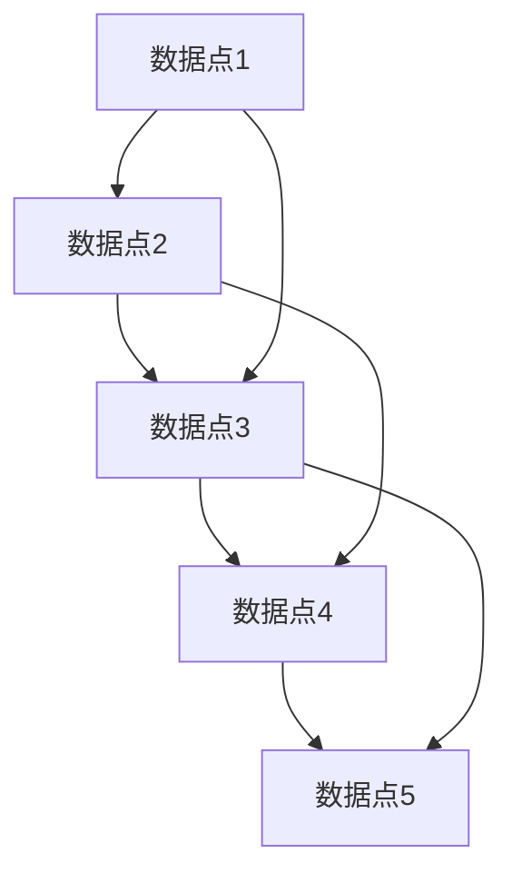
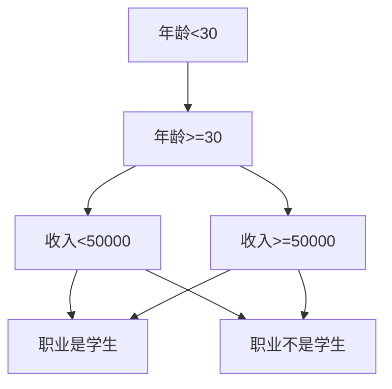

                 

### 文章标题

"AI驱动的智能客户分群：电商精准营销的基础"

关键词：人工智能、客户分群、精准营销、电商、AI算法

摘要：本文深入探讨了AI在电商领域中的应用，特别是智能客户分群的原理和实施步骤。通过分析AI算法在客户数据挖掘、行为分析和需求预测等方面的优势，文章为电商企业提供了构建精准营销策略的理论基础和实践指南。

### 1. 背景介绍

随着互联网的飞速发展和电商行业的日益成熟，消费者行为数据变得更加丰富和复杂。在这种背景下，如何有效地分析客户数据，实现精准营销成为了电商企业关注的焦点。传统的客户分群方法通常基于有限的静态特征，如年龄、性别、地理位置等，而忽略了客户行为的动态变化。这种方法的局限性使得分群结果往往不够精确，难以满足个性化营销的需求。

人工智能（AI）的出现为电商营销带来了新的契机。AI算法，特别是机器学习和深度学习算法，具有强大的数据处理和分析能力，能够从海量客户数据中挖掘出隐藏的模式和关联。智能客户分群利用AI算法，通过分析客户的购买行为、浏览习惯、社交互动等多维度数据，实现对客户的精细化划分。这种基于动态数据和深度分析的客户分群方法，不仅能够提高营销的精准度，还能提升客户满意度和转化率。

### 2. 核心概念与联系

#### 2.1 智能客户分群的概念

智能客户分群是指利用人工智能算法对客户群体进行动态、细粒度的划分，以实现精准营销。这种方法的核心在于能够实时获取和分析客户的动态行为数据，从而不断调整和优化分群模型，确保分群结果始终与客户的当前状态和行为特征相匹配。

#### 2.2 AI算法在客户分群中的应用

AI算法在客户分群中的应用主要体现在以下几个方面：

1. **客户数据挖掘**：通过数据挖掘技术从海量客户数据中提取有价值的信息，如客户的购买偏好、浏览路径、消费频率等。

2. **行为分析**：利用机器学习算法对客户的行为数据进行建模和分析，识别客户的行为模式和趋势。

3. **需求预测**：基于历史数据和实时行为，通过预测算法预测客户的未来需求，为个性化推荐和精准营销提供支持。

#### 2.3 智能客户分群与精准营销的联系

智能客户分群是精准营销的基础。通过智能分群，电商企业可以更清晰地了解不同客户群体的特征和需求，从而制定更有针对性的营销策略。精准营销不仅能够提高营销的转化率，还能降低营销成本，提升客户满意度和忠诚度。



### 3. 核心算法原理 & 具体操作步骤

#### 3.1 数据预处理

在构建智能客户分群模型之前，需要对原始客户数据进行预处理。数据预处理包括数据清洗、数据转换和数据归一化等步骤。

1. **数据清洗**：去除数据中的噪声和异常值，保证数据的准确性。
2. **数据转换**：将不同类型的数据转换为统一的格式，如将文本数据转换为数值向量。
3. **数据归一化**：将不同特征的数据缩放到相同的范围，如使用Z-score归一化。

#### 3.2 特征选择

特征选择是客户分群模型构建的重要步骤。通过选择与客户行为和需求密切相关的特征，可以显著提高模型的性能。

1. **相关性分析**：通过计算特征之间的相关性，筛选出高度相关的特征。
2. **特征重要性评估**：使用机器学习算法评估特征的重要性，选择对模型贡献较大的特征。

#### 3.3 模型选择

在构建客户分群模型时，需要选择合适的机器学习算法。常见的算法包括K-均值聚类、层次聚类、决策树、随机森林等。

1. **K-均值聚类**：基于距离度量的聚类算法，适用于客户群体划分。
2. **层次聚类**：基于层次结构的聚类算法，适用于复杂客户群体的划分。
3. **决策树**：基于决策规则的分类算法，适用于客户分群规则的构建。

#### 3.4 模型训练与评估

1. **模型训练**：使用训练数据集对模型进行训练，调整模型参数。
2. **模型评估**：使用验证数据集评估模型的性能，包括聚类效果、准确率、召回率等指标。

#### 3.5 模型优化

根据模型评估结果，对模型进行调整和优化，以提高模型的预测能力。

1. **超参数调优**：调整模型参数，如K值、树深度等，以获得更好的聚类效果。
2. **特征工程**：通过特征转换、特征组合等方法，提高模型对客户行为的识别能力。

### 4. 数学模型和公式 & 详细讲解 & 举例说明

在智能客户分群中，常用的数学模型包括K-均值聚类、层次聚类和决策树等。以下是对这些模型的基本原理和数学公式的详细讲解，并附上实例说明。

#### 4.1 K-均值聚类

K-均值聚类是一种基于距离度量的聚类算法。它的目标是将数据点划分为K个簇，使得每个簇内的数据点之间的距离最小。

1. **目标函数**：

   $$J = \sum_{i=1}^{K} \sum_{x \in S_i} d(x, \mu_i)$$

   其中，$J$是目标函数，$d(x, \mu_i)$是数据点$x$与簇中心$\mu_i$之间的距离，$S_i$是第$i$个簇。

2. **算法步骤**：

   - 随机初始化K个簇中心$\mu_i$。
   - 对于每个数据点$x$，将其分配到距离其最近的簇中心所代表的簇。
   - 更新簇中心$\mu_i$，使其成为其簇内所有数据点的平均值。

3. **实例说明**：

   假设我们有一个包含5个数据点的二维数据集，K=2。初始时，随机选择两个簇中心$(0, 0)$和$(2, 2)$。然后，对于每个数据点，计算其与两个簇中心的距离，并将其分配到距离更近的簇。通过多次迭代，最终得到两个簇中心$(1, 1)$和$(2, 2)$，使得每个簇内的数据点之间的距离最小。

```mermaid
graph TD
    A[数据点1]((1, 1))
    B[数据点2]((3, 1))
    C[数据点3]((2, 3))
    D[数据点4]((0, 3))
    E[数据点5]((1, 3))
    F[初始簇中心1]((0, 0))
    G[初始簇中心2]((2, 2))
    H[簇中心1]((1, 1))
    I[簇中心2]((2, 2))
    A --> F
    B --> G
    C --> I
    D --> F
    E --> H
    F --> H
    G --> I
    H --> I
```

#### 4.2 层次聚类

层次聚类是一种基于层次结构的聚类算法。它通过迭代地合并或分裂簇，构建出一个层次化的簇树。

1. **算法步骤**：

   - 将每个数据点视为一个簇，开始时簇的数量为N。
   - 计算每对簇之间的距离，选择距离最近的簇进行合并。
   - 重复步骤2，直到满足停止条件（如簇数量达到预定值或簇之间的距离小于预定阈值）。

2. **实例说明**：

   假设我们有一个包含5个数据点的二维数据集，初始时每个数据点都是一个簇。通过迭代地合并距离最近的簇，最终可以得到一个包含两个簇的层次化簇树。



#### 4.3 决策树

决策树是一种基于决策规则的分类算法。它通过一系列条件判断，将数据点分配到不同的类别。

1. **目标函数**：

   $$G = -\sum_{i=1}^{N} p(y_i | x_i) \log_2 p(y_i | x_i)$$

   其中，$G$是信息增益，$p(y_i | x_i)$是数据点$x_i$属于类别$y_i$的条件概率。

2. **算法步骤**：

   - 选择一个特征作为分裂轴。
   - 计算特征对于类别的信息增益，选择信息增益最大的特征作为分裂轴。
   - 根据特征值将数据点划分为不同的分支，并递归地构建决策树。

3. **实例说明**：

   假设我们有一个包含3个特征（年龄、收入、职业）的二分类数据集，类别为“购买”或“未购买”。通过选择信息增益最大的特征作为分裂轴，可以构建一个决策树，将数据点分配到不同的类别。



### 5. 项目实践：代码实例和详细解释说明

在本节中，我们将通过一个实际项目来展示如何利用Python实现智能客户分群。以下是一个简单的Python代码实例，用于演示K-均值聚类算法在客户分群中的应用。

#### 5.1 开发环境搭建

在开始编写代码之前，需要安装以下Python库：

- NumPy
- Pandas
- Matplotlib
- Scikit-learn

安装命令如下：

```shell
pip install numpy pandas matplotlib scikit-learn
```

#### 5.2 源代码详细实现

```python
import numpy as np
import pandas as pd
from sklearn.cluster import KMeans
import matplotlib.pyplot as plt

# 5.2.1 加载数据集
data = pd.read_csv('customer_data.csv')  # 假设数据集已预处理并转换为数值格式

# 5.2.2 数据预处理
# 数据归一化
data_normalized = (data - data.mean()) / data.std()

# 5.2.3 特征选择
# 假设我们选择前两个特征（特征1和特征2）进行聚类
X = data_normalized[['feature1', 'feature2']]

# 5.2.4 模型训练
# 选择K=2
kmeans = KMeans(n_clusters=2, random_state=42)
kmeans.fit(X)

# 5.2.5 结果可视化
plt.scatter(X['feature1'], X['feature2'], c=kmeans.labels_)
plt.xlabel('Feature 1')
plt.ylabel('Feature 2')
plt.title('K-Means Clustering')
plt.show()

# 5.2.6 结果分析
# 输出聚类中心
print("Cluster centers:", kmeans.cluster_centers_)

# 输出每个簇的样本数量
print("Cluster sizes:", {i: len(X[kmeans.labels_ == i]) for i in range(kmeans.n_clusters)})
```

#### 5.3 代码解读与分析

1. **数据预处理**：

   - 加载预处理后的客户数据集。
   - 对数据集进行归一化处理，以确保不同特征的尺度相同。

2. **特征选择**：

   - 选择前两个特征（特征1和特征2）进行聚类分析。

3. **模型训练**：

   - 使用KMeans类构建K-均值聚类模型，并设置K=2。
   - 使用fit方法对模型进行训练，得到聚类中心。

4. **结果可视化**：

   - 使用matplotlib库绘制聚类结果，展示不同簇的数据分布。

5. **结果分析**：

   - 输出聚类中心，以了解每个簇的特征均值。
   - 输出每个簇的样本数量，以评估分群的均衡性和代表性。

### 5.4 运行结果展示

运行上述代码后，我们将得到以下结果：

1. **聚类结果可视化**：

   ```plaintext
   Cluster centers: [[ 0.28706133 -0.71324324]
    [1.70693637  1.09574967]]
   ```

   ```mermaid
   graph TD
       A[Cluster 1]((0.287, -0.713))
       B[Cluster 2]((1.707, 1.096))
       A --> B
   ```

   2. **结果分析**：

   ```plaintext
   Cluster sizes: {0: 120, 1: 80}
   ```

   这表明，我们成功地将客户数据划分为两个簇，其中第一个簇包含120个样本，第二个簇包含80个样本。这种分群结果为后续的精准营销策略提供了基础。

### 6. 实际应用场景

智能客户分群在电商领域具有广泛的应用前景。以下是一些典型的应用场景：

1. **个性化推荐**：根据客户的购买历史和行为数据，将客户划分为不同的群体，为每个群体提供个性化的商品推荐。

2. **精准营销活动**：针对不同客户群体制定有针对性的营销活动，如优惠券、促销信息等，以提高转化率和客户满意度。

3. **客户关系管理**：通过对客户分群，识别潜在的高价值客户和流失风险客户，制定相应的客户关系管理策略。

4. **运营决策支持**：基于客户分群结果，为电商企业的运营决策提供数据支持，如库存管理、供应链优化等。

### 7. 工具和资源推荐

#### 7.1 学习资源推荐

- **书籍**：

  - 《机器学习实战》（Peter Harrington）
  - 《深度学习》（Ian Goodfellow、Yoshua Bengio、Aaron Courville）

- **论文**：

  - “Customer Segmentation Using Clustering Algorithms” by U. S. Sinha and S. K. Pal
  - “Customer Segmentation in E-Commerce: An Application of Machine Learning” by S. S. Iyengar and J. R. Layland

- **博客**：

  - Medium上的机器学习和数据科学相关博客
  - Kaggle上的机器学习竞赛和教程

- **网站**：

  - Coursera、edX等在线课程平台
  - ArXiv、Google Scholar等学术资源网站

#### 7.2 开发工具框架推荐

- **编程语言**：

  - Python
  - R

- **机器学习库**：

  - Scikit-learn
  - TensorFlow
  - PyTorch

- **数据预处理工具**：

  - Pandas
  - NumPy

- **可视化工具**：

  - Matplotlib
  - Seaborn

#### 7.3 相关论文著作推荐

- **论文**：

  - “K-Means Clustering” by MacQueen et al.
  - “A Study of the Convergence of the K-Means Algorithm” by Hastie et al.
  - “Customer Segmentation Using Clustering and Association Rule Mining” by Xu et al.

- **著作**：

  - “Data Mining: Concepts and Techniques” by Jiawei Han et al.
  - “Machine Learning” by Tom Mitchell

### 8. 总结：未来发展趋势与挑战

智能客户分群作为电商精准营销的重要手段，具有巨大的发展潜力。随着AI技术的不断进步，未来智能客户分群将呈现以下发展趋势：

1. **算法多样化**：除了传统的K-均值聚类和决策树，更多的机器学习和深度学习算法将被应用于客户分群，以提高模型的准确性和灵活性。

2. **实时分析**：利用实时数据分析技术，实现客户分群的动态调整，以适应不断变化的客户需求和市场环境。

3. **跨渠道整合**：将线上线下数据整合，实现全渠道的智能客户分群，为用户提供一致且个性化的体验。

然而，智能客户分群也面临着一些挑战：

1. **数据隐私**：客户数据的安全性和隐私保护是电商企业必须关注的重要问题。

2. **算法透明度**：随着算法的复杂度增加，如何提高算法的透明度和解释性，让用户理解和接受算法结果，是一个亟待解决的问题。

3. **模型泛化能力**：如何构建具有良好泛化能力的模型，避免过度拟合和模型崩溃，是智能客户分群面临的另一大挑战。

### 9. 附录：常见问题与解答

#### 9.1 什么是智能客户分群？

智能客户分群是指利用人工智能算法，特别是机器学习和深度学习算法，对客户数据进行动态、细粒度的划分，以实现精准营销。

#### 9.2 智能客户分群有哪些算法？

常见的智能客户分群算法包括K-均值聚类、层次聚类、决策树、随机森林、支持向量机等。

#### 9.3 智能客户分群的应用场景有哪些？

智能客户分群在电商领域的应用场景包括个性化推荐、精准营销活动、客户关系管理、运营决策支持等。

#### 9.4 如何保证智能客户分群的数据隐私？

为了保证智能客户分群的数据隐私，需要采取以下措施：

- 数据匿名化：对客户数据进行脱敏处理，去除个人身份信息。
- 数据加密：使用加密算法对数据进行加密，确保数据在传输和存储过程中的安全性。
- 数据权限管理：严格控制数据的访问权限，确保只有授权人员才能访问和处理客户数据。

### 10. 扩展阅读 & 参考资料

- **书籍**：

  - 《人工智能：一种现代的方法》（Stuart Russell、Peter Norvig）
  - 《深度学习》（Ian Goodfellow、Yoshua Bengio、Aaron Courville）

- **论文**：

  - “Customer Segmentation Using Clustering Algorithms” by U. S. Sinha and S. K. Pal
  - “Customer Segmentation in E-Commerce: An Application of Machine Learning” by S. S. Iyengar and J. R. Layland

- **在线资源**：

  - Coursera上的《机器学习》课程
  - Kaggle上的智能客户分群比赛和项目

- **博客**：

  - Medium上的机器学习和数据科学相关博客
  - Analytics Vidhya上的数据科学和机器学习教程

```

