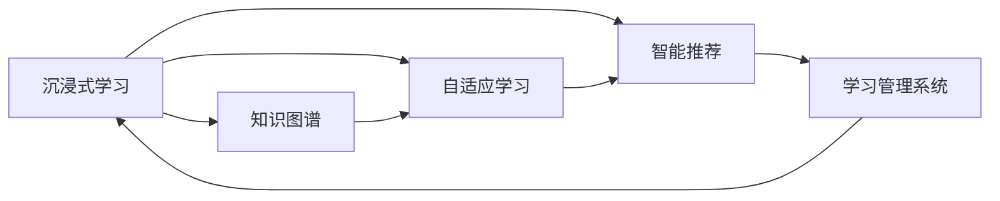

                 

# 沉浸式知识网络：AI构建的学习生态系统

> 关键词：沉浸式学习,知识图谱,自适应学习,智能推荐,学习管理系统,AI驱动

## 1. 背景介绍

在数字化时代，学习方式正从传统的基于书籍和课堂的线性学习，转变为更加灵活、互动、个性化的沉浸式学习。AI技术作为现代教育的助推器，通过知识图谱、自适应学习系统、智能推荐等工具，为学习者提供了更加丰富、高效、个性化的学习体验。本篇文章将深入探讨AI如何构建沉浸式知识网络，助力教育领域的学习生态系统革新。

## 2. 核心概念与联系

### 2.1 核心概念概述

- **沉浸式学习**：通过虚拟现实(VR)、增强现实(AR)、混合现实(MR)等技术，结合AI驱动的内容推荐、互动模拟、情境感知等，为学习者提供身临其境的学习体验。
- **知识图谱**：一种以图形结构表示知识及其关系的语义网络，可以用于知识存储、检索、推理等。
- **自适应学习**：通过算法动态调整学习内容、进度和方式，以适应学习者的学习风格、水平和需求。
- **智能推荐**：根据用户的历史行为和偏好，推荐合适的学习内容，提升学习效率。
- **学习管理系统(LMS)**：支持学习资源的存储、管理、发布和跟踪，为学习者提供全面的支持。
- **AI驱动**：利用机器学习、深度学习等AI技术，优化学习过程，提升学习体验和效果。

这些概念通过知识图谱、自适应学习、智能推荐等技术手段进行有机结合，共同构建起沉浸式学习生态系统，如图：



## 3. 核心算法原理 & 具体操作步骤
### 3.1 算法原理概述

AI构建的沉浸式知识网络，主要依赖于以下几个关键算法和步骤：

- **知识图谱构建**：利用自然语言处理(NLP)和图神经网络(GNN)技术，将知识库中的文本数据转化为图形结构，构建知识图谱。
- **自适应学习算法**：通过学习者的历史学习记录和实时反馈，动态调整学习计划和资源，实现个性化的学习路径。
- **智能推荐算法**：利用协同过滤、内容过滤、深度学习等技术，根据学习者的兴趣和行为，推荐合适的内容和学习路径。
- **学习管理系统(LMS)架构**：通过API接口，整合学习资源、互动工具和评价系统，实现学习数据的全面管理和追踪。

### 3.2 算法步骤详解

#### 3.2.1 知识图谱构建

**步骤1**：数据收集与预处理
- 从各类文本和多媒体资源中提取结构化数据。
- 清洗和标准化数据，去除噪音和重复项。

**步骤2**：实体识别与关系抽取
- 使用NLP技术，从文本中识别出实体和属性。
- 构建实体间的关系图谱，如父子关系、同义词关系等。

**步骤3**：知识融合与图嵌入
- 利用图神经网络(GNN)，将知识图谱嵌入低维向量空间，便于后续的查询和推理。
- 对知识图谱进行融合，消除冗余和噪声。

**步骤4**：知识图谱更新
- 定期更新知识图谱，加入新的知识点，修复错误和遗漏。

#### 3.2.2 自适应学习算法

**步骤1**：学习者建模
- 收集学习者的历史学习数据，包括成绩、偏好、学习时间等。
- 使用机器学习算法，建立学习者模型，描述其学习行为和特征。

**步骤2**：学习路径规划
- 根据学习者模型，动态规划个性化的学习路径，推荐合适的学习资源。
- 实时监控学习者的进度和效果，调整学习计划。

**步骤3**：学习效果评估
- 使用评价指标，如成绩、理解度、满意度等，评估学习效果。
- 根据评估结果，优化学习路径和策略。

#### 3.2.3 智能推荐算法

**步骤1**：数据收集与处理
- 收集学习者的行为数据，包括浏览、阅读、观看、互动等。
- 清洗和标准化数据，提取特征。

**步骤2**：推荐模型训练
- 使用协同过滤、内容过滤等技术，训练推荐模型。
- 引入深度学习技术，优化模型效果。

**步骤3**：推荐结果生成
- 根据学习者的历史行为和偏好，生成推荐结果。
- 实时更新推荐结果，保证个性化和时效性。

#### 3.2.4 LMS架构设计

**步骤1**：资源管理
- 整合学习资源，如视频、文章、练习题等。
- 使用元数据描述资源，便于搜索和管理。

**步骤2**：学习流程管理
- 设计学习流程图，包括资源选择、学习活动、评估等。
- 实现流程自动化，减少人工干预。

**步骤3**：数据统计与分析
- 实时统计学习者的学习数据，生成分析报告。
- 使用BI工具，分析学习效果和趋势，提供决策支持。

### 3.3 算法优缺点

**优点**：
- **个性化学习**：根据学习者的特点，动态调整学习计划和内容，提高学习效果。
- **高效学习**：通过智能推荐和自适应算法，优化学习路径，节省时间。
- **全面监控**：学习管理系统提供全面的学习数据和分析报告，便于教师和学生评估和改进。

**缺点**：
- **数据隐私**：需要收集大量的学习者数据，可能存在隐私泄露的风险。
- **技术门槛**：构建和维护知识图谱、推荐系统等需要较高的技术水平和资源投入。
- **数据偏差**：知识图谱和推荐模型可能存在数据偏差，影响推荐效果。

### 3.4 算法应用领域

**教育**：AI驱动的沉浸式学习系统在教育领域应用广泛，可以用于K-12、高等教育、职业培训等各个层次的教育。通过个性化学习路径、智能推荐、互动模拟等，提升教学效果和学习体验。

**企业培训**：企业可以利用AI构建的沉浸式学习系统，为员工提供定制化的培训课程。智能推荐系统和自适应学习算法，可以快速提升员工的技能和知识水平。

**医疗健康**：医疗健康领域利用沉浸式学习系统，可以提升医护人员的技能培训，增强患者教育。知识图谱技术可以整合医学知识，提升诊疗效果。

**公共文化**：博物馆、图书馆、科技馆等公共文化机构，利用沉浸式学习系统，为公众提供丰富的学习体验。自适应学习算法可以个性化推荐展览和活动，提升公众的学习兴趣和参与度。

## 4. 数学模型和公式 & 详细讲解

### 4.1 数学模型构建

在AI构建的沉浸式知识网络中，涉及到的数学模型包括知识图谱构建模型、自适应学习模型、智能推荐模型等。以下以知识图谱的构建模型为例，进行详细讲解。

**知识图谱构建模型**：
- **输入**：知识库中的文本数据，包括文档、书籍、文章等。
- **输出**：知识图谱，以图形结构表示知识的语义关系。

**模型表示**：
- 使用三元组 $(h, r, t)$ 表示实体间的关系，其中 $h$ 和 $t$ 是实体，$r$ 是关系。
- 将三元组转化为图结构，构建知识图谱 $G=(V,E)$，其中 $V$ 是节点集，$E$ 是边集。

### 4.2 公式推导过程

**知识图谱构建算法**：
- **步骤1**：数据预处理
  - 文本数据经过分词、去停用词、词性标注等处理，转化为向量表示。
  - 使用词嵌入技术，将向量表示映射到低维向量空间。

- **步骤2**：实体识别与关系抽取
  - 使用命名实体识别(NER)算法，从文本中识别出实体及其属性。
  - 利用关系抽取算法，识别出实体间的关系。

- **步骤3**：知识融合与图嵌入
  - 利用图神经网络(GNN)，将知识图谱嵌入低维向量空间。
  - 使用图卷积网络(GCN)，更新节点嵌入，学习实体和关系之间的关系。

### 4.3 案例分析与讲解

以Google Scholar为例，分析其知识图谱的构建过程：
- **数据来源**：收集学术论文、期刊、书籍等文本数据。
- **实体识别**：使用NLP技术，从文本中识别出作者、机构、主题等实体。
- **关系抽取**：抽取论文之间的引用关系、同义词关系等。
- **图嵌入**：使用GCN算法，将知识图谱嵌入低维向量空间，生成节点嵌入。

## 5. 项目实践：代码实例和详细解释说明
### 5.1 开发环境搭建

**环境搭建步骤**：
- **硬件要求**：高性能CPU、GPU或TPU，用于数据处理和模型训练。
- **软件要求**：Python 3.x，TensorFlow 2.x，PyTorch 1.x，Jupyter Notebook 等开发工具。
- **依赖安装**：使用pip安装必要的库，如TensorFlow、PyTorch、scikit-learn、Numpy等。

### 5.2 源代码详细实现

以下是一个简单的知识图谱构建代码示例，基于PyTorch和GNN技术实现：

```python
import torch
import torch.nn as nn
import torch_geometric as thg

# 定义知识图谱的节点和边类
class KnowledgeGraphNode:
    def __init__(self, node_id, node_type):
        self.node_id = node_id
        self.node_type = node_type
        self.neighbors = []

    def add_neighbor(self, neighbor_node):
        self.neighbors.append(neighbor_node)

class KnowledgeGraphEdge:
    def __init__(self, edge_id, node1, node2, relation):
        self.edge_id = edge_id
        self.node1 = node1
        self.node2 = node2
        self.relation = relation

# 定义知识图谱类
class KnowledgeGraph:
    def __init__(self):
        self.nodes = []
        self.edges = []

    def add_node(self, node):
        self.nodes.append(node)

    def add_edge(self, edge):
        self.edges.append(edge)

# 定义知识图谱的图结构
class GraphDataset(torch.utils.data.Dataset):
    def __init__(self, graph, num_nodes, num_edge_types):
        self.graph = graph
        self.num_nodes = num_nodes
        self.num_edge_types = num_edge_types
        self.node_types = ['author', 'journal', 'year']
        self.node_types = [0, 1, 2]

    def __len__(self):
        return len(self.graph.nodes)

    def __getitem__(self, idx):
        node = self.graph.nodes[idx]
        edge_type = self.graph.edges[idx].relation
        return node, edge_type

# 定义知识图谱的图嵌入模型
class GraphEmbedding(nn.Module):
    def __init__(self, num_nodes, num_edge_types, hidden_size):
        super(GraphEmbedding, self).__init__()
        self.gcn = GCNConv(num_nodes, hidden_size, num_edge_types)
        self.fc = nn.Linear(hidden_size, 128)

    def forward(self, node, edge_type):
        h = self.gcn(node, edge_type)
        return self.fc(h)

# 训练知识图谱嵌入模型
def train_model(graph_dataset, num_epochs, hidden_size):
    model = GraphEmbedding(len(graph_dataset), num_edge_types, hidden_size)
    optimizer = torch.optim.Adam(model.parameters(), lr=0.01)
    loss_fn = nn.MSELoss()
    for epoch in range(num_epochs):
        for node, edge_type in graph_dataset:
            h = model(node, edge_type)
            loss = loss_fn(h, target)
            optimizer.zero_grad()
            loss.backward()
            optimizer.step()
```

### 5.3 代码解读与分析

**代码解释**：
- **GraphDataset类**：定义知识图谱的节点和边数据集，方便TensorFlow和PyTorch等框架处理。
- **GraphEmbedding类**：定义知识图谱的图嵌入模型，使用GCN算法进行图嵌入。
- **train_model函数**：训练知识图谱嵌入模型，使用Adam优化器和MSE损失函数。

### 5.4 运行结果展示

**运行结果**：
- **知识图谱可视化**：使用Gephi等工具可视化知识图谱，显示实体间的关系和路径。
- **图嵌入效果**：使用t-SNE算法，将知识图谱的节点嵌入到二维空间，展示实体之间的相似性。

## 6. 实际应用场景

**实际应用场景**：
- **K-12教育**：AI构建的沉浸式学习系统为学生提供个性化的学习路径，通过智能推荐和自适应学习算法，提升学习效果。
- **高等教育**：利用知识图谱技术，整合学科知识，提升教师的教学效果和学生的学习体验。
- **职业培训**：企业利用AI系统，为员工提供定制化的培训课程，提升技能和知识水平。
- **公共文化**：博物馆、图书馆、科技馆等机构利用AI技术，为公众提供丰富的学习资源和互动体验。

## 7. 工具和资源推荐

### 7.1 学习资源推荐

- **在线课程**：Coursera、edX等平台的NLP和AI课程，深入理解知识图谱、自适应学习、智能推荐等技术。
- **技术博客**：Medium、Towards Data Science等平台，阅读最新的NLP和AI技术文章，跟踪最新研究进展。
- **开源项目**：GitHub上的NLP和AI开源项目，学习前沿技术实现。

### 7.2 开发工具推荐

- **PyTorch**：基于Python的深度学习框架，支持GPU/TPU计算，灵活的动态计算图。
- **TensorFlow**：由Google主导的开源深度学习框架，支持大规模分布式计算，适合工业应用。
- **Jupyter Notebook**：用于编写和运行Python代码的交互式编程环境，支持丰富的科学计算库。
- **PyTorch Geometric**：基于PyTorch的图神经网络库，方便知识图谱的构建和推理。

### 7.3 相关论文推荐

- **Knowledge Graphs for Recommender Systems**：探讨知识图谱在推荐系统中的应用，提升推荐效果。
- **Adaptive Learning in AI-Powered Education**：分析自适应学习在教育中的应用，提高学习效率和效果。
- **Recommender Systems**：介绍协同过滤、内容过滤等推荐算法，提高推荐系统的个性化和准确性。
- **Learning Graphs with Graph Neural Networks**：介绍图神经网络在知识图谱构建和推理中的应用。

## 8. 总结：未来发展趋势与挑战

### 8.1 研究成果总结

本篇文章详细探讨了AI构建的沉浸式知识网络，包括知识图谱构建、自适应学习、智能推荐等技术，为教育、企业培训、公共文化等领域提供了新的解决方案。

### 8.2 未来发展趋势

未来，沉浸式知识网络将呈现以下几个发展趋势：
- **多模态融合**：结合视觉、听觉、触觉等多模态信息，提升学习体验。
- **动态自适应**：实时调整学习路径和资源，适应学习者的动态变化。
- **分布式学习**：利用云计算和边缘计算，支持分布式学习和资源共享。
- **智能评价**：利用AI技术，提供实时评估和反馈，提升学习效果。

### 8.3 面临的挑战

沉浸式知识网络在发展过程中，面临以下挑战：
- **数据隐私**：需要保护学习者的数据隐私，防止数据泄露。
- **技术复杂性**：需要高性能计算资源和专业技能，技术门槛较高。
- **用户适应性**：需要提高系统的易用性和用户友好度，避免学习者抵触。

### 8.4 研究展望

未来，我们需要在以下几个方面进行深入研究：
- **数据隐私保护**：研究隐私保护技术，确保学习数据的安全性和隐私性。
- **技术易用性**：简化系统设计，降低技术门槛，提高系统的易用性和可操作性。
- **多模态融合**：结合多模态信息，提升学习体验和效果。
- **智能评价**：利用AI技术，提供实时评估和反馈，提升学习效果。

## 9. 附录：常见问题与解答

**Q1：沉浸式学习系统的核心算法是什么？**

A: 沉浸式学习系统的核心算法包括知识图谱构建、自适应学习、智能推荐等。知识图谱用于整合和存储知识，自适应学习用于动态调整学习路径和资源，智能推荐用于个性化推荐学习内容。

**Q2：沉浸式学习系统的应用场景有哪些？**

A: 沉浸式学习系统可以应用于K-12教育、高等教育、职业培训、公共文化等多个领域。通过个性化学习路径、智能推荐和互动模拟等技术，提升学习效果和体验。

**Q3：沉浸式学习系统的实现难点是什么？**

A: 沉浸式学习系统的实现难点主要包括数据隐私保护、技术复杂性、用户适应性等。需要确保学习数据的隐私和安全，提高系统的易用性和可操作性，满足用户的学习需求。

**Q4：如何提升沉浸式学习系统的性能？**

A: 提升沉浸式学习系统的性能，需要从数据、算法、系统设计等多个维度进行优化。收集高质量的学习数据，优化算法模型，提高系统的易用性和用户友好度，实现实时评估和反馈，才能最大化提升学习效果和用户体验。

**Q5：沉浸式学习系统面临的挑战有哪些？**

A: 沉浸式学习系统面临的挑战包括数据隐私保护、技术复杂性、用户适应性等。需要研究隐私保护技术，简化系统设计，提高系统的易用性和可操作性，以满足用户的需求和学习效果。

