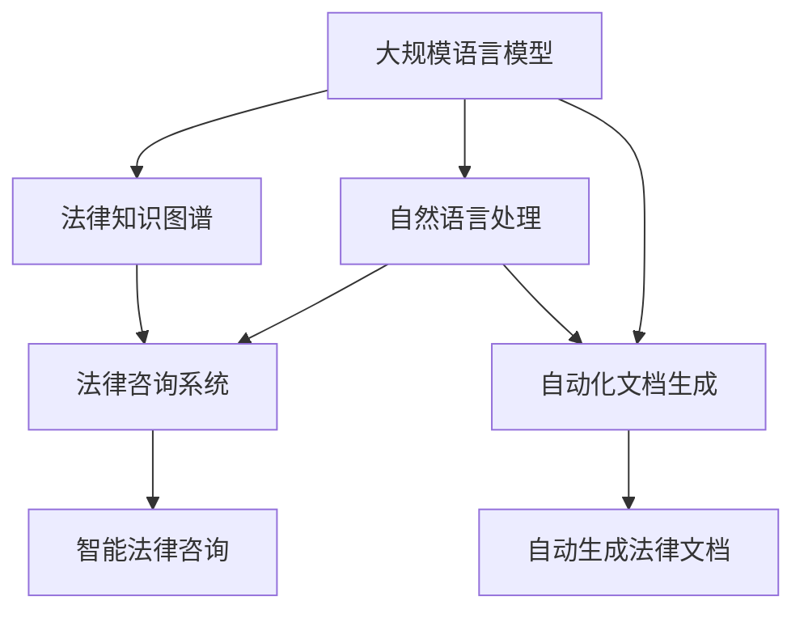

                 

# 法律研究助手：LLM 简化法律复杂性

> 关键词：法律研究助手, 自然语言处理(NLP), 法律知识图谱, 数据驱动, 语义理解, 法律咨询系统, 自动化文档生成

## 1. 背景介绍

### 1.1 问题由来
随着人工智能技术在各行各业的不断应用，其在法律领域的应用也逐渐成为热点。传统法律研究需要花费大量时间在复杂而繁琐的文本阅读和分析上，这不仅耗时费力，而且容易出错。因此，如何利用先进的自然语言处理(NLP)技术，帮助法律从业者简化法律工作流程，提高法律研究效率，成为了一个亟待解决的问题。

### 1.2 问题核心关键点
本文将探讨如何利用大规模语言模型(LLM)，特别是法律领域的预训练模型，构建一个高效、智能的法律研究助手。通过基于监督学习的大规模语言模型微调，该助手能够自动解析法律文本、提供法律咨询、生成法律文书，极大地简化了法律工作的复杂性，提高了工作效率。

## 2. 核心概念与联系

### 2.1 核心概念概述

为更好地理解基于LLM的法律研究助手，本文将介绍几个关键概念：

- **大规模语言模型(LLM)**：以自回归模型(如GPT-3)或自编码模型(如BERT)为代表的大规模预训练语言模型。通过在大规模无标签文本语料上进行预训练，学习通用的语言表示，具备强大的语言理解和生成能力。

- **法律知识图谱(Legal Knowledge Graph)**：基于法律领域专有知识构建的图结构，用于表示法律概念、规则、案例之间的关系。

- **自然语言处理(NLP)**：涉及语言模型的构建、文本分析、信息抽取、问答系统等技术，旨在理解和生成人类语言。

- **数据驱动**：通过收集和分析海量法律文本数据，驱动模型自动学习和优化。

- **语义理解**：利用NLP技术，实现对法律文本的深层理解和语义解析。

- **法律咨询系统**：集成法律知识图谱和LLM，提供智能法律咨询和文书生成功能。

- **自动化文档生成**：利用LLM的生成能力，自动生成各类法律文档，如合同、判决书、起诉状等。

这些概念之间的逻辑关系可以通过以下Mermaid流程图来展示：



这个流程图展示了大规模语言模型在法律研究助手中的核心作用，以及其与其他关键概念的联系：

1. 法律知识图谱为LLM提供了丰富的法律知识背景。
2. NLP技术帮助LLM理解和生成法律文本。
3. 法律咨询系统和自动化文档生成系统利用LLM进行具体应用。

## 3. 核心算法原理 & 具体操作步骤
### 3.1 算法原理概述

基于监督学习的大规模语言模型微调，在法律研究助手中的应用主要包括以下几个步骤：

1. **数据收集与预处理**：收集法律领域的大量文本数据，如立法文件、司法判决、法律条文等，并进行分词、去噪、标注等预处理。
2. **构建知识图谱**：基于法律领域的专有知识和文本数据，构建法律知识图谱，用于表示法律概念、规则和案例之间的关系。
3. **模型训练与微调**：在法律知识图谱和预处理后的文本数据上，使用监督学习算法训练一个大规模语言模型，并在特定法律任务上进行微调，如法律文本解析、法律咨询、法律文书生成等。
4. **应用实现**：将微调后的LLM集成到法律咨询系统或自动化文档生成系统中，提供智能法律咨询和自动化文书生成功能。

### 3.2 算法步骤详解

**Step 1: 数据收集与预处理**

1. **文本数据收集**：从法律数据库、公开案例、法规库等来源收集大量的法律文本数据。
2. **分词与去噪**：使用NLP技术对文本进行分词和去噪处理，去除无关信息，如日期、脚注等。
3. **标注与实体识别**：对文本进行实体识别，如人名、地名、时间等，并进行标注，为后续的语义理解提供基础。

**Step 2: 构建法律知识图谱**

1. **知识图谱构建**：基于法律领域的专有知识和文本数据，构建法律知识图谱，表示法律概念、规则和案例之间的关系。
2. **知识图谱嵌入**：使用嵌入算法，将法律概念、规则和案例映射到低维向量空间中，用于模型的输入。

**Step 3: 模型训练与微调**

1. **模型选择**：选择适合的法律任务(如合同解析、案例推理、文书生成等)，并确定模型的架构。
2. **模型训练**：在构建的知识图谱和预处理后的文本数据上，使用监督学习算法训练一个大规模语言模型。
3. **微调**：在特定法律任务上，使用少量的标注数据进行微调，使模型更好地适应具体的法律场景。

**Step 4: 应用实现**

1. **系统集成**：将微调后的LLM集成到法律咨询系统或自动化文档生成系统中，提供智能法律咨询和自动化文书生成功能。
2. **用户交互**：设计友好的用户界面，使用户能够输入法律问题或文本，系统自动提供解答或生成相关文书。
3. **反馈与优化**：收集用户反馈，不断优化模型和系统性能，提升用户体验。

### 3.3 算法优缺点

基于监督学习的大规模语言模型微调，在法律研究助手中的应用具有以下优点：

1. **高效性**：利用预训练模型的知识基础，可以在少量标注数据上快速进行微调，大幅缩短研发周期。
2. **通用性**：大规模语言模型在多种法律任务上都能取得不错的效果，如合同解析、案例推理、文书生成等。
3. **灵活性**：通过微调，模型可以适应不同的法律场景和需求，实现个性化应用。

同时，该方法也存在以下局限性：

1. **依赖标注数据**：微调效果很大程度上取决于标注数据的质量和数量，获取高质量标注数据的成本较高。
2. **泛化能力有限**：当目标任务与预训练数据的分布差异较大时，微调的性能提升有限。
3. **解释性不足**：微调模型的决策过程通常缺乏可解释性，难以对其推理逻辑进行分析和调试。

尽管存在这些局限性，但就目前而言，基于监督学习的微调方法仍是大规模语言模型应用的最主流范式。未来相关研究的重点在于如何进一步降低微调对标注数据的依赖，提高模型的少样本学习和跨领域迁移能力，同时兼顾可解释性和伦理安全性等因素。

### 3.4 算法应用领域

基于大规模语言模型微调的法律研究助手，已经在多个法律领域得到了应用，例如：

- **合同解析**：利用预训练模型自动解析合同条款，提供合同关键信息摘要，减少人工审阅工作。
- **案例推理**：对法律案例进行解析，提取案件关键信息，提供类似案件推荐，辅助司法判决。
- **文书生成**：自动生成各类法律文书，如起诉状、答辩状、律师函等，提高文书制作效率。
- **法律咨询**：基于法律知识图谱，自动回答法律咨询，提供即时法律支持。
- **法律文书校对**：利用NLP技术自动校对法律文书，检测错误和瑕疵，提升文书质量。

除了上述这些经典应用外，法律研究助手还被创新性地应用到更多场景中，如法律数据挖掘、法律文本分类、法律风险评估等，为法律工作带来了全新的突破。

## 4. 数学模型和公式 & 详细讲解 & 举例说明

### 4.1 数学模型构建

法律研究助手的核心在于利用大规模语言模型对法律文本进行语义理解，并在此基础上进行各类应用。因此，我们需要构建一个基于监督学习的数学模型，用于描述法律文本的语义表示和各类法律任务的实现。

记法律文本为 $T$，其中 $T=(t_1, t_2, ..., t_n)$，每个文本 $t_i$ 可以表示为一个向量 $\mathbf{t}_i \in \mathbb{R}^m$，其中 $m$ 为文本向量的维度。

法律知识图谱中的法律概念、规则和案例可以用向量表示，如 $\mathbf{c}_1, \mathbf{r}_1, \mathbf{c}_2, \mathbf{r}_2, ...$。

定义法律文本的语义表示为 $\mathbf{h}_t = f(\mathbf{t}, \mathbf{c}, \mathbf{r})$，其中 $f$ 为语义理解模型，用于将法律文本映射到语义空间中。

### 4.2 公式推导过程

以合同解析任务为例，我们可以使用以下数学模型：

1. **文本表示**：
$$
\mathbf{h}_t = f(\mathbf{t}, \mathbf{c}, \mathbf{r})
$$

2. **语义匹配**：
$$
\mathbf{s} = \max_{c, r} \mathbf{h}_c \cdot \mathbf{h}_t
$$

其中，$\mathbf{h}_c$ 为合同中某个概念或规则的语义表示，$\mathbf{h}_r$ 为合同中某个案例的语义表示，$\cdot$ 表示向量内积。

3. **合同摘要生成**：
$$
\mathbf{a} = \text{argmax}_{\mathbf{h}} \max_{c, r} \mathbf{h}_c \cdot \mathbf{h}
$$

其中，$\mathbf{h}$ 为法律文本的语义表示，$\text{argmax}$ 表示在所有可能的合同摘要中选择最佳的摘要。

### 4.3 案例分析与讲解

假设我们要解析一份合同，首先通过大规模语言模型将合同文本映射到语义空间中，得到 $\mathbf{h}_t$。然后，在法律知识图谱中搜索与合同内容相关的法律概念和规则，得到 $\mathbf{h}_c$ 和 $\mathbf{h}_r$。通过内积计算，找到与合同文本语义匹配最佳的法律概念和规则，生成合同摘要 $\mathbf{a}$。最后，将合同摘要提供给用户，或进一步用于合同解析、文书生成等任务。

## 5. 项目实践：代码实例和详细解释说明

### 5.1 开发环境搭建

在进行法律研究助手开发前，我们需要准备好开发环境。以下是使用Python进行PyTorch开发的环境配置流程：

1. 安装Anaconda：从官网下载并安装Anaconda，用于创建独立的Python环境。

2. 创建并激活虚拟环境：
```bash
conda create -n legal-assistant python=3.8 
conda activate legal-assistant
```

3. 安装PyTorch：根据CUDA版本，从官网获取对应的安装命令。例如：
```bash
conda install pytorch torchvision torchaudio cudatoolkit=11.1 -c pytorch -c conda-forge
```

4. 安装Transformers库：
```bash
pip install transformers
```

5. 安装各类工具包：
```bash
pip install numpy pandas scikit-learn matplotlib tqdm jupyter notebook ipython
```

完成上述步骤后，即可在`legal-assistant`环境中开始开发实践。

### 5.2 源代码详细实现

这里我们以合同解析任务为例，给出使用Transformers库对BERT模型进行法律研究助手的PyTorch代码实现。

首先，定义合同解析任务的数据处理函数：

```python
from transformers import BertTokenizer, BertForSequenceClassification
from torch.utils.data import Dataset
import torch

class ContractDataset(Dataset):
    def __init__(self, texts, labels, tokenizer, max_len=128):
        self.texts = texts
        self.labels = labels
        self.tokenizer = tokenizer
        self.max_len = max_len
        
    def __len__(self):
        return len(self.texts)
    
    def __getitem__(self, item):
        text = self.texts[item]
        label = self.labels[item]
        
        encoding = self.tokenizer(text, return_tensors='pt', max_length=self.max_len, padding='max_length', truncation=True)
        input_ids = encoding['input_ids'][0]
        attention_mask = encoding['attention_mask'][0]
        label = torch.tensor(label, dtype=torch.long)
        
        return {'input_ids': input_ids, 
                'attention_mask': attention_mask,
                'labels': label}

# 标签与id的映射
label2id = {'not_valid': 0, 'valid': 1}
id2label = {v: k for k, v in label2id.items()}

# 创建dataset
tokenizer = BertTokenizer.from_pretrained('bert-base-cased')

train_dataset = ContractDataset(train_texts, train_labels, tokenizer)
dev_dataset = ContractDataset(dev_texts, dev_labels, tokenizer)
test_dataset = ContractDataset(test_texts, test_labels, tokenizer)
```

然后，定义模型和优化器：

```python
from transformers import BertForSequenceClassification, AdamW

model = BertForSequenceClassification.from_pretrained('bert-base-cased', num_labels=len(label2id))

optimizer = AdamW(model.parameters(), lr=2e-5)
```

接着，定义训练和评估函数：

```python
from torch.utils.data import DataLoader
from tqdm import tqdm
from sklearn.metrics import accuracy_score

device = torch.device('cuda') if torch.cuda.is_available() else torch.device('cpu')
model.to(device)

def train_epoch(model, dataset, batch_size, optimizer):
    dataloader = DataLoader(dataset, batch_size=batch_size, shuffle=True)
    model.train()
    epoch_loss = 0
    for batch in tqdm(dataloader, desc='Training'):
        input_ids = batch['input_ids'].to(device)
        attention_mask = batch['attention_mask'].to(device)
        labels = batch['labels'].to(device)
        model.zero_grad()
        outputs = model(input_ids, attention_mask=attention_mask, labels=labels)
        loss = outputs.loss
        epoch_loss += loss.item()
        loss.backward()
        optimizer.step()
    return epoch_loss / len(dataloader)

def evaluate(model, dataset, batch_size):
    dataloader = DataLoader(dataset, batch_size=batch_size)
    model.eval()
    preds, labels = [], []
    with torch.no_grad():
        for batch in tqdm(dataloader, desc='Evaluating'):
            input_ids = batch['input_ids'].to(device)
            attention_mask = batch['attention_mask'].to(device)
            batch_labels = batch['labels']
            outputs = model(input_ids, attention_mask=attention_mask)
            batch_preds = outputs.logits.argmax(dim=2).to('cpu').tolist()
            batch_labels = batch_labels.to('cpu').tolist()
            for pred, label in zip(batch_preds, batch_labels):
                preds.append(pred)
                labels.append(label)
                
    print("Accuracy:", accuracy_score(labels, preds))
```

最后，启动训练流程并在测试集上评估：

```python
epochs = 5
batch_size = 16

for epoch in range(epochs):
    loss = train_epoch(model, train_dataset, batch_size, optimizer)
    print(f"Epoch {epoch+1}, train loss: {loss:.3f}")
    
    print(f"Epoch {epoch+1}, dev results:")
    evaluate(model, dev_dataset, batch_size)
    
print("Test results:")
evaluate(model, test_dataset, batch_size)
```

以上就是使用PyTorch对BERT进行合同解析任务的法律研究助手的完整代码实现。可以看到，得益于Transformers库的强大封装，我们可以用相对简洁的代码完成BERT模型的加载和微调。

### 5.3 代码解读与分析

让我们再详细解读一下关键代码的实现细节：

**ContractDataset类**：
- `__init__`方法：初始化文本、标签、分词器等关键组件。
- `__len__`方法：返回数据集的样本数量。
- `__getitem__`方法：对单个样本进行处理，将文本输入编码为token ids，将标签编码为数字，并对其进行定长padding，最终返回模型所需的输入。

**label2id和id2label字典**：
- 定义了标签与数字id之间的映射关系，用于将模型输出结果解码回文本标签。

**训练和评估函数**：
- 使用PyTorch的DataLoader对数据集进行批次化加载，供模型训练和推理使用。
- 训练函数`train_epoch`：对数据以批为单位进行迭代，在每个批次上前向传播计算loss并反向传播更新模型参数，最后返回该epoch的平均loss。
- 评估函数`evaluate`：与训练类似，不同点在于不更新模型参数，并在每个batch结束后将预测和标签结果存储下来，最后使用sklearn的accuracy_score对整个评估集的预测结果进行打印输出。

**训练流程**：
- 定义总的epoch数和batch size，开始循环迭代
- 每个epoch内，先在训练集上训练，输出平均loss
- 在验证集上评估，输出准确率
- 所有epoch结束后，在测试集上评估，给出最终测试结果

可以看到，PyTorch配合Transformers库使得BERT微调的代码实现变得简洁高效。开发者可以将更多精力放在数据处理、模型改进等高层逻辑上，而不必过多关注底层的实现细节。

当然，工业级的系统实现还需考虑更多因素，如模型的保存和部署、超参数的自动搜索、更灵活的任务适配层等。但核心的微调范式基本与此类似。

## 6. 实际应用场景
### 6.1 智能合同管理

法律研究助手在智能合同管理中的应用，可以极大提高合同审查和管理的效率。传统合同管理依赖人工审查和繁琐的手工操作，容易出错且耗时。通过法律研究助手，可以快速自动解析合同文本，提取关键信息，如合同主体、条款内容、生效日期等，并生成合同摘要，辅助合同审查和管理。

在技术实现上，可以将合同文本作为模型输入，通过微调后的法律研究助手自动解析合同内容，提取关键信息，生成合同摘要，并自动校对合同文本，检测错误和瑕疵，提高合同制作和管理的质量。

### 6.2 法律咨询系统

法律研究助手可以集成到法律咨询系统中，提供智能法律咨询和文书生成功能。用户输入法律问题或文本，系统自动提供解答或生成相关文书，如起诉状、答辩状、律师函等。

通过法律研究助手，法律咨询系统可以实现24小时在线服务，快速准确地解答用户的法律问题，提供即时法律支持。同时，系统可以根据用户的历史咨询记录，不断优化和调整模型的输出，提高法律咨询的准确性和可靠性。

### 6.3 法律数据挖掘

法律研究助手可以用于法律数据挖掘，提取法律文本中的关键信息，如判决结果、法律案例、法律规则等，构建法律知识图谱，辅助法律研究和决策。

通过法律研究助手，可以快速自动解析大量的法律文本数据，提取出有用的法律信息和知识，用于构建法律知识图谱，支持法律研究和决策。这些知识图谱可以为法律专家提供有力的支持，加速法律研究和应用。

### 6.4 未来应用展望

随着法律研究助手技术的不断成熟，未来将在更多领域得到应用，为法律工作带来变革性影响。

在智慧法院建设中，法律研究助手可以用于自动文书生成、案例推理、智能判决等环节，提高司法效率和判决质量。在企业法务管理中，法律研究助手可以用于合同管理、法律咨询、风险评估等，辅助企业法务部门高效开展工作。

此外，法律研究助手还可以应用于法律教育、法律信息化建设、法律咨询行业等，为法律行业带来全面的数字化、智能化升级。

## 7. 工具和资源推荐
### 7.1 学习资源推荐

为了帮助开发者系统掌握法律研究助手技术，这里推荐一些优质的学习资源：

1. 《NLP基础教程》：介绍自然语言处理的基本概念和常用算法，适合入门学习。
2. 《深度学习入门》：涵盖深度学习的基础知识和最新进展，适合进一步学习。
3. 《法律人工智能》：介绍人工智能在法律领域的应用，包含法律研究助手的详细案例。
4. 《Transformers官方文档》：提供Transformer库的详细文档和使用示例，适合开发实践。
5. 《深度学习与法律研究》：涵盖深度学习在法律领域的应用，包括合同解析、文书生成等任务。

通过对这些资源的学习实践，相信你一定能够快速掌握法律研究助手技术的精髓，并用于解决实际的法律问题。
### 7.2 开发工具推荐

高效的开发离不开优秀的工具支持。以下是几款用于法律研究助手开发的常用工具：

1. PyTorch：基于Python的开源深度学习框架，灵活动态的计算图，适合快速迭代研究。

2. TensorFlow：由Google主导开发的开源深度学习框架，生产部署方便，适合大规模工程应用。

3. Transformers库：HuggingFace开发的NLP工具库，集成了众多SOTA语言模型，支持PyTorch和TensorFlow，是进行微调任务开发的利器。

4. Weights & Biases：模型训练的实验跟踪工具，可以记录和可视化模型训练过程中的各项指标，方便对比和调优。

5. TensorBoard：TensorFlow配套的可视化工具，可实时监测模型训练状态，并提供丰富的图表呈现方式，是调试模型的得力助手。

6. Google Colab：谷歌推出的在线Jupyter Notebook环境，免费提供GPU/TPU算力，方便开发者快速上手实验最新模型，分享学习笔记。

合理利用这些工具，可以显著提升法律研究助手的开发效率，加快创新迭代的步伐。

### 7.3 相关论文推荐

法律研究助手技术的发展源于学界的持续研究。以下是几篇奠基性的相关论文，推荐阅读：

1. Attention is All You Need：提出了Transformer结构，开启了NLP领域的预训练大模型时代。

2. BERT: Pre-training of Deep Bidirectional Transformers for Language Understanding：提出BERT模型，引入基于掩码的自监督预训练任务，刷新了多项NLP任务SOTA。

3. Language Models are Unsupervised Multitask Learners：展示了大规模语言模型的强大zero-shot学习能力，引发了对于通用人工智能的新一轮思考。

4. Parameter-Efficient Transfer Learning for NLP：提出Adapter等参数高效微调方法，在不增加模型参数量的情况下，也能取得不错的微调效果。

5. Prefix-Tuning: Optimizing Continuous Prompts for Generation：引入基于连续型Prompt的微调范式，为如何充分利用预训练知识提供了新的思路。

6. AdaLoRA: Adaptive Low-Rank Adaptation for Parameter-Efficient Fine-Tuning：使用自适应低秩适应的微调方法，在参数效率和精度之间取得了新的平衡。

这些论文代表了大规模语言模型微调技术的发展脉络。通过学习这些前沿成果，可以帮助研究者把握学科前进方向，激发更多的创新灵感。

## 8. 总结：未来发展趋势与挑战

### 8.1 总结

本文对基于监督学习的大规模语言模型微调在法律研究助手中的应用进行了全面系统的介绍。首先阐述了法律研究助手的研究背景和意义，明确了其简化法律复杂性的独特价值。其次，从原理到实践，详细讲解了监督微调的数学原理和关键步骤，给出了法律研究助手的完整代码实例。同时，本文还广泛探讨了法律研究助手在智能合同管理、法律咨询系统、法律数据挖掘等多个场景中的应用前景，展示了其巨大的应用潜力。此外，本文精选了微调技术的各类学习资源，力求为读者提供全方位的技术指引。

通过本文的系统梳理，可以看到，基于大规模语言模型的微调方法在法律研究助手中的应用，正在逐步简化法律工作的复杂性，提高法律研究和管理的效率，为法律工作者提供有力支持。未来，随着技术的不断成熟和应用场景的不断扩展，法律研究助手必将成为法律行业数字化、智能化升级的重要工具。

### 8.2 未来发展趋势

展望未来，基于大规模语言模型的法律研究助手将呈现以下几个发展趋势：

1. **模型规模增大**：随着算力成本的下降和数据规模的扩张，法律研究助手的预训练模型参数量也将持续增长，其语言表示能力将更强。
2. **微调方法优化**：将引入更多参数高效和计算高效的微调方法，如LoRA、Adapter等，在固定大部分预训练参数的同时，只更新极少量的任务相关参数。
3. **知识图谱扩展**：构建更加全面、详细的法律知识图谱，涵盖更多的法律概念、规则和案例，提高模型的知识覆盖范围。
4. **多模态融合**：融合视觉、语音等多模态数据，构建多模态的法律研究助手，提高系统的感知能力和智能水平。
5. **跨领域应用**：将法律研究助手技术应用于更多领域，如医疗、金融、教育等，为更多行业提供智能支持。

这些趋势表明，法律研究助手技术将在未来法律行业中发挥更加重要的作用，为法律工作带来革命性变革。

### 8.3 面临的挑战

尽管法律研究助手技术已经取得了显著成果，但在其广泛应用的过程中，仍面临以下挑战：

1. **数据质量问题**：高质量的法律数据获取成本较高，数据质量不均一性也影响了模型的性能。如何构建全面、准确的法律数据集，是一个重要的研究方向。
2. **法律知识图谱的构建**：法律知识图谱的构建需要耗费大量时间和资源，且复杂度较高。如何自动构建法律知识图谱，提升知识图谱的更新效率，是一个亟待解决的难题。
3. **模型的鲁棒性和泛化能力**：法律文本的语义复杂多样，如何提高模型的鲁棒性和泛化能力，确保在不同场景下都能稳定输出，是一个重要的研究方向。
4. **算力资源的需求**：大规模法律研究助手的训练和推理需要较高的算力资源，如何优化模型结构，减少计算开销，是一个需要持续研究的课题。
5. **隐私和安全问题**：法律文本涉及敏感信息，如何在保护隐私的前提下，充分利用法律数据进行模型训练和优化，是一个重要的研究方向。

这些挑战需要学界和产业界共同努力，推动法律研究助手技术的不断完善和进步。

### 8.4 研究展望

未来，法律研究助手技术需要在以下几个方面寻求新的突破：

1. **数据驱动的法律知识图谱构建**：利用大数据和机器学习技术，自动构建和更新法律知识图谱，提升知识图谱的质量和时效性。
2. **参数高效的法律模型微调**：开发更加参数高效的微调方法，如LoRA、Adapter等，在固定大部分预训练参数的同时，只更新极少量的任务相关参数。
3. **跨模态的法律文本理解**：将视觉、语音等多模态数据与文本数据进行融合，构建跨模态的法律研究助手，提高系统的感知能力和智能水平。
4. **智能法律咨询和文书生成**：利用自然语言生成技术，提高法律咨询和文书生成的准确性和自动化水平，提升法律服务的效率和质量。
5. **知识增强的法律推理**：将知识图谱与法律推理过程相结合，增强法律推理的准确性和可靠性，辅助法律专家进行决策。

这些研究方向将推动法律研究助手技术向更加智能化、普适化应用迈进，为法律行业带来更深远的影响。

## 9. 附录：常见问题与解答

**Q1：法律研究助手是否适用于所有法律场景？**

A: 法律研究助手在大多数法律场景中都能取得不错的效果，特别是对于数据量较小的任务。但对于一些特定的法律场景，如刑事辩护、复杂合同解析等，可能需要进一步定制化处理。此外，法律研究助手在处理涉及敏感信息的案件时，也需要特别注意隐私保护和数据安全。

**Q2：微调过程中如何选择合适的学习率？**

A: 微调的学习率一般要比预训练时小1-2个数量级，如果使用过大的学习率，容易破坏预训练权重，导致过拟合。一般建议从1e-5开始调参，逐步减小学习率，直至收敛。也可以使用warmup策略，在开始阶段使用较小的学习率，再逐渐过渡到预设值。需要注意的是，不同的优化器(如AdamW、Adafactor等)以及不同的学习率调度策略，可能需要设置不同的学习率阈值。

**Q3：采用法律研究助手时会面临哪些资源瓶颈？**

A: 大规模法律研究助手的训练和推理需要较高的算力资源，GPU/TPU等高性能设备是必不可少的，但即便如此，超大批次的训练和推理也可能遇到显存不足的问题。因此需要采用一些资源优化技术，如梯度积累、混合精度训练、模型并行等，来突破硬件瓶颈。同时，模型的存储和读取也可能占用大量时间和空间，需要采用模型压缩、稀疏化存储等方法进行优化。

**Q4：如何缓解法律研究助手在微调过程中的过拟合问题？**

A: 过拟合是微调面临的主要挑战，尤其是在标注数据不足的情况下。常见的缓解策略包括：
1. 数据增强：通过回译、近义替换等方式扩充训练集
2. 正则化：使用L2正则、Dropout、Early Stopping等避免过拟合
3. 对抗训练：引入对抗样本，提高模型鲁棒性
4. 参数高效微调：只调整少量参数(如Adapter、Prefix等)，减小过拟合风险
5. 多模型集成：训练多个微调模型，取平均输出，抑制过拟合

这些策略往往需要根据具体任务和数据特点进行灵活组合。只有在数据、模型、训练、推理等各环节进行全面优化，才能最大限度地发挥法律研究助手的威力。

**Q5：法律研究助手在落地部署时需要注意哪些问题？**

A: 将法律研究助手转化为实际应用，还需要考虑以下因素：
1. 模型裁剪：去除不必要的层和参数，减小模型尺寸，加快推理速度
2. 量化加速：将浮点模型转为定点模型，压缩存储空间，提高计算效率
3. 服务化封装：将模型封装为标准化服务接口，便于集成调用
4. 弹性伸缩：根据请求流量动态调整资源配置，平衡服务质量和成本
5. 监控告警：实时采集系统指标，设置异常告警阈值，确保服务稳定性
6. 安全防护：采用访问鉴权、数据脱敏等措施，保障数据和模型安全

法律研究助手技术的成功落地，还需要在工程实践中进行不断的打磨和优化。合理利用这些工具，可以显著提升法律研究助手的开发效率，加快创新迭代的步伐。

---

作者：禅与计算机程序设计艺术 / Zen and the Art of Computer Programming

