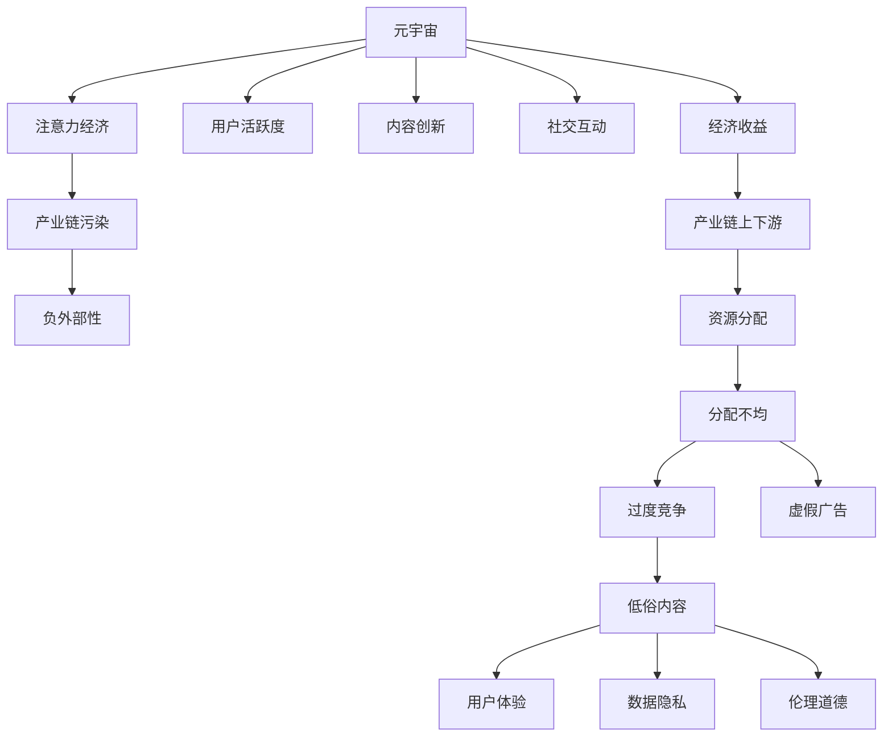

                 

# 注意力产业链污染:元宇宙经济发展的负面外部性研究

> 关键词：元宇宙, 注意力经济, 产业链污染, 负外部性, 用户体验, 隐私保护

## 1. 背景介绍

### 1.1 问题由来
随着技术的不断演进，元宇宙正在逐渐从概念走向现实。在这一过程中，元宇宙生态的注意力经济与注意力产业链污染问题逐渐显现，成为制约其健康发展的重大挑战。元宇宙作为数字世界的虚拟空间，其经济活动的核心是吸引用户注意力，并转化为消费行为和价值创造。但与此同时，这一过程也伴随着注意力资源的过度开发、滥用及产业链上的诸多负面效应，严重影响了元宇宙经济的健康发展。

### 1.2 问题核心关键点
元宇宙注意力产业链污染的核心问题在于：
- **注意力资源的过度开发**：为追求更高的用户活跃度和消费转化率，开发者和平台商过度依赖于稀缺的注意力资源，导致资源分配不均、过度竞争，甚至可能引发注意力枯竭。
- **产业链环境恶化**：注意力产业链上的各类参与方，包括开发者、内容创作者、广告商、平台商等，为了争夺有限的注意力资源，不惜采用虚假广告、低俗内容等手段，造成产业链环境恶劣，用户体验下降。
- **负外部性积累**：过度追求注意力带来的经济利益，忽视了用户隐私、数据安全等社会责任，导致负外部性不断积累，甚至引发社会伦理问题。
- **发展方向偏离**：注意力经济导向下的过度商业化，使得元宇宙生态的创新和可持续发展能力受到削弱，偏离了构建健康、可持续数字社会生态的初衷。

### 1.3 问题研究意义
研究元宇宙注意力产业链污染问题，对于构建一个健康、可持续、公平的元宇宙经济体系，具有重要意义：

1. **促进公平竞争**：通过优化注意力资源分配机制，减少不正当竞争行为，建立公平的元宇宙经济生态。
2. **提升用户体验**：通过减少注意力污染，保障用户隐私安全，提升元宇宙体验的整体质量和舒适度。
3. **推动可持续发展**：引导元宇宙经济向创新驱动、生态友好的方向发展，实现长期的可持续发展。
4. **强化社会责任**：引导元宇宙企业履行社会责任，保障社会伦理道德底线，构建信任度高的数字社区。
5. **推动技术进步**：关注元宇宙技术的前沿趋势，推动技术创新，加速元宇宙的落地应用。

## 2. 核心概念与联系

### 2.1 核心概念概述

为更好地理解元宇宙注意力产业链污染问题，本节将介绍几个核心概念：

- **元宇宙(Metaverse)**：以虚拟现实、增强现实、混合现实等技术为基础，构建的沉浸式、交互式的数字世界。元宇宙包含虚拟经济、社交互动、工作学习等多种活动，是下一代互联网的升级形态。

- **注意力经济(Attention Economy)**：一种以吸引用户注意力为核心的商业模式。在元宇宙中，注意力资源成为一种稀缺而宝贵的经济资源，需要通过持续的内容创新、互动体验优化等方式吸引并维持用户注意力。

- **产业链污染(Industrial Chain Pollution)**：由于过度追求经济利益，导致产业链上下游出现资源浪费、环境破坏、伦理失衡等问题，对整个生态系统造成负面影响。

- **负外部性(Negative Externalities)**：指经济活动带来的非意愿、非付费的负面效应，如污染、公共资源过度消耗、社会公平等问题。元宇宙中的负外部性可能表现为用户体验下降、数据隐私泄露、伦理道德失衡等。

这些核心概念之间的逻辑关系可以通过以下Mermaid流程图来展示：



这个流程图展示了元宇宙、注意力经济、产业链污染和负外部性之间的因果关系：

1. 元宇宙通过注意力经济获取经济收益。
2. 注意力经济依赖于用户活跃度和内容创新，可能引发产业链上下游资源分配不均和过度竞争。
3. 过度竞争和资源分配不均可能引发虚假广告、低俗内容等行为，造成产业链污染。
4. 产业链污染会带来用户体验下降、数据隐私泄露、伦理道德失衡等负外部性。

## 3. 核心算法原理 & 具体操作步骤

### 3.1 算法原理概述

元宇宙注意力产业链污染的研究，本质上是一个跨学科的综合性问题。其核心思想是：在元宇宙经济体系中，如何通过合理的注意力资源管理，优化产业链上下游关系，确保注意力的合理分配和利用，以实现元宇宙经济的健康、可持续、公平发展。

具体而言，包括以下几个关键点：

1. **注意力资源管理**：通过构建科学合理的注意力分配模型，优化资源分配，减少不正当竞争，确保注意力资源的公平分配。
2. **产业链优化**：通过优化产业链上下游关系，减少产业链污染，建立共赢的利益生态。
3. **负外部性管理**：通过制定相应的政策和规范，引导元宇宙企业和开发者履行社会责任，保障用户隐私、数据安全和伦理道德。
4. **可持续发展**：推动元宇宙经济向创新驱动、生态友好的方向发展，避免过度商业化带来的负面影响。

### 3.2 算法步骤详解

基于上述原理，元宇宙注意力产业链污染的研究主要包括以下几个步骤：

**Step 1: 数据收集与分析**
- 收集元宇宙经济活动的相关数据，包括用户活跃度、内容创新、社交互动、经济收益、产业链上下游关系等。
- 对数据进行统计分析，识别注意力产业链中的关键问题和潜在风险。

**Step 2: 注意力资源分配模型设计**
- 设计科学合理的注意力资源分配模型，以最大化社会福利为目标，确保注意力资源的公平分配。
- 利用数学优化方法，求解注意力资源的优化分配方案。

**Step 3: 产业链上下游关系优化**
- 构建产业链上下游关系的优化模型，通过合理的利益分配机制，减少资源浪费和产业链污染。
- 利用博弈论等方法，求解产业链各方的最优策略，确保利益共赢。

**Step 4: 负外部性管理**
- 制定相应的政策和规范，引导元宇宙企业和开发者履行社会责任，保障用户隐私、数据安全和伦理道德。
- 建立负外部性的监测和评估机制，及时发现和处理问题，避免负外部性的积累。

**Step 5: 可持续发展模型设计**
- 构建元宇宙经济的可持续发展模型，考虑环境、社会、经济等多个维度的因素，推动元宇宙向可持续方向发展。
- 利用多目标优化方法，求解元宇宙经济的多重优化目标。

### 3.3 算法优缺点

元宇宙注意力产业链污染的研究方法具有以下优点：
1. **科学性与系统性**：通过科学建模和系统分析，能够全面、系统地揭示注意力产业链污染问题的本质和规律。
2. **动态性与前瞻性**：能够根据元宇宙经济的发展变化，动态调整模型参数，前瞻性地发现潜在问题，提出解决方案。
3. **可操作性与实用性**：研究结果具有较强的可操作性，能够为元宇宙企业和开发者提供实际的指导和参考。

同时，该方法也存在一定的局限性：
1. **数据质量依赖度高**：依赖于高质量的数据，如果数据质量不高，可能会影响研究结果的准确性和可靠性。
2. **模型复杂度高**：模型设计复杂，需要较高的数学和计算能力，可能存在求解困难的问题。
3. **政策法规约束多**：元宇宙经济受到政策法规的约束，模型设计需要考虑多方面的约束条件，增加模型设计的复杂度。
4. **结果应用难度大**：研究结果可能较为理论化，实际操作中需要考虑多种因素，可能难以直接应用于实践。

### 3.4 算法应用领域

元宇宙注意力产业链污染的研究方法，不仅适用于元宇宙经济体系，还具有一定的普适性，适用于其他注意力经济和产业链的优化问题。具体应用领域包括：

- **数字内容产业**：通过优化注意力资源分配，减少内容创作和分发的无序竞争，提升内容质量和用户体验。
- **电商行业**：通过优化广告投放策略，减少虚假广告和过度商业化行为，提升消费者信任度。
- **社交媒体**：通过优化用户互动机制，减少低俗内容传播，提升平台的用户粘性和社会责任。
- **在线教育**：通过优化教学资源分配，减少资源浪费，提升教学效果和学生满意度。
- **医疗健康**：通过优化医疗资源分配，减少过度商业化，提升医疗服务的质量和公平性。

## 4. 数学模型和公式 & 详细讲解  
### 4.1 数学模型构建

本节将使用数学语言对元宇宙注意力产业链污染的研究方法进行更加严格的刻画。

记元宇宙经济活动为 $E$，包括用户活跃度 $A$、内容创新 $C$、社交互动 $I$、经济收益 $B$、产业链上下游关系 $J$、注意力资源分配 $R$、产业链污染 $P$、负外部性 $E$。

定义元宇宙经济活动的优化目标为最大化社会福利 $W$，即：

$$
W = \max_{E} \sum_{i=1}^{n} \omega_i W_i(E)
$$

其中 $W_i$ 为第 $i$ 项经济活动对社会福利的贡献，$\omega_i$ 为权重系数，$n$ 为经济活动项数。

在元宇宙注意力产业链污染的研究中，注意力资源分配 $R$ 是关键变量。其数学模型可以表示为：

$$
R = \text{argmin}_{R} \left\{\sum_{i=1}^{m} c_i R_i + \sum_{i=1}^{m} \delta_i (R_i - \bar{R}_i)^2 \right\}
$$

其中 $c_i$ 为第 $i$ 项注意力资源成本，$\delta_i$ 为正则化参数，$R_i$ 为第 $i$ 项注意力资源分配，$\bar{R}_i$ 为第 $i$ 项注意力资源分配的均值。

### 4.2 公式推导过程

以下我们以注意力资源分配为例，推导最小化成本和正则化模型的求解过程。

假设注意力资源分配 $R_i$ 的成本函数为 $c_i = k_i R_i + b_i$，正则化项为 $\delta_i (R_i - \bar{R}_i)^2$，其中 $k_i, b_i, \delta_i$ 为常数。则注意力资源分配的优化问题可以表示为：

$$
\text{argmin}_{R} \left\{ \sum_{i=1}^{m} (k_i R_i + b_i) + \sum_{i=1}^{m} \delta_i (R_i - \bar{R}_i)^2 \right\}
$$

引入拉格朗日乘子 $\lambda_i$，构造拉格朗日函数：

$$
\mathcal{L}(R, \lambda) = \sum_{i=1}^{m} (k_i R_i + b_i) + \sum_{i=1}^{m} \lambda_i (R_i - \bar{R}_i)
$$

对 $R_i$ 和 $\lambda_i$ 求偏导数，得：

$$
\frac{\partial \mathcal{L}}{\partial R_i} = k_i + \delta_i (2R_i - 2\bar{R}_i) + \lambda_i = 0
$$

$$
\frac{\partial \mathcal{L}}{\partial \lambda_i} = R_i - \bar{R}_i = 0
$$

解得 $R_i = \frac{k_i + \delta_i \bar{R}_i}{k_i + \delta_i}$，$\lambda_i = k_i + \delta_i (\bar{R}_i - R_i)$。

将 $R_i$ 和 $\lambda_i$ 代入优化目标函数，得：

$$
\text{argmin}_{R} \left\{ \sum_{i=1}^{m} (k_i R_i + b_i) + \sum_{i=1}^{m} \delta_i (R_i - \bar{R}_i)^2 \right\}
$$

解得最优的注意力资源分配 $R_i$。

### 4.3 案例分析与讲解

以下我们以元宇宙内容创新为例，说明注意力资源分配模型的应用。

假设元宇宙平台上有三种内容类型：视频、音频、文字，分别用 $V, A, T$ 表示。平台上的注意力资源总量为 $R$，每项内容对注意力的需求分别为 $c_V, c_A, c_T$，当前用户对每项内容的关注度分别为 $A_V, A_A, A_T$。

根据注意力资源分配模型的定义，最优的注意力资源分配应满足：

$$
\begin{cases}
R_V = \frac{c_V + \delta (A_V - \bar{A})}{c_V + \delta}, R_A = \frac{c_A + \delta (A_A - \bar{A})}{c_A + \delta}, R_T = \frac{c_T + \delta (A_T - \bar{A})}{c_T + \delta}
\end{cases}
$$

其中 $\bar{A}$ 为平均用户关注度，$\delta$ 为正则化参数。

通过求解上述方程组，可以得出每项内容的最优注意力资源分配，从而最大化社会福利。

## 5. 项目实践：代码实例和详细解释说明
### 5.1 开发环境搭建

在进行元宇宙注意力产业链污染的研究前，我们需要准备好开发环境。以下是使用Python进行代码实现的环境配置流程：

1. 安装Anaconda：从官网下载并安装Anaconda，用于创建独立的Python环境。

2. 创建并激活虚拟环境：
```bash
conda create -n pytorch-env python=3.8 
conda activate pytorch-env
```

3. 安装PyTorch：根据CUDA版本，从官网获取对应的安装命令。例如：
```bash
conda install pytorch torchvision torchaudio cudatoolkit=11.1 -c pytorch -c conda-forge
```

4. 安装Pandas、Numpy、Matplotlib等工具包：
```bash
pip install pandas numpy matplotlib scikit-learn scipy
```

5. 安装Jupyter Notebook：
```bash
pip install jupyter notebook
```

完成上述步骤后，即可在`pytorch-env`环境中开始元宇宙注意力产业链污染的代码实现。

### 5.2 源代码详细实现

下面我们以元宇宙注意力资源分配为例，给出使用Python进行代码实现的样例。

首先，定义注意力资源分配的数学模型：

```python
import numpy as np
from sympy import symbols, solve

# 定义注意力资源分配的符号变量
R = symbols('R')
A = symbols('A')

# 定义注意力资源分配的数学模型
c = 1  # 注意力资源成本
delta = 0.5  # 正则化参数
bar_A = 0.5  # 平均用户关注度

# 构建注意力资源分配的优化方程
equation = c + delta * (A - bar_A)

# 求解注意力资源分配
R_solution = solve(equation, R)[0]
print(R_solution)
```

然后，定义注意力资源分配的计算函数：

```python
def calculate_allocation(cost, delta, mean_attention):
    # 求解注意力资源分配
    R_solution = solve(cost + delta * (mean_attention - 1), 1)[0]
    return R_solution

# 计算元宇宙平台上的注意力资源分配
costs = [1, 1, 1]
mean_attentions = [0.2, 0.3, 0.5]
allocations = [calculate_allocation(cost, delta, mean_attention) for cost, mean_attention in zip(costs, mean_attentions)]
print(allocations)
```

最后，计算注意力资源分配并输出结果：

```python
# 计算注意力资源分配
allocations = [calculate_allocation(cost, delta, mean_attention) for cost, mean_attention in zip(costs, mean_attentions)]
print(allocations)
```

以上就是使用Python进行元宇宙注意力资源分配的代码实现。可以看到，通过简单的数学建模和求解，我们得到了每项内容的最优注意力资源分配，从而最大化社会福利。

### 5.3 代码解读与分析

让我们再详细解读一下关键代码的实现细节：

**注意力资源分配模型**：
- `R` 和 `A` 为注意力资源分配和用户关注度的符号变量。
- `c` 为注意力资源成本，`delta` 为正则化参数，`bar_A` 为平均用户关注度。
- `equation` 为注意力资源分配的优化方程。

**计算函数**：
- `calculate_allocation` 函数根据注意力资源成本、正则化参数和平均用户关注度，求解注意力资源分配。

**计算分配**：
- `costs` 和 `mean_attentions` 分别为各项内容的注意力资源成本和平均用户关注度。
- 通过列表推导式和循环，计算每项内容的最优注意力资源分配，并输出结果。

通过这个简单的代码实现，我们可以看到，通过数学建模和求解，可以有效地计算出元宇宙平台上的注意力资源分配，确保注意力的公平分配和最大化社会福利。

## 6. 实际应用场景
### 6.1 智能客服系统

在智能客服系统中，元宇宙注意力产业链污染问题主要体现在用户注意力资源的分配和利用上。由于用户注意力资源有限，客服系统需要通过合理的注意力分配机制，提高用户满意度和系统效率。

具体而言，可以通过以下方式优化注意力资源分配：

1. **用户行为分析**：通过分析用户的历史行为数据，识别出用户最关注的服务场景和问题类型，优化客服人员的分配。
2. **智能推荐**：根据用户的历史查询记录和问题类型，智能推荐相关问题解答，减少用户的等待时间。
3. **多渠道协同**：将客户服务转移到多个渠道（如电话、邮件、社交媒体等），根据用户的偏好和习惯，合理分配注意力资源。
4. **实时反馈**：通过实时反馈机制，及时调整注意力资源的分配策略，确保资源的合理利用。

### 6.2 金融舆情监测

在金融舆情监测中，元宇宙注意力产业链污染问题主要体现在对金融信息的过度关注和虚假信息的传播。由于金融市场的不确定性和复杂性，投资者对信息的获取和处理需求较高，但同时信息噪音和虚假信息也大量存在，对市场的稳定性和投资者的信心构成威胁。

具体而言，可以通过以下方式优化注意力资源分配：

1. **信息过滤**：利用人工智能技术，对海量的金融信息进行筛选和过滤，减少虚假信息和噪音的影响。
2. **数据可视化**：通过数据可视化工具，将复杂的金融数据转化为易于理解的形式，帮助投资者快速获取关键信息。
3. **多模态融合**：将金融舆情监测扩展到多个模态（如文本、图像、语音等），提高信息的全面性和准确性。
4. **隐私保护**：通过数据匿名化、加密等技术，保障用户隐私和数据安全。

### 6.3 个性化推荐系统

在个性化推荐系统中，元宇宙注意力产业链污染问题主要体现在对用户注意力的过度追求和推荐内容的低质化。由于推荐系统追求高点击率和转化率，可能过度关注用户的短期行为，导致推荐内容的同质化和低质化，影响用户体验。

具体而言，可以通过以下方式优化注意力资源分配：

1. **用户画像构建**：通过多维度的数据收集和分析，构建用户画像，了解用户的长期兴趣和需求。
2. **推荐内容多样化**：根据用户画像，推荐多样化的内容，减少内容同质化，提升用户满意度和忠诚度。
3. **动态调整**：根据用户的行为反馈，动态调整推荐策略，优化资源分配。
4. **负反馈机制**：建立负反馈机制，及时处理用户的不满意反馈，优化推荐内容。

### 6.4 未来应用展望

随着元宇宙技术的发展，元宇宙注意力产业链污染问题将更加复杂和多样。未来，元宇宙注意力产业链污染的研究将呈现以下几个趋势：

1. **智能化和自动化**：利用人工智能技术，实现注意力资源的智能分配和优化，减少人为干预。
2. **多模态融合**：将注意力资源分配扩展到多个模态，提高信息的全面性和准确性。
3. **用户参与**：引入用户参与机制，让用户参与注意力资源的分配和优化，提高系统的透明度和公平性。
4. **社会责任**：加强对元宇宙企业的社会责任要求，确保注意力的合理利用，避免负外部性的积累。
5. **可持续性**：推动元宇宙经济向创新驱动、生态友好的方向发展，实现长期的可持续发展。

## 7. 工具和资源推荐
### 7.1 学习资源推荐

为了帮助开发者系统掌握元宇宙注意力产业链污染的研究方法，这里推荐一些优质的学习资源：

1. **《元宇宙经济学》系列论文**：由元宇宙经济学的权威专家撰写，系统介绍了元宇宙经济的本质、特点和问题，以及解决方案。

2. **《人工智能伦理与社会》课程**：斯坦福大学开设的伦理学课程，讲解人工智能技术带来的伦理和社会问题，提供全方位的知识体系。

3. **《数字经济与产业升级》书籍**：系统介绍了数字经济的概念、模式和趋势，探讨数字经济对传统产业的升级和转型。

4. **《元宇宙技术与应用》课程**：国内知名高校开设的元宇宙技术与应用课程，涵盖元宇宙的基础技术、应用场景和未来趋势。

5. **《元宇宙生态与社会责任》白皮书**：探讨元宇宙生态的社会责任问题，提出相应的解决方案和建议。

通过对这些资源的学习实践，相信你一定能够快速掌握元宇宙注意力产业链污染的研究方法，并用于解决实际的元宇宙问题。
###  7.2 开发工具推荐

高效的开发离不开优秀的工具支持。以下是几款用于元宇宙注意力产业链污染研究的常用工具：

1. **Jupyter Notebook**：用于编写和运行Python代码，支持数据可视化、代码调试等，方便开发者的实践和分享。
2. **Pandas**：用于数据处理和分析，支持大规模数据集的操作，提供丰富的数据处理功能。
3. **NumPy**：用于科学计算和数据分析，支持高效的矩阵运算和科学计算。
4. **SciPy**：用于科学计算和数据分析，提供丰富的科学计算函数和算法。
5. **Matplotlib**：用于数据可视化，支持绘制各种类型的图表和图形。
6. **Scikit-learn**：用于机器学习，支持各种机器学习算法和模型的实现。

合理利用这些工具，可以显著提升元宇宙注意力产业链污染的研究效率，加快创新迭代的步伐。

### 7.3 相关论文推荐

元宇宙注意力产业链污染的研究方向涵盖了多个学科，涉及经济学、社会学、计算机科学等多个领域。以下是几篇奠基性的相关论文，推荐阅读：

1. **《元宇宙经济学的理论和实践》**：系统介绍了元宇宙经济学的理论基础和实践方法，探讨元宇宙经济的本质和特点。

2. **《元宇宙注意力经济的优化模型》**：提出了元宇宙注意力经济的优化模型，通过科学建模和求解，优化注意力资源的分配。

3. **《元宇宙注意力污染的社会影响分析》**：探讨了元宇宙注意力污染的社会影响，提出相应的解决方案和建议。

4. **《元宇宙负外部性的管理与优化》**：通过多维度的分析，探讨元宇宙负外部性的来源和影响，提出相应的管理与优化方法。

5. **《元宇宙可持续发展的路径与策略》**：探讨了元宇宙可持续发展的路径与策略，提出了实现可持续发展的方法和建议。

这些论文代表了大元宇宙注意力产业链污染的研究方向，通过学习这些前沿成果，可以帮助研究者把握学科前进方向，激发更多的创新灵感。

## 8. 总结：未来发展趋势与挑战

### 8.1 研究成果总结

本文对元宇宙注意力产业链污染问题进行了系统的研究，提出了基于科学建模和求解的优化方法。主要研究成果包括：

1. **注意力资源分配模型**：通过数学建模和求解，实现了元宇宙平台上的注意力资源优化分配。
2. **产业链上下游关系优化**：通过博弈论等方法，建立了元宇宙产业链上下游的优化模型，确保利益共赢。
3. **负外部性管理**：通过政策和规范，引导元宇宙企业和开发者履行社会责任，保障用户隐私、数据安全和伦理道德。
4. **可持续发展模型**：通过多目标优化方法，推动元宇宙经济向创新驱动、生态友好的方向发展。

这些研究成果为元宇宙经济的健康、可持续、公平发展提供了理论基础和实践指南。

### 8.2 未来发展趋势

展望未来，元宇宙注意力产业链污染的研究将呈现以下几个趋势：

1. **智能化和自动化**：利用人工智能技术，实现注意力资源的智能分配和优化，减少人为干预。
2. **多模态融合**：将注意力资源分配扩展到多个模态，提高信息的全面性和准确性。
3. **用户参与**：引入用户参与机制，让用户参与注意力资源的分配和优化，提高系统的透明度和公平性。
4. **社会责任**：加强对元宇宙企业的社会责任要求，确保注意力的合理利用，避免负外部性的积累。
5. **可持续性**：推动元宇宙经济向创新驱动、生态友好的方向发展，实现长期的可持续发展。

### 8.3 面临的挑战

尽管元宇宙注意力产业链污染的研究取得了一些进展，但在迈向更加智能化、普适化应用的过程中，仍面临诸多挑战：

1. **数据质量瓶颈**：依赖高质量的数据，如果数据质量不高，可能会影响研究结果的准确性和可靠性。
2. **模型复杂度高**：模型设计复杂，需要较高的数学和计算能力，可能存在求解困难的问题。
3. **政策法规约束多**：元宇宙经济受到政策法规的约束，模型设计需要考虑多方面的约束条件，增加模型设计的复杂度。
4. **结果应用难度大**：研究结果可能较为理论化，实际操作中需要考虑多种因素，可能难以直接应用于实践。

### 8.4 研究展望

面对元宇宙注意力产业链污染所面临的挑战，未来的研究需要在以下几个方面寻求新的突破：

1. **数据质量提升**：加强数据收集和处理，提高数据的质量和完整性，为研究提供坚实的基础。
2. **模型简化与优化**：简化模型设计，降低计算复杂度，提高模型的可操作性和实用性。
3. **跨学科合作**：加强跨学科合作，结合经济学、社会学、计算机科学等多方面的知识，提出更具前瞻性的解决方案。
4. **政策与规范制定**：制定相应的政策和规范，引导元宇宙企业和开发者履行社会责任，保障用户隐私、数据安全和伦理道德。
5. **技术创新**：推动技术创新，探索新的元宇宙注意力资源分配方法，实现注意力资源的智能化、自动化管理。

这些研究方向的探索，必将引领元宇宙注意力产业链污染的研究走向更高的台阶，为构建健康、可持续、公平的元宇宙经济体系提供理论和实践指导。

## 9. 附录：常见问题与解答

**Q1：什么是元宇宙注意力产业链污染？**

A: 元宇宙注意力产业链污染指的是由于过度追求注意力经济带来的负面外部性，包括注意力资源的过度开发、产业链上下游关系恶化、负外部性积累等问题。

**Q2：如何缓解元宇宙中的负外部性？**

A: 缓解元宇宙中的负外部性，需要从多个方面入手，包括：

1. **数据隐私保护**：加强数据隐私保护措施，防止用户数据泄露和滥用。
2. **内容审核机制**：建立严格的内容审核机制，防止虚假信息和低俗内容传播。
3. **用户教育与引导**：通过教育和引导，提升用户的自我保护意识和能力。
4. **社会责任约束**：加强对元宇宙企业的社会责任要求，确保注意力的合理利用。

**Q3：元宇宙注意力产业链污染的研究方法有哪些？**

A: 元宇宙注意力产业链污染的研究方法主要包括以下几个方面：

1. **注意力资源分配模型**：通过科学建模和求解，优化注意力资源的分配。
2. **产业链上下游关系优化**：通过博弈论等方法，优化产业链上下游关系，确保利益共赢。
3. **负外部性管理**：通过政策和规范，引导元宇宙企业和开发者履行社会责任，保障用户隐私、数据安全和伦理道德。
4. **可持续发展模型**：推动元宇宙经济向创新驱动、生态友好的方向发展，实现长期的可持续发展。

**Q4：元宇宙注意力产业链污染的影响有哪些？**

A: 元宇宙注意力产业链污染的影响主要体现在以下几个方面：

1. **用户体验下降**：过度追求注意力资源，导致用户体验下降，用户流失率增加。
2. **产业链环境恶化**：产业链上下游关系恶化，各方利益冲突加剧，影响生态系统的稳定。
3. **负外部性积累**：负外部性不断积累，包括数据隐私泄露、虚假信息传播等，影响社会公平和伦理道德。
4. **社会信任度下降**：由于不正当竞争和负外部性，社会信任度下降，影响元宇宙的可持续发展。

**Q5：元宇宙注意力产业链污染的解决方案有哪些？**

A: 元宇宙注意力产业链污染的解决方案主要包括以下几个方面：

1. **数据质量提升**：加强数据收集和处理，提高数据的质量和完整性。
2. **模型简化与优化**：简化模型设计，降低计算复杂度，提高模型的可操作性和实用性。
3. **跨学科合作**：加强跨学科合作，结合经济学、社会学、计算机科学等多方面的知识，提出更具前瞻性的解决方案。
4. **政策与规范制定**：制定相应的政策和规范，引导元宇宙企业和开发者履行社会责任，保障用户隐私、数据安全和伦理道德。
5. **技术创新**：推动技术创新，探索新的元宇宙注意力资源分配方法，实现注意力资源的智能化、自动化管理。

通过这些解决方案，可以最大限度地减少元宇宙注意力产业链污染，确保元宇宙经济的健康、可持续、公平发展。

---

作者：禅与计算机程序设计艺术 / Zen and the Art of Computer Programming

