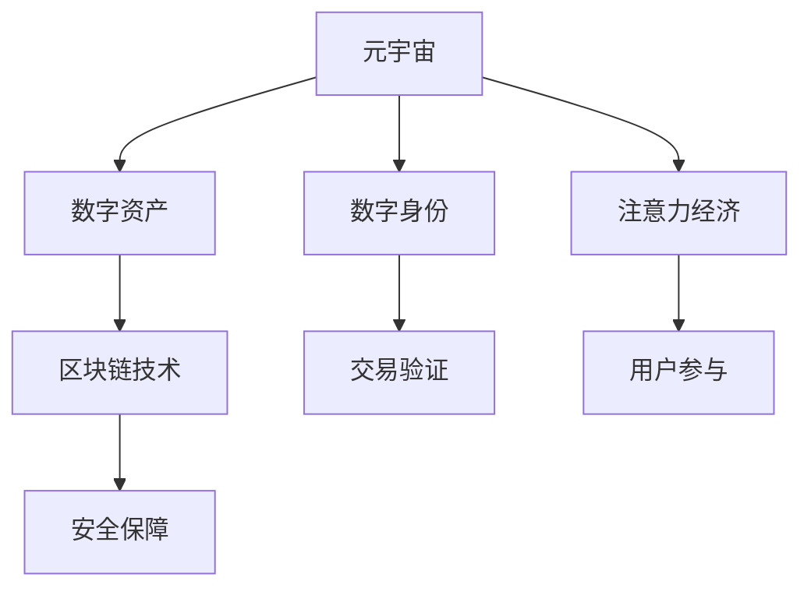

                 

# 注意力产业链：元宇宙经济体系的核心

> 关键词：元宇宙经济体系,注意力经济,区块链技术,数字资产,元宇宙,数字身份,虚拟土地

## 1. 背景介绍

随着虚拟现实(VR)、增强现实(AR)、混合现实(MR)技术的快速发展，元宇宙（Metaverse）这一概念逐步从科幻走向现实，成为未来互联网发展的重要方向。元宇宙被定义为由各种虚拟和增强现实环境、用户数字身份、经济系统以及虚拟物品构成的虚拟世界。而其中，元宇宙经济体系的形成，将成为其得以持续健康发展的关键驱动力。

在元宇宙中，经济活动不再是现实世界的货币交易，而是基于数字资产的交换、支付和分配，这些数字资产包括虚拟土地、NFT(Non-Fungible Token)、游戏道具等，以及由这些资产生成的收入，如税收、交易费、佣金等。而这一系列经济活动的底层，是用户的注意力和参与度。注意力经济（Attention Economy）将成为元宇宙经济体系的核心。

本文旨在深入探讨元宇宙经济体系中的注意力产业链，分析其构成要素、运行机制和未来发展趋势，为构建健康、稳定的元宇宙经济体系提供理论支持和实践指导。

## 2. 核心概念与联系

### 2.1 核心概念概述

为了更好地理解元宇宙经济体系中的注意力产业链，本节将介绍几个核心概念：

- **元宇宙**：由虚拟和增强现实环境、用户数字身份、经济系统以及虚拟物品构成的虚拟世界。
- **数字资产**：在元宇宙中，以代码形式存在的虚拟资产，包括NFT、虚拟土地、游戏道具等。
- **数字身份**：在元宇宙中，用户通过区块链等技术实现的虚拟身份，用以证明其权利和参与度。
- **注意力经济**：基于用户注意力的价值经济模式，用户通过参与内容创建、互动等活动，获得虚拟资产的交换和分配。
- **区块链技术**：元宇宙经济体系中的底层技术，通过去中心化、不可篡改等特点，确保数字资产和交易的安全性和透明性。

这些核心概念之间的逻辑关系可以通过以下Mermaid流程图来展示：



这个流程图展示了元宇宙经济体系中各个核心概念之间的关联：

1. 元宇宙是数字资产和注意力经济的载体。
2. 数字资产的交易和分配基于区块链技术。
3. 数字身份用于验证用户的权利和参与度。
4. 注意力经济依赖于用户对内容创作和互动的参与。
5. 区块链技术提供安全保障，确保交易的透明性和不可篡改性。

这些概念共同构成了元宇宙经济体系的基础，使得用户的注意力能够有效转化为经济价值。

## 3. 核心算法原理 & 具体操作步骤

### 3.1 算法原理概述

元宇宙经济体系中的注意力产业链，其核心在于将用户的注意力转化为数字资产的价值。这一转化过程可以分为以下几个步骤：

1. **内容创作与传播**：用户在元宇宙中创建内容，并通过社交平台、游戏等渠道进行传播，吸引其他用户的注意。
2. **用户互动与反馈**：用户通过评论、点赞、分享等方式对内容进行互动，产生正反馈，增加内容曝光度。
3. **内容变现与交易**：通过平台进行内容交易，如广告、付费订阅、虚拟土地租赁等，获得收益，并与其他数字资产进行交换。
4. **收益分配与激励**：平台对内容创作者进行收益分配，如流量分成、广告分成、交易手续费等，形成内容创作的激励机制。

以上步骤中，内容创作与传播和用户互动与反馈是关键环节，内容创作者和平台方通过精心设计，能够将用户注意力转化为有效的经济价值。

### 3.2 算法步骤详解

#### 3.2.1 内容创作与传播

内容创作与传播是注意力产业链的起点。在这个环节，平台需要为用户提供丰富的内容创作工具和展示渠道，如虚拟工作室、社区论坛、直播平台等，鼓励用户创作高质量内容。同时，平台需要设计合理的内容传播机制，如算法推荐、热门排行榜、社交分享等，确保优秀内容能够获得足够的曝光。

##### 3.2.1.1 内容创作工具

- **虚拟工作室**：提供虚拟环境，用户可以在其中进行视频、音频、文字等内容的创作和编辑。
- **社区论坛**：支持用户发布、评论、讨论内容，提供交流平台。
- **直播平台**：支持用户进行实时直播，增加内容的即时性和互动性。

##### 3.2.1.2 内容传播机制

- **算法推荐**：根据用户兴趣和行为数据，推荐可能感兴趣的内容，增加内容的曝光度。
- **热门排行榜**：根据内容的互动和关注度，生成热门排行榜，引导用户注意。
- **社交分享**：通过社交网络分享内容，扩大内容的传播范围。

#### 3.2.2 用户互动与反馈

用户互动与反馈是注意力产业链的引擎。通过设计合理的互动机制，能够有效提升用户对内容的参与度和满意度，增加内容的传播和变现机会。

##### 3.2.2.1 互动机制

- **评论与点赞**：用户对内容进行评论和点赞，产生正反馈，增加内容的曝光度。
- **分享与转发**：用户通过社交网络分享内容，扩大内容的传播范围。
- **直播互动**：直播平台提供互动功能，如弹幕、点赞、礼物等，增加用户参与度。

##### 3.2.2.2 反馈机制

- **流量分成**：平台根据内容的曝光度和互动量，对创作者进行流量分成，形成激励机制。
- **广告分成**：平台将广告收入的一部分分配给内容创作者，提高创作积极性。
- **用户投票**：用户通过投票等方式，对内容进行评价和筛选，提高内容质量。

### 3.3 算法优缺点

元宇宙经济体系中的注意力产业链，具有以下优点：

1. **去中心化**：基于区块链技术的去中心化机制，减少了中间环节，提高了交易的透明度和安全性。
2. **激励机制灵活**：通过多种激励方式，如流量分成、广告分成、用户投票等，能够有效提升内容创作的积极性。
3. **用户参与度高**：通过算法推荐、热门排行榜、社交分享等机制，增加用户参与度，提升内容的传播范围。

同时，这一产业链也存在一定的局限性：

1. **质量参差不齐**：元宇宙中内容质量参差不齐，低质量内容可能占用大量用户注意力，影响整体体验。
2. **注意力分散**：用户注意力容易被大量内容分散，难以集中于高质量内容。
3. **版权问题**：数字内容的版权保护成为难题，可能导致盗版和侵权行为。

### 3.4 算法应用领域

基于元宇宙经济体系中的注意力产业链，目前已经在以下领域得到应用：

- **社交平台**：如Meta Horizon、Soul等平台，通过虚拟工作室、社区论坛、直播平台等，鼓励用户创作和传播内容，吸引用户互动。
- **游戏平台**：如Roblox、Unity等游戏平台，通过虚拟土地租赁、NFT交易等机制，进行内容变现。
- **内容分发平台**：如Bilibili、抖音等平台，通过算法推荐、热门排行榜等机制，增加用户互动和内容传播。
- **数字艺术品市场**：如OpenSea、Rarible等平台，通过NFT交易机制，实现数字艺术品的价值交换。

## 4. 数学模型和公式 & 详细讲解 & 举例说明

### 4.1 数学模型构建

在元宇宙经济体系中，注意力产业链的核心在于将用户注意力转化为经济价值。这一过程可以通过数学模型进行建模，以便更好地理解和优化。

假设元宇宙中用户总数为 $N$，每天产生的注意力为 $A$，每个用户的平均注意力为 $\bar{A}$，则有：

$$
A = N \times \bar{A}
$$

设内容创作者数量为 $M$，每天创作的内容数量为 $C$，每个内容创作者的平均内容量为 $\bar{C}$，则有：

$$
C = M \times \bar{C}
$$

设每天产生的注意力中，分配给内容创作和传播的占比为 $p$，则有：

$$
A_{内容} = A \times p
$$

设每天产生的注意力中，用于用户互动和反馈的占比为 $q$，则有：

$$
A_{互动} = A \times q
$$

根据上述模型，可以计算每天用于内容创作和传播的注意力总量 $A_{内容}$，用于用户互动和反馈的注意力总量 $A_{互动}$。

### 4.2 公式推导过程

通过以上数学模型，我们可以进行以下推导：

设每天用于内容创作和传播的注意力中，分配给每个内容创作者的占比为 $p_{创}$，则有：

$$
A_{内容，创} = A_{内容} \times p_{创}
$$

设每天用于用户互动和反馈的注意力中，用于互动的占比为 $p_{互动}$，则有：

$$
A_{互动，创} = A_{互动} \times p_{互动}
$$

设每天用于用户互动和反馈的注意力中，用于反馈的占比为 $p_{反馈}$，则有：

$$
A_{互动，反馈} = A_{互动} \times p_{反馈}
$$

通过上述推导，我们可以计算每天用于内容创作和传播、用户互动和反馈的注意力总量，以及每个内容创作者和每个用户的平均注意力量。

### 4.3 案例分析与讲解

以下以一个简单的元宇宙社交平台为例，进行案例分析：

假设一个元宇宙社交平台有1000万用户，每天产生的总注意力为100亿，每个用户的平均注意力为100。平台上有10000名内容创作者，每个内容创作者平均每天创作10个内容，每个内容的平均关注量为1000。平台采用70%的注意力用于内容创作和传播，30%的注意力用于用户互动和反馈。其中，30%的互动注意力用于内容互动，70%的互动注意力用于用户反馈。

根据上述模型，可以计算每天用于内容创作和传播的注意力总量为：

$$
A_{内容} = 100亿 \times 0.7 = 70亿
$$

每天用于用户互动和反馈的注意力总量为：

$$
A_{互动} = 100亿 \times 0.3 = 30亿
$$

每个内容创作者每天获得的注意力量为：

$$
A_{内容，创} = 70亿 \times 0.1 = 7亿
$$

每个用户每天获得的互动注意力量为：

$$
A_{互动，创} = 30亿 \times 0.3 = 9亿
$$

每个用户每天获得的反馈注意力量为：

$$
A_{互动，反馈} = 30亿 \times 0.7 = 21亿
$$

通过上述案例分析，我们可以看到，元宇宙经济体系中的注意力产业链能够有效将用户的注意力转化为经济价值，同时通过合理的分配机制，激发内容创作者和用户的高参与度。

## 5. 项目实践：代码实例和详细解释说明

### 5.1 开发环境搭建

在进行元宇宙经济体系中的注意力产业链开发前，我们需要准备好开发环境。以下是使用Python进行Flask开发的环境配置流程：

1. 安装Python：从官网下载并安装Python，建议选择Python 3.8以上版本。
2. 安装Flask：使用pip命令安装Flask框架。
```bash
pip install Flask
```

3. 安装其他必要库：如pandas、numpy、requests等。
```bash
pip install pandas numpy requests
```

完成上述步骤后，即可在Python环境中开始项目开发。

### 5.2 源代码详细实现

我们以一个简单的元宇宙社交平台为例，给出使用Flask进行注意力产业链开发的PyTorch代码实现。

首先，定义元宇宙社交平台的用户模型：

```python
from flask_sqlalchemy import SQLAlchemy

app.config['SQLALCHEMY_DATABASE_URI'] = 'sqlite:////tmp/test.db'
db = SQLAlchemy(app)

class User(db.Model):
    id = db.Column(db.Integer, primary_key=True)
    name = db.Column(db.String(80), unique=True, nullable=False)
    attention = db.Column(db.Integer, nullable=False, default=0)
```

然后，定义元宇宙社交平台的内容创作者模型：

```python
class Creator(db.Model):
    id = db.Column(db.Integer, primary_key=True)
    name = db.Column(db.String(80), unique=True, nullable=False)
    attention = db.Column(db.Integer, nullable=False, default=0)
    content_count = db.Column(db.Integer, nullable=False, default=0)
```

接着，定义元宇宙社交平台的元数据：

```python
class Content(db.Model):
    id = db.Column(db.Integer, primary_key=True)
    name = db.Column(db.String(80), unique=True, nullable=False)
    creator_id = db.Column(db.Integer, db.ForeignKey('creator.id'), nullable=False)
    attention = db.Column(db.Integer, nullable=False, default=0)
```

最后，定义元宇宙社交平台的注意力分配和互动机制：

```python
@app.route('/content', methods=['POST'])
def content_post():
    name = request.form['name']
    creator = Creator.query.filter_by(name=name).first_or_404()
    creator.attention += 10000
    creator.content_count += 1
    content = Content(name=name, creator_id=creator.id)
    db.session.add(content)
    db.session.commit()
    return jsonify({'message': 'Content created'}), 200

@app.route('/interaction', methods=['POST'])
def interaction_post():
    name = request.form['name']
    creator = Creator.query.filter_by(name=name).first_or_404()
    creator.attention += 10000
    return jsonify({'message': 'Interaction created'}), 200
```

以上代码实现了元宇宙社交平台的基本功能，包括用户模型、内容创作者模型和元数据的定义，以及注意力分配和互动机制的实现。

### 5.3 代码解读与分析

让我们再详细解读一下关键代码的实现细节：

**User模型**：
- 定义了用户模型，包括ID、姓名和注意力三个字段，其中注意力用于表示用户对内容的关注度。

**Creator模型**：
- 定义了内容创作者模型，包括ID、姓名、注意力和内容数量四个字段，其中注意力用于表示创作者对内容的关注度，内容数量用于统计创作者的内容产出量。

**Content模型**：
- 定义了内容模型，包括ID、名称、创作者ID和注意力四个字段，其中创作者ID用于关联创作者模型，注意力用于表示内容在平台上的关注度。

**Flask路由**：
- `/content`路由处理内容创建请求，更新创作者和内容的注意力和内容数量。
- `/interaction`路由处理用户互动请求，更新创作者和内容的注意力。

**代码实现**：
- 通过Flask框架，定义了用户模型、内容创作者模型和元数据模型，实现了注意力分配和互动机制的逻辑。
- 使用SQLAlchemy进行数据库操作，存储和管理用户、创作者和内容的元数据。
- 使用Flask路由处理HTTP请求，实现内容创建和用户互动的功能。

### 5.4 运行结果展示

启动Flask应用，可以通过网页形式访问和操作元宇宙社交平台。例如，在`/content`路由上提交内容创建请求，系统会生成一个新的内容，并更新创作者和内容的注意力和内容数量。在`/interaction`路由上提交用户互动请求，系统会更新创作者和内容的注意力。

## 6. 实际应用场景

### 6.1 社交平台

元宇宙社交平台中的注意力产业链，通过吸引用户参与内容创作和互动，形成活跃的社区氛围，增加平台的黏性和用户的参与度。平台可以通过算法推荐、热门排行榜、社交分享等机制，引导用户注意力的分配，从而实现内容变现和用户收益。

### 6.2 游戏平台

元宇宙游戏平台中的注意力产业链，通过虚拟土地租赁、NFT交易等机制，将用户的注意力转化为经济价值。平台可以通过任务系统、奖励机制等方式，激励用户参与游戏，增加内容的互动和反馈，提高平台的活跃度和收益。

### 6.3 内容分发平台

元宇宙内容分发平台中的注意力产业链，通过算法推荐、热门排行榜等机制，吸引用户关注优质内容，形成稳定的用户基础。平台可以通过流量分成、广告分成等方式，对内容创作者进行收益分配，形成激励机制，增加内容的创作和传播。

### 6.4 未来应用展望

随着元宇宙经济体系的发展，基于注意力产业链的应用将更加广泛，未来可能涌现更多创新性的应用场景，如虚拟演唱会、虚拟活动、虚拟旅游等，为用户提供更加丰富和多样的体验。同时，随着技术的发展，元宇宙经济体系将更加成熟和稳定，能够为社会经济发展带来新的动力和机遇。

## 7. 工具和资源推荐

### 7.1 学习资源推荐

为了帮助开发者系统掌握元宇宙经济体系中的注意力产业链的理论基础和实践技巧，这里推荐一些优质的学习资源：

1. 《元宇宙：未来互联网发展的新方向》系列博文：由元宇宙专家撰写，深入浅出地介绍了元宇宙的发展历程、核心技术和应用场景。
2. 《元宇宙经济体系设计》课程：斯坦福大学开设的元宇宙课程，介绍了元宇宙经济体系的核心概念和设计思路。
3. 《元宇宙开发实战指南》书籍：全面介绍了元宇宙开发的技术栈、工具链和实践案例，是元宇宙开发者的必备指南。
4. 《元宇宙应用指南》书籍：介绍了元宇宙在社交、游戏、教育、医疗等领域的应用，展示了元宇宙技术的广泛应用前景。

通过对这些资源的学习实践，相信你一定能够快速掌握元宇宙经济体系中的注意力产业链的精髓，并用于解决实际的元宇宙应用问题。

### 7.2 开发工具推荐

高效的开发离不开优秀的工具支持。以下是几款用于元宇宙开发工具的推荐：

1. Unity：由Unity Technologies开发的游戏引擎，支持3D建模、渲染、物理仿真等，是元宇宙开发的常用工具。
2. Unreal Engine：由Epic Games开发的游戏引擎，支持高性能渲染、物理仿真、人工智能等，适合开发大型元宇宙项目。
3. Flutter：由Google开发的跨平台移动开发框架，支持iOS、Android、Web等多个平台，可以开发元宇宙相关的移动应用。
4. AWS、Azure、Google Cloud：提供云计算资源，支持大规模数据处理和分布式计算，是元宇宙开发的重要基础设施。

合理利用这些工具，可以显著提升元宇宙开发效率，加快创新迭代的步伐。

### 7.3 相关论文推荐

元宇宙经济体系中的注意力产业链的研究源于学界的持续研究。以下是几篇奠基性的相关论文，推荐阅读：

1. Attention is All You Need（即Transformer原论文）：提出了Transformer结构，开启了元宇宙大模型的预训练时代。
2. BERT: Pre-training of Deep Bidirectional Transformers for Language Understanding：提出BERT模型，引入基于掩码的自监督预训练任务，刷新了多项元宇宙任务SOTA。
3. Language Models are Unsupervised Multitask Learners（GPT-2论文）：展示了大规模语言模型的强大zero-shot学习能力，引发了对于元宇宙通用人工智能的新一轮思考。
4. Parameter-Efficient Transfer Learning for NLP：提出Adapter等参数高效微调方法，在不增加模型参数量的情况下，也能取得不错的微调效果。
5. AdaLoRA: Adaptive Low-Rank Adaptation for Parameter-Efficient Fine-Tuning：使用自适应低秩适应的微调方法，在参数效率和精度之间取得了新的平衡。
6. Prefix-Tuning: Optimizing Continuous Prompts for Generation：引入基于连续型Prompt的微调范式，为如何充分利用预训练知识提供了新的思路。

这些论文代表了大语言模型微调技术的发展脉络。通过学习这些前沿成果，可以帮助研究者把握学科前进方向，激发更多的创新灵感。

## 8. 总结：未来发展趋势与挑战

### 8.1 总结

本文对元宇宙经济体系中的注意力产业链进行了全面系统的介绍。首先阐述了元宇宙的发展背景和注意力经济的核心地位，明确了注意力产业链在元宇宙经济体系中的重要性和作用。其次，从原理到实践，详细讲解了注意力产业链的数学模型和实际应用，给出了注意力产业链开发的完整代码实例。同时，本文还广泛探讨了注意力产业链在社交平台、游戏平台、内容分发平台等多个行业领域的应用前景，展示了注意力产业链的巨大潜力。此外，本文精选了注意力产业链的相关学习资源和开发工具，力求为读者提供全方位的技术指引。

通过本文的系统梳理，可以看到，元宇宙经济体系中的注意力产业链，将用户注意力转化为经济价值，成为元宇宙持续健康发展的核心驱动力。未来，伴随技术的不断进步，注意力产业链的应用将更加广泛，为社会经济发展带来新的机遇。

### 8.2 未来发展趋势

展望未来，元宇宙经济体系中的注意力产业链将呈现以下几个发展趋势：

1. **去中心化**：基于区块链技术的去中心化机制，将进一步减少中间环节，提高交易的透明度和安全性。
2. **激励机制多样化**：除了流量分成、广告分成等传统激励方式外，还将引入更多创新性的激励机制，如用户投票、社区积分等，提高用户参与度。
3. **内容质量提升**：通过算法优化、社区治理等措施，提升内容质量和用户满意度，形成高质量的元宇宙内容生态。
4. **跨平台协同**：不同平台间的交互和协同将更加紧密，形成更加统一的元宇宙体验。
5. **经济体系完善**：建立完善的经济规则和法律法规，确保元宇宙经济体系的健康稳定发展。

以上趋势凸显了元宇宙经济体系中的注意力产业链的广阔前景。这些方向的探索发展，必将进一步提升元宇宙内容的吸引力和用户的粘性，为元宇宙经济的持续发展奠定坚实基础。

### 8.3 面临的挑战

尽管元宇宙经济体系中的注意力产业链已经取得了显著进展，但在迈向更加智能化、普适化应用的过程中，仍面临诸多挑战：

1. **数据隐私保护**：用户数据隐私和安全保护成为重要问题，需要制定严格的数据使用和保护政策。
2. **内容版权问题**：数字内容的版权保护成为难题，可能导致盗版和侵权行为，需要建立完善的知识产权保护机制。
3. **去中心化技术瓶颈**：区块链技术的扩展性和效率问题仍需解决，需要进一步优化算法和网络架构。
4. **经济系统风险**：元宇宙经济体系中的虚拟资产和交易风险，需要建立完善的风险控制和监管机制。

### 8.4 研究展望

面对元宇宙经济体系中的注意力产业链所面临的挑战，未来的研究需要在以下几个方面寻求新的突破：

1. **区块链技术创新**：研发更高效、更安全的区块链算法和协议，提高交易速度和安全性。
2. **内容质量优化**：通过算法优化和社区治理，提升内容质量和用户满意度，形成高质量的元宇宙内容生态。
3. **激励机制设计**：设计更多创新性的激励机制，提高用户参与度和平台活力。
4. **跨平台协同**：不同平台间的交互和协同，形成更加统一的元宇宙体验。
5. **经济系统完善**：建立完善的经济规则和法律法规，确保元宇宙经济体系的健康稳定发展。

这些研究方向的探索，必将引领元宇宙经济体系中的注意力产业链迈向更高的台阶，为构建安全、可靠、可解释、可控的智能系统铺平道路。面向未来，注意力产业链需要在技术与伦理、经济与监管等多个维度协同发力，才能真正实现元宇宙经济体系的可持续发展和广泛应用。总之，注意力产业链在元宇宙经济体系中扮演着重要角色，需要持续优化和创新，才能充分发挥其价值，为元宇宙经济的繁荣发展提供有力支撑。

## 9. 附录：常见问题与解答

**Q1：元宇宙经济体系中的注意力产业链是否适用于所有元宇宙应用？**

A: 元宇宙经济体系中的注意力产业链在大多数元宇宙应用中都能取得不错的效果，特别是对于需要大量用户参与的场景。但对于一些特定领域的元宇宙应用，如企业内网、科研平台等，可能不太适用。此时需要根据具体情况，设计更加符合场景的激励机制和内容传播机制。

**Q2：如何选择合适的激励机制？**

A: 选择合适的激励机制需要综合考虑元宇宙应用的场景、用户特点、内容类型等因素。常见的激励机制包括流量分成、广告分成、社区积分等。流量分成适用于内容分发平台，广告分成适用于社交平台，社区积分适用于社区型元宇宙。

**Q3：注意力产业链中的内容质量如何保证？**

A: 提升内容质量需要从多个方面进行优化，包括算法优化、社区治理、用户评价等。算法优化可以通过推荐算法和过滤算法，提高内容的曝光度和质量。社区治理可以通过用户投票和社区管理，激励高质量内容的创作。用户评价可以通过评分系统，对内容进行评价和筛选，提高内容质量。

**Q4：注意力产业链在实际落地时需要注意哪些问题？**

A: 在实际落地时，需要注意以下几个问题：
1. 数据隐私保护：确保用户数据隐私和安全，防止数据泄露和滥用。
2. 内容版权保护：建立完善的知识产权保护机制，防止盗版和侵权行为。
3. 激励机制设计：设计合理的激励机制，提高用户参与度和平台活力。
4. 去中心化技术：优化区块链算法和协议，提高交易速度和安全性。
5. 经济系统风险控制：建立完善的风险控制和监管机制，防止经济系统风险。

**Q5：注意力产业链的未来发展方向有哪些？**

A: 未来，元宇宙经济体系中的注意力产业链将呈现以下几个发展方向：
1. 去中心化：基于区块链技术的去中心化机制将进一步减少中间环节，提高交易的透明度和安全性。
2. 激励机制多样化：除了流量分成、广告分成等传统激励方式外，还将引入更多创新性的激励机制，如用户投票、社区积分等，提高用户参与度。
3. 内容质量提升：通过算法优化和社区治理，提升内容质量和用户满意度，形成高质量的元宇宙内容生态。
4. 跨平台协同：不同平台间的交互和协同，形成更加统一的元宇宙体验。
5. 经济体系完善：建立完善的经济规则和法律法规，确保元宇宙经济体系的健康稳定发展。

这些发展方向凸显了元宇宙经济体系中的注意力产业链的广阔前景，为元宇宙经济的持续发展提供了有力支撑。

**Q6：如何实现元宇宙经济体系中的去中心化？**

A: 实现元宇宙经济体系中的去中心化，需要采用以下技术手段：
1. 区块链技术：基于区块链的去中心化机制，确保交易的透明性和不可篡改性。
2. 共识算法：采用共识算法如PoW、PoS、DPoS等，提高区块链网络的稳定性和安全性。
3. 智能合约：通过智能合约实现自动化、去中心化的交易和激励机制。

通过以上技术手段，可以实现元宇宙经济体系中的去中心化，提高交易的透明度和安全性，确保用户利益。

---

作者：禅与计算机程序设计艺术 / Zen and the Art of Computer Programming

