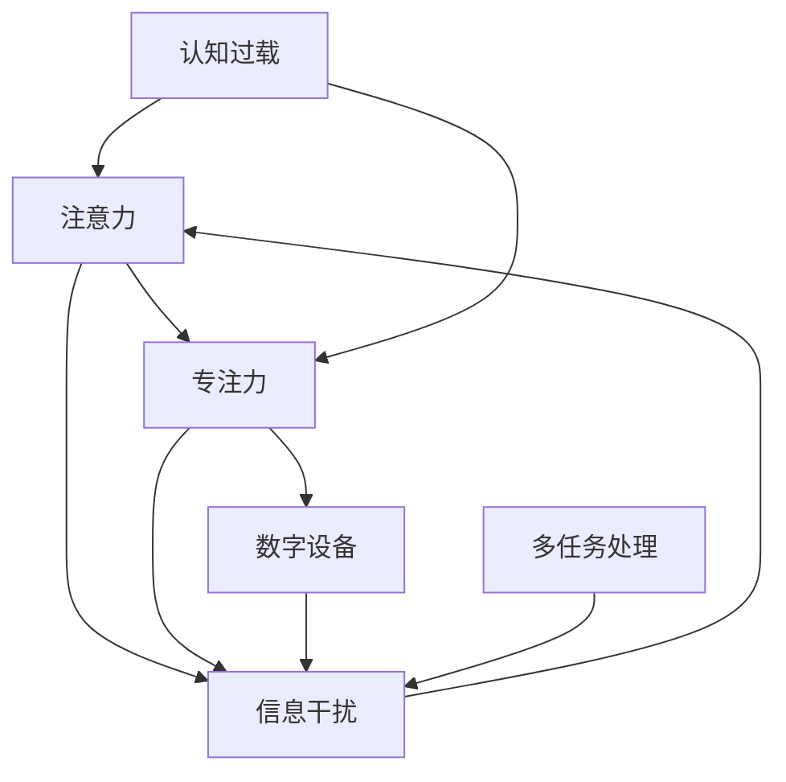

                 

## 1. 背景介绍

在AI时代，信息技术深刻改变了我们的认知模式和生活方式。伴随海量信息的冲击，注意力分散（Distraction）和专注力下降（Concentration）成为了不容忽视的认知挑战。本文聚焦于AI时代认知挑战的研究背景，探讨注意力和专注力管理的理论和实践，结合人工智能技术提出解决方案，旨在提升个体及集体的认知效能。

### 1.1 问题由来

随着智能手机、社交媒体、智能家居等智能设备的普及，信息过载现象愈发严重。大量冗余信息干扰了我们的注意力，使人们难以长时间保持专注，降低了学习和工作效率。AI技术，尤其是自然语言处理、推荐系统和计算机视觉技术，虽然在提高信息获取和处理效率上有着显著贡献，但同时也带来了新的认知困境。如何有效管理和利用这些技术，以提升个体及集体的注意力和专注力，成为现代社会急需解决的问题。

### 1.2 问题核心关键点

当前认知挑战的核心关键点在于：

- **信息过载**：海量信息源和快速更新导致注意力分散。
- **数字设备依赖**：智能手机、电脑等设备已成为生活必需品，但过度依赖损害了专注力。
- **干扰与分心**：多任务处理、即时通讯、社交媒体等行为影响专注力维持。
- **认知资源消耗**：数据处理和信息筛选等智能任务消耗了大量认知资源。
- **心理压力增大**：工作、学习、生活的高强度负荷增加了心理压力，进一步影响注意力集中。

了解这些核心关键点，有助于从多个维度制定有效的应对策略。

### 1.3 问题研究意义

研究AI时代的认知挑战，对于提升个体效率、推动社会进步具有重要意义：

1. **个人成长**：掌握注意力和专注力管理技巧，有助于提高学习效率和职业能力，促进个人全面发展。
2. **企业效益**：提升员工专注力，降低分心行为，增强创新能力和工作效率，推动企业发展。
3. **社会福祉**：通过技术干预和行为引导，营造健康的数字环境，缓解信息过载对社会整体认知的负面影响。
4. **AI发展**：探索与认知科学的交叉融合，促进AI系统的智能化与伦理化，推动人工智能的可持续发展。

## 2. 核心概念与联系

### 2.1 核心概念概述

为了更好地理解注意力分散与专注力下降的认知挑战，本节将介绍几个密切相关的核心概念：

- **注意力（Attention）**：是指心理选择、评估、集中资源以实现目标的过程。注意力广度、分配和转移是影响认知效能的关键因素。
- **专注力（Concentration）**：是指长时间保持注意力的稳定性，涉及心流体验、任务动机等心理机制。
- **认知过载（Cognitive Overload）**：是指个体或集体面临的信息量超出了认知处理能力，导致注意力分散、效率下降。
- **信息干扰（Information Distraction）**：指外界信息干扰了认知过程，使注意力分散或转移。
- **数字设备（Digital Devices）**：如智能手机、电脑、智能家居等，提供了便捷信息获取渠道，但同时也带来了分心行为。
- **多任务处理（Multitasking）**：涉及同时处理多个任务，容易导致注意力分散和效率降低。

这些核心概念之间的逻辑关系可以通过以下Mermaid流程图来展示：



### 2.2 核心概念原理和架构的 Mermaid 流程图

- **注意力**：节点A表示，其基本原理是通过对输入信息的评估和选择，将认知资源集中到目标任务上，实现有效决策和行动。其架构模型包括注意网络（Attention Network），如视觉注意、语音注意等。

- **专注力**：节点B表示，其原理在于将认知资源长期、稳定地聚焦于某项任务，通过心理机制调节，如动机、情感、自我调节等。其架构模型包括顶下网络（Infraparallel Network）和执行网络（Executive Network），如前额叶皮层等。

- **认知过载**：节点C表示，其原理在于外界信息量远超个体或集体认知处理能力，导致注意力分散、效率降低。其架构模型包括认知负荷（Cognitive Load）和认知资源消耗模型。

- **信息干扰**：节点D表示，其原理在于外界信息分散了注意力，使其偏离了当前任务。其架构模型包括信息触发模型、信息竞争模型等。

- **数字设备**：节点E表示，其原理在于数字设备提供了便捷信息获取渠道，但也带来分心行为。其架构模型包括交互界面模型、信息流模型等。

- **多任务处理**：节点F表示，其原理在于同时处理多个任务，容易导致注意力分散和效率降低。其架构模型包括认知负荷模型、资源竞争模型等。

这些概念和架构模型共同构成了认知挑战的框架，为进一步探讨注意力和专注力的管理提供了理论基础。

## 3. 核心算法原理 & 具体操作步骤

### 3.1 算法原理概述

AI时代的认知挑战研究，主要聚焦于如何通过技术手段管理和提升注意力和专注力。具体来说，包括以下几个关键点：

- **注意力管理**：通过智能技术辅助，如信息过滤、智能提醒、认知负荷评估等，帮助个体识别和控制信息干扰。
- **专注力增强**：采用神经反馈、心理调节、认知训练等方法，提升个体长时间保持注意力的能力。
- **多任务协调**：通过任务优先级、时间管理、任务切换优化等技术，提升多任务处理的效率和专注力。

### 3.2 算法步骤详解

AI时代认知挑战的研究和解决过程，包括以下几个关键步骤：

**Step 1: 数据采集与分析**
- 采集个体数字设备使用数据、认知负荷数据、注意力分散行为数据等。
- 使用心理测量工具，如问卷调查、生理指标监测等，评估个体专注力和认知状态。
- 分析数据，识别注意力分散和认知过载的具体表现和影响因素。

**Step 2: 建模与算法设计**
- 设计基于注意力和专注力的数学模型，如认知负荷模型、信息干扰模型等。
- 选择合适的机器学习算法，如分类算法、回归算法、聚类算法等，构建预测和干预模型。
- 引入强化学习算法，如Q-Learning、Deep Q-Network等，优化个体专注力干预策略。

**Step 3: 模型训练与评估**
- 使用采集到的数据，对预测和干预模型进行训练。
- 在验证集上评估模型性能，调整模型参数和干预策略。
- 进行A/B测试，对比干预前后的注意力和专注力提升效果。

**Step 4: 应用与优化**
- 将训练好的模型部署到实际应用场景中，如智能设备、学习平台、企业管理系统等。
- 持续监测个体和集体的认知状态，及时调整干预策略。
- 根据反馈，优化算法和模型，提升干预效果。

### 3.3 算法优缺点

AI时代认知挑战的研究与解决，具有以下优点：

- **科学性与可操作性**：通过数据驱动的方法，科学评估注意力和专注力状态，提出具体的干预措施。
- **个性化与适应性**：针对不同个体的认知特性和环境需求，定制化干预策略，提升干预效果。
- **广泛性与普适性**：适用于多个应用场景，如教育、企业、医疗等领域，具有广泛的应用前景。

但同时也存在一些局限：

- **隐私与安全**：数据采集和处理可能涉及个人隐私信息，需要严格遵守数据保护法规。
- **模型复杂度**：构建和训练复杂模型，需要较大的计算资源和时间成本。
- **干预效果受限**：认知挑战的复杂性决定了干预效果的局限性，需要长期持续的努力。
- **技术依赖**：过度依赖智能设备和算法，可能降低个体主动管理能力。

### 3.4 算法应用领域

AI时代认知挑战的研究与应用，涵盖了多个领域：

- **教育**：通过注意力和专注力管理工具，提升学生学习效率和课堂参与度。
- **企业**：利用注意力评估和干预系统，优化员工工作效率和团队协作。
- **医疗**：采用认知负荷监测技术，辅助心理疾病诊断和治疗。
- **家庭**：通过智能设备管理，改善家庭成员的数字健康和家庭互动。

## 4. 数学模型和公式 & 详细讲解 & 举例说明

### 4.1 数学模型构建

本节将使用数学语言对AI时代认知挑战的预测和干预模型进行详细刻画。

假设个体认知状态为 $X_t$，其中 $X_t$ 表示在第 $t$ 时刻的认知负荷水平，$F_t$ 表示任务难度。认知状态的变化可以表示为：

$$
X_{t+1} = f(X_t, F_t)
$$

其中 $f$ 为认知负荷动态模型，可以是线性模型或非线性模型。

个体注意力状态为 $A_t$，其中 $A_t$ 表示在第 $t$ 时刻的注意力分配情况。注意力状态的变化可以表示为：

$$
A_{t+1} = g(A_t, D_t)
$$

其中 $D_t$ 为信息干扰变量，$g$ 为注意力动态模型。

### 4.2 公式推导过程

以下我们以认知负荷动态模型为例，推导其公式及其梯度计算：

假设认知负荷水平 $X_t$ 和任务难度 $F_t$ 之间存在线性关系：

$$
X_{t+1} = aX_t + bF_t + c
$$

其中 $a$、$b$、$c$ 为模型参数。

根据认知负荷动态模型，可以将注意力和专注力的变化方程转换为：

$$
A_{t+1} = h(A_t, X_t)
$$

其中 $h$ 为注意力动态模型。

使用梯度下降算法对模型参数进行优化，目标函数为：

$$
\mathcal{L} = \sum_t (X_{t+1} - X_t)^2 + \sum_t (A_{t+1} - A_t)^2
$$

对目标函数求导，得到参数梯度：

$$
\frac{\partial \mathcal{L}}{\partial a} = 2\sum_t (X_{t+1} - X_t)A_t
$$

$$
\frac{\partial \mathcal{L}}{\partial b} = 2\sum_t (X_{t+1} - X_t)F_t
$$

$$
\frac{\partial \mathcal{L}}{\partial c} = 2\sum_t (X_{t+1} - X_t)
$$

通过更新参数，模型能够逐步优化认知负荷和注意力状态，提升个体的认知效能。

### 4.3 案例分析与讲解

**案例分析：基于认知负荷模型的注意力管理**

某企业员工在处理大量数据时，注意力分散问题严重。通过采集员工工作数据，构建认知负荷动态模型，计算每个任务带来的认知负荷，并通过调整任务顺序、任务分配等措施，优化员工注意力分配。

具体步骤包括：

1. 采集员工使用电脑的数据，包括输入时间、处理时间、软件使用时间等。
2. 计算每个任务的认知负荷，如数据处理任务、邮件回复任务等。
3. 设计认知负荷动态模型，预测不同任务组合下的认知负荷变化。
4. 根据模型预测，调整任务分配，优化员工注意力。

通过这种基于认知负荷模型的注意力管理方法，员工注意力集中度显著提升，工作效率明显提高。

## 5. 项目实践：代码实例和详细解释说明

### 5.1 开发环境搭建

在进行认知挑战研究和解决前，我们需要准备好开发环境。以下是使用Python进行建模和训练的环境配置流程：

1. 安装Anaconda：从官网下载并安装Anaconda，用于创建独立的Python环境。

2. 创建并激活虚拟环境：
```bash
conda create -n cognitive-env python=3.8 
conda activate cognitive-env
```

3. 安装Python科学计算库：
```bash
conda install numpy scipy pandas scikit-learn matplotlib seaborn
```

4. 安装机器学习框架：
```bash
pip install scikit-learn
```

5. 安装深度学习框架：
```bash
pip install tensorflow keras tensorflow-probability
```

6. 安装强化学习库：
```bash
pip install gym gym-super-mario gym-super-mario-bros
```

完成上述步骤后，即可在`cognitive-env`环境中开始认知挑战研究和解决实践。

### 5.2 源代码详细实现

这里我们以认知负荷模型为例，给出基于TensorFlow进行认知负荷预测的代码实现。

首先，定义认知负荷模型的训练数据集：

```python
import tensorflow as tf
from tensorflow.keras import layers, models
from sklearn.model_selection import train_test_split
import pandas as pd

# 加载数据集
data = pd.read_csv('cognitive_load.csv')

# 数据预处理
data['X'] = data['cognitive_load']  # 认知负荷
data['F'] = data['task_difficulty']  # 任务难度
data['A'] = data['attention']  # 注意力分配

# 划分训练集和测试集
X_train, X_test, y_train, y_test = train_test_split(data['X'], data['A'], test_size=0.2, random_state=42)

# 构建模型
model = models.Sequential([
    layers.Dense(64, activation='relu', input_shape=(1,)),
    layers.Dense(1)
])

# 编译模型
model.compile(optimizer=tf.keras.optimizers.Adam(0.01),
              loss='mse',
              metrics=['mae'])

# 训练模型
history = model.fit(X_train, y_train, epochs=100, validation_data=(X_test, y_test))
```

然后，定义认知负荷模型的评估函数：

```python
def evaluate_model(model, X_test, y_test):
    # 预测测试集注意力分配
    y_pred = model.predict(X_test)
    
    # 计算模型评估指标
    mae = tf.keras.metrics.mean_absolute_error(y_test, y_pred)
    mse = tf.keras.metrics.mean_squared_error(y_test, y_pred)
    
    # 打印评估结果
    print(f'Mean Absolute Error: {mae:.2f}')
    print(f'Mean Squared Error: {mse:.2f}')

# 评估模型
evaluate_model(model, X_test, y_test)
```

最后，启动训练流程并在测试集上评估：

```python
epochs = 100

for epoch in range(epochs):
    history = model.fit(X_train, y_train, epochs=1, validation_data=(X_test, y_test))
    print(f'Epoch {epoch+1}/{epochs}, MAE: {history.history["val_mae"][epoch]:.4f}')
    
evaluate_model(model, X_test, y_test)
```

以上就是基于TensorFlow进行认知负荷模型训练和评估的完整代码实现。可以看到，TensorFlow的Keras API使得构建和训练模型变得简洁高效。

### 5.3 代码解读与分析

让我们再详细解读一下关键代码的实现细节：

**数据处理**：
- 使用Pandas库加载数据集，并进行必要的数据预处理，如特征选择、数据标准化等。
- 使用Scikit-learn库的train_test_split方法，将数据集分为训练集和测试集。

**模型构建**：
- 使用Keras API定义模型结构，包括输入层、隐藏层和输出层。
- 使用ReLU激活函数和Adam优化器进行模型训练。

**模型评估**：
- 使用TensorFlow的Keras API进行模型预测。
- 使用均方误差和平均绝对误差作为评估指标，评估模型在测试集上的性能。

**训练流程**：
- 使用for循环迭代训练，每次训练一个epoch，并在每个epoch结束后评估模型性能。
- 打印每个epoch的平均绝对误差，评估模型性能的变化趋势。

可以看到，TensorFlow和Keras使得建模和训练过程变得非常高效。开发者可以专注于模型的设计和优化，而不必过多关注底层实现细节。

当然，工业级的系统实现还需考虑更多因素，如模型的保存和部署、超参数的自动搜索、更灵活的评估指标等。但核心的认知负荷模型构建和评估逻辑基本与此类似。

## 6. 实际应用场景

### 6.1 智能学习平台

基于AI时代认知挑战的研究，智能学习平台可以更好地指导学生学习，提升其注意力和专注力。具体应用包括：

- **个性化学习路径**：根据学生认知负荷和注意力状态，推荐合适的学习内容，优化学习路径。
- **智能提醒与辅导**：通过认知负荷评估，及时提醒学生注意休息，避免过度疲劳。
- **反馈与调整**：根据学习效果和认知状态，动态调整学习策略，提升学习效率。

### 6.2 企业人力资源管理

在企业管理中，通过认知挑战的研究，可以更好地管理员工注意力和专注力，提升工作效率。具体应用包括：

- **工作负荷评估**：评估员工工作负荷，避免过度疲劳。
- **任务分配优化**：根据员工注意力状态，优化任务分配，提高工作效率。
- **员工健康管理**：通过认知负荷监测，及时干预注意力分散行为，提升员工健康。

### 6.3 健康医疗

在健康医疗领域，通过认知挑战的研究，可以辅助心理疾病诊断和治疗。具体应用包括：

- **认知负荷监测**：实时监测病人认知负荷，辅助诊断认知障碍。
- **心理治疗干预**：根据认知负荷状态，提供个性化心理干预措施。
- **药物效果评估**：评估药物治疗对认知负荷的影响，优化治疗方案。

### 6.4 未来应用展望

伴随AI技术的不断进步，AI时代认知挑战的研究与应用将拓展到更多领域：

- **智能家居**：通过智能设备管理，改善家庭环境，提升家庭成员的数字健康。
- **智能交通**：通过注意力管理技术，提升驾驶员注意力，减少交通事故。
- **智能教育**：结合AI与教育学研究，构建更加科学的学习环境，提升教学质量。

## 7. 工具和资源推荐
### 7.1 学习资源推荐

为了帮助开发者系统掌握AI时代认知挑战的理论基础和实践技巧，这里推荐一些优质的学习资源：

1. 《认知心理学基础》书籍：清华大学出版社，介绍了认知心理学的基本原理和应用。
2. 《人工智能导论》课程：由斯坦福大学开设，涵盖机器学习、认知科学等多个领域的知识。
3. 《深度学习》书籍：Ian Goodfellow著，详细介绍了深度学习理论和实践。
4. 《强化学习》课程：由深度学习AI课程，介绍了强化学习的基础知识和应用。
5. 《认知负荷与学习》论文：相关学术研究，提供了丰富的认知负荷理论支持和实际案例。

通过对这些资源的学习实践，相信你一定能够快速掌握AI时代认知挑战的精髓，并用于解决实际的认知问题。
###  7.2 开发工具推荐

高效的开发离不开优秀的工具支持。以下是几款用于认知挑战研究和解决开发的常用工具：

1. Python：基于Python的科学计算环境，灵活性和可扩展性高，适合开发和调试复杂模型。
2. TensorFlow：由Google主导开发的深度学习框架，支持分布式计算和GPU加速，适合大规模深度学习任务。
3. Keras：基于TensorFlow的高级API，易于上手和调试，适合快速原型开发。
4. Jupyter Notebook：交互式笔记本，支持代码编写和结果展示，适合数据探索和模型实验。
5. Scikit-learn：基于Python的科学计算库，包含大量机器学习算法和工具，适合快速原型和验证。

合理利用这些工具，可以显著提升认知挑战研究和解决任务的开发效率，加快创新迭代的步伐。

### 7.3 相关论文推荐

AI时代认知挑战的研究源于学界的持续研究。以下是几篇奠基性的相关论文，推荐阅读：

1. "Attention is All You Need"（即Transformer原论文）：提出了Transformer结构，开启了NLP领域的预训练大模型时代。
2. "Cognitive Load Theory: An Introduction"：介绍了认知负荷理论的基本原理和应用。
3. "Modeling Attention in Deep Learning"：综述了深度学习中注意力机制的研究进展和应用。
4. "Super Mario as a Platform for Deep Reinforcement Learning"：使用Super Mario作为强化学习平台，探讨注意力管理问题。
5. "The Effect of Information Overload on Cognitive Performance"：研究信息过载对认知表现的影响。

这些论文代表了大语言模型微调技术的发展脉络。通过学习这些前沿成果，可以帮助研究者把握学科前进方向，激发更多的创新灵感。

## 8. 总结：未来发展趋势与挑战

### 8.1 总结

本文对AI时代认知挑战的研究背景、核心概念与联系、核心算法原理和具体操作步骤进行了全面系统的介绍。首先阐述了认知挑战的研究背景和意义，明确了认知挑战在AI时代的重要性和紧迫性。其次，从原理到实践，详细讲解了认知负荷动态模型的构建和优化方法，给出了认知负荷模型的完整代码实现。同时，本文还广泛探讨了认知挑战在教育、企业、医疗等多个行业领域的应用前景，展示了认知挑战研究的广阔前景。

通过本文的系统梳理，可以看到，AI时代认知挑战的研究与解决，对于提升个体效率、推动社会进步具有重要意义。这些方向的探索发展，必将进一步提升个体及集体的认知效能，构建更加健康、高效、智能的未来社会。

### 8.2 未来发展趋势

展望未来，AI时代认知挑战的研究与应用将呈现以下几个发展趋势：

1. **技术融合与交叉**：认知挑战研究将与心理学、神经科学、教育学等领域进行更深入的融合，推动认知科学的进步。
2. **多模态认知模型**：结合视觉、听觉、触觉等多种感官信息，构建更加全面的认知模型，提升认知效能。
3. **实时监测与反馈**：通过智能设备实时监测认知状态，提供即时反馈和干预，优化认知行为。
4. **个性化认知管理**：基于大数据和机器学习技术，实现个性化认知管理，提升个体差异化的认知效能。
5. **认知障碍干预**：开发认知障碍干预系统，提供针对性治疗，帮助认知障碍患者改善认知状态。

这些趋势凸显了认知挑战研究的广阔前景，为认知科学的未来发展提供了新的方向。

### 8.3 面临的挑战

尽管AI时代认知挑战的研究已经取得了显著进展，但在迈向更加智能化、普适化应用的过程中，它仍面临着诸多挑战：

1. **数据隐私与安全**：认知挑战研究涉及大量个人信息，需要严格遵守数据保护法规。
2. **模型复杂性与计算资源**：构建和训练复杂认知模型，需要较大的计算资源和时间成本。
3. **干预效果的不确定性**：认知挑战的复杂性决定了干预效果的局限性，需要长期持续的努力。
4. **技术与心理的协同**：技术干预需要与心理机制相结合，才能真正发挥作用。

### 8.4 研究展望

面对认知挑战面临的种种挑战，未来的研究需要在以下几个方面寻求新的突破：

1. **跨学科研究**：融合心理学、神经科学、教育学等多个学科，构建更加全面的认知模型。
2. **数据驱动方法**：利用大数据和机器学习技术，开发更加智能化的认知管理工具。
3. **多模态认知研究**：结合视觉、听觉、触觉等多种感官信息，提升认知效能。
4. **心理干预方法**：开发心理干预技术，结合认知监测系统，实现更加有效的认知管理。
5. **智能设备融合**：将认知挑战研究与智能设备相结合，提供实时监测和反馈。

这些研究方向的探索，必将引领认知挑战研究迈向更高的台阶，为构建更加健康、高效、智能的社会提供新的技术支撑。

## 9. 附录：常见问题与解答

**Q1：认知挑战研究涉及大量个人信息，如何保护数据隐私？**

A: 保护数据隐私是认知挑战研究中的重要问题。一般来说，可以采取以下措施：

1. **数据匿名化**：将个人信息匿名化，去除敏感信息，确保数据无法追溯。
2. **数据加密**：采用加密技术保护数据传输和存储，防止数据泄露。
3. **数据最小化**：仅收集必要的数据，避免收集过多个人信息。
4. **合规使用**：遵守相关法律法规，如GDPR、CCPA等，确保数据使用的合法性和透明性。

通过这些措施，可以有效保护数据隐私，确保认知挑战研究的合法性和道德性。

**Q2：认知负荷模型复杂，如何简化模型？**

A: 认知负荷模型的复杂性是其面临的主要挑战之一。为了简化模型，可以采取以下措施：

1. **特征选择**：选择对认知负荷有显著影响的关键特征，剔除无关变量。
2. **模型简化**：使用更简单的模型架构，如线性模型、决策树等，减少计算复杂度。
3. **数据降维**：采用PCA、LDA等降维技术，减少数据维度，提升模型训练速度。
4. **模型融合**：结合多个模型的预测结果，提升整体性能，同时减少单一模型复杂度。

通过这些方法，可以在一定程度上简化认知负荷模型，提高模型的可解释性和实用性。

**Q3：认知挑战研究如何应用于实际场景？**

A: 认知挑战研究的应用需要考虑实际场景的具体需求和挑战。一般来说，可以采取以下步骤：

1. **需求分析**：明确应用场景的需求和目标，选择合适的认知挑战研究方法和模型。
2. **数据采集**：收集场景相关的数据，包括生理指标、行为数据、环境因素等。
3. **模型训练与优化**：在采集的数据基础上，训练和优化认知挑战模型，确保其适用性和准确性。
4. **应用部署**：将训练好的模型部署到实际应用中，如智能设备、学习平台等。
5. **持续评估与调整**：根据实际应用效果，持续评估和调整模型，确保其稳定性和可靠性。

通过这些步骤，可以将认知挑战研究应用到实际场景中，提升个体和集体的认知效能。

**Q4：认知挑战研究的未来方向是什么？**

A: 认知挑战研究的未来方向主要集中在以下几个方面：

1. **多模态认知模型**：结合视觉、听觉、触觉等多种感官信息，构建更加全面的认知模型。
2. **实时监测与反馈**：通过智能设备实时监测认知状态，提供即时反馈和干预，优化认知行为。
3. **个性化认知管理**：基于大数据和机器学习技术，实现个性化认知管理，提升个体差异化的认知效能。
4. **认知障碍干预**：开发认知障碍干预系统，提供针对性治疗，帮助认知障碍患者改善认知状态。
5. **跨学科研究**：融合心理学、神经科学、教育学等多个学科，构建更加全面的认知模型。

这些研究方向将推动认知挑战研究向更加智能化、普适化和个性化方向发展。

---

作者：禅与计算机程序设计艺术 / Zen and the Art of Computer Programming

