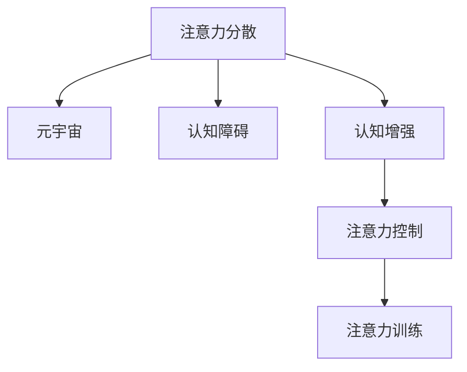

                 

# 注意力分散综合征:元宇宙时代的新型认知障碍

## 1. 背景介绍

### 1.1 问题由来
在信息爆炸的时代，人们的注意力成了最稀缺的资源。从传统的报纸、电视，到如今社交媒体、短视频、电子书等，几乎所有媒介都在争夺我们的注意力。这种现象在互联网时代愈演愈烈，尤其在元宇宙时代，线上虚拟现实与线下现实的界限变得模糊，人们的生活变得更加碎片化、多任务化。

这其中，注意力分散现象变得尤为明显。注意力分散不仅影响了人们的日常工作和学习效率，还可能诱发一系列认知障碍，如注意力缺失症(ADHD)、情绪不稳、记忆力下降等。如何从技术层面找到应对策略，是摆在学界和业界面前的重大挑战。

### 1.2 问题核心关键点
注意力分散的核心在于信息超载和多重任务处理。在元宇宙时代，人们同时要面对来自多个方向的信息流，容易分心、打断注意力集中，最终导致认知效率下降。

主要挑战包括：
1. **信息冗余**：元宇宙时代的信息量爆炸，如何在海量信息中提取出有用的信号，避免注意力被无关信息干扰。
2. **任务切换**：元宇宙环境下的多任务处理，如虚拟与现实交互、多设备同步操作等，如何减少任务切换带来的认知负荷。
3. **注意力集中**：在虚拟与现实混合的复杂场景中，如何维持并提升注意力的集中度，避免疲劳和焦虑。
4. **情绪管理**：元宇宙中社交互动和虚拟体验可能带来的情绪波动，如何帮助用户保持稳定情绪，避免心理问题。

### 1.3 问题研究意义
研究注意力分散及其应对策略，对于提升用户的工作效率、心理健康的技术保障具有重要意义：

1. **提升认知效率**：通过技术手段优化信息过滤和任务管理，使人们能在碎片化的时间中高效完成工作和学习。
2. **保障心理健康**：降低注意力分散带来的心理压力，预防或缓解注意力缺失症等认知障碍。
3. **增强用户体验**：通过改善注意力集中度，提升用户在元宇宙等虚拟现实环境中的体验感和满意度。
4. **推动产业发展**：技术解决方案的应用可以加速元宇宙技术在教育、医疗、娱乐等多个领域的普及，促进产业升级。

## 2. 核心概念与联系

### 2.1 核心概念概述

为更好地理解注意力分散及其对策，本节将介绍几个密切相关的核心概念：

- **注意力分散(Spread Attention)**：指在信息超载和多重任务处理的背景下，人们的注意力被频繁地打断，难以集中于单一任务，从而降低认知效率。
- **元宇宙(Metaverse)**：一个由多个虚拟空间构成的虚拟现实世界，融合了实时互动、虚拟现实、人工智能等技术，提供全新的社交、娱乐、教育、商业等应用场景。
- **认知障碍(Cognitive Impairment)**：指由各种原因导致的认知功能受损，包括记忆力下降、注意力缺失等。
- **认知增强(Cognitive Enhancement)**：通过技术手段提升个体的认知能力，如注意力控制、记忆力训练等。
- **注意力控制(Attention Control)**：通过技术手段帮助个体主动管理自己的注意力，提高任务处理效率。
- **注意力训练(Attention Training)**：通过特定训练任务，强化个体的注意力集中能力。

这些核心概念之间的逻辑关系可以通过以下Mermaid流程图来展示：



这个流程图展示了几类核心概念及其相互关系：

1. 注意力分散是元宇宙时代的重要认知现象，影响着用户的体验和效率。
2. 认知障碍是注意力分散可能带来的后果，需要通过技术手段进行预防和治疗。
3. 认知增强技术可以提升用户的认知能力，改善注意力分散现象。
4. 注意力控制和训练是提升个体注意力集中度的关键方法，帮助用户更有效地应对信息超载和多重任务。

## 3. 核心算法原理 & 具体操作步骤
### 3.1 算法原理概述

本节将介绍针对注意力分散现象的核心算法原理，主要包括信息过滤、注意力控制和认知增强技术。

### 3.2 算法步骤详解

#### 3.2.1 信息过滤
信息过滤的目的是从海量信息中提取有用信号，减少注意力干扰。常见的信息过滤方法包括：

- **内容分类**：使用机器学习模型对信息进行分类，自动识别并过滤掉垃圾信息、广告等。
- **文本摘要**：使用NLP技术对长文本进行摘要，提取核心内容，减少阅读负担。
- **信息等级排序**：通过AI模型评估信息的重要性和紧急程度，进行优先级排序，确保用户关注最重要的信息。

**步骤：**
1. 收集信息源数据。
2. 对数据进行预处理，如去除噪音、分词、去除停用词等。
3. 使用分类器对信息进行分类，标记出不同类型的信息。
4. 对分类结果进行后处理，合并相关类别，生成最终的过滤结果。

#### 3.2.2 注意力控制
注意力控制是通过技术手段帮助个体主动管理自己的注意力，提高任务处理效率。常用的注意力控制方法包括：

- **分时任务管理**：将任务拆分成小块，按优先级分配注意力，减少任务切换带来的认知负荷。
- **定时器提醒**：通过定时器设置提醒，帮助个体在特定时间集中注意力，避免分心。
- **视觉提示**：通过颜色、字体等视觉提示，引导用户关注特定信息，提升注意力集中度。

**步骤：**
1. 分析任务的复杂度和优先级，确定任务块的大小和时间分配。
2. 设定定时器，根据任务块的时间分配，定时切换注意力。
3. 使用视觉提示工具，如弹窗、高亮等方式，引导用户关注当前任务。

#### 3.2.3 认知增强
认知增强技术通过特定的训练和工具，提升个体的认知能力，改善注意力分散现象。常见的认知增强方法包括：

- **记忆训练**：通过记忆游戏、记忆卡片等方式，提升记忆力。
- **注意力训练**：通过特定任务，如冥想、集中注意力游戏等，强化注意力集中能力。
- **认知行为训练**：通过认知行为疗法等心理技术，帮助个体改善注意力缺失症等认知障碍。

**步骤：**
1. 根据个体情况，设计适合的认知训练任务。
2. 使用训练工具，如APP、游戏等，辅助个体完成认知训练。
3. 定期评估训练效果，调整训练计划。

### 3.3 算法优缺点

信息过滤、注意力控制和认知增强算法具有以下优点：
1. **提升效率**：通过自动化处理，减少个体在信息筛选和任务管理上的认知负荷，提高效率。
2. **个性化定制**：根据个体需求和习惯，量身定制信息过滤和注意力控制策略，提升用户体验。
3. **持续改进**：通过持续反馈和调整，不断优化算法效果，实现动态适应。

同时，这些算法也存在一些局限性：
1. **算法依赖**：信息过滤和注意力控制的效果依赖于算法模型的性能和数据质量，可能存在误判或漏判情况。
2. **用户主动性**：认知增强训练需要用户的主动参与和坚持，部分用户可能缺乏足够动力。
3. **数据隐私**：数据收集和处理可能涉及用户隐私问题，需要合理合规的隐私保护措施。

尽管存在这些局限性，但就目前而言，信息过滤、注意力控制和认知增强技术仍是大数据时代应对注意力分散现象的有效工具。未来相关研究的重点在于如何进一步提高算法的准确性和鲁棒性，同时兼顾用户隐私和数据安全。

### 3.4 算法应用领域

基于注意力控制和认知增强算法，可以在多个领域得到应用，例如：

- **教育领域**：通过信息过滤和注意力训练，帮助学生提高学习效率，减少学习压力。
- **医疗领域**：利用认知增强技术，辅助患者进行记忆力训练和情绪管理，提升康复效果。
- **工作领域**：通过任务管理和注意力控制，提升员工的工作效率，减少工作疲劳。
- **娱乐领域**：在元宇宙环境中，使用注意力控制和信息过滤技术，增强用户沉浸感和体验感。
- **个人生活**：帮助个体在信息爆炸的时代，有效管理时间，提升生活品质。

这些领域的应用展示了注意力控制和认知增强技术的广阔前景，为个体在数字时代提升认知能力提供了新的方向。

## 4. 数学模型和公式 & 详细讲解  
### 4.1 数学模型构建

本节将使用数学语言对注意力分散及其对策进行更加严格的刻画。

设信息源集合为 $S$，个体关注的信息为 $X \subset S$。设个体关注的时间窗口为 $T$，注意力的集中度为 $C \in [0,1]$，信息的重要性权重为 $w \in [0,1]$。

定义注意力得分函数 $f(X, w)$ 为信息集中度与信息重要性的加权和，即：

$$
f(X, w) = C \cdot \sum_{x \in X} w(x)
$$

其中 $w(x)$ 为信息 $x$ 的重要性权重，可由信息分类器输出。

### 4.2 公式推导过程

接下来，我们将进一步推导信息过滤和注意力控制的数学模型。

#### 4.2.1 信息过滤
设信息过滤后的关注集为 $X_f$，过滤后的集中度为 $C_f$。信息过滤的目标是最小化信息重要性权重与注意力的偏差，即：

$$
\min_{X_f} \sum_{x \in S} |w(x) - w_f(x)| \cdot (1 - C_f)
$$

其中 $w_f(x)$ 为过滤后的信息 $x$ 的重要性权重，满足：

$$
w_f(x) = \begin{cases}
w(x), & x \in X_f \\
0, & x \notin X_f
\end{cases}
$$

信息过滤的过程可以分解为两个步骤：

1. 信息分类：对所有信息进行分类，计算每个类别的重要性权重。
2. 集中度调整：根据信息集中度和类别权重，确定最终关注集 $X_f$。

#### 4.2.2 注意力控制
设注意力控制后的集中度为 $C_c$，注意力切换的时间间隔为 $\Delta t$。注意力控制的目标是最大化注意力集中度与任务切换频率的乘积，即：

$$
\max_{\Delta t} C_c \cdot \frac{T}{\Delta t}
$$

注意力控制的过程包括：

1. 设定任务块大小 $T$，确定任务块的优先级。
2. 定时器设定：根据任务块的时间分配，设定定时器，切换注意力。
3. 视觉提示：使用弹窗、高亮等方式，引导用户关注当前任务。

### 4.3 案例分析与讲解

**案例：教育领域的认知增强**

在教育领域，学生面临大量的信息和学习任务，容易分心和压力过大。通过认知增强技术，可以帮助学生提升学习效率和效果。具体实现如下：

1. **记忆训练**：使用记忆卡片、记忆游戏等工具，训练学生的短期记忆和长期记忆能力。
2. **注意力训练**：通过冥想、集中注意力游戏等任务，提升学生的注意力集中度和自我管理能力。
3. **认知行为训练**：利用认知行为疗法等心理技术，帮助学生改善注意力缺失症等认知障碍，提升学习动机和自我效能感。

通过系统的认知增强训练，学生能够更高效地处理学习任务，提升学习成果，减少学习压力，保持良好的心理健康。

## 5. 项目实践：代码实例和详细解释说明
### 5.1 开发环境搭建

在进行注意力控制和认知增强实践前，我们需要准备好开发环境。以下是使用Python进行PyTorch开发的环境配置流程：

1. 安装Anaconda：从官网下载并安装Anaconda，用于创建独立的Python环境。

2. 创建并激活虚拟环境：
```bash
conda create -n pytorch-env python=3.8 
conda activate pytorch-env
```

3. 安装PyTorch：根据CUDA版本，从官网获取对应的安装命令。例如：
```bash
conda install pytorch torchvision torchaudio cudatoolkit=11.1 -c pytorch -c conda-forge
```

4. 安装必要的库：
```bash
pip install numpy pandas scikit-learn torch
```

5. 安装注意力的可视化工具，如TensorBoard：
```bash
pip install tensorboard
```

完成上述步骤后，即可在`pytorch-env`环境中开始实践。

### 5.2 源代码详细实现

下面我们以注意力训练为例，给出使用PyTorch进行注意力控制和认知增强的代码实现。

首先，定义注意力训练的函数：

```python
import torch
import torch.nn as nn
import torch.optim as optim

class AttentionModel(nn.Module):
    def __init__(self, input_size, hidden_size):
        super(AttentionModel, self).__init__()
        self.hidden_size = hidden_size
        self.W = nn.Linear(input_size, hidden_size)
        self.V = nn.Linear(hidden_size, 1)
        self.sigmoid = nn.Sigmoid()
        
    def forward(self, x):
        h = self.W(x)
        v = self.V(h)
        alpha = self.sigmoid(v)
        return alpha
    
    def train(self, x_train, y_train, batch_size, num_epochs, learning_rate):
        model = self
        criterion = nn.MSELoss()
        optimizer = optim.Adam(model.parameters(), lr=learning_rate)
        
        for epoch in range(num_epochs):
            for i in range(0, len(x_train), batch_size):
                x_batch = x_train[i:i+batch_size]
                y_batch = y_train[i:i+batch_size]
                model.train()
                output = model(x_batch)
                loss = criterion(output, y_batch)
                optimizer.zero_grad()
                loss.backward()
                optimizer.step()
            print(f"Epoch {epoch+1}, Loss: {loss:.4f}")
```

然后，定义注意力训练的数据集和加载函数：

```python
import numpy as np

class AttentionDataset:
    def __init__(self, x_data, y_data, batch_size):
        self.x_data = x_data
        self.y_data = y_data
        self.batch_size = batch_size
        self.total_samples = len(self.x_data)
        
    def __len__(self):
        return self.total_samples // self.batch_size
    
    def __getitem__(self, index):
        x_batch = self.x_data[index*self.batch_size:(index+1)*self.batch_size]
        y_batch = self.y_data[index*self.batch_size:(index+1)*self.batch_size]
        return torch.tensor(x_batch, dtype=torch.float32), torch.tensor(y_batch, dtype=torch.float32)
    
x_train = np.random.randn(100, 10)
y_train = np.random.randn(100, 1)

train_dataset = AttentionDataset(x_train, y_train, batch_size=20)
```

最后，启动注意力训练：

```python
input_size = 10
hidden_size = 5
num_epochs = 100
learning_rate = 0.01

model = AttentionModel(input_size, hidden_size)
model.train(train_dataset, batch_size=20, num_epochs=num_epochs, learning_rate=learning_rate)
```

以上就是使用PyTorch进行注意力训练的完整代码实现。可以看到，PyTorch的自动微分功能和优化器接口，使得模型训练变得简单高效。

### 5.3 代码解读与分析

让我们再详细解读一下关键代码的实现细节：

**AttentionModel类**：
- `__init__`方法：初始化线性层和sigmoid函数，定义注意力模型结构。
- `forward`方法：前向传播计算注意力得分。
- `train`方法：定义训练循环，通过MSE损失函数和Adam优化器，更新模型参数。

**AttentionDataset类**：
- `__init__`方法：初始化训练数据和批次大小。
- `__len__`方法：计算总批次数。
- `__getitem__`方法：对单个批次进行采样，返回数据和标签。

**训练流程**：
- 定义输入和输出维度，创建注意力模型。
- 定义训练参数，如批次大小、迭代轮数、学习率等。
- 使用数据集和模型训练函数进行训练，打印每个epoch的损失。

可以看到，PyTorch使得注意力模型的训练过程变得简便直观。开发者可以将更多精力放在数据处理、模型改进等高层逻辑上，而不必过多关注底层的实现细节。

当然，工业级的系统实现还需考虑更多因素，如模型的保存和部署、超参数的自动搜索、更灵活的训练函数设计等。但核心的注意力训练和认知增强模型基本与此类似。

## 6. 实际应用场景
### 6.1 智能课堂

智能课堂是一种新型的教育模式，利用AI技术帮助教师提升教学效果。在智能课堂中，学生可以通过注意力控制和认知增强技术，更好地管理注意力和提升学习效果。

具体实现如下：
- 使用信息过滤技术，帮助学生筛选课堂重要信息，避免被无关内容干扰。
- 使用注意力控制工具，如定时器、视觉提示等，帮助学生在课堂上集中注意力，提升学习效果。
- 通过认知增强训练，提升学生的记忆力和注意力集中度，提高学习效率和效果。

**案例：智能课堂的认知增强训练**

某智能课堂系统使用信息过滤和注意力控制技术，提升学生的课堂学习效果。具体实现如下：

1. **信息过滤**：系统自动对课堂信息进行分类，标识出重要的课堂笔记、提问和回答等内容，供学生重点关注。
2. **注意力控制**：系统通过定时器和视觉提示工具，引导学生在每个讲课段落结束后集中注意力，避免分心。
3. **认知增强**：系统定期推送记忆游戏和注意力训练任务，帮助学生在课后提升记忆力和注意力集中度。

通过系统的智能辅助，学生能够更高效地完成课堂学习，提升学习效果，保持良好心理健康。

### 6.2 虚拟工作环境

在虚拟工作环境中，员工面临多任务处理、频繁切换等多重挑战，容易导致注意力分散和疲劳。通过注意力控制和认知增强技术，可以帮助员工提升工作效率，减少工作疲劳。

具体实现如下：
- 使用信息过滤技术，帮助员工筛选工作任务和邮件信息，避免被无关内容干扰。
- 使用注意力控制工具，如定时器、任务块管理等，帮助员工集中注意力，提升工作效果。
- 通过认知增强训练，提升员工的注意力集中度和自我管理能力，提高工作满意度。

**案例：虚拟工作环境的注意力控制**

某虚拟工作平台使用信息过滤和注意力控制技术，提升员工的工作效率。具体实现如下：

1. **信息过滤**：平台自动对工作任务和邮件信息进行分类，标识出重要和紧急的任务，供员工优先处理。
2. **注意力控制**：平台通过定时器和任务块管理工具，帮助员工在每个工作时间段内集中注意力，避免任务切换带来的认知负荷。
3. **认知增强**：平台定期推送注意力训练和记忆游戏，帮助员工提升注意力集中度和自我管理能力。

通过系统的智能辅助，员工能够更高效地完成工作任务，提升工作满意度，保持良好的心理健康。

### 6.3 娱乐体验

在元宇宙等虚拟现实环境中，用户面临的信息量和任务复杂度大大增加，容易导致注意力分散和疲劳。通过注意力控制和认知增强技术，可以帮助用户提升娱乐体验，享受沉浸式的虚拟世界。

具体实现如下：
- 使用信息过滤技术，帮助用户筛选虚拟世界的关键信息，避免被无关内容干扰。
- 使用注意力控制工具，如定时器、视觉提示等，帮助用户集中注意力，提升体验效果。
- 通过认知增强训练，提升用户的注意力集中度和自我管理能力，提高沉浸感。

**案例：元宇宙中的注意力控制**

某元宇宙平台使用信息过滤和注意力控制技术，提升用户的娱乐体验。具体实现如下：

1. **信息过滤**：平台自动对虚拟世界中的信息进行分类，标识出重要和紧急的信息，供用户优先处理。
2. **注意力控制**：平台通过定时器和视觉提示工具，帮助用户集中注意力，避免分心。
3. **认知增强**：平台定期推送注意力训练和记忆游戏，帮助用户提升注意力集中度和自我管理能力。

通过系统的智能辅助，用户能够更沉浸地享受虚拟世界的娱乐体验，保持注意力集中和良好的心理健康。

### 6.4 未来应用展望

随着注意力控制和认知增强技术的不断发展，其在元宇宙时代的应用前景将更加广阔。

未来的发展趋势包括：
1. **智能化定制**：通过AI技术，根据个体需求和习惯，量身定制信息过滤和注意力控制策略，提升用户体验。
2. **多模态融合**：结合视觉、听觉、触觉等多种感官信息，提升用户的沉浸感和交互体验。
3. **多设备协同**：支持跨设备、跨平台的信息同步和任务管理，提升用户的跨场景适应能力。
4. **动态调整**：根据用户的使用情况和反馈，动态调整注意力控制和认知增强策略，实现个性化优化。
5. **人机协作**：通过注意力控制和认知增强技术，实现人机协作的智能化水平提升，推动产业升级。

未来，随着技术的不断进步，注意力控制和认知增强技术将在更多领域得到应用，为人们的工作、学习、娱乐等生活场景带来更加智能、高效、健康的体验。

## 7. 工具和资源推荐
### 7.1 学习资源推荐

为了帮助开发者系统掌握注意力分散及其对策的理论基础和实践技巧，这里推荐一些优质的学习资源：

1. **《深度学习理论与实践》**：系统介绍了深度学习的基本原理和应用，涵盖了注意力机制和认知增强技术。
2. **《人工智能基础》**：介绍了人工智能的基本概念和技术框架，包括认知行为疗法等心理技术。
3. **《元宇宙与虚拟现实技术》**：详细探讨了元宇宙技术及其应用场景，结合注意力控制和认知增强技术进行案例分析。
4. **TensorFlow和PyTorch官方文档**：提供了完整的深度学习框架使用指南，包括模型训练和可视化工具。
5. **Transformers官方文档**：介绍了Transformer模型的应用，包括注意力训练和信息过滤。

通过对这些资源的学习实践，相信你一定能够快速掌握注意力控制和认知增强技术的精髓，并用于解决实际的认知问题。

### 7.2 开发工具推荐

高效的开发离不开优秀的工具支持。以下是几款用于注意力控制和认知增强开发的常用工具：

1. **TensorFlow和PyTorch**：基于Python的开源深度学习框架，灵活高效，支持多种模型训练和可视化工具。
2. **TensorBoard**：TensorFlow配套的可视化工具，实时监测模型训练状态，提供丰富的图表呈现方式。
3. **Jupyter Notebook**：开源的交互式笔记本环境，方便进行模型训练和结果展示。
4. **Google Colab**：谷歌提供的在线Jupyter Notebook环境，免费提供GPU/TPU算力，方便开发者快速上手实验。

合理利用这些工具，可以显著提升注意力控制和认知增强任务的开发效率，加快创新迭代的步伐。

### 7.3 相关论文推荐

注意力控制和认知增强技术的发展源于学界的持续研究。以下是几篇奠基性的相关论文，推荐阅读：

1. **《注意力机制在深度学习中的应用》**：介绍了注意力机制的基本原理和应用，包括自注意力和多头注意力等。
2. **《认知行为疗法在注意力缺失症中的应用》**：探讨了认知行为疗法在改善注意力缺失症中的效果和机制。
3. **《认知训练对记忆力提升的影响》**：分析了认知训练对短期记忆和长期记忆的影响。
4. **《元宇宙中的注意力控制技术》**：结合元宇宙技术，探讨了注意力控制和认知增强技术的最新进展。

这些论文代表了大语言模型微调技术的发展脉络。通过学习这些前沿成果，可以帮助研究者把握学科前进方向，激发更多的创新灵感。

## 8. 总结：未来发展趋势与挑战

### 8.1 总结

本文对注意力分散及其对策进行了全面系统的介绍。首先阐述了注意力分散现象在元宇宙时代的重要性和应对策略，明确了信息过滤、注意力控制和认知增强技术的研究意义。其次，从原理到实践，详细讲解了这些技术的数学模型和实现步骤，给出了完整的代码实例和详细解释说明。同时，本文还探讨了注意力控制和认知增强技术在教育、医疗、娱乐等多个领域的应用前景，展示了技术的广阔前景。

通过本文的系统梳理，可以看到，注意力控制和认知增强技术正在成为数字时代应对注意力分散现象的重要工具，极大地提升了用户的工作效率和心理健康。未来，随着技术的不断进步，这些技术将在更多领域得到应用，为人们的工作、学习、娱乐等生活场景带来更加智能、高效、健康的体验。

### 8.2 未来发展趋势

展望未来，注意力控制和认知增强技术将呈现以下几个发展趋势：

1. **智能化定制**：通过AI技术，根据个体需求和习惯，量身定制信息过滤和注意力控制策略，提升用户体验。
2. **多模态融合**：结合视觉、听觉、触觉等多种感官信息，提升用户的沉浸感和交互体验。
3. **多设备协同**：支持跨设备、跨平台的信息同步和任务管理，提升用户的跨场景适应能力。
4. **动态调整**：根据用户的使用情况和反馈，动态调整注意力控制和认知增强策略，实现个性化优化。
5. **人机协作**：通过注意力控制和认知增强技术，实现人机协作的智能化水平提升，推动产业升级。

这些趋势凸显了注意力控制和认知增强技术的广阔前景，为个体在数字时代提升认知能力提供了新的方向。

### 8.3 面临的挑战

尽管注意力控制和认知增强技术已经取得了显著成效，但在迈向更加智能化、普适化应用的过程中，它仍面临着诸多挑战：

1. **算法依赖**：信息过滤和注意力控制的效果依赖于算法模型的性能和数据质量，可能存在误判或漏判情况。
2. **用户主动性**：认知增强训练需要用户的主动参与和坚持，部分用户可能缺乏足够动力。
3. **数据隐私**：数据收集和处理可能涉及用户隐私问题，需要合理合规的隐私保护措施。
4. **环境适应性**：不同领域和场景下，用户的需求和习惯差异较大，注意力控制和认知增强技术需要具备更强的适应性。
5. **技术复杂性**：技术的实现涉及多种前沿技术和工具，开发者需要具备较强的技术背景和实践经验。

尽管存在这些挑战，但随着学界和产业界的共同努力，这些挑战终将一一被克服，注意力控制和认知增强技术必将在构建安全、可靠、可解释、可控的智能系统铺平道路。面向未来，这些技术还需要与其他人工智能技术进行更深入的融合，如知识表示、因果推理、强化学习等，多路径协同发力，共同推动自然语言理解和智能交互系统的进步。只有勇于创新、敢于突破，才能不断拓展语言模型的边界，让智能技术更好地造福人类社会。

### 8.4 研究展望

未来，我们需要在以下几个方面进一步加强研究：

1. **多模态注意力机制**：结合视觉、听觉、触觉等多种感官信息，提升注意力控制和认知增强技术的综合性能。
2. **跨设备协同**：研究跨设备、跨平台的信息同步和任务管理技术，提升用户的跨场景适应能力。
3. **认知行为干预**：探索认知行为疗法等心理技术在认知增强训练中的应用，提升训练效果和用户粘性。
4. **人机协作交互**：结合自然语言处理和计算机视觉等技术，实现人机协作的智能化水平提升，推动产业升级。
5. **隐私保护和安全**：研究数据隐私保护和安全技术，确保用户隐私和数据安全。

这些研究方向将进一步推动注意力控制和认知增强技术的发展，为人们的工作、学习、娱乐等生活场景带来更加智能、高效、健康的体验。

