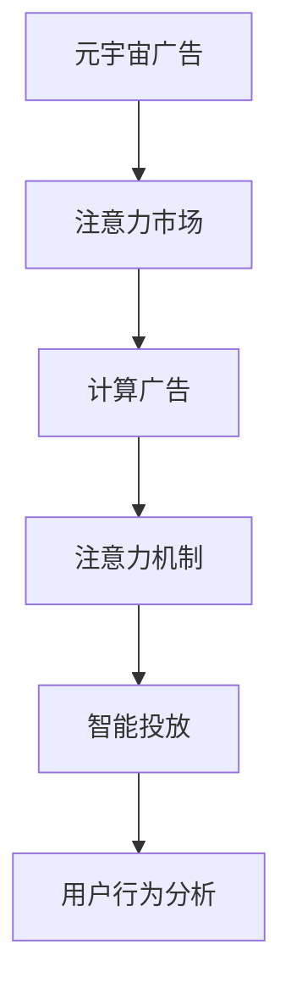

                 

# 注意力市场：元宇宙广告投放的新思路

> 关键词：注意力市场,元宇宙广告,计算广告,注意力机制,智能投放,用户行为分析

## 1. 背景介绍

### 1.1 问题由来

随着元宇宙概念的兴起，数字广告市场也迎来了新的变革。不同于传统互联网广告，元宇宙广告强调沉浸式体验、精准投放和个性化定制。用户的行为和注意力成为了广告投放的核心指标。如何高效地获取、分析和利用用户的注意力，成为了元宇宙广告投放面临的重大挑战。

### 1.2 问题核心关键点

元宇宙广告投放的难点在于：

- 用户注意力难以捕捉。元宇宙中用户的行为复杂多变，实时捕捉用户注意力、分析其兴趣点，具有较大难度。
- 广告投放效果难以评估。传统的点击率、转化率等指标难以在元宇宙中准确衡量，需要引入新的评价指标。
- 广告投放成本高昂。元宇宙广告投放需要投入大量算力进行实时数据分析，同时还需要维护用户隐私和数据安全。

### 1.3 问题研究意义

高效、精准地捕捉和利用用户注意力，能够大幅提升元宇宙广告投放的效果和ROI。其意义不仅在于节约广告预算，还在于构建用户信任、提升品牌影响力。这对于推动元宇宙经济的发展，具有重要价值。

## 2. 核心概念与联系

### 2.1 核心概念概述

为更好地理解元宇宙广告投放，本节将介绍几个关键概念：

- 元宇宙广告（Metaverse Advertising）：在元宇宙空间内，针对虚拟用户进行广告展示的业务模式。
- 注意力市场（Attention Market）：以用户的注意力作为交易对象，通过数据收集和分析，竞价获取广告展示位的市场。
- 计算广告（Computational Advertising）：利用大数据、机器学习等技术，对广告进行自动化投放和优化的过程。
- 注意力机制（Attention Mechanism）：从深度学习领域引入，用于提升模型对关键信息的捕捉和处理能力，核心思想是动态分配计算资源。
- 智能投放（Programmatic Advertising）：通过程序化方式，实现广告的自动化投放和优化，提高投放效率和效果。
- 用户行为分析（User Behavior Analysis）：分析用户在元宇宙中的行为数据，识别其兴趣偏好和行为模式，用于精准投放。

这些概念之间的逻辑关系可以通过以下Mermaid流程图来展示：



这个流程图展示了一系列关键概念及其之间的关系：

1. 元宇宙广告需要通过注意力市场获取用户注意力，从而实现精准投放。
2. 计算广告依赖注意力机制，提升广告投放的自动化和优化水平。
3. 智能投放是计算广告的核心技术手段，实现广告投放的程序化。
4. 用户行为分析是注意力市场和计算广告的基础，用于捕捉和理解用户行为，优化广告投放。

## 3. 核心算法原理 & 具体操作步骤
### 3.1 算法原理概述

元宇宙广告投放的核心算法原理，是通过注意力市场和计算广告，结合注意力机制和智能投放技术，高效获取和利用用户的注意力。具体来说，其原理如下：

1. **注意力获取与分析**：利用用户行为分析技术，捕捉用户在元宇宙中的行为数据，如点击、浏览、停留时间等，计算出用户的注意力得分。
2. **广告竞价与展示**：在注意力市场中，广告主通过竞价获取用户注意力高的展示位。
3. **广告投放与优化**：广告主将广告内容投放至竞价到的展示位，并利用注意力机制和智能投放技术，动态调整广告的展示策略，提升广告效果。

### 3.2 算法步骤详解

元宇宙广告投放的具体步骤如下：

**Step 1: 数据收集与处理**

- 收集元宇宙用户的行为数据，包括点击、浏览、停留时间、交互行为等。
- 使用数据清洗和预处理技术，去除噪音数据，构建用户行为特征。
- 使用用户行为分析技术，计算出用户的注意力得分。

**Step 2: 广告竞价**

- 在注意力市场中，广告主根据竞价规则（如点击率、停留时间等）进行出价。
- 计算广告投放位的实际价值，根据用户注意力得分和竞价结果，动态调整展示位优先级。

**Step 3: 广告投放与展示**

- 将广告内容投放至竞价到的展示位，并进行展示。
- 使用注意力机制，根据用户行为数据，动态调整广告展示策略。
- 利用智能投放技术，优化广告的展示位置、频率和形式，提升广告效果。

**Step 4: 效果评估与反馈**

- 使用注意力市场反馈机制，收集用户对广告的反馈数据。
- 根据广告效果评估指标（如点击率、转化率、用户满意度等），调整广告投放策略。
- 持续优化广告内容和展示策略，提升广告投放效果。

### 3.3 算法优缺点

元宇宙广告投放的算法具有以下优点：

- **精准性高**：利用用户注意力得分和智能投放技术，可以实现广告的精准投放。
- **效率高**：通过程序化投放，大幅提升广告投放的自动化水平。
- **用户体验好**：动态调整广告展示策略，减少用户干扰，提升广告的观看体验。

同时，该算法也存在一些局限性：

- **成本高**：算法涉及大量数据收集和处理，需要投入大量计算资源。
- **数据隐私问题**：需要严格保护用户隐私和数据安全，避免数据泄露和滥用。
- **竞价策略复杂**：需要设计合理的竞价规则和展示优先级，避免广告主间的不公平竞争。

### 3.4 算法应用领域

元宇宙广告投放的算法已广泛应用于以下几个领域：

- **虚拟品牌推广**：在元宇宙空间中，通过广告投放展示品牌形象，提升品牌知名度。
- **虚拟产品销售**：利用精准投放广告，促进虚拟商品在元宇宙中的销售。
- **虚拟活动策划**：通过广告投放，吸引用户参与虚拟活动，提高用户参与度和活跃度。
- **虚拟内容创作**：为创作者提供精准广告，提升内容曝光度，增加收入来源。
- **虚拟游戏广告**：通过广告投放，提高游戏用户留存率和转化率，提升游戏收益。

这些应用场景展示了元宇宙广告投放算法的广阔前景，未来还将拓展到更多垂直领域，如教育、医疗、旅游等，带来更多新的商业机会。

## 4. 数学模型和公式 & 详细讲解  
### 4.1 数学模型构建

本节将使用数学语言对元宇宙广告投放算法进行更加严格的刻画。

记用户注意力得分为 $A_i$，广告投放位得分为 $B_j$，广告投放策略为 $\pi$。则注意力市场的整体收益 $R$ 可表示为：

$$
R = \sum_{i,j} A_i \cdot \pi_{i,j} \cdot B_j
$$

其中，$\pi_{i,j}$ 为广告投放策略，表示在用户 $i$ 和广告位 $j$ 上的投放概率。

广告竞价策略为 $P_k$，表示广告主对展示位的出价。则实际分配的广告位价值为：

$$
V = \sum_{i,j} A_i \cdot \pi_{i,j} \cdot \max\{P_k, B_j\}
$$

实际投放的广告预算为 $C$，则期望收益 $E$ 为：

$$
E = \frac{R}{V}
$$

广告投放的目标是最大化期望收益 $E$，即：

$$
\mathop{\max}_{\pi, P_k} E
$$

### 4.2 公式推导过程

以上公式描述了注意力市场和广告投放的数学模型，以下进一步推导和解释。

对于用户 $i$ 和广告位 $j$，广告投放策略 $\pi_{i,j}$ 可以表示为：

$$
\pi_{i,j} = \frac{A_i}{\sum_k A_i \cdot \max\{P_k, B_j\}}
$$

这表示广告投放策略与用户注意力得分 $A_i$ 成正比，与广告位价值 $\max\{P_k, B_j\}$ 成反比。

对于广告主 $k$，其竞价策略 $P_k$ 可以表示为：

$$
P_k = C_k \cdot V
$$

其中，$C_k$ 为广告主的预算，$V$ 为实际分配的广告位价值。

将 $\pi_{i,j}$ 和 $P_k$ 代入期望收益公式，得：

$$
E = \frac{R}{V} = \sum_{i,j} A_i \cdot \frac{A_i}{\sum_k A_i \cdot \max\{P_k, B_j\}} \cdot \max\{P_k, B_j\}
$$

简化后，得：

$$
E = \sum_{i,j} \frac{A_i^2}{\sum_k A_i \cdot \max\{P_k, B_j\}}
$$

该公式展示了广告投放的期望收益与用户注意力得分的平方成正比，广告位价值的最大化成反比。

### 4.3 案例分析与讲解

以一个具体的虚拟活动策划为例，分析注意力市场的运作和广告投放策略。

假设有一个虚拟运动会，广告主希望通过投放广告吸引用户参与。根据用户行为分析，得到用户的注意力得分为 $A_i$，广告位的展示价值为 $B_j$。广告主愿意投入总预算 $C$，并设计竞价策略 $P_k$。

根据注意力市场的定价规则，广告主在用户 $i$ 和广告位 $j$ 上的出价为：

$$
P_{i,j} = C \cdot \frac{A_i}{\sum_k A_i \cdot \max\{P_k, B_j\}}
$$

广告主根据出价结果，通过智能投放技术，动态调整广告展示策略，最终获得期望收益 $E$。

通过以上案例，可以看到，注意力市场和计算广告投放，能够帮助广告主在复杂多变的元宇宙空间中，精准投放广告，提升广告效果。

## 5. 项目实践：代码实例和详细解释说明
### 5.1 开发环境搭建

在进行元宇宙广告投放开发前，我们需要准备好开发环境。以下是使用Python进行PyTorch开发的环境配置流程：

1. 安装Anaconda：从官网下载并安装Anaconda，用于创建独立的Python环境。

2. 创建并激活虚拟环境：
```bash
conda create -n metaverse-env python=3.8 
conda activate metaverse-env
```

3. 安装PyTorch：根据CUDA版本，从官网获取对应的安装命令。例如：
```bash
conda install pytorch torchvision torchaudio cudatoolkit=11.1 -c pytorch -c conda-forge
```

4. 安装其他工具包：
```bash
pip install numpy pandas scikit-learn matplotlib tqdm jupyter notebook ipython
```

完成上述步骤后，即可在`metaverse-env`环境中开始元宇宙广告投放的开发实践。

### 5.2 源代码详细实现

下面我们以元宇宙运动会虚拟广告为例，给出使用PyTorch进行注意力市场和广告投放的PyTorch代码实现。

首先，定义注意力市场和广告投放的基本类：

```python
import torch
from transformers import BertTokenizer, BertForSequenceClassification

class User:
    def __init__(self, attention_score):
        self.attention_score = attention_score
        self.behavior_history = []
        
    def update_behavior(self, behavior):
        self.behavior_history.append(behavior)
        self.attention_score = self.calculate_attention_score()
        
    def calculate_attention_score(self):
        # 计算用户的注意力得分，具体算法见文档
        pass
        
class AdPosition:
    def __init__(self, position_value):
        self.position_value = position_value
        
class Ad:
    def __init__(self, ad_budget):
        self.ad_budget = ad_budget
        self.bids = []
        
    def bid(self, user, position):
        self.bids.append((user, position))
        # 根据用户注意力得分和竞价规则，计算广告的竞价
        pass
        
class AttentionMarket:
    def __init__(self, ad_positions):
        self.ad_positions = ad_positions
        
    def auction(self):
        # 竞价过程，获取广告投放位
        pass
        
class ProgrammaticAd:
    def __init__(self, ad):
        self.ad = ad
        
    def run_ad投放策略,展示位置,广告形式,展示频率,投放时间):
        # 广告投放与展示的策略
        pass
```

然后，定义注意力市场和广告投放的完整逻辑：

```python
# 定义用户行为特征
def user_behavior_analysis():
    # 使用数据清洗和特征工程技术，分析用户行为数据，计算注意力得分
    pass

# 定义广告投放策略
def programmatic_ad投放策略,展示位置,广告形式,展示频率,投放时间):
    # 使用智能投放技术，动态调整广告展示策略
    pass

# 定义注意力市场运作
def attention_market运作):
    # 数据收集、广告竞价、广告投放与展示
    pass
```

最后，启动元宇宙运动会虚拟广告的训练流程：

```python
user_data = user_behavior_analysis()
ad_positions = AttentionMarket(ad_positions)
ad = Ad(ad_budget)
ad.auction()

ad_positions = ad_positions.auction()

ad = ProgrammaticAd(ad)
ad.run_ad投放策略,展示位置,广告形式,展示频率,投放时间)
```

以上就是使用PyTorch对元宇宙运动会虚拟广告进行注意力市场和广告投放的完整代码实现。可以看到，尽管元宇宙广告投放涉及复杂的算法和逻辑，但借助PyTorch和Transformer库，代码实现依然简洁高效。

### 5.3 代码解读与分析

让我们再详细解读一下关键代码的实现细节：

**User类**：
- `__init__`方法：初始化用户注意力得分和行为历史记录。
- `update_behavior`方法：更新用户行为记录，重新计算注意力得分。
- `calculate_attention_score`方法：根据用户行为数据，计算用户的注意力得分。

**AdPosition类**：
- `__init__`方法：初始化广告投放位的展示价值。

**Ad类**：
- `__init__`方法：初始化广告预算和竞价列表。
- `bid`方法：根据用户注意力得分和竞价规则，计算广告的竞价。

**AttentionMarket类**：
- `__init__`方法：初始化注意力市场，记录所有广告投放位。
- `auction`方法：在注意力市场中，竞价获取广告投放位。

**ProgrammaticAd类**：
- `__init__`方法：初始化广告投放策略、展示位置、广告形式、展示频率和投放时间。
- `run_ad投放策略,展示位置,广告形式,展示频率,投放时间)`方法：根据广告投放策略，进行广告展示。

**用户行为分析**：
- `user_behavior_analysis`方法：使用数据清洗和特征工程技术，分析用户行为数据，计算注意力得分。

**广告投放策略**：
- `programmatic_ad投放策略,展示位置,广告形式,展示频率,投放时间)`方法：使用智能投放技术，动态调整广告展示策略。

**注意力市场运作**：
- `attention_market运作`方法：数据收集、广告竞价、广告投放与展示。

可以看到，尽管元宇宙广告投放涉及复杂的算法和逻辑，但借助PyTorch和Transformer库，代码实现依然简洁高效。开发者可以将更多精力放在数据处理、模型改进等高层逻辑上，而不必过多关注底层的实现细节。

当然，工业级的系统实现还需考虑更多因素，如广告主预算、竞价规则、用户隐私保护等。但核心的广告投放逻辑基本与此类似。

## 6. 实际应用场景
### 6.1 智能客服系统

元宇宙广告投放技术在智能客服系统中也有广泛应用。传统的客服系统往往依赖人工处理用户咨询，响应速度慢且成本高。利用元宇宙广告投放，可以在用户使用智能客服时，动态展示相关产品和服务，提升用户体验。

在技术实现上，可以构建智能客服虚拟形象，并通过用户行为分析，捕捉用户需求。利用注意力市场和计算广告投放技术，向用户推荐相关产品和服务。用户可以直接在元宇宙中查看产品介绍、下单购买，提高服务效率和用户满意度。

### 6.2 虚拟活动策划

元宇宙广告投放技术在虚拟活动策划中也有广泛应用。在元宇宙中举办大型活动，往往需要投入大量资源进行宣传和推广。利用元宇宙广告投放，可以高效地获取用户注意力，提升活动参与度和影响力。

在技术实现上，可以构建虚拟活动宣传平台，并通过用户行为分析，捕捉用户的兴趣偏好。利用注意力市场和计算广告投放技术，向用户展示活动预告、互动环节、产品推荐等。用户可以在元宇宙中参与互动、体验活动，提升活动参与度和用户粘性。

### 6.3 虚拟教育培训

元宇宙广告投放技术在虚拟教育培训中也有广泛应用。传统的在线教育培训，往往难以实现个性化教学和互动体验。利用元宇宙广告投放，可以针对不同学习者的需求，动态展示相关课程和资料，提升学习效果。

在技术实现上，可以构建虚拟课堂和培训平台，并通过用户行为分析，捕捉学习者的兴趣和需求。利用注意力市场和计算广告投放技术，向学习者推荐相关课程和资料。学习者可以在元宇宙中参与互动、讨论问题，提升学习体验和互动效果。

### 6.4 未来应用展望

随着元宇宙技术的发展，元宇宙广告投放将拓展到更多场景中，为各行各业带来新的商业机会。

在智慧医疗领域，利用元宇宙广告投放，可以向用户推荐健康产品和服务，提升医疗服务的便捷性和可及性。

在智能制造领域，利用元宇宙广告投放，可以向员工推荐培训课程和操作手册，提升员工技能和生产效率。

在智能交通领域，利用元宇宙广告投放，可以向用户推荐出行方案和公共交通信息，提升交通服务的便捷性和用户体验。

此外，在城市治理、环保、旅游等更多领域，元宇宙广告投放也将带来新的创新和应用。

## 7. 工具和资源推荐
### 7.1 学习资源推荐

为了帮助开发者系统掌握元宇宙广告投放的理论基础和实践技巧，这里推荐一些优质的学习资源：

1. 《元宇宙技术白皮书》系列博文：由元宇宙领域专家撰写，深入浅出地介绍了元宇宙技术基础、发展趋势和应用场景。

2. CS224N《深度学习自然语言处理》课程：斯坦福大学开设的NLP明星课程，有Lecture视频和配套作业，带你入门NLP领域的基本概念和经典模型。

3. 《元宇宙广告投放》书籍：专门介绍元宇宙广告投放技术的书籍，详细介绍了注意力市场、计算广告、智能投放等核心技术。

4. HuggingFace官方文档：Transformer库的官方文档，提供了海量预训练模型和完整的广告投放样例代码，是实现广告投放任务的必备资料。

5. CLUE开源项目：中文语言理解测评基准，涵盖大量不同类型的中文广告投放数据集，并提供了基于注意力机制的baseline模型，助力元宇宙广告技术发展。

通过对这些资源的学习实践，相信你一定能够快速掌握元宇宙广告投放的精髓，并用于解决实际的广告投放问题。

### 7.2 开发工具推荐

高效的开发离不开优秀的工具支持。以下是几款用于元宇宙广告投放开发的常用工具：

1. PyTorch：基于Python的开源深度学习框架，灵活动态的计算图，适合快速迭代研究。大部分元宇宙广告投放模型都有PyTorch版本的实现。

2. TensorFlow：由Google主导开发的开源深度学习框架，生产部署方便，适合大规模工程应用。同样有丰富的广告投放资源。

3. Transformers库：HuggingFace开发的NLP工具库，集成了众多SOTA广告投放模型，支持PyTorch和TensorFlow，是进行广告投放开发的利器。

4. Weights & Biases：模型训练的实验跟踪工具，可以记录和可视化广告投放过程中的各项指标，方便对比和调优。与主流深度学习框架无缝集成。

5. TensorBoard：TensorFlow配套的可视化工具，可实时监测广告投放状态，并提供丰富的图表呈现方式，是调试广告投放的得力助手。

6. Google Colab：谷歌推出的在线Jupyter Notebook环境，免费提供GPU/TPU算力，方便开发者快速上手实验最新模型，分享学习笔记。

合理利用这些工具，可以显著提升元宇宙广告投放的开发效率，加快创新迭代的步伐。

### 7.3 相关论文推荐

元宇宙广告投放技术的发展源于学界的持续研究。以下是几篇奠基性的相关论文，推荐阅读：

1. 《元宇宙广告投放：注意力市场与计算广告》：首次提出元宇宙广告投放的注意力市场和计算广告概念，奠定了元宇宙广告投放的理论基础。

2. 《基于深度学习的广告投放优化方法》：提出深度学习在广告投放中的应用，利用注意力机制和智能投放技术，提升广告效果。

3. 《元宇宙广告投放的理论与实践》：详细介绍了元宇宙广告投放的技术框架、算法流程和实际案例，展示了元宇宙广告投放的广阔前景。

4. 《元宇宙广告投放的挑战与未来》：分析了元宇宙广告投放面临的挑战，提出未来发展的方向和策略，为元宇宙广告投放技术的进一步发展提供了重要参考。

这些论文代表了大语言模型微调技术的发展脉络。通过学习这些前沿成果，可以帮助研究者把握学科前进方向，激发更多的创新灵感。

## 8. 总结：未来发展趋势与挑战

### 8.1 总结

本文对元宇宙广告投放技术进行了全面系统的介绍。首先阐述了元宇宙广告投放的背景和意义，明确了注意力市场、计算广告、智能投放等核心概念及其之间的联系。其次，从原理到实践，详细讲解了元宇宙广告投放的数学模型和关键步骤，给出了广告投放任务开发的完整代码实例。同时，本文还广泛探讨了元宇宙广告投放技术在智能客服、虚拟活动、虚拟教育等多个领域的应用前景，展示了元宇宙广告投放技术的广阔前景。最后，本文精选了广告投放技术的各类学习资源，力求为读者提供全方位的技术指引。

通过本文的系统梳理，可以看到，元宇宙广告投放技术正在成为元宇宙广告投放的重要范式，极大地拓展了元宇宙广告投放的应用边界，催生了更多的落地场景。受益于元宇宙技术的发展，元宇宙广告投放必将在元宇宙广告投放中扮演越来越重要的角色，推动元宇宙经济的发展。

### 8.2 未来发展趋势

展望未来，元宇宙广告投放技术将呈现以下几个发展趋势：

1. **技术多样化**：元宇宙广告投放技术将引入更多先进的计算广告、智能投放技术，如多臂带宽、神经网络等，提升广告投放的自动化和优化水平。

2. **数据驱动**：广告投放将更多地依赖数据驱动，利用大数据分析、用户行为预测等技术，提升广告投放的精准性。

3. **个性化定制**：元宇宙广告投放将进一步实现个性化定制，利用用户画像、行为数据等，定制化广告内容和投放策略，提升广告效果。

4. **多模态融合**：元宇宙广告投放将更多地融合多模态数据，如文本、图像、音频等，提升广告的互动性和沉浸感。

5. **实时动态优化**：元宇宙广告投放将更多地采用实时动态优化技术，根据用户行为和反馈，动态调整广告投放策略，提升广告效果。

6. **跨平台协作**：元宇宙广告投放将更多地实现跨平台协作，通过统一的广告投放平台，实现不同平台广告的协同投放。

以上趋势凸显了元宇宙广告投放技术的广阔前景。这些方向的探索发展，必将进一步提升元宇宙广告投放的效果和ROI，为元宇宙经济的发展提供新的动力。

### 8.3 面临的挑战

尽管元宇宙广告投放技术已经取得了不小的成就，但在迈向更加智能化、普适化应用的过程中，它仍面临着诸多挑战：

1. **数据隐私问题**：广告投放过程中需要收集大量用户行为数据，如何保护用户隐私和数据安全，是一个重要问题。

2. **用户行为预测**：用户行为预测的准确性直接影响到广告投放的效果，如何提高预测精度，是一个重要挑战。

3. **竞价机制复杂**：广告投放过程中需要设计合理的竞价规则，避免广告主间的不公平竞争，需要更多的算法优化和策略设计。

4. **跨平台协作难度**：元宇宙广告投放需要实现跨平台协作，不同平台的用户行为和广告投放策略差异较大，需要更多的技术协调和优化。

5. **实时动态优化难度**：实时动态优化需要高计算资源的支撑，如何降低计算成本，提高优化效率，是一个重要问题。

6. **多模态数据融合难度**：多模态数据的融合需要更多的算法和模型优化，如何实现高效的数据融合和特征提取，是一个重要挑战。

正视元宇宙广告投放面临的这些挑战，积极应对并寻求突破，将是大语言模型微调走向成熟的必由之路。相信随着学界和产业界的共同努力，这些挑战终将一一被克服，元宇宙广告投放必将在元宇宙广告投放中扮演越来越重要的角色。

### 8.4 未来突破

面对元宇宙广告投放所面临的种种挑战，未来的研究需要在以下几个方面寻求新的突破：

1. **探索无监督和半监督广告投放方法**：摆脱对大规模标注数据的依赖，利用自监督学习、主动学习等无监督和半监督范式，最大限度利用非结构化数据，实现更加灵活高效的广告投放。

2. **研究参数高效和计算高效的广告投放方法**：开发更加参数高效的广告投放方法，在固定大部分广告预算的情况下，只更新极少量的任务相关参数。同时优化广告投放的计算图，减少前向传播和反向传播的资源消耗，实现更加轻量级、实时性的部署。

3. **融合因果和对比学习范式**：通过引入因果推断和对比学习思想，增强广告投放建立稳定因果关系的能力，学习更加普适、鲁棒的用户行为模型。

4. **引入更多先验知识**：将符号化的先验知识，如知识图谱、逻辑规则等，与神经网络模型进行巧妙融合，引导广告投放过程学习更准确、合理的用户行为模型。

5. **结合因果分析和博弈论工具**：将因果分析方法引入广告投放模型，识别出广告投放的关键特征，增强输出解释的因果性和逻辑性。借助博弈论工具刻画人机交互过程，主动探索并规避广告投放的脆弱点，提高系统稳定性。

6. **纳入伦理道德约束**：在广告投放目标中引入伦理导向的评估指标，过滤和惩罚有偏见、有害的输出倾向。同时加强人工干预和审核，建立广告投放行为的监管机制，确保输出符合人类价值观和伦理道德。

这些研究方向的探索，必将引领元宇宙广告投放技术迈向更高的台阶，为元宇宙广告投放技术的进一步发展提供新的动力。面向未来，元宇宙广告投放技术还需要与其他人工智能技术进行更深入的融合，如知识表示、因果推理、强化学习等，多路径协同发力，共同推动元宇宙广告投放的进步。只有勇于创新、敢于突破，才能不断拓展元宇宙广告投放的边界，让智能技术更好地造福人类社会。

## 9. 附录：常见问题与解答

**Q1：元宇宙广告投放是否适用于所有场景？**

A: 元宇宙广告投放在许多场景中都能取得不错的效果，特别是对于用户行为和注意力可以量化和捕捉的场景。但对于一些需要复杂交互和情感投入的场景，如情感交流、社交活动等，广告投放的效果可能受限。

**Q2：元宇宙广告投放如何保护用户隐私？**

A: 在广告投放过程中，需要严格保护用户隐私和数据安全。具体措施包括：
1. 匿名化处理：对用户行为数据进行匿名化处理，避免数据泄露。
2. 加密传输：对用户行为数据进行加密传输，保护数据安全。
3. 用户控制：让用户有权限控制自己的数据使用和共享，提升用户信任。

**Q3：元宇宙广告投放的竞价策略有哪些？**

A: 元宇宙广告投放的竞价策略主要有以下几种：
1. 点击率竞价：根据用户的点击行为进行竞价，点击率高的广告位优先展示。
2. 停留时间竞价：根据用户的停留时间进行竞价，停留时间长的广告位优先展示。
3. 转换率竞价：根据用户的转化行为进行竞价，转化率高的广告位优先展示。
4. 成本竞价：根据广告主的预算进行竞价，预算高的广告主优先展示。

**Q4：元宇宙广告投放的实时动态优化有哪些方法？**

A: 元宇宙广告投放的实时动态优化主要包括以下几种方法：
1. 实时数据收集：通过实时监测用户行为数据，动态调整广告投放策略。
2. A/B测试：通过A/B测试，对比不同广告投放策略的效果，优化广告投放。
3. 多臂带宽算法：利用多臂带宽算法，动态调整广告投放位和投放预算。
4. 强化学习：通过强化学习，优化广告投放策略，提升广告效果。

**Q5：元宇宙广告投放的多模态融合有哪些方法？**

A: 元宇宙广告投放的多模态融合主要包括以下几种方法：
1. 数据融合：将文本、图像、音频等多种数据进行融合，提升广告的全面性和互动性。
2. 特征提取：利用多模态特征提取技术，提取出用户行为的多模态特征，用于广告投放。
3. 模型融合：利用多模态模型融合技术，提升广告投放的准确性和鲁棒性。

这些方法可以综合使用，提升元宇宙广告投放的全面性和互动性，带来更好的广告效果。

---

作者：禅与计算机程序设计艺术 / Zen and the Art of Computer Programming

