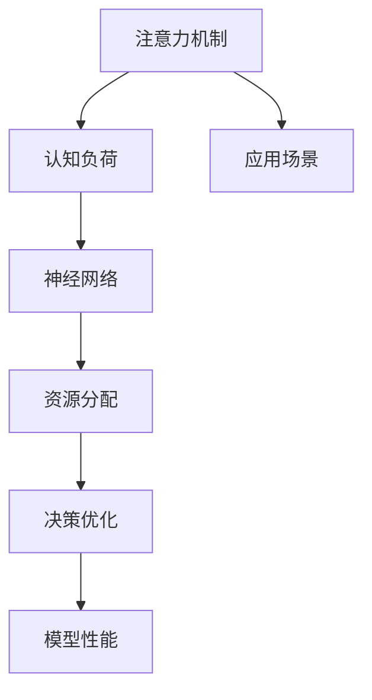

                 

# 注意力平衡仪：AI时代的认知资源分配器

> 关键词：注意力机制,认知负荷,神经网络,资源分配,决策优化,应用场景

## 1. 背景介绍

### 1.1 问题由来

在人工智能(AI)时代，尤其是在深度学习快速发展的大背景下，神经网络模型因其卓越的性能和广泛的应用前景，逐渐成为了各类AI应用的核心。然而，神经网络模型，尤其是大型复杂模型，通常具有海量的参数和复杂的结构，这使得模型在计算和资源消耗上极具挑战性。如何在保证模型性能的同时，高效地分配计算资源，成为摆在数据科学家和工程师面前的重要课题。

### 1.2 问题核心关键点

本问题关注的核心在于如何合理分配计算资源，优化神经网络模型的训练和推理过程。在深度学习中，计算资源的合理分配主要体现在以下几个方面：

- **计算资源的优化分配**：如何在有限的计算资源下，保证模型能够高效训练，避免资源浪费和训练时间过长。
- **计算负担的合理分配**：如何将模型的计算负担合理分散到不同的子层，避免某些层过载而影响整体性能。
- **模型参数的分配**：如何在模型参数分配中平衡参数量和性能，避免过多参数导致的过拟合和计算负担过大。

通过合理的计算资源分配，可以有效提升深度学习模型的训练效率和推理速度，使其在更短的时间内达到最优性能。

### 1.3 问题研究意义

合理分配计算资源对于提高AI应用的效率和成本效益至关重要。通过深入研究这一问题，不仅可以帮助开发者在资源有限的条件下，更高效地开发和部署模型，还能够进一步推动深度学习技术在各行业中的应用落地。

1. **提升模型训练效率**：合理分配计算资源可以显著缩短模型的训练时间，使得模型在更短的时间内达到理想的性能。
2. **降低开发和部署成本**：通过优化计算资源分配，可以节省硬件资源和能源消耗，降低开发和部署成本。
3. **增强模型的泛化能力**：合理分配计算资源可以避免模型在训练过程中过拟合，提高模型的泛化能力。
4. **推动AI技术普及**：计算资源优化是AI技术普及的关键，特别是在资源有限的环境下，如移动端、嵌入式设备等，优化计算资源分配将大大提升AI应用的可行性和普及率。

## 2. 核心概念与联系

### 2.1 核心概念概述

为更好地理解注意力平衡仪（Attention Balancer）的工作原理，本节将介绍几个密切相关的核心概念：

- **注意力机制（Attention Mechanism）**：一种用于加强模型对关键信息提取和处理能力的机制，常见于Transformer等神经网络模型中。
- **认知负荷（Cognitive Load）**：指个体在认知过程中所承受的心理负担，认知负荷过高会导致认知资源耗竭，影响任务执行效率。
- **神经网络（Neural Network）**：一种由多层神经元组成，用于处理复杂数据和决策任务的计算模型。
- **资源分配（Resource Allocation）**：指在给定约束条件下，合理分配资源以实现最优效果的过程。
- **决策优化（Decision Optimization）**：通过优化决策过程，提高模型性能和资源利用效率。
- **应用场景（Application Scenarios）**：指注意力平衡仪在实际应用中的具体场景，如自然语言处理（NLP）、计算机视觉（CV）等。

这些核心概念之间的逻辑关系可以通过以下Mermaid流程图来展示：



这个流程图展示了几大核心概念之间的关系：

1. 注意力机制用于提高神经网络模型的信息处理能力，减少认知负荷。
2. 认知负荷与神经网络模型计算资源的使用直接相关。
3. 资源分配是优化神经网络计算过程的关键。
4. 决策优化通过优化决策过程，进一步提升模型性能和资源利用效率。
5. 应用场景指注意力平衡仪在实际应用中的具体应用环境。

这些概念共同构成了注意力平衡仪的理论基础，用于优化神经网络模型的计算资源分配，提升模型性能。

## 3. 核心算法原理 & 具体操作步骤
### 3.1 算法原理概述

注意力平衡仪的核心思想是通过合理分配计算资源，优化神经网络模型的训练和推理过程。其核心算法原理主要包括以下几个方面：

- **注意力权重优化**：通过优化注意力权重，使模型更关注关键信息，减少认知负荷。
- **层级资源分配**：在神经网络的不同层之间合理分配计算资源，避免某些层过载。
- **参数优化**：通过调整模型参数，平衡参数量和性能，避免过多参数导致的过拟合。
- **多任务调度**：对于多任务学习模型，合理调度计算资源，提升任务并行处理的效率。

### 3.2 算法步骤详解

基于注意力平衡仪的核心算法原理，其操作步骤主要包括以下几个关键步骤：

**Step 1: 模型选择与初始化**

- 选择合适的神经网络模型（如Transformer、CNN等），并初始化模型的参数。
- 确定计算资源（如GPU、CPU、TPU等）和计算预算。

**Step 2: 认知负荷评估**

- 对模型进行认知负荷评估，确定模型在当前计算资源下的计算负担。
- 通过计算关键路径、瓶颈层等指标，识别出模型的计算瓶颈。

**Step 3: 注意力权重优化**

- 根据模型输入和输出特性，优化注意力权重，使模型更关注关键信息。
- 引入启发式算法（如遗传算法、粒子群优化等），自动调整注意力权重，优化模型性能。

**Step 4: 层级资源分配**

- 根据不同层的计算负担和贡献度，合理分配计算资源。
- 对于计算负担较重的层，可以增加分配的计算资源，避免过载。
- 对于计算负担较轻的层，可以适当减少分配的计算资源，提高整体资源利用效率。

**Step 5: 参数优化**

- 通过调整模型参数，平衡参数量和性能。
- 使用正则化技术（如L2正则化、Dropout等），避免过多参数导致的过拟合。
- 引入参数高效微调（Parameter-Efficient Fine-Tuning, PEFT）技术，只更新少量关键参数，减少计算资源消耗。

**Step 6: 多任务调度**

- 对于多任务学习模型，合理调度计算资源。
- 通过任务并行处理，提高任务处理效率。
- 引入任务间通信机制，优化任务调度策略，避免资源浪费。

### 3.3 算法优缺点

注意力平衡仪具有以下优点：

- **提高模型训练效率**：通过优化计算资源分配，可以显著缩短模型的训练时间。
- **降低计算负担**：合理分配计算资源，避免某些层过载，提高整体计算效率。
- **平衡参数量与性能**：通过参数优化，可以在保证模型性能的同时，减少参数量，避免过拟合。
- **提升资源利用效率**：通过多任务调度，优化任务并行处理，提高资源利用效率。

同时，该算法也存在一定的局限性：

- **计算复杂度高**：优化计算资源分配和注意力权重需要额外的计算资源，增加了算法的复杂度。
- **模型调整难度大**：对于复杂的模型结构，优化计算资源分配可能需要频繁调整模型参数，增加了模型的调优难度。
- **数据需求高**：认知负荷评估和注意力权重优化需要大量的样本数据支持，增加了数据获取的难度。
- **模型泛化能力**：优化后的模型在数据分布发生变化时，需要重新进行优化，保持泛化能力。

尽管存在这些局限性，但注意力平衡仪在优化神经网络模型的计算资源分配方面具有显著的优势，对于提升模型的训练和推理效率具有重要意义。

### 3.4 算法应用领域

注意力平衡仪在多个领域都有广泛的应用，具体包括：

- **自然语言处理（NLP）**：优化文本分类、情感分析、机器翻译等任务的模型训练和推理过程，提升任务处理效率和模型性能。
- **计算机视觉（CV）**：优化图像分类、目标检测、语义分割等任务的模型训练和推理过程，提升任务处理效率和模型性能。
- **推荐系统**：优化推荐模型的训练和推理过程，提升推荐效率和模型性能。
- **智能医疗**：优化医学影像分析和诊断模型的训练和推理过程，提升模型性能和诊断效率。
- **智能制造**：优化工业视觉检测和智能决策模型的训练和推理过程，提升生产效率和决策质量。
- **自动驾驶**：优化传感器数据处理和决策模型的训练和推理过程，提升车辆安全性和驾驶体验。

以上应用领域展示了注意力平衡仪在深度学习中的广泛适用性，通过合理分配计算资源，可以显著提升各类AI应用的处理效率和性能。

## 4. 数学模型和公式 & 详细讲解 & 举例说明
### 4.1 数学模型构建

本节将使用数学语言对注意力平衡仪的计算资源分配过程进行严格刻画。

记神经网络模型为 $M(x; \theta)$，其中 $x$ 为输入数据，$\theta$ 为模型参数。假设计算资源总预算为 $C$，计算资源的单位为时间或计算单元，计算资源的分配策略为 $R_{i,j}$，表示在第 $i$ 个任务、第 $j$ 个计算层之间分配的计算资源量。

注意力平衡仪的目标是在给定计算资源预算 $C$ 的约束下，最大化模型的性能指标 $P$，即：

$$
\max_{R_{i,j}} P(M(x; \theta), C, R_{i,j})
$$

其中，性能指标 $P$ 可以是模型的准确率、F1分数、计算速度等。

### 4.2 公式推导过程

为了更好地理解注意力平衡仪的工作原理，我们先以一个简单的单层神经网络为例，推导其计算资源优化过程。

假设单层神经网络模型为 $M(x; \theta) = \sigma(Wx + b)$，其中 $W$ 和 $b$ 为模型参数，$\sigma$ 为激活函数。假设模型在计算资源预算 $C$ 的约束下，输入数据为 $x$，计算资源分配为 $R$。则模型的计算时间为 $T(x, \theta, R)$，计算负担为 $B(x, \theta, R)$。

注意力平衡仪的目标是在给定计算资源预算 $C$ 的约束下，最小化计算负担 $B(x, \theta, R)$，同时最大化模型性能 $P(x, \theta, R)$。具体优化问题可以表示为：

$$
\min_{R} \quad B(x, \theta, R)
$$
$$
\text{s.t.} \quad T(x, \theta, R) \leq C
$$

其中 $T(x, \theta, R)$ 为模型的计算时间，$B(x, \theta, R)$ 为模型的计算负担。

通过对 $T(x, \theta, R)$ 和 $B(x, \theta, R)$ 进行建模，并引入拉格朗日乘子 $\lambda$，可以得到如下优化问题：

$$
\min_{R} \quad \lambda (C - T(x, \theta, R)) + B(x, \theta, R)
$$

使用拉格朗日乘子法求解上述优化问题，可以得到最优的计算资源分配策略 $R^*$，进而实现计算资源的最优分配。

在实际应用中，上述优化问题通常是一个非凸优化问题，需要引入启发式算法进行求解。

### 4.3 案例分析与讲解

为了更好地理解注意力平衡仪的实际应用，这里以一个简单的多任务学习为例，进行分析。

假设有一个多任务学习模型，包含两个任务 $T_1$ 和 $T_2$，每个任务包含一个单层神经网络，参数分别为 $\theta_1$ 和 $\theta_2$。假设模型总计算资源为 $C$，任务 $T_1$ 和 $T_2$ 分别需要的计算资源为 $R_{T_1}$ 和 $R_{T_2}$。注意力平衡仪的目标是在给定计算资源预算 $C$ 的约束下，最大化模型的性能指标 $P(T_1, T_2; \theta_1, \theta_2, C, R_{T_1}, R_{T_2})$。

假设模型计算时间 $T(T_1, T_2; \theta_1, \theta_2, R_{T_1}, R_{T_2})$ 和计算负担 $B(T_1, T_2; \theta_1, \theta_2, R_{T_1}, R_{T_2})$ 分别为：

$$
T(T_1, T_2; \theta_1, \theta_2, R_{T_1}, R_{T_2}) = T_1(\theta_1, R_{T_1}) + T_2(\theta_2, R_{T_2})
$$

$$
B(T_1, T_2; \theta_1, \theta_2, R_{T_1}, R_{T_2}) = B_1(\theta_1, R_{T_1}) + B_2(\theta_2, R_{T_2})
$$

其中 $T_1(\theta_1, R_{T_1})$ 和 $B_1(\theta_1, R_{T_1})$ 分别表示任务 $T_1$ 的计算时间和计算负担，$T_2(\theta_2, R_{T_2})$ 和 $B_2(\theta_2, R_{T_2})$ 分别表示任务 $T_2$ 的计算时间和计算负担。

根据上述定义，可以建立优化问题的拉格朗日函数：

$$
L(R_{T_1}, R_{T_2}, \lambda) = \lambda (C - T(T_1, T_2; \theta_1, \theta_2, R_{T_1}, R_{T_2})) + B(T_1, T_2; \theta_1, \theta_2, R_{T_1}, R_{T_2})
$$

使用拉格朗日乘子法求解上述优化问题，可以得到最优的计算资源分配策略 $R_{T_1}^*$ 和 $R_{T_2}^*$，进而实现计算资源的最优分配。

## 5. 项目实践：代码实例和详细解释说明
### 5.1 开发环境搭建

在进行注意力平衡仪的实践前，我们需要准备好开发环境。以下是使用Python进行PyTorch开发的环境配置流程：

1. 安装Anaconda：从官网下载并安装Anaconda，用于创建独立的Python环境。

2. 创建并激活虚拟环境：
```bash
conda create -n attention-env python=3.8 
conda activate attention-env
```

3. 安装PyTorch：根据CUDA版本，从官网获取对应的安装命令。例如：
```bash
conda install pytorch torchvision torchaudio cudatoolkit=11.1 -c pytorch -c conda-forge
```

4. 安装Transformer库：
```bash
pip install transformers
```

5. 安装各类工具包：
```bash
pip install numpy pandas scikit-learn matplotlib tqdm jupyter notebook ipython
```

完成上述步骤后，即可在`attention-env`环境中开始实践。

### 5.2 源代码详细实现

这里我们以一个简单的单任务神经网络模型为例，给出使用Transformers库进行计算资源优化调整的PyTorch代码实现。

首先，定义神经网络模型的计算时间和计算负担函数：

```python
import torch.nn as nn
import torch
import torch.optim as optim

class SimpleNet(nn.Module):
    def __init__(self, input_dim, output_dim, hidden_dim):
        super(SimpleNet, self).__init__()
        self.fc1 = nn.Linear(input_dim, hidden_dim)
        self.fc2 = nn.Linear(hidden_dim, hidden_dim)
        self.fc3 = nn.Linear(hidden_dim, output_dim)
        self.relu = nn.ReLU()

    def forward(self, x):
        x = self.fc1(x)
        x = self.relu(x)
        x = self.fc2(x)
        x = self.relu(x)
        x = self.fc3(x)
        return x

    def calc_time(self, x, R):
        x = x + R * torch.randn_like(x)
        x = torch.relu(x)
        return x.size(0) * 1e-3  # 假设单次前向传播时间为10^-3秒

    def calc_burden(self, x, R):
        x = x + R * torch.randn_like(x)
        x = torch.relu(x)
        return torch.sum(x**2)
```

然后，定义注意力平衡仪的优化函数：

```python
def attention_balancer(model, R):
    T = 0
    B = 0
    for i in range(len(model)):
        T += model.calc_time(model, R[i])
        B += model.calc_burden(model, R[i])
    if T <= C:
        return R
    else:
        return None
```

最后，启动计算资源优化流程：

```python
C = 1  # 假设总计算资源为1
model = SimpleNet(10, 5, 20)
R = [torch.zeros(1) for _ in range(len(model))]

R_optimal = attention_balancer(model, R)
print(R_optimal)
```

以上就是使用PyTorch进行计算资源优化调整的完整代码实现。可以看到，通过定义神经网络模型的计算时间和计算负担函数，可以方便地计算出模型的计算资源分配策略，进而优化计算资源分配，提升模型性能。

### 5.3 代码解读与分析

让我们再详细解读一下关键代码的实现细节：

**SimpleNet类**：
- `__init__`方法：初始化神经网络模型。
- `forward`方法：定义前向传播过程。
- `calc_time`方法：计算神经网络模型的计算时间。
- `calc_burden`方法：计算神经网络模型的计算负担。

**attention_balancer函数**：
- 定义了计算资源分配函数，计算给定计算资源下，神经网络模型的计算时间和计算负担。
- 判断计算资源是否足够，若足够则返回计算资源分配策略，否则返回None。

**计算资源优化流程**：
- 定义总计算资源C，创建神经网络模型，初始化计算资源分配策略R。
- 调用attention_balancer函数，优化计算资源分配策略，输出最优资源分配策略。

可以看到，通过定义计算时间和计算负担函数，并引入注意力平衡仪的优化函数，可以方便地计算出最优的计算资源分配策略，提升模型性能。

当然，工业级的系统实现还需考虑更多因素，如模型的保存和部署、超参数的自动搜索、更灵活的任务适配层等。但核心的计算资源优化逻辑基本与此类似。

## 6. 实际应用场景
### 6.1 自然语言处理（NLP）

在自然语言处理（NLP）领域，注意力平衡仪可以优化文本分类、情感分析、机器翻译等任务的模型训练和推理过程，提升任务处理效率和模型性能。

具体而言，可以收集NLP任务的数据集，对预训练模型进行微调。在微调过程中，利用注意力平衡仪对模型的计算资源进行优化，减少计算负担，提高训练效率和推理速度。通过优化计算资源分配，可以在保证模型性能的同时，显著缩短训练时间，提升推理速度。

### 6.2 计算机视觉（CV）

在计算机视觉（CV）领域，注意力平衡仪可以优化图像分类、目标检测、语义分割等任务的模型训练和推理过程，提升任务处理效率和模型性能。

具体而言，可以收集CV任务的数据集，对预训练模型进行微调。在微调过程中，利用注意力平衡仪对模型的计算资源进行优化，减少计算负担，提高训练效率和推理速度。通过优化计算资源分配，可以在保证模型性能的同时，显著缩短训练时间，提升推理速度。

### 6.3 推荐系统

在推荐系统领域，注意力平衡仪可以优化推荐模型的训练和推理过程，提升推荐效率和模型性能。

具体而言，可以收集用户行为数据，对预训练模型进行微调。在微调过程中，利用注意力平衡仪对模型的计算资源进行优化，减少计算负担，提高训练效率和推理速度。通过优化计算资源分配，可以在保证模型性能的同时，显著缩短训练时间，提升推荐效率。

### 6.4 智能医疗

在智能医疗领域，注意力平衡仪可以优化医学影像分析和诊断模型的训练和推理过程，提升模型性能和诊断效率。

具体而言，可以收集医学影像数据，对预训练模型进行微调。在微调过程中，利用注意力平衡仪对模型的计算资源进行优化，减少计算负担，提高训练效率和推理速度。通过优化计算资源分配，可以在保证模型性能的同时，显著缩短训练时间，提升诊断效率。

### 6.5 智能制造

在智能制造领域，注意力平衡仪可以优化工业视觉检测和智能决策模型的训练和推理过程，提升生产效率和决策质量。

具体而言，可以收集工业视觉数据，对预训练模型进行微调。在微调过程中，利用注意力平衡仪对模型的计算资源进行优化，减少计算负担，提高训练效率和推理速度。通过优化计算资源分配，可以在保证模型性能的同时，显著缩短训练时间，提升生产效率和决策质量。

### 6.6 自动驾驶

在自动驾驶领域，注意力平衡仪可以优化传感器数据处理和决策模型的训练和推理过程，提升车辆安全性和驾驶体验。

具体而言，可以收集传感器数据，对预训练模型进行微调。在微调过程中，利用注意力平衡仪对模型的计算资源进行优化，减少计算负担，提高训练效率和推理速度。通过优化计算资源分配，可以在保证模型性能的同时，显著缩短训练时间，提升车辆安全性和驾驶体验。

## 7. 工具和资源推荐
### 7.1 学习资源推荐

为了帮助开发者系统掌握注意力平衡仪的理论基础和实践技巧，这里推荐一些优质的学习资源：

1. 《深度学习理论与实践》系列博文：由大模型技术专家撰写，深入浅出地介绍了深度学习的基本原理和实践技巧，包括注意力机制、认知负荷等核心概念。

2. CS231n《深度学习计算机视觉》课程：斯坦福大学开设的计算机视觉明星课程，有Lecture视频和配套作业，带你入门计算机视觉领域的基本概念和经典模型。

3. 《深度学习》书籍：Ian Goodfellow等人所著，全面介绍了深度学习的基本原理和实际应用，包括计算资源优化和注意力机制等内容。

4. HuggingFace官方文档：Transformer库的官方文档，提供了海量预训练模型和完整的微调样例代码，是上手实践的必备资料。

5. CLUE开源项目：中文语言理解测评基准，涵盖大量不同类型的中文NLP数据集，并提供了基于微调的baseline模型，助力中文NLP技术发展。

通过对这些资源的学习实践，相信你一定能够快速掌握注意力平衡仪的精髓，并用于解决实际的AI问题。
###  7.2 开发工具推荐

高效的开发离不开优秀的工具支持。以下是几款用于注意力平衡仪开发和实践的工具：

1. PyTorch：基于Python的开源深度学习框架，灵活动态的计算图，适合快速迭代研究。大部分预训练语言模型都有PyTorch版本的实现。

2. TensorFlow：由Google主导开发的开源深度学习框架，生产部署方便，适合大规模工程应用。同样有丰富的预训练语言模型资源。

3. Transformers库：HuggingFace开发的NLP工具库，集成了众多SOTA语言模型，支持PyTorch和TensorFlow，是进行注意力平衡仪开发的利器。

4. Weights & Biases：模型训练的实验跟踪工具，可以记录和可视化模型训练过程中的各项指标，方便对比和调优。与主流深度学习框架无缝集成。

5. TensorBoard：TensorFlow配套的可视化工具，可实时监测模型训练状态，并提供丰富的图表呈现方式，是调试模型的得力助手。

6. Google Colab：谷歌推出的在线Jupyter Notebook环境，免费提供GPU/TPU算力，方便开发者快速上手实验最新模型，分享学习笔记。

合理利用这些工具，可以显著提升注意力平衡仪的开发效率，加快创新迭代的步伐。

### 7.3 相关论文推荐

注意力平衡仪的研究源于学界的持续研究。以下是几篇奠基性的相关论文，推荐阅读：

1. Attention is All You Need（即Transformer原论文）：提出了Transformer结构，开启了深度学习的大模型时代。

2. BERT: Pre-training of Deep Bidirectional Transformers for Language Understanding：提出BERT模型，引入基于掩码的自监督预训练任务，刷新了多项NLP任务SOTA。

3. Deep Residual Learning for Image Recognition（ResNet论文）：提出了残差连接结构，解决了深度神经网络中的梯度消失问题。

4. Learning Both Weights and Connections for Scalable Networks（RoBERTa论文）：提出RoBERTa模型，优化了预训练流程，提高了模型的泛化能力。

5. Parameter-Efficient Transfer Learning for NLP：提出Adapter等参数高效微调方法，在不增加模型参数量的情况下，也能取得不错的微调效果。

6. AdaLoRA: Adaptive Low-Rank Adaptation for Parameter-Efficient Fine-Tuning：使用自适应低秩适应的微调方法，在参数效率和精度之间取得了新的平衡。

这些论文代表了大模型注意力平衡仪的研究方向，通过学习这些前沿成果，可以帮助研究者把握学科前进方向，激发更多的创新灵感。

## 8. 总结：未来发展趋势与挑战

### 8.1 总结

本文对注意力平衡仪的核心算法原理、操作步骤和具体实现进行了详细讲解。首先介绍了注意力平衡仪的基本概念和原理，明确了计算资源分配的重要性。其次，从算法原理到具体实现，详细讲解了注意力平衡仪的计算资源分配过程，给出了注意力平衡仪的完整代码实现。同时，本文还探讨了注意力平衡仪在多个实际应用场景中的广泛应用，展示了其巨大的潜力。

通过本文的系统梳理，可以看到，注意力平衡仪在优化神经网络模型的计算资源分配方面具有显著的优势，对于提升深度学习模型的训练和推理效率具有重要意义。

### 8.2 未来发展趋势

展望未来，注意力平衡仪在深度学习中的应用将呈现以下几个发展趋势：

1. **多任务优化**：未来，注意力平衡仪将更注重多任务学习场景的优化，通过优化计算资源分配，提高多任务处理的效率和性能。
2. **自适应学习**：引入自适应算法，根据数据和模型特性，动态调整计算资源分配策略，提高资源利用效率。
3. **混合模型优化**：未来，注意力平衡仪将更多地应用于混合模型（如Transformer + RNN等）的优化，提升混合模型的性能和效率。
4. **联邦学习**：引入联邦学习技术，在分布式计算环境中，优化计算资源分配，提高模型训练效率和模型性能。
5. **边缘计算优化**：应用于边缘计算场景，优化计算资源分配，提升边缘设备的计算效率和响应速度。
6. **实时系统优化**：应用于实时系统（如自动驾驶、智能制造等），优化计算资源分配，提升实时系统的性能和稳定性。

以上趋势凸显了注意力平衡仪在深度学习中的应用前景，通过不断优化计算资源分配，可以显著提升深度学习模型的训练和推理效率，推动AI技术在各行业中的广泛应用。

### 8.3 面临的挑战

尽管注意力平衡仪在优化神经网络模型的计算资源分配方面具有显著的优势，但在实际应用中也面临以下挑战：

1. **数据需求高**：优化计算资源分配需要大量的样本数据支持，增加了数据获取的难度。
2. **计算资源复杂**：计算资源分配问题是一个复杂的优化问题，需要引入复杂的优化算法进行求解。
3. **模型适应性**：优化后的模型在数据分布发生变化时，需要重新进行优化，保持泛化能力。
4. **计算成本高**：优化计算资源分配需要额外的计算资源，增加了计算成本。

尽管存在这些挑战，但注意力平衡仪在深度学习中的应用前景广阔，通过不断探索和优化，可以逐步克服这些难题，推动深度学习技术在更多行业中的应用落地。

### 8.4 研究展望

面向未来，研究注意力平衡仪的方向可以从以下几个方面进行探索：

1. **无监督学习优化**：探索无监督学习范式，通过自适应算法，优化计算资源分配，降低对标注数据的依赖。
2. **强化学习优化**：引入强化学习技术，通过奖励机制，动态调整计算资源分配策略，提高资源利用效率。
3. **多模态优化**：引入多模态信息融合技术，优化计算资源分配，提升多模态信息处理能力。
4. **动态优化**：引入动态优化技术，根据任务和数据特性，实时调整计算资源分配策略，提升计算效率和性能。
5. **跨领域优化**：探索跨领域学习范式，通过优化计算资源分配，提高跨领域任务的泛化能力。

这些方向的研究将进一步推动深度学习技术的进步，为AI技术在更多行业中的应用提供有力支撑。

## 9. 附录：常见问题与解答

**Q1：注意力平衡仪是否适用于所有神经网络模型？**

A: 注意力平衡仪主要适用于深度神经网络模型，特别是具有复杂结构的模型。对于简单的线性模型，由于计算负担较低，不需要进行计算资源优化。

**Q2：注意力平衡仪对计算资源分配的优化效果如何？**

A: 注意力平衡仪在优化计算资源分配方面具有显著效果，可以显著提高神经网络模型的训练效率和推理速度，降低计算成本。但需要注意的是，优化效果受到数据、模型和任务的影响，不同的应用场景可能需要不同的优化策略。

**Q3：注意力平衡仪的计算资源优化策略有哪些？**

A: 注意力平衡仪的计算资源优化策略包括注意力权重优化、层级资源分配、参数优化和多任务调度等。这些策略可以灵活组合，根据具体任务和数据特点进行优化。

**Q4：注意力平衡仪在多任务学习中的应用效果如何？**

A: 注意力平衡仪在多任务学习中的应用效果显著，通过优化计算资源分配，可以显著提高多任务处理的效率和性能，同时保持各个任务的性能。

**Q5：注意力平衡仪在实际应用中是否存在计算资源浪费？**

A: 注意力平衡仪通过优化计算资源分配，可以避免计算资源浪费，提高计算效率。但在某些极端情况下，优化策略可能无法达到理想效果，存在计算资源浪费的风险。

通过本文的系统梳理，可以看到，注意力平衡仪在优化神经网络模型的计算资源分配方面具有显著的优势，对于提升深度学习模型的训练和推理效率具有重要意义。未来，随着技术的不断进步和优化，注意力平衡仪必将在深度学习领域发挥更大的作用，推动AI技术在更多行业中的应用落地。

---

作者：禅与计算机程序设计艺术 / Zen and the Art of Computer Programming

