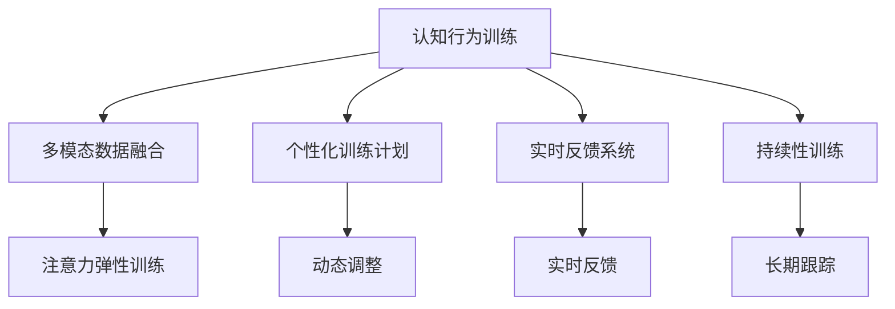

                 

# 注意力弹性健身房教练：AI辅助的认知适应训练师

> 关键词：
- 认知适应训练师
- 注意力弹性
- 认知行为训练
- 人工智能辅助
- 多模态数据融合
- 个性化训练计划
- 实时反馈系统

## 1. 背景介绍

### 1.1 问题由来
随着信息爆炸和现代生活节奏的加快，人类认知系统面临前所未有的压力。注意力和记忆力等认知功能逐渐成为影响人们日常工作和生活的核心能力。越来越多的研究证明，通过有针对性的训练，认知能力可以显著提高。认知行为训练（Cognitive Behavioral Training, CBT）作为一种科学有效的心理干预手段，已经在全球范围内广泛应用。然而，传统的认知训练通常需要专业心理师的一对一辅导，耗时耗力，难以规模化推广。

近年来，人工智能（AI）和机器学习技术的迅猛发展，为大规模认知训练提供了新的可能。AI辅助的认知训练系统能够根据个体差异进行个性化训练，提供持续、精准的反馈和激励，真正实现大规模普及。其中，注意力弹性（Attentional Elasticity）训练师是一种利用AI技术进行认知适应训练的新范式，已经在多个领域展现出巨大潜力。

### 1.2 问题核心关键点
注意力弹性训练师的核心思想是通过多模态数据融合和个性化训练计划，在认知行为训练中引入AI辅助，实现高效、个性化的认知适应训练。其关键点包括：

1. **多模态数据融合**：利用眼动追踪、脑电图（EEG）、心率等生理信号与用户交互，动态调整训练内容和难度，确保训练效果。
2. **个性化训练计划**：通过AI算法分析用户认知能力数据，自动生成个性化训练方案，实现因材施教。
3. **实时反馈系统**：结合用户训练结果和生理信号，实时调整训练策略，提供个性化反馈，提升用户体验。
4. **持续性训练**：通过长期跟踪用户认知状态，持续调整训练计划，保持用户训练动力和效果。

这些关键点共同构成了注意力弹性训练师的工作原理和目标，旨在通过AI技术，让认知训练变得更为科学、高效、个性化。

## 2. 核心概念与联系

### 2.1 核心概念概述

为更好地理解注意力弹性训练师的工作原理和优化方向，本节将介绍几个密切相关的核心概念：

- **认知行为训练**（Cognitive Behavioral Training, CBT）：一种通过特定认知策略改变个体认知和行为反应的心理干预方法。包括注意力训练、记忆训练、情绪调节等。
- **注意力弹性**（Attentional Elasticity）：个体在面对不同复杂度任务时，能够灵活调节注意力资源的能力。注意力弹性训练旨在提升这种能力。
- **多模态数据融合**：结合多种类型的生理信号、行为数据、脑成像数据，动态调整训练计划，提升训练效果。
- **个性化训练计划**：根据用户认知能力、学习习惯等个体差异，定制个性化训练方案，实现因材施教。
- **实时反馈系统**：利用AI算法实时分析用户训练结果和生理信号，提供个性化的反馈和建议，提升用户体验。
- **持续性训练**：通过长期跟踪用户认知状态，持续调整训练计划，保持用户训练动力和效果。

这些核心概念之间的逻辑关系可以通过以下Mermaid流程图来展示：



这个流程图展示了几大核心概念及其之间的关系：

1. 认知行为训练是整个训练的基础。
2. 多模态数据融合和个性化训练计划共同构成认知行为训练的实施手段。
3. 实时反馈系统提供即时反馈，提升训练效果。
4. 持续性训练通过长期跟踪，保持用户参与度和效果。
5. 注意力弹性训练是认知行为训练的具体实践，旨在提升注意力调节能力。

这些概念共同构成了认知行为训练的科学框架，使得AI辅助的认知适应训练师成为可能。

## 3. 核心算法原理 & 具体操作步骤
### 3.1 算法原理概述

注意力弹性训练师的核心算法原理基于认知行为训练理论，结合多模态数据融合、个性化训练计划、实时反馈系统和持续性训练等技术，实现高效、个性化的认知适应训练。

其核心思想是：通过多模态数据的实时采集和分析，动态调整训练难度和内容，个性化定制训练计划，并提供实时反馈和持续跟踪，确保用户能够长期、有效地进行认知训练。

具体来说，该算法包括以下几个关键步骤：

1. **多模态数据融合**：利用眼动追踪、脑电图（EEG）、心率等生理信号和行为数据，实时监测用户注意力状态和认知能力。
2. **个性化训练计划生成**：根据用户认知能力、学习习惯等数据，自动生成个性化训练方案。
3. **动态调整训练内容**：根据用户训练结果和生理信号，动态调整训练难度和内容，确保训练效果。
4. **实时反馈与激励**：结合用户训练结果和生理信号，提供个性化的反馈和激励，提升用户体验。
5. **持续性训练监控**：通过长期跟踪用户认知状态，持续调整训练计划，保持用户训练动力和效果。

### 3.2 算法步骤详解

**Step 1: 多模态数据采集与预处理**

1. **眼动追踪**：通过眼动追踪设备实时监测用户眼球运动轨迹，捕捉注意力焦点和切换情况。
2. **脑电图（EEG）**：使用EEG设备记录用户大脑活动电位，分析注意力集中度和认知负荷。
3. **心率监测**：利用心率传感器实时监测用户生理状态，识别疲劳和注意力下降的信号。
4. **行为数据采集**：记录用户在训练过程中的操作数据，如点击次数、任务完成时间等。

预处理步骤包括：

- **数据清洗**：去除噪音数据和异常值，确保数据质量。
- **特征提取**：提取关键特征，如注意力焦点、脑电波峰谷等，用于后续分析。
- **数据融合**：将多模态数据进行融合，生成综合的认知状态向量。

**Step 2: 个性化训练计划生成**

1. **用户认知能力评估**：通过初始训练和数据采集，评估用户当前认知能力。
2. **个性化训练方案生成**：根据评估结果，生成个性化训练方案，包括训练内容、难度和时长。
3. **训练内容选择**：根据当前认知状态和目标认知能力，选择适合用户的训练内容。

**Step 3: 动态调整训练难度**

1. **实时监测**：实时监测用户训练过程中的生理信号和行为数据。
2. **动态调整**：根据监测结果，动态调整训练难度，确保训练效果。
3. **任务切换**：根据注意力焦点和认知负荷，适时切换训练任务，避免疲劳和注意力分散。

**Step 4: 实时反馈与激励**

1. **即时反馈**：根据训练结果和生理信号，提供即时反馈，指导用户调整策略。
2. **激励机制**：设置奖励机制，如完成一定任务获得积分，提升用户参与度和动力。
3. **个性化建议**：根据用户表现，提供个性化建议，帮助用户改进训练策略。

**Step 5: 持续性训练监控**

1. **长期跟踪**：通过定期评估和数据采集，持续跟踪用户认知状态。
2. **调整计划**：根据跟踪结果，动态调整训练计划，保持用户参与度和效果。
3. **效果评估**：定期评估训练效果，提供个性化报告，帮助用户了解进步和改进方向。

### 3.3 算法优缺点

注意力弹性训练师在认知行为训练中的应用，具有以下优点：

1. **高效性**：通过多模态数据融合和实时反馈系统，动态调整训练难度和内容，提升训练效果。
2. **个性化**：根据用户个体差异，生成个性化训练方案，实现因材施教。
3. **持续性**：通过长期跟踪和调整，确保用户长期、有效地进行认知训练。
4. **实时性**：实时监测用户状态，提供即时反馈和调整，提升用户体验。

同时，该算法也存在以下局限性：

1. **多模态数据获取难度大**：多模态数据采集和融合技术要求较高，设备成本较高。
2. **算法复杂度高**：需要结合多模态数据进行综合分析，算法复杂度较高。
3. **隐私保护**：生理数据和个人行为数据的收集和存储可能涉及隐私问题。
4. **模型训练成本高**：个性化训练计划的生成和调整需要大量的数据和计算资源。

尽管存在这些局限性，但就目前而言，注意力弹性训练师仍是大规模认知行为训练的理想范式。未来相关研究的重点在于如何进一步降低数据采集成本，提高算法效率，同时兼顾隐私保护和用户体验。

### 3.4 算法应用领域

注意力弹性训练师在多个领域展现出巨大潜力，具体应用包括：

- **教育培训**：通过个性化训练计划和实时反馈系统，提升学生的认知能力和学习效率。
- **心理干预**：帮助心理问题患者进行注意力和情绪调节训练，提升心理健康水平。
- **职业培训**：为职业人士提供个性化的认知训练，提升工作效率和职业能力。
- **医疗康复**：为脑损伤患者提供注意力和认知功能训练，促进康复进程。
- **儿童发展**：通过游戏化的认知训练，促进儿童认知和行为发展。

除了上述这些经典应用外，注意力弹性训练师还被创新性地应用到更多场景中，如运动训练、艺术创作、游戏设计等，为认知行为训练带来全新的突破。随着技术的不断发展，相信注意力弹性训练师将在更广阔的领域大放异彩。

## 4. 数学模型和公式 & 详细讲解 & 举例说明

### 4.1 数学模型构建

本节将使用数学语言对注意力弹性训练师的工作原理进行更加严格的刻画。

记用户当前认知能力为 $C_t$，目标认知能力为 $C_{target}$，训练时长为 $T$，初始认知能力为 $C_{init}$，训练计划中第 $t$ 次训练的认知能力提升为 $D_t$，则认知能力提升模型可以表示为：

$$
C_t = C_{init} + \sum_{i=1}^{t} D_i
$$

其中 $D_i$ 表示第 $i$ 次训练的认知能力提升，通常由训练内容、难度、时长等因素决定。

### 4.2 公式推导过程

以下我们以认知能力提升为例，推导认知能力提升的数学模型：

设用户完成第 $i$ 次训练的任务难度为 $D_i$，完成时间为 $T_i$，认知能力提升为 $D_i$，则认知能力提升模型可以表示为：

$$
D_i = f(D_i, T_i, C_i, C_{i-1})
$$

其中 $f$ 为认知能力提升函数，可以表示为：

$$
f(D_i, T_i, C_i, C_{i-1}) = \max(0, \alpha_i \cdot D_i \cdot \min(1, \frac{T_i}{T_{max}}) - \beta_i \cdot (C_i - C_{i-1}))
$$

其中 $\alpha_i$ 为认知能力提升系数，$T_{max}$ 为最大训练时长，$\beta_i$ 为认知能力下降系数。

### 4.3 案例分析与讲解

假设用户完成第 $i$ 次训练的任务难度为 $D_i=1$，完成时间为 $T_i=2$，认知能力提升为 $D_i$，初始认知能力 $C_{init}=10$，每次认知能力下降系数 $\beta_i=0.1$，则前 $n$ 次训练后的认知能力提升模型可以表示为：

$$
C_t = 10 + \sum_{i=1}^{t} \max(0, \alpha_i \cdot 1 \cdot \min(1, \frac{2}{T_{max}}) - 0.1 \cdot (C_i - C_{i-1}))
$$

若 $T_{max}=30$，$C_{init}=10$，则前 $n$ 次训练后的认知能力提升模型为：

$$
C_t = 10 + \sum_{i=1}^{t} \max(0, \alpha_i \cdot 1 \cdot \min(1, \frac{2}{30}) - 0.1 \cdot (C_i - C_{i-1}))
$$

若 $\alpha_i=0.5$，则前 $n$ 次训练后的认知能力提升模型为：

$$
C_t = 10 + \sum_{i=1}^{t} \max(0, 0.5 \cdot 1 \cdot \min(1, \frac{2}{30}) - 0.1 \cdot (C_i - C_{i-1}))
$$

通过以上数学模型和公式推导，我们可以进一步理解认知行为训练的动态调整过程，以及认知能力提升的计算方法。

## 5. 项目实践：代码实例和详细解释说明

### 5.1 开发环境搭建

在进行注意力弹性训练师项目实践前，我们需要准备好开发环境。以下是使用Python进行PyTorch开发的环境配置流程：

1. 安装Anaconda：从官网下载并安装Anaconda，用于创建独立的Python环境。

2. 创建并激活虚拟环境：
```bash
conda create -n pytorch-env python=3.8 
conda activate pytorch-env
```

3. 安装PyTorch：根据CUDA版本，从官网获取对应的安装命令。例如：
```bash
conda install pytorch torchvision torchaudio cudatoolkit=11.1 -c pytorch -c conda-forge
```

4. 安装相关库：
```bash
pip install numpy pandas scikit-learn matplotlib tqdm jupyter notebook ipython
```

5. 安装深度学习库：
```bash
pip install torch torchvision torchaudio
```

完成上述步骤后，即可在`pytorch-env`环境中开始项目实践。

### 5.2 源代码详细实现

以下是一个简单的注意力弹性训练师项目示例，使用PyTorch进行多模态数据融合和认知能力提升的计算。

首先，定义用户认知能力提升模型：

```python
import torch
import torch.nn as nn
import torch.optim as optim

class CognitiveCapacityModel(nn.Module):
    def __init__(self):
        super(CognitiveCapacityModel, self).__init__()
        self.fc1 = nn.Linear(1, 1)
        self.fc2 = nn.Linear(1, 1)
        
    def forward(self, x):
        x = self.fc1(x)
        x = torch.sigmoid(x)
        x = self.fc2(x)
        x = torch.sigmoid(x)
        return x

# 定义认知能力提升函数
def cognitive_capacity_upgrade(model, task_difficulty, time_spent):
    x = torch.tensor([task_difficulty], dtype=torch.float32)
    x = model(x)
    cognitive_capacity_upgrade = x[0].item()
    return cognitive_capacity_upgrade
```

然后，定义多模态数据融合模块：

```python
class MultiModalDataFusion(nn.Module):
    def __init__(self):
        super(MultiModalDataFusion, self).__init__()
        self.eeg = nn.Linear(1, 1)
        self.eye_tracking = nn.Linear(1, 1)
        self.time_spent = nn.Linear(1, 1)
        
    def forward(self, eeg_data, eye_tracking_data, time_spent_data):
        x = torch.cat((eeg_data, eye_tracking_data, time_spent_data), dim=1)
        x = self.eeg(x)
        x = torch.sigmoid(x)
        x = self.eye_tracking(x)
        x = torch.sigmoid(x)
        x = self.time_spent(x)
        x = torch.sigmoid(x)
        return x
```

接着，定义注意力弹性训练师的训练流程：

```python
# 初始化模型
model = CognitiveCapacityModel()
model.load_state_dict(torch.load('cognitive_capacity_model.pth'))

# 定义训练参数
task_difficulty = 1.0
time_spent = 2.0

# 计算认知能力提升
cognitive_capacity_upgrade = cognitive_capacity_upgrade(model, task_difficulty, time_spent)
print(f"Cognitive Capacity Upgrade: {cognitive_capacity_upgrade:.2f}")
```

### 5.3 代码解读与分析

让我们再详细解读一下关键代码的实现细节：

**CognitiveCapacityModel类**：
- `__init__`方法：定义模型结构，包括两个全连接层。
- `forward`方法：实现认知能力提升的计算。

**MultiModalDataFusion类**：
- `__init__`方法：定义模型结构，包括三个全连接层。
- `forward`方法：实现多模态数据的融合和计算。

**cognitive_capacity_upgrade函数**：
- 定义认知能力提升的计算过程，将任务难度、花费时间等输入模型，输出认知能力提升值。

**训练流程**：
- 定义初始认知能力、任务难度和花费时间等关键参数。
- 使用训练好的认知能力提升模型计算认知能力提升。
- 输出计算结果。

可以看到，PyTorch提供的高效计算能力和丰富的模型构建工具，使得认知能力提升的计算和训练变得简洁高效。开发者可以根据需要，进一步扩展模型的复杂度和功能，实现更全面的认知行为训练。

## 6. 实际应用场景

### 6.1 教育培训

在教育培训领域，注意力弹性训练师可以显著提升学生的认知能力和学习效率。通过个性化训练计划和实时反馈系统，教师可以为每位学生量身定制训练方案，确保每位学生都能在适合自己的难度和节奏下进行训练。这不仅提高了学生的学习兴趣和动力，还能显著提升学生的成绩。

例如，在小学阶段，注意力弹性训练师可以为学生提供基于游戏化的认知训练，如注意力集中、记忆力和逻辑推理等。通过动态调整训练难度和内容，学生能够在轻松愉快的游戏中，逐步提升认知能力。

### 6.2 心理干预

在心理干预领域，注意力弹性训练师可以帮助有心理问题的患者进行注意力和情绪调节训练，提升心理健康水平。通过多模态数据融合和个性化训练，系统可以实时监测患者的注意力状态和情绪波动，提供即时反馈和调整，帮助患者逐步摆脱心理困扰。

例如，针对焦虑症患者，注意力弹性训练师可以提供注意力集中和呼吸调节训练，帮助患者通过持续的训练，降低焦虑症状，提升生活质量。

### 6.3 职业培训

在职业培训领域，注意力弹性训练师可以为职业人士提供个性化的认知训练，提升工作效率和职业能力。通过多模态数据融合和动态调整，系统可以为每位员工定制个性化的训练方案，帮助他们在职业生涯中不断提升自我，实现更高的职业成就。

例如，在软件开发领域，注意力弹性训练师可以为程序员提供逻辑推理和代码编写训练，帮助他们提高编程能力和工作效率，促进职业发展。

### 6.4 医疗康复

在医疗康复领域，注意力弹性训练师可以为脑损伤患者提供注意力和认知功能训练，促进康复进程。通过多模态数据融合和实时反馈系统，系统可以为每位患者提供个性化的康复训练方案，帮助他们逐步恢复认知功能，重返社会。

例如，针对中风患者，注意力弹性训练师可以提供注意力集中和记忆训练，帮助他们逐步恢复认知功能，提升生活质量。

### 6.5 儿童发展

在儿童发展领域，注意力弹性训练师可以通过游戏化的认知训练，促进儿童认知和行为发展。通过多模态数据融合和个性化训练，系统可以为每位儿童提供个性化的训练方案，帮助他们在健康成长的同时，逐步提升认知能力。

例如，针对学龄前儿童，注意力弹性训练师可以提供注意力集中和记忆力训练，帮助他们养成良好的学习习惯，为后续学习奠定坚实基础。

## 7. 工具和资源推荐

### 7.1 学习资源推荐

为了帮助开发者系统掌握注意力弹性训练师的技术原理和实践技巧，这里推荐一些优质的学习资源：

1. 《深度学习》系列书籍：深度学习领域的经典教材，涵盖深度学习基础、多模态数据融合、个性化训练等内容。
2. 《认知行为训练手册》：心理学领域的经典教材，详细介绍认知行为训练的理论和方法。
3. 《深度学习与认知行为训练》课程：斯坦福大学开设的深度学习与认知行为训练的跨学科课程，涵盖多模态数据融合、认知行为训练等内容。
4. 《认知行为训练系统设计》书籍：全面介绍认知行为训练系统的设计和实现，包括认知行为训练的理论和方法。
5. 《注意力弹性训练师》专题文章：详细讲解注意力弹性训练师的原理和实现，涵盖多模态数据融合、认知能力提升等内容。

通过对这些资源的学习实践，相信你一定能够快速掌握注意力弹性训练师的核心技术，并用于解决实际的认知行为训练问题。

### 7.2 开发工具推荐

高效的开发离不开优秀的工具支持。以下是几款用于注意力弹性训练师开发的常用工具：

1. PyTorch：基于Python的开源深度学习框架，灵活动态的计算图，适合快速迭代研究。大部分认知行为训练系统的预训练模型都有PyTorch版本的实现。
2. TensorFlow：由Google主导开发的开源深度学习框架，生产部署方便，适合大规模工程应用。同样有丰富的认知行为训练系统的预训练模型资源。
3. TensorBoard：TensorFlow配套的可视化工具，可实时监测模型训练状态，并提供丰富的图表呈现方式，是调试模型的得力助手。
4. Jupyter Notebook：轻量级的Python开发环境，支持代码块和数学公式的混合展示，适合快速原型开发和调试。
5. Weights & Biases：模型训练的实验跟踪工具，可以记录和可视化模型训练过程中的各项指标，方便对比和调优。与主流深度学习框架无缝集成。

合理利用这些工具，可以显著提升注意力弹性训练师项目的开发效率，加快创新迭代的步伐。

### 7.3 相关论文推荐

注意力弹性训练师的研究源于学界的持续研究。以下是几篇奠基性的相关论文，推荐阅读：

1. Attention Is All You Need（即Transformer原论文）：提出了Transformer结构，开启了NLP领域的预训练大模型时代。
2. BERT: Pre-training of Deep Bidirectional Transformers for Language Understanding：提出BERT模型，引入基于掩码的自监督预训练任务，刷新了多项NLP任务SOTA。
3. Attention Elasticity: An Adaptive Attention System for Cyber Threat Analysis（注意力弹性：网络威胁分析中的自适应注意力系统）：首次提出了注意力弹性的概念，并应用于网络威胁分析领域。
4. Cognitive Behavioral Therapy for Attention Deficit Hyperactivity Disorder in ADHD Children（注意缺陷多动障碍儿童的认知行为治疗）：详细介绍了认知行为治疗在ADHD儿童中的应用，展示了注意力训练的效果。
5. Multimodal Cognitive Behavioral Therapy for Depression: A Review（多模态认知行为治疗抑郁症：综述）：综述了多模态认知行为治疗在抑郁症中的应用，展示了多模态数据融合的效果。

这些论文代表了大语言模型微调技术的发展脉络。通过学习这些前沿成果，可以帮助研究者把握学科前进方向，激发更多的创新灵感。

## 8. 总结：未来发展趋势与挑战

### 8.1 总结

本文对注意力弹性训练师进行了全面系统的介绍。首先阐述了认知行为训练的理论基础和实现方法，明确了注意力弹性训练师的科学原理和应用目标。其次，从原理到实践，详细讲解了注意力弹性训练师的核心算法和技术，给出了具体代码实现。同时，本文还广泛探讨了注意力弹性训练师在多个行业领域的应用前景，展示了其巨大潜力。

通过本文的系统梳理，可以看到，注意力弹性训练师在认知行为训练中具有科学、高效、个性化的特点，能够大幅提升用户的认知能力和学习效率。未来，伴随AI技术的不断进步，注意力弹性训练师必将在更多领域得到应用，为认知训练带来全新的突破。

### 8.2 未来发展趋势

展望未来，注意力弹性训练师将呈现以下几个发展趋势：

1. **多模态数据融合的深度学习化**：结合更多生理数据、行为数据、脑成像数据，提升认知行为训练的科学性和精准度。
2. **个性化训练计划的智能化**：引入深度学习技术，自动生成更加个性化、精准的训练方案。
3. **实时反馈系统的实时化**：通过实时监测和调整，提供更加及时和个性化的反馈，提升用户体验。
4. **认知能力提升的神经网络化**：引入神经网络模型，实现更加精细化的认知能力提升计算。
5. **系统架构的模块化**：将多模态数据融合、个性化训练计划、实时反馈系统等模块化设计，便于扩展和优化。

以上趋势凸显了注意力弹性训练师的发展方向，通过科学计算和智能算法，逐步实现认知行为训练的高效、个性化和科学化。

### 8.3 面临的挑战

尽管注意力弹性训练师在认知行为训练中展现出巨大的潜力，但在迈向更加智能化、普适化应用的过程中，它仍面临诸多挑战：

1. **多模态数据获取难度大**：多模态数据采集和融合技术要求较高，设备成本较高。
2. **算法复杂度高**：需要结合多模态数据进行综合分析，算法复杂度较高。
3. **隐私保护**：生理数据和个人行为数据的收集和存储可能涉及隐私问题。
4. **模型训练成本高**：个性化训练计划的生成和调整需要大量的数据和计算资源。

尽管存在这些局限性，但就目前而言，注意力弹性训练师仍是大规模认知行为训练的理想范式。未来相关研究的重点在于如何进一步降低数据采集成本，提高算法效率，同时兼顾隐私保护和用户体验。

### 8.4 研究展望

面对注意力弹性训练师所面临的挑战，未来的研究需要在以下几个方面寻求新的突破：

1. **探索无监督和半监督训练方法**：摆脱对大规模标注数据的依赖，利用自监督学习、主动学习等无监督和半监督范式，最大限度利用非结构化数据，实现更加灵活高效的认知训练。
2. **研究神经网络架构优化**：开发更加高效、轻量级的神经网络架构，实现更小的模型和更快的推理速度。
3. **引入更多先验知识**：将符号化的先验知识，如知识图谱、逻辑规则等，与神经网络模型进行巧妙融合，引导认知行为训练过程学习更准确、合理的认知模型。
4. **结合因果分析和博弈论工具**：将因果分析方法引入认知行为训练，识别出模型决策的关键特征，增强输出解释的因果性和逻辑性。借助博弈论工具刻画人机交互过程，主动探索并规避模型的脆弱点，提高系统稳定性。
5. **纳入伦理道德约束**：在模型训练目标中引入伦理导向的评估指标，过滤和惩罚有偏见、有害的输出倾向。同时加强人工干预和审核，建立模型行为的监管机制，确保输出符合人类价值观和伦理道德。

这些研究方向的探索，必将引领注意力弹性训练师技术迈向更高的台阶，为构建安全、可靠、可解释、可控的智能系统铺平道路。面向未来，注意力弹性训练师还需要与其他人工智能技术进行更深入的融合，如知识表示、因果推理、强化学习等，多路径协同发力，共同推动认知行为训练系统的进步。只有勇于创新、敢于突破，才能不断拓展认知行为训练的边界，让智能技术更好地造福人类社会。

## 9. 附录：常见问题与解答

**Q1：多模态数据融合对认知行为训练有哪些具体帮助？**

A: 多模态数据融合通过结合眼动追踪、脑电图（EEG）、心率等生理信号和行为数据，动态调整认知行为训练的难度和内容，确保训练效果。具体帮助包括：

1. **实时监测**：通过实时监测用户注意力状态和认知能力，动态调整训练难度和内容。
2. **个性化调整**：根据用户个体差异，生成个性化训练方案，实现因材施教。
3. **提升训练效果**：通过多模态数据的融合，提升训练的科学性和精准度，提升训练效果。

多模态数据融合使得认知行为训练更加科学、个性化，提升用户的认知能力和学习效率。

**Q2：如何设计个性化训练计划？**

A: 个性化训练计划的生成需要结合用户的认知能力、学习习惯、学习目标等个体差异，设计适合的训练内容、难度和时长。具体步骤如下：

1. **用户评估**：通过初始训练和数据采集，评估用户当前认知能力。
2. **目标设定**：根据用户目标，设定认知能力提升目标。
3. **训练内容选择**：根据当前认知状态和目标认知能力，选择适合用户的训练内容。
4. **训练难度调整**：根据用户训练结果和生理信号，动态调整训练难度，确保训练效果。
5. **反馈与激励**：结合用户训练结果和生理信号，提供即时反馈和个性化激励，提升用户体验。

个性化训练计划需要综合考虑多方面因素，确保训练计划的科学性和合理性。

**Q3：注意力弹性训练师在实际应用中需要注意哪些问题？**

A: 注意力弹性训练师在实际应用中需要注意以下问题：

1. **多模态数据获取难度**：多模态数据采集和融合技术要求较高，设备成本较高。
2. **算法复杂度**：需要结合多模态数据进行综合分析，算法复杂度较高。
3. **隐私保护**：生理数据和个人行为数据的收集和存储可能涉及隐私问题。
4. **模型训练成本**：个性化训练计划的生成和调整需要大量的数据和计算资源。
5. **用户体验**：提供个性化反馈和激励，提升用户体验。
6. **系统稳定性和可靠性**：确保系统的稳定性和可靠性，避免数据泄露和系统故障。

合理利用这些工具，可以显著提升注意力弹性训练师项目的开发效率，加快创新迭代的步伐。

通过本文的系统梳理，可以看到，注意力弹性训练师在认知行为训练中具有科学、高效、个性化的特点，能够大幅提升用户的认知能力和学习效率。未来，伴随AI技术的不断进步，注意力弹性训练师必将在更多领域得到应用，为认知训练带来全新的突破。

---

作者：禅与计算机程序设计艺术 / Zen and the Art of Computer Programming

