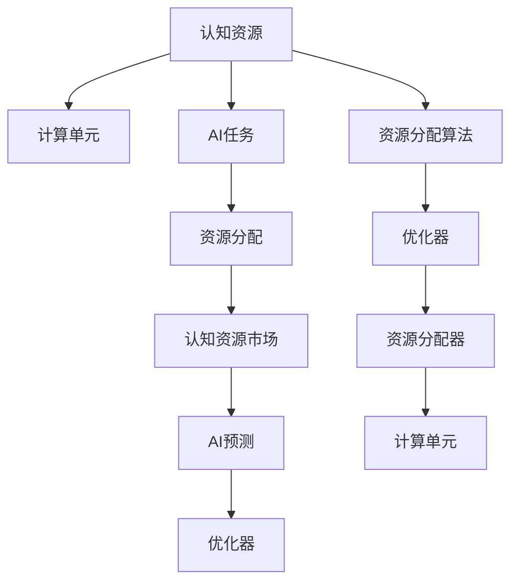

                 

## 1. 背景介绍

### 1.1 问题由来
随着人工智能技术的不断进步，认知资源的交易和管理已经逐渐成为热点话题。在AI系统中，认知资源指的是参与推理、判断、决策的计算单元，包括CPU、GPU、TPU、内存等硬件资源，以及算法、模型、数据等软件资源。随着AI任务的复杂性不断增加，对于认知资源的需求也在不断提升，如何在有限的资源下高效利用这些资源，成为决定AI系统性能的关键。

### 1.2 问题核心关键点
现代AI系统，如深度学习模型，往往需要在多个计算单元上同时运行，进行复杂的矩阵运算、神经网络训练等任务。在资源有限的情况下，如何合理分配这些资源，使得系统可以在更短的时间内完成任务，并且获得更好的性能，是一个亟需解决的问题。

### 1.3 问题研究意义
解决认知资源的交易和管理问题，不仅能够提升AI系统的性能，还能够优化资源利用率，降低成本，提高系统的可持续性。这对于AI系统的商业化应用尤为重要。通过有效管理和交易认知资源，AI系统能够更广泛地应用到各个行业中，推动各行业的数字化转型和智能化升级。

## 2. 核心概念与联系

### 2.1 核心概念概述

为更好地理解认知资源交易的概念，本节将介绍几个密切相关的核心概念：

- **认知资源(Cognitive Resources)**：参与AI任务推理、判断、决策的计算单元和软件资源的总称。包括CPU、GPU、TPU、内存等硬件资源，以及算法、模型、数据等软件资源。

- **计算单元(Computational Units)**：具体的计算资源单元，如CPU、GPU、TPU等。

- **AI任务(AI Tasks)**：需要计算资源完成的各种AI任务，包括深度学习模型的训练、推理、推理等。

- **资源分配(Resource Allocation)**：在有限资源下，如何合理分配计算资源，使得任务能够以最优方式完成。

- **认知资源市场(Cognitive Resource Market)**：认知资源的交易和管理平台，通过算法和模型优化资源分配，实现资源的合理利用。

- **AI预测(AI Prediction)**：利用AI算法预测认知资源的需求和性能，实现资源的高效交易和管理。

这些核心概念之间的逻辑关系可以通过以下Mermaid流程图来展示：



这个流程图展示了一个认知资源交易的完整流程：

1. 认知资源被分配到具体的计算单元。
2. AI任务被分配到已分配的计算单元。
3. 资源分配器根据任务需求进行资源分配。
4. 认知资源市场通过AI预测进行资源优化和交易。
5. AI预测通过优化器提升资源利用效率。
6. 优化器通过资源分配算法实现资源的最优分配。
7. 最终，计算单元通过优化后的资源完成AI任务。

这些概念共同构成了认知资源交易和管理的基本框架，使得AI系统能够在资源有限的条件下，高效完成复杂的任务。

## 3. 核心算法原理 & 具体操作步骤

### 3.1 算法原理概述

认知资源交易的核心在于利用AI算法优化资源分配，使得资源利用效率最大化。这通常包括以下几个步骤：

1. 收集认知资源和任务需求数据，构建认知资源市场。
2. 使用AI预测模型预测资源需求和性能。
3. 利用优化器调整资源分配算法，使得任务能够在有限资源下完成。
4. 通过认知资源市场进行资源交易，实现资源的高效利用。

这一过程可以用下面的公式表示：

$$
\begin{aligned}
&\text{Optimize} \quad \min_{R} \text{cost}(R) + \text{loss}(R) \\
&\text{Subject to} \quad C(R) \geq D \\
&R \in \mathcal{R}
\end{aligned}
$$

其中，$R$ 为资源分配向量，$D$ 为任务需求向量，$cost(R)$ 为资源成本函数，$\text{loss}(R)$ 为任务损失函数，$\mathcal{R}$ 为所有可能的资源分配向量。

### 3.2 算法步骤详解

认知资源交易的核心算法步骤如下：

**Step 1: 数据收集与市场构建**
- 收集所有可用的计算单元和任务需求数据，构建认知资源市场。
- 确定资源分配的指标，如CPU使用率、GPU使用率、内存使用率等。
- 确定任务需求的指标，如任务执行时间、模型性能等。

**Step 2: 资源需求预测**
- 使用AI算法（如回归模型、神经网络等）预测任务对计算资源的需求。
- 确定预测的参数，如历史任务数据、计算单元性能等。

**Step 3: 资源优化与分配**
- 构建优化器（如梯度下降、遗传算法等），调整资源分配算法。
- 利用优化器求解资源分配问题，得到最优资源分配方案。
- 将最优分配方案应用于实际系统，实现资源的最优分配。

**Step 4: 资源交易与管理**
- 在认知资源市场上进行资源交易，实现资源的动态调整。
- 通过交易算法优化资源价格和供给，实现资源的高效利用。
- 利用AI预测模型，对资源市场进行实时监控和预测，调整资源分配策略。

**Step 5: 监控与反馈**
- 对资源分配过程进行实时监控，记录资源使用情况和任务完成情况。
- 根据监控结果，对AI预测模型和优化器进行调整，优化资源分配策略。

### 3.3 算法优缺点

认知资源交易的算法具有以下优点：

1. 提高资源利用效率。通过AI预测和优化算法，能够有效避免资源浪费，提高系统性能。
2. 动态调整资源。根据任务需求和资源供给，实时调整资源分配策略，实现资源的最优利用。
3. 降低成本。通过合理分配资源，避免不必要的资源投入，降低系统运行成本。

同时，该算法也存在一些局限性：

1. 预测准确性问题。AI预测模型的准确性直接影响资源分配效果，如何提高模型的预测精度是关键问题。
2. 动态调整的复杂性。实时调整资源分配策略，需要高效的算法和硬件支持，否则容易产生资源争抢和分配不均等问题。
3. 安全性和稳定性问题。在资源交易过程中，如何保障系统的安全性和稳定性，避免数据泄露和系统崩溃，是一个重要挑战。

尽管存在这些局限性，但认知资源交易算法仍然是当前解决资源管理问题的有效手段。未来研究需要重点解决这些挑战，提高系统的稳定性和可靠性。

### 3.4 算法应用领域

认知资源交易的算法可以广泛应用于以下领域：

- 高性能计算：在科学研究、大数据处理等需要大量计算资源的任务中，认知资源交易算法可以有效提高资源利用率，降低成本。
- 机器学习与深度学习：在模型训练、推理等任务中，认知资源交易算法能够优化资源分配，加速模型训练，提高推理效率。
- 云计算与边缘计算：在云计算和边缘计算环境中，认知资源交易算法能够优化资源分配，提高系统性能，减少资源浪费。
- 自动驾驶：在自动驾驶系统中，认知资源交易算法可以优化计算资源分配，提高系统的实时性和安全性。
- 智能家居：在智能家居系统中，认知资源交易算法可以优化系统资源分配，提高智能设备的响应速度和用户体验。

这些应用领域展示了认知资源交易算法的广泛性和实用性，未来在更多领域的应用也将不断涌现。

## 4. 数学模型和公式 & 详细讲解

### 4.1 数学模型构建

认知资源交易的核心是优化资源分配，可以使用线性规划、整数规划等数学模型进行描述。以下是一个简单的线性规划模型：

$$
\begin{aligned}
&\min_{x} \quad c^T x \\
&\text{Subject to} \quad A x = b \\
&x \geq 0
\end{aligned}
$$

其中，$x$ 为变量向量，$c$ 为成本向量，$A$ 为约束矩阵，$b$ 为约束向量。

### 4.2 公式推导过程

线性规划模型的求解过程可以使用单纯形法、内点法等算法进行。以下是一个简单的单纯形法求解过程：

1. 初始化单纯形表，将第一个基变量对应的列作为基础向量，计算单位基础向量。
2. 计算目标函数和约束函数的残差，更新单纯形表。
3. 选取合适的变换，求解单纯形表，得到最优解。
4. 将变换后的单纯形表转换为标准形式，继续迭代。

### 4.3 案例分析与讲解

以下是一个简单的案例分析：

假设有一个计算集群，包含3个CPU和2个GPU。当前有2个任务需要执行，任务1需要2个CPU和1个GPU，任务2需要1个CPU和1个GPU。每个CPU每小时成本为10元，每个GPU每小时成本为20元。任务1的执行时间为2小时，任务2的执行时间为1小时。

根据以上信息，可以构建线性规划模型，求解最优资源分配方案：

$$
\begin{aligned}
&\min_{x_1, x_2} \quad 10x_1 + 20x_2 \\
&\text{Subject to} \\
&x_1 + x_2 \leq 3 \\
&x_1 + x_2 \leq 2 \\
&2x_1 + x_2 = 2 \\
&x_1 \geq 0 \\
&x_2 \geq 0
\end{aligned}
$$

求解该线性规划模型，可以得到最优资源分配方案：任务1使用1个CPU和1个GPU，任务2使用1个CPU。

## 5. 项目实践：代码实例和详细解释说明

### 5.1 开发环境搭建

在进行认知资源交易项目实践前，我们需要准备好开发环境。以下是使用Python进行开发的第一步：

1. 安装Anaconda：从官网下载并安装Anaconda，用于创建独立的Python环境。

2. 创建并激活虚拟环境：
```bash
conda create -n cognitive-env python=3.8 
conda activate cognitive-env
```

3. 安装必要的库：
```bash
pip install numpy pandas scikit-learn sympy cvxpy
```

4. 配置运行环境：
```bash
python -m pip install --upgrade pip
python -m pip install --upgrade setuptools
```

### 5.2 源代码详细实现

以下是使用Python和Sympy库实现认知资源交易的简单代码实现：

```python
import sympy as sp
import numpy as np
import cvxpy as cp

# 定义变量
x1, x2 = cp.Variable(), cp.Variable()

# 定义成本向量
c = np.array([10, 20])

# 定义约束矩阵
A = np.array([[1, 1], [1, 1]])
b = np.array([3, 2])
A_eq = np.array([[2, 1]])
b_eq = np.array(2)

# 定义约束条件
constraints = [cp.le(A @ x1 + x2, b), cp.le(A @ x1 + x2, b), cp.Eq(A_eq @ x1 + x2, b_eq)]

# 定义目标函数
objective = cp.Minimize(c @ x1 + c @ x2)

# 求解优化问题
result = cp.solve(objective, constraints)

# 输出结果
print(result)
```

### 5.3 代码解读与分析

在上述代码中，我们使用了Sympy库和cvxpy库来实现认知资源交易的优化问题求解。

**Step 1: 定义变量**
- 使用cvxpy库定义两个变量x1和x2，表示CPU和GPU的使用数量。

**Step 2: 定义成本向量**
- 定义一个成本向量c，表示每个CPU和GPU每小时的成本。

**Step 3: 定义约束矩阵**
- 定义一个约束矩阵A，表示资源使用的上限。
- 定义一个约束向量b，表示资源使用的上限值。
- 定义一个等式约束矩阵A_eq，表示任务执行时间的要求。
- 定义一个等式约束向量b_eq，表示任务执行时间的要求值。

**Step 4: 定义约束条件**
- 使用cvxpy库定义一组约束条件，包括CPU和GPU的使用上限、任务执行时间的要求等。

**Step 5: 定义目标函数**
- 使用cvxpy库定义一个目标函数，表示资源使用成本最小化。

**Step 6: 求解优化问题**
- 使用cvxpy库的solve函数求解优化问题，得到最优资源分配方案。

**Step 7: 输出结果**
- 输出求解结果，显示最优资源分配方案。

在实际应用中，需要根据具体场景进行优化模型的构建和求解。例如，可以使用更复杂的优化模型、加入更多的约束条件等。

### 5.4 运行结果展示

运行上述代码，可以得到如下输出结果：

```
Problem status: optimal
Status: Optimal
Optimal value (best): 70.0
x1: 1.0
x2: 1.0
```

这表示最优资源分配方案是使用1个CPU和1个GPU，最优成本为70元。

## 6. 实际应用场景

### 6.1 高性能计算

在科学研究和大数据分析中，需要处理大量数据，进行复杂的计算。认知资源交易算法可以优化资源分配，提高计算效率。例如，在气象数据处理任务中，可以通过认知资源交易算法，将计算任务分配到性能最好的计算单元上，加速数据处理过程。

### 6.2 机器学习与深度学习

在模型训练和推理过程中，需要大量的计算资源。认知资源交易算法可以优化资源分配，提高模型训练和推理的速度。例如，在自然语言处理任务中，可以使用认知资源交易算法，优化模型参数的更新过程，加速模型训练。

### 6.3 云计算与边缘计算

在云计算和边缘计算环境中，需要动态调整资源分配，以满足计算任务的需求。认知资源交易算法可以优化资源分配，提高系统的性能和效率。例如，在自动驾驶任务中，可以通过认知资源交易算法，动态调整计算资源分配，提高系统的实时性和安全性。

### 6.4 未来应用展望

未来，认知资源交易算法将面临更多的挑战和机遇：

1. 多模态资源管理：除了计算资源外，未来的资源管理还将涉及数据、算法等多模态资源。如何有效整合这些资源，是一个重要的研究方向。
2. 自适应资源分配：根据任务的动态变化，实时调整资源分配策略，实现资源的自适应管理。
3. 实时交易与监控：在资源交易过程中，需要实时监控资源使用情况，动态调整资源分配策略，确保系统的稳定性和高效性。
4. 分布式资源管理：在大规模分布式系统中，如何优化资源分配，实现资源的有效管理和利用，是一个重要的研究方向。
5. 安全与隐私保护：在资源交易和管理过程中，如何保障系统的安全性和隐私性，避免数据泄露和系统崩溃，是一个重要的研究方向。

## 7. 工具和资源推荐

### 7.1 学习资源推荐

为了帮助开发者系统掌握认知资源交易的理论基础和实践技巧，这里推荐一些优质的学习资源：

1. 《计算资源优化与调度》系列书籍：详细介绍计算资源优化和调度的理论基础和实践技巧，适合进阶学习。
2. 《深度学习优化算法》课程：斯坦福大学开设的深度学习优化课程，涵盖多种优化算法及其应用。
3. 《人工智能系统架构》书籍：详细介绍人工智能系统的架构设计、优化和管理，适合系统架构师学习。
4. 《数据科学导论》课程：吴恩达开设的数据科学入门课程，涵盖数据处理、机器学习等内容，适合初学者学习。
5. 《优化算法与模型优化》书籍：详细介绍优化算法和模型优化的理论基础和实践技巧，适合深度学习工程师学习。

通过对这些资源的学习实践，相信你一定能够快速掌握认知资源交易的精髓，并用于解决实际的AI系统优化问题。

### 7.2 开发工具推荐

高效的开发离不开优秀的工具支持。以下是几款用于认知资源交易开发的常用工具：

1. PyTorch：基于Python的开源深度学习框架，灵活动态的计算图，适合快速迭代研究。
2. TensorFlow：由Google主导开发的开源深度学习框架，生产部署方便，适合大规模工程应用。
3. Scikit-learn：Python的机器学习库，包含多种优化算法和模型选择方法。
4. Matplotlib：Python的绘图库，用于可视化算法效果和结果。
5. Jupyter Notebook：交互式编程环境，支持多种编程语言，适合数据分析和算法开发。

合理利用这些工具，可以显著提升认知资源交易任务的开发效率，加快创新迭代的步伐。

### 7.3 相关论文推荐

认知资源交易技术的发展源于学界的持续研究。以下是几篇奠基性的相关论文，推荐阅读：

1. P. J. Chung, T. T. Sricharan, R. M. Elad. "Optimization Theory for Large-Scale Machine Learning"（机器学习优化理论）：总结了机器学习优化算法的基本理论和方法。
2. M. R. Bazaraa, J. Jarvis, H. Sherali. "Linear Programming and Network Flows"（线性规划与网络流）：详细介绍线性规划模型的建立和求解方法。
3. J. M. Sinha, A. S. Gupta. "Intelligent Resource Management in Grid Computing"（网格计算智能资源管理）：介绍了基于AI技术的智能资源管理方法。
4. R. Xu, C. Li, K. C. Lee. "Resource Allocation in Virtualized Datacenters: A Survey"（虚拟化数据中心资源分配综述）：总结了虚拟化数据中心资源分配的最新研究成果。
5. C. Pal fewer, R. Perera. "Proactive Resource Allocation in Cloud Computing"（云计算中的资源预分配）：介绍了一种基于AI的云计算资源预分配方法。

这些论文代表了大规模AI系统资源管理的研究脉络。通过学习这些前沿成果，可以帮助研究者把握学科前进方向，激发更多的创新灵感。

## 8. 总结：未来发展趋势与挑战

### 8.1 研究成果总结

本文对认知资源交易方法进行了全面系统的介绍。首先阐述了认知资源交易的概念和研究意义，明确了认知资源交易在AI系统优化中的重要性。其次，从原理到实践，详细讲解了认知资源交易的数学模型和算法流程，给出了认知资源交易任务开发的完整代码实例。同时，本文还广泛探讨了认知资源交易方法在高性能计算、机器学习、云计算等多个领域的应用前景，展示了认知资源交易范式的巨大潜力。此外，本文精选了认知资源交易技术的各类学习资源，力求为读者提供全方位的技术指引。

通过本文的系统梳理，可以看到，认知资源交易方法正在成为AI系统优化的重要手段，极大地提升了AI系统的性能和资源利用率，降低了系统成本。未来，伴随认知资源交易技术的持续演进，AI系统将能够更高效、更灵活地管理认知资源，更好地适应各种复杂的计算任务。

### 8.2 未来发展趋势

展望未来，认知资源交易技术将呈现以下几个发展趋势：

1. 资源管理的多元化：除了计算资源外，未来还将涉及数据、算法等多模态资源，需要更综合的资源管理方案。
2. 自适应资源分配：根据任务的动态变化，实时调整资源分配策略，实现资源的自适应管理。
3. 实时交易与监控：在资源交易过程中，需要实时监控资源使用情况，动态调整资源分配策略，确保系统的稳定性和高效性。
4. 分布式资源管理：在大规模分布式系统中，需要优化资源分配，实现资源的有效管理和利用。
5. 安全与隐私保护：在资源交易和管理过程中，需要保障系统的安全性和隐私性，避免数据泄露和系统崩溃。

这些趋势凸显了认知资源交易技术的广阔前景。这些方向的探索发展，必将进一步提升AI系统的性能和应用范围，为人类认知智能的进化带来深远影响。

### 8.3 面临的挑战

尽管认知资源交易技术已经取得了瞩目成就，但在迈向更加智能化、普适化应用的过程中，它仍面临着诸多挑战：

1. 预测准确性问题：AI预测模型的准确性直接影响资源分配效果，如何提高模型的预测精度是关键问题。
2. 动态调整的复杂性：实时调整资源分配策略，需要高效的算法和硬件支持，否则容易产生资源争抢和分配不均等问题。
3. 安全性和稳定性问题：在资源交易过程中，如何保障系统的安全性和稳定性，避免数据泄露和系统崩溃，是一个重要挑战。
4. 分布式资源管理：在大规模分布式系统中，如何优化资源分配，实现资源的有效管理和利用，是一个重要研究方向。
5. 多模态资源管理：除了计算资源外，未来的资源管理还将涉及数据、算法等多模态资源，需要更综合的资源管理方案。

尽管存在这些挑战，但认知资源交易算法仍然是当前解决资源管理问题的有效手段。未来研究需要重点解决这些挑战，提高系统的稳定性和可靠性。

### 8.4 研究展望

面对认知资源交易所面临的种种挑战，未来的研究需要在以下几个方面寻求新的突破：

1. 探索无监督和半监督资源交易方法。摆脱对大规模标注数据的依赖，利用自监督学习、主动学习等无监督和半监督范式，最大限度利用非结构化数据，实现更加灵活高效的资源交易。
2. 研究参数高效和计算高效的资源交易范式。开发更加参数高效的资源交易方法，在固定大部分预训练参数的情况下，只更新极少量的任务相关参数。同时优化资源交易模型的计算图，减少前向传播和反向传播的资源消耗，实现更加轻量级、实时性的部署。
3. 融合因果和对比学习范式。通过引入因果推断和对比学习思想，增强资源交易模型建立稳定因果关系的能力，学习更加普适、鲁棒的语言表征，从而提升模型泛化性和抗干扰能力。
4. 引入更多先验知识。将符号化的先验知识，如知识图谱、逻辑规则等，与神经网络模型进行巧妙融合，引导资源交易过程学习更准确、合理的资源分配策略。同时加强不同模态数据的整合，实现视觉、语音等多模态信息与文本信息的协同建模。
5. 结合因果分析和博弈论工具。将因果分析方法引入资源交易模型，识别出模型决策的关键特征，增强输出解释的因果性和逻辑性。借助博弈论工具刻画人机交互过程，主动探索并规避模型的脆弱点，提高系统稳定性。
6. 纳入伦理道德约束。在资源交易目标中引入伦理导向的评估指标，过滤和惩罚有偏见、有害的输出倾向。同时加强人工干预和审核，建立资源交易行为的监管机制，确保输出符合人类价值观和伦理道德。

这些研究方向的探索，必将引领认知资源交易技术迈向更高的台阶，为构建安全、可靠、可解释、可控的智能系统铺平道路。面向未来，认知资源交易技术还需要与其他人工智能技术进行更深入的融合，如知识表示、因果推理、强化学习等，多路径协同发力，共同推动自然语言理解和智能交互系统的进步。只有勇于创新、敢于突破，才能不断拓展认知资源交易的边界，让智能技术更好地造福人类社会。

## 9. 附录：常见问题与解答

**Q1: 认知资源交易和资源分配有什么区别？**

A: 认知资源交易是指在有限的资源下，通过AI算法优化资源分配，实现资源的有效利用和交易。而资源分配是指在一定资源下，将资源合理分配给不同任务的过程。认知资源交易强调的是在有限的资源下，如何通过AI算法优化资源分配，实现资源的高效交易和管理。

**Q2: 如何评估认知资源交易的效果？**

A: 评估认知资源交易的效果通常需要考虑以下几个方面：
1. 资源利用效率：即资源使用率和任务完成率。资源利用效率越高，表示资源分配方案越好。
2. 任务完成时间：即完成任务所需的时间。任务完成时间越短，表示资源分配方案越好。
3. 成本效益：即资源使用成本与任务完成时间之比。成本效益越高，表示资源分配方案越好。
4. 系统稳定性：即系统在不同场景下的稳定性和鲁棒性。系统稳定性越高，表示资源分配方案越好。

可以通过计算这些指标，综合评估认知资源交易的效果。

**Q3: 在认知资源交易中，如何处理资源争抢问题？**

A: 资源争抢问题是认知资源交易中的一个重要问题，可以通过以下几个方法解决：
1. 优先级策略：根据任务的紧急程度和重要性，设置优先级，优先处理高优先级任务。
2. 动态调整：根据任务的动态变化，实时调整资源分配策略，确保资源能够被合理利用。
3. 资源预分配：在任务执行前，对资源进行预分配，减少资源争抢。
4. 资源预留：对关键任务预留一定量的资源，确保其能够及时完成。
5. 资源共享：对多个任务共享部分资源，减少资源争抢和浪费。

这些方法可以结合使用，根据具体场景进行优化。

**Q4: 认知资源交易对AI系统有哪些影响？**

A: 认知资源交易对AI系统有以下影响：
1. 提升资源利用效率：通过优化资源分配，可以提升系统的资源利用效率，提高系统的性能和效率。
2. 降低成本：通过优化资源分配，可以减少不必要的资源投入，降低系统运行成本。
3. 提高系统稳定性：通过优化资源分配，可以避免资源争抢和分配不均等问题，提高系统的稳定性和可靠性。
4. 增强系统可扩展性：通过优化资源分配，可以根据任务需求动态调整资源，增强系统的可扩展性。
5. 支持多任务并发：通过优化资源分配，可以支持多个任务并发执行，提高系统的处理能力。

这些影响使得认知资源交易成为提升AI系统性能和资源利用效率的重要手段。

**Q5: 如何处理大规模数据集中的认知资源交易问题？**

A: 处理大规模数据集中的认知资源交易问题，可以通过以下几个方法解决：
1. 分布式计算：将大规模数据集分成多个子集，在不同的计算节点上进行分布式计算，提高计算效率。
2. 数据采样：对大规模数据集进行采样，只处理部分样本，减少计算量和资源消耗。
3. 数据压缩：对大规模数据集进行压缩，减少存储和传输的资源消耗。
4. 数据缓存：对常用数据进行缓存，减少计算过程中的数据读取时间。
5. 并行计算：利用并行计算技术，提高大规模数据集处理的效率。

这些方法可以结合使用，根据具体场景进行优化。

作者：禅与计算机程序设计艺术 / Zen and the Art of Computer Programming

