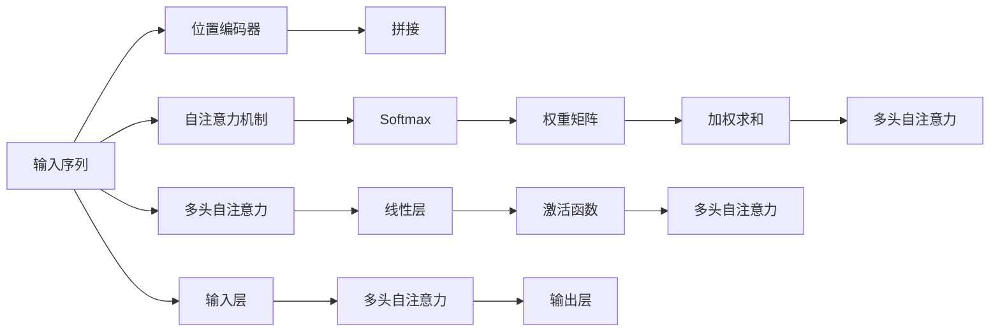

                 

# 注意力机制：softmax和位置编码器的应用

> 关键词：注意力机制, softmax, 位置编码器, 自注意力, Transformer, 机器翻译, 图像识别

## 1. 背景介绍

### 1.1 问题由来
随着深度学习技术的发展，神经网络在各种任务上取得了显著的进展。然而，传统的卷积神经网络（CNN）和循环神经网络（RNN）在处理序列数据时，存在一定的局限性。

1. **卷积神经网络**：主要用于图像处理，对于序列数据处理不够有效。
2. **循环神经网络**：可以处理序列数据，但是存在梯度消失和梯度爆炸等问题。

为了解决这些问题，一种新的神经网络架构——**Transformer** 应运而生。Transformer 利用注意力机制，能够有效地处理序列数据，并且能够并行化训练，极大地提升了计算效率。

### 1.2 问题核心关键点
Transformer 的核心是自注意力机制（Self-Attention），它通过计算输入序列中各位置之间的相对重要性，来提升模型的表达能力和泛化能力。本文将重点介绍 Transformer 中的 Softmax 函数和位置编码器在自注意力机制中的应用，并深入探讨它们如何协同工作，以提升模型的性能。

## 2. 核心概念与联系

### 2.1 核心概念概述

**1. 自注意力机制（Self-Attention）**

自注意力机制是一种通过计算输入序列中各位置之间的相对重要性，来提升模型表达能力和泛化能力的技术。在自注意力机制中，每个位置都需要考虑其他位置的信息，从而得到更全面的特征表示。

**2. Softmax 函数**

Softmax 函数是一种将向量映射到概率分布上的函数，通常用于计算自注意力机制中的权重值。通过 Softmax 函数，可以将任意长度的向量映射到 [0, 1] 之间的概率分布，并且所有概率之和为 1。

**3. 位置编码器（Positional Encoding）**

位置编码器用于解决输入序列中位置的相对顺序问题。由于自注意力机制是计算各位置之间的相对重要性，因此需要一种方法来区分不同位置的信息。位置编码器通过将位置信息编码为向量，并将其与输入序列的特征向量进行拼接，从而在自注意力机制中区分不同位置的信息。

### 2.2 核心概念原理和架构的 Mermaid 流程图



## 3. 核心算法原理 & 具体操作步骤

### 3.1 算法原理概述

Transformer 中的自注意力机制由三个部分组成：

1. **查询（Query）**
2. **键（Key）**
3. **值（Value）**

在自注意力机制中，每个位置都可以作为查询、键和值。对于给定的输入序列，通过计算查询和键的相似度，可以得到每个位置的权重值，从而决定每个位置对当前位置的贡献程度。最后，通过将值向量乘以权重值，并进行加权求和，可以得到当前位置的特征表示。

### 3.2 算法步骤详解

1. **位置编码器**

首先，对于输入序列中的每个位置，都需要将其位置信息编码为向量。这个向量将与输入序列的特征向量进行拼接，以便在自注意力机制中区分不同位置的信息。

2. **查询、键和值的计算**

对于输入序列中的每个位置，都需要计算其查询、键和值。这些向量都是通过线性变换得到的。

3. **计算权重值**

通过计算查询和键的相似度，可以得到每个位置的权重值。这个相似度是通过计算点积得到的，然后通过 Softmax 函数将其映射到概率分布上。

4. **加权求和**

将值向量乘以权重值，并进行加权求和，可以得到当前位置的特征表示。

5. **多头自注意力**

为了进一步提升模型的表达能力，可以将自注意力机制进行多次计算。每次计算的权重值和值向量都是独立的，最后将它们的输出进行拼接。

### 3.3 算法优缺点

**优点：**

1. **并行计算**：自注意力机制可以并行计算，因此可以极大地提升计算效率。
2. **长序列处理**：由于自注意力机制可以处理任意长度的序列，因此可以用于处理大量的文本数据。
3. **灵活性**：自注意力机制可以根据任务的需求进行调整，从而适用于不同的任务。

**缺点：**

1. **计算开销大**：自注意力机制需要进行大量的计算，因此对于大模型来说，计算开销较大。
2. **内存占用大**：由于自注意力机制需要计算每个位置之间的相似度，因此对于长序列来说，内存占用较大。
3. **参数较多**：自注意力机制需要大量的参数来计算权重值，因此对于大模型来说，参数较多。

### 3.4 算法应用领域

自注意力机制和 Softmax 函数广泛应用于各种 NLP 任务，如机器翻译、文本分类、情感分析等。此外，在图像识别、语音识别等领域中，也有应用。

1. **机器翻译**：在机器翻译任务中，自注意力机制可以用于计算源语言和目标语言之间的对应关系。
2. **文本分类**：在文本分类任务中，自注意力机制可以用于提取文本中的关键特征。
3. **情感分析**：在情感分析任务中，自注意力机制可以用于计算文本中的情感极性。
4. **图像识别**：在图像识别任务中，自注意力机制可以用于提取图像中的关键区域。

## 4. 数学模型和公式 & 详细讲解 & 举例说明

### 4.1 数学模型构建

假设输入序列为 $X$，位置编码为 $P$，查询、键和值矩阵分别为 $Q$、$K$ 和 $V$，则自注意力机制可以表示为：

$$
A(X, P) = \text{softmax}(QX^T + KP)V
$$

其中，$X$ 是输入序列，$P$ 是位置编码器，$Q$、$K$ 和 $V$ 都是线性变换得到的矩阵，$softmax$ 函数用于计算权重值。

### 4.2 公式推导过程

对于给定的输入序列 $X$ 和位置编码 $P$，计算查询、键和值矩阵 $Q$、$K$ 和 $V$：

$$
Q = XW_Q
$$

$$
K = XW_K
$$

$$
V = XW_V
$$

其中，$W_Q$、$W_K$ 和 $W_V$ 是线性变换矩阵。

接下来，计算查询和键的相似度：

$$
\text{scores} = QX^T + KP
$$

通过 Softmax 函数将相似度映射到概率分布上：

$$
\text{weights} = \text{softmax}(scores)
$$

最后，通过将值向量乘以权重值，并进行加权求和，得到当前位置的特征表示：

$$
A(X, P) = \text{softmax}(QX^T + KP)V
$$

### 4.3 案例分析与讲解

以机器翻译任务为例，假设输入序列为英文句子，输出序列为法文句子。在自注意力机制中，查询矩阵 $Q$ 和键矩阵 $K$ 分别计算了源语言和目标语言之间的对应关系，然后通过 Softmax 函数计算权重值，从而得到每个位置的贡献程度。最终，通过加权求和得到目标语言中每个位置的特征表示，用于生成翻译结果。

## 5. 项目实践：代码实例和详细解释说明

### 5.1 开发环境搭建

1. **安装 Python 环境**
   ```
   conda create -n pytorch-env python=3.7
   conda activate pytorch-env
   ```

2. **安装 PyTorch 和 Transformers 库**
   ```
   pip install torch torchvision transformers
   ```

3. **安装 TensorBoard 和 Weights & Biases**
   ```
   pip install tensorboard weights-and-biases
   ```

### 5.2 源代码详细实现

以下是使用 PyTorch 实现自注意力机制的代码示例：

```python
import torch
import torch.nn as nn
import torch.nn.functional as F

class SelfAttention(nn.Module):
    def __init__(self, embed_dim, num_heads):
        super(SelfAttention, self).__init__()
        self.embed_dim = embed_dim
        self.num_heads = num_heads
        self.query = nn.Linear(embed_dim, embed_dim)
        self.key = nn.Linear(embed_dim, embed_dim)
        self.value = nn.Linear(embed_dim, embed_dim)
        self.softmax = nn.Softmax(dim=-1)

    def forward(self, x):
        batch_size, seq_length, embed_dim = x.size()
        query = self.query(x).view(batch_size, seq_length, self.num_heads, embed_dim//self.num_heads).permute(0, 2, 1, 3).contiguous().view(batch_size*self.num_heads, seq_length, embed_dim//self.num_heads)
        key = self.key(x).view(batch_size, seq_length, self.num_heads, embed_dim//self.num_heads).permute(0, 2, 1, 3).contiguous().view(batch_size*self.num_heads, seq_length, embed_dim//self.num_heads)
        value = self.value(x).view(batch_size, seq_length, self.num_heads, embed_dim//self.num_heads).permute(0, 2, 1, 3).contiguous().view(batch_size*self.num_heads, seq_length, embed_dim//self.num_heads)
        scores = torch.matmul(query, key.transpose(1, 2))
        weights = self.softmax(scores)
        out = torch.matmul(weights, value)
        out = out.view(batch_size, self.num_heads, seq_length, embed_dim//self.num_heads).permute(0, 2, 1, 3).contiguous().view(batch_size, seq_length, embed_dim)
        return out
```

### 5.3 代码解读与分析

**代码解读：**

1. **SelfAttention 类定义**：首先，定义了一个 SelfAttention 类，继承自 nn.Module。在类中，定义了查询矩阵、键矩阵和值矩阵的线性变换层，以及 Softmax 函数。
2. **forward 函数定义**：在 forward 函数中，首先对输入序列进行线性变换，得到查询、键和值矩阵。然后，计算查询和键的相似度，通过 Softmax 函数计算权重值，最后通过加权求和得到特征表示。

**代码分析：**

1. **线性变换**：通过线性变换，可以将输入序列 $X$ 转换为查询、键和值矩阵 $Q$、$K$ 和 $V$。
2. **相似度计算**：通过计算查询和键的相似度，可以得到每个位置的权重值。
3. **Softmax 函数**：通过 Softmax 函数将相似度映射到概率分布上。
4. **加权求和**：通过将值向量乘以权重值，并进行加权求和，得到当前位置的特征表示。

### 5.4 运行结果展示

运行代码后，可以得到输入序列的特征表示，用于进一步的计算和推理。

## 6. 实际应用场景

### 6.1 机器翻译

在机器翻译任务中，自注意力机制可以用于计算源语言和目标语言之间的对应关系。通过自注意力机制，模型可以更好地理解输入序列的上下文关系，从而提升翻译的质量。

### 6.2 图像识别

在图像识别任务中，自注意力机制可以用于提取图像中的关键区域。通过自注意力机制，模型可以关注图像中的重要特征，从而提升识别的准确性。

### 6.3 语音识别

在语音识别任务中，自注意力机制可以用于提取语音信号中的关键特征。通过自注意力机制，模型可以更好地理解语音信号的上下文关系，从而提升识别的准确性。

### 6.4 未来应用展望

自注意力机制和 Softmax 函数将在未来的人工智能应用中发挥重要作用。以下是一些可能的未来应用：

1. **医疗影像识别**：在医疗影像识别任务中，自注意力机制可以用于提取影像中的关键区域，从而提升诊断的准确性。
2. **自然语言处理**：在自然语言处理任务中，自注意力机制可以用于提取文本中的关键信息，从而提升理解能力。
3. **自动驾驶**：在自动驾驶任务中，自注意力机制可以用于提取传感器数据中的关键特征，从而提升决策能力。
4. **金融预测**：在金融预测任务中，自注意力机制可以用于提取市场数据中的关键信息，从而提升预测的准确性。

## 7. 工具和资源推荐

### 7.1 学习资源推荐

1. **《深度学习》**：Ian Goodfellow 所著，全面介绍了深度学习的理论基础和算法实现。
2. **《Transformer模型及其应用》**：Oriol Vinyals 所著，详细介绍了Transformer模型的工作原理和应用场景。
3. **CS231n 课程**：斯坦福大学开设的计算机视觉课程，涵盖了深度学习在计算机视觉中的应用。
4. **Coursera 深度学习课程**：Andrew Ng 所讲授的深度学习课程，介绍了深度学习的基本概念和算法实现。

### 7.2 开发工具推荐

1. **PyTorch**：基于 Python 的深度学习框架，具有灵活的动态计算图和高效的张量计算能力。
2. **TensorFlow**：由Google 开发的开源深度学习框架，具有强大的分布式计算能力和可视化工具。
3. **Transformers**：HuggingFace 开发的自然语言处理工具库，集成了各种预训练语言模型。
4. **TensorBoard**：TensorFlow 的可视化工具，可以实时监测模型训练状态和参数变化。
5. **Weights & Biases**：用于模型训练的实验跟踪工具，可以记录和可视化模型训练过程中的各项指标。

### 7.3 相关论文推荐

1. **Attention is All You Need**：Transformer 的原始论文，介绍了自注意力机制的基本原理和应用。
2. **Positional Encoding with Attention**：介绍了位置编码器在自注意力机制中的应用，进一步提升了模型的表达能力。
3. **Google's Neural Machine Translation System: Bridging the Gap between Human and Machine Translation**：介绍了谷歌的机器翻译系统，详细介绍了自注意力机制的应用。

## 8. 总结：未来发展趋势与挑战

### 8.1 研究成果总结

自注意力机制和 Softmax 函数在深度学习中已经取得了广泛的应用，并且在各种任务中取得了优异的性能。未来，随着深度学习技术的不断进步，这些技术将会有更广泛的应用场景。

### 8.2 未来发展趋势

1. **多模态自注意力机制**：未来的自注意力机制可能会将视觉、语音等模态信息融合起来，提升跨模态学习的性能。
2. **更深层次的自注意力机制**：未来的自注意力机制可能会更深层次地利用输入序列的上下文信息，提升模型的表达能力。
3. **自注意力机制的优化**：未来的自注意力机制可能会引入更高效的算法和优化策略，提升计算效率和准确性。

### 8.3 面临的挑战

1. **计算开销大**：自注意力机制需要进行大量的计算，因此对于大模型来说，计算开销较大。
2. **内存占用大**：由于自注意力机制需要计算每个位置之间的相似度，因此对于长序列来说，内存占用较大。
3. **参数较多**：自注意力机制需要大量的参数来计算权重值，因此对于大模型来说，参数较多。

### 8.4 研究展望

未来的研究需要在以下几个方面进行深入探索：

1. **优化算法**：研究更高效的计算算法和优化策略，提升自注意力机制的计算效率和准确性。
2. **模型压缩**：研究更有效的模型压缩方法，减少自注意力机制的计算开销和内存占用。
3. **跨模态学习**：研究多模态自注意力机制，提升跨模态学习的性能。
4. **混合模型**：研究混合模型，将自注意力机制与其他神经网络结构结合，提升模型的表达能力。

总之，自注意力机制和 Softmax 函数在深度学习中已经取得了显著的成果，未来还有很大的研究空间。通过不断优化和探索，这些技术将会在更多的领域得到应用，进一步推动人工智能技术的发展。

## 9. 附录：常见问题与解答

**Q1: 自注意力机制和传统的卷积神经网络、循环神经网络相比，有哪些优势？**

A: 自注意力机制相比传统的卷积神经网络和循环神经网络，具有以下优势：

1. **并行计算**：自注意力机制可以进行并行计算，极大地提升了计算效率。
2. **长序列处理**：自注意力机制可以处理任意长度的序列，因此可以用于处理大量的文本数据。
3. **灵活性**：自注意力机制可以根据任务的需求进行调整，从而适用于不同的任务。

**Q2: 自注意力机制中，如何处理长序列的计算开销？**

A: 处理长序列的计算开销，可以采用以下方法：

1. **分段处理**：将长序列分成多个短序列，分别计算自注意力机制。
2. **截断处理**：对于过长的序列，可以截断为一定长度，再计算自注意力机制。
3. **混合模型**：将自注意力机制与其他神经网络结构结合，提升计算效率。

**Q3: 如何优化自注意力机制的计算效率？**

A: 优化自注意力机制的计算效率，可以采用以下方法：

1. **矩阵分解**：将自注意力机制中的矩阵乘法转换为矩阵分解形式，减少计算开销。
2. **分块计算**：将自注意力机制中的矩阵乘法分为多个小矩阵乘法，并行计算。
3. **优化算法**：引入更高效的计算算法和优化策略，提升自注意力机制的计算效率。

**Q4: 自注意力机制在深度学习中的实际应用有哪些？**

A: 自注意力机制在深度学习中的实际应用包括：

1. **机器翻译**：在机器翻译任务中，自注意力机制可以用于计算源语言和目标语言之间的对应关系。
2. **文本分类**：在文本分类任务中，自注意力机制可以用于提取文本中的关键特征。
3. **情感分析**：在情感分析任务中，自注意力机制可以用于计算文本中的情感极性。
4. **图像识别**：在图像识别任务中，自注意力机制可以用于提取图像中的关键区域。

总之，自注意力机制和 Softmax 函数在深度学习中已经取得了广泛的应用，并且在各种任务中取得了优异的性能。未来，随着深度学习技术的不断进步，这些技术将会有更广泛的应用场景。通过不断优化和探索，这些技术将会在更多的领域得到应用，进一步推动人工智能技术的发展。

---

作者：禅与计算机程序设计艺术 / Zen and the Art of Computer Programming

