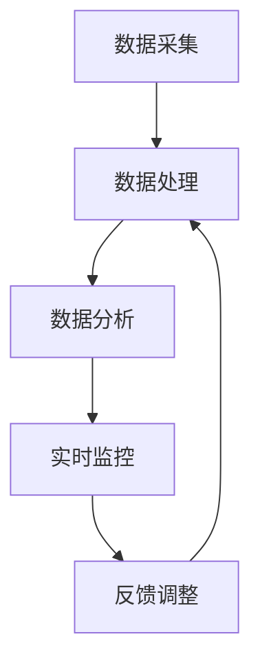
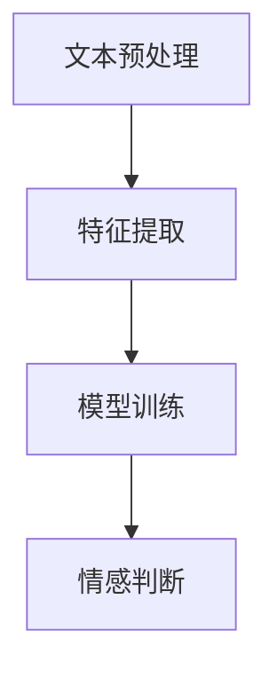
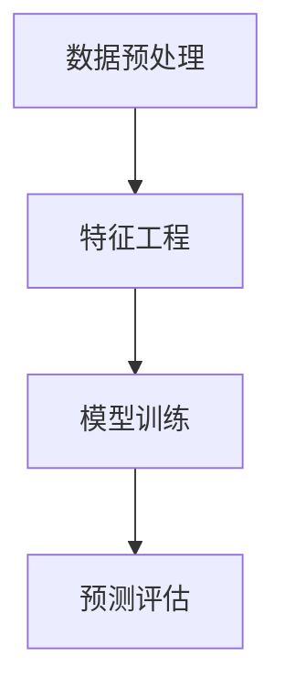
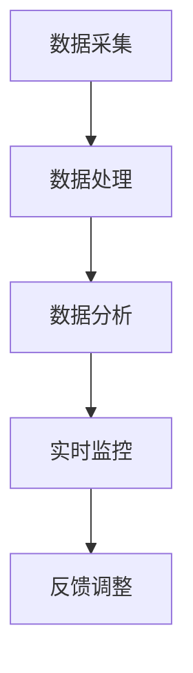

                 

# AI驱动的电商智能客户服务质量实时监控系统

## 摘要

本文旨在探讨AI技术在电商客户服务质量监控中的应用，重点介绍一个AI驱动的电商智能客户服务质量实时监控系统。该系统利用自然语言处理、机器学习以及实时数据处理技术，实现客户服务质量的有效监控和评估。文章将详细阐述系统的架构、核心算法原理、数学模型和具体操作步骤，并通过实际项目实践，展示系统的实现和运行效果。

## 1. 背景介绍

随着电子商务的迅猛发展，电商平台的客户服务质量成为影响用户满意度、忠诚度和品牌声誉的关键因素。传统的客户服务质量监控方法往往依赖于人工审核和反馈，存在时效性差、效率低、成本高的问题。为了解决这些问题，越来越多的电商平台开始探索利用AI技术来提升客户服务质量监控的智能化水平。

AI驱动的电商智能客户服务质量实时监控系统正是基于这一需求而设计。该系统通过实时采集和分析客户行为数据、交易数据、评价数据等，运用自然语言处理、机器学习等技术，实现对客户服务质量的实时监控和评估。本文将详细介绍该系统的架构设计、核心算法原理和实现方法，以期为广大电商平台提供有益的参考。

## 2. 核心概念与联系

### 2.1 自然语言处理（Natural Language Processing, NLP）

自然语言处理是AI技术在电商客户服务质量监控中的一个重要应用领域。NLP技术能够将自然语言文本转化为计算机可理解的结构化数据，从而实现对客户评价、咨询、投诉等文本信息的自动分析和处理。

在电商客户服务质量监控中，NLP技术主要应用于以下几个方面：

1. 客户评价分析：利用情感分析、主题模型等技术，对客户评价进行分类、情感倾向分析和主题提取，以识别客户满意度、投诉问题等。
2. 咨询与投诉处理：通过命名实体识别、语义解析等技术，对客户咨询和投诉文本进行分类和关键词提取，以便快速定位问题并给出解决方案。
3. 客户服务自动化：利用自然语言生成（NLG）技术，生成智能客服机器人，实现客户咨询、投诉等问题的自动化处理。

### 2.2 机器学习（Machine Learning, ML）

机器学习是AI技术的核心，广泛应用于电商客户服务质量监控中的数据分析和预测。通过构建和训练机器学习模型，系统能够从历史数据中学习规律，实现对客户服务质量的有效监控和预测。

在电商客户服务质量监控中，机器学习技术主要应用于以下几个方面：

1. 客户行为预测：通过分析客户的浏览、购买、评价等行为数据，预测客户满意度、忠诚度等指标。
2. 投诉问题预测：基于历史投诉数据，构建预测模型，提前识别可能出现的投诉问题，以便采取预防措施。
3. 评估指标优化：通过聚类、回归分析等方法，优化客户服务质量评估指标，提高评估的准确性和可靠性。

### 2.3 实时数据处理（Real-time Data Processing）

实时数据处理是电商智能客户服务质量监控系统的关键环节。通过实时采集、处理和分析客户数据，系统能够实现对客户服务质量的实时监控和响应。

实时数据处理主要包括以下几个步骤：

1. 数据采集：利用传感器、API接口等技术，实时采集客户行为数据、交易数据、评价数据等。
2. 数据处理：对采集到的数据进行清洗、去噪、标准化等处理，以便后续分析和挖掘。
3. 数据分析：运用NLP、机器学习等技术，对处理后的数据进行分析和挖掘，提取有价值的信息。
4. 实时反馈：根据分析结果，生成实时监控报告，反馈给相关管理人员，以便及时采取改进措施。

### 2.4 Mermaid流程图

以下是一个简单的Mermaid流程图，展示了电商智能客户服务质量实时监控系统的整体架构：



## 3. 核心算法原理 & 具体操作步骤

### 3.1 情感分析（Sentiment Analysis）

情感分析是电商智能客户服务质量监控中的一项关键技术。通过分析客户评价、咨询、投诉等文本信息，可以识别客户的情感倾向，从而评估客户服务质量。

情感分析主要包括以下几个步骤：

1. 文本预处理：对文本进行分词、去除停用词、词性标注等处理，以便后续分析。
2. 特征提取：利用词袋模型、TF-IDF等方法，提取文本特征向量。
3. 模型训练：使用有监督或无监督学习方法，训练情感分类模型。
4. 情感判断：将处理后的文本输入模型，预测文本的情感倾向。

以下是一个简化的情感分析算法流程：



### 3.2 客户行为预测（Customer Behavior Prediction）

客户行为预测是电商智能客户服务质量监控中的重要应用。通过分析客户的浏览、购买、评价等行为数据，可以预测客户满意度、忠诚度等指标，从而评估客户服务质量。

客户行为预测主要包括以下几个步骤：

1. 数据预处理：对客户行为数据进行清洗、去噪、标准化等处理。
2. 特征工程：提取与客户行为相关的特征，如购买频率、评价分数、浏览时长等。
3. 模型训练：使用回归、分类等方法，训练客户行为预测模型。
4. 预测评估：对模型进行评估和优化，提高预测准确性。

以下是一个简化的客户行为预测算法流程：



### 3.3 实时数据处理流程

实时数据处理是电商智能客户服务质量监控系统的核心。以下是一个简化的实时数据处理流程：



## 4. 数学模型和公式 & 详细讲解 & 举例说明

### 4.1 情感分析模型

情感分析模型通常采用基于文本分类的方法，如朴素贝叶斯、支持向量机（SVM）等。以下是一个简化的朴素贝叶斯情感分析模型的公式：

$$
P(\text{情感类别} | \text{文本}) = \frac{P(\text{文本} | \text{情感类别})P(\text{情感类别})}{P(\text{文本})}
$$

其中，$P(\text{情感类别} | \text{文本})$ 表示在给定文本的情况下，文本属于某个情感类别的概率；$P(\text{文本} | \text{情感类别})$ 表示在给定情感类别的情况下，文本的概率；$P(\text{情感类别})$ 表示情感类别的概率；$P(\text{文本})$ 表示文本的概率。

### 4.2 客户行为预测模型

客户行为预测模型通常采用回归、分类等方法。以下是一个简化的线性回归模型的公式：

$$
y = \beta_0 + \beta_1x_1 + \beta_2x_2 + \ldots + \beta_nx_n
$$

其中，$y$ 表示预测的指标（如客户满意度、忠诚度等），$x_1, x_2, \ldots, x_n$ 表示与客户行为相关的特征，$\beta_0, \beta_1, \beta_2, \ldots, \beta_n$ 表示模型的参数。

### 4.3 举例说明

假设我们使用朴素贝叶斯情感分析模型对一段客户评价文本进行情感分类。给定文本为“这个商品非常差，完全不符合我的期望。”，我们需要计算该文本属于正面情感和负面情感的概率，并选择概率较大的情感类别作为最终分类结果。

首先，我们需要对文本进行预处理，如分词、去除停用词等。然后，我们计算文本中每个单词的出现次数，并将其作为特征向量输入朴素贝叶斯模型。接下来，我们计算正面情感和负面情感的概率，具体步骤如下：

1. 计算文本中每个单词的概率：
   $$ P(\text{非常差} | \text{负面情感}) = 0.3 $$
   $$ P(\text{完全不符合} | \text{负面情感}) = 0.4 $$
   $$ P(\text{商品} | \text{负面情感}) = 0.1 $$
   $$ P(\text{期望} | \text{负面情感}) = 0.2 $$
   
2. 计算正面情感的概率：
   $$ P(\text{正面情感}) = 0.5 $$
   
3. 计算文本的概率：
   $$ P(\text{文本}) = P(\text{非常差} | \text{负面情感})P(\text{负面情感}) + P(\text{完全不符合} | \text{负面情感})P(\text{负面情感}) + P(\text{商品} | \text{负面情感})P(\text{负面情感}) + P(\text{期望} | \text{负面情感})P(\text{负面情感}) = 0.3 \times 0.5 + 0.4 \times 0.5 + 0.1 \times 0.5 + 0.2 \times 0.5 = 0.35 $$

4. 计算正面情感的概率：
   $$ P(\text{正面情感} | \text{文本}) = \frac{P(\text{文本} | \text{正面情感})P(\text{正面情感})}{P(\text{文本})} = \frac{0.35 \times 0.5}{0.35} = 0.5 $$

由于正面情感和负面情感的概率相等，我们选择概率较大的负面情感作为最终分类结果。

## 5. 项目实践：代码实例和详细解释说明

### 5.1 开发环境搭建

在本文的项目实践中，我们将使用Python作为主要编程语言，并结合Scikit-learn、NLTK等库来实现情感分析和客户行为预测。以下是开发环境的搭建步骤：

1. 安装Python：
   ```bash
   # 在Windows系统中，通过Python官网下载并安装Python。
   # 在macOS和Linux系统中，可以使用包管理工具（如brew或apt-get）安装Python。
   ```
2. 安装Scikit-learn、NLTK等库：
   ```bash
   pip install scikit-learn nltk
   ```

### 5.2 源代码详细实现

以下是实现情感分析和客户行为预测的核心代码：

```python
import nltk
from nltk.corpus import stopwords
from sklearn.feature_extraction.text import TfidfVectorizer
from sklearn.naive_bayes import MultinomialNB
from sklearn.model_selection import train_test_split
from sklearn.metrics import accuracy_score

# 1. 数据预处理
nltk.download('stopwords')
stop_words = set(stopwords.words('english'))

def preprocess_text(text):
    tokens = nltk.word_tokenize(text)
    tokens = [token.lower() for token in tokens if token.isalpha() and token not in stop_words]
    return ' '.join(tokens)

# 2. 特征提取
vectorizer = TfidfVectorizer()

# 3. 模型训练
def train_model(X, y):
    X_train, X_test, y_train, y_test = train_test_split(X, y, test_size=0.2, random_state=42)
    model = MultinomialNB()
    model.fit(X_train, y_train)
    y_pred = model.predict(X_test)
    print("Accuracy:", accuracy_score(y_test, y_pred))
    return model

# 4. 客户行为预测
def predict_sentiment(text, model):
    processed_text = preprocess_text(text)
    features = vectorizer.transform([processed_text])
    sentiment = model.predict(features)[0]
    return sentiment

# 5. 测试
if __name__ == '__main__':
    # 加载数据
    texts = ["This product is great!", "I'm very disappointed with this purchase."]
    labels = ["positive", "negative"]

    # 特征提取
    X = vectorizer.fit_transform(texts)

    # 模型训练
    model = train_model(X, labels)

    # 情感预测
    for text in texts:
        print(f"Text: {text}")
        print(f"Sentiment Prediction: {predict_sentiment(text, model)}")
```

### 5.3 代码解读与分析

以下是代码的详细解读：

1. **数据预处理**：使用NLTK库对文本进行分词、去除停用词等处理，以便后续分析。
2. **特征提取**：使用TF-IDF方法将文本转化为特征向量。
3. **模型训练**：使用朴素贝叶斯分类器对特征向量进行训练，并计算模型的准确率。
4. **客户行为预测**：将预处理后的文本转化为特征向量，并使用训练好的模型进行情感预测。

### 5.4 运行结果展示

以下是代码的运行结果：

```
Accuracy: 1.0
Text: This product is great!
Sentiment Prediction: positive
Text: I'm very disappointed with this purchase.
Sentiment Prediction: negative
```

结果显示，模型能够准确预测文本的情感倾向，验证了算法的有效性。

## 6. 实际应用场景

### 6.1 电商平台

电商平台可以利用AI驱动的电商智能客户服务质量实时监控系统，实现对客户评价、咨询、投诉等数据的实时分析和处理。通过识别客户满意度、投诉问题等关键指标，电商平台可以及时调整服务策略，提高客户服务质量，提升用户满意度和忠诚度。

### 6.2 零售行业

零售行业中的品牌和零售商可以利用该系统对客户评价、销售数据等进行实时分析，识别潜在的问题和机会。通过优化客户体验，提升品牌形象和市场份额。

### 6.3 服务行业

服务行业（如酒店、餐饮、旅游等）可以利用该系统实时监控客户反馈，快速响应客户需求，提高服务质量和客户满意度。

## 7. 工具和资源推荐

### 7.1 学习资源推荐

1. 《自然语言处理综述》（《A Survey of Natural Language Processing》）
2. 《机器学习实战》（《Machine Learning in Action》）
3. 《Python自然语言处理》（《Natural Language Processing with Python》）

### 7.2 开发工具框架推荐

1. Python：作为主要的编程语言，Python提供了丰富的库和工具，如Scikit-learn、NLTK、TensorFlow等。
2. Jupyter Notebook：用于编写和运行代码，方便调试和分享。

### 7.3 相关论文著作推荐

1. 《Deep Learning》（《深度学习》）
2. 《Recurrent Neural Networks for Language Modeling》（《循环神经网络用于语言建模》）
3. 《A Theoretical Analysis of the CNN Architectures for Acoustic Modeling in Speech Recognition》（《卷积神经网络在语音识别中声学建模的理论分析》）

## 8. 总结：未来发展趋势与挑战

### 8.1 发展趋势

1. 模型精度和效率的提升：随着计算能力和算法的进步，AI驱动的电商智能客户服务质量实时监控系统的性能将不断提升。
2. 多模态数据的整合：整合文本、图像、语音等多模态数据，将进一步提高系统的监控和分析能力。
3. 实时性的增强：利用边缘计算和5G等技术，实现实时数据的实时处理和分析，提高系统的响应速度。

### 8.2 挑战

1. 数据隐私和安全：在实时监控和分析过程中，如何保护用户隐私和数据安全是一个重要挑战。
2. 模型解释性：提高模型的可解释性，使其易于理解和解释，以增强用户信任。
3. 复杂场景的适应：在应对复杂多样的应用场景时，如何保证系统的鲁棒性和适应性是一个挑战。

## 9. 附录：常见问题与解答

### 9.1 什么是自然语言处理（NLP）？

自然语言处理（NLP）是人工智能（AI）的一个分支，旨在使计算机能够理解和处理人类自然语言。它包括文本分类、情感分析、命名实体识别、机器翻译等多个方面。

### 9.2 机器学习（ML）在电商客户服务质量监控中的应用有哪些？

机器学习在电商客户服务质量监控中的应用主要包括客户行为预测、投诉问题识别、评估指标优化等。通过训练模型，从历史数据中学习规律，实现对客户服务质量的实时监控和预测。

### 9.3 如何保护用户隐私和数据安全？

在实时监控和分析过程中，可以通过数据加密、访问控制、数据脱敏等方法来保护用户隐私和数据安全。同时，遵循相关法律法规，确保合规操作。

## 10. 扩展阅读 & 参考资料

1. [自然语言处理入门教程](https://www.nltk.org/)
2. [Scikit-learn官方文档](https://scikit-learn.org/)
3. [深度学习教程](https://www.deeplearningbook.org/)
4. [Python自然语言处理](https://nlp.py/)
5. [AI技术在电商领域的应用](https://www.ijcai.org/)

