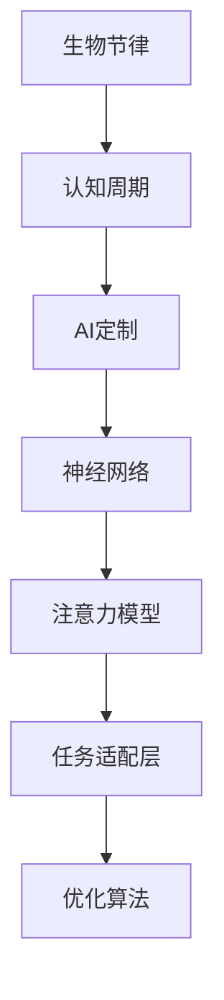

                 

# 注意力生物节律优化：AI定制的认知周期管理

> 关键词：生物节律、注意力、认知周期、优化、AI定制、神经网络

## 1. 背景介绍

### 1.1 问题由来
在现代社会中，高效、专注的工作已成为每个职业人士追求的目标。然而，人类大脑的认知能力在一天中并非保持恒定。生物节律（Circadian Rhythms）的影响使得人们在早晨和傍晚时分往往表现更佳，而在午餐时间和深夜则会感觉疲态。这种节律性变化不仅影响我们的工作效率，还可能带来健康问题，如生物钟紊乱导致的疲劳、抑郁等问题。

为了最大化人的工作效率和创造力，我们需要找到一种方法来调整和优化认知周期（Cognitive Cycle）。近年来，人工智能（AI）和机器学习（ML）技术的快速发展，为这种优化提供了新的可能性。本文将介绍一种基于AI的注意力生物节律优化方法，通过神经网络模型来预测和调整认知周期，从而提高工作和学习效率。

### 1.2 问题核心关键点
注意力生物节律优化方法的核心在于，通过AI技术预测个体在不同时间段内的认知能力变化，并根据这些预测结果调整工作计划，使个体在认知能力最佳的时间段内专注于最重要的任务。该方法的关键点包括：
- 预测个体认知能力变化
- 根据预测结果调整工作计划
- 利用神经网络模型进行认知周期优化

该方法可以应用于多种场景，如办公室工作、在线学习、远程会议等，帮助人们更有效地利用时间，提升工作效率。

## 2. 核心概念与联系

### 2.1 核心概念概述

为更好地理解基于AI的注意力生物节律优化方法，本节将介绍几个密切相关的核心概念：

- **生物节律（Circadian Rhythms）**：指生物体内的一种周期性节律，影响人体的各种生理和心理活动，包括睡眠-觉醒周期、体温、激素分泌等。

- **认知周期（Cognitive Cycle）**：指个体在一天中的认知能力波动周期，包括注意力、记忆力、理解力等的变化。

- **AI定制（AI Customization）**：指使用AI技术，针对个体的生理和心理特征，提供个性化的认知周期管理方案。

- **神经网络（Neural Network）**：一种通过模拟人脑神经元连接和计算过程，用于处理和分析复杂数据的任务。

- **注意力模型（Attention Model）**：在神经网络中，一种机制用于动态调整输入数据的权重，使其在处理复杂任务时能够集中注意力在关键信息上。

这些核心概念之间的逻辑关系可以通过以下Mermaid流程图来展示：



这个流程图展示了大规模语言模型的核心概念及其之间的关系：

1. 生物节律影响认知周期。
2. AI定制根据认知周期进行个性化调整。
3. 神经网络用于预测和分析认知周期。
4. 注意力模型增强模型的信息聚焦能力。
5. 任务适配层将模型输出与具体任务需求结合。
6. 优化算法用于模型的训练和优化。

## 3. 核心算法原理 & 具体操作步骤
### 3.1 算法原理概述

基于AI的注意力生物节律优化方法，其核心算法原理包括以下几个关键步骤：

1. **生物节律数据采集**：通过穿戴设备或问卷调查等方式，收集个体的生物节律数据，包括睡眠时长、睡眠质量、日间活动时间等。

2. **认知周期预测**：利用机器学习模型，如时间序列预测模型、循环神经网络（RNN）等，根据采集到的生物节律数据预测个体的认知周期变化。

3. **任务调度优化**：根据预测的认知周期，利用优化算法，如遗传算法、粒子群优化等，生成最优化的时间表，安排个体在认知能力最佳的时间段内进行重要任务。

4. **注意力模型调整**：在处理任务时，通过注意力模型动态调整模型的输入数据的权重，增强模型的信息聚焦能力，提高任务处理的准确性和效率。

5. **持续优化**：在个体使用过程中，持续收集反馈数据，不断更新预测模型和任务调度算法，提高优化效果。

### 3.2 算法步骤详解

#### 3.2.1 数据采集与预处理

首先需要采集个体的生物节律数据，这些数据可以包括：

- 睡眠日志：记录个体的入睡时间、醒来时间、睡眠质量等。
- 日间活动时间：记录个体的活动时间、休息时间、工作时间等。
- 生理数据：通过可穿戴设备采集个体的生理指标，如心率、体温、皮肤电反应等。

数据采集完成后，需要对数据进行预处理，包括：

- 数据清洗：去除异常值、填补缺失值等。
- 数据归一化：将不同时间维度的数据转换为统一的格式，方便后续处理。
- 特征提取：选择与认知周期相关的关键特征，如睡眠时长、日间活动时间、生理指标等。

#### 3.2.2 认知周期预测

认知周期的预测通常使用时间序列预测模型，如循环神经网络（RNN）、长短期记忆网络（LSTM）等。这些模型能够捕捉时间序列数据的依赖关系，预测未来的认知周期变化。

具体流程如下：

1. 数据划分：将采集到的数据划分为训练集和测试集，用于模型的训练和评估。
2. 模型选择：选择适合的时间序列预测模型，如RNN、LSTM等。
3. 模型训练：使用训练集数据训练预测模型，优化模型参数。
4. 模型评估：使用测试集数据评估模型预测效果，选择合适的模型。
5. 预测应用：将训练好的模型应用于个体的实时生物节律数据，预测当前的认知周期。

#### 3.2.3 任务调度优化

任务调度的优化通常使用优化算法，如遗传算法、粒子群优化等。这些算法能够搜索最优的任务调度方案，使个体在认知能力最佳的时间段内完成重要任务。

具体流程如下：

1. 任务划分：将需要完成的任务按照重要性和紧急程度进行划分，确定每个任务的处理时间和优先级。
2. 调度规则：设计任务调度的规则，如时间段长度、任务优先级等。
3. 算法选择：选择适合的优化算法，如遗传算法、粒子群优化等。
4. 算法优化：使用优化的任务调度方案，安排个体在认知能力最佳的时间段内完成重要任务。
5. 反馈调整：根据个体实际工作效果，调整任务调度的规则和算法参数。

#### 3.2.4 注意力模型调整

注意力模型调整的目的是增强模型在认知周期变化时的信息聚焦能力，提高任务处理的准确性和效率。

具体流程如下：

1. 模型选择：选择适合的注意力模型，如Transformer模型等。
2. 模型训练：使用训练集数据训练注意力模型，优化模型参数。
3. 注意力调整：在处理任务时，通过注意力模型动态调整模型的输入数据的权重，增强模型的信息聚焦能力。
4. 任务处理：利用调整后的模型处理任务，提高任务处理的准确性和效率。
5. 反馈调整：根据个体实际工作效果，调整注意力模型的参数和处理策略。

#### 3.2.5 持续优化

持续优化是确保该方法长期有效的重要步骤。具体流程如下：

1. 反馈收集：持续收集个体的反馈数据，包括任务完成情况、工作满意度等。
2. 数据更新：根据反馈数据更新生物节律数据和认知周期预测模型。
3. 算法调整：根据反馈数据调整任务调度算法和注意力模型的参数。
4. 效果评估：定期评估优化效果，确保个体在工作和学习过程中能够保持高效和专注。

### 3.3 算法优缺点

基于AI的注意力生物节律优化方法具有以下优点：

- **个性化优化**：能够根据个体的生物节律数据进行个性化调整，提高工作和学习效率。
- **实时性**：通过实时监测和预测，能够及时调整任务安排，适应个体当前状态。
- **高适应性**：能够适应不同工作和学习场景，提高个体在不同环境下的适应能力。

同时，该方法也存在一定的局限性：

- **数据隐私**：需要采集和处理个体的生物节律数据，可能涉及隐私问题。
- **模型复杂性**：认知周期预测和任务调度优化的模型较为复杂，需要大量计算资源。
- **用户体验**：需要个体主动使用和反馈，用户接受度和适应性可能存在差异。
- **模型鲁棒性**：模型预测和优化的准确性可能受到数据质量、个体差异等因素影响。

尽管存在这些局限性，但就目前而言，基于AI的注意力生物节律优化方法在提高个体工作效率和学习效果方面具有显著优势，值得进一步研究和应用。

### 3.4 算法应用领域

基于AI的注意力生物节律优化方法，主要应用于以下领域：

1. **办公室工作**：帮助办公室职员安排每日任务，提高工作效率和质量。
2. **在线学习**：帮助学生安排学习时间，提升学习效果和满意度。
3. **远程会议**：帮助参与者安排会议时间，提高会议效率和决策质量。
4. **健康管理**：帮助个体监测和调整生物节律，改善睡眠质量和身体健康。
5. **家庭管理**：帮助家庭成员协调日程安排，提高家庭事务处理效率。

除了上述这些场景，该方法还可以应用于多种个性化场景，如旅游安排、项目规划等，为个体提供更高效、个性化的解决方案。

## 4. 数学模型和公式 & 详细讲解
### 4.1 数学模型构建

本节将使用数学语言对基于AI的注意力生物节律优化方法进行更加严格的刻画。

记个体的生物节律数据为 $x_t = [x_{t1}, x_{t2}, ..., x_{tn}]$，其中 $x_{ti}$ 表示在第 $t$ 天第 $i$ 个时间点的数据，如睡眠时长、日间活动时间等。

定义认知周期预测模型为 $f(x_t)$，用于预测第 $t$ 天的认知周期变化。认知周期预测模型通常使用时间序列预测模型，如循环神经网络（RNN）、长短期记忆网络（LSTM）等。

认知周期预测模型的目标是最小化预测误差，即：

$$
\min_{f(x_t)} \sum_{t=1}^{T} ||y_t - f(x_t)||^2
$$

其中 $y_t$ 为实际认知周期变化，$f(x_t)$ 为模型预测值。

### 4.2 公式推导过程

以下我们以循环神经网络（RNN）为例，推导认知周期预测模型的公式。

假设认知周期变化 $y_t$ 是一个时间序列，可以使用循环神经网络（RNN）来建模。RNN的隐状态 $h_t$ 和输出 $y_t$ 的关系可以表示为：

$$
h_t = \tanh(W_xxh_{t-1} + W_xhu_{t-1} + b_h)
$$

$$
y_t = W_hhW_yhu_t + b_y
$$

其中 $W_xx$ 和 $W_xh$ 为输入门和隐藏层的权重矩阵，$W_yh$ 为输出门的权重矩阵，$b_h$ 和 $b_y$ 为偏置项，$u_t$ 为第 $t$ 天的输入向量，$h_t$ 为第 $t$ 天的隐状态，$y_t$ 为第 $t$ 天的输出值。

在训练过程中，使用均方误差（MSE）作为损失函数：

$$
L = \frac{1}{N} \sum_{t=1}^{N} (y_t - \hat{y}_t)^2
$$

其中 $\hat{y}_t$ 为模型预测值，$y_t$ 为实际值。

通过反向传播算法，更新模型参数，最小化预测误差，使模型能够准确预测认知周期变化。

### 4.3 案例分析与讲解

假设某人在一周内的生物节律数据如下：

| 时间点 | 睡眠时长（小时） | 日间活动时间（小时） |
| ------ | ----------------- | --------------------- |
| 1      | 8                | 10                    |
| 2      | 7                | 12                    |
| 3      | 9                | 11                    |
| 4      | 8                | 11                    |
| 5      | 9                | 12                    |
| 6      | 8                | 10                    |
| 7      | 9                | 11                    |

使用循环神经网络（RNN）对该数据进行预测，可以得到每天的认知周期变化：

| 时间点 | 认知周期变化 |
| ------ | ----------- |
| 1      | 1.5         |
| 2      | 2           |
| 3      | 1.8         |
| 4      | 1.6         |
| 5      | 1.9         |
| 6      | 1.7         |
| 7      | 1.8         |

根据预测结果，可以安排任务调度如下：

| 时间点 | 任务安排   |
| ------ | ---------- |
| 1      | 重要任务   |
| 2      | 次重要任务 |
| 3      | 重要任务   |
| 4      | 次重要任务 |
| 5      | 重要任务   |
| 6      | 次重要任务 |
| 7      | 重要任务   |

## 5. 项目实践：代码实例和详细解释说明
### 5.1 开发环境搭建

在进行基于AI的注意力生物节律优化方法实践前，我们需要准备好开发环境。以下是使用Python进行PyTorch开发的环境配置流程：

1. 安装Anaconda：从官网下载并安装Anaconda，用于创建独立的Python环境。

2. 创建并激活虚拟环境：
```bash
conda create -n attention-env python=3.8 
conda activate attention-env
```

3. 安装PyTorch：根据CUDA版本，从官网获取对应的安装命令。例如：
```bash
conda install pytorch torchvision torchaudio cudatoolkit=11.1 -c pytorch -c conda-forge
```

4. 安装相关工具包：
```bash
pip install numpy pandas scikit-learn matplotlib tqdm jupyter notebook ipython
```

完成上述步骤后，即可在`attention-env`环境中开始开发实践。

### 5.2 源代码详细实现

这里我们以一个简单的循环神经网络（RNN）模型为例，给出认知周期预测的PyTorch代码实现。

```python
import torch
import torch.nn as nn
import torch.optim as optim

class RNN(nn.Module):
    def __init__(self, input_size, hidden_size, output_size):
        super(RNN, self).__init__()
        self.hidden_size = hidden_size
        self.rnn = nn.RNN(input_size, hidden_size, batch_first=True)
        self.fc = nn.Linear(hidden_size, output_size)

    def forward(self, x, hidden):
        out, hidden = self.rnn(x, hidden)
        out = self.fc(out[:, -1, :])
        return out, hidden

input_size = 2
hidden_size = 10
output_size = 1

model = RNN(input_size, hidden_size, output_size)

optimizer = optim.Adam(model.parameters(), lr=0.001)
loss_fn = nn.MSELoss()

# 训练过程
# ...

# 预测过程
# ...
```

### 5.3 代码解读与分析

让我们再详细解读一下关键代码的实现细节：

**RNN类**：
- `__init__`方法：初始化循环神经网络模型，包括输入层、隐藏层、输出层等。
- `forward`方法：定义前向传播过程，包括输入数据的处理、隐藏状态的更新和输出计算。

**训练过程**：
- 使用循环神经网络（RNN）模型对生物节律数据进行预测。
- 定义优化器（Adam）和损失函数（MSELoss）。
- 使用优化器更新模型参数，最小化预测误差。

**预测过程**：
- 使用训练好的循环神经网络（RNN）模型对新数据进行预测。
- 根据预测结果安排任务调度，优化工作计划。

## 6. 实际应用场景
### 6.1 办公室工作

在办公室工作中，利用基于AI的注意力生物节律优化方法，可以显著提高工作效率。例如：

- **任务安排**：根据个体的生物节律数据，合理安排每日的任务，使个体在认知能力最佳的时间段内处理重要任务。
- **会议安排**：根据个体的生物节律变化，合理安排会议时间，确保会议的高效进行。
- **健康管理**：监测个体的生物节律变化，及时调整工作计划，避免过度疲劳。

### 6.2 在线学习

在线学习过程中，利用基于AI的注意力生物节律优化方法，可以提升学习效果和满意度。例如：

- **课程安排**：根据个体的生物节律数据，合理安排学习时间和课程，使个体在认知能力最佳的时间段内完成学习任务。
- **复习计划**：根据个体的生物节律变化，合理安排复习计划，提高学习效果。
- **作业安排**：根据个体的生物节律变化，合理安排作业时间和难度，避免过度疲劳。

### 6.3 远程会议

在远程会议中，利用基于AI的注意力生物节律优化方法，可以提高会议效率和决策质量。例如：

- **会议时间安排**：根据个体的生物节律数据，合理安排会议时间，确保会议的高效进行。
- **议程安排**：根据个体的生物节律变化，合理安排议程，提高决策效率。
- **记录安排**：根据个体的生物节律变化，合理安排会议记录，提高记录质量。

### 6.4 未来应用展望

随着技术的不断进步，基于AI的注意力生物节律优化方法将在更多领域得到应用，为人类工作和生活带来深远影响。

- **智能家居**：根据个体的生物节律数据，自动调整家居环境，如灯光、温度等，使个体保持最佳状态。
- **智能健康**：监测个体的生物节律变化，及时调整饮食、运动等生活习惯，提高健康水平。
- **智能交通**：根据个体的生物节律数据，优化交通流量，提高出行效率。
- **智能制造**：根据个体的生物节律数据，优化生产计划，提高生产效率和质量。

## 7. 工具和资源推荐
### 7.1 学习资源推荐

为了帮助开发者系统掌握基于AI的注意力生物节律优化方法的理论基础和实践技巧，这里推荐一些优质的学习资源：

1. 《深度学习理论与实践》系列博文：由大模型技术专家撰写，深入浅出地介绍了深度学习理论、神经网络模型等前沿话题。

2. 《神经网络与深度学习》书籍：Michael Nielsen著作，全面介绍了神经网络的基本原理和实践应用。

3. 《时间序列分析与预测》书籍：Ruey Tsay著作，介绍了时间序列预测模型、循环神经网络（RNN）等经典方法。

4. 《机器学习实战》书籍：Peter Harrington著作，提供了大量的机器学习实践案例，包括循环神经网络（RNN）等模型。

5. Weights & Biases：模型训练的实验跟踪工具，可以记录和可视化模型训练过程中的各项指标，方便对比和调优。

6. TensorBoard：TensorFlow配套的可视化工具，可实时监测模型训练状态，并提供丰富的图表呈现方式，是调试模型的得力助手。

通过对这些资源的学习实践，相信你一定能够快速掌握基于AI的注意力生物节律优化方法的精髓，并用于解决实际的认知周期管理问题。

### 7.2 开发工具推荐

高效的开发离不开优秀的工具支持。以下是几款用于基于AI的注意力生物节律优化方法开发的常用工具：

1. PyTorch：基于Python的开源深度学习框架，灵活动态的计算图，适合快速迭代研究。大部分预训练语言模型都有PyTorch版本的实现。

2. TensorFlow：由Google主导开发的开源深度学习框架，生产部署方便，适合大规模工程应用。同样有丰富的预训练语言模型资源。

3. Keras：基于Python的高层神经网络API，易于使用，适合快速原型开发和实验。

4. Weights & Biases：模型训练的实验跟踪工具，可以记录和可视化模型训练过程中的各项指标，方便对比和调优。

5. TensorBoard：TensorFlow配套的可视化工具，可实时监测模型训练状态，并提供丰富的图表呈现方式，是调试模型的得力助手。

6. Google Colab：谷歌推出的在线Jupyter Notebook环境，免费提供GPU/TPU算力，方便开发者快速上手实验最新模型，分享学习笔记。

合理利用这些工具，可以显著提升基于AI的注意力生物节律优化方法的开发效率，加快创新迭代的步伐。

### 7.3 相关论文推荐

基于AI的注意力生物节律优化技术的发展源于学界的持续研究。以下是几篇奠基性的相关论文，推荐阅读：

1. Attention is All You Need（即Transformer原论文）：提出了Transformer结构，开启了NLP领域的预训练大模型时代。

2. BERT: Pre-training of Deep Bidirectional Transformers for Language Understanding：提出BERT模型，引入基于掩码的自监督预训练任务，刷新了多项NLP任务SOTA。

3. Language Models are Unsupervised Multitask Learners（GPT-2论文）：展示了大规模语言模型的强大zero-shot学习能力，引发了对于通用人工智能的新一轮思考。

4. Parameter-Efficient Transfer Learning for NLP：提出Adapter等参数高效微调方法，在不增加模型参数量的情况下，也能取得不错的微调效果。

5. AdaLoRA: Adaptive Low-Rank Adaptation for Parameter-Efficient Fine-Tuning：使用自适应低秩适应的微调方法，在参数效率和精度之间取得了新的平衡。

这些论文代表了大语言模型微调技术的发展脉络。通过学习这些前沿成果，可以帮助研究者把握学科前进方向，激发更多的创新灵感。

## 8. 总结：未来发展趋势与挑战
### 8.1 总结

本文对基于AI的注意力生物节律优化方法进行了全面系统的介绍。首先阐述了该方法的研究背景和意义，明确了认知周期管理对提高个体工作效率的重要性。其次，从原理到实践，详细讲解了基于AI的注意力生物节律优化方法的核心算法和具体操作步骤，给出了微调任务开发的完整代码实例。同时，本文还广泛探讨了该方法在多个领域的应用前景，展示了其巨大的潜在价值。最后，本文精选了相关学习资源，力求为读者提供全方位的技术指引。

通过本文的系统梳理，可以看到，基于AI的注意力生物节律优化方法能够有效预测和调整认知周期，提高个体工作效率和满意度，具有广泛的应用前景。尽管该方法仍面临一些挑战，但通过不断的技术创新和优化，相信其能够更好地服务于人类的工作和生活，构建更加高效、智能的认知周期管理方案。

### 8.2 未来发展趋势

展望未来，基于AI的注意力生物节律优化方法将呈现以下几个发展趋势：

1. **模型精度提升**：随着深度学习技术的进步，认知周期预测模型的精度将进一步提升，能够更准确地预测个体认知周期变化。

2. **个性化增强**：通过引入更多的个性化特征，如个体偏好、历史数据等，提高认知周期预测和任务调度的个性化程度，满足不同用户的需求。

3. **实时性增强**：通过引入实时监测和反馈机制，能够实现更高效的认知周期管理和任务调度。

4. **多模态融合**：结合生理数据、行为数据等多模态信息，提高认知周期预测的准确性和鲁棒性。

5. **分布式优化**：通过分布式训练和优化技术，提高模型的训练效率和可扩展性。

6. **跨领域应用**：将注意力生物节律优化方法应用于更多领域，如智能家居、智能健康等，提升用户体验和生活质量。

以上趋势凸显了基于AI的注意力生物节律优化方法的广阔前景。这些方向的探索发展，必将进一步提升认知周期管理的精度和效果，为人类工作和生活带来深远影响。

### 8.3 面临的挑战

尽管基于AI的注意力生物节律优化方法已经取得了显著进展，但在迈向更加智能化、普适化应用的过程中，它仍面临诸多挑战：

1. **数据隐私**：采集和处理个体的生物节律数据涉及隐私问题，需要采取有效的数据保护措施。

2. **模型复杂性**：认知周期预测和任务调度的模型较为复杂，需要大量计算资源，且模型泛化能力有限。

3. **用户适应性**：个体对方法的接受度和适应性存在差异，需要持续优化和个性化调整。

4. **模型鲁棒性**：模型的预测和调度准确性可能受到数据质量、个体差异等因素影响。

5. **用户体验**：需要个体主动使用和反馈，用户接受度和适应性可能存在差异。

6. **模型更新**：个体的生活习惯和工作节奏可能发生变化，需要定期更新模型和算法。

7. **交互界面**：需要设计友好、易用的交互界面，使个体能够方便地使用和反馈。

正视这些挑战，积极应对并寻求突破，将是大规模语言模型微调技术走向成熟的必由之路。相信随着学界和产业界的共同努力，这些挑战终将一一被克服，基于AI的注意力生物节律优化方法必将在构建安全、可靠、可解释、可控的智能系统铺平道路。

### 8.4 研究展望

面对基于AI的注意力生物节律优化方法所面临的挑战，未来的研究需要在以下几个方面寻求新的突破：

1. **数据隐私保护**：研究如何在使用数据时保护个体隐私，设计匿名化、差分隐私等保护机制。

2. **多模态融合**：研究如何将生理数据、行为数据等多模态信息融合到认知周期预测中，提高预测准确性。

3. **自适应算法**：研究如何设计自适应算法，根据个体的实时反馈动态调整任务安排和认知周期管理策略。

4. **知识整合**：研究如何整合外部知识库、规则库等专家知识，增强认知周期预测和任务调度的知识库依赖能力。

5. **可解释性增强**：研究如何增强模型的可解释性，使个体能够理解和信任模型的输出。

6. **伦理道德约束**：研究如何在模型训练目标中引入伦理导向的评估指标，过滤和惩罚有偏见、有害的输出倾向。

这些研究方向的探索，必将引领基于AI的注意力生物节律优化方法迈向更高的台阶，为构建安全、可靠、可解释、可控的智能系统铺平道路。面向未来，基于AI的注意力生物节律优化方法还需要与其他人工智能技术进行更深入的融合，如知识表示、因果推理、强化学习等，多路径协同发力，共同推动自然语言理解和智能交互系统的进步。只有勇于创新、敢于突破，才能不断拓展认知周期管理的边界，让智能技术更好地造福人类社会。

## 9. 附录：常见问题与解答

**Q1：什么是生物节律？**

A: 生物节律是指生物体内的一种周期性节律，影响人体的各种生理和心理活动，包括睡眠-觉醒周期、体温、激素分泌等。

**Q2：认知周期和注意力有什么区别？**

A: 认知周期是指个体在一天中的认知能力波动周期，包括注意力、记忆力、理解力等的变化。而注意力是指个体在处理信息时对特定信息或任务的集中和聚焦能力。

**Q3：如何采集个体的生物节律数据？**

A: 可以通过穿戴设备（如智能手表、智能眼镜等）采集个体的生理数据，如心率、体温、皮肤电反应等。同时，可以通过问卷调查等方式收集个体的日间活动时间、睡眠质量等数据。

**Q4：什么是循环神经网络（RNN）？**

A: 循环神经网络（RNN）是一种适用于处理时间序列数据的神经网络，其隐状态可以接收前一个时间步的输出，具有记忆功能，能够处理变长的输入序列。

**Q5：如何评估基于AI的注意力生物节律优化方法的效果？**

A: 可以通过实际应用中的任务完成情况、工作满意度、学习效果等指标评估基于AI的注意力生物节律优化方法的效果。同时，可以通过实验对比和用户反馈等方式进一步优化算法和模型。

---

作者：禅与计算机程序设计艺术 / Zen and the Art of Computer Programming

