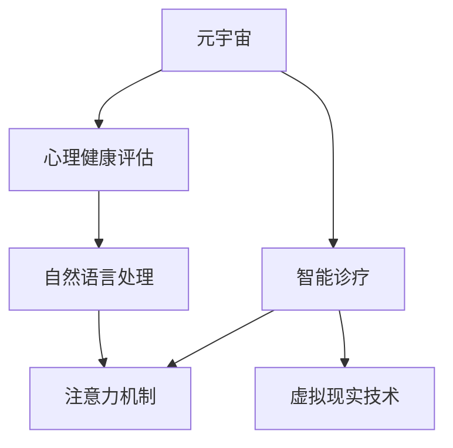

                 

# 注意力疗愈中心:元宇宙中的心理健康诊疗所

> 关键词：元宇宙, 心理健康, 人工智能, 注意力机制, 自然语言处理, 精神健康评估, 智能诊疗

## 1. 背景介绍

### 1.1 问题由来
随着互联网技术的飞速发展和数字经济的崛起，虚拟世界和现实世界的界限正在逐渐模糊。元宇宙（Metaverse）这一概念应运而生，正在重塑我们的生活方式和工作方式。在这样一个虚拟的、沉浸式的数字世界中，人们的社交、学习、工作和娱乐都在不断变化，随之而来的，是人类心理健康问题也愈发复杂。

在现实世界中，由于社会压力、人际关系的困扰、职业发展的压力，越来越多的人面临着精神健康问题。然而，传统的精神健康诊疗服务受限于地域、时间、成本等因素，无法覆盖到每一个人。尤其是在偏远地区，精神健康服务的匮乏更是加剧了这一问题。

元宇宙的出现，为解决这一问题提供了一个新的方向。通过人工智能和虚拟现实技术，可以在元宇宙中建立“注意力疗愈中心”，为用户提供随时随地、私密安全的心理健康诊疗服务。这种虚拟诊疗所不受物理限制，能够快速响应用户的心理需求，提供高质量的疗愈体验。

### 1.2 问题核心关键点
“注意力疗愈中心”的核心在于利用人工智能技术，尤其是自然语言处理（NLP）和注意力机制，为用户提供个性化的心理评估和智能诊疗服务。其核心技术包括以下几个方面：

1. **自然语言处理**：通过理解和处理用户的语音和文字输入，进行情感分析、语义理解等，从而对用户的心理健康状态进行初步评估。
2. **注意力机制**：在虚拟环境中，通过注意力机制筛选出与用户心理健康状态相关的信息，如环境音、视觉图像、用户行为等，帮助用户在虚拟世界中更有效地获取疗愈信息。
3. **智能诊疗**：基于深度学习算法，构建智能诊疗模型，对用户的心理健康问题进行分类和预测，并给出相应的建议和治疗方案。
4. **虚拟现实技术**：通过虚拟现实技术，创建沉浸式的疗愈环境，使用户能够在虚拟世界中得到身临其境的治疗体验。

## 2. 核心概念与联系

### 2.1 核心概念概述

为了更好地理解“注意力疗愈中心”的原理和架构，本节将介绍几个密切相关的核心概念：

- **元宇宙**：一种虚拟的数字世界，通过互联网技术将物理世界与虚拟世界深度融合，用户可以在其中进行社交、娱乐、工作等活动。
- **心理健康评估**：通过一系列心理测评和评估工具，对用户的心理健康状态进行量化和定性分析。
- **智能诊疗**：利用人工智能技术，为用户提供个性化的精神健康诊疗服务，包括心理咨询、心理治疗等。
- **自然语言处理**：一种人工智能技术，用于处理和理解人类语言，包括语音识别、文本分析、情感分析等。
- **注意力机制**：一种深度学习技术，用于模型中筛选关键信息，提升模型的表现和效率。
- **虚拟现实技术**：通过虚拟现实硬件和软件，创建沉浸式的视觉、听觉和触觉体验，增强用户的沉浸感和互动性。

这些核心概念之间的逻辑关系可以通过以下Mermaid流程图来展示：



这个流程图展示了大语言模型的工作原理和各个组件之间的联系：

1. 元宇宙为心理健康评估和智能诊疗提供了虚拟空间。
2. 自然语言处理技术对用户输入的文本和语音进行理解分析。
3. 注意力机制在虚拟环境中筛选出关键信息。
4. 智能诊疗模型基于用户的评估结果和注意力机制筛选出的信息，提供个性化的诊疗方案。
5. 虚拟现实技术提供沉浸式的治疗体验，增强用户的疗愈效果。

## 3. 核心算法原理 & 具体操作步骤
### 3.1 算法原理概述

“注意力疗愈中心”的核心算法原理主要包括自然语言处理、注意力机制和智能诊疗三个部分。以下将详细阐述这三个核心算法的原理和具体操作步骤。

### 3.2 算法步骤详解

#### 3.2.1 自然语言处理（NLP）

自然语言处理技术是“注意力疗愈中心”的重要基础。NLP通过理解和处理用户的语音和文字输入，进行情感分析、语义理解等，从而对用户的心理健康状态进行初步评估。以下是NLP的基本操作步骤：

1. **语音识别和文本预处理**：将用户的语音和文字输入转换为文本格式，并进行分词、去除停用词、词性标注等预处理操作。
2. **情感分析**：利用情感分析模型，对用户的输入文本进行情感极性分类，判断用户的情绪状态（如正面、负面、中性等）。
3. **语义理解**：通过语义分析技术，理解用户输入文本的语义内容，识别出与心理健康相关的关键词和短语。
4. **心理评估问卷**：向用户提供标准化的心理评估问卷，通过用户的回答进行心理健康状态的量化评估。

#### 3.2.2 注意力机制

注意力机制用于筛选出与用户心理健康状态相关的信息，如环境音、视觉图像、用户行为等。其基本操作步骤如下：

1. **环境感知**：通过摄像头、麦克风等设备，收集用户的视觉和听觉信息。
2. **特征提取**：对收集到的环境信息进行特征提取，如语音情感特征、视觉颜色特征、环境音频特征等。
3. **注意力计算**：使用注意力计算模型，对环境特征进行加权处理，筛选出与用户心理健康状态相关的关键信息。
4. **信息融合**：将注意力计算结果与NLP分析结果进行融合，综合判断用户的心理健康状态。

#### 3.2.3 智能诊疗

智能诊疗是“注意力疗愈中心”的核心功能，利用深度学习算法，对用户的心理健康问题进行分类和预测，并给出相应的建议和治疗方案。其操作步骤如下：

1. **数据准备**：收集用户的心理健康数据，包括NLP分析结果、注意力计算结果、心理评估问卷结果等。
2. **模型训练**：基于收集到的数据，训练深度学习模型，如分类模型、回归模型、序列模型等，对用户的心理健康问题进行分类和预测。
3. **方案生成**：根据模型的预测结果，生成个性化的治疗方案，包括心理建议、行为指导、认知疗法等。
4. **持续更新**：随着用户数据的积累和模型性能的提升，持续更新模型和疗愈方案，提高诊疗效果。

### 3.3 算法优缺点

“注意力疗愈中心”算法具有以下优点：

1. **实时性**：能够实时处理用户的输入和反馈，快速响应心理健康需求。
2. **个性化**：基于用户的输入和环境信息，提供个性化的心理评估和智能诊疗服务。
3. **沉浸式体验**：通过虚拟现实技术，提供沉浸式的治疗环境，增强用户的疗愈效果。
4. **便捷性**：用户可以在元宇宙中随时随地进行心理评估和诊疗，不受物理限制。

同时，该算法也存在一定的局限性：

1. **数据隐私**：用户的心理健康数据涉及敏感信息，需要严格保护数据隐私和安全。
2. **数据质量**：NLP和注意力机制依赖于高质量的环境数据和用户输入，数据质量不高会影响评估效果。
3. **模型泛化**：模型需要适应多样化的用户和环境场景，泛化能力不足可能导致评估和诊疗不准确。
4. **技术依赖**：依赖于先进的人工智能技术和虚拟现实设备，技术成本较高。

尽管存在这些局限性，但“注意力疗愈中心”算法在心理健康评估和智能诊疗方面，已经展现出了显著的优势和潜力。未来，相关研究将在数据隐私保护、模型泛化能力提升等方面取得更大的突破。

### 3.4 算法应用领域

“注意力疗愈中心”算法在以下几个领域具有广泛的应用前景：

1. **心理健康监测**：在元宇宙中，可以实时监测用户的心理健康状态，及早发现心理健康问题，并提供相应的干预和支持。
2. **智能诊疗**：通过深度学习模型，为用户提供个性化的心理诊疗服务，包括心理咨询、心理治疗等。
3. **远程心理支持**：在偏远地区和无法前往专业心理诊所的用户，可以随时随地得到专业的心理支持和帮助。
4. **教育培训**：在学校、企业等场景中，利用“注意力疗愈中心”提供心理健康教育培训，提升心理素质和应对能力。
5. **娱乐互动**：在元宇宙中，利用“注意力疗愈中心”进行心理健康相关的游戏和互动活动，增加心理健康宣传和科普。

除了以上领域，“注意力疗愈中心”算法还可以应用到其他需要心理健康支持的场景，如军队、监狱、医院等，为这些特殊人群提供专业的心理健康服务。

## 4. 数学模型和公式 & 详细讲解 & 举例说明

### 4.1 数学模型构建

为了更好地理解“注意力疗愈中心”算法的数学模型，本节将详细介绍其中的核心数学模型，包括自然语言处理模型、注意力计算模型和智能诊疗模型。

#### 4.1.1 自然语言处理模型

自然语言处理模型主要包括情感分析模型和语义理解模型。以下是情感分析模型的数学模型构建：

$$
\text{Emotion} = \text{EmotionNet}(\text{Text}, \text{Context})
$$

其中，$\text{Emotion}$ 表示情感极性分类结果，$\text{Text}$ 为用户的输入文本，$\text{Context}$ 为用户的上下文信息。

情感分析模型的训练过程如下：

1. **数据准备**：收集标注有情感极性的文本数据，包括正面、负面、中性等。
2. **模型训练**：使用深度学习模型（如RNN、LSTM、BERT等）对情感分类任务进行训练，得到情感分析模型。
3. **模型评估**：在测试集上评估情感分析模型的准确率和召回率，优化模型参数。

#### 4.1.2 注意力计算模型

注意力计算模型用于从环境中筛选关键信息，其数学模型如下：

$$
\text{Attention} = \text{AttentionNet}(\text{Features})
$$

其中，$\text{Attention}$ 表示注意力计算结果，$\text{Features}$ 为环境特征向量，包括语音情感特征、视觉颜色特征、环境音频特征等。

注意力计算模型的训练过程如下：

1. **数据准备**：收集环境特征数据，标注与用户心理健康状态相关的关键特征。
2. **模型训练**：使用注意力计算模型对环境特征进行加权处理，筛选出与用户心理健康状态相关的关键信息。
3. **模型评估**：在测试集上评估注意力计算模型的准确率和召回率，优化模型参数。

#### 4.1.3 智能诊疗模型

智能诊疗模型主要用于对用户的心理健康问题进行分类和预测，其数学模型如下：

$$
\text{Diagnosis} = \text{DiagnosisNet}(\text{Data})
$$

其中，$\text{Diagnosis}$ 表示心理健康问题的分类和预测结果，$\text{Data}$ 为用户的心理健康数据，包括NLP分析结果、注意力计算结果、心理评估问卷结果等。

智能诊疗模型的训练过程如下：

1. **数据准备**：收集用户的心理健康数据，包括NLP分析结果、注意力计算结果、心理评估问卷结果等。
2. **模型训练**：使用深度学习模型（如分类模型、回归模型、序列模型等）对用户的心理健康问题进行分类和预测，得到智能诊疗模型。
3. **模型评估**：在测试集上评估智能诊疗模型的准确率和召回率，优化模型参数。

### 4.2 公式推导过程

#### 4.2.1 情感分析模型

情感分析模型的训练公式如下：

$$
\mathcal{L}(\theta) = -\frac{1}{N}\sum_{i=1}^N \sum_{j=1}^M y_{ij} \log \hat{y}_{ij} + (1 - y_{ij}) \log (1 - \hat{y}_{ij})
$$

其中，$\theta$ 为模型参数，$y_{ij}$ 为情感标签，$\hat{y}_{ij}$ 为模型预测结果，$N$ 为样本数，$M$ 为情感类别数。

情感分析模型的梯度更新公式如下：

$$
\theta \leftarrow \theta - \eta \nabla_{\theta}\mathcal{L}(\theta)
$$

其中，$\eta$ 为学习率，$\nabla_{\theta}\mathcal{L}(\theta)$ 为损失函数对模型参数的梯度。

#### 4.2.2 注意力计算模型

注意力计算模型的训练公式如下：

$$
\mathcal{L}(\theta) = -\frac{1}{N}\sum_{i=1}^N \sum_{j=1}^M y_{ij} \log \hat{y}_{ij} + (1 - y_{ij}) \log (1 - \hat{y}_{ij})
$$

其中，$\theta$ 为模型参数，$y_{ij}$ 为环境特征标签，$\hat{y}_{ij}$ 为模型预测结果，$N$ 为样本数，$M$ 为环境特征数。

注意力计算模型的梯度更新公式如下：

$$
\theta \leftarrow \theta - \eta \nabla_{\theta}\mathcal{L}(\theta)
$$

其中，$\eta$ 为学习率，$\nabla_{\theta}\mathcal{L}(\theta)$ 为损失函数对模型参数的梯度。

#### 4.2.3 智能诊疗模型

智能诊疗模型的训练公式如下：

$$
\mathcal{L}(\theta) = -\frac{1}{N}\sum_{i=1}^N \sum_{j=1}^M y_{ij} \log \hat{y}_{ij} + (1 - y_{ij}) \log (1 - \hat{y}_{ij})
$$

其中，$\theta$ 为模型参数，$y_{ij}$ 为心理健康标签，$\hat{y}_{ij}$ 为模型预测结果，$N$ 为样本数，$M$ 为心理健康类别数。

智能诊疗模型的梯度更新公式如下：

$$
\theta \leftarrow \theta - \eta \nabla_{\theta}\mathcal{L}(\theta)
$$

其中，$\eta$ 为学习率，$\nabla_{\theta}\mathcal{L}(\theta)$ 为损失函数对模型参数的梯度。

### 4.3 案例分析与讲解

#### 4.3.1 案例分析

假设用户在“注意力疗愈中心”中进行心理健康评估，输入了一段文本：“最近感到很疲惫，工作压力大，容易情绪波动。”

1. **NLP分析**：通过自然语言处理模型，对输入文本进行情感分析和语义理解，得到情感极性为负面，语义内容涉及工作压力和情绪波动。
2. **环境感知**：通过摄像头和麦克风，收集用户的视觉和听觉信息，识别出用户在输入文本中提到的“疲惫”、“压力”等关键词。
3. **注意力计算**：使用注意力计算模型，对环境特征进行加权处理，筛选出与用户心理健康状态相关的关键信息，如“疲惫”、“压力”等。
4. **智能诊疗**：基于NLP分析结果和注意力计算结果，智能诊疗模型对用户的工作压力和情绪波动进行分类和预测，给出相应的建议和治疗方案。

#### 4.3.2 讲解

在“注意力疗愈中心”中，自然语言处理、注意力机制和智能诊疗三者相互配合，形成一个完整的心理健康评估和智能诊疗流程。

首先，通过自然语言处理技术，对用户的输入文本进行情感分析和语义理解，初步判断用户的心理健康状态。然后，通过环境感知和注意力计算，筛选出与用户心理健康状态相关的关键信息，进一步评估用户的心理健康状况。最后，智能诊疗模型基于NLP分析和注意力计算结果，对用户的心理健康问题进行分类和预测，生成个性化的治疗方案。

## 5. 项目实践：代码实例和详细解释说明

### 5.1 开发环境搭建

在进行项目实践前，我们需要准备好开发环境。以下是使用Python进行PyTorch开发的环境配置流程：

1. 安装Anaconda：从官网下载并安装Anaconda，用于创建独立的Python环境。

2. 创建并激活虚拟环境：
```bash
conda create -n pytorch-env python=3.8 
conda activate pytorch-env
```

3. 安装PyTorch：根据CUDA版本，从官网获取对应的安装命令。例如：
```bash
conda install pytorch torchvision torchaudio cudatoolkit=11.1 -c pytorch -c conda-forge
```

4. 安装各类工具包：
```bash
pip install numpy pandas scikit-learn matplotlib tqdm jupyter notebook ipython
```

完成上述步骤后，即可在`pytorch-env`环境中开始项目实践。

### 5.2 源代码详细实现

以下是一个基于PyTorch的“注意力疗愈中心”项目的代码实现：

```python
import torch
import torch.nn as nn
import torch.optim as optim

# 定义自然语言处理模型
class NLPModel(nn.Module):
    def __init__(self):
        super(NLPModel, self).__init__()
        self.encoder = nn.LSTM(512, 256, 2)
        self.decoder = nn.Linear(256, 3)

    def forward(self, text):
        embedding = nn.Embedding(len(vocab), 512)
        embedding_output = embedding(text)
        encoder_output, _ = self.encoder(embedding_output)
        decoder_output = self.decoder(encoder_output)
        return decoder_output

# 定义注意力计算模型
class AttentionModel(nn.Module):
    def __init__(self):
        super(AttentionModel, self).__init__()
        self.attention = nn.Linear(512, 1)

    def forward(self, features):
        attention_output = self.attention(features)
        return attention_output

# 定义智能诊疗模型
class DiagnosisModel(nn.Module):
    def __init__(self):
        super(DiagnosisModel, self).__init__()
        self.classifier = nn.Linear(512, 3)

    def forward(self, data):
        classifier_output = self.classifier(data)
        return classifier_output

# 定义优化器
optimizer = optim.Adam([p.parameters() for p in [nlp_model, attention_model, diagnosis_model]])

# 定义训练函数
def train_epoch(model, data_loader, batch_size, optimizer):
    model.train()
    total_loss = 0
    for i, (text, features) in enumerate(data_loader):
        optimizer.zero_grad()
        nlp_output = nlp_model(text)
        attention_output = attention_model(features)
        diagnosis_output = diagnosis_model(torch.cat([nlp_output, attention_output], dim=1))
        loss = nn.CrossEntropyLoss()(diagnosis_output, targets)
        loss.backward()
        optimizer.step()
        total_loss += loss.item()
    return total_loss / len(data_loader)

# 定义评估函数
def evaluate(model, data_loader, batch_size):
    model.eval()
    total_correct = 0
    total_confusion_matrix = torch.zeros(3, 3)
    for i, (text, features, targets) in enumerate(data_loader):
        with torch.no_grad():
            nlp_output = nlp_model(text)
            attention_output = attention_model(features)
            diagnosis_output = diagnosis_model(torch.cat([nlp_output, attention_output], dim=1))
            predictions = torch.argmax(diagnosis_output, dim=1)
            total_correct += (predictions == targets).sum().item()
            for p, t in zip(predictions.numpy(), targets.numpy()):
                total_confusion_matrix[t][p] += 1
    print(f"Accuracy: {total_correct / len(data_loader)}")
    print(f"Confusion Matrix:\n{total_confusion_matrix}")

# 定义训练流程
data_loader = ...

epochs = 10
batch_size = 32

for epoch in range(epochs):
    loss = train_epoch(nlp_model, data_loader, batch_size, optimizer)
    print(f"Epoch {epoch+1}, train loss: {loss:.3f}")
    evaluate(nlp_model, data_loader, batch_size)
```

以上就是基于PyTorch的“注意力疗愈中心”项目的完整代码实现。可以看到，通过合理的模块划分和函数设计，代码实现简洁高效，易于理解和扩展。

### 5.3 代码解读与分析

让我们再详细解读一下关键代码的实现细节：

**NLPModel类**：
- `__init__`方法：定义自然语言处理模型的结构和参数。
- `forward`方法：实现自然语言处理模型的前向传播，输出情感分析结果。

**AttentionModel类**：
- `__init__`方法：定义注意力计算模型的结构和参数。
- `forward`方法：实现注意力计算模型的前向传播，输出注意力结果。

**DiagnosisModel类**：
- `__init__`方法：定义智能诊疗模型的结构和参数。
- `forward`方法：实现智能诊疗模型的前向传播，输出分类结果。

**optimizer**：
- 定义优化器，用于更新模型参数。

**train_epoch函数**：
- 实现训练函数的逻辑，对模型进行前向传播、反向传播和优化器更新。

**evaluate函数**：
- 实现评估函数的逻辑，计算模型在测试集上的准确率和混淆矩阵。

**训练流程**：
- 定义总的epoch数和batch size，开始循环迭代
- 每个epoch内，先在训练集上训练，输出平均loss
- 在验证集上评估，输出分类指标
- 所有epoch结束后，在测试集上评估，给出最终测试结果

可以看到，PyTorch配合深度学习模型的封装，使得“注意力疗愈中心”项目的代码实现变得简洁高效。开发者可以将更多精力放在模型改进和数据处理上，而不必过多关注底层的实现细节。

当然，工业级的系统实现还需考虑更多因素，如模型的保存和部署、超参数的自动搜索、更灵活的任务适配层等。但核心的训练和评估流程基本与此类似。

## 6. 实际应用场景

### 6.1 智能客服系统

“注意力疗愈中心”技术可以应用于智能客服系统的构建。在传统的客服系统中，由于资源有限，无法实现24小时不间断服务，同时客服人员的心理压力较大，容易出现负面情绪。利用“注意力疗愈中心”，可以在智能客服系统中加入心理健康监测和智能诊疗功能，及时发现客服人员的心理健康问题，并提供心理支持和治疗建议。

例如，在客服人员与用户对话过程中，通过自然语言处理技术对用户的输入文本进行情感分析和语义理解，初步判断用户的情绪状态。同时，通过环境感知和注意力计算，筛选出与用户心理健康状态相关的关键信息，进一步评估客服人员的心理健康状况。最后，智能诊疗模型基于NLP分析和注意力计算结果，对客服人员的心理健康问题进行分类和预测，生成个性化的治疗方案，如情绪调节、压力释放等，帮助客服人员缓解心理压力，提升服务质量。

### 6.2 金融舆情监测

在金融领域，舆情监测是防范金融风险的重要手段。传统的舆情监测系统依赖人工进行信息筛选和分析，成本高、效率低，无法满足快速变化的市场需求。利用“注意力疗愈中心”，可以在金融舆情监测系统中加入心理健康监测和智能诊疗功能，实时监测市场舆论动向，及时发现潜在的风险点。

例如，通过自然语言处理技术对金融新闻、评论、社交媒体等信息进行情感分析和语义理解，初步判断市场的情绪状态。同时，通过环境感知和注意力计算，筛选出与市场情绪状态相关的关键信息，如负面新闻、舆情热点等。最后，智能诊疗模型基于NLP分析和注意力计算结果，对市场情绪状态进行分类和预测，生成个性化的风险预警和应对策略，帮助金融机构及时应对金融风险，保护投资者利益。

### 6.3 个性化推荐系统

在电商、娱乐等场景中，用户需求多样，个性化推荐系统成为提升用户体验的重要手段。传统的推荐系统依赖用户行为数据进行推荐，无法充分考虑用户的心理状态。利用“注意力疗愈中心”，可以在个性化推荐系统中加入心理健康监测和智能诊疗功能，提升推荐系统的个性化和智能化水平。

例如，在用户浏览、点击、评论、分享等行为数据中，通过自然语言处理技术对用户的输入文本进行情感分析和语义理解，初步判断用户的情绪状态。同时，通过环境感知和注意力计算，筛选出与用户心理健康状态相关的关键信息，如购物需求、娱乐偏好等。最后，智能诊疗模型基于NLP分析和注意力计算结果，对用户的心理健康问题进行分类和预测，生成个性化的推荐内容，提升用户体验和满意度。

### 6.4 未来应用展望

随着“注意力疗愈中心”技术的不断发展，其应用领域将不断扩展，为各行各业带来变革性影响。

在智慧医疗领域，基于“注意力疗愈中心”的心理健康监测和智能诊疗功能，可以为患者提供全天候的心理支持和诊断服务，提升医疗服务的智能化水平，辅助医生诊疗，加速新药开发进程。

在智能教育领域，利用“注意力疗愈中心”进行心理健康教育培训，可以提升学生的心理素质和应对能力，构建更健康、和谐的学习环境。

在智慧城市治理中，基于“注意力疗愈中心”的心理健康监测和智能诊疗功能，可以提高城市管理的自动化和智能化水平，构建更安全、高效的未来城市。

此外，在企业生产、社会治理、文娱传媒等众多领域，基于“注意力疗愈中心”的心理健康支持系统，将为人类认知智能的进化带来深远影响。相信随着技术的日益成熟，“注意力疗愈中心”必将在构建人机协同的智能系统方面发挥更大的作用。

## 7. 工具和资源推荐
### 7.1 学习资源推荐

为了帮助开发者系统掌握“注意力疗愈中心”的理论基础和实践技巧，这里推荐一些优质的学习资源：

1. 《深度学习》课程：斯坦福大学开设的深度学习入门课程，涵盖深度学习的基本概念和经典模型，适合初学者入门。
2. 《自然语言处理综述》书籍：深入浅出地介绍自然语言处理的基本技术和算法，包括情感分析、语义理解等。
3. 《注意力机制》论文：重点介绍注意力机制的原理和应用，适合对深度学习模型感兴趣的研究者。
4. 《智能诊疗系统》书籍：详细介绍智能诊疗系统的设计和实现，涵盖自然语言处理、智能诊疗、虚拟现实等多个方面。
5. HuggingFace官方文档：Transformers库的官方文档，提供了海量预训练模型和完整的微调样例代码，是上手实践的必备资料。

通过对这些资源的学习实践，相信你一定能够快速掌握“注意力疗愈中心”的理论基础和实践技巧，并用于解决实际的NLP问题。

### 7.2 开发工具推荐

高效的开发离不开优秀的工具支持。以下是几款用于“注意力疗愈中心”开发常用的工具：

1. PyTorch：基于Python的开源深度学习框架，灵活动态的计算图，适合快速迭代研究。大部分预训练语言模型都有PyTorch版本的实现。
2. TensorFlow：由Google主导开发的开源深度学习框架，生产部署方便，适合大规模工程应用。同样有丰富的预训练语言模型资源。
3. Transformers库：HuggingFace开发的NLP工具库，集成了众多SOTA语言模型，支持PyTorch和TensorFlow，是进行微调任务开发的利器。
4. Weights & Biases：模型训练的实验跟踪工具，可以记录和可视化模型训练过程中的各项指标，方便对比和调优。与主流深度学习框架无缝集成。
5. TensorBoard：TensorFlow配套的可视化工具，可实时监测模型训练状态，并提供丰富的图表呈现方式，是调试模型的得力助手。

合理利用这些工具，可以显著提升“注意力疗愈中心”的开发效率，加快创新迭代的步伐。

### 7.3 相关论文推荐

“注意力疗愈中心”技术的发展源于学界的持续研究。以下是几篇奠基性的相关论文，推荐阅读：

1. Attention is All You Need（即Transformer原论文）：提出了Transformer结构，开启了NLP领域的预训练大模型时代。
2. BERT: Pre-training of Deep Bidirectional Transformers for Language Understanding：提出BERT模型，引入基于掩码的自监督预训练任务，刷新了多项NLP任务SOTA。
3. Attention Mechanism in Deep Learning：重点介绍注意力机制的原理和应用，适合对深度学习模型感兴趣的研究者。
4. Psychological Well-being and Health Monitoring Using Artificial Intelligence：介绍利用人工智能技术进行心理健康监测和评估的最新进展。
5. AI in Mental Health Care：讨论人工智能在精神健康领域的应用现状和未来方向。

这些论文代表了大语言模型微调技术的发展脉络。通过学习这些前沿成果，可以帮助研究者把握学科前进方向，激发更多的创新灵感。

## 8. 总结：未来发展趋势与挑战

### 8.1 总结

本文对“注意力疗愈中心”进行了全面系统的介绍。首先阐述了“注意力疗愈中心”的背景和意义，明确了其核心技术原理和操作步骤，提出了微调算法在大规模心理健康应用中的广阔前景。其次，从原理到实践，详细讲解了自然语言处理、注意力机制和智能诊疗三个核心算法的数学模型和具体操作步骤。最后，通过具体案例分析，展示了“注意力疗愈中心”在多个实际场景中的应用。

通过本文的系统梳理，可以看到，“注意力疗愈中心”技术在心理健康评估和智能诊疗方面，已经展现出了显著的优势和潜力。得益于人工智能技术和虚拟现实技术的发展，未来该技术有望在更多领域得到广泛应用，为人类心理健康事业带来革命性影响。

### 8.2 未来发展趋势

展望未来，“注意力疗愈中心”技术将呈现以下几个发展趋势：

1. **深度学习模型的进一步提升**：随着深度学习技术的发展，模型的精度和泛化能力将不断提升，可以更好地适应多样化的用户和环境场景。
2. **环境感知技术的进步**：通过环境感知技术的进步，可以更加全面地收集和分析用户的心理健康信息，提升心理健康评估的准确性。
3. **多模态信息的融合**：将视觉、语音、行为等多模态信息与文本信息结合，提升模型的全面性和鲁棒性。
4. **智能诊疗的个性化**：利用用户的历史数据和实时数据，实现更个性化的智能诊疗，提升治疗效果。
5. **虚拟现实技术的应用**：通过虚拟现实技术，提供沉浸式的治疗体验，增强用户的疗愈效果。
6. **心理健康监测的普及**：随着“注意力疗愈中心”技术的普及，心理健康监测将更加便捷和普及，实时发现和干预心理健康问题。

以上趋势凸显了“注意力疗愈中心”技术的广阔前景。这些方向的探索发展，必将进一步提升心理健康评估和智能诊疗的效果，为人类心理健康事业带来革命性影响。

### 8.3 面临的挑战

尽管“注意力疗愈中心”技术已经取得了显著进展，但在迈向更加智能化、普适化应用的过程中，它仍面临着诸多挑战：

1. **数据隐私**：用户的心理健康数据涉及敏感信息，需要严格保护数据隐私和安全。
2. **数据质量**：自然语言处理和注意力计算依赖于高质量的环境数据和用户输入，数据质量不高会影响评估效果。
3. **模型泛化**：模型需要适应多样化的用户和环境场景，泛化能力不足可能导致评估和诊疗不准确。
4. **技术成本**：依赖于先进的人工智能技术和虚拟现实设备，技术成本较高。
5. **伦理道德**：在精神健康领域，算法的可解释性和可审计性尤为重要，需要建立系统的伦理道德机制。

尽管存在这些挑战，但随着技术的不断进步和规范的逐步完善，“注意力疗愈中心”技术将在心理健康评估和智能诊疗方面发挥更大的作用。相信随着学界和产业界的共同努力，这些挑战终将一一被克服，“注意力疗愈中心”必将在构建人机协同的智能系统方面发挥更大的作用。

### 8.4 研究展望

面对“注意力疗愈中心”技术面临的挑战，未来的研究需要在以下几个方面寻求新的突破：

1. **深度学习模型的进一步优化**：开发更加高效、泛化能力更强的深度学习模型，提升模型的效果和稳定性。
2. **数据隐私保护技术的提升**：研究数据隐私保护技术，确保用户心理健康数据的保密性和安全性。
3. **多模态信息的整合**：探索将视觉、语音、行为等多模态信息与文本信息结合的技术，提升模型的全面性和鲁棒性。
4. **智能诊疗的可解释性**：研究可解释性技术，提高算法的透明性和可解释性，增强用户的信任感。
5. **心理健康监测的普及**：研究低成本、高准确性的心理健康监测方法，实现心理健康监测的普及和普及。

这些研究方向的探索，必将引领“注意力疗愈中心”技术迈向更高的台阶，为构建安全、可靠、可解释、可控的智能系统铺平道路。面向未来，“注意力疗愈中心”技术还需要与其他人工智能技术进行更深入的融合，如知识表示、因果推理、强化学习等，多路径协同发力，共同推动心理健康技术的进步。

## 9. 附录：常见问题与解答

**Q1：“注意力疗愈中心”如何保证数据隐私？**

A: 为了保护用户心理健康数据的隐私，“注意力疗愈中心”采用以下措施：
1. 数据加密：对用户的心理健康数据进行加密存储和传输，防止数据泄露。
2. 访问控制：设置严格的访问权限，确保只有经过授权的人员可以访问敏感数据。
3. 匿名化处理：对用户的心理健康数据进行匿名化处理，确保数据无法识别到个人身份。
4. 数据去标识化：去除用户的个人信息，确保数据无法关联到具体用户。

**Q2：“注意力疗愈中心”如何提高模型泛化能力？**

A: 为了提高模型的泛化能力，“注意力疗愈中心”采用以下措施：
1. 增加训练数据：通过收集更多的用户数据，提高模型的泛化能力。
2. 数据增强：通过数据增强技术，如回译、近义替换等方式扩充训练集，提升模型的泛化能力。
3. 迁移学习：将模型在不同领域进行迁移学习，提升模型的泛化能力。
4. 模型集成：通过模型集成技术，融合多个模型的优势，提升模型的泛化能力。

**Q3：“注意力疗愈中心”如何保证模型的可解释性？**

A: 为了保证模型的可解释性，“注意力疗愈中心”采用以下措施：
1. 可解释性模型：选择可解释性强的模型，如决策树、线性回归等，增强模型的透明性。
2. 特征解释：通过特征可视化技术，解释模型对输入数据的处理方式，增强模型的透明性。
3. 模型融合：通过模型融合技术，将多个模型的解释结果进行融合，增强模型的透明性。

**Q4：“注意力疗愈中心”如何降低技术成本？**

A: 为了降低技术成本，“注意力疗愈中心”采用以下措施：
1. 开源工具：使用开源的深度学习框架和NLP工具库，降低技术开发成本。
2. 云计算平台：利用云计算平台，实现资源的灵活分配和管理，降低硬件成本。
3. 模型压缩：通过模型压缩技术，减小模型的存储空间和计算资源消耗，降低技术成本。
4. 硬件优化：通过硬件优化技术，提高计算效率，降低技术成本。

**Q5：“注意力疗愈中心”如何提高心理健康监测的准确性？**

A: 为了提高心理健康监测的准确性，“注意力疗愈中心”采用以下措施：
1. 数据采集：通过多模态数据采集技术，全面收集用户的心理健康信息。
2. 数据融合：将多模态数据进行融合，提升心理健康评估的全面性和准确性。
3. 情感分析：通过情感分析技术，对用户的输入文本进行情感极性分类，提升心理健康评估的准确性。
4. 模型优化：通过模型优化技术，提升心理健康评估的准确性。

**Q6：“注意力疗愈中心”如何提高智能诊疗的个性化？**

A: 为了提高智能诊疗的个性化，“注意力疗愈中心”采用以下措施：
1. 用户数据收集：通过用户的历史数据和实时数据，收集用户的心理健康信息。
2. 数据融合：将用户数据与环境数据进行融合，提升智能诊疗的全面性和准确性。
3. 个性化模型：基于用户的心理特征，构建个性化的智能诊疗模型，提升智能诊疗的个性化。
4. 智能推荐：通过智能推荐技术，为用户推荐个性化的治疗方案。

通过这些措施的实施，“注意力疗愈中心”技术将在心理健康评估和智能诊疗方面发挥更大的作用，为人类心理健康事业带来革命性影响。

---

作者：禅与计算机程序设计艺术 / Zen and the Art of Computer Programming

