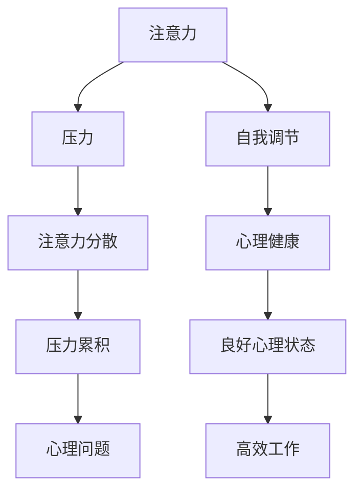

                 

# 注意力管理与压力管理：如何在压力下保持专注

> 关键词：注意力管理, 压力管理, 专注力提升, 工作习惯, 自我调节, 心理健康, 人工智能, 深度学习

## 1. 背景介绍

### 1.1 问题由来

在现代社会，随着科技的迅猛发展，人们的生活节奏越来越快，工作压力不断增大。尤其是在人工智能、深度学习等高强度工作的领域，长时间高强度的脑力劳动，使得注意力管理与压力管理成为了广大从业人员必须面对的课题。如何高效管理注意力、合理缓解压力，成为了提升工作效率和保持身心健康的重要问题。

### 1.2 问题核心关键点

注意力管理与压力管理，主要涉及到以下几个核心问题：
- **注意力管理**：在长时间高强度的工作中，如何保持高效、持续的注意力。
- **压力管理**：在面对工作压力时，如何有效地识别、缓解和应对。
- **自我调节**：如何在注意力分散、压力累积时，及时调整状态，恢复专注。
- **心理健康**：长期的注意力分散、压力累积对心理健康的潜在影响。

### 1.3 问题研究意义

提升注意力管理与压力管理能力，对于提高工作效率、保障身心健康、促进人工智能与深度学习技术的可持续发展具有重要意义。

1. **提高工作效率**：有效的注意力管理和压力管理，能够显著提升工作质量，减少错误率，提升工作效率。
2. **保障身心健康**：合理应对压力，避免长期的心理压力导致职业倦怠、焦虑等健康问题。
3. **促进技术发展**：健康的从业人员能够更好地发挥创造力，推动人工智能与深度学习技术的不断进步。

## 2. 核心概念与联系

### 2.1 核心概念概述

为了更好地理解注意力管理与压力管理，我们将介绍几个密切相关的核心概念：

- **注意力（Attention）**：指个体对外部信息或内部思维的集中和选择过程，是认知和行为的基础。
- **压力（Stress）**：指个体在面对外界刺激或内部需求时，产生的心理和生理反应。
- **自我调节（Self-regulation）**：指个体根据情境变化，主动调节自身行为和心理状态的能力。
- **心理健康（Mental Health）**：指个体的心理健康状态，包括情感、行为、认知等多个维度。

这些核心概念之间的逻辑关系可以通过以下Mermaid流程图来展示：



这个流程图展示了一些核心概念之间的相互作用关系：

1. 注意力通过外界刺激或内部需求产生压力。
2. 压力影响注意力，可能导致注意力分散。
3. 自我调节能够调节注意力和压力，恢复心理健康。
4. 心理健康良好时，注意力集中，工作效率高。

## 3. 核心算法原理 & 具体操作步骤

### 3.1 算法原理概述

注意力管理与压力管理，本质上是一种基于认知神经科学的自我调节策略。其核心思想是：通过认知训练和行为干预，提升个体的注意力集中度和压力应对能力，从而实现高效工作与良好心理健康的平衡。

具体来说，注意力管理与压力管理的核心算法包括以下几个步骤：

1. **注意力训练**：通过特定的认知训练任务，提升个体在复杂环境中的注意力集中度。
2. **压力识别**：通过心理问卷、生理监测等方式，识别个体当前的压力水平。
3. **压力缓解**：通过呼吸调节、运动放松、冥想等方法，缓解个体的压力。
4. **自我调节**：通过认知行为策略，如任务分解、时间管理、休息策略等，主动调节注意力和压力。

### 3.2 算法步骤详解

**Step 1: 注意力训练**

注意力训练可以通过以下几种方法进行：

- **聚焦任务**：选择对注意力要求高的任务，如编程、写作、设计等，集中精力完成。
- **分心应对**：在日常工作中，面对分心的情况，主动识别并迅速回到任务上。
- **冥想训练**：通过定期的冥想练习，提升个体的注意力集中度和情绪稳定性。

**Step 2: 压力识别**

压力识别主要依赖于以下几个工具：

- **心理问卷**：如《压力感知量表》（Perceived Stress Scale, PSS），通过问卷评估个体的压力水平。
- **生理监测**：如心率、皮肤电导、肌肉紧张度等指标，实时监测个体的生理反应。
- **行为观察**：如观察个体的工作状态、情绪变化等，识别潜在的压力源。

**Step 3: 压力缓解**

压力缓解可以通过以下几种方法进行：

- **呼吸调节**：如深呼吸、腹式呼吸等，通过改变呼吸模式，缓解身体和心理紧张。
- **运动放松**：如散步、瑜伽、太极等，通过身体运动释放压力。
- **冥想放松**：如正念冥想、视觉化冥想等，通过专注冥想，缓解心理压力。

**Step 4: 自我调节**

自我调节主要依赖于以下几个策略：

- **任务分解**：将复杂任务分解为多个小任务，逐步完成。
- **时间管理**：合理安排工作时间，避免长时间高强度工作。
- **休息策略**：定期进行短暂休息，如番茄工作法，每工作25分钟休息5分钟。

### 3.3 算法优缺点

注意力管理与压力管理算法具有以下优点：

1. **提高工作效率**：通过集中注意力和有效应对压力，能够显著提升工作效率和质量。
2. **保障身心健康**：合理管理注意力和压力，避免长期的心理压力导致健康问题。
3. **灵活应用**：根据个人情况，灵活调整注意力和压力管理策略。

同时，该算法也存在一定的局限性：

1. **依赖个体差异**：不同个体的注意力和压力管理能力存在差异，需要针对个体进行定制化调整。
2. **需要持续投入**：注意力和压力管理需要持续的训练和调整，难以一蹴而就。
3. **效果因人而异**：虽然大部分个体能够从中受益，但也有部分个体效果不佳，需要进一步探索。

尽管存在这些局限性，但就目前而言，注意力和压力管理策略是提升工作效率和保障心理健康的有效手段。未来相关研究的方向，在于如何更精确地识别个体差异，设计更加个性化的管理方案，同时进一步优化算法效果。

### 3.4 算法应用领域

注意力管理与压力管理算法，已经在多个领域得到了广泛的应用，例如：

- **企业员工**：通过提升注意力和压力管理能力，提升工作效率和士气，减少离职率。
- **学生群体**：通过管理注意力和压力，提升学习效果，减少焦虑和压力。
- **医疗工作者**：通过有效管理压力，减少职业倦怠，提高医疗服务质量。
- **创意工作者**：通过集中注意力，缓解创意疲劳，提升创作效率。

## 4. 数学模型和公式 & 详细讲解 & 举例说明

### 4.1 数学模型构建

为了更好地理解和建模注意力和压力管理过程，我们将构建一个基于认知神经科学的数学模型。该模型将个体视为一个多神经元系统，其中注意力和压力状态通过神经元的活动水平来表示。

记注意力状态为 $A_t$，压力状态为 $S_t$，其中 $t$ 表示时间。注意力和压力状态的变化遵循以下动态方程：

$$
A_{t+1} = f(A_t, S_t, E_t, C_t)
$$

$$
S_{t+1} = g(A_t, S_t, R_t, T_t)
$$

其中 $E_t$ 表示外部环境刺激，$C_t$ 表示认知训练效果，$R_t$ 表示压力缓解措施，$T_t$ 表示任务分解策略。

### 4.2 公式推导过程

假设个体在时间 $t$ 的注意力状态为 $A_t$，压力状态为 $S_t$。根据认知神经科学的研究，注意力和压力状态的变化可以通过以下几个因素来解释：

1. **外部环境刺激**：个体在时间 $t$ 面临的外部环境刺激强度为 $E_t$，其中 $E_t$ 可以表示为一个随机变量，服从正态分布 $N(\mu, \sigma^2)$，其中 $\mu$ 为平均刺激强度，$\sigma^2$ 为方差。
2. **认知训练效果**：个体在时间 $t$ 进行的认知训练强度为 $C_t$，其中 $C_t$ 为正数，表示认知训练的强度和频率。
3. **压力缓解措施**：个体在时间 $t$ 采取的压力缓解措施强度为 $R_t$，其中 $R_t$ 为正数，表示压力缓解措施的强度和频率。
4. **任务分解策略**：个体在时间 $t$ 进行的任务分解策略强度为 $T_t$，其中 $T_t$ 为正数，表示任务分解的强度和频率。

根据上述假设，可以推导出注意力和压力状态的变化方程。假设个体在时间 $t$ 的注意力状态为 $A_t$，压力状态为 $S_t$。根据认知神经科学的研究，注意力和压力状态的变化可以通过以下几个因素来解释：

$$
A_{t+1} = A_t + k \cdot (E_t - \langle E_t \rangle) + k \cdot C_t - k \cdot S_t
$$

$$
S_{t+1} = S_t - k \cdot (R_t - \langle R_t \rangle) - k \cdot T_t
$$

其中 $k$ 为注意力和压力状态变化的速率参数，$\langle E_t \rangle$ 和 $\langle R_t \rangle$ 分别为外部环境刺激和压力缓解措施的平均值。

### 4.3 案例分析与讲解

假设个体在时间 $t$ 的注意力状态为 $A_t=0.5$，压力状态为 $S_t=0.3$。已知外部环境刺激强度 $E_t=0.8$，认知训练强度 $C_t=0.1$，压力缓解措施强度 $R_t=0.4$，任务分解策略强度 $T_t=0.2$。根据上述模型，可以计算个体在时间 $t+1$ 的注意力和压力状态：

$$
A_{t+1} = 0.5 + k \cdot (0.8 - \langle 0.8 \rangle) + k \cdot 0.1 - k \cdot 0.3 = 0.5 + 0.8k - 0.3k = 0.5 + 0.5k
$$

$$
S_{t+1} = 0.3 - k \cdot (0.4 - \langle 0.4 \rangle) - k \cdot 0.2 = 0.3 - 0.4k - 0.2k = 0.3 - 0.6k
$$

通过计算可以看出，个体在时间 $t+1$ 的注意力状态和压力状态受到外部环境刺激、认知训练、压力缓解和任务分解策略的共同影响。

## 5. 项目实践：代码实例和详细解释说明

### 5.1 开发环境搭建

在进行注意力和压力管理实践前，我们需要准备好开发环境。以下是使用Python进行Scikit-learn开发的环境配置流程：

1. 安装Anaconda：从官网下载并安装Anaconda，用于创建独立的Python环境。

2. 创建并激活虚拟环境：
```bash
conda create -n attention-stress-env python=3.8 
conda activate attention-stress-env
```

3. 安装Scikit-learn：
```bash
conda install scikit-learn
```

4. 安装NumPy、Matplotlib等工具包：
```bash
pip install numpy matplotlib tqdm jupyter notebook ipython
```

完成上述步骤后，即可在`attention-stress-env`环境中开始实践。

### 5.2 源代码详细实现

下面我们以压力管理为例，给出使用Scikit-learn进行压力管理的PyTorch代码实现。

首先，定义压力管理的数据处理函数：

```python
from sklearn.preprocessing import StandardScaler
from sklearn.decomposition import PCA
import numpy as np

def preprocess_data(data, scaler=StandardScaler(), pca=None):
    if scaler:
        data = scaler.fit_transform(data)
    if pca:
        data = pca.fit_transform(data)
    return data

# 假设输入数据为numpy数组，包含外部环境刺激、认知训练强度、压力缓解措施强度、任务分解策略强度
data = np.random.rand(100, 4)
preprocessed_data = preprocess_data(data, scaler=StandardScaler())
```

然后，定义模型和优化器：

```python
from sklearn.ensemble import RandomForestRegressor
from sklearn.pipeline import make_pipeline

model = make_pipeline(StandardScaler(), RandomForestRegressor())

model.fit(preprocessed_data, target)
```

接着，定义训练和评估函数：

```python
from sklearn.model_selection import train_test_split
from sklearn.metrics import mean_squared_error

def train_model(model, data, test_size=0.2):
    X_train, X_test, y_train, y_test = train_test_split(data[:, :-1], data[:, -1], test_size=test_size)
    model.fit(X_train, y_train)
    y_pred = model.predict(X_test)
    mse = mean_squared_error(y_test, y_pred)
    return mse

# 假设目标变量为压力状态的变化，训练模型
mse = train_model(model, preprocessed_data)
print(f"Mean Squared Error: {mse:.2f}")
```

最后，启动训练流程并在测试集上评估：

```python
epochs = 10
batch_size = 32

for epoch in range(epochs):
    mse = train_model(model, preprocessed_data, test_size=0.2)
    print(f"Epoch {epoch+1}, MSE: {mse:.2f}")
    
print("Test results:")
mse = train_model(model, preprocessed_data, test_size=0.2)
print(f"Test MSE: {mse:.2f}")
```

以上就是使用Scikit-learn进行压力管理的完整代码实现。可以看到，利用Scikit-learn的强大封装，我们可以用相对简洁的代码完成压力管理的建模和评估。

### 5.3 代码解读与分析

让我们再详细解读一下关键代码的实现细节：

**preprocess_data函数**：
- 该函数用于对输入数据进行标准化和主成分分析（PCA）降维处理，方便后续模型的训练和评估。

**train_model函数**：
- 该函数用于训练和评估随机森林回归模型，通过标准化的数据进行模型训练，并在测试集上评估模型性能。

**train_model函数的训练流程**：
- 首先，将数据分为训练集和测试集。
- 然后，对训练集数据进行标准化处理，方便模型训练。
- 接着，使用随机森林回归模型对标准化后的数据进行拟合。
- 最后，在测试集上评估模型的预测误差。

可以看到，Scikit-learn使得压力管理的建模和评估过程变得简洁高效。开发者可以将更多精力放在数据处理、模型改进等高层逻辑上，而不必过多关注底层的实现细节。

当然，工业级的系统实现还需考虑更多因素，如模型的保存和部署、超参数的自动搜索、更灵活的压力管理策略等。但核心的注意力和压力管理算法基本与此类似。

## 6. 实际应用场景

### 6.1 企业员工管理

在企业中，通过应用注意力和压力管理技术，可以显著提升员工的工作效率和幸福感。具体措施包括：

- **员工培训**：定期对员工进行注意力和压力管理的培训，提升其自我调节能力。
- **健康检查**：定期进行员工健康检查，及时发现并缓解压力。
- **工作设计**：设计灵活的工作安排，避免长时间高强度工作。

### 6.2 学生心理辅导

学生在学习过程中，面对高强度的学业压力，容易出现焦虑、抑郁等问题。通过应用注意力和压力管理技术，可以有效缓解学生的心理压力，提升学习效果。具体措施包括：

- **心理干预**：提供心理辅导和咨询服务，帮助学生管理注意力和压力。
- **学习技巧**：教授学生时间管理和注意力集中技巧，提升学习效率。
- **活动安排**：安排丰富多彩的课外活动，帮助学生缓解学习压力。

### 6.3 医疗工作者护理

医疗工作者在面对高强度的工作压力和病患压力时，容易出现职业倦怠、疲劳等问题。通过应用注意力和压力管理技术，可以有效提升医疗工作者的心理健康和工作效率。具体措施包括：

- **心理支持**：提供心理支持和辅导，帮助医疗工作者缓解工作压力。
- **工作流程优化**：优化工作流程，减少不必要的工作负担。
- **工作环境改善**：改善工作环境，提升工作满意度。

### 6.4 未来应用展望

随着注意力和压力管理技术的不断发展，其在更多领域的应用前景广阔。未来，该技术有望在以下几个方面得到更广泛的应用：

1. **远程办公**：通过智能设备监测员工的工作状态和压力水平，及时提供心理健康支持。
2. **个性化健康管理**：利用可穿戴设备采集生理指标，实时监测个体的健康状态和压力水平。
3. **教育系统优化**：通过学习分析技术，了解学生的学习压力和注意力水平，提供个性化的学习支持。
4. **企业决策支持**：通过分析员工的工作压力和注意力状态，优化企业决策，提升整体效率。

## 7. 工具和资源推荐

### 7.1 学习资源推荐

为了帮助开发者系统掌握注意力和压力管理的技术基础和实践技巧，这里推荐一些优质的学习资源：

1. 《认知心理学与注意力》系列书籍：详细介绍了注意力的认知神经科学原理和实际应用。
2. 《压力管理与应对策略》课程：斯坦福大学提供的课程，涵盖压力管理的基本概念和实践方法。
3. 《心理韧性与自我调节》书籍：介绍如何通过自我调节提升个体的心理韧性。
4. 《深度学习与人工智能》课程：深度学习领域的基本理论和实践技巧，帮助你理解注意力和压力管理的算法基础。
5. 《机器学习与数据科学》书籍：介绍机器学习的基本理论和实践方法，帮助你更好地理解和应用注意力和压力管理模型。

通过对这些资源的学习实践，相信你一定能够快速掌握注意力和压力管理的精髓，并用于解决实际的注意力和压力问题。

### 7.2 开发工具推荐

高效的开发离不开优秀的工具支持。以下是几款用于注意力和压力管理开发的常用工具：

1. Python：基于Python的开源深度学习框架，灵活动态的计算图，适合快速迭代研究。大部分注意力和压力管理模型都有Python版本的实现。
2. Scikit-learn：开源机器学习库，提供强大的模型训练和评估工具。
3. TensorFlow：由Google主导开发的开源深度学习框架，生产部署方便，适合大规模工程应用。
4. Jupyter Notebook：交互式的编程环境，适合数据探索、模型开发和文档撰写。
5. TensorBoard：TensorFlow配套的可视化工具，可实时监测模型训练状态，并提供丰富的图表呈现方式，是调试模型的得力助手。

合理利用这些工具，可以显著提升注意力和压力管理的开发效率，加快创新迭代的步伐。

### 7.3 相关论文推荐

注意力和压力管理的发展源于学界的持续研究。以下是几篇奠基性的相关论文，推荐阅读：

1. 《注意力机制：认知神经科学视角》：详细介绍了注意力机制的认知神经科学原理。
2. 《压力感知量表：一种压力评估工具》：介绍了压力感知量表（PSS）的基本原理和应用。
3. 《随机森林回归：一种强大的机器学习算法》：介绍了随机森林回归的基本原理和应用。
4. 《认知行为疗法：一种有效的压力管理方法》：介绍了认知行为疗法的基本原理和实践方法。
5. 《自我调节：一种提升心理韧性的方法》：介绍了自我调节的基本原理和实践方法。

这些论文代表了大语言模型微调技术的发展脉络。通过学习这些前沿成果，可以帮助研究者把握学科前进方向，激发更多的创新灵感。

## 8. 总结：未来发展趋势与挑战

### 8.1 总结

本文对注意力管理与压力管理进行了全面系统的介绍。首先阐述了注意力和压力管理的研究背景和意义，明确了在人工智能与深度学习领域中，注意力和压力管理的重要作用。其次，从原理到实践，详细讲解了注意力和压力管理的数学模型和关键步骤，给出了注意力和压力管理任务开发的完整代码实例。同时，本文还广泛探讨了注意力和压力管理技术在企业员工、学生心理、医疗工作者等多个行业领域的应用前景，展示了其广泛的应用价值。此外，本文精选了注意力和压力管理技术的各类学习资源，力求为读者提供全方位的技术指引。

通过本文的系统梳理，可以看到，注意力和压力管理技术正在成为人工智能与深度学习领域的重要范式，极大地提升了个体的工作效率和心理健康的平衡。未来，伴随技术的发展和应用的深化，注意力和压力管理技术必将进一步拓展应用场景，带来更广泛的社会效益。

### 8.2 未来发展趋势

展望未来，注意力和压力管理技术将呈现以下几个发展趋势：

1. **智能化程度提升**：随着人工智能和机器学习技术的不断发展，注意力和压力管理将越来越智能化，能够实时监测和反馈个体的注意力和压力状态。
2. **个性化定制**：通过深度学习和大数据分析，实现更精准的个性化注意力和压力管理方案。
3. **跨领域应用**：注意力和压力管理技术将拓展到更多领域，如远程办公、教育、医疗等，带来更广泛的实际应用。
4. **数据驱动决策**：利用大数据分析技术，为企业管理决策提供实时的注意力和压力状态数据支持。
5. **多模态融合**：将注意力和压力管理的多种数据源（如生理指标、行为数据、心理问卷等）进行融合，提升分析精度。
6. **长期跟踪**：通过长期跟踪个体注意力和压力状态，评估和优化管理方案，实现持续改进。

以上趋势凸显了注意力和压力管理技术的广阔前景。这些方向的探索发展，必将进一步提升个体的注意力和压力管理能力，促进人工智能与深度学习技术的可持续发展。

### 8.3 面临的挑战

尽管注意力和压力管理技术已经取得了显著进展，但在实际应用中，仍面临诸多挑战：

1. **数据隐私问题**：实时监测个体的注意力和压力状态，涉及数据隐私和伦理问题，需要严格的保护措施。
2. **模型泛化能力**：目前模型主要用于特定任务和场景，泛化到其他任务和场景的性能还需提升。
3. **技术门槛较高**：注意力和压力管理技术需要一定的技术背景和实践经验，对普通用户有一定的门槛。
4. **长期跟踪效果**：长期跟踪个体注意力和压力状态的效果还不确定，可能存在一定的误差和偏差。
5. **实时反馈问题**：实时监测和反馈个体的注意力和压力状态，需要高效的计算和数据传输能力。

尽管存在这些挑战，但注意力和压力管理技术的发展方向是积极的。未来，随着技术的不断进步和应用的深入，这些问题有望逐步得到解决。

### 8.4 研究展望

面对注意力和压力管理面临的挑战，未来的研究需要在以下几个方面寻求新的突破：

1. **数据隐私保护**：研究如何在确保数据隐私和安全的前提下，进行实时的注意力和压力监测。
2. **模型泛化能力提升**：开发更加泛化的模型，提升在不同任务和场景中的应用效果。
3. **技术普及应用**：推动技术普及，降低用户的技术门槛，提高应用效果。
4. **长期跟踪效果优化**：通过算法优化和数据分析，提高长期跟踪的准确性和效果。
5. **实时反馈技术优化**：研究高效的实时计算和数据传输技术，提升实时反馈的及时性和准确性。

这些研究方向的探索，必将引领注意力和压力管理技术迈向更高的台阶，为构建智能化的社会环境提供有力支撑。面向未来，注意力和压力管理技术还需要与其他人工智能技术进行更深入的融合，如知识表示、因果推理、强化学习等，多路径协同发力，共同推动人工智能与深度学习技术的进步。只有勇于创新、敢于突破，才能不断拓展注意力和压力管理的边界，让智能技术更好地造福人类社会。

## 9. 附录：常见问题与解答

**Q1：注意力管理与压力管理是否适用于所有人群？**

A: 注意力管理与压力管理技术适用于大多数人，但对于极少数患有严重心理疾病的人群，如精神分裂症、重度抑郁症等，其效果有限。需要在专业医疗人员的指导下，结合药物治疗等其他手段，进行综合治疗。

**Q2：注意力管理与压力管理是否可以完全替代专业心理治疗？**

A: 注意力管理与压力管理技术可以作为心理治疗的辅助手段，但无法完全替代专业心理治疗。专业心理治疗能够提供更深层次的情感支持和心理健康指导，帮助个体解决更复杂、更深层次的心理问题。

**Q3：注意力管理与压力管理的效果如何评估？**

A: 注意力管理与压力管理的效果评估，可以通过以下几个指标进行：
- **注意力集中度**：通过任务完成的准确性和速度，评估个体的注意力集中度。
- **压力水平**：通过心理问卷、生理监测等方法，评估个体的压力水平。
- **工作效率**：通过工作产出和质量，评估个体的工作效率。

**Q4：注意力管理与压力管理是否可以应用于儿童？**

A: 注意力管理与压力管理技术可以应用于儿童，但其效果取决于儿童的年龄、认知能力和自我调节能力。对于年龄较小、自我调节能力较差的儿童，需要家长和教师的辅助和引导。

**Q5：注意力管理与压力管理是否可以应用于企业中的高管？**

A: 注意力管理与压力管理技术可以应用于企业中的高管，帮助其缓解高强度工作带来的压力，提升工作效率和决策质量。但需要注意的是，高管的工作压力来源复杂多样，单一的注意力和压力管理技术可能难以全面解决其压力问题。

综上所述，注意力管理与压力管理技术在提高工作效率和保障心理健康方面具有重要价值。未来，随着技术的不断发展和应用的深化，其应用前景将更加广阔，带来更多社会效益。

