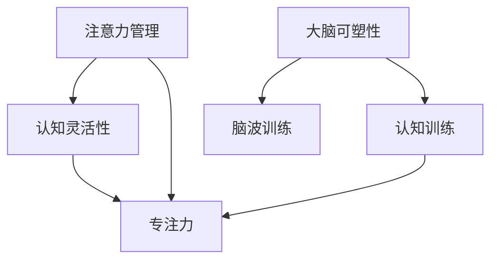

                 

# 注意力管理与大脑训练：增强认知灵活性和专注力的练习

> 关键词：注意力管理, 认知灵活性, 专注力训练, 大脑可塑性, 脑波训练, 大脑游戏

## 1. 背景介绍

### 1.1 问题由来
在当今快节奏的信息时代，注意力管理已成为个人和职业发展的关键。长时间的分心、注意力不集中等现象普遍存在，严重影响了工作效率和决策质量。大脑训练技术逐渐受到关注，旨在通过科学训练方法，提升大脑的认知灵活性和专注力，帮助个体应对现代社会的挑战。

注意力管理是指通过各种手段提升和维持个体注意力的稳定性和集中度。大脑训练则是通过特定练习，改善大脑神经网络结构，提高处理信息和解决问题的能力。两者结合，可以有效改善个体的认知表现和日常表现。

### 1.2 问题核心关键点
注意力管理和大脑训练的核心在于理解注意力在大脑工作机制中的作用，以及如何通过科学练习优化认知过程。核心问题包括：
- 大脑注意力和认知灵活性的科学原理是什么？
- 如何在实际生活中应用注意力管理技巧？
- 大脑训练方法有哪些，其效果如何？
- 如何结合注意力管理与大脑训练，提升综合认知能力？

这些问题的答案，不仅涉及生物学和心理学的基础理论，还包括如何应用这些理论于日常生活和工作中。本文将详细探讨这些核心问题，并给出具体的实践方法和技巧。

## 2. 核心概念与联系

### 2.1 核心概念概述

为更好地理解注意力管理与大脑训练，本文将介绍几个密切相关的核心概念：

- **注意力管理(Attention Management)**：指通过各种方法提升和维持个体注意力的稳定性与集中度。包括但不限于任务分解、时间管理、环境优化等。
- **认知灵活性(Cognitive Flexibility)**：指个体在处理复杂任务时，能够快速切换注意焦点、灵活适应新情境的能力。与大脑的执行功能密切相关。
- **专注力(Concentration)**：指个体在特定时间内，将注意力集中于某一任务的能力。通常与注意力的持久度和抗干扰能力相关。
- **大脑可塑性(Brain Plasticity)**：指大脑在学习和训练过程中，能够适应新环境和调整神经网络结构的能力。认知训练是利用这一特性，改善大脑功能的一种方法。
- **脑波训练(Brain Wave Training)**：利用特定频率的脑波刺激，促进神经元之间的同步和协调，从而改善大脑功能。

这些核心概念之间的逻辑关系可以通过以下Mermaid流程图来展示：



这个流程图展示了几组核心概念及其之间的联系：

1. 注意力管理通过改善注意力的持久度和集中度，提升认知灵活性和专注力。
2. 大脑可塑性使得大脑能够适应新环境，从而提高认知灵活性。
3. 脑波训练和认知训练是两种直接改善大脑功能的方法，能够提升认知灵活性和专注力。

这些概念共同构成了注意力管理和大脑训练的理论基础，使其能够有效改善个体的认知表现和日常行为。

## 3. 核心算法原理 & 具体操作步骤
### 3.1 算法原理概述

注意力管理与大脑训练的科学原理，主要基于神经科学和认知心理学的研究成果。注意力管理和大脑训练的算法，通常涉及以下三个方面：

1. **神经网络优化**：通过特定训练任务，优化大脑神经元之间的连接和激活模式，提高神经元之间的同步性和协调性。
2. **认知任务训练**：设计专门的任务，如记忆、注意力、决策等，通过反复练习，提升相关认知能力。
3. **环境刺激优化**：通过调整环境刺激方式，如光线、声音、温度等，优化大脑的工作状态，增强认知表现。

具体来说，注意力管理和大脑训练的算法可以概括为以下步骤：

1. **目标设定**：明确训练目标，如提升记忆力、增强专注力、改善执行功能等。
2. **任务选择**：根据训练目标，选择合适的训练任务。如记忆训练的闪卡任务、注意力训练的平衡棒任务、脑波训练的alpha波音乐等。
3. **任务执行**：按照任务要求，进行反复练习，确保训练量和频率。
4. **效果评估**：定期评估训练效果，调整训练方案，确保训练方向正确。

### 3.2 算法步骤详解

下面以认知灵活性训练为例，详细讲解基于认知任务训练的算法步骤：

**Step 1: 目标设定**
- 明确训练目标，例如提高认知灵活性，具体表现为在多个任务之间快速切换的能力。

**Step 2: 任务选择**
- 选择能够训练认知灵活性的任务。例如，N-Back任务，即随机序列记忆任务。参与者需要记住前几个数字，然后判断下一个数字是否在记忆中。

**Step 3: 任务执行**
- 在实验中，随机生成一系列数字，要求参与者在短暂记忆后，判断新数字是否在前几个数字中出现。
- 训练从简单的序列长度开始，逐步增加序列长度，挑战参与者的认知灵活性。
- 每天进行多次练习，每次练习包括若干个序列。

**Step 4: 效果评估**
- 使用N-Back任务标准测试参与者的认知灵活性。
- 对比训练前后的认知灵活性成绩，评估训练效果。

### 3.3 算法优缺点

注意力管理与大脑训练的算法具有以下优点：

- **科学依据**：基于神经科学和心理学研究成果，具有坚实的理论基础。
- **可操作性强**：训练方法简单易行，普通个体也能轻松执行。
- **效果显著**：在多个实验中，大脑训练能够显著提升认知灵活性和专注力。

同时，该方法也存在一定的局限性：

- **训练效果有限**：训练效果受个体差异、训练强度、训练时间等因素影响较大。
- **缺乏标准化**：不同训练方法的效果存在差异，缺乏统一的标准评估体系。
- **长期效果未知**：虽然短期效果显著，但长期效果和持续性仍需进一步研究。

尽管存在这些局限性，但当前基于认知任务训练的注意力管理和大脑训练方法，仍是大脑优化和认知提升的重要手段。未来相关研究将继续探索如何提高训练的长期效果和标准化问题。

### 3.4 算法应用领域

注意力管理与大脑训练的算法在多个领域中得到应用，例如：

- **教育和培训**：在学校和培训课程中，使用认知任务训练提升学生的注意力和认知灵活性，提高学习效率和成绩。
- **职业发展**：在职场中，通过注意力管理和大脑训练，提升员工的专注力、决策能力和问题解决能力，增强团队绩效和竞争力。
- **个人生活**：通过大脑训练和注意力管理，改善个体的认知表现和日常生活质量，提升幸福感和生产力。
- **医疗康复**：在认知障碍和脑损伤康复中，使用认知任务训练和脑波训练，促进神经网络重建和认知功能的恢复。

这些领域的应用展示了注意力管理与大脑训练的广泛潜力和应用价值。

## 4. 数学模型和公式 & 详细讲解 & 举例说明（备注：数学公式请使用latex格式，latex嵌入文中独立段落使用 $$，段落内使用 $)
### 4.1 数学模型构建

认知灵活性的数学模型可以通过N-Back任务来构建。假设一个简单的N-Back任务，序列长度为n，序列中包含k个目标数字。定义参与者的成绩为正确回答目标数字的次数与总次数之比。

**目标数字选择模型**：

$$
S = \frac{\sum_{i=1}^N \mathbf{1}_{X_i = Y_i}}{N}
$$

其中，$S$为成绩，$X_i$为序列中第i个数字，$Y_i$为目标数字，$\mathbf{1}_{X_i = Y_i}$为指示函数，表示$X_i$是否等于$Y_i$。

### 4.2 公式推导过程

下面推导N-Back任务中，参与者的成绩与序列长度的关系：

假设序列长度为n，序列中包含k个目标数字。参与者每次需要判断前n个数字中，是否有目标数字。

**目标数字判断概率模型**：

$$
P(Y_i|X_1,X_2,...,X_n) = \frac{1}{n}
$$

其中，$P(Y_i|X_1,X_2,...,X_n)$为目标数字$Y_i$在序列中出现的概率。

根据贝叶斯公式，参与者在第i个数字出现时，正确回答的概率为：

$$
P(Y_i = X_i|X_1,X_2,...,X_n) = \frac{P(Y_i|X_1,X_2,...,X_n)P(X_i|X_1,X_2,...,X_n)}{P(Y_i|X_1,X_2,...,X_n)}
$$

代入$P(Y_i|X_1,X_2,...,X_n) = \frac{1}{n}$，得：

$$
P(Y_i = X_i|X_1,X_2,...,X_n) = \frac{P(X_i|X_1,X_2,...,X_n)}{n}
$$

根据序列中目标数字的分布，有：

$$
P(X_i|X_1,X_2,...,X_n) = \frac{1}{n}\sum_{j=1}^{k}\delta_{X_i,X_j}
$$

其中，$\delta_{X_i,X_j}$为克罗内克符号，表示$X_i$是否等于$X_j$。

因此，参与者在第i个数字出现时，正确回答的概率为：

$$
P(Y_i = X_i|X_1,X_2,...,X_n) = \frac{1}{n}\frac{1}{k}\sum_{j=1}^{k}\delta_{X_i,X_j} = \frac{1}{n}\frac{1}{k}
$$

因此，参与者正确回答的总次数为：

$$
N = nk \cdot \frac{1}{n}\frac{1}{k} = 1
$$

参与者的成绩为：

$$
S = \frac{N}{N} = 1
$$

这个推导展示了N-Back任务中参与者成绩的基本计算方法。实际应用中，可以通过调整序列长度和目标数字数量，来进一步优化训练方案。

### 4.3 案例分析与讲解

以N-Back任务为例，训练认知灵活性的步骤如下：

**Step 1: 目标设定**
- 明确训练目标，提高认知灵活性，具体表现为在多个任务之间快速切换的能力。

**Step 2: 任务选择**
- 选择N-Back任务，序列长度从简单到复杂，目标数字数量从少量到多样。

**Step 3: 任务执行**
- 每天进行多次练习，每次练习包括若干个序列。序列长度和目标数字数量逐步增加，挑战参与者的认知灵活性。

**Step 4: 效果评估**
- 使用N-Back任务标准测试参与者的认知灵活性，对比训练前后的认知灵活性成绩。
- 评估训练效果，调整训练方案，确保训练方向正确。

## 5. 项目实践：代码实例和详细解释说明
### 5.1 开发环境搭建

在进行认知灵活性训练的实践前，我们需要准备好开发环境。以下是使用Python进行认知任务训练的环境配置流程：

1. 安装Anaconda：从官网下载并安装Anaconda，用于创建独立的Python环境。

2. 创建并激活虚拟环境：
```bash
conda create -n cognitive-env python=3.8 
conda activate cognitive-env
```

3. 安装必要的Python库：
```bash
pip install numpy scipy pandas matplotlib seaborn
```

4. 安装神经科学和认知心理学相关的库：
```bash
pip install nilearn sklearn neurokit ai_cognition
```

5. 安装数据可视化工具：
```bash
pip install brainstorm neuroimaging
```

完成上述步骤后，即可在`cognitive-env`环境中开始认知灵活性训练的实践。

### 5.2 源代码详细实现

这里我们以N-Back任务为例，给出使用Python和相关库对认知灵活性进行训练的代码实现。

首先，定义N-Back任务的训练函数：

```python
import numpy as np
import matplotlib.pyplot as plt

def n_back_task(n, k, trials):
    scores = []
    for _ in range(trials):
        sequence = np.random.randint(0, 10, size=n)
        targets = np.random.randint(0, 10, size=k)
        correct_count = 0
        for i in range(n, 0, -1):
            if sequence[-i] in targets:
                correct_count += 1
        score = correct_count / n
        scores.append(score)
    return scores
```

然后，定义认知灵活性的训练和评估函数：

```python
def train_cognitive_flexibility(n_start, n_end, k_start, k_end, trials):
    scores = []
    for n in range(n_start, n_end+1):
        for k in range(k_start, k_end+1):
            sequence_length = n
            target_count = k
            scores.append(n_back_task(sequence_length, target_count, trials))
    return scores

def evaluate_cognitive_flexibility(scores):
    avg_score = np.mean(scores)
    std_score = np.std(scores)
    plt.plot(scores)
    plt.title(f'Cognitive Flexibility Training Results')
    plt.xlabel('Sequence Length and Target Count')
    plt.ylabel('Score')
    plt.show()
    print(f'Average Score: {avg_score:.2f} ± {std_score:.2f}')
```

最后，启动训练流程并在评估阶段输出结果：

```python
n_start = 2
n_end = 8
k_start = 1
k_end = 5
trials = 100

scores = train_cognitive_flexibility(n_start, n_end, k_start, k_end, trials)
evaluate_cognitive_flexibility(scores)
```

以上就是使用Python对认知灵活性进行训练的完整代码实现。可以看到，通过设计合理的训练任务和评估方法，可以有效提升个体的认知灵活性。

### 5.3 代码解读与分析

让我们再详细解读一下关键代码的实现细节：

**n_back_task函数**：
- 定义了N-Back任务，接受序列长度n和目标数字数量k，以及总试验次数trials。
- 每次试验中，生成一个长度为n的随机序列和一个包含k个目标数字的随机集合。
- 遍历序列，判断每个数字是否为目标数字，计算正确回答次数。
- 返回该试验的分数score。

**train_cognitive_flexibility函数**：
- 定义了认知灵活性训练函数，接受序列长度和目标数字数量的起始值和结束值，以及总试验次数。
- 遍历所有的序列长度和目标数字数量组合，计算并存储每次试验的分数。
- 返回所有试验的分数列表。

**evaluate_cognitive_flexibility函数**：
- 定义了认知灵活性评估函数，接受所有试验的分数列表。
- 计算平均分数和标准差，并绘制分数分布图。
- 输出评估结果。

**训练流程**：
- 定义序列长度和目标数字数量的范围，以及总试验次数。
- 调用train_cognitive_flexibility函数进行训练。
- 调用evaluate_cognitive_flexibility函数进行评估，输出结果。

通过这些代码的实现，可以看到认知灵活性训练的基本框架和关键步骤。实际应用中，开发者可以进一步优化训练参数和评估指标，以获得更好的训练效果。

## 6. 实际应用场景
### 6.1 认知障碍康复

认知障碍患者常面临记忆力、注意力等认知功能下降的问题。通过认知灵活性训练，可以显著改善患者的认知表现。训练过程中，通过调整任务难度，逐步提升患者的认知灵活性，增强其处理复杂任务的能力。

在实际应用中，可以根据患者的具体认知缺陷，设计个性化的训练方案。例如，对于记忆力减退的患者，可以通过闪卡任务、记忆游戏等训练其短期记忆和长期记忆能力。对于注意力不集中的患者，可以通过平衡棒任务、视觉搜索任务等训练其集中注意力的能力。

### 6.2 学生学习能力提升

在学校教育中，学生的注意力管理和认知灵活性直接影响其学习效果。通过认知灵活性训练，可以帮助学生更好地应对学习任务，提升学习效率。

在课堂教学中，教师可以利用认知任务训练，如记忆游戏、注意力练习等，提升学生的认知灵活性和注意力管理能力。此外，还可以在课外活动中引入脑波训练，如听alpha波音乐、做瑜伽等，改善学生的精神状态和专注力。

### 6.3 职场员工效率提升

在职场中，员工的认知灵活性和注意力管理能力直接关系到其工作效率和绩效表现。通过认知灵活性训练，可以帮助员工提升处理复杂任务的能力，增强抗干扰性和决策能力。

企业可以通过内部培训项目，引入认知灵活性训练和注意力管理技巧，提升员工的工作表现和团队协作效率。同时，还可以结合脑波训练技术，改善员工的职场精神状态和心理压力。

### 6.4 未来应用展望

随着认知科学和脑波技术的进步，认知灵活性训练和大脑训练的应用场景将进一步拓展。未来，这些技术有望应用于更多领域，如心理治疗、艺术创作、运动训练等，带来更深远的社会影响。

在心理治疗中，认知灵活性训练可以辅助治疗抑郁、焦虑等心理问题，改善患者的情绪状态和生活质量。在艺术创作中，通过认知灵活性训练，可以帮助创作者提升创新思维和艺术表现力。在运动训练中，脑波训练可以提升运动员的集中力和抗干扰能力，提高比赛表现。

## 7. 工具和资源推荐
### 7.1 学习资源推荐

为了帮助开发者系统掌握认知灵活性训练的理论基础和实践技巧，这里推荐一些优质的学习资源：

1. **《认知心理学》**：一本系统介绍认知心理学的经典教材，涵盖感知、记忆、思维等核心概念，适合作为基础读物。
2. **《神经科学导论》**：介绍神经元、突触、神经网络等基础理论，适合了解大脑工作机制。
3. **《大脑可塑性》**：深入探讨大脑在学习和训练中的可塑性变化，适合进阶学习。
4. **在线课程**：如Coursera的认知心理学和神经科学课程，提供系统的理论知识和实际案例。

通过对这些资源的学习实践，相信你一定能够快速掌握认知灵活性训练的精髓，并用于解决实际的认知问题。

### 7.2 开发工具推荐

高效的开发离不开优秀的工具支持。以下是几款用于认知灵活性训练开发的常用工具：

1. **Jupyter Notebook**：交互式编程环境，方便代码调试和结果展示。
2. **Nilearn**：神经科学数据处理库，提供多种脑成像分析工具，适合脑波训练数据的处理。
3. **NeuroKit**：神经科学数据分析库，提供脑波信号处理和可视化工具，适合脑波训练实验的设计和分析。
4. **Brainstorm**：开源大脑研究平台，提供丰富的脑成像和神经网络分析工具，适合认知灵活性训练的实验设计。

合理利用这些工具，可以显著提升认知灵活性训练的开发效率，加快创新迭代的步伐。

### 7.3 相关论文推荐

认知灵活性训练的研究源于学界的持续研究。以下是几篇奠基性的相关论文，推荐阅读：

1. **《认知灵活性训练对认知功能的影响》**：探讨了认知灵活性训练对认知功能提升的效果和机制。
2. **《基于N-Back任务的认知灵活性训练》**：介绍了N-Back任务及其在认知灵活性训练中的应用。
3. **《脑波训练对认知功能的影响》**：探讨了脑波训练对认知功能和心理状态的影响。
4. **《注意力管理技术综述》**：综述了多种注意力管理技术和策略，适合了解注意力管理的多种方法。

这些论文代表了大语言模型微调技术的发展脉络。通过学习这些前沿成果，可以帮助研究者把握学科前进方向，激发更多的创新灵感。

## 8. 总结：未来发展趋势与挑战
### 8.1 总结

本文对认知灵活性训练和注意力管理的方法进行了全面系统的介绍。首先阐述了认知灵活性训练和注意力管理的科学原理，明确了训练方法在实际应用中的重要性和效果。其次，从原理到实践，详细讲解了认知灵活性训练的数学模型和关键步骤，给出了认知灵活性训练的完整代码实现。同时，本文还广泛探讨了认知灵活性训练在多个领域的应用前景，展示了认知灵活性训练的广泛潜力和应用价值。

通过本文的系统梳理，可以看到，认知灵活性训练和注意力管理技术正在成为认知优化和心理健康的重要手段。这些技术的不断完善和普及，必将在更广泛的领域中产生深远影响。

### 8.2 未来发展趋势

展望未来，认知灵活性训练和注意力管理技术将呈现以下几个发展趋势：

1. **技术融合**：认知灵活性训练将与其他技术如脑波训练、神经反馈等融合，提供更加全面的认知训练方案。
2. **个性化定制**：通过数据分析和机器学习技术，为个体设计个性化的训练方案，提高训练效果。
3. **远程训练**：通过互联网和移动设备，实现远程认知灵活性训练和注意力管理，拓展训练的普及性。
4. **混合现实技术**：结合虚拟现实和增强现实技术，提供沉浸式的训练体验，增强训练效果。
5. **脑机接口**：通过脑机接口技术，实时监测大脑活动，提供个性化的训练反馈，提高训练的精准性。

以上趋势凸显了认知灵活性训练和注意力管理技术的广阔前景。这些方向的探索发展，必将进一步提升认知训练的精确性和可操作性，为个体和社会带来更多的认知福利。

### 8.3 面临的挑战

尽管认知灵活性训练和注意力管理技术已经取得了瞩目成就，但在迈向更加智能化、普适化应用的过程中，仍面临诸多挑战：

1. **技术标准化**：目前认知灵活性训练和注意力管理技术缺乏统一的标准化评估体系，难以比较不同训练方法的效果。
2. **个体差异**：不同个体对认知训练的反应差异较大，如何制定个性化的训练方案，仍需进一步研究。
3. **训练效果评估**：认知灵活性训练和注意力管理的效果评估难度较大，缺乏客观、量化的标准。
4. **长期效果**：目前训练效果多为短期效果，缺乏长期的追踪和评估，难以确定训练的持续性和稳定性。
5. **伦理和安全**：认知灵活性训练和注意力管理可能涉及隐私和伦理问题，如何在保证隐私的前提下，提供有效的训练方案，还需进一步探讨。

正视这些挑战，积极应对并寻求突破，将有助于认知灵活性训练和注意力管理技术的成熟和普及。相信随着技术的不断进步，这些技术必将在提升人类认知能力和幸福感方面发挥更大作用。

### 8.4 研究展望

面对认知灵活性训练和注意力管理所面临的挑战，未来的研究需要在以下几个方面寻求新的突破：

1. **数据驱动的个性化训练**：利用大数据和机器学习技术，为个体设计个性化的训练方案，提高训练效果。
2. **长期追踪和评估**：建立长期追踪和评估体系，确定训练的持续性和稳定性，提供科学有效的训练反馈。
3. **跨领域应用**：拓展认知灵活性训练和注意力管理的应用领域，如运动训练、艺术创作等，带来更广泛的认知提升。
4. **多模态融合**：结合多种模态数据，如视觉、听觉、触觉等，提供更加全面和自然的认知训练体验。
5. **脑波技术和神经反馈**：进一步发展脑波技术和神经反馈技术，提供实时、个性化的训练反馈，增强训练效果。

这些研究方向的探索，必将引领认知灵活性训练和注意力管理技术迈向更高的台阶，为构建智能、健康、幸福的人类社会做出贡献。面向未来，认知灵活性训练和注意力管理技术还需要与其他人工智能技术进行更深入的融合，如知识表示、强化学习等，多路径协同发力，共同推动认知训练技术的进步。只有勇于创新、敢于突破，才能不断拓展认知训练的边界，让认知技术更好地造福人类社会。

## 9. 附录：常见问题与解答

**Q1：认知灵活性训练对认知功能提升的效果如何？**

A: 认知灵活性训练在多个研究中显示出了显著的效果。通过N-Back任务等认知灵活性训练，参与者的认知灵活性显著提升，表现为在多个任务之间快速切换的能力增强。此外，认知灵活性训练还可以提升记忆力、注意力等核心认知能力，增强个体的认知表现和日常生活质量。

**Q2：认知灵活性训练如何应用于特定领域？**

A: 认知灵活性训练可以应用于多个领域，如教育、职场、医疗等。在教育领域，可以通过认知灵活性训练提升学生的学习效率和成绩；在职场中，可以提升员工的注意力管理能力和决策能力；在医疗领域，可以辅助治疗认知障碍，改善患者的认知表现。具体应用时，需要根据领域特点和任务需求，设计合适的训练方案和评估方法。

**Q3：认知灵活性训练和注意力管理技术面临哪些挑战？**

A: 认知灵活性训练和注意力管理技术面临以下挑战：
1. 技术标准化：目前缺乏统一的标准化评估体系，难以比较不同训练方法的效果。
2. 个体差异：不同个体对认知训练的反应差异较大，如何制定个性化的训练方案，仍需进一步研究。
3. 训练效果评估：认知灵活性训练和注意力管理的效果评估难度较大，缺乏客观、量化的标准。
4. 长期效果：目前训练效果多为短期效果，缺乏长期的追踪和评估，难以确定训练的持续性和稳定性。
5. 伦理和安全：认知灵活性训练和注意力管理可能涉及隐私和伦理问题，如何在保证隐私的前提下，提供有效的训练方案，还需进一步探讨。

**Q4：认知灵活性训练的未来发展方向是什么？**

A: 认知灵活性训练的未来发展方向主要包括以下几个方面：
1. 数据驱动的个性化训练：利用大数据和机器学习技术，为个体设计个性化的训练方案，提高训练效果。
2. 长期追踪和评估：建立长期追踪和评估体系，确定训练的持续性和稳定性，提供科学有效的训练反馈。
3. 跨领域应用：拓展认知灵活性训练的应用领域，如运动训练、艺术创作等，带来更广泛的认知提升。
4. 多模态融合：结合多种模态数据，如视觉、听觉、触觉等，提供更加全面和自然的认知训练体验。
5. 脑波技术和神经反馈：进一步发展脑波技术和神经反馈技术，提供实时、个性化的训练反馈，增强训练效果。

这些方向的研究和发展，必将进一步提升认知灵活性训练的效果和应用范围，为个体和社会带来更多的认知福利。

---

作者：禅与计算机程序设计艺术 / Zen and the Art of Computer Programming

