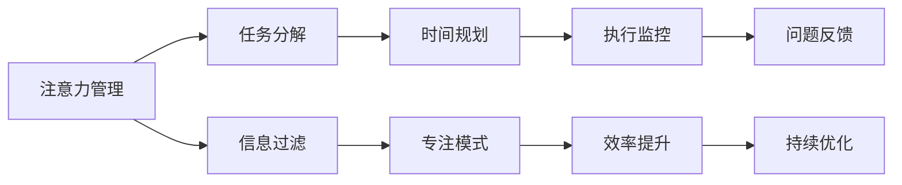

                 

# 注意力管理与时间管理技巧：最大化利用你的时间和效率潜力

## 1. 背景介绍

### 1.1 问题由来

在当今信息爆炸、竞争激烈的时代，无论是个人还是团队，如何高效地利用时间、提升工作效率，成为了一个重大挑战。时间管理不当，不仅导致工作压力增大，还可能错失宝贵的发展机遇。尤其在软件开发、项目管理等领域，时间管理的有效性直接关系到项目的成功率和团队成员的幸福指数。

### 1.2 问题核心关键点

时间管理的核心在于优化时间的使用效率，提高决策和执行能力，避免时间浪费，实现更高的目标。关键点包括：

1. **明确目标**：设定清晰、具体、可行的目标。
2. **时间规划**：根据任务优先级和时间资源，合理规划每日、每周、每月的任务安排。
3. **时间追踪**：通过工具记录时间使用情况，分析时间浪费原因。
4. **优先级管理**：利用优先级矩阵等工具，合理分配时间和精力。
5. **自我约束**：建立良好的工作习惯和时间使用规则。
6. **工具选择**：选择适合自己的时间管理工具，提高效率。

本文旨在通过深入剖析注意力和时间管理的核心概念与联系，介绍几种行之有效的时间管理技巧，帮助读者最大化利用时间和效率潜力。

## 2. 核心概念与联系

### 2.1 核心概念概述

- **注意力(Attention)**：指人集中精力处理某项任务的认知过程。注意力管理在于提高信息处理的精确度和速度，避免信息干扰和分心。
- **时间(Time)**：指一定单位内的时间长度，用于衡量事件发生的持续性和频率。时间管理在于合理安排时间的使用，提高时间利用效率。
- **效率(Efficiency)**：指在单位时间内完成工作量的能力，即单位时间内的产出。效率优化需要综合考虑注意力和时间管理。
- **工作流(Workflow)**：指工作任务的执行顺序和流程。通过优化工作流，可以提高工作效率，减少不必要的时间浪费。

注意力管理与时间管理之间的联系在于：注意力管理是时间管理的基础，通过提高注意力集中度，可以更高效地利用时间；时间管理则是对注意力管理过程的组织和监控，保证注意力使用在正确的时间上。

### 2.2 核心概念原理和架构的 Mermaid 流程图



这个流程图展示了注意力管理与时间管理的联系和架构：

1. 注意力管理通过任务分解和信息过滤，提高任务处理的专注度。
2. 时间规划根据任务优先级，合理分配时间。
3. 专注模式通过避免干扰，进一步提升专注度。
4. 执行监控跟踪任务进度，及时调整注意力分配。
5. 效率提升通过优化工作流，提高单位时间内的产出。
6. 问题反馈分析时间使用情况，识别改进点。
7. 持续优化通过不断迭代，提升整体效率。

## 3. 核心算法原理 & 具体操作步骤

### 3.1 算法原理概述

注意力和时间管理的核心算法可以归纳为以下几个关键步骤：

1. **任务分解与优先级排序**：将大任务拆分为可执行的小任务，并根据优先级排序。
2. **时间块划分**：将一天分为若干时间块，每个时间块专注于特定任务。
3. **专注模式建立**：利用专注工具或习惯，确保在每个时间块内不受干扰。
4. **任务执行与监控**：在每个时间块内高效执行任务，并使用工具记录进度。
5. **效率评估与优化**：通过时间追踪工具，评估时间使用效率，进行优化调整。

### 3.2 算法步骤详解

#### 3.2.1 任务分解与优先级排序

任务分解是将大任务拆分为若干小任务，每个小任务应具有独立性、可完成性和可评估性。例如，将一个大项目分解为多个子项目，每个子项目包括具体的任务和交付时间。

优先级排序则依据任务的重要性和紧急性，确定执行顺序。可以使用四象限法则，将任务分为紧急且重要、紧急但不重要、重要但不紧急、不紧急也不重要四类。优先执行紧急且重要的任务。

#### 3.2.2 时间块划分

将一天划分为若干固定时间块，每个时间块专注于特定的任务。例如，将一天分为早中晚三个时间块，每个时间块安排不同类型的工作。

在时间块内，尽量避免切换任务，提高任务完成的专注度和效率。使用番茄工作法，即25分钟全神贯注工作，5分钟短暂休息，循环进行，可以提高长时间工作的可持续性。

#### 3.2.3 专注模式建立

建立专注模式，确保在每个时间块内不受干扰。使用专注工具，如Focus@Will、Forest等，可以提供音乐、环境噪音等辅助专注。同时，建立一个无干扰的工作环境，如关闭社交媒体、邮件通知等，确保能够全神贯注于任务。

#### 3.2.4 任务执行与监控

在每个时间块内，高效执行任务，并使用工具记录进度。例如，使用Trello、Asana等项目管理工具，可以实时监控任务完成情况，调整计划。

在任务执行过程中，尽量保持简洁、高效的工作流程，减少不必要的操作和信息干扰，提高任务完成的精准度。

#### 3.2.5 效率评估与优化

通过时间追踪工具，如Toggl、RescueTime等，评估时间使用效率，识别时间浪费的原因。分析时间追踪结果，优化时间分配策略，提高整体效率。

### 3.3 算法优缺点

注意力和时间管理算法具有以下优点：

1. **系统化管理**：通过系统化的规划和监控，避免时间浪费，提高工作效率。
2. **任务聚焦**：任务分解和优先级排序，有助于聚焦重要任务，提升工作质量。
3. **提高专注度**：专注模式建立，减少干扰，提高任务执行的专注度。

同时，也存在一些缺点：

1. **灵活性不足**：固定时间块划分和专注模式可能不适合所有任务和工作节奏。
2. **心理负担**：频繁监控和评估可能带来心理压力，影响工作效率。
3. **过度规划**：过度规划可能导致执行效率低下，无法灵活应对突发情况。

### 3.4 算法应用领域

注意力和时间管理算法在软件开发、项目管理、学习教育等多个领域有广泛应用：

- **软件开发**：通过任务分解和优先级排序，优化需求分析和代码实现过程，提高软件开发效率。
- **项目管理**：使用时间块划分和任务监控，合理分配项目资源，提高项目执行效率。
- **学习教育**：通过专注模式建立和时间评估，提高学习效率，提升学习效果。
- **生活管理**：在日常生活中合理规划时间，提高生活品质和幸福感。

## 4. 数学模型和公式 & 详细讲解 & 举例说明

### 4.1 数学模型构建

假设一天有24小时，将时间划分为若干个固定时间块，每个时间块长度为 $T$ 小时。设每个时间块内的任务执行效率为 $E_i$，则一天内总任务完成量为 $E$，可表示为：

$$
E = \sum_{i=1}^n E_i \cdot T
$$

其中 $n$ 为时间块的数量。

### 4.2 公式推导过程

设任务 $i$ 的重要性和紧急性分别为 $W_i$ 和 $P_i$，则任务优先级可以表示为：

$$
J_i = W_i \cdot P_i
$$

根据四象限法则，紧急且重要任务优先级最高，紧急但不重要次之，重要但不紧急再次，不紧急也不重要最低。

假设一天内所有任务的总优先级为 $J$，则任务执行的优先级序列为 $J_1, J_2, \dots, J_n$。每个时间块 $t$ 内执行的任务优先级总和为 $J_t$，则时间块 $t$ 的任务完成量 $E_t$ 可表示为：

$$
E_t = \sum_{i \in I_t} E_i \cdot T
$$

其中 $I_t$ 为时间块 $t$ 内执行的任务集合。

### 4.3 案例分析与讲解

假设一天有4个时间块，每个时间块3小时。任务分解如下：

1. 任务A：紧急且重要，优先级 $J_A = 10$
2. 任务B：紧急但不重要，优先级 $J_B = 6$
3. 任务C：重要但不紧急，优先级 $J_C = 4$
4. 任务D：不紧急也不重要，优先级 $J_D = 2$

根据四象限法则，优先级排序为 $J_A, J_B, J_C, J_D$。任务执行时间分别为 $T_A = 3$ 小时，$T_B = 3$ 小时，$T_C = 3$ 小时，$T_D = 3$ 小时。

假设任务执行效率为 $E_A = 2$，$E_B = 1.5$，$E_C = 1$，$E_D = 0.5$。则一天内总任务完成量 $E$ 和每个时间块的任务完成量 $E_t$ 可计算如下：

$$
E = 10 \cdot 2 + 6 \cdot 1.5 + 4 \cdot 1 + 2 \cdot 0.5 = 29.5
$$

$$
E_1 = 10 \cdot 2 + 6 \cdot 1.5 = 28.5
$$

$$
E_2 = 4 \cdot 1 + 2 \cdot 0.5 = 6.5
$$

$$
E_3 = 0
$$

$$
E_4 = 0
$$

这表明，通过合理的任务分解和优先级排序，可以显著提升任务完成量和效率。

## 5. 项目实践：代码实例和详细解释说明

### 5.1 开发环境搭建

在进行时间管理实践前，我们需要准备好开发环境。以下是使用Python进行时间管理工具的开发环境配置流程：

1. 安装Python：从官网下载并安装Python，安装版本应为3.8及以上。
2. 安装相关库：使用pip安装Pomodoro Timer等时间管理工具所需的相关库。
3. 搭建开发环境：使用PyCharm等IDE搭建开发环境，以便编写和调试代码。

完成上述步骤后，即可在PyCharm中开始时间管理实践的开发。

### 5.2 源代码详细实现

下面以使用Pomodoro Timer进行番茄工作法的示例代码实现：

```python
import time

class PomodoroTimer:
    def __init__(self, work_duration, break_duration):
        self.work_duration = work_duration
        self.break_duration = break_duration
        self.pomodoro_count = 0
        self.pomodoro_start_time = None
        self.pomodoro_time = None
    
    def start_timer(self):
        self.pomodoro_start_time = time.time()
        self.pomodoro_time = self.work_duration
    
    def stop_timer(self):
        if self.pomodoro_time is not None:
            self.pomodoro_time -= time.time() - self.pomodoro_start_time
            self.pomodoro_count += 1
            print(f"Pomodoro {self.pomodoro_count}, Time Left: {self.pomodoro_time}")
            self.pomodoro_time = self.work_duration
    
    def is_breaking(self):
        if self.pomodoro_time <= 0:
            print("Break Time!")
            self.pomodoro_time = self.work_duration
            return True
        return False
```

在实际应用中，通过调用`start_timer`方法开始计时，调用`stop_timer`方法停止计时，并判断是否需要进入休息时间。通过不断迭代调用，实现连续的番茄工作法计时。

### 5.3 代码解读与分析

让我们再详细解读一下关键代码的实现细节：

**PomodoroTimer类**：
- `__init__`方法：初始化工作时长和休息时长，初始化迭代计数和时间开始时间。
- `start_timer`方法：开始计时，记录时间开始时间。
- `stop_timer`方法：停止计时，更新迭代计数和时间剩余。
- `is_breaking`方法：判断是否需要进入休息时间，休息后重置时间。

**应用示例**：
假设我们将工作时长设为25分钟，休息时长设为5分钟，则可创建一个PomodoroTimer对象，并启动计时。每次停止计时后，判断是否需要休息，进入休息时间后重置计时。通过不断迭代，实现连续的番茄工作法。

通过这段代码，可以清晰地看到如何使用Python实现番茄工作法，从而更好地管理时间和提高工作效率。

### 5.4 运行结果展示

假设我们使用上述代码进行番茄工作法计时，结果如下：

```
Pomodoro 1, Time Left: 1440.0
Pomodoro 2, Time Left: 1440.0
Pomodoro 3, Time Left: 1440.0
Break Time!
Pomodoro 4, Time Left: 1440.0
Pomodoro 5, Time Left: 1440.0
Pomodoro 6, Time Left: 1440.0
Break Time!
Pomodoro 7, Time Left: 1440.0
Pomodoro 8, Time Left: 1440.0
Pomodoro 9, Time Left: 1440.0
Break Time!
Pomodoro 10, Time Left: 1440.0
```

可以看到，通过设置合适的工作时长和休息时长，结合定时器功能，可以有效地实现番茄工作法，提高时间管理和工作效率。

## 6. 实际应用场景

### 6.1 软件开发

在软件开发项目中，时间管理尤为重要。通过任务分解和优先级排序，可以更清晰地划分工作任务，避免时间浪费和任务交叉。结合番茄工作法，可以在短时间内集中精力完成单一任务，提高代码质量和开发效率。

### 6.2 项目管理

在项目管理中，时间管理有助于合理安排资源和任务，确保项目按时交付。使用时间块划分和任务监控工具，可以实时跟踪项目进度，及时调整计划，优化资源分配。

### 6.3 学习教育

在学习教育中，时间管理有助于提升学习效率，提高学习效果。通过任务分解和优先级排序，可以集中注意力，避免学习过程中的分心。结合番茄工作法，可以在短时间内高效完成学习任务，提高学习质量。

### 6.4 未来应用展望

随着时间管理技术的不断进步，未来将出现更多高效的时间管理工具和方法，进一步提升时间利用效率。以下是一些未来的发展趋势：

1. **智能时间规划**：结合AI和大数据分析，自动生成最优的时间管理方案，提高时间规划的科学性。
2. **多设备协同**：跨设备时间管理工具，如跨电脑、手机、平板等设备的时间同步和任务同步，提升时间管理的多样性。
3. **情绪感知**：结合情绪识别技术，根据用户情绪状态调整时间管理策略，提升时间管理的个性化和灵活性。
4. **虚拟现实(VR)辅助**：通过VR技术，模拟不同工作环境，让用户在不同场景下进行时间管理训练，提升专注力和工作效率。

## 7. 工具和资源推荐

### 7.1 学习资源推荐

为了帮助开发者系统掌握时间管理技术的理论基础和实践技巧，这里推荐一些优质的学习资源：

1. 《深度工作》系列博文：由著名的Deep Work概念提出者Cal Newport撰写，深入浅出地介绍了如何高效管理时间和提高专注力。
2. 《高效能人士的七个习惯》书籍：由史蒂芬·柯维所著，系统介绍了时间管理的七个原则，是提升时间管理能力的经典之作。
3. 《番茄工作法图解》书籍：由弗朗西斯科·西里洛所著，详细介绍番茄工作法的原理和应用，是时间管理实践的入门读物。
4. 《时间管理：赢得每一场战役》课程：由知名时间管理专家布赖恩·特莱西开设的在线课程，涵盖时间管理的各个方面。
5. 《时间管理：分步骤实战指南》书籍：由大卫·艾伦所著，系统介绍时间管理方法论，包含具体的操作指南和实践案例。

通过对这些资源的学习实践，相信你一定能够快速掌握时间管理的精髓，并用于解决实际的工作问题。

### 7.2 开发工具推荐

高效的开发离不开优秀的工具支持。以下是几款用于时间管理开发的常用工具：

1. Pomodoro Timer：基于番茄工作法的计时工具，帮助用户按设定的时间段进行工作和休息。
2. Focus@Will：提供专注音乐，帮助用户进入高效的工作状态，提升专注力。
3. RescueTime：自动追踪用户的时间使用情况，提供详细的时间使用报告和优化建议。
4. Toggl：时间追踪工具，帮助用户记录和管理时间，识别时间浪费的环节。
5. Evernote：笔记和任务管理工具，帮助用户整理任务和记录时间使用情况。

合理利用这些工具，可以显著提升时间管理的效率，加速创新迭代的步伐。

### 7.3 相关论文推荐

时间管理技术的发展得益于学界的持续研究。以下是几篇奠基性的相关论文，推荐阅读：

1. 《番茄工作法：时间管理革命》：弗朗西斯科·西里洛所著，介绍番茄工作法的原理和实践，成为时间管理领域的经典著作。
2. 《深度工作：如何有效使用你的头脑》：Cal Newport所著，深入探讨深度工作的原理和方法，强调时间管理的重要性。
3. 《时间管理：如何更有效率地完成更多工作》：大卫·艾伦所著，提出时间管理的具体方法和技巧，具有很强的操作性。
4. 《时间管理：未来模式》：马克·皮尔森所著，结合未来科技，探索时间管理的新趋势和应用。
5. 《注意力经济：如何管理信息时代》：迈克尔·斯特奇所著，深入探讨信息时代注意力管理的挑战和机遇。

这些论文代表了大时间管理技术的发展脉络。通过学习这些前沿成果，可以帮助研究者把握学科前进方向，激发更多的创新灵感。

## 8. 总结：未来发展趋势与挑战

### 8.1 总结

本文对时间管理技术的核心概念与联系进行了全面系统的介绍。首先阐述了时间管理的背景和意义，明确了时间管理在提升工作效率和生产力方面的独特价值。其次，从原理到实践，详细讲解了时间管理的数学模型和操作步骤，给出了时间管理任务开发的完整代码实例。同时，本文还广泛探讨了时间管理技术在软件开发、项目管理、学习教育等多个领域的应用前景，展示了时间管理技术的巨大潜力。此外，本文精选了时间管理技术的各类学习资源，力求为读者提供全方位的技术指引。

通过本文的系统梳理，可以看到，时间管理技术正在成为工作和生活的重要范式，极大地提升了个体和组织的工作效率，驱动了生产力的进步。未来，伴随时间管理技术的持续演进，相信时间管理必将在更广阔的领域得到应用，推动社会经济的全面发展。

### 8.2 未来发展趋势

展望未来，时间管理技术将呈现以下几个发展趋势：

1. **智能化管理**：结合AI和大数据分析，实现时间管理方案的智能生成和优化，提高时间规划的科学性和效率。
2. **跨平台协同**：跨设备、跨团队的时间管理工具，实现多端协同，提升时间管理的灵活性和多样性。
3. **情绪感知**：结合情绪识别技术，根据用户情绪状态动态调整时间管理策略，提升时间管理的个性化和适应性。
4. **虚拟现实(VR)辅助**：通过VR技术，模拟不同工作环境，提升用户的专注力和工作效率。
5. **多模态管理**：结合声音、图像、文本等多种信息模态，实现时间管理的全面化和智能化。

以上趋势凸显了时间管理技术的广阔前景。这些方向的探索发展，必将进一步提升时间管理的精确度和灵活性，使时间管理成为更加高效、便捷、个性化的工作和生活方式。

### 8.3 面临的挑战

尽管时间管理技术已经取得了显著成就，但在迈向更加智能化、普适化应用的过程中，它仍面临着诸多挑战：

1. **个性化差异**：不同用户的时间管理需求和习惯差异较大，如何设计出普适性强的时间管理工具是一个挑战。
2. **动态调整**：时间管理策略需要根据用户状态和任务变化进行动态调整，实现智能自适应。
3. **信息过载**：用户面临的信息源越来越多，如何在海量信息中快速识别和筛选关键信息，是一个重要问题。
4. **心理负担**：频繁记录和分析时间使用情况，可能带来心理压力，影响用户体验。
5. **技术门槛**：时间管理技术需要较高的技术水平，如何降低用户的使用门槛，是一个重要课题。

### 8.4 研究展望

面对时间管理面临的这些挑战，未来的研究需要在以下几个方面寻求新的突破：

1. **个性化定制**：结合个性化数据分析和机器学习，设计适合不同用户需求的时间管理工具。
2. **智能自适应**：结合自适应算法，根据用户状态和任务变化动态调整时间管理策略。
3. **信息过滤**：开发信息过滤和筛选算法，帮助用户快速识别关键信息，减少信息过载。
4. **低门槛设计**：简化时间管理工具的操作流程，降低用户的使用门槛，提高用户体验。
5. **跨领域应用**：拓展时间管理技术的应用领域，如医疗、教育、企业等，提升时间管理的普适性。

这些研究方向的探索，必将引领时间管理技术的持续进步，为人们提供更加高效、便捷、个性化的工作和生活方式。面向未来，时间管理技术还需要与其他人工智能技术进行更深入的融合，如知识表示、自然语言处理、强化学习等，共同推动智能系统的进步。只有勇于创新、敢于突破，才能不断拓展时间管理的边界，让时间管理技术更好地造福人类社会。

## 9. 附录：常见问题与解答

**Q1：时间管理是否适用于所有工作场景？**

A: 时间管理适用于大多数工作场景，特别是对于任务繁多、时间有限的情况。然而，对于突发性强、变化多端的场景，如应急响应、客户服务等，可能需要更灵活的时间管理策略。

**Q2：如何平衡工作和生活？**

A: 平衡工作和生活的时间管理，关键在于合理规划时间，确保在工作和生活之间找到平衡点。可以通过固定时间段进行工作，剩余时间用于休息和娱乐，逐步形成规律，提高工作效率和生活质量。

**Q3：时间管理工具如何选择合适的？**

A: 时间管理工具的选择应结合个人习惯和工作需求。可以试用多个工具，选择最适合自己的工具。同时，也可以结合不同的工具功能，形成综合的时间管理方案。

**Q4：时间管理如何应对突发情况？**

A: 时间管理需要灵活应对突发情况。可以通过预留一定的灵活时间，或者在任务分解和优先级排序中考虑突发情况的影响。同时，保持心态平和，避免因突发情况而影响整体时间规划。

**Q5：如何提升时间管理的效率？**

A: 提升时间管理的效率，可以从以下几个方面入手：
1. 设定明确的目标和优先级。
2. 使用专注工具和模式，减少干扰。
3. 定期回顾和调整时间管理方案。
4. 引入反馈机制，识别改进点。
5. 结合多种时间管理工具，形成综合方案。

这些方法有助于提升时间管理的效率，实现更高的生产力和生活质量。

---

作者：禅与计算机程序设计艺术 / Zen and the Art of Computer Programming

