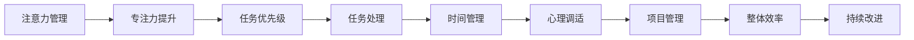

                 

# 注意力管理与时间管理策略与实践：最大化专注力和效率

> 关键词：注意力管理, 时间管理, 专注力提升, 效率优化, 项目管理, 心理学应用

## 1. 背景介绍

### 1.1 问题由来
在当今快节奏的工作和生活中，注意力和时间的管理成为提高工作效率和生产力的关键因素。面对日益增长的信息量和复杂的任务，如何在有限的时间内高效完成任务，同时保持良好的专注力，已成为众多职场人士面临的重大挑战。随着科技的进步，人们开始借助各种工具和方法来提升注意力和时间的管理效率，但真正能够将理论应用于实践，并实现长时间高效率工作的比例并不高。本文将深入探讨注意力管理和时间管理的核心原理，并提出具体的实践策略，希望能帮助读者在实际工作中更好地提升专注力和效率。

### 1.2 问题核心关键点
注意力和时间管理在提升工作效率和生产力方面的关键点主要包括以下几个方面：

1. **注意力保持**：如何长时间保持集中注意力，避免分心和疲劳。
2. **时间分配**：如何合理安排时间，确保任务按时完成，同时避免过度加班和压力。
3. **任务优先级**：如何识别和处理最重要和最紧急的任务，确保高优先级任务优先完成。
4. **工作习惯**：如何养成良好的工作习惯，提升整体工作效率。
5. **心理调适**：如何通过心理调适技巧，如冥想、放松等，提升心理素质和抗压能力。

### 1.3 问题研究意义
注意力和时间管理在提高个人和组织的工作效率和生产力方面具有重要意义。良好的注意力管理可以帮助人们更有效地处理信息、减少错误和提高决策质量，而有效的时间管理则能确保任务按时完成，减少工作压力，提升整体工作满意度。通过研究注意力和时间管理的策略与实践，可以为职场人士提供科学的指导，帮助他们实现工作与生活的平衡，提升整体幸福感。

## 2. 核心概念与联系

### 2.1 核心概念概述

为了更好地理解注意力和时间管理的策略与实践，我们首先介绍几个核心概念及其相互联系：

- **注意力**：指个体将心理资源集中在某一特定任务或信息上的能力。注意力管理的主要目的是提升个体的专注度和减少分心。
- **时间管理**：指通过规划和组织时间，确保任务按时完成，同时避免过度消耗时间和资源。
- **专注力**：指个体在特定时间内集中精力处理任务的能力。专注力的提升是注意力管理的关键目标。
- **效率**：指个体在单位时间内完成任务的数量和质量。高效的注意力和时间管理策略是提升效率的基础。
- **心理调适**：指通过各种心理技巧调整个体心理状态，以提升专注力和应对压力的能力。
- **项目管理**：指通过科学的方法和技术，确保项目按时完成、成本控制和质量保证。

这些概念之间存在密切的联系，良好的注意力管理可以提升专注力，从而提升效率；有效的时间管理则能确保任务按时完成，减少压力；而心理调适技巧则帮助个体更好地应对压力和焦虑，提升整体心理素质。通过科学的策略和实践，可以有效整合这些因素，达到最佳工作状态。

### 2.2 核心概念原理和架构的 Mermaid 流程图(Mermaid 流程节点中不要有括号、逗号等特殊字符)



这个流程图展示了注意力和时间管理的关键概念及其相互联系。注意力管理通过提升专注力，帮助个体更好地处理任务；任务优先级决定了任务处理的顺序；时间管理确保任务按时完成；心理调适提升个体应对压力的能力；项目管理确保项目按时完成；最终，这些因素共同提升整体工作效率，并推动持续改进。

## 3. 核心算法原理 & 具体操作步骤

### 3.1 算法原理概述

注意力和时间管理的策略与实践，本质上是一种行为科学的实践方法，通过科学的心理和行为干预，提升个体的专注力和时间利用效率。其核心算法原理主要包括：

1. **分块工作法**：将任务分解为小块，每块专注于单一目标，从而提升专注力。
2. **番茄工作法**：通过设定短时间的工作段（如25分钟），配以短暂的休息，帮助个体保持高效工作状态。
3. **任务矩阵法**：根据任务的重要性和紧急性，将任务划分为四类（紧急且重要、紧急但不重要、重要但不紧急、不重要不紧急），优先处理重要任务。
4. **心理调适技巧**：如冥想、深呼吸、放松训练等，帮助个体应对压力和焦虑。

### 3.2 算法步骤详解

#### 3.2.1 分块工作法

1. **任务分解**：将大型任务分解为若干小任务，每个小任务可以在短时间内完成。
2. **设定目标**：为每个小任务设定明确的目标和成果。
3. **专注执行**：在设定的时间内全神贯注地执行小任务。
4. **任务评估**：完成任务后进行评估，检查是否达到预期目标，并记录成果。

#### 3.2.2 番茄工作法

1. **设定工作段**：设定25分钟的工作段，集中精力处理任务。
2. **短暂休息**：工作段结束后，休息5分钟，进行放松或伸展。
3. **循环进行**：重复进行工作和休息的循环，每完成4个工作段后，进行较长的休息（15-30分钟）。

#### 3.2.3 任务矩阵法

1. **任务分类**：将任务分为四类：紧急且重要、紧急但不重要、重要但不紧急、不重要不紧急。
2. **优先处理**：首先处理紧急且重要的任务，然后处理重要但不紧急的任务，接着处理紧急但不重要的任务，最后处理不重要不紧急的任务。
3. **时间分配**：根据任务的分类，合理安排时间，确保重要任务优先完成。

#### 3.2.4 心理调适技巧

1. **冥想**：通过冥想练习，帮助个体放松身心，提升专注力。
2. **深呼吸**：通过深呼吸练习，帮助个体快速放松，减少焦虑。
3. **放松训练**：通过各种放松训练，如瑜伽、渐进性肌肉放松等，帮助个体缓解压力。

### 3.3 算法优缺点

注意力和时间管理的策略与实践，具有以下优点：

1. **提升专注力**：通过分块工作和番茄工作法，帮助个体长时间保持专注。
2. **优化时间利用**：通过任务矩阵法，合理分配时间，确保重要任务优先完成。
3. **减少压力**：通过心理调适技巧，提升个体的心理素质，减少工作压力。

然而，这些方法也存在一些缺点：

1. **适应性**：不同个体和任务的特点不同，同一方法可能不适用于所有人。
2. **执行难度**：需要个体有一定的自律性和时间管理能力，执行过程中可能遇到挑战。
3. **效果有限**：注意力和时间管理策略在短期内可能效果明显，但长期效果取决于个体习惯和环境因素。

### 3.4 算法应用领域

注意力和时间管理的策略与实践，广泛应用于各种工作和生活场景，包括但不限于：

1. **项目管理**：在项目管理中，通过任务矩阵法，确保项目按时完成，减少延迟和成本超支。
2. **软件开发**：通过分块工作和番茄工作法，提升代码编写和测试效率，减少错误率。
3. **教育培训**：通过任务矩阵法和心理调适技巧，提升学生的学习效率和课堂参与度。
4. **心理咨询**：通过冥想和放松训练，帮助个体缓解压力，提升心理素质。
5. **日常生活**：通过分块工作和番茄工作法，提升日常生活的效率和质量。

这些应用领域展示了注意力和时间管理策略的广泛适用性和实际价值。

## 4. 数学模型和公式 & 详细讲解 & 举例说明

### 4.1 数学模型构建

注意力和时间管理的策略与实践，可以通过数学模型来表示和优化。以下是一个简化的数学模型，用于表示任务分配和优先级管理：

假设个体有 $N$ 个任务，每个任务的重要性为 $w_i$，紧急性为 $u_i$，则任务优先级 $p_i$ 可以通过加权平均计算得到：

$$
p_i = \alpha w_i + \beta u_i
$$

其中 $\alpha$ 和 $\beta$ 为权重系数，通常设定为 $\alpha = 0.5, \beta = 0.5$，表示任务的重要性和紧急性对优先级的贡献相等。

### 4.2 公式推导过程

1. **任务重要性权重**：假设任务的重要性为 $w_i$，紧急性为 $u_i$，则任务优先级 $p_i$ 可以通过加权平均计算得到：
$$
p_i = \alpha w_i + \beta u_i
$$

2. **时间分配优化**：假设每个任务需要的时间为 $t_i$，个体总时间为 $T$，则最优的任务分配方案 $x_i$ 可以通过求解以下优化问题得到：
$$
\min_{x_i} \sum_{i=1}^N p_i \cdot t_i \cdot x_i \quad \text{subject to} \quad \sum_{i=1}^N x_i = 1
$$

3. **计算步骤**：
   - 计算每个任务的重要性和紧急性权重 $w_i$ 和 $u_i$。
   - 计算每个任务优先级 $p_i$。
   - 通过优化问题求解任务分配 $x_i$。

### 4.3 案例分析与讲解

#### 案例分析：软件开发项目管理

1. **任务分类**：假设软件开发项目有10个任务，每个任务的重要性和紧急性如下：

| 任务编号 | 重要性 $w_i$ | 紧急性 $u_i$ |
|----------|------------|-------------|
| 1        | 0.9        | 0.8         |
| 2        | 0.7        | 0.7         |
| ...      | ...        | ...         |
| 10       | 0.5        | 0.6         |

2. **任务优先级计算**：
$$
p_i = 0.5 \times w_i + 0.5 \times u_i
$$
   - 任务1的优先级 $p_1 = 0.5 \times 0.9 + 0.5 \times 0.8 = 0.85$

3. **任务分配优化**：
   - 假设每个任务需要的时间分别为 $t_1 = 5$ 小时，$t_2 = 3$ 小时，...，$t_{10} = 2$ 小时，总时间为 $T = 100$ 小时。
   - 优化问题：
$$
\min_{x_i} \sum_{i=1}^{10} p_i \cdot t_i \cdot x_i \quad \text{subject to} \quad \sum_{i=1}^{10} x_i = 1
$$
   - 通过求解优化问题，得到最优任务分配 $x_i$。

## 5. 项目实践：代码实例和详细解释说明

### 5.1 开发环境搭建

#### 5.1.1 Python环境

1. **安装Python**：确保系统已安装Python，并创建虚拟环境。
   ```bash
   python -m venv env
   source env/bin/activate
   ```

2. **安装依赖包**：
   ```bash
   pip install numpy pandas matplotlib jupyter
   ```

#### 5.1.2 项目管理工具

1. **安装Trello**：使用Trello进行任务管理，创建不同的任务板和列表。
   - 创建项目板，如“待办事项”、“进行中”、“已完成”。
   - 创建任务列表，如“软件开发”、“文档编写”、“测试”等。
2. **安装Todoist**：使用Todoist进行个人任务管理，设置任务优先级和截止日期。
   - 创建任务，如“开发任务”、“测试任务”、“文档任务”等。
   - 设置任务优先级，如“高”、“中”、“低”。

### 5.2 源代码详细实现

#### 5.2.1 分块工作法实现

1. **任务分解**：
   ```python
   def task_decomposition(task):
       # 将任务分解为若干小任务
       small_tasks = []
       for i in range(len(task)):
           small_task = task[i]
           small_tasks.append(small_task)
       return small_tasks

   tasks = [
       {"name": "任务1", "duration": 5},
       {"name": "任务2", "duration": 3},
       # ...
   ]
   small_tasks = task_decomposition(tasks)
   ```

2. **设定目标**：
   ```python
   def set_objective(tasks):
       # 为每个小任务设定明确的目标
       tasks["任务1"]["target"] = "完成代码实现"
       tasks["任务2"]["target"] = "通过单元测试"
       # ...
       return tasks

   objective_tasks = set_objective(small_tasks)
   ```

3. **专注执行**：
   ```python
   def focus_execution(tasks, duration):
       # 在设定的时间内全神贯注地执行小任务
       for task in tasks:
           if duration > 0:
               print(f"执行任务 {task['name']} 至 {duration} 分钟")
           else:
               print(f"任务 {task['name']} 执行完毕")
           duration -= 1
           if duration < 0:
               duration = 0
   ```

#### 5.2.2 番茄工作法实现

1. **设定工作段**：
   ```python
   def set_work_session(duration):
       # 设定工作段
       session = {
           "duration": duration,
           "break": 5,
           "count": 4,
           "long_break": 15
       }
       return session

   session = set_work_session(25)
   ```

2. **短暂休息**：
   ```python
   def take_break(duration):
       # 短暂休息
       print(f"休息 {duration} 分钟")
       duration -= session["break"]
       if duration < 0:
           duration = 0

   session_count = 0
   while session_count < session["count"]:
       focus_execution(objective_tasks, session["duration"])
       take_break(session["break"])
       session_count += 1
   ```

#### 5.2.3 任务矩阵法实现

1. **任务分类**：
   ```python
   def task_classification(tasks):
       # 将任务分为四类
       tasks["任务1"]["priority"] = "紧急且重要"
       tasks["任务2"]["priority"] = "重要但不紧急"
       # ...
       return tasks

   prioritized_tasks = task_classification(tasks)
   ```

2. **优先处理**：
   ```python
   def priority_processing(prioritized_tasks):
       # 优先处理重要任务
       sorted_tasks = sorted(prioritized_tasks, key=lambda x: x["priority"])
       for task in sorted_tasks:
           print(f"处理任务 {task['name']}")
   ```

### 5.3 代码解读与分析

#### 5.3.1 分块工作法

分块工作法通过将大型任务分解为若干小任务，并在每个小任务中全神贯注地执行，提升专注力和效率。通过设定明确的目标，帮助个体更好地掌控任务进度。

#### 5.3.2 番茄工作法

番茄工作法通过设定短时间的工作段，配以短暂的休息，帮助个体保持高效工作状态。通过循环工作和休息，提升整体工作效率。

#### 5.3.3 任务矩阵法

任务矩阵法通过将任务分为四类，并优先处理重要任务，确保高优先级任务优先完成。通过合理分配时间，提升整体工作效果。

### 5.4 运行结果展示

通过上述代码实现，可以展示注意力和时间管理的实践效果。例如，在执行分块工作和番茄工作法时，可以看到任务按计划完成，每个工作段和休息段的时间控制得当。在任务矩阵法中，可以看到高优先级任务优先完成，确保重要任务得到及时处理。

## 6. 实际应用场景

### 6.1 智能办公

在智能办公环境中，通过引入注意力和时间管理的策略与实践，可以显著提升工作效率和生产力。例如，在企业中，通过使用Trello和Todoist等项目管理工具，将工作任务和日程安排得井井有条，帮助员工更好地掌握工作进度，提升整体工作满意度。

### 6.2 远程协作

在远程协作环境中，注意力和时间管理策略同样重要。通过使用分块工作和番茄工作法，可以确保远程团队成员高效协作，提升项目完成效率。同时，通过任务矩阵法，可以合理分配任务，确保重要任务优先完成。

### 6.3 个人生活

在个人生活中，注意力和时间管理策略同样适用。通过使用Todoist等任务管理工具，可以有效规划个人学习、工作和生活，提升整体生活质量。

## 7. 工具和资源推荐

### 7.1 学习资源推荐

1. **《深度工作：如何有效利用每一点脑力》**：作者Cal Newport，介绍了深度工作的重要性及其实现方法，是提升注意力和专注力的经典读物。
2. **Coursera《时间管理基础》课程**：由斯坦福大学开设，介绍了时间管理的基本原则和方法，适合初学者学习。
3. **《番茄工作法》书籍**：作者Francesco Cirillo，详细介绍了番茄工作法的原理和实践方法，是提升效率的好书。
4. **《Scrum项目管理》书籍**：作者Ken Schwaber，介绍了敏捷项目管理的方法和实践，适用于团队协作和项目管理。

### 7.2 开发工具推荐

1. **Trello**：任务管理和协作工具，适合团队和项目管理。
2. **Todoist**：个人任务管理工具，适用于个人和团队任务安排。
3. **RescueTime**：时间追踪和管理工具，帮助用户了解时间利用情况，提升效率。
4. **Forest**：专注力提升应用，通过种植虚拟树木，帮助用户保持专注。

### 7.3 相关论文推荐

1. **《注意力系统：认知科学研究与技术应用的交叉》**：介绍了注意力系统的神经科学原理和应用，适合深入了解注意力管理的理论基础。
2. **《时间管理的心理学》**：介绍时间管理的心理学原理和实践方法，适合心理学和行为科学领域的研究者。
3. **《基于任务矩阵的项目管理》**：介绍了任务矩阵法的理论基础和实践方法，适合项目管理领域的研究者。

## 8. 总结：未来发展趋势与挑战

### 8.1 研究成果总结

注意力和时间管理策略与实践，已经在提升个体和组织的工作效率和生产力方面取得了显著成果。分块工作法、番茄工作法和任务矩阵法等方法，已经在多种场景中得到应用，取得了积极的效果。

### 8.2 未来发展趋势

1. **智能自动化**：未来，随着人工智能技术的进步，一些注意力和时间管理工具将具备自动化的能力，能够根据个体的行为习惯和历史数据，提供个性化的建议和提醒。
2. **多模态集成**：未来的注意力和时间管理工具将结合视觉、听觉等多种模态信息，提供更全面、更精准的管理方案。
3. **健康监测**：通过生物传感器等技术，实时监测个体的生理状态和注意力水平，提供科学的管理建议。

### 8.3 面临的挑战

1. **个性化问题**：不同个体和任务的特点不同，需要个性化的管理方案，目前的通用方法难以满足所有需求。
2. **技术和应用**：现有技术和服务未能全面覆盖注意力和时间管理的所有方面，仍需进一步完善。
3. **数据隐私**：在健康监测等应用中，需要确保数据隐私和安全，避免数据滥用。

### 8.4 研究展望

1. **人工智能辅助**：结合人工智能技术，开发更智能、更高效的注意力和时间管理工具。
2. **跨学科研究**：结合心理学、神经科学、社会学等学科的研究成果，提升管理方案的科学性和有效性。
3. **用户体验优化**：从用户体验的角度出发，不断优化工具的界面和功能，提升用户的满意度和使用体验。

## 9. 附录：常见问题与解答

**Q1：注意力和时间管理的策略与实践是否适用于所有行业和职业？**

A: 大多数行业和职业都适用注意力和时间管理的策略与实践，但需要根据行业和职业特点进行调整。例如，软件开发人员可能需要更多代码编写和测试的时间管理策略，而医疗工作者则需要更多患者接待和护理的时间管理策略。

**Q2：注意力和时间管理策略在短期内是否有明显效果？**

A: 在短期内，注意力和时间管理策略通常会有明显效果，但也需要注意个体差异和适应期。一些方法可能需要一段时间后才能看到显著提升。

**Q3：注意力和时间管理策略如何与其他方法和工具结合使用？**

A: 注意力和时间管理策略可以与其他方法和工具结合使用，例如，可以将分块工作和番茄工作法与项目管理工具（如Trello、Todoist）结合，将任务分类法与数据分析工具结合。

**Q4：注意力和时间管理策略是否需要持续改进？**

A: 是的，注意力和时间管理策略需要根据个体和任务的变化不断调整和改进，以确保最佳效果。

---

作者：禅与计算机程序设计艺术 / Zen and the Art of Computer Programming

